**相关笔记：** [[4.5 同余的应用]] | [[5.1 数学归纳法]]

> [!abstract] 概览
> 本节系统介绍了==密码学==（Cryptography）的基本概念与核心算法，从古典密码到现代公钥密码学，涵盖了密码学的主要分支。主要内容包括：
>
> - ==对称密钥密码==（私钥密码）：==凯撒密码==、==移位密码==、==仿射密码==、==维吉尼亚密码==、==换位密码==
> - ==密码分析==（Cryptanalysis）：基于字母频率分析破解移位密码
> - ==密码系统==的形式化定义：五元组 $(\mathcal{P}, \mathcal{C}, \mathcal{K}, \mathcal{E}, \mathcal{D})$
> - ==公钥密码学==的基本思想：加密密钥公开，解密密钥保密
> - ==RSA 密码系统==的完整推导：密钥生成、加密 $c = m^e \bmod n$、解密 $m = c^d \bmod n$
> - RSA 安全性的数学基础：大整数分解的计算困难性
> - ==Diffie-Hellman 密钥交换协议==：基于[[4.4 解同余方程|离散对数问题]]的安全密钥协商
> - ==数字签名==：利用 RSA 实现消息认证与不可否认性
> - ==同态加密==：RSA 的乘法同态性与全同态加密的前沿进展

---

## 一、知识结构总览

```mermaid
graph TB
    A["4.6 密码学 Cryptography"] --> B["古典密码学（对称密钥）"]
    A --> C["密码分析"]
    A --> D["密码系统形式化"]
    A --> E["公钥密码学"]
    A --> F["RSA 密码系统"]
    A --> G["密码协议"]
    A --> H["同态加密"]

    B --> B1["凯撒密码 Caesar Cipher"]
    B --> B2["移位密码 Shift Cipher"]
    B --> B3["仿射密码 Affine Cipher"]
    B --> B4["维吉尼亚密码 Vigenere Cipher"]
    B --> B5["换位密码 Transposition Cipher"]

    C --> C1["字母频率分析"]
    C --> C2["穷举攻击"]

    D --> D1["五元组 (P, C, K, E, D)"]
    D --> D2["加密函数 E_k"]
    D --> D3["解密函数 D_k"]

    E --> E1["公钥 vs 私钥"]
    E --> E2["加密不蕴含解密"]
    E --> E3["AES 私钥标准"]

    F --> F1["密钥生成：n=pq, gcd(e,φ)=1"]
    F --> F2["加密：c = m^e mod n"]
    F --> F3["解密：m = c^d mod n"]
    F --> F4["正确性证明（费马小定理+CRT）"]
    F --> F5["安全性：大整数分解困难"]

    G --> G1["Diffie-Hellman 密钥交换"]
    G --> G2["数字签名 Digital Signatures"]
    G --> G3["签名+加密的秘密通信"]

    H --> H1["RSA 乘法同态"]
    H --> H2["全同态加密 FHE"]
```

---

## 二、核心思想

> [!tip] 核心思想
> 本节的核心思想是==信息的加密与解密==，即如何通过数学变换将明文（plaintext）转换为密文（ciphertext），使得只有拥有特定知识（密钥）的人才能恢复原始信息。密码学的发展经历了从==对称密钥==（加密和解密使用相同或易互推的密钥）到==公钥密码学==（加密密钥公开，解密密钥保密）的重大飞跃。RSA 系统是公钥密码学的里程碑，其安全性建立在==大整数分解==的计算困难性之上。而 Diffie-Hellman 密钥交换则利用了[[4.4 解同余方程|离散对数问题]]的计算困难性，使得双方可以在不安全信道上协商共享密钥。

### 1. 凯撒密码与移位密码

> [!def] 凯撒密码（Caesar Cipher）
> 凯撒密码是最古老的加密方法之一，由 Julius Caesar 使用。将每个字母在字母表中==向后移动 3 位==：
>
> $$f(p) = (p + 3) \bmod 26$$
>
> 其中 $p \in \mathbb{Z}_{26}$ 是字母的数值编码（$A=0, B=1, \ldots, Z=25$）。
>
> 解密函数：$f^{-1}(p) = (p - 3) \bmod 26$。

> [!def] 移位密码（Shift Cipher）
> 凯撒密码的推广，将移位量从固定的 3 推广为任意整数 $k$：
>
> $$f(p) = (p + k) \bmod 26$$
>
> 解密函数：$f^{-1}(p) = (p - k) \bmod 26$。
>
> 整数 $k$ 称为==密钥（key）==。

> [!example] 例1：凯撒密码加密
> 用凯撒密码加密 "MEET YOU IN THE PARK"：
>
> 将字母转为数值：M=12, E=4, E=4, T=19, Y=24, O=14, U=20, I=8, N=13, T=19, H=7, E=4, P=15, A=0, R=17, K=10
>
> 加密 $f(p) = (p+3) \bmod 26$：15, 7, 7, 22, 1, 17, 23, 11, 16, 22, 10, 7, 18, 3, 20, 13
>
> 转回字母：**PHHW BRX LQ WKH SDUN**

> [!example] 例2：移位密码加密（$k=11$）
> 加密 "STOP GLOBAL WARMING"，密钥 $k = 11$：
>
> S=18→3, T=19→4, O=14→25, P=15→0, G=6→17, L=11→22, O=14→25, B=1→12, A=0→11, L=11→22, W=22→7, A=0→11, R=17→2, M=12→23, I=8→19, N=13→24, G=6→17
>
> 密文：**DEZA RWZMLW HLCXTYR**

> [!example] 例3：移位密码解密（$k=7$）
> 解密密文 "LEWLYPLUJL PZ H NYLHA ALHJOLY"，密钥 $k = 7$：
>
> 解密 $f^{-1}(p) = (p-7) \bmod 26$：
>
> L=11→4(E), E=4→23(X), W=22→15(P), ...
>
> 明文：**EXPERIENCE IS A GREAT TEACHER**

### 2. 仿射密码

> [!def] 仿射密码（Affine Cipher）
> 仿射密码使用形如
>
> $$f(p) = (ap + b) \bmod 26$$
>
> 的加密函数，其中 $a, b$ 为整数。$f$ 是双射当且仅当 $\gcd(a, 26) = 1$。
>
> ==解密方法==：已知密文 $c = (ap + b) \bmod 26$，则
>
> $$c - b \equiv ap \pmod{26}$$
> $$p \equiv \bar{a}(c - b) \pmod{26}$$
>
> 其中 $\bar{a}$ 是 $a$ 模 $26$ 的==逆元==（由 [[4.4 解同余方程|Theorem 1]] 保证存在）。

> [!example] 例4：仿射密码加密
> 用 $f(p) = (7p + 3) \bmod 26$ 加密字母 K：
>
> K 的数值为 $10$。$f(10) = (7 \times 10 + 3) \bmod 26 = 73 \bmod 26 = 21$。
>
> $21$ 代表 V，因此 K 被替换为 V。

### 3. 密码分析

> [!def] 密码分析（Cryptanalysis）
> ==密码分析==是在不知道加密方法和密钥的情况下，从密文恢复明文的过程。
>
> 对于==移位密码==，主要工具是==字母频率分析==：
>
> 英文中最常见的 9 个字母及其近似频率：
>
> | 字母 | E | T | A | O | I | N | S | H | R |
> |:----:|:-:|:-:|:-:|:-:|:-:|:-:|:-:|:-:|:-:|
> | 频率 | 13% | 9% | 8% | 8% | 7% | 7% | 7% | 6% | 6% |

> [!example] 例5：频率分析破解移位密码
> 截获密文 "ZNK KGXRE HOXJ MKZY ZNK CUXS"，已知使用移位密码。
>
> 统计密文字母频率，最常见字母为 K。
>
> 假设 K 对应明文 E：$10 = 4 + k \pmod{26}$，得 $k = 6$。
>
> 用 $k = 6$ 解密（每个字母移位 $-6$）：**THE EARLY BIRD GETS THE WORM**
>
> 消息有意义，假设正确。

### 4. 换位密码与维吉尼亚密码

> [!def] 换位密码（Transposition Cipher, Example 6）
> ==换位密码==是一种==分组密码==（block cipher），使用集合 $\{1, 2, \ldots, m\}$ 的一个==排列== $\sigma$ 作为密钥。将明文分成大小为 $m$ 的块，每块 $p_1 p_2 \cdots p_m$ 加密为 $c_1 c_2 \cdots c_m = p_{\sigma(1)} p_{\sigma(2)} \cdots p_{\sigma(m)}$。
>
> 解密使用逆排列 $\sigma^{-1}$。

> [!example] 例6：换位密码加密与解密
> 排列 $\sigma$：$\sigma(1)=3, \sigma(2)=1, \sigma(3)=4, \sigma(4)=2$。
>
> (a) 加密 "PIRATE ATTACK"：分块 PIRA TEAT TACK → IAPR ETTA AKTC
>
> (b) 解密 "SWUE TRAE OEHS"：$\sigma^{-1}$：$1 \to 2, 2 \to 4, 3 \to 1, 4 \to 3$
>
> SWUE → USEW, TRAE → ATER, OEHS → HOSE → **USE WATER HOSE**

> [!def] 维吉尼亚密码（Vigenere Cipher）
> ==维吉尼亚密码==是一种分组密码，密钥是一个字母串 $k_1 k_2 \cdots k_m$。对明文块 $p_1 p_2 \cdots p_m$，密文块为：
>
> $$(p_1 + k_1) \bmod 26,\ (p_2 + k_2) \bmod 26,\ \ldots,\ (p_m + k_m) \bmod 26$$
>
> 本质上是对每个位置使用不同的移位量。

> [!example] 维吉尼亚密码示例
> 密钥 RED = (17, 4, 3)，明文 ORANGE = (14, 17, 0, 13, 6, 4)。
>
> 分块：(14, 17, 0) 和 (13, 6, 4)。
>
> 加密：(14+17, 17+4, 0+3) = (31, 21, 3) mod 26 = (5, 21, 3)
>
> (13+17, 6+4, 4+3) = (30, 10, 7) mod 26 = (4, 10, 7)
>
> 密文：**FVDEKH**

### 5. 密码系统的形式化定义

> [!def] 密码系统（Cryptosystem, Definition 1）
> 一个==密码系统==是一个五元组 $(\mathcal{P}, \mathcal{C}, \mathcal{K}, \mathcal{E}, \mathcal{D})$，其中：
> - $\mathcal{P}$ 是==明文==字符串集合
> - $\mathcal{C}$ 是==密文==字符串集合
> - $\mathcal{K}$ 是==密钥空间==（所有可能密钥的集合）
> - $\mathcal{E}$ 是==加密函数==集合
> - $\mathcal{D}$ 是==解密函数==集合
>
> 对每个密钥 $k \in \mathcal{K}$，有加密函数 $E_k \in \mathcal{E}$ 和解密函数 $D_k \in \mathcal{D}$，满足：
>
> $$D_k(E_k(p)) = p \quad \text{对所有明文 } p$$

> [!example] 例7：移位密码作为密码系统
> - $\mathcal{P} = \mathcal{C} = \mathbb{Z}_{26}$ 上的字符串集合
> - $\mathcal{K} = \mathbb{Z}_{26}$（密钥为移位量 $k$）
> - $E_k(p) = (p + k) \bmod 26$
> - $D_k(c) = (c - k) \bmod 26$

### 6. 公钥密码学

> [!def] 公钥密码学（Public Key Cryptography）
> ==公钥密码学==于 1970 年代被提出，其核心思想是：
> - ==加密密钥==（公钥）公开，任何人都可以加密消息
> - ==解密密钥==（私钥）保密，只有接收者可以解密
> - 知道加密方法==不等于==知道解密方法
>
> 与==私钥密码学==（对称密钥）的区别：
> - 私钥系统：加密密钥和解密密钥必须保密，通信双方需共享密钥
> - 公钥系统：无需预先共享密钥，解决了密钥分发问题

> [!tip] 公钥 vs 私钥密码学对比
> | 特性 | 私钥密码学 | 公钥密码学 |
> |:-----|:---------|:---------|
> | 密钥 | 加密/解密使用相同密钥 | 加密密钥公开，解密密钥保密 |
> | 密钥分发 | 需要安全信道 | 无需安全信道 |
> | 速度 | 快 | 慢 |
> | 代表 | AES, DES | RSA, ECC |
> | 典型用途 | 大量数据加密 | 密钥交换、数字签名 |

### 7. RSA 密码系统

> [!def] RSA 密码系统（RSA Cryptosystem）
> RSA 由 Rivest、Shamir 和 Adleman 于 1976 年在 MIT 提出（Clifford Cocks 于 1973 年在英国 GCHQ 秘密发现）。
>
> **密钥生成**：
> 1. 选择两个大素数 $p$ 和 $q$（各约 300 位），计算 $n = pq$
> 2. 计算 $\varphi(n) = (p-1)(q-1)$（Euler 函数）
> 3. 选择 $e$ 使得 $\gcd(e, \varphi(n)) = 1$（$e$ 为公钥指数）
> 4. 求 $e$ 模 $\varphi(n)$ 的逆元 $d$（$d$ 为私钥指数）
>
> **公钥**：$(n, e)$；**私钥**：$d$
>
> **加密**：$c = m^e \bmod n$
>
> **解密**：$m = c^d \bmod n$

> [!thm] RSA 解密的正确性
> 设 $n = pq$，$de \equiv 1 \pmod{(p-1)(q-1)}$，则 $c^d \equiv m \pmod{n}$。
>
> **证明**：因为 $de \equiv 1 \pmod{(p-1)(q-1)}$，存在整数 $k$ 使得 $de = 1 + k(p-1)(q-1)$。
>
> $$c^d \equiv (m^e)^d = m^{de} = m^{1+k(p-1)(q-1)} \pmod{n}$$
>
> 由 [[4.4 解同余方程|费马小定理]]（假设 $\gcd(m, p) = \gcd(m, q) = 1$）：
>
> $$m^{p-1} \equiv 1 \pmod{p}, \quad m^{q-1} \equiv 1 \pmod{q}$$
>
> 因此：
>
> $$c^d \equiv m \cdot (m^{p-1})^{k(q-1)} \equiv m \cdot 1 = m \pmod{p}$$
> $$c^d \equiv m \cdot (m^{q-1})^{k(p-1)} \equiv m \cdot 1 = m \pmod{q}$$
>
> 因为 $\gcd(p, q) = 1$，由 [[4.4 解同余方程|中国剩余定理]]：
>
> $$c^d \equiv m \pmod{pq} = m \pmod{n}$$
>
> $\blacksquare$

> [!example] 例8：RSA 加密
> 用 RSA 公钥 $(2537, 13)$ 加密消息 "STOP"。
>
> $n = 2537 = 43 \times 59$，$e = 13$，$\gcd(13, 42 \times 58) = 1$。
>
> 将 STOP 转为数值：S=18, T=19, O=14, P=15。
>
> 分块（$2525 < 2537 < 252525$，每块 4 位）：$1819$ 和 $1415$。
>
> 加密 $c = m^{13} \bmod 2537$：
> - $1819^{13} \bmod 2537 = 2081$
> - $1415^{13} \bmod 2537 = 2182$
>
> 密文：**2081 2182**

> [!example] 例9：RSA 解密
> 收到密文 "0981 0461"，用 $n = 2537, e = 13$ 解密。
>
> 由 [[4.4 解同余方程|Exercise 2]]，$d = 937$ 是 $13$ 模 $42 \times 58 = 2436$ 的逆元。
>
> 解密 $m = c^{937} \bmod 2537$：
> - $0981^{937} \bmod 2537 = 0704$
> - $0461^{937} \bmod 2537 = 1115$
>
> 数值：$0704\ 1115$ → H=07, E=04, L=11, P=15 → **HELP**

> [!tip] RSA 安全性分析
> RSA 的安全性基于以下计算困难性假设：
> 1. ==大整数分解困难==：已知 $n = pq$（$p, q$ 各约 300 位），目前没有多项式时间算法能分解 $n$
> 2. 已知 $n$ 和 $e$，无法在不分解 $n$ 的情况下有效计算 $d$
> 3. 没有分解 $n$ 的方法也无法解密消息
>
> **重要威胁**：量子计算的发展可能在未来 20-30 年内使 RSA 不安全，因为 Shor 算法可以在多项式时间内分解大整数。

### 8. Diffie-Hellman 密钥交换

> [!def] Diffie-Hellman 密钥交换协议（Diffie-Hellman Key Exchange）
> 由 Whitfield Diffie 和 Martin Hellman 于 1976 年提出（Malcolm Williamson 于 1974 年在英国 GCHQ 秘密发明）。
>
> **协议步骤**（在 $\mathbb{Z}_p$ 中计算）：
> 1. Alice 和 Bob 公开约定素数 $p$ 和 $p$ 的==原根== $a$
> 2. Alice 选择秘密整数 $k_1$，发送 $a^{k_1} \bmod p$ 给 Bob
> 3. Bob 选择秘密整数 $k_2$，发送 $a^{k_2} \bmod p$ 给 Alice
> 4. Alice 计算 $(a^{k_2})^{k_1} \bmod p$
> 5. Bob 计算 $(a^{k_1})^{k_2} \bmod p$
>
> **共享密钥**：$(a^{k_2})^{k_1} \bmod p = (a^{k_1})^{k_2} \bmod p = a^{k_1 k_2} \bmod p$
>
> **安全性**：窃听者知道 $p, a, a^{k_1} \bmod p, a^{k_2} \bmod p$，但要求出 $k_1$ 或 $k_2$ 需要解决[[4.4 解同余方程|离散对数问题]]，这在计算上是不可行的（当 $p$ 超过 300 位时）。

### 9. 数字签名

> [!def] 数字签名（Digital Signatures）
> ==数字签名==利用 RSA 实现消息认证：接收者可以确认消息确实来自声称的发送者。
>
> **签名协议**（Alice 发送签名消息）：
> 1. Alice 的公钥为 $(n, e)$，私钥为 $d$
> 2. Alice 将消息分为块 $m_1, m_2, \ldots, m_k$
> 3. Alice 对每块应用==解密函数== $D_{(n,e)}(m_i) = m_i^d \bmod n$
> 4. Alice 将签名后的块发送给所有接收者
> 5. 接收者对每块应用 Alice 的==加密函数== $E_{(n,e)}(s_i) = s_i^e \bmod n$ 恢复原始消息
>
> 因为只有 Alice 知道私钥 $d$，所以只有 Alice 能产生有效的签名。

> [!example] 例10：RSA 数字签名
> Alice 的 RSA 密钥：$n = 2537, e = 13, d = 937$。
>
> Alice 要签名发送 "MEET AT NOON"：
>
> 转为数值块：$1204\ 0419\ 0019\ 1314\ 1413$。
>
> 签名（对每块计算 $m^{937} \bmod 2537$）：
> - $1204^{937} \bmod 2537 = 0817$
> - $0419^{937} \bmod 2537 = 0555$
> - $0019^{937} \bmod 2537 = 1310$
> - $1314^{937} \bmod 2537 = 2173$
> - $1413^{937} \bmod 2537 = 1026$
>
> 签名消息：**0817 0555 1310 2173 1026**
>
> 接收者用 $E_{(2537,13)}$（即 $s^{13} \bmod 2537$）验证签名。

> [!tip] 签名 + 加密的秘密通信
> 若 Alice 要向 Bob 发送既签名又加密的消息：
> 1. Alice 先用自己的私钥 $d_A$ 签名：$s = D_{(n_A, e_A)}(m)$
> 2. 再用 Bob 的公钥 $(n_B, e_B)$ 加密：$c = E_{(n_B, e_B)}(s)$
> 3. Bob 收到后先用自己的私钥 $d_B$ 解密：$s = D_{(n_B, e_B)}(c)$
> 4. 再用 Alice 的公钥 $(n_A, e_A)$ 验证：$m = E_{(n_A, e_A)}(s)$
>
> 这样既保证了==机密性==（只有 Bob 能读），又保证了==认证性==（只有 Alice 能签）。

### 10. 同态加密

> [!def] 同态加密（Homomorphic Encryption）
> ==同态加密==允许在密文上直接执行计算，计算结果解密后等于对明文执行相同计算的结果。
>
> **RSA 是乘法同态的**（Example 11）：
>
> $$E_{(n,e)}(M_1) \cdot E_{(n,e)}(M_2) \bmod n = (M_1^e \bmod n)(M_2^e \bmod n) \bmod n = (M_1 M_2)^e \bmod n = E_{(n,e)}(M_1 M_2)$$
>
> 即密文相乘等于明文乘积的加密。
>
> 但 RSA ==不是加法同态的==：$E(M_1) + E(M_2) \neq E(M_1 + M_2)$。

> [!info] 全同态加密（Fully Homomorphic Encryption, FHE）
> ==全同态加密==允许在密文上执行==任意计算==（包括加法和乘法），由 Craig Gentry 于 2009 年首次实现（基于格密码学）。
>
> FHE 的意义：可以在不解密的情况下对加密数据运行程序，输出是明文结果的加密。这在云计算中具有重大应用价值，但目前尚无实用的 FHE 方案（计算和内存开销过大）。

---

## 三、补充理解与易混淆点

### 补充理解

> [!info] 补充1：RSA 的历史与 Clifford Cocks 的秘密发现
> RSA 公钥密码系统通常归功于 MIT 的 Rivest、Shamir 和 Adleman（1976 年发表）。然而，英国 GCHQ 的 Clifford Cocks 在 1973 年就独立发现了相同的方案，但由于保密原因直到 1997 年才解密公开。类似地，Diffie-Hellman 密钥交换也由 Malcolm Williamson 于 1974 年在英国 GCHQ 秘密发明。这段历史揭示了密码学研究中==学术公开==与==政府保密==之间的张力。RSA 的安全性依赖于==大整数分解问题==的计算困难性，目前最快的经典算法是普通数域筛法（GNFS），其时间复杂度为亚指数级 $O(\exp((64/9)^{1/3}(\ln n)^{1/3}(\ln \ln n)^{2/3}))$。截至 2020 年，被分解的最大 RSA 数为 829 位（250 个十进制位）。
>
> - [RSA Factoring Challenge - Wikipedia](https://en.wikipedia.org/wiki/RSA_Factoring_Challenge) -- RSA 分解挑战的历史记录
> - [The Code Book by Simon Singh](https://simonsingh.net/books/the-code-book/) -- 密码学通俗历史
>
> 来源：Cocks, C. (1973). "A Note on 'Non-Secret Encryption'." CESG Memorandum (declassified 1997).
> 来源：Rivest, R. L., Shamir, A. & Adleman, L. (1978). "A Method for Obtaining Digital Signatures and Public-Key Cryptosystems." *Communications of the ACM*, 21(2), 120–126.

> [!info] 补充2：量子计算对密码学的威胁与后量子密码学
> 1994 年，Peter Shor 提出了==Shor 算法==，可以在多项式时间内分解大整数和求解离散对数问题，这意味着一旦大规模量子计算机成为现实，RSA 和 Diffie-Hellman 等基于数论的密码系统将不再安全。为此，NIST 于 2024 年正式发布了首批==后量子密码标准==，包括基于格的 ML-KEM（密钥封装）和 ML-DSA（数字签名）等。这些方案的安全性基于格问题（如最短向量问题 SVP），这些问题即使对量子计算机也被认为是困难的。同态加密领域也受益于格密码学——Gentry 的 FHE 方案正是基于格的。
>
> - [Post-Quantum Cryptography - NIST](https://csrc.nist.gov/projects/post-quantum-cryptography) -- NIST 后量子密码标准化项目
> - [Shor's Algorithm - Wikipedia](https://en.wikipedia.org/wiki/Shor%27s_algorithm) -- Shor 算法详解
>
> 来源：Shor, P. W. (1994). "Algorithms for Quantum Computation: Discrete Logarithms and Factoring." *Proceedings of the 35th Annual Symposium on Foundations of Computer Science*, 124–134.
> 来源：NIST (2024). "Post-Quantum Cryptography Standardization." *Federal Information Processing Standards (FIPS) 203, 204, 205*.

### 易混淆点

> [!warning] 误区1：混淆公钥密码与私钥密码的安全性
> - ❌ 认为"公钥密码比私钥密码更安全"
> - ✅ 两种密码学的安全性取决于不同的数学问题：私钥密码（如 AES）的安全性基于密码设计的复杂性；公钥密码（如 RSA）的安全性基于数学问题的计算困难性
> - ❌ 认为"RSA 可以完全取代 AES"
> - ✅ 实际应用中两者==互补使用==：RSA 用于密钥交换和数字签名，AES 用于大量数据的加密（因为 RSA 加解密比 AES 慢约 1000 倍）
> - ⚠️ 典型组合：用 RSA 协商一个随机的 AES 会话密钥，然后用 AES 加密实际数据

> [!warning] 误区2：混淆 RSA 加密与数字签名中公钥/私钥的使用顺序
> - ❌ 认为"签名就是加密，验证就是解密"
> - ✅ 在 RSA 数字签名中，Alice 用自己的==私钥== $d$ 签名（对消息应用"解密"变换），接收者用 Alice 的==公钥== $e$ 验证（对签名应用"加密"变换）
> - ❌ 混淆"用自己的私钥签名"和"用对方的公钥加密"
> - ✅ 正确理解：
>   - **加密**（保密）：用==接收者的公钥==加密，只有接收者能用其私钥解密
>   - **签名**（认证）：用==发送者的私钥==签名，任何人都能用发送者的公钥验证
> - ⚠️ 当同时需要保密和认证时，先签名再用对方公钥加密

---

## 四、习题精选

> [!todo] 习题概览
> | 题号范围 | 核心考点 | 难度 |
> |---------|---------|------|
> | 1-3 | 凯撒密码/移位密码/仿射密码加密 | ⭐ |
> | 4-5 | 凯撒密码/移位密码解密 | ⭐ |
> | 6-9 | 频率分析破解移位密码 | ⭐⭐ |
> | 10-12 | 仿射密码的解密函数与自逆密钥 | ⭐⭐ |
> | 13 | 频率分析破解仿射密码 | ⭐⭐⭐ |
> | 14-16 | 换位密码加密/解密/破解 | ⭐⭐ |
> | 18-22 | 维吉尼亚密码加密/解密/破解 | ⭐⭐⭐ |
> | 23 | 已知 $\varphi(n)$ 时分解 $n$ | ⭐⭐⭐ |
> | 24-27 | RSA 加密/解密计算 | ⭐⭐⭐ |
> | 28 | RSA 解密正确性证明（$\gcd(M, pq) > 1$ 情形） | ⭐⭐⭐⭐ |
> | 29-30 | Diffie-Hellman 密钥交换计算 | ⭐⭐⭐ |
> | 31-32 | RSA 数字签名/签名+加密 | ⭐⭐⭐ |
> | 33 | 私钥密码学密钥交换协议 | ⭐⭐⭐ |
> | 34-35 | Paillier 密码系统与加法同态 | ⭐⭐⭐⭐ |

### 题1：凯撒密码加密

> [!problem] 题目
> 用凯撒密码 $f(p) = (p + 3) \bmod 26$ 加密消息 "DO NOT PASS GO"。

> [!faq]- 解答
> 将字母转为数值：
>
> D=3, O=14, N=13, O=14, T=19, P=15, A=0, S=18, S=18, G=6, O=14
>
> 加密 $f(p) = (p+3) \bmod 26$：
>
> 3→6(G), 14→17(R), 13→16(Q), 14→17(R), 19→22(W), 15→18(S), 0→3(D), 18→21(V), 18→21(V), 6→9(J), 14→17(R)
>
> 密文：**GR QRW SDVV JR**
>
> $\blacksquare$

> [!tip] 解题思路提示
> 凯撒密码加密步骤：(1) 字母→数值（A=0, B=1, ..., Z=25）；(2) 每个数值加 3 后取模 26；(3) 数值→字母。注意空格保持不变。

### 题2：仿射密码加密

> [!problem] 题目
> 用仿射密码 $f(p) = (3p + 7) \bmod 26$ 加密消息 "DO NOT PASS GO"。

> [!faq]- 解答
> 字母数值：D=3, O=14, N=13, O=14, T=19, P=15, A=0, S=18, S=18, G=6, O=14
>
> 计算 $f(p) = (3p + 7) \bmod 26$：
> - D: $(3 \times 3 + 7) \bmod 26 = 16$ → Q
> - O: $(3 \times 14 + 7) \bmod 26 = 49 \bmod 26 = 23$ → X
> - N: $(3 \times 13 + 7) \bmod 26 = 46 \bmod 26 = 20$ → U
> - O: 23 → X
> - T: $(3 \times 19 + 7) \bmod 26 = 64 \bmod 26 = 12$ → M
> - P: $(3 \times 15 + 7) \bmod 26 = 52 \bmod 26 = 0$ → A
> - A: $(3 \times 0 + 7) \bmod 26 = 7$ → H
> - S: $(3 \times 18 + 7) \bmod 26 = 61 \bmod 26 = 9$ → J
> - S: 9 → J
> - G: $(3 \times 6 + 7) \bmod 26 = 25$ → Z
> - O: 23 → X
>
> 密文：**QXUX MAHJJ ZX**
>
> $\blacksquare$

> [!tip] 解题思路提示
> 仿射密码加密：注意 $\gcd(a, 26) = 1$ 是必要条件（此处 $a=3$，$\gcd(3,26)=1$ ✓）。计算时先乘后加再取模。

### 题3：频率分析破解移位密码

> [!problem] 题目
> 密文 "DY CVOOZ ZOBMRKXMO DY NBOKW" 由移位密码加密，求明文。

> [!faq]- 解答
> 统计密文字母频率：O 出现 4 次，Z 出现 2 次，M 出现 2 次，K 出现 2 次。最常见字母为 O。
>
> 假设 O 对应 E：$14 = 4 + k \pmod{26}$，$k = 10$。
>
> 用 $k = 10$ 解密（每个字母减 10 模 26）：
> - D=3→-7≡19(T), Y=24→14(O), C=2→-8≡18(S), V=21→11(L), O=14→4(E), O→E, Z=25→15(P), Z→P, O→E, B=1→-9≡17(R), M=12→2(C), R=17→7(H), K=10→0(A, X=23→13(N), M→C, O→E, D→T, Y→O, N=13→3(D), B→R, O→E, K→A, W=22→12(M)
>
> 明文：**TO SLEEP PERCHANCE TO DREAM**
>
> $\blacksquare$

> [!tip] 解题思路提示
> 频率分析步骤：(1) 统计密文字母频率；(2) 假设最常见密文字母对应 E（或 T、A 等）；(3) 推算移位量 $k$；(4) 解密验证是否得到有意义的文本。

### 题4：RSA 加密计算

> [!problem] 题目
> 用 RSA 系统 $n = 43 \times 59 = 2537$，$e = 13$ 加密消息 "ATTACK"。

> [!faq]- 解答
> 将 ATTACK 转为数值：A=00, T=19, T=19, A=00, C=02, K=10。
>
> 分块（$2525 < 2537$，每块 4 位）：$0019$ 和 $1900$，$0210$。
>
> 加密 $c = m^{13} \bmod 2537$：
> - $19^{13} \bmod 2537$：需要用快速模幂算法计算
> - $0019 = 19$，$19^{13} \bmod 2537$
> - $1900^{13} \bmod 2537$
> - $0210 = 210$，$210^{13} \bmod 2537$
>
> （具体数值需要借助计算工具，此处展示方法）
>
> $\blacksquare$

> [!tip] 解题思路提示
> RSA 加密步骤：(1) 字母→两位数（A=00, B=01, ..., Z=25）；(2) 拼接并分块（块大小使最大块 $2525\cdots25 < n$）；(3) 对每块计算 $c = m^e \bmod n$（使用快速模幂算法）。

### 题5：Diffie-Hellman 密钥交换

> [!problem] 题目
> Alice 和 Bob 使用 Diffie-Hellman 协议，约定素数 $p = 23$，原根 $a = 5$。Alice 选择 $k_1 = 8$，Bob 选择 $k_2 = 5$。求共享密钥。

> [!faq]- 解答
> **步骤 1**：Alice 计算 $5^8 \bmod 23$：
>
> $5^2 = 25 \equiv 2 \pmod{23}$
>
> $5^4 \equiv 2^2 = 4 \pmod{23}$
>
> $5^8 \equiv 4^2 = 16 \pmod{23}$
>
> Alice 发送 $16$ 给 Bob。
>
> **步骤 2**：Bob 计算 $5^5 \bmod 23$：
>
> $5^5 = 5^4 \times 5 \equiv 4 \times 5 = 20 \pmod{23}$
>
> Bob 发送 $20$ 给 Alice。
>
> **步骤 3**：Alice 计算共享密钥：$20^8 \bmod 23$：
>
> $20^2 = 400 \equiv 8 \pmod{23}$（因为 $400 = 17 \times 23 + 9$...）
>
> $20^2 = 400 = 17 \times 23 + 9$，所以 $20^2 \equiv 9 \pmod{23}$
>
> $20^4 \equiv 9^2 = 81 \equiv 12 \pmod{23}$（$81 = 3 \times 23 + 12$）
>
> $20^8 \equiv 12^2 = 144 \equiv 6 \pmod{23}$（$144 = 6 \times 23 + 6$）
>
> **步骤 4**：Bob 计算共享密钥：$16^5 \bmod 23$：
>
> $16^2 = 256 \equiv 3 \pmod{23}$（$256 = 11 \times 23 + 3$）
>
> $16^4 \equiv 3^2 = 9 \pmod{23}$
>
> $16^5 = 16^4 \times 16 \equiv 9 \times 16 = 144 \equiv 6 \pmod{23}$
>
> 共享密钥：$6$。双方计算结果一致。 ✓
>
> $\blacksquare$

> [!tip] 解题思路提示
> Diffie-Hellman 协议要点：(1) 双方各自选择秘密整数 $k_1, k_2$；(2) 各自计算 $a^{k_i} \bmod p$ 并发送给对方；(3) 各自将收到的值取自己的秘密指数次幂；(4) 由于 $(a^{k_1})^{k_2} = (a^{k_2})^{k_1} = a^{k_1 k_2}$，双方得到相同的共享密钥。计算大幂时使用快速模幂算法。

---

## 五、视频学习指南

> [!info] 视频资源
> | 资源 | 链接 | 对应内容 | 备注 |
> |:-----|:-----|:---------|:-----|
> | Rosen 8e Section 4.6 | [教材原文](https://www.mheducation.com/highered/product/discrete-mathematics-applications-rosen/M9781259676512.html) | 完整定义、定理与例题 | 英文教材 |
> | Computerphile - RSA | [链接](https://www.youtube.com/watch?v=M7kEpw1tn50) | RSA 原理可视化讲解 | 英文，科普向 |
> | 3Blue1Brown - Diffie-Hellman | [链接](https://www.youtube.com/watch?v=Yjrfm_oRO0w) | Diffie-Hellman 密钥交换动画 | 英文，直观演示 |
> | Khan Academy - Cryptography | [链接](https://www.khanacademy.org/computing/computer-science/cryptography) | 密码学完整课程 | 英文，系统教学 |

---

## 六、教材原文

> [!quote] 教材原文
> "Number theory plays a key role in cryptography, the subject of transforming information so that it cannot be easily recovered without special knowledge."
>
> "In public key cryptography, knowing how to encrypt does not also tell someone how to decrypt. The most widely used public key system, called the RSA cryptosystem, encrypts messages using modular exponentiation, where the modulus is the product of two large primes."
>
> "The protocol we will describe is known as the Diffie-Hellman key agreement protocol. The protocol ensures that $k_1$, $k_2$, and the common key are kept secret. To find the secret information from this public information requires that an adversary solves instances of the discrete logarithm problem."
>
> "Not only can cryptography be used to secure the confidentiality of a message, but it also can be used so that the recipient of the message knows that it came from the person they think it came from."

---

## 参见 Wiki

- [[离散数学/concepts/密码学]] -- 密码学的基本概念与分类
- [[离散数学/concepts/古典密码|凯撒密码]] -- 凯撒密码与移位密码
- [[离散数学/concepts/古典密码|仿射密码]] -- 仿射密码的加密与解密
- [[离散数学/concepts/古典密码|维吉尼亚密码]] -- 维吉尼亚密码的原理与破解
- [[离散数学/concepts/古典密码|换位密码]] -- 换位密码与分组密码
- [[离散数学/concepts/RSA密码系统]] -- RSA 的完整推导与安全性分析
- [[离散数学/concepts/公钥密码学]] -- 公钥密码学的基本思想
- [[离散数学/concepts/公钥密码学|Diffie-Hellman密钥交换]] -- Diffie-Hellman 协议详解
- [[离散数学/concepts/公钥密码学|数字签名]] -- 数字签名的原理与应用
- [[离散数学/concepts/公钥密码学|同态加密]] -- 同态加密与全同态加密
- [[离散数学/concepts/密码学|密码分析]] -- 频率分析与密码破解技术

#学习/离散数学/数论与密码学
