# 第04章 数论与密码学 — 章节汇总

> [!abstract] 概览
> 第4章系统介绍了==数论==的核心理论与==密码学==应用：从整除与模运算的基础概念出发（4.1），建立==同余==这一将无穷整数集压缩为有限集的核心工具；然后介绍整数的进制表示与二进制运算算法（4.2），为计算机中的数论计算奠定基础；接着深入==素数==理论与==最大公约数==（4.3），涵盖算术基本定理、欧几里得算法与贝祖定理等数论基石；在此基础上学习==线性同余方程==的求解、==中国剩余定理==与==费马小定理==（4.4）；随后展示同余在哈希函数、伪随机数生成与校验码中的实际应用（4.5）；最终将这些数论工具综合运用于==古典密码==与==现代公钥密码学==（4.6），包括 RSA 系统与 Diffie-Hellman 密钥交换。全章体现了从"纯数学理论"到"工程实践"的完整知识链条。

---

## 全章知识框架

```mermaid
graph TB
    A["第4章 数论与密码学"] --> B["4.1 整除与模运算<br/>整除、带余除法、同余、Zm"]
    A --> C["4.2 整数表示与算法<br/>进制转换、二进制运算、快速幂"]
    A --> D["4.3 素数与最大公约数<br/>素数、算术基本定理、欧几里得算法、贝祖定理"]
    A --> E["4.4 解同余方程<br/>模逆元、CRT、费马小定理、原根与离散对数"]
    A --> F["4.5 同余的应用<br/>哈希函数、伪随机数、校验码"]
    A --> G["4.6 密码学<br/>古典密码、RSA、Diffie-Hellman、数字签名"]

    B --> B1["整除 a|b 的定义与性质"]
    B --> B2["带余除法：a = dq + r"]
    B --> B3["同余 a≡b mod m 与等价关系"]
    B --> B4["同余的加法与乘法保持性"]
    B --> B5["Zm 上的算术与交换环结构"]

    C --> C1["基数展开定理与进制转换"]
    C --> C2["二/八/十六进制互转"]
    C --> C3["二进制加法 O(n) 与乘法 O(n²)"]
    C --> C4["模幂算法（快速幂）O(log²m·log n)"]

    D --> D1["素数与合数、算术基本定理"]
    D --> D2["素数无穷多、素数定理 π(x)~x/ln x"]
    D --> D3["试除法与埃拉托斯特尼筛法"]
    D --> D4["GCD/LCM 定义与 ab=gcd·lcm"]
    D --> D5["欧几里得算法 O(log b)"]
    D --> D6["贝祖定理与扩展欧几里得算法"]

    E --> E1["模逆元的存在条件与计算"]
    E --> E2["中国剩余定理（CRT）"]
    E --> E3["费马小定理 a^(p-1)≡1 mod p"]
    E --> E4["伪素数与 Carmichael 数"]
    E --> E5["原根与离散对数问题"]

    F --> F1["哈希函数 h(k)=k mod m 与冲突处理"]
    F --> F2["线性同余法伪随机数生成"]
    F --> F3["UPC 校验码与 ISBN-10 校验码"]

    G --> G1["凯撒密码、仿射密码、维吉尼亚密码"]
    G --> G2["密码系统五元组 (P,C,K,E,D)"]
    G --> G3["RSA：密钥生成、加密、解密与正确性"]
    G --> G4["Diffie-Hellman 密钥交换"]
    G --> G5["数字签名与同态加密"]

    B -.->|"提供模运算基础"| C
    B -.->|"提供同余与等价关系"| E
    C -.->|"提供快速幂工具"| G
    D -.->|"提供 GCD/逆元工具"| E
    E -.->|"提供数论定理"| G
    F -.->|"展示同余的实用化"| G

    style A fill:#e3f2fd,stroke:#1565c0,stroke-width:2px
    style B fill:#fff3e0,stroke:#e65100
    style C fill:#e8f5e9,stroke:#2e7d32
    style D fill:#fce4ec,stroke:#c62828
    style E fill:#f3e5f5,stroke:#6a1b9a
    style F fill:#e0f7fa,stroke:#00695c
    style G fill:#fff8e1,stroke:#f57f17
```



---

## 各节核心知识点汇总

### 4.1 整除与模运算

- ==整除== $a \mid b$：存在整数 $c$ 使得 $b = ac$，满足传递性、线性组合的整除性
- ==带余除法==：$a = dq + r$（$0 \leq r < d$），商 $q = \lfloor a/d \rfloor$，余数 $r = a - d\lfloor a/d \rfloor$
- ==同余== $a \equiv b \pmod{m}$：$m \mid (a - b)$，等价于 $a \bmod m = b \bmod m$，等价于 $a = b + km$
- 同余关系是整数集上的==等价关系==（自反性、对称性、传递性），将整数划分为==同余类==
- 同余对加法和乘法保持封闭：$a+c \equiv b+d$，$ac \equiv bd \pmod{m}$
- ==同余不能随意除==：$ac \equiv bc \pmod{m}$ 推不出 $a \equiv b \pmod{m}$（除非 $\gcd(c, m) = 1$）
- $\mathbb{Z}_m = \{0, 1, \ldots, m-1\}$ 配合 $+_m$ 和 $\cdot_m$ 构成==交换环==，乘法逆元不一定存在

### 4.2 整数表示与算法

- ==基数展开定理==：$n = a_k b^k + \cdots + a_1 b + a_0$（$0 \leq a_i < b$），表示唯一
- ==进制转换算法==：反复除以基数 $b$ 取余，余数从后到前排列构成目标进制
- 二/八/十六进制互转：每位八进制对应 3 位二进制，每位十六进制对应 4 位二进制
- ==二进制加法==：逐位相加并处理进位，$O(n)$ 位运算
- ==二进制乘法==：利用分配律分解为移位与加法，$O(n^2)$ 位运算
- ==模幂算法==（快速幂）：利用指数的二进制展开与反复平方法，$O((\log m)^2 \log n)$ 位运算
- 快速幂的核心优势："边乘边取模"避免中间结果溢出，是 RSA 等密码系统高效运行的关键

### 4.3 素数与最大公约数

- ==素数==：大于 1 且仅被 1 和自身整除的正整数；1 既非素数也非合数
- ==算术基本定理==：每个大于 1 的整数可唯一分解为素数的乘积 $n = p_1^{a_1} \cdots p_k^{a_k}$
- ==素数有无穷多个==：欧几里得反证法（$Q = p_1 \cdots p_n + 1$ 必有列表外的素因子）
- ==素数定理==：$\pi(x) \sim x / \ln x$，刻画素数的渐近分布
- ==试除法==：合数必有不超过 $\sqrt{n}$ 的素因子；==埃拉托斯特尼筛法==：系统筛去素数的倍数
- $\gcd(a, b) \cdot \operatorname{lcm}(a, b) = ab$；素因子分解法求 GCD/LCM
- ==欧几里得算法==：$\gcd(a, b) = \gcd(b, r)$，$O(\log b)$ 次除法
- ==贝祖定理==：$\gcd(a, b) = sa + tb$；==扩展欧几里得算法==求贝祖系数 $s, t$
- 同余式消去律：$\gcd(c, m) = 1$ 时 $ac \equiv bc \pmod{m} \Rightarrow a \equiv b \pmod{m}$

### 4.4 解同余方程

- ==模逆元==：$\bar{a}$ 满足 $a\bar{a} \equiv 1 \pmod{m}$，存在且唯一当且仅当 $\gcd(a, m) = 1$
- 利用扩展欧几里得算法求模逆元：将 $\gcd(a, m) = 1$ 表示为 $sa + tm = 1$，则 $s$ 即为逆元
- ==中国剩余定理（CRT）==：模数两两互素时，同余方程组在模 $m_1 \cdots m_n$ 下有唯一解
- CRT 构造法：$x = \sum a_k M_k y_k$（$M_k = m/m_k$，$y_k$ 为 $M_k$ 模 $m_k$ 的逆元）
- CRT 在大整数算术中的应用：利用余数向量实现分量并行运算
- ==费马小定理==：$p$ 为素数且 $p \nmid a$ 时 $a^{p-1} \equiv 1 \pmod{p}$，可大幅简化大幂模素数的计算
- ==伪素数==：合数 $n$ 满足 $b^{n-1} \equiv 1 \pmod{n}$；==Carmichael 数==：对所有互素基都是伪素数
- ==原根==：$r$ 的各次幂遍历 $\mathbb{Z}_p^*$ 中所有元素；==离散对数问题（DLP）==：已知 $r^e \equiv a \pmod{p}$ 求 $e$，计算困难

### 4.5 同余的应用

- ==哈希函数== $h(k) = k \bmod m$：将关键字映射到存储位置，模数 $m$ 应选素数
- ==冲突==与==线性探测==：$h(k, i) = (h(k) + i) \bmod m$，依次检查后续位置
- ==线性同余法==：$x_{n+1} = (ax_n + c) \bmod m$，参数选择影响周期与随机性
- ==纯乘法生成器==：$c = 0$ 的特例，常用 $m = 2^{31}-1$，$a = 7^5 = 16807$
- ==奇偶校验位==：$x_{n+1} = \sum x_i \bmod 2$，可检测奇数个错误
- ==UPC 校验码==：奇数位乘 3、偶数位不变，加权求和模 10 为 0
- ==ISBN-10 校验码==：$\sum ix_i \equiv 0 \pmod{11}$，可检测所有单错误和邻位交换错误

### 4.6 密码学

- ==凯撒密码==：$f(p) = (p + 3) \bmod 26$；==移位密码==：$f(p) = (p + k) \bmod 26$
- ==仿射密码==：$f(p) = (ap + b) \bmod 26$，要求 $\gcd(a, 26) = 1$，解密需模逆元
- ==维吉尼亚密码==：密钥为字母串，本质是对每个位置使用不同的移位量
- ==密码系统==五元组 $(\mathcal{P}, \mathcal{C}, \mathcal{K}, \mathcal{E}, \mathcal{D})$：明文、密文、密钥空间、加密函数、解密函数
- ==公钥密码学==：加密密钥公开、解密密钥保密，解决了密钥分发问题
- ==RSA 密码系统==：$n = pq$，$c = m^e \bmod n$，$m = c^d \bmod n$，正确性依赖费马小定理 + CRT
- RSA 安全性基于==大整数分解==的计算困难性；量子计算（Shor 算法）构成潜在威胁
- ==Diffie-Hellman 密钥交换==：基于离散对数问题的计算困难性，共享密钥 $a^{k_1 k_2} \bmod p$
- ==数字签名==：发送者用私钥签名，接收者用公钥验证，实现消息认证与不可否认性
- RSA 具有==乘法同态性==：$E(M_1) \cdot E(M_2) \equiv E(M_1 M_2) \pmod{n}$

---

## 学习脉络

```
整除与模运算（4.1）— 数论的最基础概念
  ↓
整数表示与算法（4.2）— 计算机如何表示和运算整数
  ↓
素数与最大公约数（4.3）— 整数的"原子"结构与度量
  ↓
解同余方程（4.4）— 模运算中的方程求解与核心定理
  ↓
同余的应用（4.5）— 数论工具的工程化落地
  ↓
密码学（4.6）— 数论工具的综合运用与巅峰应用
```

**学习建议**：4.1 节是全章的地基——务必透彻理解整除、带余除法与同余的定义及运算性质，特别是"同余不能随意除"这一易错点；4.2 节侧重"计算工具"——进制转换是基本功，快速幂是后续密码学计算的核心引擎；4.3 节是数论的精华——素数理论与欧几里得算法/贝祖定理是后续所有高级内容的基石，需反复练习手算 GCD 和贝祖系数；4.4 节是承上启下的枢纽——模逆元、CRT、费马小定理将前面积累的工具系统化，为密码学提供直接弹药；4.5 节展示"数论有用"——通过哈希、伪随机数、校验码三个案例建立直观感受；4.6 节是全章的高潮——RSA 的正确性证明综合运用了费马小定理、CRT、模逆元、快速幂等几乎所有前序知识，是检验全章掌握程度的最佳试金石。

---

## 跨章关联

| 关联章节 | 关联内容 | 关联方式 |
|:---------|:---------|:---------|
| 第1章 逻辑与证明 | 证明方法→数论定理的证明（反证法、构造法） | 工具支撑 |
| 第2章 集合与函数 | 函数→Euler 函数 $\varphi(n)$；集合→同余类与等价类划分 | 直接应用 |
| 第2章 矩阵 | 矩阵运算→Hill 密码（仿射密码的矩阵推广） | 深化 |
| 第3章 算法 | 算法复杂度→欧几里得算法 $O(\log b)$、快速幂 $O(\log^2 m \cdot \log n)$ | 深化 |
| 第3章 函数的增长 | 大O记号→各数论算法的效率分析 | 工具支撑 |
| 第5章 归纳与递归 | 数学归纳法→算术基本定理唯一性证明、二进制展开位数公式 | 工具支撑 |
| 第6章 计数 | 计数方法→素数计数 $\pi(x)$、组合→密码分析中的穷举攻击 | 深化 |
| 第9章 关系 | 等价关系→同余关系、等价类→同余类 $\mathbb{Z}_m$ | 直接应用 |
| 第12章 布尔代数 | 模 2 算术→布尔运算、异或→流密码与校验码 | 直接应用 |

---

## 综合复习题

> [!faq]- 综合复习题 1（跨 4.1 / 4.3 / 4.4）
> **题目：** 已知 $a = 253$，$b = 161$。
> (a) 用欧几里得算法求 $\gcd(253, 161)$。
> (b) 用扩展欧几里得算法将 $\gcd(253, 161)$ 表示为 $253$ 和 $161$ 的线性组合。
> (c) 利用 (b) 的结果，求 $253$ 模 $161$ 的乘法逆元。
> (d) 求解线性同余方程 $253x \equiv 100 \pmod{161}$。
>
> **解答：**
>
> **(a)** 欧几里得算法：
> $$253 = 161 \times 1 + 92$$
> $$161 = 92 \times 1 + 69$$
> $$92 = 69 \times 1 + 23$$
> $$69 = 23 \times 3 + 0$$
>
> 最后一个非零余数为 $23$，故 $\gcd(253, 161) = 23$。
>
> **(b)** 反向代入：
> $$23 = 92 - 1 \times 69$$
> $$= 92 - 1 \times (161 - 1 \times 92) = 2 \times 92 - 1 \times 161$$
> $$= 2 \times (253 - 1 \times 161) - 1 \times 161 = 2 \times 253 - 3 \times 161$$
>
> 验证：$2 \times 253 - 3 \times 161 = 506 - 483 = 23$。$\blacksquare$
>
> **(c)** 因为 $\gcd(253, 161) = 23 \neq 1$，所以 $253$ 模 $161$ 的乘法逆元==不存在==。模逆元存在的充要条件是 $\gcd(a, m) = 1$，此处不满足。
>
> **(d)** 原方程等价于 $253x \equiv 100 \pmod{161}$。因为 $253 \equiv 92 \pmod{161}$，方程变为 $92x \equiv 100 \pmod{161}$。
>
> 因为 $\gcd(92, 161) = 23$，检查 $23 \mid 100$：$100 / 23 \approx 4.35$，$23 \nmid 100$。
>
> 因此该同余方程==无解==。$\blacksquare$

> [!faq]- 综合复习题 2（跨 4.2 / 4.4 / 4.6）
> **题目：** 在 RSA 密码系统中，Alice 选择素数 $p = 43$，$q = 59$，公钥指数 $e = 13$。
> (a) 计算 RSA 模数 $n$ 和 Euler 函数 $\varphi(n)$。
> (b) 验证 $\gcd(13, \varphi(n)) = 1$，并说明为什么这一条件是必要的。
> (c) 利用扩展欧几里得算法求私钥指数 $d$。
> (d) 用快速幂算法计算 $1819^{13} \bmod 2537$ 的加密结果（提示：$1819^{13} \bmod 2537 = 2081$，展示快速幂的前 5 步）。
> (e) 简述 RSA 解密正确性证明中用到了哪些数论定理。
>
> **解答：**
>
> **(a)** $n = pq = 43 \times 59 = 2537$。$\varphi(n) = (p-1)(q-1) = 42 \times 58 = 2436$。
>
> **(b)** $\gcd(13, 2436)$：$2436 = 13 \times 187 + 5$，$13 = 5 \times 2 + 3$，$5 = 3 \times 1 + 2$，$3 = 2 \times 1 + 1$，$2 = 1 \times 2 + 0$。故 $\gcd(13, 2436) = 1$。
>
> 这一条件是必要的，因为求私钥指数 $d$ 需要计算 $e$ 模 $\varphi(n)$ 的逆元，而模逆元存在的充要条件是 $\gcd(e, \varphi(n)) = 1$。
>
> **(c)** 反向代入求 $13$ 模 $2436$ 的逆元：
> $$1 = 3 - 1 \times 2 = 3 - 1 \times (5 - 1 \times 3) = 2 \times 3 - 1 \times 5$$
> $$= 2 \times (13 - 2 \times 5) - 1 \times 5 = 2 \times 13 - 5 \times 5$$
> $$= 2 \times 13 - 5 \times (2436 - 187 \times 13) = 937 \times 13 - 5 \times 2436$$
>
> 故 $d = 937$（取模 $2436$ 后的最小正整数）。
>
> **(d)** 快速幂计算 $1819^{13} \bmod 2537$。$13 = (1101)_2$，共 4 位。
>
> 初始：$x = 1$，$\text{power} = 1819 \bmod 2537 = 1819$。
>
> | $i$ | $a_i$ | 操作 | $x$ | $\text{power}$ |
> |:---:|:-----:|:-----|:---:|:--------------:|
> | 0 | 1 | $x = 1 \times 1819 = 1819$ | 1819 | $1819^2 \bmod 2537 = 2491$ |
> | 1 | 0 | 不乘 | 1819 | $2491^2 \bmod 2537 = 195$ |
> | 2 | 1 | $x = 1819 \times 195 \bmod 2537 = 2081$ | 2081 | $195^2 \bmod 2537 = 1932$ |
> | 3 | 1 | $x = 2081 \times 1932 \bmod 2537 = 2081$ | 2081 | -- |
>
> 结果：$1819^{13} \bmod 2537 = 2081$。$\blacksquare$
>
> **(e)** RSA 解密正确性证明 $c^d \equiv m \pmod{n}$ 用到了以下数论定理：
> - **费马小定理**（4.4 Theorem 3）：$m^{p-1} \equiv 1 \pmod{p}$，用于分别在模 $p$ 和模 $q$ 下简化 $m^{de}$
> - **中国剩余定理**（4.4 Theorem 2）：由 $c^d \equiv m \pmod{p}$ 和 $c^d \equiv m \pmod{q}$ 推出 $c^d \equiv m \pmod{pq}$
> - **模逆元与贝祖定理**（4.3/4.4）：保证 $d$ 的存在性（$de \equiv 1 \pmod{\varphi(n)}$）
> - **快速幂算法**（4.2 Algorithm 5）：使加密和解密计算在实际中可行

> [!faq]- 综合复习题 3（跨 4.1 / 4.4 / 4.5）
> **题目：** (a) 利用费马小定理求 $3^{2026} \bmod 101$。
> (b) 某图书的 ISBN-10 前 9 位为 $0\text{-}13\text{-}110362$，求其校验位。
> (c) 在 Diffie-Hellman 密钥交换中，Alice 和 Bob 约定素数 $p = 23$，原根 $a = 5$。Alice 选择秘密值 $k_1 = 6$，发送 $y_A = 5^6 \bmod 23$ 给 Bob；Bob 选择秘密值 $k_2 = 15$，发送 $y_B = 5^{15} \bmod 23$ 给 Alice。窃听者 Eve 截获了 $y_A$ 和 $y_B$，请说明为什么 Eve 无法轻易计算出共享密钥（不需要算出具体数值，只需解释原理）。
>
> **解答：**
>
> **(a)** 由费马小定理，$101$ 是素数且 $\gcd(3, 101) = 1$，故 $3^{100} \equiv 1 \pmod{101}$。
>
> 将指数分解：$2026 = 20 \times 100 + 26$。
>
> $$3^{2026} = (3^{100})^{20} \times 3^{26} \equiv 1^{20} \times 3^{26} \equiv 3^{26} \pmod{101}$$
>
> 继续用快速幂计算 $3^{26} \bmod 101$：$26 = (11010)_2$。
>
> $3^1 = 3$，$3^2 = 9$，$3^4 = 81$，$3^8 = 81^2 \bmod 101 = 6561 \bmod 101 = 6561 - 64 \times 101 = 6561 - 6464 = 97$，$3^{16} = 97^2 \bmod 101 = 9409 \bmod 101 = 9409 - 93 \times 101 = 9409 - 9393 = 16$。
>
> $3^{26} = 3^{16} \times 3^8 \times 3^2 = 16 \times 97 \times 9 \bmod 101$。
>
> $16 \times 97 = 1552$，$1552 \bmod 101 = 1552 - 15 \times 101 = 1552 - 1515 = 37$。
>
> $37 \times 9 = 333$，$333 \bmod 101 = 333 - 3 \times 101 = 333 - 303 = 30$。
>
> 因此 $3^{2026} \bmod 101 = 30$。$\blacksquare$
>
> **(b)** ISBN-10 各位：$x_1 = 0, x_2 = 1, x_3 = 3, x_4 = 1, x_5 = 1, x_6 = 0, x_7 = 3, x_8 = 6, x_9 = 2$。
>
> 要求 $\sum_{i=1}^{10} ix_i \equiv 0 \pmod{11}$：
> $$1 \times 0 + 2 \times 1 + 3 \times 3 + 4 \times 1 + 5 \times 1 + 6 \times 0 + 7 \times 3 + 8 \times 6 + 9 \times 2 + 10 \times x_{10}$$
> $$= 0 + 2 + 9 + 4 + 5 + 0 + 21 + 48 + 18 + 10x_{10} = 107 + 10x_{10}$$
>
> $107 \bmod 11 = 107 - 9 \times 11 = 107 - 99 = 8$。
>
> 要求 $8 + 10x_{10} \equiv 0 \pmod{11}$，即 $10x_{10} \equiv -8 \equiv 3 \pmod{11}$。
>
> 求 $10$ 模 $11$ 的逆元：$10 \times 10 = 100 = 9 \times 11 + 1$，故 $10^{-1} \equiv 10 \pmod{11}$。
>
> $x_{10} \equiv 10 \times 3 = 30 \equiv 30 - 2 \times 11 = 8 \pmod{11}$。
>
> 校验位为 $8$，完整 ISBN-10 为 $0\text{-}13\text{-}110362\text{-}8$。$\blacksquare$
>
> **(c)** Eve 知道公开信息 $p = 23$、$a = 5$、$y_A = 5^6 \bmod 23$、$y_B = 5^{15} \bmod 23$。共享密钥为 $K = a^{k_1 k_2} \bmod p = y_A^{k_2} \bmod p = y_B^{k_1} \bmod p$。
>
> Eve 要计算 $K$，需要知道 $k_1$ 或 $k_2$。从 $y_A = 5^{k_1} \bmod 23$ 求 $k_1$，这就是==离散对数问题（DLP）==。当 $p$ 足够大（实际应用中超过 300 位十进制数）时，离散对数问题==没有已知的多项式时间算法==，穷举搜索需要 $O(p)$ 次运算，在计算上不可行。因此 Eve 无法从公开信息中推导出共享密钥。$\blacksquare$

---

## 笔记索引

| 小节 | 笔记链接 | 核心主题 |
|:-----|:---------|:---------|
| 4.1 | [[4.1 整除与模运算]] | 整除、带余除法、同余关系、模运算规则、$\mathbb{Z}_m$ 交换环 |
| 4.2 | [[4.2 整数表示与算法]] | 基数展开、进制转换、二进制加法/乘法、模幂算法（快速幂） |
| 4.3 | [[4.3 素数与最大公约数]] | 素数、算术基本定理、素数定理、欧几里得算法、贝祖定理 |
| 4.4 | [[4.4 解同余方程]] | 模逆元、中国剩余定理、费马小定理、伪素数、原根与离散对数 |
| 4.5 | [[4.5 同余的应用]] | 哈希函数、伪随机数生成、UPC 校验码、ISBN 校验码 |
| 4.6 | [[4.6 密码学]] | 古典密码、RSA 密码系统、Diffie-Hellman 密钥交换、数字签名、同态加密 |

#学习/离散数学/数论与密码学
