**相关笔记：** [[4.6 密码学]] | [[5.2 强归纳与良序性]]

> [!abstract] 概览
> 本节系统介绍了==数学归纳法（Mathematical Induction）==这一证明关于所有正整数（或非负整数）的命题的核心技术。数学归纳法由==基础步（Basis Step）==和==归纳步（Inductive Step）==两部分组成，其有效性建立在正整数集的==良序性（Well-Ordering Property）==之上。
>
> - ==数学归纳法原理==：若 $P(1)$ 为真，且 $\forall k(P(k) \to P(k+1))$ 为真，则 $\forall n\, P(n)$ 为真
> - ==基础步==：验证 $P(1)$（或 $P(b)$）为真
> - ==归纳步==：假设 $P(k)$ 为真（==归纳假设==），证明 $P(k+1)$ 为真
> - 推理规则形式：$(P(1) \wedge \forall k(P(k) \to P(k+1))) \to \forall n\, P(n)$
> - 可从任意整数 $b$ 开始（$b$ 可为负数、零或正数）
> - 数学归纳法可用于证明==求和公式==、==不等式==、==整除性==、==集合恒等式==、==算法最优性==等
> - 注意：归纳法是==证明工具==而非==发现工具==，必须先有猜想再用归纳法证明

---

## 一、知识结构总览

```mermaid
graph TB
    A["5.1 数学归纳法 Mathematical Induction"] --> B["基本原理"]
    A --> C["有效性论证"]
    A --> D["从任意b开始"]
    A --> E["证明指南"]
    A --> F["应用类型"]
    A --> G["常见错误"]

    B --> B1["基础步 P(1)"]
    B --> B2["归纳步 P(k)→P(k+1)"]
    B --> B3["归纳假设 Inductive Hypothesis"]
    B --> B4["推理规则形式"]

    C --> C1["良序性公理"]
    C --> C2["反证法论证"]
    C --> C3["与良序性等价"]

    D --> D1["从0开始 P(0)"]
    D --> D2["从b开始 P(b)"]
    D --> D3["多米诺类比"]

    E --> E1["表达为 ∀n≥b P(n)"]
    E --> E2["验证基础步"]
    E --> E3["明确归纳假设"]
    E --> E4["证明 P(k+1)"]
    E --> E5["得出结论"]

    F --> F1["求和公式 Summation"]
    F --> F2["不等式 Inequalities"]
    F --> F3["整除性 Divisibility"]
    F --> F4["集合恒等式 Set Identities"]
    F --> F5["算法最优性 Algorithms"]
    F --> F6["创造性应用 Creative Uses"]

    G --> G1["遗漏基础步"]
    G --> G2["归纳步隐含额外条件"]
    G --> G3["循环论证"]
```

---

## 二、核心思想

> [!tip] 核心思想
> 数学归纳法的核心思想是==无限递推==：通过验证"起点成立"（基础步）和"若某一步成立则下一步也成立"（归纳步），从而得出"所有步都成立"的结论。这就像攀爬一架无限长的梯子——只要你能到达第一级横档，并且只要你能到达某一级横档就一定能到达下一级，那么你就能到达每一级横档。数学归纳法的有效性等价于正整数集的==良序性==（每个非空子集都有最小元素），两者互为充要条件。

### 1. 数学归纳法原理

> [!thm] 数学归纳法原理（Principle of Mathematical Induction）
> 要证明命题函数 $P(n)$ 对所有正整数 $n$ 为真，需要完成两步：
>
> **基础步（Basis Step）**：验证 $P(1)$ 为真。
>
> **归纳步（Inductive Step）**：证明条件语句 $P(k) \to P(k+1)$ 对所有正整数 $k$ 为真。
>
> 完成这两步后，即可得出 $\forall n\, P(n)$ 为真的结论。
>
> 用推理规则表示为：
> $$(P(1) \wedge \forall k(P(k) \to P(k+1))) \to \forall n\, P(n)$$

> [!def] 归纳假设（Inductive Hypothesis）
> 在归纳步中，我们假设 $P(k)$ 对任意正整数 $k$ 为真，这一假设称为==归纳假设==。它是推导 $P(k+1)$ 的出发点。
>
> **重要说明**：归纳法并不假设 $P(k)$ 对所有正整数都为真——它只假设 $P(k)$ 对某个任意的 $k$ 为真，然后证明 $P(k+1)$ 也为真。因此，数学归纳法不是==循环论证==（begging the question）。

### 2. 数学归纳法的有效性

> [!thm] 数学归纳法的有效性（基于良序性）
> 数学归纳法的有效性来源于正整数集的==良序性==（Well-Ordering Property）：正整数的每个非空子集都有最小元素。
>
> **证明**：假设 $P(1)$ 为真，且 $\forall k(P(k) \to P(k+1))$ 为真。要证明 $P(n)$ 对所有正整数 $n$ 为真。
>
> 反证：假设存在正整数 $n$ 使 $P(n)$ 为假。令 $S = \{n \in \mathbb{Z}^+ : P(n) \text{ 为假}\}$，则 $S$ 非空。由良序性，$S$ 有最小元素 $m$。
>
> - $m \neq 1$，因为 $P(1)$ 为真
> - $m > 1$，故 $m - 1$ 是正整数
> - $m - 1 < m$，故 $m - 1 \notin S$，即 $P(m-1)$ 为真
> - 由归纳步 $P(m-1) \to P(m)$ 为真，故 $P(m)$ 为真
>
> 这与 $m \in S$ 矛盾。因此 $P(n)$ 对所有正整数 $n$ 为真。
>
> $\blacksquare$
>
> **注**：良序性与数学归纳法原理是等价的。本书将良序性作为公理，由此证明归纳法的有效性。也可以反过来，将归纳法原理作为公理来证明良序性。

### 3. 从任意整数 $b$ 开始

> [!def] 从任意整数 $b$ 开始的数学归纳法
> 数学归纳法不仅限于从 $n = 1$ 开始。要证明 $P(n)$ 对 $n = b, b+1, b+2, \ldots$ 为真（$b$ 为任意整数），只需：
>
> - **基础步**：验证 $P(b)$ 为真
> - **归纳步**：证明 $\forall k \geq b,\, P(k) \to P(k+1)$
>
> 其中 $b$ 可以为负数、零或正数。例如，当命题涉及非负整数时，取 $b = 0$。

### 4. 证明指南

> [!def] 数学归纳法证明模板
> 1. 将待证命题表达为"对所有 $n \geq b$，$P(n)$"的形式，确定起始值 $b$
> 2. 写出"Basis Step"，验证 $P(b)$ 为真
> 3. 写出"Inductive Step"，明确陈述归纳假设："Assume that $P(k)$ is true for an arbitrary fixed integer $k \geq b$"
> 4. 陈述在归纳假设下需要证明的目标 $P(k+1)$
> 5. 利用归纳假设证明 $P(k+1)$（这是最困难的部分，需要选择合适的证明策略）
> 6. 明确标识归纳步的完成："This completes the inductive step"
> 7. 陈述最终结论："By mathematical induction, $P(n)$ is true for all integers $n$ with $n \geq b$"

### 5. 求和公式的证明

> [!example] 例1：证明 $\displaystyle\sum_{i=1}^{n} i = \frac{n(n+1)}{2}$
> **命题**：$P(n)$：$\displaystyle 1 + 2 + \cdots + n = \frac{n(n+1)}{2}$
>
> **基础步**：$P(1)$ 为真，因为 $1 = \frac{1 \cdot 2}{2}$。
>
> **归纳步**：归纳假设为 $P(k)$：$1 + 2 + \cdots + k = \frac{k(k+1)}{2}$。
>
> 需要证明 $P(k+1)$：$1 + 2 + \cdots + k + (k+1) = \frac{(k+1)(k+2)}{2}$。
>
> $$1 + 2 + \cdots + k + (k+1) = \frac{k(k+1)}{2} + (k+1) = \frac{k(k+1) + 2(k+1)}{2} = \frac{(k+1)(k+2)}{2}$$
>
> 其中第二步使用了归纳假设。因此 $P(k+1)$ 为真。
>
> 由数学归纳法，$P(n)$ 对所有正整数 $n$ 为真。
>
> $\blacksquare$

> [!example] 例2：前 $n$ 个正奇数之和
> **猜想**：$1 + 3 + 5 + \cdots + (2n-1) = n^2$
>
> 验证：$1 = 1$，$1+3 = 4$，$1+3+5 = 9$，$1+3+5+7 = 16$，$\ldots$
>
> **基础步**：$P(1)$：$1 = 1^2$，为真。
>
> **归纳步**：归纳假设 $P(k)$：$1 + 3 + \cdots + (2k-1) = k^2$。
>
> $$1 + 3 + \cdots + (2k-1) + (2k+1) = k^2 + (2k+1) = (k+1)^2$$
>
> 因此 $P(n)$ 对所有正整数 $n$ 为真。
>
> $\blacksquare$

> [!example] 例3：等比数列求和（从0开始）
> **命题**：$P(n)$：$\displaystyle\sum_{j=0}^{n} 2^j = 2^{n+1} - 1$，对所有非负整数 $n$。
>
> **基础步**：$P(0)$：$2^0 = 1 = 2^1 - 1$，为真。
>
> **归纳步**：归纳假设 $P(k)$：$\displaystyle\sum_{j=0}^{k} 2^j = 2^{k+1} - 1$。
>
> $$\sum_{j=0}^{k+1} 2^j = \left(\sum_{j=0}^{k} 2^j\right) + 2^{k+1} = (2^{k+1} - 1) + 2^{k+1} = 2 \cdot 2^{k+1} - 1 = 2^{k+2} - 1$$
>
> $\blacksquare$

> [!example] 例4：一般等比数列求和公式
> **命题**：$\displaystyle\sum_{j=0}^{n} ar^j = \frac{ar^{n+1} - a}{r - 1}$（$r \neq 1$，$n$ 为非负整数）
>
> **基础步**：$P(0)$：$a = \frac{ar - a}{r-1} = \frac{a(r-1)}{r-1} = a$，为真。
>
> **归纳步**：归纳假设 $P(k)$：$\displaystyle\sum_{j=0}^{k} ar^j = \frac{ar^{k+1} - a}{r-1}$。
>
> $$\sum_{j=0}^{k+1} ar^j = \frac{ar^{k+1} - a}{r-1} + ar^{k+1} = \frac{ar^{k+1} - a + ar^{k+2} - ar^{k+1}}{r-1} = \frac{ar^{k+2} - a}{r-1}$$
>
> $\blacksquare$

### 6. 不等式的证明

> [!example] 例5：证明 $n < 2^n$
> **命题**：$P(n)$：$n < 2^n$，对所有正整数 $n$。
>
> **基础步**：$P(1)$：$1 < 2^1 = 2$，为真。
>
> **归纳步**：归纳假设 $P(k)$：$k < 2^k$。
>
> $$k + 1 < 2^k + 1 \leq 2^k + 2^k = 2 \cdot 2^k = 2^{k+1}$$
>
> 其中利用了 $1 \leq 2^k$（$k \geq 1$ 时成立）。
>
> $\blacksquare$

> [!example] 例6：证明 $2^n < n!$（$n \geq 4$）
> **命题**：$P(n)$：$2^n < n!$，对所有整数 $n \geq 4$。
>
> **基础步**：$P(4)$：$2^4 = 16 < 24 = 4!$，为真。
>
> **归纳步**：归纳假设 $P(k)$：$2^k < k!$（$k \geq 4$）。
>
> $$2^{k+1} = 2 \cdot 2^k < 2 \cdot k! < (k+1) \cdot k! = (k+1)!$$
>
> 其中 $2 < k + 1$ 因为 $k \geq 4$。
>
> $\blacksquare$

> [!example] 例7：调和数不等式
> **定义**：第 $j$ 个调和数 $H_j = 1 + \frac{1}{2} + \frac{1}{3} + \cdots + \frac{1}{j}$。
>
> **命题**：$P(n)$：$H_{2^n} \geq 1 + \frac{n}{2}$，对所有非负整数 $n$。
>
> **基础步**：$P(0)$：$H_{2^0} = H_1 = 1 \geq 1 + \frac{0}{2} = 1$，为真。
>
> **归纳步**：归纳假设 $P(k)$：$H_{2^k} \geq 1 + \frac{k}{2}$。
>
> $$H_{2^{k+1}} = H_{2^k} + \frac{1}{2^k + 1} + \frac{1}{2^k + 2} + \cdots + \frac{1}{2^{k+1}}$$
>
> $$\geq \left(1 + \frac{k}{2}\right) + 2^k \cdot \frac{1}{2^{k+1}} = 1 + \frac{k}{2} + \frac{1}{2} = 1 + \frac{k+1}{2}$$
>
> 其中利用了共有 $2^k$ 项，每项 $\geq \frac{1}{2^{k+1}}$。
>
> $\blacksquare$
>
> **推论**：此不等式说明调和级数 $\displaystyle\sum_{n=1}^{\infty} \frac{1}{n}$ 是发散的。

### 7. 整除性的证明

> [!example] 例8：证明 $n^3 - n$ 能被 3 整除
> **命题**：$P(n)$：$3 \mid (n^3 - n)$，对所有正整数 $n$。
>
> **基础步**：$P(1)$：$1^3 - 1 = 0$，$3 \mid 0$，为真。
>
> **归纳步**：归纳假设 $P(k)$：$3 \mid (k^3 - k)$。
>
> $$(k+1)^3 - (k+1) = (k^3 + 3k^2 + 3k + 1) - (k+1) = (k^3 - k) + 3(k^2 + k)$$
>
> 第一项 $k^3 - k$ 由归纳假设能被 3 整除；第二项 $3(k^2 + k)$ 显然能被 3 整除。由[[4.1 整除与模运算|4.1 整数与除法]]定理1(i)，其和也能被 3 整除。
>
> $\blacksquare$
>
> **注**：此结果是 $p = 3$ 时[[4.4 解同余方程|4.4 整数与算法应用]]费马小定理（Theorem 3）的特例。更简单的证明：$n^3 - n = n(n-1)(n+1)$ 是三个连续整数的乘积，必有一个被 3 整除。

> [!example] 例9：证明 $7^{n+2} + 8^{2n+1}$ 能被 57 整除
> **命题**：$P(n)$：$57 \mid (7^{n+2} + 8^{2n+1})$，对所有非负整数 $n$。
>
> **基础步**：$P(0)$：$7^2 + 8^1 = 49 + 8 = 57$，$57 \mid 57$，为真。
>
> **归纳步**：归纳假设 $P(k)$：$57 \mid (7^{k+2} + 8^{2k+1})$。
>
> $$7^{(k+1)+2} + 8^{2(k+1)+1} = 7^{k+3} + 8^{2k+3}$$
> $$= 7 \cdot 7^{k+2} + 64 \cdot 8^{2k+1}$$
> $$= 7(7^{k+2} + 8^{2k+1}) + 57 \cdot 8^{2k+1}$$
>
> 第一项由归纳假设能被 57 整除（乘以 7 后仍能被 57 整除）；第二项 $57 \cdot 8^{2k+1}$ 显然能被 57 整除。其和也能被 57 整除。
>
> $\blacksquare$

### 8. 集合结果的证明

> [!example] 例10：$n$ 元集有 $2^n$ 个子集
> **命题**：$P(n)$：一个 $n$ 元集有 $2^n$ 个子集。
>
> **基础步**：$P(0)$：空集有 $2^0 = 1$ 个子集（即自身），为真。
>
> **归纳步**：归纳假设 $P(k)$：每个 $k$ 元集有 $2^k$ 个子集。
>
> 设 $T$ 是 $k+1$ 元集，$T = S \cup \{a\}$，其中 $|S| = k$。对 $S$ 的每个子集 $X$，$T$ 恰好有两个对应子集：$X$ 和 $X \cup \{a\}$。由归纳假设，$S$ 有 $2^k$ 个子集，故 $T$ 有 $2 \cdot 2^k = 2^{k+1}$ 个子集。
>
> $\blacksquare$

> [!example] 例11：De Morgan 律的推广
> **命题**：$\displaystyle\bigcap_{j=1}^{n} A_j = \bigcup_{j=1}^{n} \overline{A_j}$，对所有 $n \geq 2$。
>
> **基础步**：$P(2)$：$A_1 \cap A_2 = \overline{A_1} \cup \overline{A_2}$，这是 De Morgan 律的标准形式。
>
> **归纳步**：归纳假设 $P(k)$：$\displaystyle\bigcap_{j=1}^{k} A_j = \bigcup_{j=1}^{k} \overline{A_j}$。
>
> $$\bigcap_{j=1}^{k+1} A_j = \left(\bigcap_{j=1}^{k} A_j\right) \cap A_{k+1}$$
> $$= \overline{\left(\bigcap_{j=1}^{k} A_j\right)} \cup \overline{A_{k+1}} \quad \text{（De Morgan 律）}$$
> $$= \left(\bigcup_{j=1}^{k} \overline{A_j}\right) \cup \overline{A_{k+1}} \quad \text{（归纳假设）}$$
> $$= \bigcup_{j=1}^{k+1} \overline{A_j}$$
>
> $\blacksquare$

### 9. 算法最优性的证明

> [!example] 例12：贪心讲座调度算法的最优性
> **命题**：贪心调度算法（每次选择结束时间最早的兼容讲座）总是能安排最多数量的讲座。
>
> **基础步**：$P(1)$：若算法只安排了 1 个讲座 $t_1$，则在 $e_1$ 时刻所有剩余讲座都需要使用报告厅（因为它们都在 $e_1$ 之前开始），因此不可能安排更多讲座。
>
> **归纳步**：归纳假设 $P(k)$：当算法安排 $k$ 个讲座时，不可能安排超过 $k$ 个。
>
> 当算法安排 $k+1$ 个讲座时，首先说明存在一个最优调度包含 $t_1$（结束最早的讲座）。然后，排除 $t_1$ 后，问题归结为在 $e_1$ 之后安排讲座，算法对此安排了 $k$ 个讲座。由归纳假设，这是最优的。因此总共 $k+1$ 个讲座是最优的。
>
> $\blacksquare$

### 10. 创造性应用

> [!example] 例13：奇数人馅饼大战——至少一个幸存者
> **命题**：$2n+1$ 个人站在院子里，彼此距离互不相同，每人同时向最近的人扔馅饼。证明至少有一人未被击中。
>
> **基础步**：$n=1$，3 人。设最近的一对为 $A$ 和 $B$，第三人为 $C$。$A$ 和 $B$ 互扔馅饼，$C$ 扔向 $A$ 或 $B$ 中更近者。因此 $C$ 未被击中。
>
> **归纳步**：$2(k+1)+1 = 2k+3$ 人中，设最近的一对为 $A$ 和 $B$。
>
> - **情况(i)**：还有其他人向 $A$ 或 $B$ 扔馅饼。则 $A$ 和 $B$ 至少被 3 个馅饼击中，剩下 $2k+1$ 人最多被 $2k$ 个馅饼击中，至少一人幸存（鸽巢原理）。
> - **情况(ii)**：没有其他人向 $A$ 或 $B$ 扔馅饼。除去 $A$ 和 $B$ 后剩 $2k+1$ 人，由归纳假设至少一人 $S$ 幸存。$S$ 也不会被 $A$ 或 $B$ 击中（因为 $A$ 和 $B$ 互扔），故 $S$ 在全部 $2k+3$ 人中也是幸存者。
>
> $\blacksquare$

> [!example] 例14：缺一方格的 $2^n \times 2^n$ 棋盘可用 L 型三格骨牌覆盖
> **命题**：$P(n)$：每个缺一个方格的 $2^n \times 2^n$ 棋盘可用右三格骨牌覆盖。
>
> **基础步**：$P(1)$：$2 \times 2$ 棋盘缺一格，恰好可用一个 L 型骨牌覆盖。
>
> **归纳步**：将 $2^{k+1} \times 2^{k+1}$ 棋盘分成四个 $2^k \times 2^k$ 子棋盘。其中一个子棋盘已缺一格（由归纳假设可覆盖）。在另外三个子棋盘中，各去掉靠近中心的一个角格，这三个角格恰好构成一个 L 型骨牌的位置。由归纳假设，三个各缺一格的 $2^k \times 2^k$ 子棋盘也可覆盖。加上中心的 L 型骨牌，整个棋盘被完全覆盖。
>
> $\blacksquare$

### 11. 虚伪证明——归纳法的陷阱

> [!example] 例15：错误的归纳证明——所有直线交于一点
> **"命题"**：平面上任意 $n$ 条互不平行的直线交于同一点。
>
> **"基础步"**：$P(2)$：任意两条不平行直线交于一点，为真。
>
> **"归纳步"**：假设任意 $k$ 条不平行直线交于一点 $p_1$。对 $k+1$ 条直线，前 $k$ 条交于 $p_1$，后 $k$ 条交于 $p_2$。若 $p_1 \neq p_2$，则所有直线都经过 $p_1$ 和 $p_2$，意味着它们是同一条直线，矛盾。故 $p_1 = p_2$。
>
> **错误所在**：归纳步要求 $k \geq 3$。当 $k = 2$ 时，前两条直线交于 $p_1$，后两条直线交于 $p_2$，但只有第二条直线是公共的，$p_1$ 和 $p_2$ 不一定相同。因此 $P(2) \not\to P(3)$，归纳步在 $k = 2$ 时失败。

---

## 三、补充理解与易混淆点

### 补充理解

> [!info] 补充1：数学归纳法的历史渊源
> 数学归纳法的首次已知使用出现在16世纪数学家 Francesco Maurolico（1494-1575）的著作 *Arithmeticorum Libri Duo* 中。Maurolico 用这种方法证明了前 $n$ 个正奇数之和等于 $n^2$。然而，他的证明是非正式的，从未使用"归纳"一词。1838年，Augustus De Morgan 首次给出了使用数学归纳法的正式证明，并引入了"数学归纳法"这一术语（De Morgan, 1838）。值得注意的是，"数学归纳法"中的"归纳"一词容易引起混淆——在逻辑学中，"归纳推理"（inductive reasoning）指的是基于证据的或然性推理，而数学归纳法本质上是==演绎推理==（deductive reasoning），因为它使用推理规则从前提出发得出必然结论（Rosen, 2019, Section 5.1）。
>
> - [Handbook of Mathematical Induction (Gunderson, 2011)](https://www.taylorfrancis.com/books/mono/10.1201/b10794/handbook-mathematical-induction-david-gunderson) -- 数学归纳法的全面参考手册，涵盖大量经典证明与变体
> - [A Brief History of Mathematical Induction](https://mathshistory.st-andrews.ac.uk/HistTopics/Induction/) -- 圣安德鲁斯大学数学史档案中关于数学归纳法历史的介绍
> 来源：Gunderson, D. S. (2011). *Handbook of Mathematical Induction*. CRC Press, Chapter 1.
> 来源：Rosen, K. H. (2019). *Discrete Mathematics and Its Applications* (8th ed.), McGraw-Hill, Section 5.1.

> [!info] 补充2：归纳法与强归纳法、良序性的关系
> 数学归纳法、==强归纳法==（Strong Induction）和==良序性==（Well-Ordering Property）三者是等价的证明技术。本节介绍的数学归纳法（也称"简单归纳法"或"弱归纳法"）在归纳步中只假设 $P(k)$ 为真来证明 $P(k+1)$。而强归纳法（将在[[5.2 强归纳与良序性]]中介绍）在归纳步中假设 $P(b), P(b+1), \ldots, P(k)$ 全部为真来证明 $P(k+1)$。良序性则直接利用"非空子集有最小元素"这一性质进行证明。三者虽然形式不同，但证明能力完全等价——任何能用其中一种方法证明的命题，也能用另外两种方法证明（Rosen, 2019, Section 5.2）。在实际应用中，选择哪种方法取决于哪种方法的归纳步更容易完成。
>
> - [Mathematical Induction - Cut-the-Knot](https://www.cut-the-knot.org/proofs/Induction.shtml) -- 交互式展示归纳法原理，包含多种等价表述
> - [Strong Induction vs. Weak Induction](https://brilliant.org/wiki/strong-induction/) -- 强归纳与弱归纳的对比与选择策略
> 来源：Rosen, K. H. (2019). *Discrete Mathematics and Its Applications* (8th ed.), McGraw-Hill, Section 5.2.
> 来源：Halmos, P. R. (1960). *Naive Set Theory*. Van Nostrand, Chapter 11 (Well-Ordering).

### 易混淆点

> [!warning] 误区1：数学归纳法不是循环论证
> - ❌ 认为"假设 $P(k)$ 为真来证明 $P(k+1)$"就是循环论证——因为你在用结论证明结论
> - ✅ 数学归纳法并==没有==假设 $P(k)$ 对所有 $k$ 都为真。它假设的是：**如果** $P(k)$ 对某个任意的 $k$ 为真，**那么** $P(k+1)$ 也为真。这是一个条件语句 $P(k) \to P(k+1)$ 的证明，而非无条件地断言 $P(k)$ 为真
> - ✅ 基础步提供了"第一块多米诺骨牌"被推倒的事实，归纳步保证了连锁反应的传递性。两者结合才能得出所有骨牌都倒下的结论
> - ⚠️ 如果只完成了归纳步而遗漏了基础步，就会产生荒谬的"证明"，例如可以"证明" $n = n + 1$

> [!warning] 误区2：归纳法是证明工具而非发现工具
> - ❌ 试图用数学归纳法来"发现"或"推导"新公式——归纳法无法告诉你要求证的公式是什么
> - ✅ 数学归纳法只能证明==已经猜想到的==命题。公式或定理的发现需要通过其他途径：观察规律、递推关系、组合论证等
> - ✅ 例如，要证明 $\sum_{i=1}^{n} i = n(n+1)/2$，你必须先知道这个公式是什么，然后才能用归纳法验证它
> - ⚠️ 数学家有时觉得归纳法证明不够令人满意，因为它不揭示定理"为什么"成立。例如 $n^3 - n$ 能被 3 整除，因式分解 $n(n-1)(n+1)$ 的证明比归纳法证明更揭示本质

---

## 四、习题精选

> [!todo] 习题概览
> | 题号范围 | 核心考点 | 难度 |
> |---------|---------|------|
> | 1-2 | 归纳法基本概念（火车停站、高尔夫类比） | ⭐ |
> | 3-17 | 求和公式证明（平方和、立方和、等比数列等） | ⭐⭐ |
> | 18-30 | 不等式证明（阶乘、调和数、Bernoulli不等式） | ⭐⭐⭐ |
> | 31-37 | 整除性证明（费马小定理特例、一般整除） | ⭐⭐⭐ |
> | 38-46 | 集合恒等式证明（De Morgan律推广、子集计数） | ⭐⭐⭐ |
> | 47-48 | 贪心算法最优性证明 | ⭐⭐⭐⭐ |
> | 49-51 | 识别错误的归纳证明 | ⭐⭐⭐ |
> | 52-62 | 综合应用（鸽巢原理、棋盘覆盖、导数、矩阵等） | ⭐⭐⭐⭐ |
> | 63 | 算术-几何平均不等式（AM-GM） | ⭐⭐⭐⭐ |
> | 64-73 | 进阶应用（Euler定理推广、区间交、归纳加载） | ⭐⭐⭐⭐ |

### 题1：证明平方和公式

> [!problem] 题目
> 用数学归纳法证明：$\displaystyle\sum_{i=1}^{n} i^2 = \frac{n(n+1)(2n+1)}{6}$ 对所有正整数 $n$ 成立。

> [!faq]- 解答
> **命题**：$P(n)$：$\displaystyle 1^2 + 2^2 + \cdots + n^2 = \frac{n(n+1)(2n+1)}{6}$。
>
> **基础步**：$P(1)$：$1^2 = 1 = \frac{1 \cdot 2 \cdot 3}{6} = 1$，为真。
>
> **归纳步**：归纳假设 $P(k)$：$\displaystyle\sum_{i=1}^{k} i^2 = \frac{k(k+1)(2k+1)}{6}$。
>
> 需要证明 $P(k+1)$：
> $$\sum_{i=1}^{k+1} i^2 = \frac{k(k+1)(2k+1)}{6} + (k+1)^2$$
> $$= \frac{k(k+1)(2k+1) + 6(k+1)^2}{6}$$
> $$= \frac{(k+1)[k(2k+1) + 6(k+1)]}{6}$$
> $$= \frac{(k+1)(2k^2 + k + 6k + 6)}{6}$$
> $$= \frac{(k+1)(2k^2 + 7k + 6)}{6}$$
> $$= \frac{(k+1)(k+2)(2k+3)}{6}$$
> $$= \frac{(k+1)((k+1)+1)(2(k+1)+1)}{6}$$
>
> 这正是 $P(k+1)$ 的形式。归纳步完成。
>
> 由数学归纳法，$P(n)$ 对所有正整数 $n$ 为真。
>
> $\blacksquare$

### 题2：证明整除性

> [!problem] 题目
> 用数学归纳法证明：$n^3 + 2n$ 能被 3 整除，对所有正整数 $n$。

> [!faq]- 解答
> **命题**：$P(n)$：$3 \mid (n^3 + 2n)$。
>
> **基础步**：$P(1)$：$1^3 + 2 \cdot 1 = 3$，$3 \mid 3$，为真。
>
> **归纳步**：归纳假设 $P(k)$：$3 \mid (k^3 + 2k)$。
>
> $$(k+1)^3 + 2(k+1) = k^3 + 3k^2 + 3k + 1 + 2k + 2 = (k^3 + 2k) + 3(k^2 + k + 1)$$
>
> 第一项 $k^3 + 2k$ 由归纳假设能被 3 整除；第二项 $3(k^2 + k + 1)$ 显然能被 3 整除。故其和能被 3 整除。
>
> $\blacksquare$

> [!tip] 解题思路提示
> 整除性证明的关键技巧：在展开 $(k+1)$ 的表达式后，尝试将式子重组为"归纳假设中的形式 + 3 的倍数"两部分。利用[[4.1 整除与模运算|4.1 整数与除法]]定理1：若 $d \mid a$ 且 $d \mid b$，则 $d \mid (a + b)$。

### 题3：证明不等式

> [!problem] 题目
> 用数学归纳法证明：$2^n > n^2$ 对所有整数 $n > 4$ 成立。

> [!faq]- 解答
> **命题**：$P(n)$：$2^n > n^2$，对所有整数 $n \geq 5$。
>
> **基础步**：$P(5)$：$2^5 = 32 > 25 = 5^2$，为真。
>
> **归纳步**：归纳假设 $P(k)$：$2^k > k^2$（$k \geq 5$）。
>
> $$2^{k+1} = 2 \cdot 2^k > 2k^2$$
>
> 需要证明 $2k^2 \geq (k+1)^2 = k^2 + 2k + 1$，即 $k^2 - 2k - 1 \geq 0$。
>
> 当 $k \geq 5$ 时，$k^2 - 2k - 1 = k(k-2) - 1 \geq 5 \cdot 3 - 1 = 14 > 0$。
>
> 因此 $2^{k+1} > 2k^2 > (k+1)^2$，即 $P(k+1)$ 为真。
>
> $\blacksquare$

> [!tip] 解题思路提示
> 不等式证明中，归纳步的关键在于从 $P(k)$ 出发到达 $P(k+1)$。常用技巧：(1) 直接放缩——利用 $k$ 的取值范围确定某些项的大小关系；(2) 注意基础步的起始值选择——不等式可能对小的 $n$ 不成立，需要通过试算找到合适的起始值。

### 题4：证明集合恒等式

> [!problem] 题目
> 用数学归纳法证明 De Morgan 律的推广形式：$\displaystyle\bigcup_{j=1}^{n} A_j = \bigcap_{j=1}^{n} \overline{A_j}$，对所有 $n \geq 2$，其中 $A_1, A_2, \ldots, A_n$ 是全集 $U$ 的子集。

> [!faq]- 解答
> **命题**：$P(n)$：$\displaystyle\bigcup_{j=1}^{n} A_j = \bigcap_{j=1}^{n} \overline{A_j}$。
>
> **基础步**：$P(2)$：$A_1 \cup A_2 = \overline{A_1} \cap \overline{A_2}$，这是[[2.2 集合运算]]中 De Morgan 律的标准形式。
>
> **归纳步**：归纳假设 $P(k)$：$\displaystyle\bigcup_{j=1}^{k} A_j = \bigcap_{j=1}^{k} \overline{A_j}$。
>
> $$\bigcup_{j=1}^{k+1} A_j = \left(\bigcup_{j=1}^{k} A_j\right) \cup A_{k+1}$$
> $$= \overline{\left(\bigcup_{j=1}^{k} A_j\right)} \cap \overline{A_{k+1}} \quad \text{（De Morgan 律，2个集合）}$$
> $$= \left(\bigcap_{j=1}^{k} \overline{A_j}\right) \cap \overline{A_{k+1}} \quad \text{（归纳假设）}$$
> $$= \bigcap_{j=1}^{k+1} \overline{A_j}$$
>
> $\blacksquare$

> [!tip] 解题思路提示
> 集合恒等式的归纳证明策略：将 $n+1$ 个集合的运算拆分为"前 $k$ 个集合的运算"与"第 $k+1$ 个集合"的组合，然后对这两部分应用已知的二元集合恒等式（如 De Morgan 律、分配律等），再利用归纳假设将前 $k$ 个集合的运算替换。

### 题5：识别错误的归纳证明

> [!problem] 题目
> 以下"证明"试图证明所有马颜色相同。找出其中的错误。
>
> **"命题"**：$P(n)$：任意 $n$ 匹马颜色相同。
>
> **"基础步"**：$P(1)$：1 匹马颜色当然与自己相同，为真。
>
> **"归纳步"**：假设 $P(k)$ 为真（任意 $k$ 匹马颜色相同）。考虑 $k+1$ 匹马，编号为 $1, 2, \ldots, k, k+1$。前 $k$ 匹颜色相同（由归纳假设），后 $k$ 匹也颜色相同（由归纳假设）。由于两组有重叠（马 $2, 3, \ldots, k$），所以所有 $k+1$ 匹马颜色相同。

> [!faq]- 解答
> **错误分析**：归纳步的论证在 $k = 1$ 时失效。
>
> 当 $k = 1$ 时，$k + 1 = 2$。前 $k = 1$ 匹马是 $\{马_1\}$，后 $k = 1$ 匹马是 $\{马_2\}$。这两组的"重叠"为空集——没有公共的马！因此无法从"马1颜色相同"和"马2颜色相同"推出"马1和马2颜色相同"。
>
> 归纳步实际上要求 $k \geq 2$（这样前 $k$ 匹和后 $k$ 匹至少有 $k - 1 \geq 1$ 匹公共马）。但基础步只验证了 $P(1)$，而 $P(1) \not\to P(2)$，归纳链在第一步就断裂了。
>
> $\blacksquare$

> [!tip] 解题思路提示
> 识别错误归纳证明的方法论：
> 1. **检查基础步**：起始值是否正确？是否遗漏了某些基础情形？
> 2. **检查归纳步的适用范围**：归纳步的推理是否对所有 $k \geq b$ 都有效？特别关注 $k = b$ 时归纳步是否成立
> 3. **检查归纳假设的使用**：是否在归纳步中隐含了额外的假设条件？
> 4. **寻找"最小反例"**：如果命题显然为假，找到最小的使命题不成立的 $n$，然后检查归纳法在哪一步无法从 $n-1$ 推到 $n$

---

## 五、视频学习指南

> [!info] 视频资源
> | 资源 | 链接 | 对应内容 | 备注 |
> |:-----|:-----|:---------|:-----|
> | Rosen 8e Section 5.1 | [教材原文](https://www.mheducation.com/highered/product/discrete-mathematics-applications-rosen/M9781259676512.html) | 完整定义、定理与例题 | 英文教材 |
> | MIT 6.042J Lecture 4 | [链接](https://www.youtube.com/watch?v=AF2qiKcTSgI) | 数学归纳法原理与证明示例 | 英文，MIT开放课程 |
> | 3Blue1Brown - Induction | [链接](https://www.youtube.com/watch?v=0iN3u2LjCvQ) | 直觉理解归纳法与无穷递推 | 英文，动画可视化 |
> | TrevTutor - Induction | [链接](https://www.youtube.com/watch?v=-9sL9v6Y8qk) | 归纳法证明完整教程 | 英文，含大量例题 |

---

## 六、教材原文

> [!quote] 教材原文
> "Many mathematical statements assert that a property is true for all positive integers. Examples of such statements are that for every positive integer n: n! ≤ n^n, n^3 − n is divisible by 3; a set with n elements has 2^n subsets; and the sum of the first n positive integers is n(n + 1)/2. A major goal of this chapter, and the book, is to provide a thorough understanding of mathematical induction, which is used to prove results of this kind."
>
> "Proofs using mathematical induction have two parts. First, they show that the statement holds for the positive integer 1. Second, they show that if the statement holds for a positive integer then it must also hold for the next larger integer. Mathematical induction is based on the rule of inference that tells us that if P(1) and ∀k(P(k) → P(k + 1)) are true for the domain of positive integers, then ∀nP(n) is true."
>
> "The first known use of mathematical induction is in the work of the sixteenth-century mathematician Francesco Maurolico (1494–1575). Maurolico wrote extensively on the works of classical mathematics and made many contributions to geometry and optics. In his book Arithmeticorum Libri Duo, Maurolico presented a variety of properties of the integers together with proofs of these properties. To prove some of these properties, he devised the method of mathematical induction."

---

## 参见 Wiki

- [[离散数学/concepts/数学归纳法]] -- 数学归纳法的定义与原理
- [[离散数学/concepts/强归纳法]] -- 强归纳法（第二数学归纳法）
- [[离散数学/concepts/良序性]] -- 良序性原理及其与归纳法的关系
- [[离散数学/concepts/递归定义]] -- 递归定义与结构归纳法
- [[离散数学/concepts/序列与求和|求和公式]] -- 常见求和公式的归纳证明
- [[离散数学/concepts/整除|整除性]] -- 整除性的归纳证明方法
- [[离散数学/concepts/集合运算|集合恒等式]] -- De Morgan 律等集合恒等式的推广

#学习/离散数学/归纳与递归
