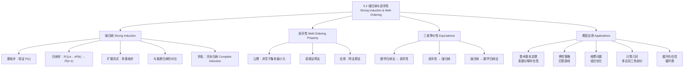

**相关笔记：** [[5.1 数学归纳法]] | [[5.3 递归定义与结构归纳]]

> [!abstract] 概览
> 本节介绍了两种与[[5.1 数学归纳法]]密切相关的证明技术：==强归纳（Strong Induction）==和==良序性（Well-Ordering Property）==。强归纳允许在归纳步中假设==所有前驱命题== $P(1), P(2), \ldots, P(k)$ 均为真来证明 $P(k+1)$，而不仅仅是假设 $P(k)$。良序性公理指出==任何非空非负整数子集都有最小元==，它是数学归纳法和强归纳法的理论基础。三者之间相互等价，可以根据具体问题的需要灵活选择。
>
> - ==强归纳==：归纳步假设 $P(1) \wedge P(2) \wedge \cdots \wedge P(k) \to P(k+1)$，比普通归纳更灵活
> - ==良序性公理==：每个非空非负整数集合都有最小元，是归纳法的根基
> - 三者等价：数学归纳法 $\equiv$ 强归纳法 $\equiv$ 良序性，可互相推导
> - 强归纳的扩展形式：基础步可验证多个起始命题 $P(b), P(b+1), \ldots, P(b+j)$
> - 典型应用：算术基本定理（素数分解）、博弈策略、计算几何中的三角剖分
> - 良序性的直接应用：除法算法的证明、循环存在性证明

---

## 一、知识结构总览

---

## 二、核心思想

> [!tip] 核心思想
> 本节的核心思想是==归纳证明的强化与统一==。[[5.1 数学归纳法]]的归纳步仅假设 $P(k)$ 来推导 $P(k+1)$，但在很多问题中，$P(k+1)$ 的成立依赖于多个前驱命题而非仅仅 $P(k)$。==强归纳==通过允许假设所有前驱命题 $P(1), P(2), \ldots, P(k)$ 来解决这一限制。而==良序性公理==——每个非空非负整数子集都有最小元——则是所有归纳技术的共同根基。三者相互等价，构成了离散数学中证明关于整数命题的完整工具箱。

### 1. 强归纳（Strong Induction）

> [!def] 强归纳法（Strong Induction / 完全归纳法）
> 要证明命题函数 $P(n)$ 对所有正整数 $n$ 为真，需完成两个步骤：
>
> **基础步（Basis Step）**：验证命题 $P(1)$ 为真。
>
> **归纳步（Inductive Step）**：证明条件语句
> $$[P(1) \wedge P(2) \wedge \cdots \wedge P(k)] \to P(k+1)$$
> 对所有正整数 $k$ 为真。
>
> - 归纳假设包含所有 $k$ 个命题 $P(1), P(2), \ldots, P(k)$
> - 强归纳也称为==完全归纳（Complete Induction）==或"数学归纳第二原理"
> - 任何能用普通归纳法完成的证明，也自动是强归纳证明（因为强归纳假设更强）

> [!info] 强归纳的扩展形式
> 设 $b$ 为固定整数，$j$ 为固定正整数。要证明 $P(n)$ 对所有 $n \geq b$ 为真：
>
> **基础步**：验证 $P(b), P(b+1), \ldots, P(b+j)$ 均为真。
>
> **归纳步**：证明 $[P(b) \wedge P(b+1) \wedge \cdots \wedge P(k)] \to P(k+1)$ 对所有 $k \geq b + j$ 为真。
>
> 当归纳步仅对大于某个特定整数的值有效时，需要使用这种扩展形式。

> [!example] 无限阶梯问题——强归纳的优势
> 假设我们能够到达无限阶梯的第1阶和第2阶，且已知如果能到达某一阶，则能到达该阶上方两阶。能否证明能到达每一阶？
>
> **尝试普通归纳法**：归纳假设为"能到达第 $k$ 阶"，但已知条件是"能到达某阶后可再上两阶"，无法从第 $k$ 阶直接推出第 $k+1$ 阶。归纳步失败。
>
> **使用强归纳法**：
> - **基础步**：能到达第1阶（已知）。
> - **归纳步**：假设能到达前 $k$ 阶中的每一阶。当 $k \geq 2$ 时，由归纳假设能到达第 $(k-1)$ 阶，再由已知条件"能上两阶"，即可到达第 $(k+1)$ 阶。$\blacksquare$

### 2. 强归纳的典型应用

> [!thm] 算术基本定理——素数分解的存在性
> 若 $n$ 是大于1的整数，则 $n$ 可以写成素数之积。
>
> **证明**：设 $P(n)$ 为命题"$n$ 可以写成素数之积"。
>
> **基础步**：$P(2)$ 为真，因为2本身就是素数。
>
> **归纳步**：归纳假设为对所有满足 $2 \leq j \leq k$ 的整数 $j$，$P(j)$ 为真（即 $j$ 可写成素数之积）。需证 $P(k+1)$ 为真。
>
> 分两种情况讨论：
> - **情况1**：$k+1$ 是素数。则 $P(k+1)$ 直接为真。
> - **情况2**：$k+1$ 是合数。则 $k+1 = a \cdot b$，其中 $2 \leq a \leq b < k+1$。由归纳假设，$a$ 和 $b$ 都可以写成素数之积，因此 $k+1 = a \cdot b$ 也可以写成素数之积。
>
> 因此 $P(k+1)$ 为真。$\blacksquare$
>
> **注**：结合第4章已证明的"素数分解的唯一性"，完整建立了算术基本定理。

> [!example] 匹配游戏——第二玩家的必胜策略
> 两堆火柴，每堆 $n$ 根。两个玩家轮流从其中一堆中取走任意正数根火柴，取走最后一根火柴者胜。证明：若两堆初始火柴数相同，则第二玩家有必胜策略。
>
> **证明**：设 $P(n)$ 为"当两堆各有 $n$ 根火柴时，第二玩家必胜"。
>
> **基础步**：$n = 1$ 时，第一玩家只能从一堆中取1根，剩一堆1根，第二玩家取走即胜。
>
> **归纳步**：假设对所有 $1 \leq j \leq k$，$P(j)$ 为真。当两堆各有 $k+1$ 根时，第一玩家从一堆中取走 $r$ 根（$1 \leq r \leq k$），剩 $k+1-r$ 根。第二玩家从另一堆中也取走 $r$ 根，使两堆都变为 $k+1-r$ 根。因为 $1 \leq k+1-r \leq k$，由归纳假设，第二玩家必胜。$\blacksquare$

> [!example] 邮票问题——4分和5分邮票
> 证明：所有12分及以上的邮资都可以用4分和5分邮票凑出。
>
> **强归纳证明**：
> - **基础步**：$P(12), P(13), P(14), P(15)$ 均为真。
>   - $12 = 3 \times 4$，$13 = 2 \times 4 + 5$，$14 = 4 + 2 \times 5$，$15 = 3 \times 5$
> - **归纳步**：假设对所有 $12 \leq j \leq k$（$k \geq 15$），$P(j)$ 为真。需证 $P(k+1)$ 为真。
>   - 由归纳假设，$P(k-3)$ 为真（因为 $k-3 \geq 12$），即 $k-3$ 分可凑出。
>   - 在 $k-3$ 分的基础上加一张4分邮票，即得 $k+1$ 分。$\blacksquare$

### 3. 计算几何应用——多边形三角剖分

> [!def] 相关术语
> - ==简单多边形==：不相邻的边不相交的多边形
> - ==凸多边形==：连接内部任意两点的线段完全在多边形内部
> - ==对角线==：连接两个不相邻顶点的线段
> - ==内部对角线==：完全位于多边形内部的对角线
> - ==三角剖分==：通过添加不相交的对角线将多边形分割为三角形

> [!thm] 三角剖分定理（Theorem 1）
> 具有 $n$ 条边（$n \geq 3$）的简单多边形可以被三角剖分为 $n-2$ 个三角形。
>
> **证明**（强归纳）：设 $T(n)$ 为"具有 $n$ 条边的简单多边形可三角剖分为 $n-2$ 个三角形"。
>
> **基础步**：$T(3)$ 为真，因为三角形本身就是三角剖分，$3 - 2 = 1$ 个三角形。
>
> **归纳步**：假设对所有 $3 \leq j \leq k$，$T(j)$ 为真。考虑具有 $k+1$ 条边的简单多边形 $P$。
>
> 因为 $k+1 \geq 4$，由引理（Lemma 1），$P$ 有一条内部对角线 $ab$。$ab$ 将 $P$ 分为两个简单多边形 $Q$（$s$ 条边）和 $R$（$t$ 条边），其中 $3 \leq s \leq k$，$3 \leq t \leq k$。
>
> 由归纳假设，$Q$ 可三角剖分为 $s-2$ 个三角形，$R$ 可三角剖分为 $t-2$ 个三角形。合在一起，$P$ 被三角剖分为 $(s-2) + (t-2) = s + t - 4$ 个三角形。
>
> 由于 $k+1 = s + t - 2$（$P$ 的每条边恰好属于 $Q$ 或 $R$ 之一，对角线 $ab$ 同时属于两者），因此三角剖分产生 $(k+1) - 2 = k-1$ 个三角形。$\blacksquare$

> [!lemma] 引理1：内部对角线的存在性
> 每个至少有4条边的简单多边形都有一条内部对角线。
>
> **证明思路**（Ho, 1975）：取多边形 $P$ 中 $y$ 坐标最小且 $x$ 坐标最小的顶点 $b$。设与 $b$ 相邻的顶点为 $a$ 和 $c$。三角形 $\triangle abc$ 内部角小于 $180°$。若 $\triangle abc$ 内无 $P$ 的其他顶点，则 $ac$ 为内部对角线；否则在 $\triangle abc$ 内的顶点中，取使 $\angle bap$ 最小的顶点 $p$，则 $bp$ 为内部对角线。

### 4. 良序性（Well-Ordering Property）

> [!def] 良序性公理（Well-Ordering Property）
> ==每个非空非负整数集合都有一个最小元==。
>
> - 这是整数集的一个基本公理，不需要证明
> - 良序性是数学归纳法和强归纳法的理论基础
> - 良序性不仅适用于非负整数集，也适用于任何具有良序性质的集合

> [!thm] 三者等价性
> 以下三个原理相互等价：
> 1. ==数学归纳法==（[[5.1 数学归纳法]]）
> 2. ==强归纳法==
> 3. ==良序性==
>
> 即从其中任何一个出发，可以推导出另外两个。这意味着用一种方法完成的证明，理论上可以改写为用另外两种方法完成的证明。

> [!example] 用良序性证明除法算法
> 除法算法：若 $a$ 是整数，$d$ 是正整数，则存在唯一整数 $q$ 和 $r$，使得 $0 \leq r < d$ 且 $a = dq + r$。
>
> **证明**（存在性）：令 $S = \{a - dq \mid q \in \mathbb{Z},\ a - dq \geq 0\}$。
>
> $S$ 非空（取 $q$ 为绝对值足够大的负整数即可使 $a - dq \geq 0$）。由良序性，$S$ 有最小元 $r = a - dq_0$。
>
> $r$ 非负。还需证 $r < d$：若 $r \geq d$，则 $a - d(q_0 + 1) = r - d \geq 0$，即 $r - d \in S$ 且 $r - d < r$，与 $r$ 是最小元矛盾。因此 $0 \leq r < d$。$\blacksquare$

> [!example] 用良序性证明循环赛中三角循环的存在性
> 在循环赛中，若存在长度为 $m$（$m \geq 3$）的循环，则必存在长度为3的循环。
>
> **证明**：假设不存在长度为3的循环。所有循环长度的集合非空，由良序性有最小长度 $k > 3$。考虑循环 $p_1 \to p_2 \to \cdots \to p_k \to p_1$。
>
> 考虑 $p_1$ 与 $p_3$ 的比赛结果：
> - 若 $p_3$ 胜 $p_1$：$p_1 \to p_2 \to p_3 \to p_1$ 是长度为3的循环，矛盾。
> - 若 $p_1$ 胜 $p_3$：去掉 $p_2$ 得 $p_1 \to p_3 \to p_4 \to \cdots \to p_k \to p_1$，长度为 $k-1 < k$，与最小性矛盾。
>
> 因此必存在长度为3的循环。$\blacksquare$

---

## 三、补充理解与易混淆点

### 补充理解

> [!info] 补充1：为什么强归纳和普通归纳等价
> 强归纳与普通归纳的等价性初看可能令人惊讶，但逻辑上很清楚：
>
> **强归纳蕴含普通归纳**：强归纳的归纳假设 $P(1) \wedge \cdots \wedge P(k)$ 包含了普通归纳的假设 $P(k)$，因此任何能用普通归纳完成的证明自动是强归纳证明。
>
> **普通归纳蕴含强归纳**（思路）：设 $Q(k)$ 为"$P(1) \wedge P(2) \wedge \cdots \wedge P(k)$"。若强归纳步 $[P(1) \wedge \cdots \wedge P(k)] \to P(k+1)$ 成立，则 $Q(k) \to Q(k+1)$ 也成立（因为 $Q(k+1) = Q(k) \wedge P(k+1)$）。对 $Q(k)$ 使用普通归纳法即可。
>
> 虽然等价，但强归纳在实际使用中更方便——当 $P(k+1)$ 依赖于多个前驱命题时，强归纳可以直接利用所有前驱，而将强归纳证明改写为普通归纳证明往往非常繁琐。
>
> - [Strong Induction vs. Mathematical Induction](https://math.stackexchange.com/questions/141232/difference-between-strong-induction-and-mathematical-induction) -- 数学论坛上关于两种归纳法区别的讨论
> 来源：Rosen, K. H. (2019). *Discrete Mathematics and Its Applications* (8th ed.), McGraw-Hill, Section 5.2.
> 来源：Cormen, T. H., et al. (2009). *Introduction to Algorithms* (3rd ed.), MIT Press, Appendix A.2.

> [!info] 补充2：何时选择强归纳而非普通归纳
> 选择证明方法的实用指南：
>
> | 场景 | 推荐方法 | 原因 |
> |:-----|:---------|:-----|
> | $P(k+1)$ 仅依赖于 $P(k)$ | 普通归纳 | 假设足够，无需加强 |
> | $P(k+1)$ 依赖于 $P(k)$ 和 $P(k-1)$ | 强归纳 | 需要多个前驱 |
> | $P(k+1)$ 依赖于某个 $P(j)$（$j < k$） | 强归纳 | 不知道具体依赖哪个 |
> | 分解为子问题（如素因子分解） | 强归纳 | 子问题大小不确定 |
> | 基础步需要多个起始值 | 强归纳扩展形式 | 普通归纳只验证 $P(1)$ |
>
> 经验法则：**除非能清楚看到普通归纳的归纳步可行，否则优先尝试强归纳**。即使强归纳"杀鸡用牛刀"，证明也是正确的。
>
> - [When to use Strong Induction](https://www.youtube.com/watch?v=7q6mF8zgqUg) -- 何时使用强归纳的视频讲解
> 来源：Gunderson, D. S. (2011). *Handbook of Mathematical Induction*. CRC Press, Section 1.4.
> 来源：Rosen, K. H. (2019). *Discrete Mathematics and Its Applications* (8th ed.), McGraw-Hill, Section 5.2.

### 易混淆点

> [!warning] 误区：强归纳需要验证更多基础步
> - ❌ 认为强归纳和普通归纳的基础步完全相同，只需要验证 $P(1)$
> - ✅ 强归纳的归纳步中，归纳假设覆盖 $P(1)$ 到 $P(k)$，但归纳步的推导可能需要==特定范围内的前驱命题==
>
> 例如在 Fibonacci 数列的证明中（如教材 Example 4），归纳步 $P(k+1) = P(k) + P(k-1)$ 需要同时用到 $P(k)$ 和 $P(k-1)$。当 $k = 3$ 时，$P(4)$ 需要 $P(3)$ 和 $P(2)$，但归纳假设从 $P(1)$ 开始，$P(2)$ 不一定被基础步覆盖。因此需要==额外验证 $P(4)$==（或更一般地，验证归纳步能覆盖到的最小 $k$ 值）。
>
> - ⚠️ 实践中，如果归纳步中 $P(k+1)$ 依赖于 $P(k), P(k-1), \ldots, P(k-j)$，则基础步至少需要验证 $P(1), P(2), \ldots, P(j+1)$

> [!warning] 误区：强归纳的归纳假设"更强"所以能证明更多命题
> - ❌ 认为强归纳比普通归纳"更强"，能证明普通归纳无法证明的命题
> - ✅ 两者==逻辑等价==，能证明的命题集合完全相同
> - ✅ 区别仅在于证明的==便利性==：强归纳让某些证明更容易构造
> - ❌ 认为使用强归纳时可以省略基础步
> - ✅ 基础步在强归纳中同样不可省略，否则归纳链条没有起点
>
> 一个常见的错误"证明"：声称对所有非负整数 $n$，$5n = 0$。基础步 $5 \cdot 0 = 0$ 正确。归纳步中写 $k+1 = i + j$（$i, j < k+1$），然后 $5(k+1) = 5(i+j) = 5i + 5j = 0 + 0 = 0$。这个"证明"的漏洞在于：$k+1 = i + j$ 的分解方式不唯一，且归纳假设只对 $i, j \geq 0$ 有效，但证明中隐含假设了 $5i = 0$ 和 $5j = 0$ 对所有分解都成立，这是循环论证。

---

## 四、习题精选

> [!todo] 习题概览
> | 题号范围 | 核心考点 | 难度 |
> |---------|---------|------|
> | 1-2 | 强归纳基本应用（阶梯、多米诺） | ⭐ |
> | 3-8 | 邮票问题（确定可用面额、证明覆盖范围） | ⭐⭐ |
> | 9 | 用强归纳证明 $\sqrt{2}$ 是无理数 | ⭐⭐⭐ |
> | 10 | 巧克力棒分割问题 | ⭐⭐ |
> | 11 | Nim游戏变体（必胜策略） | ⭐⭐⭐ |
> | 12 | 正整数写成不同2的幂之和 | ⭐⭐ |
> | 13-14 | 拼图/石堆问题 | ⭐⭐⭐ |
> | 15-16 | Chomp游戏必胜策略 | ⭐⭐⭐⭐ |
> | 17-20 | 计算几何（三角剖分、耳朵定理） | ⭐⭐⭐⭐ |
> | 25-28 | 命题函数的覆盖范围判定 | ⭐⭐ |
> | 29-30 | 强归纳证明中的常见错误 | ⭐⭐⭐ |
> | 31-43 | 等价性证明、良序性应用 | ⭐⭐⭐⭐ |

### 题1：用强归纳证明覆盖性

> [!problem] 题目
> 用强归纳证明：若你能跑1英里或2英里，且一旦跑了某个英里数后总能再多跑2英里，则你能跑任意英里数。

> [!faq]- 解答
> 设 $P(n)$ 为"能跑 $n$ 英里"。
>
> **基础步**：$P(1)$ 和 $P(2)$ 均为真（已知条件）。
>
> **归纳步**：假设对所有 $1 \leq j \leq k$，$P(j)$ 为真。需证 $P(k+1)$ 为真。
>
> - 若 $k+1 = 1$ 或 $k+1 = 2$，已由基础步覆盖。
> - 若 $k+1 \geq 3$，则 $k-1 \geq 1$，由归纳假设 $P(k-1)$ 为真。由已知条件，跑了 $k-1$ 英里后可再多跑2英里，即能跑 $(k-1) + 2 = k+1$ 英里。
>
> 因此 $P(k+1)$ 为真。$\blacksquare$

### 题2：邮票问题——3分和5分邮票

> [!problem] 题目
> 设 $P(n)$ 为"邮资 $n$ 分可以用3分和5分邮票凑出"。用强归纳证明 $P(n)$ 对所有 $n \geq 8$ 为真。

> [!faq]- 解答
> **基础步**：
> - $P(8)$：$8 = 3 + 5$ ✓
> - $P(9)$：$9 = 3 + 3 + 3$ ✓
> - $P(10)$：$10 = 5 + 5$ ✓
>
> **归纳步**：假设对所有 $8 \leq j \leq k$（$k \geq 10$），$P(j)$ 为真。需证 $P(k+1)$ 为真。
>
> 因为 $k \geq 10$，所以 $k - 2 \geq 8$。由归纳假设 $P(k-2)$ 为真，即 $k-2$ 分可凑出。在 $k-2$ 分的基础上加一张3分邮票，得 $(k-2) + 3 = k+1$ 分。$\blacksquare$

### 题3：用强归纳证明二进制表示

> [!problem] 题目
> 用强归纳证明：每个正整数都可以写成==不同==的2的幂之和，即可以写成集合 $\{2^0, 2^1, 2^2, \ldots\}$ 的某个子集之和。

> [!faq]- 解答
> 设 $P(n)$ 为"$n$ 可以写成不同的2的幂之和"。
>
> **基础步**：$P(1) = 2^0 = 1$，显然为真。
>
> **归纳步**：假设对所有 $1 \leq j \leq k$，$P(j)$ 为真。需证 $P(k+1)$ 为真。
>
> 分两种情况：
> - **$k+1$ 为偶数**：设 $k+1 = 2m$。因为 $m = (k+1)/2 \leq k$（$k \geq 1$），由归纳假设 $m = 2^{a_1} + 2^{a_2} + \cdots + 2^{a_r}$（各 $a_i$ 互不相同）。因此 $k+1 = 2m = 2^{a_1+1} + 2^{a_2+1} + \cdots + 2^{a_r+1}$，各项仍互不相同。
> - **$k+1$ 为奇数**：设 $k+1 = 2m + 1$。因为 $m = k/2 \leq k$，由归纳假设 $m = 2^{a_1} + \cdots + 2^{a_r}$。因此 $k+1 = 2m + 1 = 2^{a_1+1} + \cdots + 2^{a_r+1} + 2^0$。由于 $m \geq 1$ 时所有 $a_i \geq 0$，故 $a_i + 1 \geq 1 > 0$，$2^0$ 不会与其它项重复。
>
> 因此 $P(k+1)$ 为真。$\blacksquare$

### 题4：用良序性证明有理数的稠密性

> [!problem] 题目
> 用良序性证明：若 $x$ 和 $y$ 是实数且 $x < y$，则存在有理数 $r$ 使得 $x < r < y$。

> [!faq]- 解答
> **证明**：由阿基米德性质，存在正整数 $A$ 使得 $A > 1/(y - x)$，即 $1/A < y - x$。
>
> 考虑集合 $S = \{j \in \mathbb{Z}^+ \mid \lfloor x \rfloor + j/A > x\}$。$S$ 非空（因为当 $j$ 足够大时 $\lfloor x \rfloor + j/A > x$ 必然成立）。由良序性，$S$ 有最小元 $j_0$。
>
> 令 $r = \lfloor x \rfloor + j_0/A$。由 $j_0 \in S$ 知 $r > x$。
>
> 又因为 $j_0$ 是最小元，$j_0 - 1 \notin S$（若 $j_0 = 1$ 则 $j_0 - 1 = 0 \notin \mathbb{Z}^+$），所以 $\lfloor x \rfloor + (j_0 - 1)/A \leq x$，即 $r - 1/A \leq x$，从而 $r \leq x + 1/A < x + (y - x) = y$。
>
> 因此 $x < r < y$。$\blacksquare$

### 题5：多边形三角剖分中的耳朵定理

> [!problem] 题目
> 用强归纳证明：若一个至少有4条边的简单多边形被三角剖分，则三角剖分中至少有两个三角形有两条边与多边形外部相邻。

> [!faq]- 解答
> **证明思路**：设 $P(n)$ 为"具有 $n$ 条边的简单多边形的任何三角剖分中，至少有两个三角形有两条边与外部相邻"。
>
> **基础步**：$P(4)$——四边形只有一种三角剖分方式（一条对角线），产生两个三角形，每个三角形恰好有两条边是四边形的边，即与外部相邻。
>
> **归纳步**：假设对所有 $4 \leq j \leq k$，$P(j)$ 为真。考虑 $k+1$ 条边的简单多边形 $P$。由引理1，$P$ 有内部对角线 $ab$，将 $P$ 分为 $Q$（$s$ 条边）和 $R$（$t$ 条边），其中 $s + t = k + 3$，$s, t \geq 3$。
>
> - 若 $s = 3$，则 $Q$ 是一个三角形，其三条边中一条是对角线 $ab$（内部），另外两条是 $P$ 的边（外部），所以 $Q$ 贡献一个"耳朵"。对 $R$（$t = k$ 条边）应用归纳假设，$R$ 的三角剖分中至少有两个耳朵。但 $R$ 中与 $ab$ 相邻的三角形在 $P$ 中不一定有两条外部边，需仔细分析。
> - 若 $s \geq 4$ 且 $t \geq 4$，对 $Q$ 和 $R$ 分别应用归纳假设，各至少有两个耳朵。在合并时，与对角线 $ab$ 相邻的三角形各失去一条外部边，但只要 $Q$ 和 $R$ 各有至少3个耳朵，合并后仍有至少两个。更精确的分析可利用"至少两个耳朵中至多各有一个与 $ab$ 相邻"这一事实。
>
> 综上，$P(k+1)$ 的三角剖分中至少有两个耳朵。$\blacksquare$

> [!tip] 解题思路提示
> 强归纳证明的解题方法论：
> 1. **判断是否需要强归纳**：若 $P(k+1)$ 的证明需要引用 $P(j)$（$j < k$），则必须用强归纳
> 2. **确定基础步范围**：归纳步中引用的最远前驱决定基础步需要验证多少个起始值
> 3. **良序性证明模式**：构造非空整数集 $S$ → 由良序性取最小元 → 利用最小性推出矛盾或结论
> 4. **等价性证明**：从一种原理出发构造性地推导另一种原理，关键是设计合适的辅助命题
> 5. **博弈策略问题**：用强归纳证明"存在必胜策略"，归纳步的关键是将局面转化为更小的等价局面

---

## 五、视频学习指南

> [!info] 视频资源
> | 资源 | 链接 | 对应内容 | 备注 |
> |:-----|:-----|:---------|:-----|
> | Rosen 8e Section 5.2 | [教材原文](https://www.mheducation.com/highered/product/discrete-mathematics-applications-rosen/M9781259676512.html) | 完整定义、定理与例题 | 英文教材 |
> | MIT 6.042J Lecture 6 | [链接](https://www.youtube.com/watch?v=rfG3pmPDIkE) | 强归纳与良序性 | 英文，MIT开放课程 |
> | TrevTutor Strong Induction | [链接](https://www.youtube.com/watch?v=7q6mF8zgqUg) | 强归纳法讲解与例题 | 英文，适合入门 |
> | 3Blue1Brown - Induction | [链接](https://www.youtube.com/watch?v=4y9pMpR4D5s) | 归纳法直觉理解 | 英文，可视化讲解 |

---

## 六、教材原文

> [!quote] 教材原文
> "In a proof by strong induction, the inductive step shows that if P(j) is true for all positive integers j not exceeding k, then P(k+1) is true. That is, for the inductive hypothesis we assume that P(j) is true for j = 1, 2, ..., k."
>
> "The validity of both mathematical induction and strong induction follow from the well-ordering property. In fact, mathematical induction, strong induction, and well-ordering are all equivalent principles. That is, the validity of each can be proved from either of the other two."
>
> "You may be surprised that mathematical induction and strong induction are equivalent. That is, each can be shown to be a valid proof technique assuming that the other is valid. In particular, any proof using mathematical induction can also be considered to be a proof by strong induction because the inductive hypothesis of a proof by mathematical induction is part of the inductive hypothesis in a proof by strong induction."

---

## 参见 Wiki

- [[离散数学/concepts/数学归纳法]] -- 普通数学归纳法
- [[离散数学/concepts/强归纳法|强归纳]] -- 强归纳法（完全归纳法）
- [[离散数学/concepts/良序性]] -- 良序性公理及其应用
- [[离散数学/concepts/算术基本定理]] -- 素数分解的唯一性
- [[离散数学/concepts/强归纳法|三角剖分]] -- 多边形的三角剖分
- [[离散数学/concepts/结构归纳|结构归纳]] -- 基于递归定义的证明方法

#学习/离散数学/归纳与递归
