**相关笔记：** [[5.2 强归纳与良序性]] | [[5.4 递归算法]]

> [!abstract] 概览
> 本节系统介绍了==递归定义（Recursive Definition）==和==结构归纳（Structural Induction）==两种核心技术。递归定义通过==基础步==指定初始元素、==递归步==给出构造规则来定义函数、集合和结构；结构归纳则是针对递归定义对象的专用证明方法。本节内容是递归思想的基石，为后续[[5.4 递归算法]]和第8章递归关系提供理论支撑。
>
> - ==递归定义函数==：基础步指定 $f(0)$，递归步用 $f$ 在较小整数上的值定义 $f(n+1)$
> - ==递归定义集合==：基础步给出初始元素，递归步给出从已有元素构造新元素的规则
> - ==递归定义结构==：根树、扩展二叉树、满二叉树的递归构造
> - ==结构归纳法==：基础步验证初始元素，递归步证明"若对构造元素成立，则对新元素也成立"
> - ==广义归纳==：将归纳法推广到具有良序性的其他集合（如 $\mathbb{N} \times \mathbb{N}$ 的字典序）
> - 重要定理：Lame定理——欧几里得算法的除法次数不超过 $b$ 的十进制位数的5倍

---

## 一、知识结构总览

```mermaid
graph TB
    A["5.3 递归定义与结构归纳<br/>Recursive Definitions & Structural Induction"] --> B["递归定义函数"]
    A --> C["递归定义集合"]
    A --> D["递归定义结构"]
    A --> E["结构归纳法"]
    A --> F["广义归纳"]

    B --> B1["基础步 + 递归步"]
    B --> B2["阶乘函数"]
    B --> B3["幂函数 a^n"]
    B --> B4["斐波那契数列"]
    B --> B5["求和函数"]
    B --> B6["Lame定理"]

    C --> C1["字符串集 Σ*"]
    C --> C2["字符串拼接"]
    C --> C3["字符串长度"]
    C --> C4["合式公式 WFF"]
    C --> C5["正整数集"]

    D --> D1["根树 Rooted Tree"]
    D --> D2["扩展二叉树<br/>Extended Binary Tree"]
    D --> D3["满二叉树<br/>Full Binary Tree"]
    D --> D4["树的高度与顶点数"]

    E --> E1["基础步：验证初始元素"]
    E --> E2["递归步：构造传递性"]
    E --> E3["合式公式性质证明"]
    E --> E4["字符串性质证明"]
    E --> E5["二叉树性质证明"]

    F --> F1["字典序 Lexicographic Order"]
    F --> F2["N×N 上的归纳"]
    F --> F3["双变量递归定义"]
```

---

## 二、核心思想

> [!tip] 核心思想
> 本节的核心思想是==自引用定义与对应证明方法==。递归定义的本质是"用对象自身来定义对象"——通过指定==最简单情况==（基础步）和==从简单到复杂的构造规则==（递归步），可以精确定义函数、集合和结构。与之对应，==结构归纳==是专门为递归定义对象设计的证明技术：在基础步中验证最简单情况，在递归步中证明"如果性质对所有用于构造新对象的旧对象成立，则对新对象也成立"。这种"定义-证明"的对称性是离散数学中递归思想的精髓。

### 1. 递归定义函数

> [!def] 递归定义函数（Recursively Defined Functions）
> 要定义一个以非负整数集为定义域的函数 $f$，需要两个步骤：
>
> **基础步（Basis Step）**：指定函数在 $0$ 处的值 $f(0)$。
>
> **递归步（Recursive Step）**：给出从函数在较小整数处的值求函数在更大整数处值的规则。
>
> - 这种定义也称为==归纳定义（Inductive Definition）==
> - 递归定义的函数是良定义的（well-defined）：每个正整数处的值被唯一确定
> - 良定义性由[[5.1 数学归纳法]]保证

> [!example] 递归定义示例
> 设 $f$ 由以下递归定义：
> $$f(0) = 3, \quad f(n+1) = 2f(n) + 3$$
>
> 计算前几项：
> - $f(1) = 2f(0) + 3 = 2 \cdot 3 + 3 = 9$
> - $f(2) = 2f(1) + 3 = 2 \cdot 9 + 3 = 21$
> - $f(3) = 2f(2) + 3 = 2 \cdot 21 + 3 = 45$
> - $f(4) = 2f(3) + 3 = 2 \cdot 45 + 3 = 93$

> [!def] 幂函数的递归定义
> 设 $a$ 是非零实数，$n$ 是非负整数，则 $a^n$ 的递归定义为：
>
> **基础步**：$a^0 = 1$
>
> **递归步**：$a^{n+1} = a \cdot a^n$，对 $n = 0, 1, 2, \ldots$

> [!def] 求和函数的递归定义
> $$\sum_{k=0}^{0} a_k = a_0$$
> $$\sum_{k=0}^{n+1} a_k = \left(\sum_{k=0}^{n} a_k\right) + a_{n+1}$$

> [!def] 斐波那契数列（Fibonacci Sequence）
> 斐波那契数列 $f_0, f_1, f_2, \ldots$ 定义为：
> $$f_0 = 0, \quad f_1 = 1$$
> $$f_n = f_{n-1} + f_{n-2}, \quad n = 2, 3, 4, \ldots$$
>
> 前几项：$0, 1, 1, 2, 3, 5, 8, 13, 21, 34, 55, 89, \ldots$
>
> - 斐波那契数列的递归步依赖于==前两个==值，而非仅前一个
> - 用[[5.2 强归纳与良序性]]证明其性质时，基础步需要验证 $P(3)$ 和 $P(4)$

> [!thm] 斐波那契数的下界估计
> 对所有 $n \geq 3$，$f_n > \alpha^{n-2}$，其中 $\alpha = \frac{1 + \sqrt{5}}{2}$（黄金比例）。
>
> **证明**（[[5.2 强归纳与良序性]]）：设 $P(n)$ 为"$f_n > \alpha^{n-2}$"。
>
> **基础步**：
> - $P(3)$：$\alpha < 2 = f_3$ ✓
> - $P(4)$：$\alpha^2 = \frac{3 + \sqrt{5}}{2} < 3 = f_4$ ✓
>
> **归纳步**：假设对所有 $3 \leq j \leq k$（$k \geq 4$），$P(j)$ 为真。需证 $f_{k+1} > \alpha^{k-1}$。
>
> 因为 $\alpha$ 是 $x^2 - x - 1 = 0$ 的根，所以 $\alpha^2 = \alpha + 1$。因此：
> $$\alpha^{k-1} = \alpha^2 \cdot \alpha^{k-3} = (\alpha + 1)\alpha^{k-3} = \alpha^{k-2} + \alpha^{k-3}$$
>
> 由归纳假设（$k \geq 4$ 保证 $k-1 \geq 3$）：
> $$f_k > \alpha^{k-2}, \quad f_{k-1} > \alpha^{k-3}$$
>
> 因此：
> $$f_{k+1} = f_k + f_{k-1} > \alpha^{k-2} + \alpha^{k-3} = \alpha^{k-1}$$
>
> $P(k+1)$ 为真。$\blacksquare$

> [!thm] Lame定理（Theorem 1）
> 设 $a$ 和 $b$ 是正整数且 $a \geq b$。则欧几里得算法求 $\gcd(a, b)$ 所用的除法次数不超过 $b$ 的十进制位数的5倍。
>
> **证明思路**：设欧几里得算法使用了 $n$ 次除法，产生余数序列 $r_0 = a, r_1 = b, r_2, \ldots, r_n = \gcd(a,b)$。可以证明 $r_n \geq f_2 = 1$，$r_{n-1} \geq f_3 = 2$，$r_{n-2} \geq f_4$，$\ldots$，$b = r_1 \geq f_{n+1}$。
>
> 由上面的下界估计，$f_{n+1} > \alpha^{n-1}$，因此 $b > \alpha^{n-1}$。取对数得 $n - 1 < 5 \log_{10} b$。若 $b$ 有 $k$ 位十进制数，则 $\log_{10} b < k$，故 $n \leq 5k$。$\blacksquare$

### 2. 递归定义集合

> [!def] 递归定义集合（Recursively Defined Sets）
> 递归定义集合包含三个部分：
>
> **基础步（Basis Step）**：指定一组初始元素属于集合。
>
> **递归步（Recursive Step）**：给出从已有元素构造新元素的规则。
>
> **排斥规则（Exclusion Rule）**：集合仅包含基础步指定的元素和递归步生成的元素，不包含其他元素。（通常隐含假设，不需显式声明。）

> [!example] 3的倍数集合
> 定义子集 $S \subseteq \mathbb{Z}$：
> - **基础步**：$3 \in S$
> - **递归步**：若 $x \in S$ 且 $y \in S$，则 $x + y \in S$
>
> 生成过程：$3 \to 6, 9, 12 \to 15, 18, 21, \ldots$
>
> 可以证明 $S$ 恰好是所有正的3的倍数构成的集合。

> [!def] 字符串集 $\Sigma^*$（Definition 1）
> 字母表 $\Sigma$ 上所有字符串的集合 $\Sigma^*$ 递归定义为：
>
> **基础步**：$\lambda \in \Sigma^*$（$\lambda$ 是空字符串）
>
> **递归步**：若 $w \in \Sigma^*$ 且 $x \in \Sigma$，则 $wx \in \Sigma^*$
>
> - 每次应用递归步，生成一个多一个符号的字符串
> - 当 $\Sigma = \{0, 1\}$ 时，$\Sigma^*$ 是所有二进制字符串的集合

> [!def] 字符串拼接（Definition 2）
> 设 $\Sigma$ 是字母表，$\Sigma^*$ 是其上的字符串集。拼接运算 $\cdot$ 递归定义为：
>
> **基础步**：若 $w \in \Sigma^*$，则 $w \cdot \lambda = w$
>
> **递归步**：若 $w_1, w_2 \in \Sigma^*$ 且 $x \in \Sigma$，则 $w_1 \cdot (w_2 x) = (w_1 \cdot w_2)x$
>
> - 拼接通常简写为 $w_1 w_2$ 而非 $w_1 \cdot w_2$
> - 例如：$\text{abra} \cdot \text{cadabra} = \text{abracadabra}$

> [!def] 字符串长度（Example 7）
> 字符串 $w$ 的长度 $l(w)$ 递归定义为：
> $$l(\lambda) = 0$$
> $$l(wx) = l(w) + 1, \quad w \in \Sigma^*,\ x \in \Sigma$$

> [!def] 命题逻辑的合式公式（Example 8）
> 涉及 $T, F$、命题变量和运算符 $\{\neg, \wedge, \vee, \to, \leftrightarrow\}$ 的合式公式（WFF）递归定义为：
>
> **基础步**：$T$、$F$ 和命题变量 $s$ 是合式公式。
>
> **递归步**：若 $E$ 和 $F$ 是合式公式，则 $(\neg E)$、$(E \wedge F)$、$(E \vee F)$、$(E \to F)$、$(E \leftrightarrow F)$ 也是合式公式。
>
> - 例如：$p$、$(p \vee q)$、$((p \vee q) \to (q \wedge F))$ 是合式公式
> - $p\neg \wedge q$、$pq\wedge$、$\neg \wedge pq$ ==不是==合式公式

> [!def] 运算符与运算对象的合式公式（Example 9）
> 由变量、数字和运算符 $\{+, -, *, /, \uparrow\}$（其中 $*$ 表示乘法，$\uparrow$ 表示指数）组成的合式公式递归定义为：
>
> **基础步**：若 $x$ 是数字或变量，则 $x$ 是合式公式。
>
> **递归步**：若 $F$ 和 $G$ 是合式公式，则 $(F + G)$、$(F - G)$、$(F * G)$、$(F / G)$、$(F \uparrow G)$ 也是合式公式。
>
> - 例如：$x$、$(x + 3)$、$((x + 3) + 3)$、$(x - (3 * y))$ 是合式公式
> - $x3 +$、$y * + x$、$* x / y$ ==不是==合式公式

### 3. 递归定义结构——树

> [!def] 根树（Definition 3）
> 根树的集合递归定义为：
>
> **基础步**：单个顶点 $r$ 是一棵根树（$r$ 为根）。
>
> **递归步**：设 $T_1, T_2, \ldots, T_n$ 是不相交的根树，根分别为 $r_1, r_2, \ldots, r_n$。添加一个新根 $r$（不在任何 $T_i$ 中），并从 $r$ 到每个 $r_i$ 添加一条边，构成新的根树。
>
> - 每次应用递归步，产生无穷多棵新树
> - 根树是图论中的重要概念（详见第10-11章）

> [!def] 扩展二叉树（Definition 4）
> 扩展二叉树的集合递归定义为：
>
> **基础步**：空集 $\emptyset$ 是一棵扩展二叉树。
>
> **递归步**：若 $T_1$ 和 $T_2$ 是不相交的扩展二叉树，则 $T_1 \cdot T_2$ 也是扩展二叉树，其中 $T_1 \cdot T_2$ 由一个根 $r$、连接 $r$ 到 $T_1$ 根的边（若 $T_1$ 非空）和连接 $r$ 到 $T_2$ 根的边（若 $T_2$ 非空）组成。
>
> - 扩展二叉树中，左子树或右子树可以为空

> [!def] 满二叉树（Definition 5）
> 满二叉树的集合递归定义为：
>
> **基础步**：仅含一个顶点 $r$ 的树是满二叉树。
>
> **递归步**：若 $T_1$ 和 $T_2$ 是不相交的满二叉树，则 $T_1 \cdot T_2$ 也是满二叉树，由根 $r$ 及连接 $r$ 到 $T_1$ 根和 $T_2$ 根的边组成。
>
> - 满二叉树与扩展二叉树的区别在于基础步：满二叉树的基础步是一个顶点而非空集
> - 满二叉树的左右子树==都不能为空==

> [!def] 满二叉树的高度与顶点数（Definition 6）
> 满二叉树 $T$ 的高度 $h(T)$ 递归定义为：
> $$h(T) = 0 \quad \text{（仅含根 } r \text{）}$$
> $$h(T) = 1 + \max(h(T_1), h(T_2)) \quad \text{（} T = T_1 \cdot T_2 \text{）}$$
>
> 满二叉树 $T$ 的顶点数 $n(T)$ 递归定义为：
> $$n(T) = 1 \quad \text{（仅含根 } r \text{）}$$
> $$n(T) = 1 + n(T_1) + n(T_2) \quad \text{（} T = T_1 \cdot T_2 \text{）}$$

### 4. 结构归纳法

> [!def] 结构归纳法（Structural Induction）
> 要证明递归定义集合中的所有元素都具有某个性质，需要两个步骤：
>
> **基础步（Basis Step）**：证明该性质对递归定义基础步中指定的所有元素成立。
>
> **递归步（Recursive Step）**：证明若该性质对递归步中用于构造新元素的每个元素都成立，则对新构造出的元素也成立。
>
> - 结构归纳的有效性由[[5.1 数学归纳法]]保证
> - 设 $P(n)$ 为"对经 $n$ 次或更少次递归步生成的所有元素，性质成立"
> - 基础步证明 $P(0)$，递归步证明 $P(k) \to P(k+1)$，由数学归纳法得 $P(n)$ 对所有 $n$ 成立

> [!example] 合式公式的括号配对（Example 11）
> 证明：每个合式公式（按 Example 8 定义）中左括号和右括号的数量相等。
>
> **证明**（结构归纳）：
>
> **基础步**：$T$、$F$ 和命题变量 $s$ 不含括号，左括号数 $=$ 右括号数 $= 0$。✓
>
> **递归步**：假设 $p$ 和 $q$ 是合式公式，各有相等数量的左右括号（$l_p = r_p$，$l_q = r_q$）。需证 $(\neg p)$、$(p \vee q)$、$(p \wedge q)$、$(p \to q)$、$(p \leftrightarrow q)$ 也各有相等的左右括号。
>
> - $(\neg p)$：左括号 $= l_p + 1$，右括号 $= r_p + 1$。因 $l_p = r_p$，故相等。
> - $(p \vee q)$：左括号 $= l_p + l_q + 1$，右括号 $= r_p + r_q + 1$。因 $l_p = r_p$ 且 $l_q = r_q$，故相等。
> - 其余三种情况同理。$\blacksquare$

> [!example] 字符串长度的可加性（Example 12）
> 证明：对所有 $x, y \in \Sigma^*$，$l(xy) = l(x) + l(y)$。
>
> **证明**（结构归纳，对 $y$ 归纳）：
>
> 设 $P(y)$ 为"$l(xy) = l(x) + l(y)$ 对所有 $x \in \Sigma^*$ 成立"。
>
> **基础步**：$P(\lambda)$——$l(x\lambda) = l(x) = l(x) + 0 = l(x) + l(\lambda)$。✓
>
> **递归步**：假设 $P(y)$ 为真。需证对任意 $a \in \Sigma$，$P(ya)$ 为真，即 $l(xya) = l(x) + l(ya)$。
>
> 由字符串长度的递归定义：
> $$l(xya) = l(xy) + 1$$
> $$l(ya) = l(y) + 1$$
>
> 由归纳假设 $l(xy) = l(x) + l(y)$，因此：
> $$l(xya) = l(xy) + 1 = l(x) + l(y) + 1 = l(x) + l(ya)$$
>
> $P(ya)$ 为真。$\blacksquare$

> [!thm] 满二叉树的顶点数上界（Theorem 2）
> 若 $T$ 是满二叉树，则 $n(T) \leq 2^{h(T)+1} - 1$。
>
> **证明**（结构归纳）：
>
> **基础步**：仅含根 $r$ 的树，$n(T) = 1$，$h(T) = 0$。$1 \leq 2^{0+1} - 1 = 1$。✓
>
> **递归步**：假设 $n(T_1) \leq 2^{h(T_1)+1} - 1$ 且 $n(T_2) \leq 2^{h(T_2)+1} - 1$。由递归公式：
> $$n(T) = 1 + n(T_1) + n(T_2)$$
> $$\leq 1 + (2^{h(T_1)+1} - 1) + (2^{h(T_2)+1} - 1)$$
> $$= 2^{h(T_1)+1} + 2^{h(T_2)+1} - 1$$
> $$\leq 2 \cdot \max(2^{h(T_1)+1}, 2^{h(T_2)+1}) - 1$$
> $$= 2 \cdot 2^{\max(h(T_1), h(T_2)) + 1} - 1$$
> $$= 2^{h(T)+1} - 1$$
>
> 最后一步使用了 $h(T) = 1 + \max(h(T_1), h(T_2))$。$\blacksquare$

### 5. 广义归纳（Generalized Induction）

> [!def] 广义归纳
> 数学归纳法可以推广到==任何具有良序性的集合==，不仅限于非负整数集。
>
> 例如，在 $\mathbb{N} \times \mathbb{N}$（非负整数有序对）上定义==字典序（Lexicographic Ordering）==：
> $$(x_1, y_1) \leq (x_2, y_2) \iff x_1 < x_2 \text{ 或 } (x_1 = x_2 \text{ 且 } y_1 \leq y_2)$$
>
> $\mathbb{N} \times \mathbb{N}$ 在字典序下具有良序性，因此可以对双变量递归定义使用广义归纳。

> [!example] 双变量递归定义的证明（Example 13）
> 设 $a_{m,n}$ 对 $(m, n) \in \mathbb{N} \times \mathbb{N}$ 递归定义为：
> $$a_{0,0} = 0$$
> $$a_{m,n} = \begin{cases} a_{m-1,n} + 1 & \text{若 } n = 0 \text{ 且 } m > 0 \\ a_{m,n-1} + n & \text{若 } n > 0 \end{cases}$$
>
> 证明：$a_{m,n} = m + \frac{n(n+1)}{2}$ 对所有 $(m, n) \in \mathbb{N} \times \mathbb{N}$ 成立。
>
> **证明**（广义归纳）：
>
> **基础步**：$(m,n) = (0,0)$ 时，$a_{0,0} = 0 = 0 + \frac{0 \cdot 1}{2}$。✓
>
> **归纳步**：假设公式对所有字典序小于 $(m,n)$ 的 $(m', n')$ 成立。
>
> - 若 $n = 0$ 且 $m > 0$：$a_{m,0} = a_{m-1,0} + 1$。由归纳假设 $a_{m-1,0} = (m-1) + 0 = m-1$，故 $a_{m,0} = m - 1 + 1 = m = m + \frac{0 \cdot 1}{2}$。✓
> - 若 $n > 0$：$a_{m,n} = a_{m,n-1} + n$。由归纳假设 $a_{m,n-1} = m + \frac{(n-1)n}{2}$，故 $a_{m,n} = m + \frac{(n-1)n}{2} + n = m + \frac{n^2 - n + 2n}{2} = m + \frac{n(n+1)}{2}$。✓
>
> $\blacksquare$

---

## 三、补充理解与易混淆点

### 补充理解

> [!info] 补充1：递归定义与显式定义的关系
> 递归定义和显式（封闭形式）定义是描述同一对象的两种不同方式：
>
> - **显式定义**直接给出 $f(n)$ 的计算公式，如 $f(n) = 2^n$
> - **递归定义**通过自引用关系定义，如 $f(0) = 1$，$f(n+1) = 2f(n)$
>
> 两者等价但各有优势：
> - 显式定义便于直接计算任意 $f(n)$ 的值
> - 递归定义更自然地反映对象的构造过程，便于用归纳法证明性质
>
> 从递归定义求显式定义的过程称为==求解递推关系==，这是第8章的核心内容。常见方法包括：
> - 迭代法（反复展开递归式）
> - 特征方程法（对线性齐次递推关系）
> - 生成函数法
>
> 例如，$f(0) = 3$，$f(n+1) = 2f(n) + 3$ 的显式解为 $f(n) = 3 \cdot 2^{n+1} - 3$（可通过迭代或特征方程求得）。
>
> - [Recursive vs Explicit Definitions](https://www.khanacademy.org/computing/computer-science/algorithms/recursive-algorithms/a/recursive-vs-iterative) -- Khan Academy 递归与迭代对比
> 来源：Rosen, K. H. (2019). *Discrete Mathematics and Its Applications* (8th ed.), McGraw-Hill, Section 5.3.
> 来源：Cormen, T. H., et al. (2009). *Introduction to Algorithms* (3rd ed.), MIT Press, Chapter 4.

> [!info] 补充2：结构归纳与强归纳的联系与区别
> 结构归纳和[[5.2 强归纳与良序性]]有密切联系但适用场景不同：
>
> | 特征 | 强归纳 | 结构归纳 |
> |:-----|:-------|:---------|
> | 适用对象 | 关于整数的命题 $P(n)$ | 关于递归定义集合的命题 |
> | 基础步 | 验证 $P(1)$（或多个起始值） | 验证基础步中的所有初始元素 |
> | 归纳步 | $P(1) \wedge \cdots \wedge P(k) \to P(k+1)$ | 若性质对构造元素成立，则对新元素成立 |
> | 理论基础 | 良序性 | 数学归纳法（通过"生成步数"转化） |
>
> 结构归纳的有效性证明：设 $P(n)$ 为"对经 $\leq n$ 次递归步生成的所有元素性质成立"。结构归纳的基础步证明 $P(0)$，递归步证明 $P(k) \to P(k+1)$，由数学归纳法得证。
>
> 在实践中，结构归纳更"自然"——不需要将证明对象映射到整数，直接在对象的结构上进行归纳。
>
> - [Structural Induction Explained](https://www.youtube.com/watch?v=HdM1iJGzDKA) -- 结构归纳法视频讲解
> 来源：Mitchell, J. C. (1996). *Foundations for Programming Languages*. MIT Press, Chapter 2.
> 来源：Rosen, K. H. (2019). *Discrete Mathematics and Its Applications* (8th ed.), McGraw-Hill, Section 5.3.

### 易混淆点

> [!warning] 误区：递归定义的函数不需要基础步
> - ❌ 认为递归步已经包含了所有信息，基础步可有可无
> - ✅ 没有基础步的递归定义是==不完整的==，无法确定函数值
> - ❌ 认为基础步只需要指定 $f(0)$
> - ✅ 当递归步依赖于多个前驱值时（如斐波那契 $f_n = f_{n-1} + f_{n-2}$），基础步需要指定==多个起始值==（$f_0$ 和 $f_1$）
>
> 例如，仅给出 $f_n = f_{n-1} + f_{n-2}$ 而不指定 $f_0$ 和 $f_1$，则 $f_n$ 可以是任意等差数列（如 $f_n = cn$ 对任意常数 $c$ 都满足该递推关系）。
>
> - ⚠️ 判断基础步需要多少个起始值的方法：看递归步中引用的最远前驱。$f_n = f_{n-1} + f_{n-2}$ 引用了 $f_{n-2}$，因此需要 $f_0$ 和 $f_1$ 两个起始值。

> [!warning] 误区：结构归纳的递归步等同于"假设对所有元素成立"
> - ❌ 认为结构归纳的递归步可以假设"性质对集合中所有元素成立"
> - ✅ 结构归纳的递归步只假设"性质对==用于构造新元素的==那些元素成立"
> - ❌ 混淆结构归纳的递归步与强归纳的归纳步
>
> 关键区别：结构归纳的递归步是==局部的==——只关注一次构造操作涉及的元素。例如证明合式公式的性质时，递归步假设 $p$ 和 $q$ 具有该性质，然后证明 $(p \vee q)$ 也具有该性质。这里只涉及 $p$、$q$ 和 $(p \vee q)$ 三个对象，不需要假设所有合式公式都具有该性质。
>
> 这种局部性正是结构归纳的优势——证明更简洁，不需要处理全局假设带来的复杂性。

---

## 四、习题精选

> [!todo] 习题概览
> | 题号范围 | 核心考点 | 难度 |
> |---------|---------|------|
> | 1-4 | 递归定义函数的求值 | ⭐ |
> | 5-6 | 判断递归定义是否良定义 | ⭐⭐ |
> | 7-11 | 给出序列/函数的递归定义 | ⭐⭐ |
> | 12-19 | 斐波那契数列性质证明 | ⭐⭐⭐ |
> | 20-21 | max/min 函数的递归定义与性质 | ⭐⭐ |
> | 22-31 | 递归定义集合（奇偶数、模运算、有序对） | ⭐⭐⭐ |
> | 32-44 | 字符串性质证明（结构归纳） | ⭐⭐⭐ |
> | 45-46 | 二叉树性质证明（结构归纳） | ⭐⭐⭐ |
> | 47-49 | 广义归纳（双变量递归） | ⭐⭐⭐⭐ |
> | 50-58 | Ackermann函数 | ⭐⭐⭐⭐ |

### 题1：递归定义函数求值

> [!problem] 题目
> 设 $f$ 由 $f(0) = 1$ 和 $f(n+1) = f(n)^2 + f(n) + 1$ 递归定义。求 $f(1), f(2), f(3), f(4)$。

> [!faq]- 解答
> - $f(1) = f(0)^2 + f(0) + 1 = 1 + 1 + 1 = 3$
> - $f(2) = f(1)^2 + f(1) + 1 = 9 + 3 + 1 = 13$
> - $f(3) = f(2)^2 + f(2) + 1 = 169 + 13 + 1 = 183$
> - $f(4) = f(3)^2 + f(3) + 1 = 33489 + 183 + 1 = 33673$

### 题2：判断递归定义的良定义性

> [!problem] 题目
> 判断以下递归定义是否良定义。如果是，求 $f(n)$ 的显式公式并证明。
>
> (a) $f(0) = 0$，$f(n) = 2f(n-2)$，$n \geq 1$
>
> (b) $f(0) = 1$，$f(1) = 2$，$f(n) = 2f(n-2)$，$n \geq 2$

> [!faq]- 解答
> **(a)** 不良定义。$f(1) = 2f(-1)$，但 $f(-1)$ 未被定义（定义域是非负整数）。
>
> **(b)** 良定义。计算前几项：
> - $f(0) = 1$，$f(1) = 2$
> - $f(2) = 2f(0) = 2$，$f(3) = 2f(1) = 4$
> - $f(4) = 2f(2) = 4$，$f(5) = 2f(3) = 8$
>
> 规律：$f(n) = 2^{n/2}$（$n$ 为偶数），$f(n) = 2^{(n+1)/2}$（$n$ 为奇数）。
>
> 统一公式：$f(n) = 2^{\lceil n/2 \rceil}$。
>
> **证明**（对 $n$ 的数学归纳）：
> - $n = 0$：$f(0) = 1 = 2^{\lceil 0/2 \rceil} = 2^0$ ✓
> - $n = 1$：$f(1) = 2 = 2^{\lceil 1/2 \rceil} = 2^1$ ✓
> - 假设 $f(k) = 2^{\lceil k/2 \rceil}$ 对 $k \leq n-1$ 成立。$f(n) = 2f(n-2) = 2 \cdot 2^{\lceil (n-2)/2 \rceil} = 2^{\lceil (n-2)/2 \rceil + 1}$。因为 $\lceil (n-2)/2 \rceil + 1 = \lceil n/2 \rceil$（分奇偶讨论即可），故 $f(n) = 2^{\lceil n/2 \rceil}$。$\blacksquare$

### 题3：斐波那契数列性质证明

> [!problem] 题目
> 证明：$f_1^2 + f_2^2 + \cdots + f_n^2 = f_n \cdot f_{n+1}$，其中 $f_n$ 是第 $n$ 个斐波那契数。

> [!faq]- 解答
> 设 $P(n)$ 为"$\sum_{i=1}^{n} f_i^2 = f_n \cdot f_{n+1}$"。
>
> **基础步**：$P(1)$：$f_1^2 = 1^2 = 1 = 1 \cdot 1 = f_1 \cdot f_2$。✓
>
> **归纳步**（普通归纳）：假设 $P(k)$ 为真，即 $\sum_{i=1}^{k} f_i^2 = f_k \cdot f_{k+1}$。需证：
> $$\sum_{i=1}^{k+1} f_i^2 = f_k \cdot f_{k+1} + f_{k+1}^2 = f_{k+1}(f_k + f_{k+1}) = f_{k+1} \cdot f_{k+2}$$
>
> 最后一步使用了 $f_{k+2} = f_{k+1} + f_k$。$\blacksquare$

### 题4：字符串性质的结构归纳证明

> [!problem] 题目
> (a) 给出函数 $\text{ones}(s)$ 的递归定义，$\text{ones}(s)$ 计算二进制字符串 $s$ 中 $1$ 的个数。
>
> (b) 用结构归纳证明 $\text{ones}(st) = \text{ones}(s) + \text{ones}(t)$。

> [!faq]- 解答
> **(a)** 递归定义：
> - $\text{ones}(\lambda) = 0$
> - $\text{ones}(w0) = \text{ones}(w)$
> - $\text{ones}(w1) = \text{ones}(w) + 1$
>
> 其中 $w \in \{0, 1\}^*$。
>
> **(b)** 设 $P(t)$ 为"$\text{ones}(st) = \text{ones}(s) + \text{ones}(t)$ 对所有 $s \in \{0,1\}^*$ 成立"。
>
> **基础步**：$P(\lambda)$——$\text{ones}(s\lambda) = \text{ones}(s) = \text{ones}(s) + 0 = \text{ones}(s) + \text{ones}(\lambda)$。✓
>
> **递归步**：假设 $P(t)$ 为真。需证 $P(t0)$ 和 $P(t1)$。
>
> - $P(t0)$：$\text{ones}(s(t0)) = \text{ones}((st)0) = \text{ones}(st) = \text{ones}(s) + \text{ones}(t) = \text{ones}(s) + \text{ones}(t0)$。✓
> - $P(t1)$：$\text{ones}(s(t1)) = \text{ones}((st)1) = \text{ones}(st) + 1 = \text{ones}(s) + \text{ones}(t) + 1 = \text{ones}(s) + \text{ones}(t1)$。✓
>
> $\blacksquare$

### 题5：满二叉树叶子数与内部顶点数的关系

> [!problem] 题目
> 用结构归纳证明：满二叉树 $T$ 的叶子数 $l(T)$ 比内部顶点数 $i(T)$ 多1，即 $l(T) = i(T) + 1$。
>
> （叶子数和内部顶点数的递归定义：基础步——根 $r$ 既是叶子也没有内部顶点，即 $l(T) = 1$，$i(T) = 0$。递归步——$T = T_1 \cdot T_2$ 的叶子集是 $T_1$ 和 $T_2$ 叶子集的并集，内部顶点集是 $\{r\}$ 与 $T_1$、$T_2$ 内部顶点集的并集。）

> [!faq]- 解答
> **证明**（结构归纳）：
>
> **基础步**：仅含根 $r$ 的满二叉树，$l(T) = 1$，$i(T) = 0$。$1 = 0 + 1$。✓
>
> **递归步**：假设 $l(T_1) = i(T_1) + 1$ 且 $l(T_2) = i(T_2) + 1$。对 $T = T_1 \cdot T_2$：
> $$l(T) = l(T_1) + l(T_2) = (i(T_1) + 1) + (i(T_2) + 1) = i(T_1) + i(T_2) + 2$$
> $$i(T) = 1 + i(T_1) + i(T_2)$$
>
> 因此 $l(T) = i(T_1) + i(T_2) + 2 = (1 + i(T_1) + i(T_2)) + 1 = i(T) + 1$。$\blacksquare$

> [!tip] 解题思路提示
> 递归定义与结构归纳的解题方法论：
> 1. **递归定义函数**：基础步指定最小输入的值，递归步用较小输入的值定义较大输入的值
> 2. **递归定义集合**：基础步给出"种子"元素，递归步给出"生长"规则
> 3. **结构归纳证明**：基础步验证种子元素，递归步证明"若构造原料有性质，则产物也有性质"
> 4. **判断良定义性**：检查递归步中引用的所有较小值是否都被基础步或之前的递归步覆盖
> 5. **求显式公式**：计算前几项观察规律，用数学归纳法验证猜想
> 6. **广义归纳**：确定集合上的良序，在归纳步中利用"所有更小元素满足性质"的假设

---

## 五、视频学习指南

> [!info] 视频资源
> | 资源 | 链接 | 对应内容 | 备注 |
> |:-----|:-----|:---------|:-----|
> | Rosen 8e Section 5.3 | [教材原文](https://www.mheducation.com/highered/product/discrete-mathematics-applications-rosen/M9781259676512.html) | 完整定义、定理与例题 | 英文教材 |
> | MIT 6.042J Lecture 8 | [链接](https://www.youtube.com/watch?v=8ZSAB2mKg5Q) | 递归定义与结构归纳 | 英文，MIT开放课程 |
> - [Recursive Definitions](https://www.youtube.com/watch?v=oyuXlJgi7YQ) -- 递归定义的直观讲解
> - [Structural Induction](https://www.youtube.com/watch?v=HdM1iJGzDKA) -- 结构归纳法详解

---

## 六、教材原文

> [!quote] 教材原文
> "Sometimes it is difficult to define an object explicitly. However, it may be easy to define this object in terms of itself. This process is called recursion."
>
> "We can use recursion to define sequences, functions, and sets. When we define a set recursively, we specify some initial elements in a basis step and provide a rule for constructing new elements from those we already have in the recursive step. To prove results about recursively defined sets we use a method called structural induction."
>
> "A proof by structural induction consists of two parts. These parts are the basis step, which shows that the result holds for all elements specified in the basis step of the recursive definition, and the recursive step, which shows that if the statement is true for each of the elements used to construct new elements, the result holds for these new elements."

---

## 参见 Wiki

- [[离散数学/concepts/递归定义]] -- 递归定义的基本方法
- [[离散数学/concepts/结构归纳]] -- 结构归纳法的详细说明
- [[离散数学/concepts/递归定义|斐波那契数列]] -- 斐波那契数列的定义与性质
- [[离散数学/concepts/递归定义|二叉树]] -- 二叉树的递归定义与性质
- [[离散数学/concepts/命题逻辑|合式公式]] -- 命题逻辑合式公式的递归定义
- [[离散数学/concepts/递归定义|字符串]] -- 字符串的递归定义与运算
- [[离散数学/concepts/欧几里得算法|Lamé定理]] -- 欧几里得算法复杂度的上界
- [[离散数学/concepts/良序性|广义归纳]] -- 广义归纳法与其他良序集上的归纳

#学习/离散数学/归纳与递归
