**相关笔记：** [[5.3 递归定义与结构归纳]] | [[5.5 程序正确性]]

> [!abstract] 概览
> 本节系统介绍了==递归算法==（recursive algorithm）的概念、设计与分析方法。递归算法通过将问题==归约为同一问题的更小输入==来求解，是计算机科学中最基本的问题求解范式之一。
>
> - ==递归算法==：通过将问题归约为同一问题的更小输入来求解的算法
> - 经典递归算法示例：==阶乘==、==幂运算==、==最大公约数==、==模幂运算==、==线性搜索==、==二分搜索==
> - ==递归与迭代==：同一问题可以递归或迭代实现，迭代通常更高效（如斐波那契数列）
> - ==归并排序==（merge sort）：基于分治策略的递归排序算法，最坏情况复杂度为 $O(n \log n)$
> - 递归算法的正确性可用==数学归纳法==或==强归纳法==证明

---

## 一、知识结构总览

```mermaid
graph TB
    A["5.4 递归算法 Recursive Algorithms"] --> B["递归算法的定义"]
    A --> C["经典递归算法示例"]
    A --> D["递归算法正确性证明"]
    A --> E["递归与迭代"]
    A --> F["归并排序 Merge Sort"]

    B --> B1["归约为更小输入求解"]
    B --> B2["基础情形 + 递归步骤"]

    C --> C1["阶乘 Algorithm 1"]
    C --> C2["幂运算 Algorithm 2"]
    C --> C3["最大公约数 Algorithm 3"]
    C --> C4["模幂运算 Algorithm 4"]
    C --> C5["线性搜索 Algorithm 5"]
    C --> C6["二分搜索 Algorithm 6"]

    D --> D1["数学归纳法证明"]
    D --> D2["强归纳法证明"]
    D --> D3["基础步骤 + 归纳步骤"]

    E --> E1["斐波那契：递归 vs 迭代"]
    E --> E2["递归的重复计算问题"]
    E --> E3["迭代的时间优势"]

    F --> F1["分治策略 Divide and Conquer"]
    F --> F2["合并过程 Algorithm 10"]
    F --> F3["Lemma 1: 合并比较次数"]
    F --> F4["Theorem 1: O(n log n)"]
```



---

## 二、核心思想

> [!tip] 核心思想
> 本节的核心思想是==递归==（recursion）：如果一个问题的解可以归约为同一问题在更小输入上的解，那么我们可以通过==递归算法==来求解。递归算法由两个关键部分组成：==基础情形==（base case）直接给出已知解，==递归步骤==（recursive step）将问题归约为更小规模的同类问题。递归算法的正确性可以用==数学归纳法==来严格证明——基础步骤对应基础情形，归纳步骤对应递归步骤。

### 1. 递归算法的定义

> [!def] 递归算法（Definition 1）
> 一个算法被称为==递归的==（recursive），如果它通过将问题归约为==同一问题在更小输入上的实例==来求解该问题。
>
> - 递归算法必须包含==基础情形==（base case）：当输入足够小时直接给出答案
> - 递归算法必须包含==递归步骤==（recursive step）：将问题归约为更小输入
> - 每次递归调用必须使问题规模严格减小，以确保最终到达基础情形

### 2. 阶乘的递归算法

> [!example] 例1：递归计算阶乘（Algorithm 1）
> 基于 $n! = n \cdot (n-1)!$（$n > 0$）和 $0! = 1$ 的递归定义：
>
> ```
> procedure factorial(n: nonnegative integer)
>   if n = 0 then return 1
>   else return n * factorial(n - 1)
> ```
>
> **跟踪计算 $4!$ 的过程**：
> - $4! = 4 \cdot 3!$
> - $3! = 3 \cdot 2!$
> - $2! = 2 \cdot 1!$
> - $1! = 1 \cdot 0!$
> - $0! = 1$（基础情形）
> - 回代：$1! = 1$，$2! = 2$，$3! = 6$，$4! = 24$

### 3. 幂运算的递归算法

> [!example] 例2：递归计算 $a^n$（Algorithm 2）
> 基于 $a^{n+1} = a \cdot a^n$（$n \geq 0$）和 $a^0 = 1$：
>
> ```
> procedure power(a: nonzero real number, n: nonnegative integer)
>   if n = 0 then return 1
>   else return a * power(a, n - 1)
> ```

### 4. 最大公约数的递归算法

> [!example] 例3：递归计算 $\gcd(a, b)$（Algorithm 3）
> 基于 $\gcd(a, b) = \gcd(b \bmod a, a)$ 和 $\gcd(0, b) = b$（$b > 0$）：
>
> ```
> procedure gcd(a, b: nonnegative integers with a < b)
>   if a = 0 then return b
>   else return gcd(b mod a, a)
> ```
>
> **跟踪计算 $\gcd(5, 8)$**：
> - $\gcd(5, 8) = \gcd(8 \bmod 5, 5) = \gcd(3, 5)$
> - $\gcd(3, 5) = \gcd(5 \bmod 3, 3) = \gcd(2, 3)$
> - $\gcd(2, 3) = \gcd(3 \bmod 2, 2) = \gcd(1, 2)$
> - $\gcd(1, 2) = \gcd(2 \bmod 1, 1) = \gcd(0, 1) = 1$

### 5. 模幂运算的递归算法

> [!example] 例4：递归计算 $b^n \bmod m$（Algorithm 4）
> 基于==快速幂==思想，利用指数的奇偶性将问题规模减半：
>
> $$b^n \bmod m = \begin{cases} 1 & n = 0 \\ (b^{n/2} \bmod m)^2 \bmod m & n \text{ 为偶数} \\ ((b^{\lfloor n/2 \rfloor} \bmod m)^2 \cdot (b \bmod m)) \bmod m & n \text{ 为奇数} \end{cases}$$
>
> ```
> procedure mpower(b, n, m: integers with b >= 0, m >= 2, n >= 0)
>   if n = 0 then return 1
>   else if n is even then
>     return mpower(b, n/2, m)^2 mod m
>   else
>     return (mpower(b, floor(n/2), m)^2 mod m * b mod m) mod m
> ```
>
> **跟踪计算 $2^5 \bmod 3$**：
> - $n = 5$（奇数）：$\text{mpower}(2,5,3) = (\text{mpower}(2,2,3)^2 \bmod 3 \cdot 2 \bmod 3) \bmod 3$
> - $n = 2$（偶数）：$\text{mpower}(2,2,3) = \text{mpower}(2,1,3)^2 \bmod 3$
> - $n = 1$（奇数）：$\text{mpower}(2,1,3) = (\text{mpower}(2,0,3)^2 \bmod 3 \cdot 2 \bmod 3) \bmod 3$
> - $n = 0$：$\text{mpower}(2,0,3) = 1$
> - 回代：$\text{mpower}(2,1,3) = (1 \cdot 2) \bmod 3 = 2$
> - $\text{mpower}(2,2,3) = 2^2 \bmod 3 = 1$
> - $\text{mpower}(2,5,3) = (1 \cdot 2) \bmod 3 = 2$

### 6. 搜索算法的递归版本

> [!example] 例5：递归线性搜索（Algorithm 5）
> 在序列 $a_i, a_{i+1}, \ldots, a_j$ 中搜索 $x$ 的首次出现位置：
>
> ```
> procedure search(i, j, x: integers, 1 <= i <= j <= n)
>   if ai = x then return i
>   else if i = j then return 0
>   else return search(i + 1, j, x)
> ```
>
> 每次递归将搜索范围缩小一个元素。

> [!example] 例6：递归二分搜索（Algorithm 6）
> 在有序序列 $a_i, \ldots, a_j$ 中搜索 $x$：
>
> ```
> procedure binary search(i, j, x: integers, 1 <= i <= j <= n)
>   m := floor((i + j) / 2)
>   if x = am then return m
>   else if (x < am and i < m) then
>     return binary search(i, m - 1, x)
>   else if (x > am and j > m) then
>     return binary search(m + 1, j, x)
>   else return 0
> ```
>
> 每次递归将搜索范围缩小约一半，因此时间复杂度为 $O(\log n)$。

### 7. 递归算法的正确性证明

> [!thm] 用数学归纳法证明递归算法的正确性
> ==数学归纳法==（mathematical induction）和==强归纳法==（strong induction）可以用来证明递归算法的正确性。证明分为两个步骤：
>
> 1. **基础步骤**（Basis Step）：证明算法对基础情形（最小输入）产生正确输出
> 2. **归纳步骤**（Inductive Step）：假设算法对所有更小输入产生正确输出（归纳假设），证明算法对当前输入也产生正确输出

> [!example] 例7：证明 Algorithm 2（幂运算）的正确性
> **对指数 $n$ 使用数学归纳法**：
>
> **基础步骤**：当 $n = 0$ 时，算法返回 $1$，而 $a^0 = 1$ 对所有非零实数 $a$ 成立。
>
> **归纳步骤**：归纳假设：对任意非负整数 $k$，$\text{power}(a, k) = a^k$。需要证明 $\text{power}(a, k+1) = a^{k+1}$。
>
> 因为 $k+1$ 是正整数，算法执行：
> $$\text{power}(a, k+1) = a \cdot \text{power}(a, k)$$
>
> 由归纳假设，$\text{power}(a, k) = a^k$，因此：
> $$a \cdot \text{power}(a, k) = a \cdot a^k = a^{k+1}$$
>
> 因此，Algorithm 2 对所有 $a \neq 0$ 和非负整数 $n$ 正确计算 $a^n$。$\blacksquare$

> [!example] 例8：证明 Algorithm 4（模幂运算）的正确性
> **对指数 $n$ 使用强归纳法**：
>
> **基础步骤**：当 $n = 0$ 时，算法返回 $1$，而 $b^0 \bmod m = 1$，正确。
>
> **归纳步骤**：归纳假设：对所有 $0 \leq j < k$，$\text{mpower}(b, j, m) = b^j \bmod m$。需要证明 $\text{mpower}(b, k, m) = b^k \bmod m$。
>
> **情形1：$k$ 为偶数**。
> $$\text{mpower}(b, k, m) = (\text{mpower}(b, k/2, m))^2 \bmod m = (b^{k/2} \bmod m)^2 \bmod m = b^k \bmod m$$
>
> 其中使用了归纳假设（因为 $k/2 < k$）。
>
> **情形2：$k$ 为奇数**。
> $$\text{mpower}(b, k, m) = ((\text{mpower}(b, \lfloor k/2 \rfloor, m))^2 \bmod m \cdot b \bmod m) \bmod m$$
> $$= ((b^{\lfloor k/2 \rfloor} \bmod m)^2 \bmod m \cdot b \bmod m) \bmod m = b^{2\lfloor k/2 \rfloor + 1} \bmod m = b^k \bmod m$$
>
> 其中 $2\lfloor k/2 \rfloor + 1 = k$（当 $k$ 为奇数时），使用了第4.1节推论2。
>
> 因此，Algorithm 4 对所有 $b \geq 0$，$m \geq 2$，$n \geq 0$ 正确计算 $b^n \bmod m$。$\blacksquare$

### 8. 递归与迭代

> [!def] 递归 vs 迭代
> - ==递归==（recursion）：从目标值出发，不断归约为更小输入，直到到达基础情形，然后回代
> - ==迭代==（iteration）：从基础情形出发，逐步应用递推关系，直到到达目标值
> - 两种方法本质上是同一递归定义的两种不同计算方向

> [!example] 斐波那契数列：递归 vs 迭代
> **递归版本**（Algorithm 7）：每次调用产生两个新的递归调用，形成二叉树结构。计算 $f_n$ 需要 $f_{n+1} - 1$ 次加法。
>
> ```
> procedure fibonacci(n: nonnegative integer)
>   if n = 0 then return 0
>   else if n = 1 then return 1
>   else return fibonacci(n - 1) + fibonacci(n - 2)
> ```
>
> **迭代版本**（Algorithm 8）：仅需 $n - 1$ 次加法。
>
> ```
> procedure iterative fibonacci(n: nonnegative integer)
>   if n = 0 then return 0
>   else
>     x := 0; y := 1
>     for i := 1 to n - 1
>       z := x + y; x := y; y := z
>     return y
> ```
>
> **关键区别**：递归版本存在大量==重复计算==（如 $f_4$ 的计算中 $f_2$ 被计算了 2 次），而迭代版本避免了重复。当 $n$ 较大时，递归版本的计算量呈指数增长，而迭代版本仅为线性。

### 9. 归并排序

> [!def] 归并排序（Merge Sort）
> ==归并排序==是一种基于==分治策略==（divide and conquer）的递归排序算法：
> 1. **分割**：将列表递归地分成两个近似等长的子列表，直到每个子列表只有一个元素
> 2. **合并**：将两个有序子列表合并为一个更大的有序列表，直到整个列表有序

> [!example] 例9：归并排序示例
> 对列表 $8, 2, 4, 6, 9, 7, 10, 1, 5, 3$ 进行归并排序：
>
> **分割阶段**（自顶向下）：
> $$[8, 2, 4, 6, 9, 7, 10, 1, 5, 3] \to [8, 2, 4, 6, 9] \mid [7, 10, 1, 5, 3]$$
> $$\to \ldots \to \text{每个元素单独一个列表}$$
>
> **合并阶段**（自底向上）：
> $$[8] \cup [2] = [2, 8], \quad [4] \cup [6] = [4, 6], \quad \ldots$$
> $$[2, 8] \cup [4, 6] = [2, 4, 6, 8], \quad \ldots$$
> $$\to [1, 2, 3, 4, 5, 6, 7, 8, 9, 10]$$

> [!example] 例10：合并两个有序列表
> 合并 $2, 3, 5, 6$ 和 $1, 4$：
>
> | 第一个列表 | 第二个列表 | 合并列表 | 比较 |
> |:----------:|:----------:|:--------:|:----:|
> | 2, 3, 5, 6 | 1, 4 | 1 | $1 < 2$ |
> | 2, 3, 5, 6 | 4 | 1, 2 | $2 < 4$ |
> | 3, 5, 6 | 4 | 1, 2, 3 | $3 < 4$ |
> | 5, 6 | 4 | 1, 2, 3, 4 | $4 < 5$ |
> | 5, 6 | (空) | 1, 2, 3, 4, 5, 6 | |

> [!thm] Lemma 1：合并两个有序列表的比较次数
> 两个分别有 $m$ 个和 $n$ 个元素的有序列表，合并为一个有序列表最多需要 $m + n - 1$ 次比较。
>
> **证明**：每次比较将一个元素放入合并列表。最坏情况下，当两个列表各剩一个元素时需要最后一次比较。因此最多需要 $(m + n - 2) + 1 = m + n - 1$ 次比较。$\blacksquare$

> [!thm] Theorem 1：归并排序的复杂度
> 对 $n$ 个元素的列表进行归并排序，最多需要 $O(n \log n)$ 次比较。
>
> **证明概要**（假设 $n = 2^m$）：
>
> 在合并树的第 $k$ 层（$k = 1, 2, \ldots, m$），有 $2^{k-1}$ 次合并，每次合并两个各含 $2^{m-k}$ 个元素的列表。由 Lemma 1，每次合并最多需要 $2^{m-k+1} - 1$ 次比较。因此从第 $k$ 层到第 $k-1$ 层最多需要：
> $$2^{k-1}(2^{m-k+1} - 1) \text{ 次比较}$$
>
> 总比较次数：
> $$\sum_{k=1}^{m} 2^{k-1}(2^{m-k+1} - 1) = \sum_{k=1}^{m} 2^m - \sum_{k=1}^{m} 2^{k-1} = m \cdot 2^m - (2^m - 1) = n \log n - n + 1$$
>
> 因此归并排序的复杂度为 $O(n \log n)$。$\blacksquare$

---

## 三、补充理解与易混淆点

### 补充理解

> [!info] 补充1：递归的调用栈与空间开销
> 递归算法的每次递归调用都需要在==调用栈==（call stack）上保存当前函数的状态（局部变量、返回地址等），这带来了额外的空间开销。对于阶乘这样的线性递归，空间复杂度为 $O(n)$；对于斐波那契这样的二叉递归，调用栈的最大深度为 $O(n)$，但总调用次数为 $O(2^n)$（因为存在大量重复计算）。现代编译器的==尾递归优化==（tail call optimization）可以将某些递归转化为迭代，消除调用栈开销。Python 等语言默认不进行尾递归优化，因此在这些语言中深度递归可能导致栈溢出。
>
> - [Recursion Visualization](https://recursion.now.sh/) -- 递归过程可视化工具，直观展示递归调用树
> - [Algorithm Visualizer - Merge Sort](https://algorithm-visualizer.org/divide-and-conquer/merge-sort) -- 归并排序交互式可视化
> 来源：Cormen, T. H., et al. (2009). *Introduction to Algorithms* (3rd ed.), MIT Press, Chapter 4.
> 来源：Sedgewick, R. & Wayne, K. (2011). *Algorithms* (4th ed.), Addison-Wesley, Section 1.4.

> [!info] 补充2：分治策略与递归的深层联系
> 归并排序是==分治策略==（divide and conquer）的经典应用。分治策略的三个步骤——分解（divide）、解决（conquer）、合并（combine）——天然适合递归表达。除了归并排序，快速排序（quick sort）、二分搜索、Strassen 矩阵乘法、最近点对问题等都是分治策略的典型应用。归并排序的 $O(n \log n)$ 复杂度是==基于比较的排序算法==的理论最优下界（将在第11章证明），这意味着归并排序在渐近意义下已经是最优的比较排序算法。在实际应用中，归并排序还是==外部排序==（数据量超过内存容量时的排序）和==稳定排序==（保持相等元素的原始相对顺序）的首选算法。
>
> - [Merge Sort - GeeksforGeeks](https://www.geeksforgeeks.org/merge-sort/) -- 归并排序详细讲解与实现
> - [Divide and Conquer - Khan Academy](https://www.khanacademy.org/computing/computer-science/algorithms/merge-sort/a/divide-and-conquer-algorithms) -- 分治策略教学
> 来源：Cormen, T. H., et al. (2009). *Introduction to Algorithms* (3rd ed.), MIT Press, Chapter 4 (Divide-and-Conquer).
> 来源：Aho, A. V., Hopcroft, J. E. & Ullman, J. D. (1974). *The Design and Analysis of Computer Algorithms*. Addison-Wesley, Chapter 2.

### 易混淆点

> [!warning] 误区：递归一定比迭代慢
> - ❌ 认为"递归算法总是比迭代算法效率低"
> - ✅ 递归和迭代各有适用场景：
>   - 当问题本身具有递归结构（如树的遍历、分治算法、回溯搜索）时，递归表达更自然、代码更简洁
>   - 斐波那契的朴素递归确实低效（$O(2^n)$），但可以通过==记忆化==（memoization）优化到 $O(n)$
>   - 快速幂的递归版本（Algorithm 4）仅需 $O(\log n)$ 次乘法，比朴素的迭代版本（$O(n)$ 次乘法）更高效
> - ⚠️ 关键在于递归算法的设计是否避免了重复计算，而非递归本身

> [!warning] 误区：归并排序的合并步骤是 $O(n^2)$
> - ❌ 认为合并两个长度为 $n/2$ 的列表需要 $O(n^2)$ 次比较
> - ✅ 由 Lemma 1，合并两个长度分别为 $m$ 和 $n$ 的有序列表最多需要 $m + n - 1$ 次比较
> - 对于归并排序中合并两个各含 $n/2$ 个元素的子列表，最多需要 $n - 1$ 次比较，即 $O(n)$
> - 整个归并排序在每一层总共需要 $O(n)$ 次比较（所有合并的比较次数之和），共有 $O(\log n)$ 层，因此总复杂度为 $O(n \log n)$

---

## 四、习题精选

> [!todo] 习题概览
> | 题号范围 | 核心考点 | 难度 |
> |---------|---------|------|
> | 1-2 | 跟踪阶乘递归算法的执行过程 | ⭐ |
> | 3-4 | 跟踪 GCD 递归算法的执行过程 | ⭐⭐ |
> | 5-6 | 跟踪模幂递归算法的执行过程 | ⭐⭐ |
> | 7-9 | 设计递归算法（加法、求和、奇数求和） | ⭐⭐ |
> | 10-11 | 设计递归算法（求最大值、最小值） | ⭐⭐ |
> | 12-13 | 设计递归算法（模幂、阶乘取模） | ⭐⭐ |
> | 16-22 | 用归纳法证明递归算法的正确性 | ⭐⭐⭐ |
> | 23-24 | 设计递归算法（平方、幂的快速计算） | ⭐⭐⭐ |
> | 28 | 递归 vs 迭代的加法次数比较 | ⭐⭐ |
> | 44-45 | 归并排序的完整执行过程 | ⭐⭐⭐ |
> | 49 | 归并排序的正确性证明 | ⭐⭐⭐⭐ |

### 题1：跟踪阶乘递归算法

> [!problem] 题目
> 跟踪 Algorithm 1（阶乘递归算法），当输入 $n = 5$ 时，展示计算 $5!$ 的所有步骤。

> [!faq]- 解答
> - $5! = 5 \cdot 4!$
> - $4! = 4 \cdot 3!$
> - $3! = 3 \cdot 2!$
> - $2! = 2 \cdot 1!$
> - $1! = 1 \cdot 0!$
> - $0! = 1$（基础情形）
> - 回代：$1! = 1 \cdot 1 = 1$，$2! = 2 \cdot 1 = 2$，$3! = 3 \cdot 2 = 6$，$4! = 4 \cdot 6 = 24$，$5! = 5 \cdot 24 = 120$
>
> $\blacksquare$

### 题2：设计递归算法求最大值

> [!problem] 题目
> 给出一个递归算法，用于求有限整数集合的最大值。利用"n 个整数的最大值等于最后一个整数与前 $n-1$ 个整数最大值中的较大者"这一事实。

> [!faq]- 解答
> ```
> procedure recursive max(a1, a2, ..., an: integers)
>   if n = 1 then return a1
>   else
>     m := recursive max(a1, a2, ..., a(n-1))
>     if m > an then return m
>     else return an
> ```
>
> **正确性证明**（对 $n$ 用数学归纳法）：
>
> **基础步骤**：$n = 1$ 时，唯一元素 $a_1$ 就是最大值，正确。
>
> **归纳步骤**：假设算法对 $n-1$ 个元素正确。对 $n$ 个元素，算法先递归求出前 $n-1$ 个元素的最大值 $m$（由归纳假设正确），然后返回 $\max(m, a_n)$，这正是 $n$ 个元素的最大值。$\blacksquare$

### 题3：跟踪模幂递归算法

> [!problem] 题目
> 跟踪 Algorithm 4（模幂递归算法），当输入 $m = 5$，$n = 11$，$b = 3$ 时，展示计算 $3^{11} \bmod 5$ 的所有步骤。

> [!faq]- 解答
> - $\text{mpower}(3, 11, 5)$：$n = 11$（奇数）
>   $= (\text{mpower}(3, 5, 5)^2 \bmod 5 \cdot 3 \bmod 5) \bmod 5$
> - $\text{mpower}(3, 5, 5)$：$n = 5$（奇数）
>   $= (\text{mpower}(3, 2, 5)^2 \bmod 5 \cdot 3 \bmod 5) \bmod 5$
> - $\text{mpower}(3, 2, 5)$：$n = 2$（偶数）
>   $= \text{mpower}(3, 1, 5)^2 \bmod 5$
> - $\text{mpower}(3, 1, 5)$：$n = 1$（奇数）
>   $= (\text{mpower}(3, 0, 5)^2 \bmod 5 \cdot 3 \bmod 5) \bmod 5$
> - $\text{mpower}(3, 0, 5) = 1$
> - 回代：$\text{mpower}(3, 1, 5) = (1 \cdot 3) \bmod 5 = 3$
> - $\text{mpower}(3, 2, 5) = 3^2 \bmod 5 = 9 \bmod 5 = 4$
> - $\text{mpower}(3, 5, 5) = (4^2 \cdot 3) \bmod 5 = (16 \cdot 3) \bmod 5 = 48 \bmod 5 = 3$
> - $\text{mpower}(3, 11, 5) = (3^2 \cdot 3) \bmod 5 = (9 \cdot 3) \bmod 5 = 27 \bmod 5 = 2$
>
> 验证：$3^{11} = 177147$，$177147 \bmod 5 = 2$。$\blacksquare$

### 题4：递归与迭代的加法次数比较

> [!problem] 题目
> 递归算法（Algorithm 7）和迭代算法（Algorithm 8）分别需要多少次加法来计算斐波那契数 $f_7$？

> [!faq]- 解答
> **递归算法**：计算 $f_n$ 需要 $f_{n+1} - 1$ 次加法。
> - $f_7$ 需要 $f_8 - 1 = 21 - 1 = 20$ 次加法
>
> **迭代算法**：计算 $f_n$ 需要 $n - 1$ 次加法。
> - $f_7$ 需要 $7 - 1 = 6$ 次加法
>
> 递归版本使用了 $20$ 次加法，迭代版本仅用了 $6$ 次。差距随 $n$ 增大而急剧扩大——例如 $f_{20}$ 递归需要 $f_{21} - 1 = 10945$ 次加法，而迭代仅需 $19$ 次。$\blacksquare$

### 题5：归并排序的执行过程

> [!problem] 题目
> 使用归并排序将 $4, 3, 2, 5, 1, 8, 7, 6$ 排为递增顺序，展示所有步骤。

> [!faq]- 解答
> **分割阶段**：
> $$[4, 3, 2, 5, 1, 8, 7, 6] \to [4, 3, 2, 5] \mid [1, 8, 7, 6]$$
> $$\to [4, 3] \mid [2, 5] \mid [1, 8] \mid [7, 6]$$
> $$\to [4] \mid [3] \mid [2] \mid [5] \mid [1] \mid [8] \mid [7] \mid [6]$$
>
> **合并阶段**：
> $$[4] \cup [3] = [3, 4], \quad [2] \cup [5] = [2, 5], \quad [1] \cup [8] = [1, 8], \quad [7] \cup [6] = [6, 7]$$
> $$[3, 4] \cup [2, 5] = [2, 3, 4, 5], \quad [1, 8] \cup [6, 7] = [1, 6, 7, 8]$$
> $$[2, 3, 4, 5] \cup [1, 6, 7, 8] = [1, 2, 3, 4, 5, 6, 7, 8]$$
>
> $\blacksquare$

> [!tip] 解题思路提示
> 递归算法的解题方法论：
> 1. **设计递归算法**：明确基础情形和递归步骤，确保每次递归使问题规模严格减小
> 2. **跟踪递归执行**：画出递归调用树，从目标值出发逐层展开到基础情形，再逐层回代
> 3. **证明正确性**：用数学归纳法（基础情形对应归纳基础，递归步骤对应归纳步骤）
> 4. **分析复杂度**：计算递归调用的次数和每次调用的基本操作数，建立递推关系
> 5. **递归转迭代**：识别重复计算，用循环变量或记忆化技术消除冗余

---

## 五、视频学习指南

> [!info] 视频资源
> | 资源 | 链接 | 对应内容 | 备注 |
> |:-----|:-----|:---------|:-----|
> | Rosen 8e Section 5.4 | [教材原文](https://www.mheducation.com/highered/product/discrete-mathematics-applications-rosen/M9781259676512.html) | 完整定义、定理与例题 | 英文教材 |
> | MIT 6.006 Lecture 3 | [链接](https://www.youtube.com/watch?v=9hRyKlG4bKQ) | 归并排序详解 | 英文，MIT开放课程 |
> | Visualgo - Merge Sort | [链接](https://visualgo.net/en/sorting) | 归并排序可视化 | 交互式动画 |

---

## 六、教材原文

> [!quote] 教材原文
> "Sometimes we can reduce the solution to a problem with a particular set of input values to the solution of the same problem with smaller input values. When such a reduction can be done, the solution to the original problem can be found with a sequence of reductions, until the problem has been reduced to some initial case for which the solution is known."
>
> "We have shown that a recursive algorithm may require far more computation than an iterative one when a recursively defined function is evaluated. It is sometimes preferable to use a recursive procedure even if it is less efficient than the iterative procedure. In particular, this is true when the recursive approach is easily implemented and the iterative approach is not."
>
> "Theorem 1 tells us that the merge sort achieves this best possible big-O estimate for the complexity of a sorting algorithm."

---

## 参见 Wiki

- [[离散数学/concepts/递归算法]] -- 递归算法的定义与设计原则
- [[离散数学/concepts/算法复杂度|归并排序]] -- 归并排序的详细分析
- [[离散数学/concepts/算法|分治策略]] -- 分治策略及其应用
- [[离散数学/concepts/数学归纳法]] -- 数学归纳法与强归纳法
- [[离散数学/concepts/递归算法|递推关系]] -- 递推关系的建立与求解
- [[离散数学/concepts/算法复杂度|大O记号]] -- 算法复杂度的渐近分析

#学习/离散数学/归纳与递归
