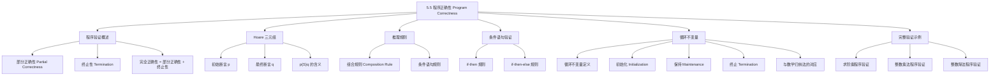

**相关笔记：** [[5.4 递归算法]] | [[2.1 集合]]

> [!abstract] 概览
> 本节介绍了==程序验证==（program verification）的基本理论，即如何用数学方法证明程序总是产生正确的输出。核心工具是 Tony Hoare 提出的==Hoare 三元组==（Hoare triple）和==循环不变量==（loop invariant）。
>
> - ==程序正确性== = ==部分正确性==（partial correctness）+ ==终止性==（termination）
> - ==初始断言==（initial assertion）/==前条件==（precondition）：输入值必须满足的性质
> - ==最终断言==（final assertion）/==后条件==（postcondition）：输出值应满足的性质
> - ==Hoare 三元组== $p\{S\}q$：程序段 $S$ 关于前条件 $p$ 和后条件 $q$ 部分正确
> - ==循环不变量==：在循环每次执行前后都保持为真的断言，是验证循环正确性的核心工具
> - 循环不变量三性质：==初始化==、==保持==、==终止==，与数学归纳法一一对应

---

## 一、知识结构总览



---

## 二、核心思想

> [!tip] 核心思想
> 本节的核心思想是==形式化程序验证==（formal program verification）：通过为程序指定==前条件==（precondition）和==后条件==（postcondition），利用逻辑推理规则和==循环不变量==（loop invariant），以数学证明的严格性来论证程序的正确性。程序正确性包含两个独立的部分——==部分正确性==（如果程序终止，则输出正确）和==终止性==（程序确实会终止）。循环不变量的三性质（初始化、保持、终止）与==数学归纳法==（基础步骤、归纳步骤、结论）完美对应，这使得归纳法成为程序验证的天然数学工具。

### 1. 程序验证概述

> [!def] 程序正确性
> 一个程序被称为==正确的==（correct），如果它对==每一个可能的输入==都产生正确的输出。
>
> 程序正确性的证明由两个独立部分组成：
> 1. ==部分正确性==（partial correctness）：如果程序终止，则输出正确
> 2. ==终止性==（termination）：程序确实会终止
>
> ==完全正确性==（total correctness）= 部分正确性 + 终止性

> [!def] 初始断言与最终断言
> - ==初始断言==（initial assertion）/==前条件==（precondition）：描述输入值必须满足的性质
> - ==最终断言==（final assertion）/==后条件==（postcondition）：描述程序输出值应当满足的性质
>
> 这两个断言必须与程序一起提供，才能进行正确性验证。

### 2. Hoare 三元组与部分正确性

> [!def] 部分正确性（Definition 1）
> 程序或程序段 $S$ 关于==初始断言== $p$ 和==最终断言== $q$ 是==部分正确的==（partially correct），如果每当 $p$ 对 $S$ 的输入值成立且 $S$ 终止时，$q$ 对 $S$ 的输出值成立。
>
> 记作 ==$p\{S\}q$==，称为==Hoare 三元组==（Hoare triple）。
>
> - Hoare 三元组 $p\{S\}q$ 由 Tony Hoare 引入
> - 部分正确性==不涉及程序是否终止==，只关心"如果终止了，输出是否正确"
> - 要证明完全正确性，还需要额外证明程序终止

> [!example] 例1：简单赋值语句的验证
> 验证程序段
> ```
> y := 2
> z := x + y
> ```
> 关于初始断言 $p: x = 1$ 和最终断言 $q: z = 3$ 是正确的。
>
> **证明**：假设 $p$ 为真，即 $x = 1$。执行 `y := 2` 后，$y = 2$。执行 `z := x + y` 后，$z = 1 + 2 = 3$。因此 $q$ 为真。$\blacksquare$

### 3. 推理规则

> [!thm] 组合规则（Composition Rule）
> 若程序 $S$ 由 $S_1$ 后接 $S_2$ 组成（记 $S = S_1; S_2$），且
>
> $$p\{S_1\}q \quad \text{和} \quad q\{S_2\}r$$
>
> 都成立，则
>
> $$\therefore\ p\{S_1; S_2\}r$$
>
> **直觉**：如果 $p$ 为真时 $S_1$ 终止后 $q$ 为真，而 $q$ 为真时 $S_2$ 终止后 $r$ 为真，那么 $p$ 为真时 $S_1; S_2$ 终止后 $r$ 为真。

### 4. 条件语句的验证

> [!thm] if-then 语句的推理规则
> 对于程序段 `if condition then S`，需要证明：
>
> $$(p \wedge \text{condition})\{S\}q \quad \text{和} \quad (p \wedge \neg\text{condition}) \to q$$
>
> 则：
>
> $$\therefore\ p\{\text{if condition then } S\}q$$
>
> **直觉**：条件为真时执行 $S$ 后 $q$ 成立；条件为假时不执行 $S$，但 $q$ 仍然成立。

> [!example] 例2：if-then 语句验证
> 验证程序段
> ```
> if x > y then
>   y := x
> ```
> 关于初始断言 $\top$（永真）和最终断言 $y \geq x$ 是正确的。
>
> **证明**：
> - 当 $\top$ 为真且 $x > y$ 为真时：执行 `y := x` 后 $y = x$，故 $y \geq x$ 成立
> - 当 $\top$ 为真且 $x > y$ 为假（即 $x \leq y$）时：不执行赋值，$y \geq x$ 仍然成立
>
> 因此程序段是正确的。$\blacksquare$

> [!thm] if-then-else 语句的推理规则
> 对于程序段 `if condition then S1 else S2`，需要证明：
>
> $$(p \wedge \text{condition})\{S_1\}q \quad \text{和} \quad (p \wedge \neg\text{condition})\{S_2\}q$$
>
> 则：
>
> $$\therefore\ p\{\text{if condition then } S_1 \text{ else } S_2\}q$$

> [!example] 例3：if-then-else 语句验证
> 验证程序段
> ```
> if x < 0 then
>   abs := -x
> else
>   abs := x
> ```
> 关于初始断言 $\top$ 和最终断言 $\text{abs} = |x|$ 是正确的。
>
> **证明**：
> - 当 $\top$ 为真且 $x < 0$ 时：执行 `abs := -x`，此时 $|x| = -x$，故 $\text{abs} = |x|$
> - 当 $\top$ 为真且 $x < 0$ 为假（即 $x \geq 0$）时：执行 `abs := x`，此时 $|x| = x$，故 $\text{abs} = |x|$
>
> 因此程序段是正确的。$\blacksquare$

### 5. 循环不变量

> [!def] 循环不变量（Loop Invariant）
> 对于 `while condition do S` 形式的循环，一个断言 $p$ 被称为==循环不变量==（loop invariant），如果在每次执行循环体 $S$ 前后 $p$ 都保持为真，即：
>
> $$(p \wedge \text{condition})\{S\}p$$
>
> 如果 $p$ 是循环不变量，且 $p$ 在进入循环前为真，则循环终止时：
>
> $$p\{\text{while condition do } S\}(\neg\text{condition} \wedge p)$$
>
> 即循环终止时，$p$ 为真且循环条件为假。

> [!thm] 循环不变量的三性质
> 要使用循环不变量 $p$ 验证 `while condition do S` 的正确性，需要证明三个性质：
>
> 1. ==初始化==（Initialization）：在循环开始前，$p$ 为真
> 2. ==保持==（Maintenance）：如果 $p$ 为真且循环条件为真，则执行 $S$ 后 $p$ 仍为真
> 3. ==终止==（Termination）：循环会终止，且终止时 $p \wedge \neg\text{condition}$ 蕴含期望的后条件
>
> 这三个性质与==数学归纳法==完美对应：
> - 初始化 $\leftrightarrow$ 基础步骤（Basis Step）
> - 保持 $\leftrightarrow$ 归纳步骤（Inductive Step）
> - 终止 $\leftrightarrow$ 归纳结论

> [!example] 例4：用循环不变量验证阶乘程序
> 验证以下程序在 $n$ 为正整数时终止且 $\text{factorial} = n!$：
> ```
> i := 1
> factorial := 1
> while i < n
>   i := i + 1
>   factorial := factorial * i
> ```
>
> **选择循环不变量**：$p$: "$\text{factorial} = i!$ 且 $i \leq n$"
>
> **1. 初始化**：循环开始前，$i = 1$，$\text{factorial} = 1 = 1!$，$i \leq n$，故 $p$ 为真。
>
> **2. 保持**：假设在循环某次迭代开始时 $p$ 为真（即 $\text{factorial} = i!$ 且 $i < n$）。执行循环体后：
> - $i_{\text{new}} = i + 1$
> - $\text{factorial}_{\text{new}} = \text{factorial} \cdot i_{\text{new}} = i! \cdot (i + 1) = (i + 1)!$
> - 因为 $i < n$，所以 $i_{\text{new}} = i + 1 \leq n$
>
> 因此 $p$ 在循环体执行后仍为真。
>
> **3. 终止**：循环条件为 $i < n$。每次迭代 $i$ 增加 $1$，初始 $i = 1$，经过 $n - 1$ 次迭代后 $i = n$，循环终止。终止时 $p$ 为真且 $i < n$ 为假，即 $\text{factorial} = i!$ 且 $i = n$，因此 $\text{factorial} = n!$。$\blacksquare$

### 6. 完整程序验证示例

> [!example] 例5：整数乘法程序的验证
> 验证以下程序计算两个整数的乘积：
> ```
> procedure multiply(m, n: integers)
> {
>   if n < 0 then a := -n
>   else a := n
>   {S1}
>   k := 0
>   x := 0
>   {S2}
>   while k < a
>     x := x + m
>     k := k + 1
>   {S3}
>   if n < 0 then product := -x
>   else product := x
>   {S4}
>   return product
> }
> ```
>
> **验证策略**：将程序分为四个程序段 $S = S_1; S_2; S_3; S_4$，使用组合规则逐步验证。
>
> - $p$: "$m$ 和 $n$ 是整数"（初始断言）
> - $p\{S_1\}q$，其中 $q$: "$a = |n|$"
> - $q\{S_2\}r$，其中 $r$: "$k = 0$ 且 $x = 0$"
> - $r\{S_3\}s$，其中循环不变量为 "$x = mk$ 且 $k \leq a$"，循环终止后 $s$: "$x = ma$ 且 $a = |n|$"
> - $s\{S_4\}t$，其中 $t$: "$\text{product} = mn$"（最终断言）
>
> 由组合规则，$p\{S\}t$ 成立。且所有四个程序段都终止，因此程序完全正确。$\blacksquare$

---

## 三、补充理解与易混淆点

### 补充理解

> [!info] 补充1：Hoare 逻辑与公理化语义
> ==Hoare 逻辑==（Hoare logic）由 Tony Hoare 于 1969 年在其经典论文 "An Axiomatic Basis for Computer Programming" 中提出，是==公理化语义==（axiomatic semantics）的基础。Hoare 逻辑的核心思想是为每种程序构造（赋值、顺序、条件、循环）提供一条==公理或推理规则==，使得程序的正确性可以像数学定理一样被形式化证明。Hoare 逻辑后来被发展为更完善的系统，包括 Dijkstra 的==最弱前置条件==（weakest precondition, wp）演算和 Floyd-Hoare 逻辑。在工业实践中，程序验证工具如 SPARK/Ada、Frama-C、Dafny 等都基于 Hoare 逻辑的变体。Tony Hoare 因其在程序逻辑和快速排序等方面的贡献，于 1980 年获得图灵奖。
>
> - [Hoare Logic - Stanford Encyclopedia of Philosophy](https://plato.stanford.edu/entries/logic-ai/) -- Hoare 逻辑的哲学与理论基础
> - [Dafny - Microsoft Research](https://github.com/dafny-lang/dafny) -- 基于 Hoare 逻辑的程序验证语言
> 来源：Hoare, C. A. R. (1969). "An Axiomatic Basis for Computer Programming." *Communications of the ACM*, 12(10), 576–580.
> 来源：Floyd, R. W. (1967). "Assigning Meanings to Programs." *Mathematical Aspects of Computer Science*, 19, 19–32.

> [!info] 补充2：循环不变量的实战技巧
> 寻找正确的循环不变量是程序验证中最具挑战性的环节。以下是一些实用技巧：
>
> 1. **从后条件反推**：思考"循环结束时需要什么条件为真"，然后考虑循环过程中什么性质能保持这个条件
> 2. **弱化后条件**：循环不变量通常比最终后条件更弱（包含更多信息），例如求最大值程序的不变量可能是"max 是已扫描元素中的最大值"
> 3. **包含循环变量的范围**：好的不变量通常包含循环变量的取值范围（如 $0 \leq i \leq n$）
> 4. **检查三性质**：找到候选不变量后，逐一验证初始化、保持、终止三个性质，如果不满足则调整
> 5. **类比数学归纳法**：初始化对应基础步骤，保持对应归纳步骤——如果归纳假设"不够强"，就需要加强不变量
>
> 经典例子：二分搜索的循环不变量为"目标值（如果存在）一定在当前搜索区间 $[\text{low}, \text{high}]$ 内"。
>
> - [Loop Invariants - MIT 6.006](https://ocw.mit.edu/courses/6-006-introduction-to-algorithms-fall-2011/) -- MIT 算法课程中的循环不变量讲解
> - [Weakest Precondition - Wikipedia](https://en.wikipedia.org/wiki/Predicate_transformer_semantics) -- 最弱前置条件与 Dijkstra 演算
> 来源：Dijkstra, E. W. (1976). *A Discipline of Programming*. Prentice-Hall, Chapter 4.
> 来源：Cormen, T. H., et al. (2009). *Introduction to Algorithms* (3rd ed.), MIT Press, Chapter 2 (Insertion Sort loop invariant).

### 易混淆点

> [!warning] 误区：部分正确性不等于完全正确性
> - ❌ 认为"证明了部分正确性就等于证明了程序正确"
> - ✅ 部分正确性只保证"如果程序终止，则输出正确"，但==不保证程序一定终止==
> - 经典反例：以下程序关于前条件 $p: x \geq 0$ 和后条件 $q: y = x^2$ 是**部分正确的**，但**不终止**：
>   ```
>   y := 0
>   while y != x * x
>     y := y + 1
>   ```
>   当 $x = 1$ 时，$y$ 从 $0$ 开始递增，$y$ 永远不会等于 $1 \cdot 1 = 1$... 实际上这个例子中 $x = 1$ 时 $y$ 会到达 $1$。更好的反例是：
>   ```
>   while true do
>     skip
>   ```
>   这个程序关于任何前条件和后条件都是部分正确的（因为前提"程序终止"永远不满足，蕴含式为空真），但显然不终止。
> - ⚠️ 完全正确性 = 部分正确性 + 终止性，两者缺一不可

> [!warning] 误区：循环不变量等于循环条件
> - ❌ 混淆"循环不变量"和"循环条件"
> - ✅ 两者是完全不同的概念：
>   - ==循环条件==（loop condition）：决定循环是否继续执行，如 `i < n`
>   - ==循环不变量==（loop invariant）：在每次循环迭代前后都为真的性质，如 "$\text{factorial} = i!$ 且 $i \leq n$"
> - 循环不变量通常**包含**循环条件所涉及变量的信息，但比循环条件更强
> - 循环终止时，循环条件为假，但循环不变量仍然为真——正是"不变量为真 + 条件为假"共同蕴含最终结果

---

## 四、习题精选

> [!todo] 习题概览
> | 题号范围 | 核心考点 | 难度 |
> |---------|---------|------|
> | 1-4 | 简单程序段的部分正确性验证 | ⭐⭐ |
> | 5-6 | 多分支条件语句的推理规则 | ⭐⭐ |
> | 7 | 用循环不变量验证幂运算程序 | ⭐⭐⭐ |
> | 8 | 用循环不变量验证斐波那契迭代程序 | ⭐⭐⭐ |
> | 9 | 完整程序验证（整数乘法）的详细证明 | ⭐⭐⭐ |
> | 10-11 | Hoare 三元组的逻辑性质 | ⭐⭐ |
> | 12 | 整数除法程序的部分正确性验证 | ⭐⭐⭐ |
> | 13 | 用循环不变量验证欧几里得算法 | ⭐⭐⭐⭐ |

### 题1：简单赋值语句验证

> [!problem] 题目
> 证明以下程序段关于初始断言 $x = 0$ 和最终断言 $y = 1$ 是正确的：
> ```
> y := 1
> ```

> [!faq]- 解答
> 假设初始断言 $x = 0$ 为真。执行 `y := 1` 后，$y = 1$，最终断言 $y = 1$ 为真。
>
> 注意：初始断言 $x = 0$ 在此例中并未被使用（程序不依赖 $x$ 的值），但这不影响正确性——只要初始断言为真时最终断言也为真即可。$\blacksquare$

### 题2：if-then-else 语句验证

> [!problem] 题目
> 验证以下程序段关于初始断言 $\top$ 和最终断言 $\text{abs} = |x|$ 是正确的：
> ```
> if x < 0 then
>   abs := -x
> else
>   abs := x
> ```

> [!faq]- 解答
> 需要验证两个情形：
>
> **情形1**：$\top \wedge (x < 0)$ 为真时，执行 `abs := -x`。因为 $x < 0$，$|x| = -x$，故 $\text{abs} = |x|$。
>
> **情形2**：$\top \wedge \neg(x < 0)$ 为真，即 $x \geq 0$ 时，执行 `abs := x`。因为 $x \geq 0$，$|x| = x$，故 $\text{abs} = |x|$。
>
> 两个情形下最终断言都成立，因此程序段正确。$\blacksquare$

### 题3：用循环不变量验证幂运算程序

> [!problem] 题目
> 用循环不变量证明以下计算 $x^n$（$n$ 为正整数）的程序是正确的：
> ```
> power := 1
> i := 1
> while i <= n
>   power := power * x
>   i := i + 1
> ```

> [!faq]- 解答
> **选择循环不变量**：$p$: "$\text{power} = x^i$ 且 $1 \leq i \leq n + 1$"
>
> **1. 初始化**：循环开始前，$\text{power} = 1 = x^1$，$i = 1$，故 $p$ 为真。
>
> **2. 保持**：假设 $p$ 为真且循环条件 $i \leq n$ 为真。执行循环体后：
> - $\text{power}_{\text{new}} = \text{power} \cdot x = x^i \cdot x = x^{i+1}$
> - $i_{\text{new}} = i + 1$
> - 因为 $i \leq n$，所以 $i_{\text{new}} = i + 1 \leq n + 1$
> - 且 $i_{\text{new}} \geq 2 > 1$
>
> 因此 $p$ 在循环体执行后仍为真。
>
> **3. 终止**：每次迭代 $i$ 增加 $1$，初始 $i = 1$，经过 $n$ 次迭代后 $i = n + 1 > n$，循环终止。终止时 $p$ 为真且 $i \leq n$ 为假，即 $\text{power} = x^i$ 且 $i = n + 1$，因此 $\text{power} = x^{n+1}$。
>
> 等等——这里需要注意循环条件的含义。循环条件是 $i \leq n$，所以当 $i = n + 1$ 时终止。但此时 $\text{power} = x^{n+1}$，不是 $x^n$。让我重新检查...
>
> 实际上，循环执行了 $n$ 次（从 $i = 1$ 到 $i = n$），每次将 $\text{power}$ 乘以 $x$。初始 $\text{power} = 1$，经过 $n$ 次乘法后 $\text{power} = x^n$。让我修正不变量。
>
> **修正的循环不变量**：$p$: "$\text{power} = x^{i-1}$ 且 $1 \leq i \leq n + 1$"
>
> **1. 初始化**：$i = 1$，$\text{power} = 1 = x^0 = x^{i-1}$，正确。
>
> **2. 保持**：假设 $\text{power} = x^{i-1}$ 且 $i \leq n$。执行后：
> - $\text{power}_{\text{new}} = x^{i-1} \cdot x = x^i = x^{(i+1)-1}$
> - $i_{\text{new}} = i + 1 \leq n + 1$
>
> **3. 终止**：$i = n + 1$ 时终止，$\text{power} = x^{(n+1)-1} = x^n$。$\blacksquare$

### 题4：整数除法程序验证

> [!problem] 题目
> 验证以下程序关于初始断言"$a$ 和 $d$ 是正整数"和最终断言"$q$ 和 $r$ 是整数，使得 $a = dq + r$ 且 $0 \leq r < d$"是部分正确的：
> ```
> r := a
> q := 0
> while r >= d
>   r := r - d
>   q := q + 1
> ```

> [!faq]- 解答
> **选择循环不变量**：$p$: "$a = dq + r$ 且 $r \geq 0$"
>
> **1. 初始化**：循环开始前，$r = a$，$q = 0$，$a = d \cdot 0 + a = dq + r$，$r = a > 0$，故 $p$ 为真。
>
> **2. 保持**：假设 $p$ 为真且 $r \geq d$。执行循环体后：
> - $r_{\text{new}} = r - d$
> - $q_{\text{new}} = q + 1$
> - $dq_{\text{new}} + r_{\text{new}} = d(q+1) + (r-d) = dq + d + r - d = dq + r = a$
> - $r_{\text{new}} = r - d \geq d - d = 0$
>
> 因此 $p$ 在循环体执行后仍为真。
>
> **3. 终止**：每次迭代 $r$ 减少 $d$（$d > 0$），$r$ 不会无限减小（$r \geq 0$），因此循环终止。终止时 $p$ 为真且 $r \geq d$ 为假，即 $a = dq + r$ 且 $0 \leq r < d$。
>
> 因此程序是部分正确的。由于每次 $r$ 至少减少 $1$（因为 $d \geq 1$），且 $r$ 初始为 $a$，循环最多执行 $\lfloor a/d \rfloor + 1$ 次后终止，因此程序也是完全正确的。$\blacksquare$

### 题5：欧几里得算法的部分正确性验证

> [!problem] 题目
> 用循环不变量验证欧几里得算法（第4.3节 Algorithm 1）关于初始断言"$a$ 和 $b$ 是正整数"和最终断言"$x = \gcd(a, b)$"是部分正确的：
> ```
> x := a
> y := b
> while y != 0
>   r := x mod y
>   x := y
>   y := r
> ```

> [!faq]- 解答
> **选择循环不变量**：$p$: "$\gcd(x, y) = \gcd(a, b)$ 且 $x > 0$ 且 $y \geq 0$"
>
> **1. 初始化**：循环开始前，$x = a$，$y = b$。$\gcd(a, b) = \gcd(a, b)$，$a > 0$，$b > 0$，故 $p$ 为真。
>
> **2. 保持**：假设 $p$ 为真且 $y \neq 0$。执行循环体后：
> - $r = x \bmod y$
> - $x_{\text{new}} = y$
> - $y_{\text{new}} = r = x \bmod y$
> - 由最大公约数性质：$\gcd(x_{\text{new}}, y_{\text{new}}) = \gcd(y, x \bmod y) = \gcd(x, y) = \gcd(a, b)$
> - $x_{\text{new}} = y > 0$（因为 $y \neq 0$ 且 $y \geq 0$）
> - $y_{\text{new}} = x \bmod y \geq 0$
>
> 因此 $p$ 在循环体执行后仍为真。
>
> **3. 终止**：每次迭代 $y$ 被替换为 $x \bmod y < y$（因为 $y \neq 0$），所以 $y$ 严格递减。$y$ 是非负整数，不可能无限递减，因此循环终止。终止时 $p$ 为真且 $y = 0$，即 $\gcd(x, 0) = \gcd(a, b)$。因为 $\gcd(x, 0) = x$，所以 $x = \gcd(a, b)$。$\blacksquare$

> [!tip] 解题思路提示
> 程序验证的解题方法论：
> 1. **明确前条件和后条件**：根据题意确定输入和输出应满足的性质
> 2. **选择循环不变量**：从后条件出发反推，找到一个在循环过程中始终为真的性质
> 3. **验证三性质**：初始化（循环前为真）、保持（执行循环体后仍为真）、终止（终止时蕴含后条件）
> 4. **证明终止性**：找到一个严格递减的量（如循环计数器、余数等），证明它不会无限递减
> 5. **使用组合规则**：将复杂程序分解为多个程序段，分别验证后用组合规则组合

---

## 五、视频学习指南

> [!info] 视频资源
> | 资源 | 链接 | 对应内容 | 备注 |
> |:-----|:-----|:---------|:-----|
> | Rosen 8e Section 5.5 | [教材原文](https://www.mheducation.com/highered/product/discrete-mathematics-applications-rosen/M9781259676512.html) | 完整定义、定理与例题 | 英文教材 |
> | MIT 6.042J Lecture 6 | [链接](https://www.youtube.com/watch?v=i7vKU9bC0Sk) | 程序正确性与循环不变量 | 英文，MIT开放课程 |
> | Hoare Logic - NICTA Course | [链接](https://www.youtube.com/watch?v=QdsxKjGnRfA) | Hoare 逻辑系统讲解 | 英文 |

---

## 六、教材原文

> [!quote] 教材原文
> "Suppose that we have designed an algorithm to solve a problem and have written a program to implement it. How can we be sure that the program always produces the correct answer? After all the bugs have been removed so that the syntax is correct, we can test the program with sample input. It is not correct if an incorrect result is produced for any sample input. But even if the program gives the correct answer for all sample input, it may not always produce the correct answer (unless all possible input has been tested). We need a proof to show that the program always gives the correct output."
>
> "Note that the notion of partial correctness has nothing to do with whether a program terminates; it focuses only on whether the program does what it is expected to do if it terminates."
>
> "Tony Hoare was first to define a programming language based on how programs could be proved correct with respect to their specifications."

---

## 参见 Wiki

- [[离散数学/concepts/程序正确性]] -- 程序验证的基本理论
- [[离散数学/concepts/Hoare三元组]] -- Hoare 三元组的定义与性质
- [[离散数学/concepts/循环不变量]] -- 循环不变量的选择与验证
- [[离散数学/concepts/数学归纳法]] -- 数学归纳法与程序验证的联系
- [[离散数学/concepts/递归算法|递归算法正确性]] -- 递归算法的归纳法证明
- [[离散数学/concepts/推理规则|逻辑推理规则]] -- 程序验证中使用的推理规则

#学习/离散数学/归纳与递归
