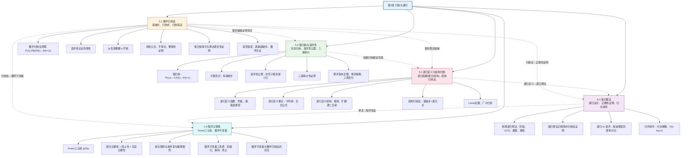

# 第05章 归纳与递归 — 章节汇总

> [!abstract] 概览
> 第5章系统介绍了==数学归纳法==、==强归纳法==、==递归定义==、==递归算法==与==程序正确性==五大核心主题，构成离散数学中"归纳与递归"思想的完整体系。全章从==数学归纳法==的基础原理出发（5.1），建立"基础步 + 归纳步"的证明范式；进而引入==强归纳法==与==良序性==（5.2），拓展归纳假设的范围并揭示三者的等价关系；然后转向==递归定义==与==结构归纳==（5.3），将归纳思想从整数推广到递归定义的函数、集合与结构；接着将递归思想应用于算法设计（5.4），展示递归算法的设计、正确性证明与复杂度分析；最终将归纳法与程序验证结合（5.5），通过==Hoare 三元组==与==循环不变量==实现形式化的程序正确性证明。全章体现了从"证明技术"到"定义方法"再到"算法实现"与"正确性验证"的完整知识链条。

---

## 全章知识框架



---

## 各节核心知识点汇总

### 5.1 数学归纳法

- ==数学归纳法原理==：$P(1) \wedge \forall k(P(k) \to P(k+1)) \to \forall n\, P(n)$，由==基础步==（验证 $P(1)$）和==归纳步==（证明 $P(k) \to P(k+1)$）两部分组成
- ==归纳假设==（Inductive Hypothesis）：假设 $P(k)$ 对任意正整数 $k$ 为真，它是推导 $P(k+1)$ 的出发点，不是循环论证
- 数学归纳法的有效性建立在正整数集的==良序性==之上，可通过反证法严格论证
- 可从任意整数 $b$ 开始（$b$ 可为负数、零或正数），基础步验证 $P(b)$，归纳步证明 $\forall k \geq b,\, P(k) \to P(k+1)$
- 典型应用：==求和公式==（等差、等比、平方和）、==不等式==（$n < 2^n$、调和数不等式）、==整除性==（$3 \mid n^3 - n$）、==集合恒等式==（De Morgan 律推广）、==算法最优性==（贪心调度）
- 数学归纳法是==证明工具==而非==发现工具==，必须先有猜想再用归纳法证明
- 常见错误：遗漏基础步、归纳步隐含额外条件（如 $k \geq 3$ 但基础步只验证 $P(1)$）、循环论证

### 5.2 强归纳与良序性

- ==强归纳法==：归纳步假设 $P(1) \wedge P(2) \wedge \cdots \wedge P(k) \to P(k+1)$，允许利用所有前驱命题，比普通归纳更灵活
- ==扩展形式==：基础步验证多个起始命题 $P(b), P(b+1), \ldots, P(b+j)$，适用于归纳步仅对大于特定整数的值有效的情况
- ==良序性公理==：每个非空非负整数集合都有最小元，是数学归纳法和强归纳法的共同理论基础
- ==三者等价==：数学归纳法 $\equiv$ 强归纳法 $\equiv$ 良序性，从任何一个出发可推导出另外两个，证明能力完全等价
- 强归纳的典型应用：==算术基本定理==（素数分解存在性）、==博弈策略==（匹配游戏第二玩家必胜）、==邮票问题==（组合覆盖性证明）、==三角剖分定理==（$n$ 边形分为 $n-2$ 个三角形）
- 良序性的直接应用：==除法算法==的存在性证明、==循环赛中三角循环==的存在性证明
- 选择指南：除非能清楚看到普通归纳的归纳步可行，否则优先尝试强归纳

### 5.3 递归定义与结构归纳

- ==递归定义函数==：基础步指定 $f(0)$（或多个起始值），递归步用 $f$ 在较小整数上的值定义 $f(n+1)$；良定义性由数学归纳法保证
- 经典递归函数：==阶乘== $n! = n \cdot (n-1)!$、==幂函数== $a^{n+1} = a \cdot a^n$、==斐波那契数列== $f_n = f_{n-1} + f_{n-2}$（需两个起始值）
- ==递归定义集合==：基础步给出初始元素（种子），递归步给出构造规则（生长），排斥规则限定集合范围
- 重要递归集合：==字符串集 $\Sigma^*$==（空串 $\lambda$ + 逐符号拼接）、==合式公式 WFF==（命题变量 + 逻辑运算符递归构造）
- ==递归定义结构==：==根树==（单顶点 + 子树连接）、==扩展二叉树==（空集 + 左右子树）、==满二叉树==（单顶点 + 非空左右子树）
- ==结构归纳法==：基础步验证初始元素，递归步证明"若性质对构造元素成立，则对新构造的元素也成立"；有效性通过"生成步数"映射到数学归纳法
- ==Lame定理==：欧几里得算法的除法次数不超过 $b$ 的十进制位数的 5 倍，基于斐波那契数列的下界估计
- ==广义归纳==：将归纳法推广到任何具有良序性的集合（如 $\mathbb{N} \times \mathbb{N}$ 的字典序），用于双变量递归定义的证明

### 5.4 递归算法

- ==递归算法==：通过将问题归约为同一问题在更小输入上的实例来求解，必须包含==基础情形==（直接给出解）和==递归步骤==（归约为更小输入）
- 经典递归算法：==阶乘==（Algorithm 1）、==幂运算==（Algorithm 2）、==最大公约数==（Algorithm 3，欧几里得算法的递归版本）、==模幂运算==（Algorithm 4，快速幂递归版）
- ==搜索算法的递归版本==：==线性搜索==（每次缩小一个元素）、==二分搜索==（每次缩小约一半，$O(\log n)$）
- 递归算法的正确性用==数学归纳法==或==强归纳法==证明：基础步骤对应基础情形，归纳步骤对应递归步骤
- ==递归 vs 迭代==：斐波那契递归版本存在大量重复计算（$O(2^n)$ 次加法），迭代版本仅需 $O(n)$ 次加法；可通过记忆化优化递归
- ==归并排序==：基于==分治策略==的递归排序算法——分割为子列表（递归）+ 合并有序子列表；最坏情况 $O(n \log n)$ 次比较
- 归并排序复杂度证明：合并两个长度分别为 $m$ 和 $n$ 的有序列表最多 $m + n - 1$ 次比较（Lemma 1）；$n = 2^m$ 时总比较次数为 $n \log n - n + 1$

### 5.5 程序正确性

- ==程序正确性== = ==部分正确性==（如果程序终止，则输出正确）+ ==终止性==（程序确实会终止）
- ==Hoare 三元组== $p\{S\}q$：程序段 $S$ 关于==前条件== $p$ 和==后条件== $q$ 部分正确；由 Tony Hoare 引入
- ==组合规则==：若 $p\{S_1\}q$ 且 $q\{S_2\}r$，则 $p\{S_1; S_2\}r$；将复杂程序分解为多个程序段逐步验证
- ==条件语句推理规则==：if-then 需验证 $(p \wedge \text{condition})\{S\}q$ 和 $(p \wedge \neg\text{condition}) \to q$；if-then-else 需分别验证两个分支
- ==循环不变量==（Loop Invariant）：在循环每次执行前后都保持为真的断言，是验证循环正确性的核心工具
- 循环不变量三性质：==初始化==（循环前为真）$\leftrightarrow$ 基础步骤；==保持==（执行循环体后仍为真）$\leftrightarrow$ 归纳步骤；==终止==（终止时 $p \wedge \neg\text{condition}}$ 蕴含后条件）$\leftrightarrow$ 归纳结论
- 部分正确性不等于完全正确性：需额外证明终止性（通常通过找到严格递减的量）
- 完整验证示例：阶乘程序、整数乘法程序、整数除法程序、欧几里得算法的循环不变量验证

---

## 学习脉络

```
数学归纳法（5.1）— 归纳证明的基础范式
  ↓
强归纳与良序性（5.2）— 拓展归纳假设范围，揭示理论根基
  ↓
递归定义与结构归纳（5.3）— 将归纳思想从整数推广到递归结构
  ↓
递归算法（5.4）— 递归思想的算法实现与复杂度分析
  ↓
程序正确性（5.5）— 归纳法在程序验证中的形式化应用
```

**学习建议**：5.1 节是全章的基石——务必透彻理解数学归纳法的两步结构（基础步 + 归纳步）和归纳假设的本质（不是循环论证），通过求和公式、不等式、整除性三类经典证明建立归纳证明的"手感"；5.2 节是 5.1 的自然延伸——重点理解强归纳何时比普通归纳更方便（$P(k+1)$ 依赖于多个前驱时），以及三者等价性的逻辑含义，算术基本定理的证明是强归纳的典范应用；5.3 节是全章的转折点——从"证明关于整数的命题"转向"定义和证明关于递归结构的命题"，递归定义函数/集合/结构的三种范式和结构归纳法的对应证明模式需要反复练习；5.4 节侧重"算法视角"——递归算法的设计本质上是将递归定义转化为可执行代码，正确性证明直接套用归纳法模板，归并排序的 $O(n \log n)$ 复杂度分析是分治策略的入门案例；5.5 节是全章的升华——循环不变量的三性质与数学归纳法完美对应，体现了归纳思想从纯数学到程序工程的贯穿，选择合适的循环不变量是核心难点。

---

## 跨章关联

| 关联章节 | 关联内容 | 关联方式 |
|:---------|:---------|:---------|
| 第1章 逻辑与证明 | 证明方法（反证法、条件语句证明）→归纳证明中的推理策略 | 工具支撑 |
| 第2章 集合与函数 | 函数→递归定义函数；序列→递归序列（如斐波那契）；集合→递归定义集合 | 直接应用 |
| 第2章 矩阵 | 矩阵运算→递归矩阵算法（如 Strassen 乘法） | 深化 |
| 第3章 算法 | 算法→递归算法设计；大O记号→递归算法复杂度分析 | 直接应用 |
| 第3章 函数的增长 | 大O记号→归并排序 $O(n \log n)$、递归算法效率比较 | 工具支撑 |
| 第4章 数论与密码学 | 整除性→归纳证明整除命题；素数→强归纳证明算术基本定理；欧几里得算法→递归实现与正确性证明 | 深化 |
| 第6章 计数 | 组合计数→归纳法证明组合恒等式（如 $\binom{n}{k}$ 的性质） | 工具支撑 |
| 第8章 递归关系 | 递归定义→递推关系的建立；递归算法→递推关系求解复杂度 | 直接应用 |
| 第10-11章 图论与树 | 递归定义结构→树的递归定义与遍历；结构归纳→树性质证明 | 深化 |

---

## 综合复习题

> [!faq]- 综合复习题 1（跨 5.1 / 5.2 / 5.3）
> **题目：** (a) 用数学归纳法证明：对所有正整数 $n$，$\displaystyle\sum_{i=1}^{n} i^3 = \left(\frac{n(n+1)}{2}\right)^2$。
> (b) 用强归纳法证明：每个大于 1 的整数都可以写成素数之积（算术基本定理的存在性部分）。
> (c) 斐波那契数列定义为 $f_0 = 0$，$f_1 = 1$，$f_n = f_{n-1} + f_{n-2}$（$n \geq 2$）。用结构归纳或强归纳证明：$\displaystyle\sum_{i=1}^{n} f_i^2 = f_n \cdot f_{n+1}$。
>
> **解答：**
>
> **(a)** 设 $P(n)$ 为 "$\displaystyle\sum_{i=1}^{n} i^3 = \left(\frac{n(n+1)}{2}\right)^2$"。
>
> **基础步**：$P(1)$：$1^3 = 1 = \left(\frac{1 \cdot 2}{2}\right)^2 = 1$，为真。
>
> **归纳步**：归纳假设 $P(k)$ 为真。需证 $P(k+1)$：
> $$\sum_{i=1}^{k+1} i^3 = \left(\frac{k(k+1)}{2}\right)^2 + (k+1)^3 = \frac{k^2(k+1)^2}{4} + (k+1)^3$$
> $$= \frac{(k+1)^2[k^2 + 4(k+1)]}{4} = \frac{(k+1)^2(k^2 + 4k + 4)}{4} = \frac{(k+1)^2(k+2)^2}{4}$$
> $$= \left(\frac{(k+1)(k+2)}{2}\right)^2$$
>
> 由数学归纳法，$P(n)$ 对所有正整数 $n$ 为真。$\blacksquare$
>
> **(b)** 设 $P(n)$ 为"$n$ 可以写成素数之积"。
>
> **基础步**：$P(2)$ 为真，因为 2 本身是素数。
>
> **归纳步**（强归纳）：假设对所有 $2 \leq j \leq k$，$P(j)$ 为真。需证 $P(k+1)$ 为真。
>
> - 若 $k+1$ 是素数，则 $P(k+1)$ 直接为真。
> - 若 $k+1$ 是合数，则 $k+1 = a \cdot b$，其中 $2 \leq a \leq b < k+1$。由归纳假设，$a$ 和 $b$ 都可以写成素数之积，因此 $k+1 = a \cdot b$ 也可以写成素数之积。
>
> 因此 $P(k+1)$ 为真。$\blacksquare$
>
> **(c)** 设 $P(n)$ 为"$\displaystyle\sum_{i=1}^{n} f_i^2 = f_n \cdot f_{n+1}$"。
>
> **基础步**：$P(1)$：$f_1^2 = 1 = 1 \cdot 1 = f_1 \cdot f_2$，为真。
>
> **归纳步**（普通归纳）：假设 $P(k)$ 为真，即 $\displaystyle\sum_{i=1}^{k} f_i^2 = f_k \cdot f_{k+1}$。需证 $P(k+1)$：
> $$\sum_{i=1}^{k+1} f_i^2 = f_k \cdot f_{k+1} + f_{k+1}^2 = f_{k+1}(f_k + f_{k+1}) = f_{k+1} \cdot f_{k+2}$$
>
> 最后一步使用了 $f_{k+2} = f_{k+1} + f_k$。$\blacksquare$

> [!faq]- 综合复习题 2（跨 5.3 / 5.4 / 5.5）
> **题目：** (a) 给出计算 $a^n \bmod m$ 的递归算法（快速幂），并用强归纳法证明其正确性。
> (b) 跟踪该算法计算 $3^{11} \bmod 5$ 的完整过程。
> (c) 将快速幂改写为迭代版本，并用循环不变量证明其正确性。
>
> **解答：**
>
> **(a)** 递归算法：
> ```
> procedure mpower(b, n, m)
>   if n = 0 then return 1
>   else if n is even then
>     return mpower(b, n/2, m)^2 mod m
>   else
>     return (mpower(b, floor(n/2), m)^2 * b) mod m
> ```
>
> **正确性证明**（对 $n$ 用强归纳）：
>
> **基础步**：$n = 0$ 时返回 $1 = b^0 \bmod m$，正确。
>
> **归纳步**：假设对所有 $0 \leq j < k$，$\text{mpower}(b, j, m) = b^j \bmod m$。
>
> - $k$ 为偶数：$\text{mpower}(b, k, m) = (\text{mpower}(b, k/2, m))^2 \bmod m = (b^{k/2} \bmod m)^2 \bmod m = b^k \bmod m$
> - $k$ 为奇数：$\text{mpower}(b, k, m) = ((\text{mpower}(b, \lfloor k/2 \rfloor, m))^2 \cdot b) \bmod m = (b^{2\lfloor k/2 \rfloor} \cdot b) \bmod m = b^{2\lfloor k/2 \rfloor + 1} \bmod m = b^k \bmod m$
>
> $\blacksquare$
>
> **(b)** 计算 $3^{11} \bmod 5$：
> - $\text{mpower}(3, 11, 5)$：$11$ 为奇数 $\to (\text{mpower}(3, 5, 5)^2 \cdot 3) \bmod 5$
> - $\text{mpower}(3, 5, 5)$：$5$ 为奇数 $\to (\text{mpower}(3, 2, 5)^2 \cdot 3) \bmod 5$
> - $\text{mpower}(3, 2, 5)$：$2$ 为偶数 $\to \text{mpower}(3, 1, 5)^2 \bmod 5$
> - $\text{mpower}(3, 1, 5)$：$1$ 为奇数 $\to (\text{mpower}(3, 0, 5)^2 \cdot 3) \bmod 5$
> - $\text{mpower}(3, 0, 5) = 1$
> - 回代：$\text{mpower}(3, 1, 5) = (1 \cdot 3) \bmod 5 = 3$
> - $\text{mpower}(3, 2, 5) = 3^2 \bmod 5 = 4$
> - $\text{mpower}(3, 5, 5) = (4^2 \cdot 3) \bmod 5 = (16 \cdot 3) \bmod 5 = 48 \bmod 5 = 3$
> - $\text{mpower}(3, 11, 5) = (3^2 \cdot 3) \bmod 5 = (9 \cdot 3) \bmod 5 = 27 \bmod 5 = 2$
>
> 验证：$3^{11} = 177147$，$177147 \bmod 5 = 2$。$\blacksquare$
>
> **(c)** 迭代版本：
> ```
> result := 1
> x := b mod m
> while n > 0
>   if n is odd then result := (result * x) mod m
>   x := (x * x) mod m
>   n := floor(n / 2)
> return result
> ```
>
> **循环不变量**：$p$: "$\text{result} \cdot x^n \equiv b^{n_0} \pmod{m}$"，其中 $n_0$ 是初始指数。
>
> **初始化**：循环前 $\text{result} = 1$，$x = b \bmod m$，$n = n_0$。$1 \cdot (b \bmod m)^{n_0} \equiv b^{n_0} \pmod{m}$，$p$ 为真。
>
> **保持**：假设 $p$ 为真且 $n > 0$。
> - 若 $n$ 为奇数：$\text{result}_{\text{new}} = (\text{result} \cdot x) \bmod m$，$x_{\text{new}} = x^2 \bmod m$，$n_{\text{new}} = \lfloor n/2 \rfloor$。
>   $\text{result}_{\text{new}} \cdot x_{\text{new}}^{n_{\text{new}}} = (\text{result} \cdot x) \cdot (x^2)^{\lfloor n/2 \rfloor} = \text{result} \cdot x^{1 + 2\lfloor n/2 \rfloor} = \text{result} \cdot x^n \equiv b^{n_0} \pmod{m}$
> - 若 $n$ 为偶数：$\text{result}_{\text{new}} = \text{result}$，$x_{\text{new}} = x^2 \bmod m$，$n_{\text{new}} = n/2$。
>   $\text{result}_{\text{new}} \cdot x_{\text{new}}^{n_{\text{new}}} = \text{result} \cdot (x^2)^{n/2} = \text{result} \cdot x^n \equiv b^{n_0} \pmod{m}$
>
> **终止**：$n$ 每次至少减半（$\lfloor n/2 \rfloor < n$），最终 $n = 0$。终止时 $\text{result} \cdot x^0 = \text{result} \equiv b^{n_0} \pmod{m}$。$\blacksquare$

> [!faq]- 综合复习题 3（跨 5.1 / 5.2 / 5.4 / 5.5）
> **题目：** (a) 用强归纳证明：所有 $n \geq 12$ 的邮资都可以用 4 分和 5 分邮票凑出。
> (b) 设计一个递归算法判断给定邮资 $n \geq 12$ 是否可以用 4 分和 5 分邮票凑出，并用归纳法证明其正确性。
> (c) 用循环不变量验证以下迭代程序计算 $\gcd(a, b)$ 的部分正确性：
> ```
> x := a; y := b
> while y != 0
>   r := x mod y
>   x := y
>   y := r
> ```
>
> **解答：**
>
> **(a)** 设 $P(n)$ 为"邮资 $n$ 分可以用 4 分和 5 分邮票凑出"。
>
> **基础步**：$P(12) = 3 \times 4$，$P(13) = 2 \times 4 + 5$，$P(14) = 4 + 2 \times 5$，$P(15) = 3 \times 5$，均为真。
>
> **归纳步**：假设对所有 $12 \leq j \leq k$（$k \geq 15$），$P(j)$ 为真。需证 $P(k+1)$ 为真。
>
> 因为 $k \geq 15$，所以 $k - 3 \geq 12$。由归纳假设 $P(k-3)$ 为真，即 $k-3$ 分可凑出。在 $k-3$ 分的基础上加一张 4 分邮票，得 $(k-3) + 4 = k+1$ 分。$\blacksquare$
>
> **(b)** 递归算法：
> ```
> procedure postage(n: integer, n >= 0)
>   if n = 0 then return true
>   else if n < 0 then return false
>   else return postage(n - 4) or postage(n - 5)
> ```
>
> **正确性证明**（对 $n$ 用强归纳）：
>
> **基础步**：$n = 0$ 返回 true（0 分不需要邮票），正确。
>
> **归纳步**：假设算法对所有 $0 \leq j < k$ 正确。需证算法对 $k$ 正确。
>
> - 若 $k < 0$：返回 false，正确（负数邮资不可能凑出）。
> - 若 $k = 0$：返回 true，正确。
> - 若 $k > 0$：算法返回 $\text{postage}(k-4) \lor \text{postage}(k-5)$。由归纳假设，$\text{postage}(k-4)$ 为真当且仅当 $k-4$ 分可凑出，$\text{postage}(k-5)$ 为真当且仅当 $k-5$ 分可凑出。而 $k$ 分可凑出当且仅当 $k-4$ 分或 $k-5$ 分可凑出（因为可加一张 4 分或 5 分邮票）。因此算法返回值正确。$\blacksquare$
>
> **(c)** **循环不变量**：$p$: "$\gcd(x, y) = \gcd(a, b)$ 且 $x > 0$ 且 $y \geq 0$"。
>
> **初始化**：循环前 $x = a$，$y = b$。$\gcd(a, b) = \gcd(a, b)$，$a > 0$，$b > 0$，故 $p$ 为真。
>
> **保持**：假设 $p$ 为真且 $y \neq 0$。执行循环体后：
> - $r = x \bmod y$
> - $x_{\text{new}} = y > 0$（因为 $y \neq 0$ 且 $y \geq 0$）
> - $y_{\text{new}} = r = x \bmod y \geq 0$
> - $\gcd(x_{\text{new}}, y_{\text{new}}) = \gcd(y, x \bmod y) = \gcd(x, y) = \gcd(a, b)$（由 GCD 的基本性质）
>
> 因此 $p$ 在循环体执行后仍为真。
>
> **终止**：每次迭代 $y$ 被替换为 $x \bmod y < y$（因为 $y \neq 0$），$y$ 严格递减。$y$ 是非负整数，不可能无限递减，因此循环终止。终止时 $p$ 为真且 $y = 0$，即 $\gcd(x, 0) = \gcd(a, b)$。因为 $\gcd(x, 0) = x$，所以 $x = \gcd(a, b)$。$\blacksquare$

---

## 笔记索引

| 小节 | 笔记链接 | 核心主题 |
|:-----|:---------|:---------|
| 5.1 | [[5.1 数学归纳法]] | 数学归纳法原理、基础步与归纳步、归纳假设、求和/不等式/整除性/集合恒等式证明 |
| 5.2 | [[5.2 强归纳与良序性]] | 强归纳法、良序性公理、三者等价性、算术基本定理、博弈策略、三角剖分 |
| 5.3 | [[5.3 递归定义与结构归纳]] | 递归定义函数/集合/结构、斐波那契数列、结构归纳法、Lame定理、广义归纳 |
| 5.4 | [[5.4 递归算法]] | 递归算法设计与正确性证明、递归 vs 迭代、归并排序 $O(n \log n)$ |
| 5.5 | [[5.5 程序正确性]] | Hoare 三元组、部分正确性与终止性、循环不变量三性质、程序验证示例 |

#学习/离散数学/归纳与递归
