**相关笔记：** [[5.5 程序正确性]] | [[6.2 鸽巢原理]]

> [!abstract] 概览
> 本节系统介绍了组合数学的==基本计数法则==，是整个计数理论的基石。核心内容包括==乘法法则（product rule）==、==加法法则（sum rule）==、==减法法则/容斥原理（inclusion-exclusion）==、==除法法则（division rule）==以及==树图（tree diagrams）==。这些法则看似简单，但组合使用时可以解决大量复杂的计数问题，包括位串计数、函数计数、密码计数、子集计数、IP地址计数等实际应用。
>
> - ==乘法法则==：若任务分为 $m$ 个步骤，第 $i$ 步有 $n_i$ 种方式，则共有 $n_1 \cdot n_2 \cdot \cdots \cdot n_m$ 种方式
> - ==加法法则==：若任务可用 $m$ 种互斥方式完成，第 $i$ 种有 $n_i$ 种方式，则共有 $n_1 + n_2 + \cdots + n_m$ 种方式
> - ==减法法则（容斥原理）==：$|A_1 \cup A_2| = |A_1| + |A_2| - |A_1 \cap A_2|$，用于处理集合有重叠的情况
> - ==除法法则==：若任务可用 $n$ 种方式完成，但每种等价方式重复了 $d$ 次，则实际有 $n/d$ 种不同方式
> - ==树图==：用分支表示每种选择，用叶节点表示所有可能结果，适合可视化枚举

---

## 一、知识结构总览

```mermaid
graph TB
    A["6.1 计数基础 The Basics of Counting"] --> B["乘法法则 Product Rule"]
    A --> C["加法法则 Sum Rule"]
    A --> D["减法法则/容斥原理 Inclusion-Exclusion"]
    A --> E["除法法则 Division Rule"]
    A --> F["树图 Tree Diagrams"]
    A --> G["综合应用"]

    B --> B1["基本形式：两步任务"]
    B --> B2["扩展形式：m步任务"]
    B --> B3["笛卡尔积：|A1×...×Am|"]
    B --> B4["应用：位串、函数、密码、子集"]

    C --> C1["基本形式：互斥任务"]
    C --> C2["扩展形式：m种互斥方式"]
    C --> C3["集合并集：不相交集合并"]

    D --> D1["两集合容斥公式"]
    D --> D2["补集计数技巧"]
    D --> D3["应用：位串条件计数"]

    E --> E1["d-to-one函数模型"]
    E --> E2["圆排列问题"]
    E --> E3["等价类计数"]

    F --> F1["分支=选择，叶=结果"]
    F --> F2["应用：无连续1的位串"]
    F --> F3["应用：比赛结果枚举"]

    G --> G1["密码计数（乘法+减法）"]
    G --> G2["IPv4地址计数（乘法+加法+减法）"]
    G --> G3["变量名计数（乘法+加法）"]
    G --> G4["DNA序列计数"]
```

---

## 二、核心思想

> [!tip] 核心思想
> 本节的核心思想是==分步与分类==（step-by-step vs. case-by-case）：将复杂的计数问题分解为若干简单子问题，然后根据子问题之间的关系选择合适的法则进行组合。==乘法法则==对应"分步"思维——当完成一个任务需要依次执行多个步骤时，将各步骤的选择数相乘；==加法法则==对应"分类"思维——当完成一个任务有多种互斥途径时，将各类途径的选择数相加。掌握何时用乘法、何时用加法，是解决一切计数问题的关键。而==容斥原理==则是对加法法则的修正——当分类之间存在重叠时，必须减去重复计数的部分。

### 1. 乘法法则（Product Rule）

> [!def] 乘法法则（Product Rule）
> 若一个过程可以分解为两个连续的任务，第一个任务有 $n_1$ 种完成方式，且对于第一个任务的每一种完成方式，第二个任务都有 $n_2$ 种完成方式，则完成整个过程共有 $n_1 \cdot n_2$ 种方式。
>
> **扩展形式**：若过程分为 $m$ 个步骤 $T_1, T_2, \ldots, T_m$，每个步骤 $T_i$ 有 $n_i$ 种方式（无论前面的步骤如何完成），则共有 $n_1 \cdot n_2 \cdot \cdots \cdot n_m$ 种方式。
>
> - 集合语言：$|A_1 \times A_2 \times \cdots \times A_m| = |A_1| \cdot |A_2| \cdot \cdots \cdot |A_m|$
> - 直觉含义：==每一步的选择独立于前面步骤的选择==

> [!example] 例1：分配办公室
> 一家公司有两名员工 Sanchez 和 Patel，租了一层有12间办公室的楼层。有多少种不同的分配方式（每人一间不同办公室）？
>
> 分配 Sanchez 有12种方式，分配 Patel 有11种方式（不能与 Sanchez 相同）。由乘法法则：$12 \times 11 = 132$ 种。

> [!example] 例2：长度为7的位串
> 有多少种不同的长度为7的位串？
>
> 每个位有2种选择（0或1），共7个位。由乘法法则：$2^7 = 128$ 种。

> [!example] 例3：函数计数
> 从一个 $m$ 元集合到一个 $n$ 元集合有多少个函数？
>
> 对定义域中的每个元素，需要从陪域中选择一个像。共 $m$ 个元素，每个有 $n$ 种选择。由乘法法则：$n^m$ 个函数。
>
> 例如，从3元集合到5元集合有 $5^3 = 125$ 个函数。

> [!example] 例4：单射函数计数
> 从一个 $m$ 元集合到一个 $n$ 元集合（$m \leq n$）有多少个单射函数？
>
> 第一个元素有 $n$ 种选择，第二个有 $n-1$ 种（不能重复），……，第 $m$ 个有 $n-m+1$ 种。由乘法法则：
> $$n(n-1)(n-2)\cdots(n-m+1)$$
> 例如，从3元集合到5元集合有 $5 \times 4 \times 3 = 60$ 个单射函数。

> [!example] 例5：子集计数
> 证明有限集 $S$ 的不同子集数为 $2^{|S|}$。
>
> 将 $S$ 的元素按任意顺序排列。每个子集对应一个长度为 $|S|$ 的位串：第 $i$ 位为1表示第 $i$ 个元素在子集中，为0表示不在。由乘法法则，长度为 $|S|$ 的位串有 $2^{|S|}$ 个，因此 $|\mathcal{P}(S)| = 2^{|S|}$。

> [!example] 例6：密码计数（综合应用）
> 计算机系统密码长度为6到8个字符，每个字符是大写字母或数字，且必须包含至少一个数字。有多少种可能的密码？
>
> 设 $P$ 为总密码数，$P_6, P_7, P_8$ 分别为长度6、7、8的密码数。由加法法则：$P = P_6 + P_7 + P_8$。
>
> 对 $P_6$：总字符串数（含无数字的）为 $36^6$，其中无数字的为 $26^6$。由减法法则：
> $$P_6 = 36^6 - 26^6 = 2{,}176{,}782{,}336 - 308{,}915{,}776 = 1{,}867{,}866{,}560$$
>
> 类似地：
> $$P_7 = 36^7 - 26^7 = 78{,}364{,}164{,}096 - 8{,}031{,}810{,}176 = 70{,}332{,}353{,}920$$
> $$P_8 = 36^8 - 26^8 = 2{,}821{,}109{,}907{,}456 - 208{,}827{,}064{,}576 = 2{,}612{,}282{,}842{,}880$$
>
> 因此 $P = P_6 + P_7 + P_8 = 2{,}684{,}483{,}063{,}360$。

### 2. 加法法则（Sum Rule）

> [!def] 加法法则（Sum Rule）
> 若一个任务可以用第一种方式中的 $n_1$ 种方法完成，或者用第二种方式中的 $n_2$ 种方法完成，且两种方式中==没有相同的方法==，则完成该任务共有 $n_1 + n_2$ 种方法。
>
> **扩展形式**：若任务可用 $m$ 种互斥方式完成，第 $i$ 种有 $n_i$ 种方法，且所有方式两两不重叠，则共有 $n_1 + n_2 + \cdots + n_m$ 种方法。
>
> - 集合语言：若 $A_1, A_2, \ldots, A_m$ 两两不相交，则 $|A_1 \cup A_2 \cup \cdots \cup A_m| = |A_1| + |A_2| + \cdots + |A_m|$
> - 直觉含义：==各种完成方式之间不能有重叠==，否则会重复计数

> [!example] 例7：选代表
> 从37名数学系教师和83名数学专业学生中选一名代表（没有人既是教师又是学生）。有多少种选择？
>
> 由加法法则：$37 + 83 = 120$ 种。

### 3. 减法法则 / 容斥原理（Subtraction Rule / Inclusion-Exclusion）

> [!def] 减法法则 / 容斥原理（Subtraction Rule / Inclusion-Exclusion）
> 若一个任务可以用第一种方式中的 $n_1$ 种方法完成，或者用第二种方式中的 $n_2$ 种方法完成，但两种方式中有重叠的方法，则完成该任务的方法数为 $n_1 + n_2$ 减去重叠的方法数。
>
> 集合语言：
> $$|A_1 \cup A_2| = |A_1| + |A_2| - |A_1 \cap A_2|$$
>
> - 这是第2.2节中两个集合并集元素数公式的直接应用
> - 核心思想：==先加后减，消除重复计数==
> - 可推广到 $n$ 个集合的情况（第8章详述）

> [!example] 例8：位串条件计数
> 长度为8的位串中，以1开头或以00结尾的有多少个？
>
> - 以1开头的位串：$1 \times 2^7 = 128$ 种
> - 以00结尾的位串：$2^6 \times 1 = 64$ 种
> - 既以1开头又以00结尾的位串：$1 \times 2^5 \times 1 = 32$ 种
>
> 由容斥原理：$128 + 64 - 32 = 160$ 种。

> [!example] 例9：补集计数
> 某计算机公司收到350份求职申请，其中220人主修计算机科学，147人主修商科，51人同时主修两者。有多少人既没有主修计算机科学也没有主修商科？
>
> 设 $A_1$ 为计算机科学专业集合，$A_2$ 为商科专业集合。
> $$|A_1 \cup A_2| = 220 + 147 - 51 = 316$$
> 既非两者：$350 - 316 = 34$ 人。

### 4. 除法法则（Division Rule）

> [!def] 除法法则（Division Rule）
> 若一个任务可以用 $n$ 种方式完成，但对于每种真正的完成方式 $w$，恰好有 $d$ 种方式对应于 $w$，则该任务有 $n/d$ 种不同的完成方式。
>
> - 函数语言：若 $f: A \to B$ 是 $d$-对一的函数（每个 $y \in B$ 恰好有 $d$ 个原像），则 $|B| = |A|/d$
> - 直觉含义：==每种真正的结果被重复计数了 $d$ 次，需要除以 $d$ 消除重复==

> [!example] 例10：圆排列
> 4个人围坐在圆桌旁，有多少种不同的坐法（只关心每个人的左右邻居）？
>
> 线性排列有 $4! = 24$ 种。但旋转不产生新的坐法（4种旋转对应同一种圆排列），由除法法则：$24/4 = 6$ 种。

### 5. 树图（Tree Diagrams）

> [!def] 树图（Tree Diagrams）
> 树图是一种用于可视化计数问题的工具。树由根、若干分支和叶节点组成：
> - 每个分支代表一种选择
> - 叶节点（没有子分支的端点）代表一种可能的结果
> - 所有叶节点的总数就是完成该任务的总方式数
>
> 树图特别适合==选择数随前序选择变化==的计数问题，此时乘法法则不能直接使用。

> [!example] 例11：无连续1的位串
> 长度为4且不包含两个连续1的位串有多少个？
>
> 用树图枚举：第一位选0或1；若第一位是0，第二位可选0或1；若第一位是1，第二位只能选0；依此类推。最终得到==8个==叶节点，即8种满足条件的位串。

> [!example] 例12：季后赛结果
> 两队进行最多5场的季后赛，先赢3场者获胜。有多少种不同的比赛进行方式？
>
> 用树图枚举所有可能的胜负序列，最终得到==20种==不同的季后赛进行方式。

---

## 三、补充理解与易混淆点

### 补充理解

> [!info] 补充1：乘法法则与加法法则的生活类比
> 想象你去一家餐厅点餐：
> - **乘法法则**就像"套餐组合"：主食有3种选择，饮料有4种选择，甜点有2种选择。你要点一份完整的套餐（主食+饮料+甜点），总共有 $3 \times 4 \times 2 = 24$ 种组合。每一步的选择都独立于前面的选择。
> - **加法法则**就像"单点菜品"：你可以选主食（3种）或者选饮料（4种），但不能同时选两者。总共有 $3 + 4 = 7$ 种选择。两种选择之间互不重叠。
>
> 关键区别在于：乘法法则对应"**且**"（同时完成多个步骤），加法法则对应"**或**"（选择其中一种途径）。
>
> 来源：Rosen, K. H. (2019). *Discrete Mathematics and Its Applications* (8th ed.), McGraw-Hill, Section 6.1.
> 来源：Brualdi, R. A. (2010). *Introductory Combinatorics* (5th ed.), Pearson, Chapter 2.

> [!info] 补充2：容斥原理的直觉理解
> 容斥原理的本质是==纠错==。想象你用加法法则统计"喜欢苹果或喜欢香蕉"的人数：你先数了喜欢苹果的人（$|A|$），再数了喜欢香蕉的人（$|B|$），然后把两个数相加。但问题在于，同时喜欢苹果和香蕉的人被你==数了两次==（一次在 $|A|$ 中，一次在 $|B|$ 中），所以你需要减去一次重复的部分 $|A \cap B|$。
>
> 这个思想可以推广到三个集合：
> $$|A \cup B \cup C| = |A| + |B| + |C| - |A \cap B| - |A \cap C| - |B \cap C| + |A \cap B \cap C|$$
> 减去两两交集后，三个集合的公共部分被减了三次（原本只应减两次），所以需要加回来一次。这就是"包含-排斥"名称的由来——先包含，再排斥，交替进行。
>
> - [Khan Academy: 概率中的计数](https://www.khanacademy.org/math/precalculus/x9e81a4f98689efdf:prob-comb/x9e81a4f98689efdf:counting/v/counting-1) -- 计数基础视频教程
> - [3Blue1Brown: 组合数学的本质](https://www.youtube.com/watch?v=NaS09mBSEVU) -- 直觉化理解计数原理
>
> 来源：Rosen, K. H. (2019). *Discrete Mathematics and Its Applications* (8th ed.), McGraw-Hill, Section 6.1.
> 来源：van Lint, J. H. & Wilson, R. M. (2001). *A Course in Combinatorics* (2nd ed.), Cambridge University Press, Chapter 6.

> [!info] 补充3：计数在计算机科学中的重要性
> 计数是算法分析的数学基础。我们需要计数算法的基本操作次数来确定时间复杂度（如嵌套循环执行 $n_1 \times n_2 \times \cdots \times n_m$ 次，这正是乘法法则的直接应用）。此外，计数还广泛应用于：
> - **密码学**：计算可能的密钥空间大小（如WEP密钥有 $16^{10} + 16^{26} + 16^{58}$ 种）
> - **网络协议**：计算可用的IP地址数量（如IPv4有约37亿个可用地址）
> - **信息论**：DNA/RNA序列编码蛋白质的可能性分析
> - **概率论**：计数有利结果与总结果来计算概率
>
> - [Brilliant: 计数原理](https://brilliant.org/wiki/counting-principles/) -- 交互式计数原理教程
>
> 来源：Cormen, T. H., et al. (2009). *Introduction to Algorithms* (3rd ed.), MIT Press, Appendix C.1.
> 来源：Sedgewick, R. & Flajolet, P. (2013). *An Introduction to the Analysis of Algorithms* (2nd ed.), Addison-Wesley.

### 易混淆点

> [!warning] 误区：何时用乘法法则 vs 加法法则
> - ❌ 不加区分地使用乘法或加法，导致计数错误
> - ✅ 判断标准：问自己"任务是分步完成的还是分类完成的？"
>   - **分步**（每一步都必须做）→ ==乘法法则==
>   - **分类**（选择其中一种途径）→ ==加法法则==
>
> 具体例子：
> - "从5件上衣和3条裤子中选一套衣服" → 分步（选上衣**且**选裤子）→ $5 \times 3 = 15$
> - "从5件上衣或3条裤子中选一件" → 分类（选上衣**或**选裤子）→ $5 + 3 = 8$

> [!warning] 误区：加法法则忽略互斥条件
> - ❌ 直接将两组方式数相加，而不检查是否有重叠
> - ✅ 使用加法法则前，必须确认各方式集合==两两不相交==
> - 如果有重叠，必须使用==容斥原理==：$|A_1 \cup A_2| = |A_1| + |A_2| - |A_1 \cap A_2|$
>
> 例如："会Python或会Java的开发者有多少人？"不能直接把会Python的人数和会Java的人数相加，因为有些人两者都会，需要减去重复部分。

> [!warning] 误区：混淆"排列"与"组合"
> - ❌ 在需要考虑顺序的问题中使用组合计数，或在不需要考虑顺序的问题中使用排列计数
> - ✅ 判断标准：交换两个元素是否产生不同的结果？
>   - 交换后结果不同 → ==排列问题==（如密码、座位安排）
>   - 交换后结果相同 → ==组合问题==（如选委员会、选子集）
>
> 本节主要涉及的是基本的乘法/加法计数，排列与组合的深入讨论见6.3节。

---

## 四、习题精选

> [!todo] 习题概览
> | 题号范围 | 核心考点 | 难度 |
> |---------|---------|------|
> | 题1 | 乘法法则基本应用 | ⭐ |
> | 题2 | 加法法则基本应用 | ⭐ |
> | 题3 | 容斥原理：位串条件计数 | ⭐⭐ |
> | 题4 | 函数计数与子集计数 | ⭐⭐ |
> | 题5 | 综合应用：密码计数 | ⭐⭐⭐ |

### 题1：乘法法则——位串与函数计数

> [!problem] 题目
> (a) 有多少种长度为10的位串以1开头并以1结尾？
>
> (b) 从一个有5个元素的集合到一个有3个元素的集合，有多少个函数？有多少个单射函数？

> [!faq]- 解答
> **(a)** 长度为10的位串以1开头并以1结尾：
> - 第1位固定为1：1种选择
> - 中间8位（第2到第9位）：每位有2种选择
> - 第10位固定为1：1种选择
>
> 由乘法法则：$1 \times 2^8 \times 1 = 256$ 种。
>
> **(b)** 函数计数：
> - 一般函数：定义域中每个元素有3种选择，共5个元素。由乘法法则：$3^5 = 243$ 个函数。
> - 单射函数：$5 > 3$，即定义域元素多于陪域元素，因此==不存在单射函数==（鸽巢原理的简单情形）。
>
> $\blacksquare$

### 题2：加法法则——变量名计数

> [!problem] 题目
> 在某版BASIC语言中，变量名是由1个或2个字母数字字符组成的字符串（不区分大小写），且必须以字母开头。此外，有5个两字符的字符串被保留为编程关键字，不能用作变量名。有多少种不同的变量名？

> [!faq]- 解答
> 设 $V$ 为变量名总数，$V_1$ 为单字符变量名数，$V_2$ 为两字符变量名数。
>
> 由加法法则：$V = V_1 + V_2$。
>
> - $V_1 = 26$（单字符变量名必须是字母）
> - 两字符且以字母开头的字符串：第一位26种（字母），第二位36种（字母或数字），共 $26 \times 36 = 936$ 种。减去5个保留字：$V_2 = 936 - 5 = 931$。
>
> 因此 $V = 26 + 931 = 957$ 种不同的变量名。
>
> $\blacksquare$

### 题3：容斥原理——位串条件计数

> [!problem] 题目
> 长度为8的位串中，以两个0开头或以三个1结尾的有多少个？

> [!faq]- 解答
> 设 $A$ 为以两个0开头的位串集合，$B$ 为以三个1结尾的位串集合。
>
> - $|A|$：前两位固定为00，后6位任意。$|A| = 1 \times 1 \times 2^6 = 64$。
> - $|B|$：前5位任意，后三位固定为111。$|B| = 2^5 \times 1 \times 1 \times 1 = 32$。
> - $|A \cap B|$：前两位为00，后三位为111，中间三位（第3-5位）任意。$|A \cap B| = 1 \times 1 \times 2^3 \times 1 \times 1 \times 1 = 8$。
>
> 由容斥原理：
> $$|A \cup B| = |A| + |B| - |A \cap B| = 64 + 32 - 8 = 88$$
>
> 因此有88个长度为8的位串以两个0开头或以三个1结尾。
>
> $\blacksquare$

### 题4：函数计数与子集计数

> [!problem] 题目
> (a) 从集合 $\{a, b, c\}$ 到集合 $\{1, 2, 3, 4, 5\}$ 有多少个单射函数？
>
> (b) 一个含有10个元素的集合有多少个子集？有多少个含有恰好3个元素的子集？

> [!faq]- 解答
> **(a)** 单射函数计数：
> - $a$ 的像有5种选择
> - $b$ 的像有4种选择（不能与 $a$ 相同）
> - $c$ 的像有3种选择（不能与 $a, b$ 相同）
>
> 由乘法法则：$5 \times 4 \times 3 = 60$ 个单射函数。
>
> **(b)** 子集计数：
> - 所有子集：$2^{10} = 1024$ 个（每个元素有"在"或"不在"两种选择，共10个元素）
> - 恰好3个元素的子集：从10个元素中选3个的组合数 $\binom{10}{3} = \frac{10 \times 9 \times 8}{3 \times 2 \times 1} = 120$ 个
>
> $\blacksquare$

### 题5：综合应用——密码计数

> [!problem] 题目
> 某系统要求密码长度为6到8个字符，每个字符可以是26个小写字母、26个大写字母、10个数字或6个特殊字符（$+$, $-$, $*$, $!$, $>$, $<$）中的任意一个。密码必须包含至少一个数字。有多少种可能的密码？

> [!faq]- 解答
> 每个字符有 $26 + 26 + 10 + 6 = 68$ 种选择。不含数字的字符有 $26 + 26 + 6 = 58$ 种。
>
> 设 $P$ 为总密码数，$P_6, P_7, P_8$ 分别为长度6、7、8的密码数。
>
> 由加法法则：$P = P_6 + P_7 + P_8$。
>
> 对每个长度 $k$，由减法法则（容斥原理）：
> $$P_k = 68^k - 58^k$$
>
> 计算各项：
> - $P_6 = 68^6 - 58^6 = 98{,}842{,}925{,}568 - 38{,}012{,}769{,}856 = 60{,}830{,}155{,}712$
> - $P_7 = 68^7 - 58^7 = 6{,}721{,}318{,}938{,}624 - 2{,}204{,}740{,}531{,}648 = 4{,}516{,}578{,}406{,}976$
> - $P_8 = 68^8 - 58^8 = 457{,}049{,}687{,}826{,}432 - 127{,}874{,}950{,}835{,}584 = 329{,}174{,}736{,}990{,}848$
>
> 因此：
> $$P = P_6 + P_7 + P_8 \approx 3.34 \times 10^{14}$$
>
> $\blacksquare$

> [!tip] 解题思路提示
> 计数问题的解题方法论：
> 1. **识别任务结构**：判断问题是"分步"还是"分类"，选择乘法法则或加法法则
> 2. **检查重叠**：如果使用加法法则，务必检查各分类之间是否有重叠。有重叠则改用容斥原理
> 3. **善用补集**：当直接计数困难时（如"至少一个"条件），考虑用总数减去不满足条件的数量（减法法则）
> 4. **建立对应**：将计数问题转化为已知的模型（如位串与子集的一一对应、函数与选择序列的对应）
> 5. **树图辅助**：当选择数随前序选择变化时，用树图枚举所有可能性

---

## 五、视频学习指南

> [!info] 视频资源
> | 资源 | 链接 | 对应内容 | 备注 |
> |:-----|:-----|:---------|:-----|
> | Rosen 8e Section 6.1 | [教材原文](https://www.mheducation.com/highered/product/discrete-mathematics-applications-rosen/M9781259676512.html) | 完整定义、定理与例题 | 英文教材 |
> | Khan Academy: 计数原理 | [链接](https://www.khanacademy.org/math/precalculus/x9e81a4f98689efdf:prob-comb/x9e81a4f98689efdf:counting) | 乘法法则与加法法则 | 中英文，含练习题 |
> | 3Blue1Brown: 组合数学 | [链接](https://www.youtube.com/watch?v=NaS09mBSEVU) | 计数的直觉理解 | 英文，动画讲解 |
> | Brilliant: 计数原理 | [链接](https://brilliant.org/wiki/counting-principles/) | 交互式计数教程 | 英文，含互动练习 |

---

## 六、教材原文

> [!quote] 教材原文
> "Combinatorics, the study of arrangements of objects, is an important part of discrete mathematics. This subject was studied as long ago as the seventeenth century, when combinatorial questions arose in the study of gambling games. Enumeration, the counting of objects with certain properties, is an important part of combinatorics."
>
> "The product rule applies when a procedure is made up of separate tasks. Suppose that a procedure can be broken down into a sequence of two tasks. If there are $n_1$ ways to do the first task and for each of these ways of doing the first task, there are $n_2$ ways to do the second task, then there are $n_1 \cdot n_2$ ways to do the procedure."
>
> "The subtraction rule is also known as the principle of inclusion-exclusion, especially when it is used to count the number of elements in the union of two sets."
>
> "Counting problems can be solved using tree diagrams. A tree consists of a root, a number of branches leaving the root, and possible additional branches leaving the endpoints of other branches. To use trees in counting, we use a branch to represent each possible choice. We represent the possible outcomes by the leaves, which are the endpoints of branches not having other branches starting at them."

---

## 参见 Wiki

- [[离散数学/concepts/乘法法则]] -- 乘法法则的定义、扩展形式与应用
- [[离散数学/concepts/加法法则]] -- 加法法则的定义与互斥条件
- [[离散数学/concepts/容斥原理]] -- 容斥原理的一般形式与多集合推广
- [[离散数学/concepts/排列]] -- 排列的定义与计数公式
- [[离散数学/concepts/组合]] -- 组合的定义与二项系数
- [[离散数学/concepts/树图]] -- 树图在计数问题中的应用

#学习/离散数学/计数
