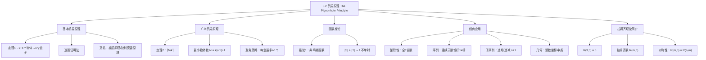

**相关笔记：** [[6.1 计数基础]] | [[6.3 排列与组合]]

> [!abstract] 概览
> 本节系统介绍了==鸽巢原理（Pigeonhole Principle）==及其==广义形式==，这是组合数学中最重要的存在性证明工具之一。鸽巢原理的核心思想极其朴素：若将 $k+1$ 个或更多物体放入 $k$ 个盒子中，则至少有一个盒子包含两个或更多物体。虽然结论直观，但通过巧妙地选择"物体"和"盒子"，该原理可以证明许多令人惊讶的结果。
>
> - ==鸽巢原理==：$k+1$ 个物体放入 $k$ 个盒子 $\Rightarrow$ 至少一个盒子有 $\geq 2$ 个物体
> - ==广义鸽巢原理==：$N$ 个物体放入 $k$ 个盒子 $\Rightarrow$ 至少一个盒子有 $\geq \lceil N/k \rceil$ 个物体
> - ==推论==：从 $k+1$ 个元素的集合到 $k$ 个元素的集合的函数==不可能是单射==
> - ==应用领域==：整除性问题、序列问题、几何问题、递增/递减子序列、==拉姆齐理论==
> - ==Erdős–Szekeres 定理==：$n^2+1$ 个不同实数的序列中，必有长度为 $n+1$ 的递增或递减子序列

---

## 一、知识结构总览

---

## 二、核心思想

> [!tip] 核心思想
> 本节的核心思想是==存在性证明==（existence proof）：鸽巢原理并不告诉我们哪个盒子包含了多余的物体，也不告诉我们具体有多少个，它只保证"至少存在"这样一个盒子。这种非构造性的证明方式在组合数学中极为强大——通过巧妙地设计"物体"与"盒子"的对应关系，可以将许多看似复杂的计数问题转化为鸽巢原理的直接应用。关键在于==如何选择物体和盒子==，这往往需要创造性的思维。

### 1. 基本鸽巢原理（The Pigeonhole Principle）

> [!def] 鸽巢原理（Theorem 1）
> 设 $k$ 为正整数。若将 $k+1$ 个或更多物体放入 $k$ 个盒子中，则至少有一个盒子包含两个或更多物体。
>
> **证明**（逆否证明法）：假设每个盒子最多包含一个物体，则物体总数最多为 $k$。但这与物体总数至少为 $k+1$ 矛盾。$\blacksquare$
>
> - 该原理又称==抽屉原理==（Drawer Principle）或==狄利克雷抽屉原理==（Dirichlet Drawer Principle）
> - 由十九世纪德国数学家 G. Lejeune Dirichlet 在其工作中频繁使用而得名
> - 实际上，十七世纪就有用此原理证明"巴黎至少有两人的头发数相同"的记录

> [!example] 例1：生日问题
> 在任意 367 人中，至少有两人同一天生日，因为一年最多有 366 个可能的生日。

> [!example] 例2：首字母问题
> 在任意 27 个英文单词中，至少有两个以相同字母开头，因为英文字母只有 26 个。

> [!example] 例3：考试分数问题
> 若考试分数从 0 到 100 分（共 101 个可能分数），则在任意 102 名学生中，至少有两人获得相同的分数。

> [!example] 例4：全1倍数的存在性
> 证明：对任意正整数 $n$，存在 $n$ 的某个倍数，其十进制表示中只包含 0 和 1。
>
> **证明**：考虑 $n+1$ 个整数 $1, 11, 111, \ldots, \underbrace{11\ldots1}_{n+1 \text{个}1}$。当它们除以 $n$ 时，只有 $n$ 种可能的余数。由鸽巢原理，其中必有两个整数除以 $n$ 的余数相同。设较大的为 $a_j$，较小的为 $a_i$（$j > i$），则 $a_j - a_i$ 是 $n$ 的倍数，且其十进制表示只包含 0 和 1。$\blacksquare$

### 2. 广义鸽巢原理（The Generalized Pigeonhole Principle）

> [!def] 广义鸽巢原理（Theorem 2）
> 若将 $N$ 个物体放入 $k$ 个盒子中，则至少有一个盒子包含至少 $\lceil N/k \rceil$ 个物体。
>
> **证明**（逆否证明法）：假设每个盒子最多包含 $\lceil N/k \rceil - 1$ 个物体，则物体总数最多为：
> $$k \cdot (\lceil N/k \rceil - 1) < k \cdot (N/k) = N$$
> 这与物体总数为 $N$ 矛盾。$\blacksquare$

> [!info] 最小物体数的确定
> 要保证在 $k$ 个盒子中至少有一个盒子包含 $\geq r$ 个物体，所需的最小物体数为：
> $$N = k(r - 1) + 1$$
>
> 这是因为 $\lceil N/k \rceil = \lceil k(r-1)+1)/k \rceil = r$。
>
> 若只有 $k(r-1)$ 个物体，可以将 $r-1$ 个物体放入每个盒子，此时没有盒子包含 $r$ 个物体。

> [!example] 例5：同月出生
> 在 100 人中，至少有 $\lceil 100/12 \rceil = 9$ 人出生在同一个月。

> [!example] 例6：成绩分布
> 若有五种可能的等级 A、B、C、D、F，要保证至少 6 名学生获得相同等级，最少需要 $5 \times 5 + 1 = 26$ 名学生。若只有 25 名学生，可能每种等级恰好 5 人。

> [!example] 例7：扑克牌花色
> a) 从一副 52 张标准扑克牌中选取多少张才能保证至少有三张同花色？
>
> 将四种花色视为四个盒子。需要 $\lceil N/4 \rceil \geq 3$，即 $N = 2 \times 4 + 1 = 9$ 张。
>
> b) 要保证至少有三张红心呢？
>
> 这不使用广义鸽巢原理。最坏情况下，可以先抽完所有非红心牌（39 张），再抽 3 张红心，共需 42 张。

### 3. 函数推论

> [!thm] 推论1（Corollary 1）
> 从具有 $k+1$ 个或更多元素的集合到具有 $k$ 个元素的集合的函数==不是单射==（不是一对一的）。
>
> **证明**：对陪域中的每个元素 $y$，设置一个盒子，包含所有满足 $f(x) = y$ 的定义域元素 $x$。由于定义域有 $k+1$ 个或更多元素，陪域只有 $k$ 个元素，由鸽巢原理，至少有一个盒子包含两个或更多定义域元素，即 $f$ 不是单射。$\blacksquare$

### 4. 优雅应用

> [!example] 例10：连续天数恰好 14 场比赛
> 一个棒球队在 30 天内每天至少比赛一场，但总共不超过 45 场。证明：存在某个连续天数的期间，球队恰好比赛了 14 场。
>
> **证明**：设 $a_j$ 为第 $j$ 天及之前比赛的总场数。则 $a_1, a_2, \ldots, a_{30}$ 是严格递增的正整数序列，且 $1 \leq a_j \leq 45$。
>
> 再考虑 $a_1 + 14, a_2 + 14, \ldots, a_{30} + 14$，这也是严格递增的正整数序列，且 $15 \leq a_j + 14 \leq 59$。
>
> 这 60 个正整数 $a_1, \ldots, a_{30}, a_1+14, \ldots, a_{30}+14$ 都在 $1$ 到 $59$ 之间。由鸽巢原理，其中必有两个相等。由于 $a_j$ 之间互不相同，$a_j + 14$ 之间也互不相同，因此必存在 $a_i = a_j + 14$（$i > j$），即从第 $j+1$ 天到第 $i$ 天恰好比赛了 14 场。$\blacksquare$

> [!example] 例11：整除性
> 证明：在任意 $n+1$ 个不超过 $2n$ 的正整数中，必有一个整数整除另一个。
>
> **证明**：将每个整数写成 $2^k \cdot q$ 的形式，其中 $q$ 为奇数。奇数部分 $q$ 是不超过 $2n$ 的奇正整数，共有 $n$ 个。由鸽巢原理，$n+1$ 个整数中必有两个的奇数部分相同，设为 $a_i = 2^{k_i} \cdot q$ 和 $a_j = 2^{k_j} \cdot q$。若 $k_i < k_j$，则 $a_i \mid a_j$；若 $k_i > k_j$，则 $a_j \mid a_i$。$\blacksquare$

> [!thm] Erdős–Szekeres 定理（Theorem 3）
> 每个由 $n^2 + 1$ 个不同实数组成的序列，都包含长度为 $n+1$ 的严格递增子序列或严格递减子序列。
>
> **证明**：设序列为 $a_1, a_2, \ldots, a_{n^2+1}$。对每个 $a_k$，关联有序对 $(i_k, d_k)$，其中 $i_k$ 是从 $a_k$ 开始的最长递增子序列的长度，$d_k$ 是从 $a_k$ 开始的最长递减子序列的长度。
>
> 假设不存在长度为 $n+1$ 的递增或递减子序列，则 $1 \leq i_k, d_k \leq n$，由乘法原理，可能的有序对只有 $n^2$ 种。由鸽巢原理，$n^2+1$ 个有序对中必有两个相同：$(i_s, d_s) = (i_t, d_t)$（$s < t$）。
>
> 由于序列元素互不相同，$a_s \neq a_t$。若 $a_s < a_t$，则可以在从 $a_t$ 开始的递增子序列前加上 $a_s$，得到从 $a_s$ 开始的长度为 $i_t + 1$ 的递增子序列，即 $i_s \geq i_t + 1$，矛盾。若 $a_s > a_t$，同理 $d_s \geq d_t + 1$，矛盾。$\blacksquare$

### 5. 拉姆齐理论简介

> [!example] 例13：六人集会问题
> 在六个人的群体中，每两人要么是朋友，要么是敌人。证明：存在三人互为朋友，或存在三人互为敌人。
>
> **证明**：设 $A$ 为六人之一。其余五人中，由广义鸽巢原理（$\lceil 5/2 \rceil = 3$），至少有三人要么是 $A$ 的朋友，要么是 $A$ 的敌人。
>
> 情况1：$B, C, D$ 是 $A$ 的朋友。若 $B, C, D$ 中有两人互为朋友，则这两人与 $A$ 构成三人互为朋友。否则，$B, C, D$ 三人互为敌人。
>
> 情况2：有三人以上是 $A$ 的敌人，类似可证。$\blacksquare$

> [!def] 拉姆齐数（Ramsey Number）
> $R(m, n)$ 表示满足以下条件的最少人数：在任意 $R(m, n)$ 人的聚会上（每两人是朋友或敌人），要么存在 $m$ 人互为朋友，要么存在 $n$ 人互为敌人。
>
> - $R(3, 3) = 6$（由例13及五人反例得出）
> - $R(2, n) = n$（每两人是朋友或敌人，要 $n$ 人互为朋友/敌人）
> - $R(m, n) = R(n, m)$（对称性）
> - $R(4, 4) = 18$，$43 \leq R(5, 5) \leq 49$
> - 大多数拉姆齐数的精确值未知，这是组合数学中的核心开放问题

---

## 三、补充理解与易混淆点

### 补充理解

> [!info] 补充1：鸽巢原理的历史与意义
> 鸽巢原理最早由十九世纪德国数学家 G. Lejeune Dirichlet（1805–1859）在其数论研究中系统使用，因此又称"狄利克雷抽屉原理"。Dirichlet 利用此原理证明了算术级数中有无穷多个素数（当首项与公差互素时），以及费马大定理 $n=5$ 的情形。实际上，该原理的思想可追溯到十七世纪——法国作家 Pierre Nicole 曾用它证明"巴黎至少有两人的头发数相同"（当时巴黎人口超过 80 万，而人的头发数不超过 20 万）。
>
> 鸽巢原理看似简单，却是组合数学中最重要的存在性证明工具之一。它的威力在于：通过巧妙地选择"物体"和"盒子"的对应关系，可以将许多看似困难的计数问题转化为直接应用。这种"非构造性"的证明方式——只证明存在性而不给出具体构造——在数学中具有深远意义。
>
> - [MIT 18.211: Combinatorial Analysis - Pigeonhole Principle](https://math.mit.edu/~fgotti/docs/Courses/C.%20Combinatorial%20Analysis/1.%20Pigeonhole%20Principle/Pigeonhole%20Principle.pdf) -- MIT 组合分析课程讲义，系统讲解鸽巢原理
> - [鸽巢原理 - CSDN 文库](https://wenku.csdn.net/doc/34xw4gfqui) -- 鸽巢原理的定义、数学表述及在算法与组合数学中的核心应用
>
> 来源：Rosen, K. H. (2019). *Discrete Mathematics and Its Applications* (8th ed.), McGraw-Hill, Section 6.2.
> 来源：Brualdi, R. A. (2010). *Introductory Combinatorics* (5th ed.), Pearson, Chapter 3.

> [!info] 补充2：如何选择"物体"和"盒子"
> 应用鸽巢原理的关键在于==如何选择物体和盒子==，这往往需要创造性思维。以下是常见的策略：
>
> | 策略 | 物体 | 盒子 | 典型问题 |
> |:-----|:-----|:-----|:---------|
> | 余数分类 | 整数 | 余数 $0, 1, \ldots, n-1$ | 整除性问题 |
> | 函数值分类 | 定义域元素 | 陪域元素 | 非单射证明 |
> | 区间划分 | 实数 | 区间 | 连续性问题 |
> | 奇偶分类 | 整数 | 奇/偶 | 奇偶性问题 |
> | 子序列长度 | 序列元素 | 有序对 $(i_k, d_k)$ | Erdős–Szekeres 定理 |
> | 关系分类 | 人对 | 朋友/敌人 | 拉姆齐理论 |
>
> 一个实用的思考方法是：先考虑"最均匀分布"的情况——如果每个盒子都尽可能少放物体，总共能放多少？如果物体总数超过了这个上限，就必然有某个盒子"超载"。
>
> - [鸽笼原理 - 百度百科](https://m.baike.com/wiki/%E9%B8%BD%E7%AC%BC%E5%8E%9F%E7%90%86/2044321) -- 鸽笼原理的基本介绍与历史
> - [PKU 补充：鸽巢原理](https://icl.pku.edu.cn/docs/20180525105640315740.pdf) -- 北京大学鸽巢原理补充讲义
>
> 来源：Rosen, K. H. (2019). *Discrete Mathematics and Its Applications* (8th ed.), McGraw-Hill, Section 6.2.
> 来源：Erdős, P. & Szekeres, G. (1935). "A combinatorial problem in geometry." *Compositio Mathematica*, 2, 463–470.

### 易混淆点

> [!warning] 误区：鸽巢原理 vs 广义鸽巢原理的使用场景
> - ❌ 在需要"至少 $r$ 个"的结论时，仍然使用基本鸽巢原理
> - ✅ 基本鸽巢原理只保证"至少 2 个"；要保证"至少 $r$ 个"，必须使用==广义鸽巢原理==
> - ❌ 混淆"保证某个特定盒子有 $\geq r$ 个"与"存在某个盒子有 $\geq r$ 个"
> - ✅ 鸽巢原理只保证==存在==一个盒子满足条件，不指定是哪个盒子
>
> 例如：100 人中至少 $\lceil 100/12 \rceil = 9$ 人同月出生，但我们不知道是哪个月。

> [!warning] 误区：广义鸽巢原理中"最小物体数"的计算
> - ❌ 认为要保证 $k$ 个盒子中至少一个有 $\geq r$ 个物体，只需 $N = kr$ 个物体
> - ✅ 正确的最小值是 $N = k(r-1) + 1$，而非 $N = kr$
> - 反例：$k = 4$ 个盒子，要保证至少一个有 $\geq 3$ 个物体
>   - $N = 4 \times 3 = 12$？错误！因为 $12 = 4 \times 3$，可以每盒恰好放 3 个
>   - $N = 4 \times 2 + 1 = 9$？正确！因为 8 个物体可以每盒放 2 个，第 9 个必然使某盒达到 3 个
>
> 核心公式：$N_{\min} = k(r - 1) + 1$，即"先让每个盒子都放 $r-1$ 个，再多放一个就必然突破"

> [!warning] 误区：拉姆齐数 $R(m,n)$ 的理解
> - ❌ 认为 $R(m, n)$ 表示"恰好有 $m$ 个朋友或 $n$ 个敌人"的人数
> - ✅ $R(m, n)$ 表示==最少==需要多少人，才能==保证==（而非恰好）存在 $m$ 人互为朋友或 $n$ 人互为敌人
> - ❌ 认为 $R(3, 3) = 6$ 意味着 6 人中一定有 3 人互为朋友
> - ✅ $R(3, 3) = 6$ 意味着 6 人中==要么==有 3 人互为朋友，==要么==有 3 人互为敌人（二者至少成立其一）

---

## 四、习题精选

> [!todo] 习题概览
> | 题号范围 | 核心考点 | 难度 |
> |---------|---------|------|
> | 1-4 | 基本鸽巢原理的直接应用 | ⭐ |
> | 5-7 | 广义鸽巢原理与余数分类 | ⭐⭐ |
> | 8-9 | 整除性与余数问题 | ⭐⭐ |
> | 10-14 | 函数非单射与几何应用 | ⭐⭐⭐ |
> | 15-18 | 子集和与组合鸽巢 | ⭐⭐⭐ |
> | 22-24 | 递增/递减子序列 | ⭐⭐⭐⭐ |
> | 28-32 | 拉姆齐数与图论应用 | ⭐⭐⭐⭐ |

### 题1：基本鸽巢原理——袜子问题

> [!problem] 题目
> 一个抽屉里有 12 双棕色袜子和 12 双黑色袜子，所有袜子都未配对。一个人在黑暗中随机取袜子。
>
> a) 他至少取出多少只袜子才能保证至少有两只同色的袜子？
> b) 他至少取出多少只袜子才能保证至少有两只黑色袜子？

> [!faq]- 解答
> a) 有两种颜色（棕色和黑色），视为两个盒子。由鸽巢原理，取出 $2 + 1 = 3$ 只袜子即可保证至少有两只同色。
>
> b) 要保证至少两只黑色袜子，最坏情况是先取出所有 12 只棕色袜子，再取 2 只黑色袜子，共需 $12 + 2 = 14$ 只。
>
> 注意：b) 不能直接使用鸽巢原理，因为我们需要的是特定颜色（黑色）而非任意颜色。
>
> $\blacksquare$

### 题2：广义鸽巢原理——成绩分布

> [!problem] 题目
> 一个离散数学班有 25 名学生，每位学生要么是大一、要么是大二、要么是大三学生。
>
> a) 证明该班至少有 9 名大一学生，或至少 9 名大二学生，或至少 9 名大三学生。
> b) 证明该班至少有 3 名大一学生，或至少 19 名大二学生，或至少 5 名大三学生。

> [!faq]- 解答
> a) 将 25 名学生放入 3 个盒子（大一、大二、大三）。由广义鸽巢原理，至少有一个盒子包含至少 $\lceil 25/3 \rceil = 9$ 名学生。
>
> b) 假设结论不成立，即大一 $< 3$、大二 $< 19$、大三 $< 5$。则学生总数最多为 $2 + 18 + 4 = 24 < 25$，矛盾。
>
> $\blacksquare$

### 题3：整除性应用——余数问题

> [!problem] 题目
> 证明：在任意 5 个（不一定连续的）整数中，必有两个数除以 4 的余数相同。

> [!faq]- 解答
> 任意整数除以 4 的余数只有 4 种可能：$0, 1, 2, 3$。将这 4 种余数视为 4 个盒子，5 个整数视为 5 个物体。由鸽巢原理，至少有一个余数对应至少 2 个整数，即这两个整数除以 4 的余数相同。
>
> $\blacksquare$

### 题4：几何应用——整数坐标中点

> [!problem] 题目
> 设 $(x_i, y_i)$（$i = 1, 2, 3, 4, 5$）是平面上 5 个具有整数坐标的不同点。证明：至少有一对点的连线中点具有整数坐标。

> [!faq]- 解答
> 两个点 $(x_1, y_1)$ 和 $(x_2, y_2)$ 的中点为 $\left(\frac{x_1+x_2}{2}, \frac{y_1+y_2}{2}\right)$。
>
> 中点坐标为整数的充要条件是 $x_1 + x_2$ 和 $y_1 + y_2$ 都是偶数，即 $x_1$ 与 $x_2$ 同奇偶，$y_1$ 与 $y_2$ 同奇偶。
>
> 每个点的 $x$ 坐标和 $y$ 坐标各有两种奇偶性（奇/偶），因此每个点的奇偶类型共有 $2 \times 2 = 4$ 种：$(\text{奇}, \text{奇})$、$(\text{奇}, \text{偶})$、$(\text{偶}, \text{奇})$、$(\text{偶}, \text{偶})$。
>
> 5 个点放入 4 种奇偶类型中，由鸽巢原理，至少有两个点属于同一类型。这两个点的中点坐标必为整数。
>
> $\blacksquare$

### 题5：广义鸽巢原理——扑克牌花色

> [!problem] 题目
> 从一副标准 52 张扑克牌中选取牌，回答以下问题：
>
> a) 至少选取多少张才能保证至少有三张同花色？
> b) 至少选取多少张才能保证至少有三张红心？

> [!faq]- 解答
> a) 四种花色视为四个盒子。要保证至少一个盒子有 $\geq 3$ 张牌，最小物体数为 $N = 4 \times (3-1) + 1 = 9$ 张。
>
> 验证：8 张牌时，可以每种花色恰好 2 张，不满足条件。9 张牌时，由广义鸽巢原理，$\lceil 9/4 \rceil = 3$，至少一种花色有 3 张。
>
> b) 要保证至少 3 张红心，最坏情况是先抽完所有非红心牌（$52 - 13 = 39$ 张），再抽 3 张红心，共需 $39 + 3 = 42$ 张。
>
> $\blacksquare$

> [!tip] 解题思路提示
> 鸽巢原理证明的解题方法论：
> 1. **确定物体和盒子**：明确什么对应"物体"，什么对应"盒子"，这是最关键的一步
> 2. **计算盒子数**：确定盒子的数量 $k$
> 3. **选择原理**：若只需"至少 2 个"用基本鸽巢原理；若需"至少 $r$ 个"用广义鸽巢原理
> 4. **计算最小物体数**：广义鸽巢原理中，$N_{\min} = k(r-1) + 1$
> 5. **验证边界**：用 $N_{\min} - 1$ 个物体构造反例，确认确实不满足条件
> 6. **特殊问题**：当要求特定盒子（如特定花色）满足条件时，不能用鸽巢原理直接求解，需考虑最坏情况

---

## 五、视频学习指南

> [!info] 视频资源
> | 资源 | 链接 | 对应内容 | 备注 |
> |:-----|:-----|:---------|:-----|
> | Rosen 8e Section 6.2 | [教材原文](https://www.mheducation.com/highered/product/discrete-mathematics-applications-rosen/M9781259676512.html) | 完整定义、定理与例题 | 英文教材 |
> | MIT 18.211 Lecture 1 | [链接](https://math.mit.edu/~fgotti/docs/Courses/C.%20Combinatorial%20Analysis/1.%20Pigeonhole%20Principle/Pigeonhole%20Principle.pdf) | 鸽巢原理系统讲解 | MIT 开放课程 |
> | 3Blue1Brown | [链接](https://www.youtube.com/watch?v=ssKqLkO6oOw) | 拉姆齐理论可视化 | 英文，直观动画 |

---

## 六、教材原文

> [!quote] 教材原文
> "The pigeonhole principle states that if there are more pigeons than pigeonholes, then there must be at least one pigeonhole with at least two pigeons in it. This principle is extremely useful; it applies to much more than pigeons and pigeonholes."
>
> "The pigeonhole principle is also called the Dirichlet drawer principle, after the nineteenth-century German mathematician G. Lejeune Dirichlet, who often used this principle in his work. (Dirichlet was not the first person to use this principle; a demonstration that there were at least two Parisians with the same number of hairs on their heads dates back to the 17th century.)"
>
> "Ramsey theory, named after the English mathematician F. P. Ramsey, deals with the distribution of subsets of elements of sets. In general, Ramsey theory deals with guarantees that structures of a given type can be found within large enough sets."

---

## 参见 Wiki

- [[离散数学/concepts/鸽巢原理]] -- 鸽巢原理的定义与基本形式
- [[离散数学/concepts/鸽巢原理|广义鸽巢原理]] -- 广义鸽巢原理及其应用
- [[离散数学/concepts/拉姆齐理论]] -- 拉姆齐理论与拉姆齐数
- [[离散数学/concepts/鸽巢原理|狄利克雷抽屉原理]] -- 鸽巢原理的历史与命名
- [[离散数学/concepts/鸽巢原理|Erdős–Szekeres 定理]] -- 递增/递减子序列的存在性

#学习/离散数学/计数
