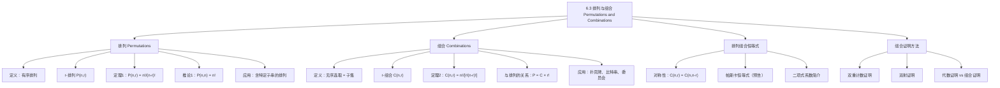

**相关笔记：** [[6.2 鸽巢原理]] | [[6.4 二项式系数与恒等式]]

> [!abstract] 概览
> 本节系统介绍了==排列（Permutation）==和==组合（Combination）==的概念、公式及其应用。排列关注==有序选取==，组合关注==无序选取==，二者是计数理论中最基础也最重要的工具。本节还介绍了关键的==排列组合恒等式==，包括对称性恒等式 $C(n,r) = C(n,n-r)$，以及==组合证明==（combinatorial proof）这一重要的证明方法。
>
> - ==排列== $P(n,r) = n(n-1)(n-2)\cdots(n-r+1) = \dfrac{n!}{(n-r)!}$：从 $n$ 个元素中有序选取 $r$ 个
> - ==组合== $C(n,r) = \dfrac{n!}{r!(n-r)!}$：从 $n$ 个元素中无序选取 $r$ 个
> - ==核心关系==：$P(n,r) = C(n,r) \cdot r!$（先选后排）
> - ==对称性恒等式==：$C(n,r) = C(n,n-r)$（选 $r$ 个等价于排除 $n-r$ 个）
> - ==组合证明==：用计数论证证明恒等式，包括==双重计数证明==和==双射证明==
> - 组合数 $C(n,r)$ 也称为==二项式系数==，记作 $\dbinom{n}{r}$

---

## 一、知识结构总览

---

## 二、核心思想

> [!tip] 核心思想
> 本节的核心思想是==有序与无序==的区分：排列（Permutation）考虑元素的顺序，组合（Combination）不考虑顺序。理解二者的关系——$P(n,r) = C(n,r) \cdot r!$——是掌握计数技巧的关键。这个关系揭示了"先选后排"的两步策略：先无序地选出 $r$ 个元素（$C(n,r)$ 种方式），再对选出的元素进行全排列（$r!$ 种方式）。此外，本节引入的==组合证明==方法——通过计数论证而非代数运算来证明恒等式——是离散数学中极具洞察力的证明技术。

### 1. 排列（Permutations）

> [!def] 排列与 r-排列
> - 一个集合的==排列==（permutation）是该集合元素的一个有序排列
> - 一个集合的==r-排列==（r-permutation）是从该集合中选取 $r$ 个元素的一个有序排列
> - $n$ 个元素的集合的 r-排列数记为 $P(n,r)$

> [!example] 例2：排列与 r-排列
> 设 $S = \{1, 2, 3\}$。有序排列 $3, 1, 2$ 是 $S$ 的一个排列。有序排列 $3, 2$ 是 $S$ 的一个 2-排列。

> [!example] 例3：计算 $P(3,2)$
> $S = \{a, b, c\}$ 的所有 2-排列为：$ab, ac, ba, bc, ca, cb$，共 6 个。
>
> 由乘法原理：选第一个元素有 3 种方式，选第二个元素有 2 种方式，故 $P(3,2) = 3 \times 2 = 6$。

> [!thm] 定理1：排列数公式
> 若 $n$ 为正整数，$r$ 为整数且 $1 \leq r \leq n$，则 $n$ 个不同元素的集合有
> $$P(n,r) = n(n-1)(n-2)\cdots(n-r+1)$$
> 个 r-排列。
>
> **证明**（乘法原理）：第 1 个位置有 $n$ 种选择，第 2 个位置有 $n-1$ 种选择（去掉已选的），第 3 个位置有 $n-2$ 种选择，依此类推，直到第 $r$ 个位置有 $n-(r-1) = n-r+1$ 种选择。由乘法原理：
> $$P(n,r) = n \times (n-1) \times (n-2) \times \cdots \times (n-r+1) \quad \blacksquare$$

> [!thm] 推论1：排列数与阶乘的关系
> 若 $n$ 和 $r$ 为整数且 $0 \leq r \leq n$，则
> $$P(n,r) = \frac{n!}{(n-r)!}$$
>
> 特别地，$P(n,n) = n!$（$n$ 个元素的全排列数）。
>
> **证明**：当 $1 \leq r \leq n$ 时，由定理1：
> $$P(n,r) = n(n-1)\cdots(n-r+1) = \frac{n(n-1)\cdots(n-r+1) \cdot (n-r)!}{(n-r)!} = \frac{n!}{(n-r)!}$$
>
> 当 $r = 0$ 时，$P(n,0) = 1$（恰好一种方式排列零个元素：空排列），而 $\frac{n!}{(n-0)!} = \frac{n!}{n!} = 1$，公式成立。$\blacksquare$

> [!example] 例4：比赛颁奖
> 从 100 人中选出第一名、第二名、第三名，有多少种方式？
>
> $$P(100,3) = 100 \times 99 \times 98 = 970{,}200 \text{ 种}$$

> [!example] 例5：赛跑奖牌
> 8 名选手参加赛跑，金、银、铜牌有多少种颁发方式（无并列）？
>
> $$P(8,3) = 8 \times 7 \times 6 = 336 \text{ 种}$$

> [!example] 例6：旅行路线
> 一名销售员需要访问 8 个城市，必须从指定城市出发，其余 7 个城市可以任意顺序访问。有多少种可能的路线？
>
> $$P(7,7) = 7! = 7 \times 6 \times 5 \times 4 \times 3 \times 2 \times 1 = 5040 \text{ 种}$$

> [!example] 例7：含特定子串的排列
> ABCDEFGH 的排列中，有多少个包含连续子串 ABC？
>
> 将 ABC 视为一个整体"块"，则需排列 6 个对象：块 ABC 和 D、E、F、G、H。排列数为 $6! = 720$。

### 2. 组合（Combinations）

> [!def] r-组合
> 一个集合的==r-组合==（r-combination）是从该集合中无序选取的 $r$ 个元素，即该集合的一个 $r$ 元子集。
>
> - $n$ 个不同元素的集合的 r-组合数记为 $C(n,r)$
> - $C(n,r)$ 也记作 $\dbinom{n}{r}$，称为==二项式系数==（binomial coefficient）

> [!example] 例9：组合与子集
> 设 $S = \{1, 2, 3, 4\}$。$\{1, 3, 4\}$ 是 $S$ 的一个 3-组合。注意 $\{4, 1, 3\}$ 与 $\{1, 3, 4\}$ 是同一个 3-组合，因为集合中元素的列出顺序无关紧要。

> [!example] 例10：计算 $C(4,2)$
> $\{a, b, c, d\}$ 的所有 2-组合为：$\{a,b\}, \{a,c\}, \{a,d\}, \{b,c\}, \{b,d\}, \{c,d\}$，共 6 个，即 $C(4,2) = 6$。

> [!thm] 定理2：组合数公式
> $n$ 个元素的集合的 r-组合数（$n$ 为非负整数，$0 \leq r \leq n$）为
> $$C(n,r) = \frac{n!}{r!(n-r)!}$$
>
> **证明**：$P(n,r)$ 个 r-排列可以通过先形成 $C(n,r)$ 个 r-组合，再对每个组合中的 $r$ 个元素进行全排列（$P(r,r) = r!$ 种方式）来得到。由乘法原理：
> $$P(n,r) = C(n,r) \cdot P(r,r)$$
>
> 因此：
> $$C(n,r) = \frac{P(n,r)}{P(r,r)} = \frac{n!/(n-r)!}{r!/(r-r)!} = \frac{n!}{r!(n-r)!} \quad \blacksquare$$

> [!info] 计算组合数的实用技巧
> 直接计算 $C(n,r) = \frac{n!}{r!(n-r)!}$ 在 $n$ 和 $r$ 较大时可能导致数值溢出。实用技巧是先约分：
> $$C(n,r) = \frac{n(n-1)\cdots(n-r+1)}{r!}$$
>
> 即：分子取 $n$ 开始的 $r$ 个连续整数之积，分母取 $r!$，然后逐步约分。

> [!example] 例11：扑克牌手牌
> 从 52 张标准扑克牌中发出 5 张手牌，有多少种可能？
>
> $$C(52,5) = \frac{52 \times 51 \times 50 \times 49 \times 48}{5 \times 4 \times 3 \times 2 \times 1}$$
>
> 约分：$50/5 = 10$，$48/4 = 12$，$51/3 = 17$，$52/2 = 26$
>
> $$C(52,5) = 26 \times 17 \times 10 \times 49 \times 12 = 2{,}598{,}960$$
>
> 注意：$C(52,47) = C(52,5) = 2{,}598{,}960$，因为选 47 张等价于排除 5 张。

> [!example] 例12：网球队选拔
> 从 10 名网球队员中选 5 人外出比赛，有多少种方式？
>
> $$C(10,5) = \frac{10!}{5! \cdot 5!} = 252 \text{ 种}$$

> [!example] 例13：宇航员选拔
> 从 30 名受训宇航员中选 6 人执行火星任务（假设所有成员职责相同），有多少种方式？
>
> $$C(30,6) = \frac{30 \times 29 \times 28 \times 27 \times 26 \times 25}{6 \times 5 \times 4 \times 3 \times 2 \times 1} = 593{,}775 \text{ 种}$$

> [!example] 例14：含恰好 $r$ 个 1 的比特串
> 长度为 $n$ 的比特串中恰好含 $r$ 个 1 的有多少个？
>
> $r$ 个 1 的位置构成集合 $\{1, 2, \ldots, n\}$ 的一个 $r$-组合，故有 $C(n,r)$ 个这样的比特串。

> [!example] 例15：跨部门委员会
> 数学系有 9 名教师，计算机系有 11 名教师。要组成一个委员会，包含数学系 3 名和计算机系 4 名教师，有多少种方式？
>
> 由乘法原理：
> $$C(9,3) \times C(11,4) = \frac{9!}{3! \cdot 6!} \times \frac{11!}{4! \cdot 7!} = 84 \times 330 = 27{,}720 \text{ 种}$$

### 3. 排列组合恒等式

> [!thm] 对称性恒等式（Corollary 2）
> 设 $n$ 和 $r$ 为非负整数且 $0 \leq r \leq n$，则
> $$C(n,r) = C(n, n-r)$$
>
> **代数证明**：
> $$C(n,r) = \frac{n!}{r!(n-r)!}$$
> $$C(n,n-r) = \frac{n!}{(n-r)![n-(n-r)]!} = \frac{n!}{(n-r)! \cdot r!}$$
>
> 因此 $C(n,r) = C(n,n-r)$。$\blacksquare$

> [!thm] 对称性恒等式的组合证明
> **双射证明**：设 $S$ 为 $n$ 元集合。映射 $A \mapsto \bar{A}$（子集取补）是 $S$ 的 $r$ 元子集与 $S$ 的 $(n-r)$ 元子集之间的双射。因此 $C(n,r) = C(n,n-r)$。$\blacksquare$
>
> **双重计数证明**：$S$ 的 $r$ 元子集数为 $C(n,r)$。但每个 $r$ 元子集 $A$ 也由其补集 $\bar{A}$ 唯一确定，而 $\bar{A}$ 是 $(n-r)$ 元子集，故 $S$ 的 $r$ 元子集数也为 $C(n,n-r)$。因此 $C(n,r) = C(n,n-r)$。$\blacksquare$

> [!def] 组合证明（Combinatorial Proof）
> ==组合证明==是一种用计数论证来证明恒等式的方法，分为两种类型：
> - ==双重计数证明==（Double Counting Proof）：证明恒等式两边以不同方式计数同一组对象，但总数相同
> - ==双射证明==（Bijective Proof）：证明恒等式两边所计数的集合之间存在双射
>
> 组合证明通常比代数证明更简洁、更具洞察力，能揭示恒等式背后的组合意义。

---

## 三、补充理解与易混淆点

### 补充理解

> [!info] 补充1：排列与组合的本质区别——顺序是否重要
> 排列与组合的根本区别在于==是否考虑顺序==。理解这一点的最佳方式是通过具体例子：
>
> - **排列**（顺序重要）：从 5 名学生中选 3 人站成一排拍照 $\rightarrow$ ABC 和 ACB 是不同的排列
> - **组合**（顺序不重要）：从 5 名学生中选 3 人组成委员会 $\to$ $\{A,B,C\}$ 和 $\{A,C,B\}$ 是同一个组合
>
> 判断使用排列还是组合的一个实用方法：**交换选取顺序，看结果是否改变**。如果交换后结果不同，用排列；如果交换后结果相同，用组合。
>
> | 场景 | 排列/组合 | 原因 |
> |:-----|:---------|:-----|
> | 选举班长、副班长 | 排列 $P(n,2)$ | 职务不同，顺序重要 |
> | 选 2 名代表 | 组合 $C(n,2)$ | 代表地位相同，顺序不重要 |
> | 电话号码 | 排列 | 1234 和 4321 是不同号码 |
> | 彩票号码 | 组合 | 中奖只看数字不看顺序 |
> | 密码 | 排列 | ABC 和 CBA 是不同密码 |
> | 扑克牌手牌 | 组合 | 发牌顺序不影响手牌 |
>
> - [排列组合核心概念与公式推导 - CSDN 文库](https://wenku.csdn.net/doc/88we66ih6j) -- 排列组合核心概念、公式推导与经典例题详解
> - [天津大学应用组合数学讲义](http://cic.tju.edu.cn/faculty/hyh/combinators/lecture2.pdf) -- 排列与组合的系统讲解
>
> 来源：Rosen, K. H. (2019). *Discrete Mathematics and Its Applications* (8th ed.), McGraw-Hill, Section 6.3.
> 来源：Brualdi, R. A. (2010). *Introductory Combinatorics* (5th ed.), Pearson, Chapter 2.

> [!info] 补充2：组合证明的力量与美学
> 组合证明是离散数学中最具美感的证明方法之一。与代数证明（通过公式变形验证等式成立）不同，组合证明通过"讲故事"的方式揭示恒等式背后的组合意义。例如，$C(n,r) = C(n,n-r)$ 的组合证明告诉我们："从 $n$ 个人中选 $r$ 个人"和"从 $n$ 个人中选 $n-r$ 个人不去"是同一件事——这种直觉是代数证明无法提供的。
>
> 组合证明的一般策略：
> 1. **识别计数对象**：找到一个合适的集合，使恒等式两边都在计数这个集合
> 2. **构造双射**：如果两边计数的是不同集合，尝试构造两个集合之间的双射
> 3. **利用已知模型**：如子集、路径、委员会等经典组合模型
>
> 著名的组合证明例子包括：帕斯卡恒等式 $C(n+1,r) = C(n,r-1) + C(n,r)$（将在 6.4 节学习）、范德蒙德恒等式等。掌握组合证明不仅能加深对恒等式的理解，更能培养组合直觉。
>
> - [组合恒等式推导证明](https://m.book118.com/html/2025/1206/6102103111012023.shtm) -- 排列组合公式及恒等式推导证明
>
> 来源：Benjamin, A. T. & Quinn, J. J. (2003). *Proofs That Really Count: The Art of Combinatorial Proof*. Mathematical Association of America.
> 来源：Rosen, K. H. (2019). *Discrete Mathematics and Its Applications* (8th ed.), McGraw-Hill, Section 6.3.

### 易混淆点

> [!warning] 误区：排列与组合的混淆
> - ❌ 在需要用组合的问题中使用排列公式
> - ✅ 关键判断标准：==交换选取顺序后结果是否改变==
> - 典型错误：计算"从 10 人中选 5 人组成委员会"时使用 $P(10,5)$
> - 正确做法：委员会成员无顺序之分，应使用 $C(10,5)$
>
> 记忆口诀：**排列有序，组合无序**。排列 = 组合 $\times$ 全排列，即 $P(n,r) = C(n,r) \cdot r!$

> [!warning] 误区：组合数计算中的数值溢出
> - ❌ 直接计算 $C(100,50) = \frac{100!}{50! \cdot 50!}$，先分别计算 $100!$ 和 $50!$
> - ✅ 使用约分形式 $C(n,r) = \frac{n(n-1)\cdots(n-r+1)}{r!}$，逐步约分
> - ❌ 在浮点运算中计算组合数，结果可能不是整数
> - ✅ 使用整数运算或专门的组合数函数（如 Python 的 `math.comb(n,r)`）
>
> 另一个实用技巧：当 $r > n/2$ 时，利用对称性 $C(n,r) = C(n,n-r)$ 减少计算量。例如 $C(100,97) = C(100,3) = \frac{100 \times 99 \times 98}{3 \times 2 \times 1} = 161{,}700$。

> [!warning] 误区：$C(n,0) = 1$ 和 $C(n,n) = 1$ 的理解
> - ❌ 认为 $C(n,0) = 0$（"什么都不选"不是一种选择）
> - ✅ $C(n,0) = 1$：从 $n$ 个元素中不选任何元素，恰好有 1 种方式——选空集
> - ❌ 认为 $0! = 0$
> - ✅ $0! = 1$：这是阶乘的约定，保证了 $P(n,n) = \frac{n!}{0!} = n!$ 和 $C(n,0) = \frac{n!}{0! \cdot n!} = 1$ 的公式一致性

---

## 四、习题精选

> [!todo] 习题概览
> | 题号范围 | 核心考点 | 难度 |
> |---------|---------|------|
> | 1-4 | 列举排列与组合 | ⭐ |
> | 5-6 | 计算 $P(n,r)$ 和 $C(n,r)$ 的值 | ⭐ |
> | 7-10 | 排列应用题 | ⭐⭐ |
> | 11-12 | 比特串计数 | ⭐⭐ |
> | 13-14 | 男女交替排列 | ⭐⭐⭐ |
> | 15-17 | 子集计数 | ⭐⭐ |
> | 21-22 | 含特定子串的排列 | ⭐⭐⭐ |
> | 23-24 | 男女不相邻排列 | ⭐⭐⭐ |
> | 27-28 | 带限制条件的选取 | ⭐⭐⭐ |
> | 29-32 | 委员会与选举问题 | ⭐⭐⭐ |
> | 33-34 | 字符串计数 | ⭐⭐⭐ |

### 题1：基本排列计算

> [!problem] 题目
> 计算以下排列数的值：
>
> a) $P(6,3)$
> b) $P(6,5)$
> c) $P(8,1)$
> d) $P(8,5)$
> e) $P(8,8)$
> f) $P(10,9)$

> [!faq]- 解答
> a) $P(6,3) = 6 \times 5 \times 4 = 120$
>
> b) $P(6,5) = 6 \times 5 \times 4 \times 3 \times 2 = 720$
>
> c) $P(8,1) = 8$（从 8 个中选 1 个排列，就是 8 种选择）
>
> d) $P(8,5) = 8 \times 7 \times 6 \times 5 \times 4 = 6720$
>
> e) $P(8,8) = 8! = 40320$
>
> f) $P(10,9) = \frac{10!}{(10-9)!} = \frac{10!}{1!} = 10! = 3628800$
>
> $\blacksquare$

### 题2：基本组合计算

> [!problem] 题目
> 计算以下组合数的值：
>
> a) $C(5,1)$
> b) $C(5,3)$
> c) $C(8,4)$
> d) $C(8,8)$
> e) $C(8,0)$
> f) $C(12,6)$

> [!faq]- 解答
> a) $C(5,1) = \frac{5!}{1! \cdot 4!} = 5$
>
> b) $C(5,3) = \frac{5!}{3! \cdot 2!} = \frac{120}{6 \times 2} = 10$
>
> c) $C(8,4) = \frac{8!}{4! \cdot 4!} = \frac{8 \times 7 \times 6 \times 5}{4 \times 3 \times 2 \times 1} = 70$
>
> d) $C(8,8) = \frac{8!}{8! \cdot 0!} = 1$
>
> e) $C(8,0) = \frac{8!}{0! \cdot 8!} = 1$
>
> f) $C(12,6) = \frac{12!}{6! \cdot 6!} = \frac{12 \times 11 \times 10 \times 9 \times 8 \times 7}{6 \times 5 \times 4 \times 3 \times 2 \times 1} = 924$
>
> $\blacksquare$

### 题3：恒等式证明

> [!problem] 题目
> 用组合证明证明 $C(n,r) = C(n, n-r)$（其中 $0 \leq r \leq n$）。

> [!faq]- 解答
> **组合证明**（双重计数）：
>
> 设 $S$ 为一个 $n$ 元集合。我们用两种方式计数 $S$ 的所有 $r$ 元子集的个数。
>
> **方式一**：由定义，$S$ 的 $r$ 元子集数为 $C(n,r)$。
>
> **方式二**：每个 $r$ 元子集 $A$ 由其补集 $\bar{A} = S - A$ 唯一确定。$\bar{A}$ 是 $S$ 的 $(n-r)$ 元子集。因此，$S$ 的 $r$ 元子集数等于 $S$ 的 $(n-r)$ 元子集数，即 $C(n, n-r)$。
>
> 由两种方式计数的是同一组对象，故 $C(n,r) = C(n, n-r)$。$\blacksquare$

### 题4：带限制条件的计数

> [!problem] 题目
> 一个俱乐部有 25 名成员。
>
> a) 从中选 4 人组成执行委员会，有多少种方式？
> b) 从中选主席、副主席、秘书和财务（每人只能担任一个职务），有多少种方式？

> [!faq]- 解答
> a) 委员会成员无顺序之分，使用组合：
> $$C(25,4) = \frac{25!}{4! \cdot 21!} = \frac{25 \times 24 \times 23 \times 22}{4 \times 3 \times 2 \times 1} = 12650 \text{ 种}$$
>
> b) 职务不同，顺序重要，使用排列：
> $$P(25,4) = 25 \times 24 \times 23 \times 22 = 303600 \text{ 种}$$
>
> 注意：$P(25,4) = C(25,4) \times 4! = 12650 \times 24 = 303600$，验证了排列与组合的关系。
>
> $\blacksquare$

### 题5：综合应用——比特串与扑克牌

> [!problem] 题目
> a) 长度为 10 的比特串中恰好包含 4 个 1 的有多少个？
> b) 长度为 10 的比特串中 1 的个数不超过 4 个的有多少个？
> c) 从 52 张标准扑克牌中选 5 张，其中恰好包含 2 张红心和 3 张黑桃，有多少种方式？

> [!faq]- 解答
> a) 4 个 1 的位置构成 $\{1, 2, \ldots, 10\}$ 的 4-组合：
> $$C(10,4) = \frac{10!}{4! \cdot 6!} = 210 \text{ 个}$$
>
> b) 1 的个数不超过 4 个，即 1 的个数为 0、1、2、3 或 4 个：
> $$C(10,0) + C(10,1) + C(10,2) + C(10,3) + C(10,4) = 1 + 10 + 45 + 120 + 210 = 386 \text{ 个}$$
>
> c) 从 13 张红心中选 2 张，从 13 张黑桃中选 3 张，由乘法原理：
> $$C(13,2) \times C(13,3) = 78 \times 286 = 22308 \text{ 种}$$
>
> $\blacksquare$

> [!tip] 解题思路提示
> 排列组合问题的解题方法论：
> 1. **判断排列还是组合**：交换选取顺序后结果是否改变？改变则排列，不改变则组合
> 2. **识别步骤**：问题是否可以分解为多个独立步骤？如果是，使用乘法原理
> 3. **分类讨论**：问题是否需要分多种情况？如果是，使用加法原理
> 4. **利用恒等式化简**：如 $C(n,r) = C(n,n-r)$ 可以减少计算量
> 5. **验证合理性**：检查答案是否在合理范围内，排列数应大于等于组合数
> 6. **含限制条件**：先处理限制条件（如特定元素必须入选/排除），再计算剩余部分

---

## 五、视频学习指南

> [!info] 视频资源
> | 资源 | 链接 | 对应内容 | 备注 |
> |:-----|:-----|:---------|:-----|
> | Rosen 8e Section 6.3 | [教材原文](https://www.mheducation.com/highered/product/discrete-mathematics-applications-rosen/M9781259676512.html) | 完整定义、定理与例题 | 英文教材 |
> | Khan Academy | [链接](https://www.khanacademy.org/math/precalculus/x9e81a4f98389efdf:combinatorics/x9e81a4f98389efdf:combinations/v/introduction-to-combinations) | 排列与组合入门 | 英文，适合初学者 |
> | 3Blue1Brown | [链接](https://www.youtube.com/watch?v=6sBBigNDvHY) | 二项式系数可视化 | 英文，直观动画 |

---

## 六、教材原文

> [!quote] 教材原文
> "Many counting problems can be solved by finding the number of ways to arrange a specified number of distinct elements of a set of a particular size, where the order of these elements matters. Many other counting problems can be solved by finding the number of ways to select a particular number of elements from a set of a particular size, where the order of the elements selected does not matter."
>
> "A combinatorial proof of an identity is a proof that uses counting arguments to prove that both sides of the identity count the same objects but in different ways or a proof that is based on showing that there is a bijection between the sets of objects counted by the two sides of the identity. Combinatorial proofs are almost always much shorter and provide more insights than proofs based on algebraic manipulation."

---

## 参见 Wiki

- [[离散数学/concepts/排列]] -- 排列的定义与公式
- [[离散数学/concepts/组合]] -- 组合的定义与公式
- [[离散数学/concepts/二项式系数]] -- 二项式系数 $\binom{n}{r}$ 的定义与性质
- [[离散数学/concepts/排列组合恒等式]] -- 排列组合恒等式及其证明
- [[离散数学/concepts/排列|阶乘]] -- 阶乘 $n!$ 的定义与性质
- [[离散数学/concepts/排列组合恒等式|组合证明]] -- 组合证明方法（双重计数与双射证明）

#学习/离散数学/计数
