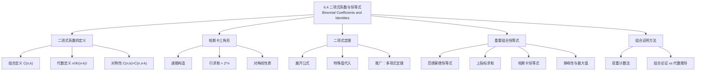

**相关笔记：** [[6.3 排列与组合]] | [[6.5 广义排列与组合]]

> [!abstract] 概览
> 本节系统介绍了==二项式系数== $\binom{n}{k}$ 的定义、性质与恒等式。二项式系数是组合数学中最基本也最重要的计数对象之一，它同时具有==组合意义==（从 $n$ 个元素中选 $k$ 个的方案数）和==代数意义==（二项式展开中 $x^{n-k}y^k$ 的系数）。
>
> - ==帕斯卡三角形==（Pascal's Triangle）以三角形阵列直观展示二项式系数的递推关系 $\binom{n}{k} = \binom{n-1}{k-1} + \binom{n-1}{k}$
> - ==二项式定理== $(x+y)^n = \sum_{k=0}^{n} \binom{n}{k} x^{n-k} y^k$ 是二项式系数的核心代数表达
> - 重要恒等式包括：==范德蒙德恒等式==、==上指标求和== $\sum_{k=0}^{n}\binom{k}{r} = \binom{n+1}{r+1}$、==二项式系数的单峰性==等
> - ==组合证明==（combinatorial proof）是证明恒等式的重要方法，通过双重计数建立等式

---

## 一、知识结构总览



---

## 二、核心思想

> [!tip] 核心思想
> 本节的核心思想是==二项式系数的双重身份==：它既是组合计数的结果（从 $n$ 个元素中选取 $k$ 个的方案数），又是代数运算的产物（二项式展开的系数）。这种双重身份使得我们可以用两种截然不同的方法来理解和证明关于二项式系数的恒等式——==组合证明==（counting arguments）和==代数证明==（algebraic manipulation）。帕斯卡三角形将这种双重身份以直观的几何形式呈现，其递推关系 $\binom{n}{k} = \binom{n-1}{k-1} + \binom{n-1}{k}$ 正是组合加法原理的直接体现。

### 1. 二项式系数的定义

> [!def] 二项式系数（Binomial Coefficient）
> 设 $n$ 和 $k$ 为非负整数，$0 \leq k \leq n$。二项式系数 $\binom{n}{k}$（读作"$n$ 选 $k$"）定义为：
>
> $$\binom{n}{k} = \frac{n!}{k!(n-k)!}$$
>
> - ==组合意义==：$\binom{n}{k}$ 等于从 $n$ 个不同元素的集合中选取 $k$ 个元素的方案数
> - 也常记作 $C(n,k)$ 或 ${}_nC_k$
> - 边界值：$\binom{n}{0} = \binom{n}{n} = 1$，$\binom{n}{1} = \binom{n}{n-1} = n$

> [!thm] 对称性（Symmetry Identity）
> 对所有 $0 \leq k \leq n$：
>
> $$\binom{n}{k} = \binom{n}{n-k}$$
>
> **证明**：由定义出发：
> $$\binom{n}{k} = \frac{n!}{k!(n-k)!} = \frac{n!}{(n-k)!(n-(n-k))!} = \binom{n}{n-k}$$
>
> **组合解释**：从 $n$ 个元素中选 $k$ 个，等价于从 $n$ 个元素中选 $n-k$ 个不选的元素。

### 2. 帕斯卡三角形（Pascal's Triangle）

> [!def] 帕斯卡三角形
> 帕斯卡三角形是一个三角形数字阵列，其中第 $n$ 行（从第 $0$ 行开始计数）包含二项式系数 $\binom{n}{0}, \binom{n}{1}, \ldots, \binom{n}{n}$。其递推构造规则为：
>
> $$\binom{n}{k} = \binom{n-1}{k-1} + \binom{n-1}{k}$$
>
> 其中约定 $\binom{n}{k} = 0$（当 $k < 0$ 或 $k > n$ 时）。

> [!example] 帕斯卡三角形的前 6 行
> ```
> n=0:           1
> n=1:          1 1
> n=2:         1 2 1
> n=3:        1 3 3 1
> n=4:       1 4 6 4 1
> n=5:      1 5 10 10 5 1
> ```

> [!thm] 帕斯卡恒等式（Pascal's Identity）
> 对所有正整数 $n$ 和 $0 < k < n$：
>
> $$\binom{n}{k} = \binom{n-1}{k-1} + \binom{n-1}{k}$$
>
> **组合证明**：考虑从 $n$ 个元素的集合 $S$ 中选 $k$ 个元素的方案数。固定一个特定元素 $a \in S$：
> - 包含 $a$ 的方案：先选 $a$，再从剩余 $n-1$ 个中选 $k-1$ 个，共 $\binom{n-1}{k-1}$ 种
> - 不包含 $a$ 的方案：直接从剩余 $n-1$ 个中选 $k$ 个，共 $\binom{n-1}{k}$ 种
> - 由加法原理，总方案数为 $\binom{n-1}{k-1} + \binom{n-1}{k}$

### 3. 二项式定理（Binomial Theorem）

> [!thm] 二项式定理
> 设 $n$ 为非负整数，则：
>
> $$(x+y)^n = \sum_{k=0}^{n} \binom{n}{k} x^{n-k} y^k$$
>
> 展开式共有 $n+1$ 项，其中第 $k$ 项（从 $k=0$ 开始）为 $\binom{n}{k} x^{n-k} y^k$。

> [!example] 展开 $(x+y)^4$
> $$(x+y)^4 = \binom{4}{0}x^4 + \binom{4}{1}x^3 y + \binom{4}{2}x^2 y^2 + \binom{4}{3}xy^3 + \binom{4}{4}y^4$$
> $$= x^4 + 4x^3 y + 6x^2 y^2 + 4xy^3 + y^4$$

> [!thm] 二项式定理的推论
> 在二项式定理中令 $x = y = 1$，得：
> $$2^n = \sum_{k=0}^{n} \binom{n}{k}$$
>
> 令 $x = 1$，$y = -1$，得：
> $$0 = \sum_{k=0}^{n} (-1)^k \binom{n}{k}$$
>
> 即：所有偶数位置的二项式系数之和等于所有奇数位置的二项式系数之和，都等于 $2^{n-1}$。

### 4. 重要组合恒等式

> [!thm] 范德蒙德恒等式（Vandermonde's Identity）
> 设 $m, n, r$ 为非负整数，则：
>
> $$\binom{m+n}{r} = \sum_{k=0}^{r} \binom{m}{k} \binom{n}{r-k}$$
>
> **组合证明**：从 $m+n$ 个元素（分为两组，分别有 $m$ 个和 $n$ 个）中选 $r$ 个。按从第一组中选出的个数 $k$ 分类：从第一组选 $k$ 个（$\binom{m}{k}$ 种），从第二组选 $r-k$ 个（$\binom{n}{r-k}$ 种），对所有可能的 $k$ 求和。

> [!thm] 上指标求和（Hockey-Stick Identity）
> 设 $n, r$ 为正整数，$n \geq r$，则：
>
> $$\sum_{k=r}^{n} \binom{k}{r} = \binom{n+1}{r+1}$$
>
> 也称为"曲棍球棒恒等式"，因为在帕斯卡三角形中，沿对角线求和的结果恰好位于对角线末端下方。
>
> **组合证明**：考虑从 $\{1, 2, \ldots, n+1\}$ 中选 $r+1$ 个元素，按最大元素 $k+1$ 分类。最大元素为 $k+1$（其中 $r \leq k \leq n$）时，需从 $\{1, \ldots, k\}$ 中选 $r$ 个，共 $\binom{k}{r}$ 种。对所有 $k$ 求和即得。

> [!thm] 二项式系数的单峰性
> 对于固定的 $n$，二项式系数 $\binom{n}{0}, \binom{n}{1}, \ldots, \binom{n}{n}$ 呈==单峰分布==：
> - 当 $n$ 为偶数时，最大值为 $\binom{n}{n/2}$
> - 当 $n$ 为奇数时，最大值为 $\binom{n}{(n-1)/2} = \binom{n}{(n+1)/2}$
> - 从左到右先严格递增，到达最大值后再严格递减

### 5. 组合证明方法

> [!def] 组合证明（Combinatorial Proof）
> 组合证明是一种通过==计数论证==来证明恒等式的方法。其核心思想是：
> 1. 找到一个合适的计数问题
> 2. 用两种不同的方法计算同一个量
> 3. 由于两种方法计算的是同一个量，因此结果相等
>
> 组合证明分为两类：
> - **双重计数证明**（double counting）：用两种方法计数同一个集合
> - **双射证明**（bijective proof）：在两个集合之间建立一一对应

---

## 三、补充理解与易混淆点

### 补充理解

> [!info] 补充1：帕斯卡三角形的历史与性质
> 帕斯卡三角形虽然以法国数学家 Blaise Pascal（1653）命名，但其发现远早于此。中国数学家杨辉在 1261 年的《详解九章算法》中就给出了类似的三角形（称为"杨辉三角"），更早可追溯到 11 世纪贾宪的"开方作法本源"。波斯数学家 Al-Karaji（约 953-1029）和印度数学家也独立发现了这一结构。
>
> 帕斯卡三角形中蕴含着丰富的数学性质：
> - 第 $n$ 行所有数之和为 $2^n$
> - 第 $n$ 行交替加减求和为 $0$（$n \geq 1$）
> - 沿对角线方向可以读出三角形数、四面体数等
> - 模 2 意义下的帕斯卡三角形呈现分形结构（Sierpinski 三角形）
>
> - [Pascal's Triangle - MathWorld](https://mathworld.wolfram.com/PascalsTriangle.html) -- 帕斯卡三角形的全面介绍
> - [Interactive Pascal's Triangle](https://www.mathsisfun.com/pascals-triangle.html) -- 帕斯卡三角形交互式探索
>
> 来源：Edwards, A. W. F. (2002). *Pascal's Arithmetical Triangle: The Story of a Mathematical Idea*. Johns Hopkins University Press.
> 来源：Rosen, K. H. (2019). *Discrete Mathematics and Its Applications* (8th ed.), McGraw-Hill, Section 6.4.

> [!info] 补充2：二项式系数的广泛应用
> 二项式系数在计算机科学和数学中有广泛应用：
> - **概率论**：二项分布 $P(X=k) = \binom{n}{k} p^k (1-p)^{n-k}$ 直接使用了二项式系数
> - **算法分析**：快速排序的平均比较次数 $\frac{2n!}{(n+1)!} \cdot 2^n$ 与二项式系数密切相关
> - **多项式插值**：伯恩斯坦多项式 $B_{k,n}(x) = \binom{n}{k} x^k (1-x)^{n-k}$ 是 Bezier 曲线的基础
> - **编码理论**：二项式系数出现在多种纠错码的参数计算中
>
> - [Binomial Coefficient - Wikipedia](https://en.wikipedia.org/wiki/Binomial_coefficient) -- 二项式系数的百科全书式介绍
> - [Combinatorial Identity Proofs](https://www.proofwiki.org/wiki/Category:Combinatorial_Identity_Proofs) -- 组合恒等式证明集合
>
> 来源：Graham, R. L., Knuth, D. E. & Patashnik, O. (1994). *Concrete Mathematics* (2nd ed.), Addison-Wesley, Chapter 5.
> 来源：Rosen, K. H. (2019). *Discrete Mathematics and Its Applications* (8th ed.), McGraw-Hill, Section 6.4.

### 易混淆点

> [!warning] 误区：排列与组合的混淆
> - ❌ 将 $\binom{n}{k}$ 与 $P(n,k)$ 混淆，忘记除以 $k!$
> - ✅ $\binom{n}{k} = \frac{P(n,k)}{k!} = \frac{n!}{k!(n-k)!}$，组合不关心顺序，排列关心顺序
> - ❌ 认为 $\binom{n}{k} = \binom{n}{k}$ 的对称性对所有 $k$ 都成立（实际上只对 $0 \leq k \leq n$ 有定义）
> - ✅ 当 $k > n$ 或 $k < 0$ 时，$\binom{n}{k} = 0$（在组合意义下）

> [!warning] 误区：组合证明与代数证明的等价性
> - ❌ 认为组合证明"不够严格"，只有代数证明才可靠
> - ✅ 组合证明与代数证明是==等价的==，组合证明往往更直观、更能揭示恒等式的本质含义
> - ❌ 在组合证明中只给出计数公式而不解释计数逻辑
> - ✅ 组合证明的关键是==清晰地描述计数问题==，并说明两种计数方法各自对应恒等式的哪一侧

---

## 四、习题精选

> [!todo] 习题概览
> | 题号范围 | 核心考点 | 难度 |
> |---------|---------|------|
> | 1-2 | 计算二项式系数的值 | ⭐ |
> | 3-6 | 利用帕斯卡恒等式求值 | ⭐⭐ |
> | 7-10 | 利用二项式定理展开 | ⭐⭐ |
> | 11-14 | 证明组合恒等式（代数法） | ⭐⭐⭐ |
> | 15-18 | 组合证明恒等式 | ⭐⭐⭐ |
> | 19-22 | 范德蒙德恒等式的应用 | ⭐⭐⭐ |
> | 23-26 | 上指标求和恒等式 | ⭐⭐⭐ |
> | 27-30 | 二项式系数的单峰性 | ⭐⭐⭐ |

### 题1：利用二项式定理展开

> [!problem] 题目
> 利用二项式定理展开 $(2x - 3y)^5$。

> [!faq]- 解答
> 由二项式定理：
> $$(2x - 3y)^5 = \sum_{k=0}^{5} \binom{5}{k} (2x)^{5-k} (-3y)^k$$
>
> 逐项计算：
> - $k=0$：$\binom{5}{0}(2x)^5 = 32x^5$
> - $k=1$：$\binom{5}{1}(2x)^4(-3y) = 5 \cdot 16x^4 \cdot (-3y) = -240x^4 y$
> - $k=2$：$\binom{5}{2}(2x)^3(-3y)^2 = 10 \cdot 8x^3 \cdot 9y^2 = 720x^3 y^2$
> - $k=3$：$\binom{5}{3}(2x)^2(-3y)^3 = 10 \cdot 4x^2 \cdot (-27y^3) = -1080x^2 y^3$
> - $k=4$：$\binom{5}{4}(2x)(-3y)^4 = 5 \cdot 2x \cdot 81y^4 = 810xy^4$
> - $k=5$：$\binom{5}{5}(-3y)^5 = -243y^5$
>
> 因此：
> $$(2x - 3y)^5 = 32x^5 - 240x^4 y + 720x^3 y^2 - 1080x^2 y^3 + 810xy^4 - 243y^5$$

$\blacksquare$

### 题2：证明组合恒等式

> [!problem] 题目
> 证明恒等式 $\sum_{k=0}^{n} \binom{n}{k}^2 = \binom{2n}{n}$。

> [!faq]- 解答
> **方法一：利用范德蒙德恒等式**
>
> 在范德蒙德恒等式 $\binom{m+n}{r} = \sum_{k=0}^{r} \binom{m}{k} \binom{n}{r-k}$ 中，令 $m = n$，$r = n$：
> $$\binom{2n}{n} = \sum_{k=0}^{n} \binom{n}{k} \binom{n}{n-k} = \sum_{k=0}^{n} \binom{n}{k}^2$$
>
> 最后一步利用了对称性 $\binom{n}{n-k} = \binom{n}{k}$。
>
> **方法二：组合证明**
>
> 考虑从 $2n$ 个元素中选 $n$ 个的方案数。将 $2n$ 个元素分成两组，每组 $n$ 个。按从第一组中选出的个数 $k$ 分类：从第一组选 $k$ 个（$\binom{n}{k}$ 种），从第二组选 $n-k$ 个（$\binom{n}{n-k} = \binom{n}{k}$ 种），对所有 $k$ 求和。

$\blacksquare$

### 题3：上指标求和

> [!problem] 题目
> 利用上指标求和恒等式计算 $\sum_{k=3}^{10} \binom{k}{3}$。

> [!faq]- 解答
> 由上指标求和恒等式 $\sum_{k=r}^{n} \binom{k}{r} = \binom{n+1}{r+1}$，令 $r = 3$，$n = 10$：
> $$\sum_{k=3}^{10} \binom{k}{3} = \binom{11}{4} = \frac{11!}{4! \cdot 7!} = \frac{11 \times 10 \times 9 \times 8}{4 \times 3 \times 2 \times 1} = 330$$

$\blacksquare$

### 题4：帕斯卡恒等式的应用

> [!problem] 题目
> 用组合证明的方法证明：$\binom{n+1}{k+1} = \sum_{j=k}^{n} \binom{j}{k}$。

> [!faq]- 解答
> **组合证明**：考虑从 $\{0, 1, 2, \ldots, n\}$ 中选 $k+1$ 个元素。
>
> **方法一**（直接计数）：$\binom{n+1}{k+1}$。
>
> **方法二**（按最大元素分类）：设选出的 $k+1$ 个元素中最大的为 $j+1$（其中 $k \leq j \leq n$）。那么还需要从 $\{0, 1, \ldots, j\}$ 中选 $k$ 个（不含 $j+1$ 本身），即从 $\{0, 1, \ldots, j-1\}$ 中选 $k$ 个，共 $\binom{j}{k}$ 种。
>
> 对所有可能的 $j$（从 $k$ 到 $n$）求和，得：
> $$\binom{n+1}{k+1} = \sum_{j=k}^{n} \binom{j}{k}$$

$\blacksquare$

### 题5：二项式系数的单峰性

> [!problem] 题目
> 证明当 $n$ 为偶数时，$\binom{n}{n/2}$ 是第 $n$ 行的最大二项式系数。

> [!faq]- 解答
> 考虑相邻两项之比：
> $$\frac{\binom{n}{k+1}}{\binom{n}{k}} = \frac{n!}{(k+1)!(n-k-1)!} \cdot \frac{k!(n-k)!}{n!} = \frac{n-k}{k+1}$$
>
> - 当 $\frac{n-k}{k+1} > 1$，即 $k < \frac{n-1}{2}$ 时，$\binom{n}{k+1} > \binom{n}{k}$（递增）
> - 当 $\frac{n-k}{k+1} < 1$，即 $k > \frac{n-1}{2}$ 时，$\binom{n}{k+1} < \binom{n}{k}$（递减）
> - 当 $\frac{n-k}{k+1} = 1$，即 $k = \frac{n-1}{2}$ 时，$\binom{n}{k+1} = \binom{n}{k}$
>
> 当 $n$ 为偶数时，$\frac{n-1}{2}$ 不是整数，递增到 $k = \frac{n}{2} - 1$ 后递减，因此 $\binom{n}{n/2}$ 是唯一的最大值。

$\blacksquare$

> [!tip] 解题思路提示
> 二项式系数恒等式的解题方法论：
> 1. **代数证明**：利用定义 $\binom{n}{k} = \frac{n!}{k!(n-k)!}$ 直接化简，或利用帕斯卡恒等式递推
> 2. **组合证明**：找到一个计数问题，用两种方法计数，关键在于选择合适的分类标准
> 3. **二项式定理**：通过在 $(x+y)^n$ 中代入特殊值（如 $x=y=1$，$x=1,y=-1$）得到恒等式
> 4. **范德蒙德恒等式**：处理涉及两组元素的选择问题时，考虑按从第一组中选出的个数分类
> 5. **上指标求和**：处理 $\sum \binom{k}{r}$ 形式的求和时，考虑"按最大元素分类"的组合论证

---

## 五、视频学习指南

> [!info] 视频资源
> | 资源 | 链接 | 对应内容 | 备注 |
> |:-----|:-----|:---------|:-----|
> | Rosen 8e Section 6.4 | [教材原文](https://www.mheducation.com/highered/product/discrete-mathematics-applications-rosen/M9781259676512.html) | 完整定义、定理与例题 | 英文教材 |
> | MIT 6.042J Lecture 5 | [链接](https://www.youtube.com/watch?v=2OQlGzjPn4g) | 组合计数与二项式系数 | 英文，MIT开放课程 |
> | 3Blue1Brown - 二项式定理 | [链接](https://www.youtube.com/watch?v=OmJ-4B-mS-Y) | 二项式定理的直觉理解 | 英文，可视化讲解 |

---

## 六、教材原文

> [!quote] 教材原文
> "The binomial theorem gives the coefficients of the expansion of powers of binomial expressions. The binomial coefficient $\binom{n}{k}$ counts the number of ways to choose $k$ objects from a set of $n$ distinct objects. This connection between algebra and combinatorics is one of the most fruitful in all of mathematics."
>
> "Combinatorial proofs are often more enlightening than algebraic proofs because they reveal why an identity is true, not just that it is true. A combinatorial proof establishes that both sides of an identity count the same set of objects, just in two different ways."

---

## 参见 Wiki

- [[离散数学/concepts/二项式系数]] -- 二项式系数的定义与性质
- [[离散数学/concepts/二项式定理]] -- 二项式定理及其推论
- [[离散数学/concepts/帕斯卡三角形]] -- 帕斯卡三角形的构造与性质
- [[离散数学/concepts/二项式系数|范德蒙德恒等式]] -- 范德蒙德恒等式及其证明
- [[离散数学/concepts/排列组合恒等式|组合证明]] -- 组合证明方法详解

#学习/离散数学/计数
