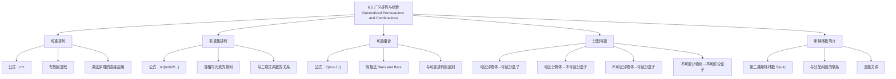

**相关笔记：** [[6.4 二项式系数与恒等式]] | [[6.6 生成排列与组合]]

> [!abstract] 概览
> 本节将[[6.3 排列与组合]]中的基本排列组合模型推广到更一般的情形，包括==可重排列==（允许重复选取）、==多重集排列==（含不可区分元素的排列）、==可重组合==（允许重复选取的组合）以及==分配问题==（将物体放入盒子）。这些推广模型在实际问题中极为常见。
>
> - ==可重排列==：从 $n$ 个元素中有放回地取 $r$ 个并排列，方案数为 $n^r$
> - ==多重集排列==：$n$ 个元素中有 $n_1$ 个相同、$n_2$ 个相同、...，排列数为 $\frac{n!}{n_1! n_2! \cdots}$
> - ==可重组合==：从 $n$ 个元素中有放回地取 $r$ 个（不排序），方案数为 $\binom{n+r-1}{r}$
> - ==分配问题==：将 $n$ 个物体分配到 $k$ 个盒子中，根据物体和盒子是否可区分、是否允许空盒，有 12 种模型
> - ==斯特林数==：$S(n,k)$ 表示将 $n$ 个可区分物体分成 $k$ 个不可区分的非空子集的方案数

---

## 一、知识结构总览

---

## 二、核心思想

> [!tip] 核心思想
> 本节的核心思想是==计数模型的系统分类==。基本排列组合只处理"从 $n$ 个不同元素中选 $r$ 个"的最简单情形，但实际问题往往涉及重复、不可区分性、分配等更复杂的约束。通过系统地区分"是否允许重复"、"元素是否可区分"、"是否关心顺序"这三个维度，我们可以建立一套完整的计数模型体系，覆盖绝大多数计数问题的需求。==隔板法==（Stars and Bars）是处理可重组合和分配问题的统一而强大的工具。

### 1. 可重排列（Permutations with Repetition）

> [!def] 可重排列
> 设有 $n$ 个不同元素，允许==重复选取==，从中取 $r$ 个进行排列（考虑顺序），则方案数为：
>
> $$P(n; r) = n^r$$
>
> - 这实际上是==乘法原理==的直接应用：每个位置有 $n$ 种选择，共 $r$ 个位置
> - 当 $r > n$ 时仍然适用（与无重排列不同）
> - 也称为 "$n$ 个元素的 $r$-可重排列"

> [!example] 例题
> 用数字 $\{1, 2, 3, 4, 5\}$ 组成 3 位数的密码（允许重复），共有多少种？
>
> 每一位有 5 种选择，共 3 位，因此方案数为 $5^3 = 125$ 种。

### 2. 多重集排列（Permutations of Multisets）

> [!def] 多重集排列
> 设有 $n$ 个元素，其中第 $1$ 种有 $n_1$ 个相同的，第 $2$ 种有 $n_2$ 个相同的，...，第 $k$ 种有 $n_k$ 个相同的，且 $n_1 + n_2 + \cdots + n_k = n$。则这 $n$ 个元素的==不同排列数==为：
>
> $$\frac{n!}{n_1! \cdot n_2! \cdots n_k!}$$
>
> - 当所有 $n_i = 1$ 时（即所有元素不同），退化为普通排列 $n!$
> - 直觉：先当作所有元素不同（$n!$ 种），再除以每种内部的全排列（$n_i!$）

> [!example] 例题
> 将单词 MISSISSIPPI 的字母重新排列，共有多少种不同的排列方式？
>
> - 共 11 个字母：M(1), I(4), S(4), P(2)
> - 排列数为 $\frac{11!}{1! \cdot 4! \cdot 4! \cdot 2!} = \frac{39916800}{1 \cdot 24 \cdot 24 \cdot 2} = 34650$

### 3. 可重组合（Combinations with Repetition）

> [!def] 可重组合
> 设有 $n$ 个不同元素，允许==重复选取==，从中取 $r$ 个（不关心顺序），则方案数为：
>
> $$C(n+r-1, r) = \binom{n+r-1}{r}$$
>
> - 也记作 $H(n, r)$（$H$ 代表"可重"，来自德语 Hypergeometrie）或 $C(n+r-1, r)$
> - 当 $r > n$ 时仍然适用

> [!thm] 隔板法（Stars and Bars）
> 可重组合的方案数 $\binom{n+r-1}{r}$ 可以通过"隔板法"直观理解：
>
> 将问题转化为：将 $r$ 个相同的球（stars, $*$）放入 $n$ 个不同的盒子（由 $n-1$ 个隔板, $|$ 分隔）中，允许空盒。
>
> 例如，$n = 4$，$r = 6$ 的一种分配方式：$**|*||***$ 表示第1个盒子2个、第2个盒子1个、第3个盒子0个、第4个盒子3个。
>
> 共有 $r$ 个星号和 $n-1$ 个隔板，总计 $n+r-1$ 个位置，从中选 $r$ 个位置放星号（或选 $n-1$ 个位置放隔板），方案数为 $\binom{n+r-1}{r}$。

> [!example] 例题
> 从 5 种水果中选 10 个（每种可以选多个），共有多少种选法？
>
> $$\binom{5+10-1}{10} = \binom{14}{10} = \binom{14}{4} = \frac{14 \times 13 \times 12 \times 11}{4 \times 3 \times 2 \times 1} = 1001$$

### 4. 分配问题（Distribution Problems）

> [!def] 分配问题的 12 种模型
> 将 $n$ 个物体分配到 $k$ 个盒子中，根据以下两个维度分类：
>
> | | 物体可区分 | 物体不可区分 |
> |:--|:--|:--|
> | **盒子可区分，允许空盒** | $k^n$ | $\binom{n+k-1}{n}$ |
> | **盒子可区分，不允许空盒** | $k! \cdot S(n,k)$ | $\binom{n-1}{k-1}$ |
> | **盒子不可区分，允许空盒** | $\sum_{j=1}^{k} S(n,j)$ | $p_k(n)$（整数分拆） |
> | **盒子不可区分，不允许空盒** | $S(n,k)$ | $p_k(n)$（恰好 $k$ 部分） |
>
> 其中 $S(n,k)$ 为第二类斯特林数，$p_k(n)$ 为将 $n$ 分成至多/恰好 $k$ 个正整数之和的方案数。

> [!example] 例题
> 将 5 个不同的球放入 3 个不同的盒子中（允许空盒），共有多少种方法？
>
> 每个球有 3 种选择，由乘法原理：$3^5 = 243$ 种。

### 5. 斯特林数（Stirling Numbers）

> [!def] 第二类斯特林数（Stirling Numbers of the Second Kind）
> $S(n,k)$（也记作 $\left\{ \begin{matrix} n \\ k \end{matrix} \right\}$）表示将 $n$ 个==可区分==的元素划分为 $k$ 个==不可区分==的==非空==子集的方案数。
>
> 递推关系：
> $$S(n,k) = k \cdot S(n-1,k) + S(n-1,k-1)$$
>
> 其中 $S(0,0) = 1$，$S(n,0) = 0$（$n > 0$），$S(0,k) = 0$（$k > 0$），$S(n,1) = 1$，$S(n,n) = 1$。

> [!example] 斯特林数的递推解释
> 考虑将元素 $\{1, 2, \ldots, n\}$ 划分为 $k$ 个非空子集。对元素 $n$：
> - **情况一**：$n$ 单独构成一个子集，则剩余 $n-1$ 个元素需划分为 $k-1$ 个子集，共 $S(n-1,k-1)$ 种
> - **情况二**：$n$ 加入已有的某个子集，则剩余 $n-1$ 个元素需划分为 $k$ 个子集（$S(n-1,k)$ 种），$n$ 有 $k$ 个子集可选，共 $k \cdot S(n-1,k)$ 种
> - 由加法原理：$S(n,k) = k \cdot S(n-1,k) + S(n-1,k-1)$

---

## 三、补充理解与易混淆点

### 补充理解

> [!info] 补充1：隔板法的适用条件与变体
> 隔板法（Stars and Bars）由英国数学家 William Feller 在其经典著作《概率论及其应用》（Feller, 1950）中系统推广。其核心思想是将"选取"问题转化为"分配"问题。
>
> 隔板法的三种变体：
> 1. **允许空盒**（标准形式）：$\binom{n+r-1}{r}$ -- 每个盒子可以没有球
> 2. **不允许空盒**：$\binom{r-1}{n-1}$ -- 先给每个盒子放 1 个球，再对剩余 $r-n$ 个球使用标准隔板法，即 $\binom{(r-n)+n-1}{r-n} = \binom{r-1}{r-n} = \binom{r-1}{n-1}$
> 3. **下界约束**（每个盒子至少 $a_i$ 个球）：先给第 $i$ 个盒子放 $a_i$ 个球，再对剩余球使用标准隔板法
>
> - [Stars and Bars - MathWorld](https://mathworld.wolfram.com/StarsandBars.html) -- 隔板法的数学百科介绍
> - [Art of Problem Solving - Stars and Bars](https://artofproblemsolving.com/wiki/index.php/Stars_and_bars) -- 竞赛数学中的隔板法应用
>
> 来源：Rosen, K. H. (2019). *Discrete Mathematics and Its Applications* (8th ed.), McGraw-Hill, Section 6.5.
> 来源：Brualdi, R. A. (2010). *Introductory Combinatorics* (5th ed.), Pearson, Chapter 3.

> [!info] 补充2：斯特林数的深入理解
> 斯特林数以苏格兰数学家 James Stirling（1692-1770）命名。第二类斯特林数 $S(n,k)$ 在许多领域有重要应用：
> - **集合论**：$S(n,k)$ 是将 $n$ 元集合划分为 $k$ 个等价类的方案数
> - **算法分析**：将 $n$ 个元素分成 $k$ 个桶的方案数
> - **概率论**：与泊松分布的复合分布有关
> - **图论**：与连通分量的计数有关
>
> 斯特林数与==贝尔数== $B_n = \sum_{k=0}^{n} S(n,k)$ 的关系：贝尔数表示 $n$ 个元素的所有可能划分的总数。
>
> - [Stirling Numbers - MathWorld](https://mathworld.wolfram.com/StirlingNumberoftheSecondKind.html) -- 斯特林数的全面介绍
> - [Stirling Numbers - Wikipedia](https://en.wikipedia.org/wiki/Stirling_numbers_of_the_second_kind) -- 斯特林数的百科全书式介绍
>
> 来源：Graham, R. L., Knuth, D. E. & Patashnik, O. (1994). *Concrete Mathematics* (2nd ed.), Addison-Wesley, Chapter 6.
> 来源：Knuth, D. E. (1997). *The Art of Computer Programming, Vol. 3: Sorting and Searching* (2nd ed.), Addison-Wesley, Section 5.1.2.

### 易混淆点

> [!warning] 误区：可重排列与可重组合的混淆
> - ❌ 将可重组合的公式 $\binom{n+r-1}{r}$ 与可重排列的公式 $n^r$ 混淆
> - ✅ 关键区别在于==是否关心顺序==：排列关心顺序（$n^r$），组合不关心顺序（$\binom{n+r-1}{r}$）
> - ❌ 在可重组合中误用 $\binom{n}{r}$（这是无重组合的公式）
> - ✅ 可重组合的公式 $\binom{n+r-1}{r}$ 比无重组合的 $\binom{n}{r}$ 大，因为允许重复选取增加了方案数

> [!warning] 误区：分配问题中"可区分"与"不可区分"的判断
> - ❌ 将"不可区分的盒子"问题当作"可区分的盒子"来计算
> - ✅ 判断标准：交换两个盒子后，如果结果被视为不同的方案，则盒子可区分；否则不可区分
> - ❌ 将"不可区分的物体"问题当作"可区分的物体"来计算
> - ✅ 判断标准：交换两个物体后，如果结果被视为不同的方案，则物体可区分；否则不可区分
> - ⚠️ 最常见的错误是将"不可区分物体放入可区分盒子"误算为 $k^n$（这对应的是可区分物体），正确答案需要使用隔板法或斯特林数

---

## 四、习题精选

> [!todo] 习题概览
> | 题号范围 | 核心考点 | 难度 |
> |---------|---------|------|
> | 1-4 | 可重排列 $n^r$ | ⭐ |
> | 5-8 | 多重集排列 | ⭐⭐ |
> | 9-12 | 可重组合 $\binom{n+r-1}{r}$ | ⭐⭐ |
> | 13-16 | 隔板法的应用 | ⭐⭐⭐ |
> | 17-20 | 分配问题（12种模型） | ⭐⭐⭐ |
> | 21-24 | 斯特林数的计算 | ⭐⭐⭐ |
> | 25-28 | 综合应用题 | ⭐⭐⭐⭐ |

### 题1：可重排列

> [!problem] 题目
> 有 6 种不同口味的冰淇淋，从中选 3 个球组成一个甜筒（顺序不同视为不同），允许重复选取。共有多少种不同的甜筒？

> [!faq]- 解答
> 这是可重排列问题：$n = 6$ 种口味，选 $r = 3$ 个球，考虑顺序。
>
> $$P(6; 3) = 6^3 = 216$$

$\blacksquare$

### 题2：多重集排列

> [!problem] 题目
> 将单词 BANANA 的字母重新排列，共有多少种不同的排列方式？

> [!faq]- 解答
> BANANA 共 6 个字母：B(1), A(3), N(2)。
>
> 排列数为：
> $$\frac{6!}{1! \cdot 3! \cdot 2!} = \frac{720}{1 \cdot 6 \cdot 2} = 60$$

$\blacksquare$

### 题3：可重组合与隔板法

> [!problem] 题目
> 一家面包店卖 4 种面包（牛角包、法棍、吐司、贝果）。一位顾客想买 12 个面包，共有多少种不同的购买方案？

> [!faq]- 解答
> 这是可重组合问题：$n = 4$ 种面包，选 $r = 12$ 个，不关心顺序。
>
> $$\binom{4+12-1}{12} = \binom{15}{12} = \binom{15}{3} = \frac{15 \times 14 \times 13}{3 \times 2 \times 1} = 455$$
>
> **隔板法验证**：将 12 个相同的球放入 4 个不同的盒子中，需要 $4-1 = 3$ 个隔板，共 $12 + 3 = 15$ 个位置，选 3 个放隔板：$\binom{15}{3} = 455$。

$\blacksquare$

### 题4：不允许空盒的分配问题

> [!problem] 题目
> 将 10 个相同的糖果分给 4 个不同的孩子，要求每个孩子至少分到 1 个糖果。共有多少种分配方法？

> [!faq]- 解答
> 这是不可区分物体放入可区分盒子、不允许空盒的问题。
>
> 方法：先给每个孩子分 1 个糖果（共分出 4 个），剩余 $10 - 4 = 6$ 个糖果用隔板法分配（允许空盒）。
>
> $$\binom{6 + 4 - 1}{6} = \binom{9}{6} = \binom{9}{3} = \frac{9 \times 8 \times 7}{3 \times 2 \times 1} = 84$$
>
> 或者直接使用不允许空盒的公式：$\binom{10-1}{4-1} = \binom{9}{3} = 84$。

$\blacksquare$

### 题5：斯特林数的计算

> [!problem] 题目
> 计算 $S(4, 2)$，并解释其组合意义。

> [!faq]- 解答
> 利用递推关系 $S(n,k) = k \cdot S(n-1,k) + S(n-1,k-1)$：
>
> - $S(1,1) = 1$
> - $S(2,1) = 1$，$S(2,2) = 1$
> - $S(3,1) = 1$，$S(3,2) = 2 \cdot S(2,2) + S(2,1) = 2 \cdot 1 + 1 = 3$，$S(3,3) = 1$
> - $S(4,2) = 2 \cdot S(3,2) + S(3,1) = 2 \cdot 3 + 1 = 7$
>
> **组合意义**：将 $\{1, 2, 3, 4\}$ 划分为 2 个非空子集的方案。列举如下：
> 1. $\{1\} \cup \{2,3,4\}$
> 2. $\{2\} \cup \{1,3,4\}$
> 3. $\{3\} \cup \{1,2,4\}$
> 4. $\{4\} \cup \{1,2,3\}$
> 5. $\{1,2\} \cup \{3,4\}$
> 6. $\{1,3\} \cup \{2,4\}$
> 7. $\{1,4\} \cup \{2,3\}$
>
> 共 7 种，与计算结果一致。

$\blacksquare$

> [!tip] 解题思路提示
> 广义排列组合的解题方法论：
> 1. **判断模型**：首先确定是排列（关心顺序）还是组合（不关心顺序），是否允许重复
> 2. **可重排列**：$n^r$，直接使用乘法原理
> 3. **多重集排列**：$\frac{n!}{n_1! n_2! \cdots}$，先全排列再除以重复
> 4. **可重组合**：$\binom{n+r-1}{r}$，使用隔板法转化
> 5. **分配问题**：先判断物体和盒子是否可区分，再判断是否允许空盒，最后查表选择公式
> 6. **斯特林数**：使用递推关系 $S(n,k) = k \cdot S(n-1,k) + S(n-1,k-1)$ 逐行计算

---

## 五、视频学习指南

> [!info] 视频资源
> | 资源 | 链接 | 对应内容 | 备注 |
> |:-----|:-----|:---------|:-----|
> | Rosen 8e Section 6.5 | [教材原文](https://www.mheducation.com/highered/product/discrete-mathematics-applications-rosen/M9781259676512.html) | 完整定义、定理与例题 | 英文教材 |
> | TrevTutor - Combinatorics | [链接](https://www.youtube.com/playlist?list=PLDDGPdw7e6AgWQGK2EmG3PZkQsU_L4Mkl) | 排列组合系统讲解 | 英文，适合入门 |
> | Mathologer - Stars and Bars | [链接](https://www.youtube.com/watch?v=UTCw00b1UyM) | 隔板法的直觉理解 | 英文，可视化讲解 |

---

## 六、教材原文

> [!quote] 教材原文
> "In this section we extend the counting methods we studied in the previous section to situations where repetition is allowed or where the objects to be counted are not all distinct."
>
> "The twelvefold way provides a systematic framework for counting the number of ways to distribute objects into boxes. The answer depends on whether the objects and boxes are distinguishable or indistinguishable, and on whether empty boxes are allowed."

---

## 参见 Wiki

- [[离散数学/concepts/可重排列]] -- 可重排列的定义与公式
- [[离散数学/concepts/多重集排列]] -- 多重集排列的定义与公式
- [[离散数学/concepts/分配问题]] -- 分配问题的 12 种模型
- [[离散数学/concepts/斯特林数]] -- 斯特林数的定义、递推与应用
- [[离散数学/concepts/可重排列|隔板法]] -- 隔板法的原理与应用

#学习/离散数学/计数
