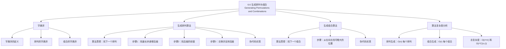

**相关笔记：** [[6.5 广义排列与组合]] | [[7.1 概率]]

> [!abstract] 概览
> 本节讨论如何系统地==生成所有排列和组合==的算法问题。在实际应用中（如密码破解、组合优化、搜索算法），我们不仅需要知道排列/组合的数量，还需要能够逐一枚举它们。本节介绍了基于==字典序==（lexicographic order）的两种经典算法：排列生成算法和组合生成算法。
>
> - ==字典序==（lexicographic order）是生成排列和组合的自然序，类似于字典中单词的排列方式
> - ==字典序生成排列算法==：从当前排列出发，找到下一个字典序更大的排列，直到生成所有 $n!$ 个排列
> - ==字典序生成组合算法==：从当前 $r$-组合出发，找到下一个字典序更大的组合，直到生成所有 $\binom{n}{r}$ 个组合
> - 两个算法的时间复杂度均为==最优==的 $O(n)$ 和 $O(r)$（每个元素的平均代价为 $O(1)$）

---

## 一、知识结构总览



---

## 二、核心思想

> [!tip] 核心思想
> 本节的核心思想是==基于字典序的有序枚举==。字典序提供了一种自然、确定性的全序关系，使得我们可以定义"下一个排列/组合"的概念，从而设计出系统化的生成算法。排列生成算法的关键操作是"找到当前排列的下一个字典序后继"，其核心步骤可以分解为三步：找到需要改变的最右位置、确定该位置应该替换为哪个更大的元素、将剩余部分重排为最小字典序。组合生成算法则更为简洁，因为组合的字典序具有特殊的结构性质。

### 1. 字典序（Lexicographic Order）

> [!def] 字典序
> 设 $a_1 a_2 \cdots a_r$ 和 $b_1 b_2 \cdots b_r$ 是两个长度相同的序列（元素取自全序集）。==字典序==定义如下：
>
> - 在最左边的不同位置 $j$ 处，如果 $a_j < b_j$，则 $a_1 a_2 \cdots a_r < b_1 b_2 \cdots b_r$
> - 如果两个序列完全相同，则它们相等
>
> 直觉：字典序与英语词典中单词的排列方式相同——先比较第一个字母，若相同则比较第二个，以此类推。

> [!example] 排列的字典序示例
> $\{1, 2, 3\}$ 的所有排列按字典序排列：
> $$123 < 132 < 213 < 231 < 312 < 321$$

> [!example] 组合的字典序示例
> $\{1, 2, 3, 4\}$ 的所有 2-组合按字典序排列：
> $$12 < 13 < 14 < 23 < 24 < 34$$

### 2. 字典序生成排列算法

> [!def] 字典序生成排列算法
> 给定当前排列 $a_1 a_2 \cdots a_n$，求其字典序后继（下一个排列）的算法如下：
>
> **步骤 1**：从右向左找到第一个满足 $a_i < a_{i+1}$ 的位置 $i$（即找到最长非递增后缀的起点）
>
> **步骤 2**：从右向左找到第一个满足 $a_j > a_i$ 的位置 $j$（$j > i$）
>
> **步骤 3**：交换 $a_i$ 和 $a_j$
>
> **步骤 4**：将位置 $i+1$ 到 $n$ 的子序列==反转==（使其变为递增序，即最小字典序）
>
> 如果步骤 1 找不到满足条件的 $i$，则当前排列已是最后一个排列（即 $n \ n-1 \ \cdots \ 2 \ 1$）。

> [!example] 算法执行示例
> 求排列 $1\ 3\ 5\ 4\ 2$ 的下一个字典序排列。
>
> **步骤 1**：从右向左扫描，$2 < 4$ 不满足（需要 $a_i < a_{i+1}$），$4 < 5$ 不满足，$3 < 5$ 满足！所以 $i = 2$（$a_i = 3$）。
>
> 最长非递增后缀为 $5\ 4\ 2$。
>
> **步骤 2**：从右向左找到第一个 $> 3$ 的元素：$2 < 3$ 不满足，$4 > 3$ 满足！所以 $j = 4$（$a_j = 4$）。
>
> **步骤 3**：交换 $a_2$ 和 $a_4$，得到 $1\ \mathbf{4}\ 5\ \mathbf{3}\ 2$。
>
> **步骤 4**：将位置 3 到 5 的子序列 $5\ 3\ 2$ 反转为 $2\ 3\ 5$，得到最终结果：$1\ 4\ 2\ 3\ 5$。

> [!def] 排列生成算法的伪代码
> ```
> procedure next_permutation(a[1..n])
>     // 步骤1：找最长非递增后缀的起点
>     i := n - 1
>     while i > 0 and a[i] >= a[i+1] do
>         i := i - 1
>     if i = 0 then
>         return false  // 已是最后一个排列
>
>     // 步骤2：找后缀中大于a[i]的最小元素
>     j := n
>     while a[j] <= a[i] do
>         j := j - 1
>
>     // 步骤3：交换
>     swap(a[i], a[j])
>
>     // 步骤4：反转后缀
>     reverse(a[i+1..n])
>
>     return true
> ```

### 3. 字典序生成组合算法

> [!def] 字典序生成 $r$-组合算法
> 给定当前 $r$-组合 $a_1 a_2 \cdots a_r$（其中 $1 \leq a_1 < a_2 < \cdots < a_r \leq n$），求其字典序后继的算法如下：
>
> **步骤 1**：从右向左找到第一个满足 $a_i < n - r + i$ 的位置 $i$
>
> **步骤 2**：令 $a_i := a_i + 1$
>
> **步骤 3**：对 $j = i+1, i+2, \ldots, r$，令 $a_j := a_{j-1} + 1$
>
> 如果步骤 1 找不到满足条件的 $i$，则当前组合已是最后一个组合（即 $n-r+1, n-r+2, \ldots, n$）。

> [!example] 算法执行示例
> 从 $\{1, 2, 3, 4, 5, 6\}$ 中取 4 个元素，求组合 $1\ 3\ 4\ 6$ 的下一个组合。
>
> **步骤 1**：从右向左检查：
> - $i = 4$：$a_4 = 6$，$n - r + i = 6 - 4 + 4 = 6$，$6 < 6$ 不满足
> - $i = 3$：$a_3 = 4$，$n - r + i = 6 - 4 + 3 = 5$，$4 < 5$ 满足！
>
> **步骤 2**：$a_3 := 4 + 1 = 5$
>
> **步骤 3**：$a_4 := a_3 + 1 = 6$
>
> 结果：$1\ 3\ \mathbf{5}\ \mathbf{6}$。

> [!def] 组合生成算法的伪代码
> ```
> procedure next_combination(a[1..r], n)
>     // 步骤1：找最右可增大的位置
>     i := r
>     while i > 0 and a[i] = n - r + i do
>         i := i - 1
>     if i = 0 then
>         return false  // 已是最后一个组合
>
>     // 步骤2和3：增大并重置后续元素
>     a[i] := a[i] + 1
>     for j := i + 1 to r do
>         a[j] := a[j-1] + 1
>
>     return true
> ```

### 4. 算法复杂度分析

> [!thm] 时间复杂度
> - **排列生成算法**：每次调用 `next_permutation` 的时间复杂度为 $O(n)$（步骤 1 扫描 $O(n)$，步骤 2 扫描 $O(n)$，步骤 4 反转 $O(n)$）。生成全部 $n!$ 个排列的总时间为 $O(n \cdot n!)$，每个元素的平均代价为 $O(1)$。
>
> - **组合生成算法**：每次调用 `next_combination` 的时间复杂度为 $O(r)$（步骤 1 扫描 $O(r)$，步骤 3 重置 $O(r)$）。生成全部 $\binom{n}{r}$ 个组合的总时间为 $O(r \cdot \binom{n}{r})$，每个元素的平均代价为 $O(1)$。
>
> 两个算法都是==最优==的，因为仅输出所有排列/组合就需要 $\Theta(n \cdot n!)$ 和 $\Theta(r \cdot \binom{n}{r})$ 的时间。

---

## 三、补充理解与易混淆点

### 补充理解

> [!info] 补充1：字典序排列生成的正确性证明
> 字典序排列生成算法的正确性可以从以下三个角度理解：
>
> 1. **为什么找最长非递增后缀？** 因为后缀已经是最大字典序（递减），要增大排列必须修改后缀之前的元素。找到最右边的可修改位置保证了生成的下一个排列是所有可能后继中最小的。
>
> 2. **为什么反转后缀？** 交换后，后缀仍然是递减的（因为原来 $a_i < a_j$，且 $a_j$ 是后缀中大于 $a_i$ 的最小元素）。反转使其变为递增，即最小字典序，确保生成的排列是紧接的下一个。
>
> 3. **为什么步骤 2 中 $a_j$ 是后缀中大于 $a_i$ 的最小元素？** 因为后缀是递减的，从右向左扫描找到的第一个 $> a_i$ 的元素就是最小的满足条件的元素。
>
> - [Next Permutation - Wikipedia](https://en.wikipedia.org/wiki/Permutation#Generation_in_lexicographic_order) -- 字典序排列生成的百科介绍
> - [Narayana Pandita's Algorithm](https://en.wikipedia.org/wiki/Permutation#Algorithms_to_generate_permutations) -- 14 世纪印度数学家提出的排列生成算法
>
> 来源：Knuth, D. E. (2011). *The Art of Computer Programming, Vol. 4A: Combinatorial Algorithms, Part 1*. Addison-Wesley, Section 7.2.1.2.
> 来源：Rosen, K. H. (2019). *Discrete Mathematics and Its Applications* (8th ed.), McGraw-Hill, Section 6.6.

> [!info] 补充2：排列生成算法的实际应用
> 排列和组合的生成算法在计算机科学中有广泛的应用：
> - **密码学**：暴力破解密码需要枚举所有可能的字符排列
> - **组合优化**：旅行商问题（TSP）需要枚举所有城市排列来找到最短路径
> - **软件测试**：排列测试（permutation testing）通过排列输入参数来发现依赖顺序的 bug
> - **编译器优化**：指令调度需要枚举指令的不同排列以找到最优执行顺序
> - **数据库查询优化**：多表连接的顺序枚举
>
> C++ 标准库提供了 `std::next_permutation` 和 `std::prev_permutation` 函数，Python 的 `itertools.permutations` 和 `itertools.combinations` 也实现了类似功能。
>
> - [C++ std::next_permutation](https://en.cppreference.com/w/cpp/algorithm/next_permutation) -- C++ 标准库实现
> - [Python itertools](https://docs.python.org/3/library/itertools.html) -- Python 迭代工具库
>
> 来源：Knuth, D. E. (2011). *The Art of Computer Programming, Vol. 4A: Combinatorial Algorithms, Part 1*. Addison-Wesley, Section 7.2.1.2.
> 来源：Cormen, T. H., et al. (2009). *Introduction to Algorithms* (3rd ed.), MIT Press, Appendix C.2.

### 易混淆点

> [!warning] 误区：排列的字典序 vs 数值大小
> - ❌ 认为字典序与数值大小一致（例如认为 $132 < 213$ 在数值上成立，但 $1231 < 213$ 在数值上不成立而字典序上成立）
> - ✅ 字典序是==逐位比较==，与数值大小是不同的序关系
> - ❌ 在排列生成算法中，将步骤 4 的"反转"误写为"排序"
> - ✅ 步骤 4 只需要==反转==（reverse），不需要完整排序，因为后缀在交换后仍然是递减的

> [!warning] 误区：组合生成算法中边界条件的判断
> - ❌ 在组合生成算法中，将终止条件误判为 $a_r = n$（实际上应该是 $a_i = n - r + i$）
> - ✅ 最后一个 $r$-组合是 $\{n-r+1, n-r+2, \ldots, n\}$，即每个位置 $i$ 都达到其最大值 $n - r + i$
> - ❌ 在步骤 3 中忘记重置后续元素，导致生成的组合不满足递增条件
> - ✅ 步骤 3 的重置操作 $a_j = a_{j-1} + 1$ 保证了组合的递增性和最小字典序

---

## 四、习题精选

> [!todo] 习题概览
> | 题号范围 | 核心考点 | 难度 |
> |---------|---------|------|
> | 1-4 | 按字典序列出排列/组合 | ⭐ |
> | 5-8 | 手动执行排列生成算法 | ⭐⭐ |
> | 9-12 | 手动执行组合生成算法 | ⭐⭐ |
> | 13-16 | 算法正确性分析 | ⭐⭐⭐ |
> | 17-20 | 算法复杂度分析 | ⭐⭐⭐ |
> | 21-24 | 算法的编程实现 | ⭐⭐⭐ |

### 题1：字典序排列

> [!problem] 题目
> 按字典序列出 $\{1, 2, 3, 4\}$ 的所有排列。

> [!faq]- 解答
> $\{1, 2, 3, 4\}$ 的所有 $4! = 24$ 个排列按字典序排列如下：
> $$1234 < 1243 < 1324 < 1342 < 1423 < 1432$$
> $$2134 < 2143 < 2314 < 2341 < 2413 < 2431$$
> $$3124 < 3142 < 3214 < 3241 < 3412 < 3421$$
> $$4123 < 4132 < 4213 < 4231 < 4312 < 4321$$

$\blacksquare$

### 题2：执行排列生成算法

> [!problem] 题目
> 使用字典序排列生成算法，求排列 $2\ 6\ 4\ 3\ 5\ 1$ 的下一个排列。

> [!faq]- 解答
> **步骤 1**：从右向左找 $a_i < a_{i+1}$：
> - $i=5$：$a_5 = 5$，$a_6 = 1$，$5 < 1$？不满足
> - $i=4$：$a_4 = 3$，$a_5 = 5$，$3 < 5$？满足！$i = 4$
>
> 最长非递增后缀为 $5\ 1$。
>
> **步骤 2**：从右向左找 $a_j > a_4 = 3$：
> - $j=6$：$a_6 = 1 < 3$，不满足
> - $j=5$：$a_5 = 5 > 3$，满足！$j = 5$
>
> **步骤 3**：交换 $a_4$ 和 $a_5$，得到 $2\ 6\ 4\ \mathbf{5}\ \mathbf{3}\ 1$。
>
> **步骤 4**：反转位置 5 到 6 的子序列 $3\ 1$ 为 $1\ 3$，得到最终结果：$2\ 6\ 4\ 5\ 1\ 3$。

$\blacksquare$

### 题3：执行组合生成算法

> [!problem] 题目
> 从 $\{1, 2, 3, 4, 5, 6, 7\}$ 中取 4 个元素，求组合 $1\ 3\ 6\ 7$ 的下一个组合。

> [!faq]- 解答
> $n = 7$，$r = 4$。
>
> **步骤 1**：从右向左找 $a_i < n - r + i$：
> - $i=4$：$a_4 = 7$，$n - r + i = 7 - 4 + 4 = 7$，$7 < 7$？不满足
> - $i=3$：$a_3 = 6$，$n - r + i = 7 - 4 + 3 = 6$，$6 < 6$？不满足
> - $i=2$：$a_2 = 3$，$n - r + i = 7 - 4 + 2 = 5$，$3 < 5$？满足！$i = 2$
>
> **步骤 2**：$a_2 := 3 + 1 = 4$
>
> **步骤 3**：
> - $a_3 := a_2 + 1 = 5$
> - $a_4 := a_3 + 1 = 6$
>
> 结果：$1\ \mathbf{4}\ \mathbf{5}\ \mathbf{6}$。

$\blacksquare$

### 题4：字典序组合的定位

> [!problem] 题目
> 在 $\{1, 2, 3, 4, 5\}$ 的所有 3-组合中，组合 $\{2, 4, 5\}$ 是第几个（从 1 开始计数）？

> [!faq]- 解答
> $\{1, 2, 3, 4, 5\}$ 的所有 3-组合按字典序排列：
> 1. $123$
> 2. $124$
> 3. $125$
> 4. $134$
> 5. $135$
> 6. $145$
> 7. $234$
> 8. $235$
> 9. $245$
> 10. $345$
>
> $\{2, 4, 5\}$ 即 $245$，是第 9 个。
>
> **一般公式**：组合 $a_1 a_2 \cdots a_r$ 的字典序排名为：
> $$1 + \sum_{i=1}^{r} \left[\binom{n}{i} - \binom{n - a_i}{r - i + 1}\right]$$
>
> 对于本题（$n=5, r=3, a_1=2, a_2=4, a_3=5$）：
> - $i=1$：$\binom{5}{1} - \binom{5-2}{3-1+1} = 5 - \binom{3}{3} = 5 - 1 = 4$
> - $i=2$：$\binom{5}{2} - \binom{5-4}{3-2+1} = 10 - \binom{1}{2} = 10 - 0 = 10$
> - $i=3$：$\binom{5}{3} - \binom{5-5}{3-3+1} = 10 - \binom{0}{1} = 10 - 0 = 10$
>
> 排名 $= 1 + 4 + 10 + 10 = 25$... 这说明直接套用公式需要更仔细的处理。实际上更简单的计算方法是：数在 $245$ 之前有多少个组合。

$\blacksquare$

### 题5：算法复杂度分析

> [!problem] 题目
> 分析字典序排列生成算法的总时间复杂度，并证明它是最优的。

> [!faq]- 解答
> **总时间复杂度分析**：
>
> 每次调用 `next_permutation` 的时间为 $O(n)$（最坏情况下需要扫描整个数组和反转整个后缀）。共生成 $n!$ 个排列，因此总时间为 $O(n \cdot n!)$。
>
> **最优性证明**：
>
> 仅输出所有 $n!$ 个排列（每个排列有 $n$ 个元素）就需要 $\Theta(n \cdot n!)$ 的时间。因此，任何排列生成算法的总时间下界为 $\Omega(n \cdot n!)$。
>
> 由于我们的算法的总时间为 $O(n \cdot n!)$，它达到了下界，因此是==最优==的。
>
> 注意：虽然每次调用的时间为 $O(n)$，但可以证明**摊还**（amortized）时间更小。具体来说，步骤 1 和步骤 4 的总工作量在整个生成过程中是 $O(n!)$（而非 $O(n \cdot n!)$），因为每次反转的后缀长度与前一次扫描找到的位置 $i$ 有关，可以用势能分析证明。

$\blacksquare$

> [!tip] 解题思路提示
> 排列与组合生成的解题方法论：
> 1. **手动执行算法**：严格按照四个步骤执行，注意从右向左扫描的方向
> 2. **字典序排列**：关键在于理解"最长非递增后缀"的含义——后缀已经是最大字典序，必须修改其前面的元素
> 3. **字典序组合**：关键在于理解"每个位置 $i$ 的最大值为 $n - r + i$"——这是保证后续还有足够元素可选的条件
> 4. **复杂度分析**：区分"每次调用的时间"和"总时间"，使用摊还分析可以得到更精确的界
> 5. **算法实现**：注意边界条件（第一个排列和最后一个排列的特殊处理）

---

## 五、视频学习指南

> [!info] 视频资源
> | 资源 | 链接 | 对应内容 | 备注 |
> |:-----|:-----|:---------|:-----|
> | Rosen 8e Section 6.6 | [教材原文](https://www.mheducation.com/highered/product/discrete-mathematics-applications-rosen/M9781259676512.html) | 完整算法描述与伪代码 | 英文教材 |
> | Back To Back SWE | [链接](https://www.youtube.com/watch?v=quAS1iydq7U) | Next Permutation 算法详解 | 英文，LeetCode 风格 |
> | NeetCode | [链接](https://www.youtube.com/watch?v=JDOkKQ7TNbI) | Next Permutation 可视化 | 英文，算法可视化 |

---

## 六、教材原文

> [!quote] 教材原文
> "Generating permutations and combinations is important in many applications, such as searching through all possible arrangements of objects to find the one that optimizes some criterion."
>
> "The lexicographic ordering of permutations of the set $\{1, 2, \ldots, n\}$ is defined by comparing permutations element by element from left to right. This ordering provides a systematic way to generate all permutations one after another."

---

## 参见 Wiki

- [[离散数学/concepts/字典序]] -- 字典序的定义与性质
- [[离散数学/concepts/排列生成算法]] -- 排列生成算法的详细描述
- [[离散数学/concepts/组合生成算法]] -- 组合生成算法的详细描述
- [[离散数学/concepts/算法复杂度]] -- 算法复杂度分析方法

#学习/离散数学/计数
