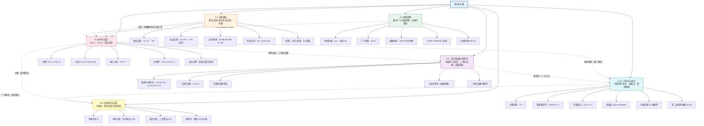

# 第06章 计数 — 章节汇总

> [!abstract] 概览
> 第6章系统介绍了==组合计数==（Combinatorial Counting）的完整理论体系，是离散数学中"计数"思想的核心章节。全章从==基本计数法则==出发（6.1），建立乘法法则、加法法则、容斥原理与除法法则四大基础工具；进而引入==鸽巢原理==（6.2），展示非构造性存在性证明的威力；然后深入==排列与组合==（6.3），建立有序选取与无序选取的公式体系；接着系统研究==二项式系数==（6.4），通过帕斯卡三角形、二项式定理与组合恒等式揭示计数与代数的深层联系；再将基本模型推广到==可重排列/组合==、多重集排列、分配问题与斯特林数（6.5）；最终讨论如何系统化地==生成所有排列与组合==（6.6），完成从"计数"到"枚举"的闭环。全章体现了从"基本法则"到"经典模型"再到"恒等式理论"与"算法实现"的完整知识链条。

---

## 全章知识框架



---

## 各节核心知识点汇总

| 小节 | 核心概念 | 关键公式/定理 | 与前后节的关联 |
|:-----|:---------|:-------------|:---------------|
| 6.1 计数基础 | 乘法法则、加法法则、容斥原理、除法法则、树图 | 乘法：$n_1 \cdot n_2 \cdots n_m$；容斥：$\|A \cup B\| = \|A\| + \|B\| - \|A \cap B\|$；除法：$n/d$ | 全章基石，为后续所有计数提供基本工具；容斥原理预告第8章 |
| 6.2 鸽巢原理 | 基本鸽巢原理、广义鸽巢原理、函数推论、拉姆齐理论 | 基本：$k+1 \to k$ 盒 $\Rightarrow$ $\geq 2$；广义：$\lceil N/k \rceil$；$R(3,3)=6$ | 用乘法/加法法则的结论做存在性论证；Erdős–Szekeres 联系排列理论 |
| 6.3 排列与组合 | $r$-排列、$r$-组合、对称性恒等式、组合证明 | $P(n,r) = \dfrac{n!}{(n-r)!}$；$C(n,r) = \dfrac{n!}{r!(n-r)!}$；$P = C \cdot r!$；$C(n,r)=C(n,n-r)$ | 直接应用 6.1 的乘法法则；$C(n,r)$ 即二项式系数，衔接 6.4 |
| 6.4 二项式系数与恒等式 | 帕斯卡三角形、二项式定理、范德蒙德恒等式、上指标求和、组合证明 | 帕斯卡：$\dbinom{n}{k}=\dbinom{n-1}{k-1}+\dbinom{n-1}{k}$；二项式定理：$(x+y)^n=\sum \dbinom{n}{k}x^{n-k}y^k$；$\sum \dbinom{n}{k}=2^n$；$\sum \dbinom{k}{r}=\dbinom{n+1}{r+1}$ | 深化 6.3 的二项式系数理论；恒等式为 6.5 的广义公式提供基础 |
| 6.5 广义排列与组合 | 可重排列、多重集排列、可重组合、隔板法、分配问题、斯特林数 | 可重排列：$n^r$；多重集：$\dfrac{n!}{n_1!n_2!\cdots}$；可重组合：$\dbinom{n+r-1}{r}$；$S(n,k)=k \cdot S(n-1,k)+S(n-1,k-1)$ | 推广 6.3 的基本模型；隔板法统一可重组合与分配问题；斯特林数联系递推关系（第8章） |
| 6.6 生成排列与组合 | 字典序、排列生成算法（四步）、组合生成算法（三步）、复杂度分析 | 排列生成：找后缀→交换→反转 $O(n)$；组合生成：找可增位→重置 $O(r)$；总时间最优 | 将 6.3/6.5 的计数理论转化为可执行算法；衔接算法设计与复杂度分析 |

---

## 学习脉络

```
计数基础（6.1）— 乘法/加法/减法/除法四大法则，全章的运算基石
  ↓
鸽巢原理（6.2）— 从"数多少"到"证存在"，非构造性证明的威力
  ↓
排列与组合（6.3）— 有序 vs 无序选取，建立 P(n,r) 与 C(n,r) 的公式体系
  ↓
二项式系数与恒等式（6.4）— C(n,k) 的深层性质：帕斯卡三角形、二项式定理、组合证明
  ↓
广义排列与组合（6.5）— 推广到可重复/不可区分/分配等复杂场景，隔板法与斯特林数
  ↓
生成排列与组合（6.6）— 从"计数"到"枚举"，字典序生成算法与最优复杂度
```

**学习建议**：6.1 节是全章的基石——务必透彻理解乘法法则（分步相乘）与加法法则（分类相加）的本质区别，以及容斥原理处理重叠分类的方法，通过密码计数、IP 地址计数等综合应用建立"分步+分类+容斥"的组合思维；6.2 节是思维方式的转变——从"计算具体数量"转向"证明存在性"，核心难点在于如何巧妙地选择"物体"和"盒子"，Erdős–Szekeres 定理和拉姆齐理论是鸽巢原理的巅峰应用；6.3 节是计数理论的核心——$P(n,r)$ 与 $C(n,r)$ 的公式及其关系 $P = C \cdot r!$ 必须烂熟于心，组合证明方法（双重计数与双射）是本节最具洞察力的内容；6.4 节是恒等式理论的宝库——帕斯卡恒等式和二项式定理是二项式系数的两大支柱，范德蒙德恒等式和上指标求和是进阶重点，组合证明与代数证明的对比能加深对恒等式本质的理解；6.5 节是模型体系的完善——隔板法是处理可重组合和分配问题的统一工具，12 种分配模型需要系统记忆，斯特林数的递推关系预告了第 8 章递推关系的内容；6.6 节是理论与实践的桥梁——字典序排列生成算法的四步操作（找后缀、交换、反转）需要手动练习以加深理解，组合生成算法相对简洁，两个算法的最优性证明体现了算法分析的基本方法。

---

## 跨节综合复习题

> [!problem] 综合复习题 1（跨 6.1 / 6.3 / 6.4）
> **题目：** (a) 某公司要从 10 名男工程师和 7 名女工程师中选出一个 5 人项目组，要求至少包含 1 名女工程师。用容斥原理和组合公式计算有多少种选法。
> (b) 证明：$\displaystyle\sum_{k=0}^{n}\binom{n}{k}^2 = \binom{2n}{n}$，分别给出代数证明和组合证明。
> (c) 利用二项式定理求 $(1+x)^{10}$ 展开式中 $x^3$ 的系数，并解释其组合意义。

> [!faq]- 解答
> **(a)** 从 17 人中选 5 人的总方案数为 $\binom{17}{5}$。不包含女工程师（即全部从 10 名男工程师中选）的方案数为 $\binom{10}{5}$。
>
> 由容斥原理（减法法则），至少包含 1 名女工程师的方案数为：
> $$\binom{17}{5} - \binom{10}{5} = \frac{17!}{5! \cdot 12!} - \frac{10!}{5! \cdot 5!} = 6188 - 252 = 5936$$
>
> **(b)** **代数证明**：在范德蒙德恒等式 $\displaystyle\binom{m+n}{r} = \sum_{k=0}^{r}\binom{m}{k}\binom{n}{r-k}$ 中，令 $m = n$，$r = n$：
> $$\binom{2n}{n} = \sum_{k=0}^{n}\binom{n}{k}\binom{n}{n-k} = \sum_{k=0}^{n}\binom{n}{k}^2$$
>
> 最后一步利用了对称性 $\binom{n}{n-k} = \binom{n}{k}$。
>
> **组合证明**：考虑从 $2n$ 个元素中选 $n$ 个的方案数。将 $2n$ 个元素分成两组，每组 $n$ 个。按从第一组中选出的个数 $k$ 分类：从第一组选 $k$ 个（$\binom{n}{k}$ 种），从第二组选 $n-k$ 个（$\binom{n}{n-k} = \binom{n}{k}$ 种），由乘法法则为 $\binom{n}{k}^2$ 种。对所有 $k$ 求和，得 $\sum_{k=0}^{n}\binom{n}{k}^2 = \binom{2n}{n}$。
>
> **(c)** 由二项式定理 $(1+x)^{10} = \sum_{k=0}^{10}\binom{10}{k}x^k$，$x^3$ 的系数为 $\binom{10}{3} = \frac{10 \times 9 \times 8}{3 \times 2 \times 1} = 120$。
>
> **组合意义**：$\binom{10}{3}$ 等于从 10 个元素中无序选取 3 个的方案数，即从 10 个位置中选出 3 个放置 $x$（其余放置 1）的方案数。
>
> $\blacksquare$

> [!problem] 综合复习题 2（跨 6.2 / 6.3 / 6.5）
> **题目：** (a) 证明：在任意 $n+1$ 个不超过 $2n$ 的不同正整数中，必有一个数整除另一个（提示：将每个数写成 $2^k \cdot q$ 的形式，其中 $q$ 为奇数）。
> (b) 从 5 种水果中选 12 个（每种可以选多个），共有多少种选法？用隔板法解释。
> (c) 将单词 SUCCESS 的字母重新排列，有多少种不同的排列方式？其中 S 恰好连续出现的有多少种？

> [!faq]- 解答
> **(a)** 将每个整数写成 $2^k \cdot q$ 的形式，其中 $q$ 为奇数。不超过 $2n$ 的奇正整数有 $n$ 个（$1, 3, 5, \ldots, 2n-1$）。将这 $n$ 个奇数视为 $n$ 个"盒子"，$n+1$ 个整数按其奇数部分 $q$ 放入对应的盒子。
>
> 由鸽巢原理，$n+1$ 个物体放入 $n$ 个盒子，至少有一个盒子包含 $\geq 2$ 个物体。设该盒子中两个数为 $a_i = 2^{k_i} \cdot q$ 和 $a_j = 2^{k_j} \cdot q$（$q$ 相同）。若 $k_i < k_j$，则 $a_i \mid a_j$；若 $k_i > k_j$，则 $a_j \mid a_i$。
>
> **(b)** 这是可重组合问题：$n = 5$ 种水果，选 $r = 12$ 个，不关心顺序。
> $$\binom{5+12-1}{12} = \binom{16}{12} = \binom{16}{4} = \frac{16 \times 15 \times 14 \times 13}{4 \times 3 \times 2 \times 1} = 1820$$
>
> **隔板法解释**：将 12 个相同的球（代表水果）排成一排，用 4 个隔板分成 5 组（代表 5 种水果）。共 $12 + 4 = 16$ 个位置，从中选 4 个放隔板（或选 12 个放球），方案数为 $\binom{16}{4} = 1820$。
>
> **(c)** SUCCESS 共 7 个字母：S(3), U(1), C(2), E(1)。
>
> 总排列数（多重集排列）：
> $$\frac{7!}{3! \cdot 1! \cdot 2! \cdot 1!} = \frac{5040}{6 \times 1 \times 2 \times 1} = 420$$
>
> S 恰好连续出现：将 SSS 视为一个"块"，需排列 5 个对象：块 SSS、U、C、C、E。其中 C 有 2 个相同：
> $$\frac{5!}{2!} = \frac{120}{2} = 60$$
>
> $\blacksquare$

> [!problem] 综合复习题 3（跨 6.1 / 6.4 / 6.5 / 6.6）
> **题目：** (a) 某系统密码由 6 个字符组成，每个字符可以是 26 个小写字母或 10 个数字，且必须包含至少一个字母和至少一个数字。用容斥原理计算可能的密码总数。
> (b) 将 8 个相同的糖果分给 3 个不同的孩子，允许有孩子分不到糖果。列出所有分配方案对应的隔板法表示，并验证总数等于 $\binom{8+3-1}{8}$。
> (c) 使用字典序排列生成算法，求排列 $3\ 5\ 4\ 2\ 1$ 的下一个排列。写出完整的四步过程。

> [!faq]- 解答
> **(a)** 每个字符有 $26 + 10 = 36$ 种选择。6 个字符的总字符串数为 $36^6$。
>
> 纯字母字符串数：$26^6$。纯数字字符串数：$10^6$。
>
> 由容斥原理，至少包含一个字母且至少包含一个数字的密码数为：
> $$36^6 - 26^6 - 10^6$$
>
> 计算：$36^6 = 2{,}176{,}782{,}336$，$26^6 = 308{,}915{,}776$，$10^6 = 1{,}000{,}000$。
>
> $$36^6 - 26^6 - 10^6 = 2{,}176{,}782{,}336 - 308{,}915{,}776 - 1{,}000{,}000 = 1{,}866{,}866{,}560$$
>
> **(b)** 将 8 个相同的糖果（$*$）用 2 个隔板（$|$）分成 3 组，对应 3 个孩子。共 $8 + 2 = 10$ 个位置，选 2 个放隔板：$\binom{10}{2} = 45$。
>
> 验证 $\binom{8+3-1}{8} = \binom{10}{8} = \binom{10}{2} = 45$，一致。
>
> 部分分配方案示例（$a, b, c$ 分别表示三个孩子分到的糖果数）：
> - $**|******|**$ $\to$ $(2, 6, 0)$
> - $***||*****$ $\to$ $(3, 0, 5)$
> - $|********|$ $\to$ $(0, 8, 0)$
> - $********||$ $\to$ $(8, 0, 0)$
> - $***|***|**$ $\to$ $(3, 3, 2)$
>
> （共 45 种，此处不全部列出。）
>
> **(c)** 给定排列 $3\ 5\ 4\ 2\ 1$。
>
> **步骤 1**：从右向左找 $a_i < a_{i+1}$：
> - $i=4$：$a_4 = 2$，$a_5 = 1$，$2 < 1$？不满足
> - $i=3$：$a_3 = 4$，$a_4 = 2$，$4 < 2$？不满足
> - $i=2$：$a_2 = 5$，$a_3 = 4$，$5 < 4$？不满足
> - $i=1$：$a_1 = 3$，$a_2 = 5$，$3 < 5$？满足！$i = 1$
>
> 最长非递增后缀为 $5\ 4\ 2\ 1$。
>
> **步骤 2**：从右向左找 $a_j > a_1 = 3$：
> - $j=5$：$a_5 = 1 < 3$，不满足
> - $j=4$：$a_4 = 2 < 3$，不满足
> - $j=3$：$a_3 = 4 > 3$，满足！$j = 3$
>
> **步骤 3**：交换 $a_1$ 和 $a_3$，得到 $\mathbf{4}\ 5\ \mathbf{3}\ 2\ 1$。
>
> **步骤 4**：将位置 2 到 5 的子序列 $5\ 3\ 2\ 1$ 反转为 $1\ 2\ 3\ 5$，得到最终结果：$4\ 1\ 2\ 3\ 5$。
>
> $\blacksquare$

---

## 笔记索引

| 小节 | 笔记链接 | 核心主题 |
|:-----|:---------|:---------|
| 6.1 | [[6.1 计数基础]] | 乘法法则、加法法则、容斥原理、除法法则、树图、密码/位串/函数计数 |
| 6.2 | [[6.2 鸽巢原理]] | 基本鸽巢原理、广义鸽巢原理、函数推论、Erdős–Szekeres 定理、拉姆齐数 |
| 6.3 | [[6.3 排列与组合]] | $r$-排列 $P(n,r)$、$r$-组合 $C(n,r)$、对称性恒等式、组合证明方法 |
| 6.4 | [[6.4 二项式系数与恒等式]] | 帕斯卡三角形、二项式定理、范德蒙德恒等式、上指标求和、二项式系数单峰性 |
| 6.5 | [[6.5 广义排列与组合]] | 可重排列 $n^r$、多重集排列、可重组合 $\binom{n+r-1}{r}$、隔板法、分配问题、斯特林数 |
| 6.6 | [[6.6 生成排列与组合]] | 字典序、排列生成算法（四步 $O(n)$）、组合生成算法（三步 $O(r)$）、最优性分析 |

#学习/离散数学/计数
