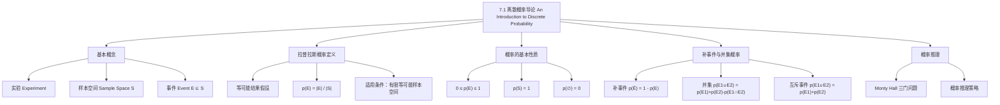

**相关笔记：** [[6.6 生成排列与组合]] | [[7.2 概率论]]

> [!abstract] 概览
> 本节系统介绍了==离散概率==的基本概念，以==拉普拉斯等可能概率==定义为核心，建立了概率论的数学基础。主要内容包括==样本空间==（sample space）、==事件==（event）的定义，概率的公理化性质，以及==补事件==与==事件并集==的概率计算公式。
>
> - ==样本空间== $S$ 是实验所有可能结果的集合，==事件== $E$ 是样本空间的子集
> - ==拉普拉斯概率== $p(E) = \dfrac{|E|}{|S|}$，要求所有结果等可能
> - 概率的基本性质：$0 \leq p(E) \leq 1$，$p(S) = 1$
> - ==补事件公式== $p(\overline{E}) = 1 - p(E)$，适用于"至少一个"类问题
> - ==容斥原理== $p(E_1 \cup E_2) = p(E_1) + p(E_2) - p(E_1 \cap E_2)$
> - ==互斥事件==（disjoint events）满足 $p(E_1 \cup E_2) = p(E_1) + p(E_2)$

---

## 一、知识结构总览

---

## 二、核心思想

> [!tip] 核心思想
> 本节的核心思想是==拉普拉斯的经典概率定义==：在有限且所有结果等可能的样本空间中，事件的概率等于该事件包含的结果数与样本空间总结果数之比 $p(E) = |E|/|S|$。这一定义将概率问题转化为==计数问题==，使得我们可以利用第6章学过的排列、组合等计数技术来求解概率。同时，补事件公式和容斥原理为处理复杂事件提供了有力的工具——当直接计算某事件的概率困难时，转而计算其补事件的概率往往更加简便。

### 1. 基本概念：实验、样本空间与事件

> [!def] 实验（Experiment）
> ==实验==是一种过程，它产生给定的一组可能结果中的一个。例如掷骰子、抛硬币、从牌堆中抽牌等都是实验。
>
> - 每次实验恰好产生一个结果
> - 结果的集合是已知的

> [!def] 样本空间（Sample Space）
> ==样本空间== $S$ 是实验所有可能结果的集合。
>
> - 有限样本空间：$S = \{s_1, s_2, \ldots, s_n\}$
> - 例如掷一枚公平骰子：$S = \{1, 2, 3, 4, 5, 6\}$

> [!def] 事件（Event）
> ==事件== $E$ 是样本空间 $S$ 的一个子集，即 $E \subseteq S$。
>
> - 事件由实验结果的一个或多个"有利结果"组成
> - 例如"掷骰子出现偶数"：$E = \{2, 4, 6\}$

### 2. 拉普拉斯概率定义

> [!def] 概率的拉普拉斯定义（Definition 1）
> 设 $S$ 是一个有限非空的等可能结果样本空间，$E$ 是一个事件（即 $S$ 的子集），则事件 $E$ 的概率为
>
> $$p(E) = \frac{|E|}{|S|}$$
>
> - $|E|$ 是事件 $E$ 中包含的结果数（有利结果数）
> - $|S|$ 是样本空间中的总结果数
> - ==关键前提==：所有结果是等可能的（equally likely）

> [!example] 掷骰子出现奇数的概率
> 掷一枚公平骰子，出现奇数的概率是多少？
>
> 样本空间 $S = \{1, 2, 3, 4, 5, 6\}$，$|S| = 6$
>
> 事件 $E = \{1, 3, 5\}$（奇数），$|E| = 3$
>
> $$p(E) = \frac{|E|}{|S|} = \frac{3}{6} = \frac{1}{2}$$

> [!example] 掷两枚骰子之和为7的概率
> 掷两枚骰子，点数之和为7的概率是多少？
>
> 样本空间：由乘法规则，$|S| = 6 \times 6 = 36$（有序对）
>
> 有利结果：$(1,6), (2,5), (3,4), (4,3), (5,2), (6,1)$，共 $|E| = 6$ 个
>
> $$p(E) = \frac{6}{36} = \frac{1}{6}$$

> [!example] 彩票中奖概率
> 从40个正整数中选6个数字，全部匹配的概率是多少？
>
> 只有一种中奖组合。总选择数为 $\binom{40}{6} = \frac{40!}{34! \cdot 6!} = 3{,}838{,}380$
>
> $$p(\text{中奖}) = \frac{1}{3{,}838{,}380} \approx 0.000{,}000{,}26$$

### 3. 概率的基本性质

> [!thm] 概率的基本性质
> 设 $E$ 是有限样本空间 $S$ 中的事件，则：
>
> 1. ==非负性==：$0 \leq p(E) \leq 1$
> 2. ==规范性==：$p(S) = 1$（必然事件的概率为1）
> 3. ==空集概率==：$p(\emptyset) = 0$（不可能事件的概率为0）
>
> **证明**：因为 $E \subseteq S$，所以 $0 \leq |E| \leq |S|$，因此
>
> $$0 \leq p(E) = \frac{|E|}{|S|} \leq 1$$
>
> 当 $E = S$ 时，$p(S) = |S|/|S| = 1$。
>
> 当 $E = \emptyset$ 时，$p(\emptyset) = 0/|S| = 0$。

### 4. 补事件的概率

> [!thm] 补事件概率公式（Theorem 1）
> 设 $E$ 是样本空间 $S$ 中的事件，则 $\overline{E} = S - E$ 的概率为
>
> $$p(\overline{E}) = 1 - p(E)$$
>
> **证明**：因为 $\overline{E} = S - E$，所以 $|\overline{E}| = |S| - |E|$，因此
>
> $$p(\overline{E}) = \frac{|S| - |E|}{|S|} = 1 - \frac{|E|}{|S|} = 1 - p(E)$$

> [!example] 位串中至少有一个0的概率
> 随机生成一个长度为10的位串，其中至少有一个0的概率是多少？
>
> 直接计算"至少一个0"比较复杂，转而计算其补事件"全部为1"：
>
> $$p(\text{全为1}) = \frac{1}{2^{10}} = \frac{1}{1024}$$
>
> $$p(\text{至少一个0}) = 1 - \frac{1}{1024} = \frac{1023}{1024}$$

### 5. 事件并集的概率

> [!thm] 事件并集的概率公式（Theorem 2）
> 设 $E_1$ 和 $E_2$ 是样本空间 $S$ 中的事件，则
>
> $$p(E_1 \cup E_2) = p(E_1) + p(E_2) - p(E_1 \cap E_2)$$
>
> **证明**：利用第2章的集合计数公式：
>
> $$|E_1 \cup E_2| = |E_1| + |E_2| - |E_1 \cap E_2|$$
>
> 两边同除以 $|S|$：
>
> $$p(E_1 \cup E_2) = \frac{|E_1 \cup E_2|}{|S|} = \frac{|E_1|}{|S|} + \frac{|E_2|}{|S|} - \frac{|E_1 \cap E_2|}{|S|} = p(E_1) + p(E_2) - p(E_1 \cap E_2)$$

> [!def] 互斥事件（Mutually Exclusive / Disjoint Events）
> 若 $E_1 \cap E_2 = \emptyset$，则称 $E_1$ 和 $E_2$ 为==互斥事件==。此时
>
> $$p(E_1 \cup E_2) = p(E_1) + p(E_2)$$

> [!example] 能被2或5整除的概率
> 从不超过100的正整数中随机选一个，能被2或5整除的概率是多少？
>
> 设 $E_1$ = "能被2整除"，$E_2$ = "能被5整除"
>
> $|E_1| = 50$，$|E_2| = 20$，$|E_1 \cap E_2|$ = "能被10整除" = 10
>
> $$p(E_1 \cup E_2) = \frac{50}{100} + \frac{20}{100} - \frac{10}{100} = \frac{3}{5}$$

### 6. 概率推理：Monty Hall 三门问题

> [!example] Monty Hall 三门问题
> 你参加一个游戏节目，有三扇门，其中一扇后面是大奖。你选择一扇门后，主持人（知道每扇门后面是什么）打开另一扇后面没有奖的门，然后问你是否要换门。你应该换吗？
>
> **分析**：
> - 不换门赢得概率 = $1/3$（初始选对的概率）
> - 换门赢得概率 = $2/3$（初始选错的概率，此时换门一定赢）
>
> **结论**：==应该换门==，换门使获胜概率翻倍。
>
> 直觉陷阱：很多人认为剩下两扇门概率各为 $1/2$，但主持人的行为提供了额外信息——他总是打开没有奖的门，这使得未打开的另一扇门集中了初始未选中的 $2/3$ 概率。

---

## 三、补充理解与易混淆点

### 补充理解

> [!info] 补充1：概率论的历史起源
> 概率论的历史可以追溯到1526年，意大利数学家、医生兼赌徒 Girolamo Cardano 在其著作《Liber de Ludo Aleae》（游戏之书）中首次系统地研究了概率问题（该书直到1663年才出版）。17世纪，法国数学家 Blaise Pascal 分析了掷骰子赌博的赔率问题。18世纪，法国数学家 Pierre-Simon Laplace 将概率定义为有利结果数与总结果数之比，即本节所学的拉普拉斯定义。
>
> 概率论最初是为了研究赌博而发明的，但现在已广泛应用于遗传学、计算机科学（算法复杂度分析、概率算法）、通信、金融等众多领域。在计算机科学中，概率论被用于分析算法的平均情况复杂度，设计概率算法解决确定性算法难以处理的问题，以及通过==概率方法==（probabilistic method）证明组合对象的存在性（由 Paul Erdős 和 Alfréd Rényi 引入）。
>
> - [Khan Academy: Probability basics](https://www.khanacademy.org/math/statistics-probability/probability-library) -- 概率基础交互式教程
> - [3Blue1Brown: Probability visualized](https://www.3blue1brown.com/topics/probability) -- 概率可视化讲解
>
> 来源：Hacking, I. (2006). *The Emergence of Probability* (2nd ed.). Cambridge University Press.
> 来源：Rosen, K. H. (2019). *Discrete Mathematics and Its Applications* (8th ed.), McGraw-Hill, Section 7.1.

> [!info] 补充2：概率与计数的深层联系
> 拉普拉斯概率定义 $p(E) = |E|/|S|$ 揭示了概率论与计数理论的深刻联系。计算概率本质上就是计数——计算有利结果数和总结果数。因此，第6章学过的排列、组合、容斥原理等计数技术是求解概率问题的核心工具。
>
> 常见的计数-概率对应关系：
> - 无序选取（不放回）$\to$ 组合数 $\binom{n}{k}$
> - 有序选取（不放回）$\to$ 排列数 $P(n,k)$
> - 有序选取（有放回）$\to$ 乘法规则 $n^k$
> - "至少一个"问题 $\to$ 补事件 $1 - p(\text{一个都没有})$
> - "或"问题 $\to$ 容斥原理
>
> - [Brilliant: Probability and Combinatorics](https://brilliant.org/wiki/probability/) -- 概率与组合数学专题
>
> 来源：Rosen, K. H. (2019). *Discrete Mathematics and Its Applications* (8th ed.), McGraw-Hill, Section 7.1.
> 来源：Ross, S. M. (2019). *A First Course in Probability* (10th ed.), Pearson, Chapter 2.

### 易混淆点

> [!warning] 误区：混淆"等可能"与"等数量"
> - ❌ 认为只要列出了所有结果，就可以直接用 $|E|/|S|$ 计算概率
> - ✅ 拉普拉斯定义的==关键前提==是所有结果必须==等可能==
> - 例如：掷两枚骰子，和为2与和为7的结果数都是1个（(1,1) vs (1,6)），但它们的概率不同——因为样本空间中的36个有序对才是等可能的基本结果，而非"和的值"
>
> 正确做法：始终以最细粒度的等可能结果作为样本空间的基本元素

> [!warning] 误区：互斥事件与独立事件
> - ❌ 认为"互斥"和"独立"是同一回事
> - ✅ 这是两个完全不同的概念（独立事件将在[[7.2 概率论]]中学习）：
>   - ==互斥==（disjoint）：$E_1 \cap E_2 = \emptyset$，两个事件不能同时发生
>   - ==独立==（independent）：$p(E_1 \cap E_2) = p(E_1) \cdot p(E_2)$，一个事件的发生不影响另一个事件发生的概率
> - ⚠️ 事实上，如果两个概率非零的事件互斥，它们一定不独立（因为互斥意味着 $p(E_1 \cap E_2) = 0 \neq p(E_1) \cdot p(E_2)$）

> [!warning] 误区：Monty Hall 问题的直觉陷阱
> - ❌ 认为剩下两扇门概率各为 $1/2$，换不换无所谓
> - ✅ 主持人的行为不是随机的——他==有目的地==排除了一个错误选项，这提供了信息
> - 关键区分：如果主持人随机打开一扇门（可能意外打开有奖的门），则概率确实各为 $1/2$；但主持人==总是打开没有奖的门==，这使得换门概率变为 $2/3$

---

## 四、习题精选

> [!todo] 习题概览
> | 题号范围 | 核心考点 | 难度 |
> |---------|---------|------|
> | 1-6 | 基本概率计算（骰子、硬币、扑克） | ⭐ |
> | 7-14 | 位串概率、补事件应用 | ⭐⭐ |
> | 15-22 | 扑克牌手型概率（两对、同花、顺子等） | ⭐⭐⭐ |
> | 23-27 | 整除性概率、彩票概率 | ⭐⭐ |
> | 28-37 | 互斥事件与独立性判断 | ⭐⭐⭐ |
> | 38-45 | Monty Hall 变体、复合概率 | ⭐⭐⭐⭐ |

### 题1：基本概率计算

> [!problem] 题目
> 从一副标准52张扑克牌中随机抽取一张，抽到A（Ace）的概率是多少？

> [!faq]- 解答
> 样本空间 $S$ 为52张牌，$|S| = 52$。
>
> 事件 $E$ = "抽到A"，一副牌中有4张A（黑桃、红心、方块、梅花各一张），$|E| = 4$。
>
> $$p(E) = \frac{|E|}{|S|} = \frac{4}{52} = \frac{1}{13}$$
>
> $\blacksquare$

### 题2：补事件的应用

> [!problem] 题目
> 随机生成一个长度为10的位串，其中至少包含一个0的概率是多少？

> [!faq]- 解答
> 样本空间 $S$ 为所有长度为10的位串，$|S| = 2^{10} = 1024$。
>
> 直接计算"至少一个0"比较复杂，利用补事件公式：
>
> $\overline{E}$ = "全部为1"，$|\overline{E}| = 1$（即位串 1111111111）
>
> $$p(\overline{E}) = \frac{1}{1024}$$
>
> $$p(E) = 1 - p(\overline{E}) = 1 - \frac{1}{1024} = \frac{1023}{1024}$$
>
> $\blacksquare$

### 题3：事件并集的概率

> [!problem] 题目
> 从一副标准52张扑克牌中随机抽取一张，抽到A或红心（Heart）的概率是多少？

> [!faq]- 解答
> 设 $E_1$ = "抽到A"，$E_2$ = "抽到红心"。
>
> $|E_1| = 4$（4张A），$|E_2| = 13$（13张红心），$|E_1 \cap E_2| = 1$（红心A）
>
> 由容斥原理：
>
> $$p(E_1 \cup E_2) = \frac{|E_1|}{|S|} + \frac{|E_2|}{|S|} - \frac{|E_1 \cap E_2|}{|S|} = \frac{4}{52} + \frac{13}{52} - \frac{1}{52} = \frac{16}{52} = \frac{4}{13}$$
>
> $\blacksquare$

### 题4：位串概率

> [!problem] 题目
> 随机生成一个长度为8的位串，其中恰好包含5个1和3个0的概率是多少？

> [!faq]- 解答
> 样本空间 $|S| = 2^8 = 256$。
>
> 事件 $E$ = "恰好5个1和3个0"，即从8个位置中选5个放1，其余放0。
>
> $$|E| = \binom{8}{5} = \binom{8}{3} = 56$$
>
> $$p(E) = \frac{56}{256} = \frac{7}{32}$$
>
> $\blacksquare$

### 题5：扑克牌概率

> [!problem] 题目
> 从一副标准52张扑克牌中随机抽取5张（一手扑克牌），恰好包含"四条"（four of a kind，即四张相同面值加一张其他牌）的概率是多少？

> [!faq]- 解答
> 样本空间：从52张牌中选5张，$|S| = \binom{52}{5} = 2{,}598{,}960$。
>
> 计算"四条"的方法数：
> - 第一步：从13种面值中选1种作为四条，$\binom{13}{1} = 13$ 种
> - 第二步：从该面值的4张牌中选4张，$\binom{4}{4} = 1$ 种
> - 第三步：从剩余48张牌中选1张作为第五张，$\binom{48}{1} = 48$ 种
>
> 由乘法规则：$|E| = 13 \times 1 \times 48 = 624$
>
> $$p(E) = \frac{624}{2{,}598{,}960} \approx 0.00024$$
>
> $\blacksquare$

> [!tip] 解题思路提示
> 概率计算的解题方法论：
> 1. **明确样本空间**：确定实验的所有等可能结果，计算 $|S|$
> 2. **确定事件**：明确题目要求的事件 $E$，计算 $|E|$
> 3. **善用计数工具**：排列、组合、乘法规则、加法规则、容斥原理
> 4. **补事件策略**：当"至少一个"类问题直接计算复杂时，转而计算补事件
> 5. **容斥原理**：当事件可以分解为"或"的关系时，注意减去交集部分
> 6. **分步计数**：复杂事件用乘法规则分步计算，注意是否有序

---

## 五、视频学习指南

> [!info] 视频资源
> | 资源 | 链接 | 对应内容 | 备注 |
> |:-----|:-----|:---------|:-----|
> | Khan Academy: Basic probability | [链接](https://www.khanacademy.org/math/statistics-probability/probability-library) | 概率基本概念、样本空间、事件 | 英文，交互式练习 |
> | 3Blue1Brown: Probability | [链接](https://www.3blue1brown.com/topics/probability) | 概率直觉与可视化 | 英文，高质量动画 |
> | Brilliant: Probability | [链接](https://brilliant.org/wiki/probability/) | 概率与组合数学 | 英文，互动课程 |
> | MIT 6.042J Lecture 17 | [链接](https://www.youtube.com/watch?v=KbMh2VVuQDk) | 离散概率基础 | 英文，MIT开放课程 |

---

## 六、教材原文

> [!quote] 教材原文
> "Probability theory dates back to 1526 when the Italian mathematician, physician, and gambler Girolamo Cardano wrote the first known systematic treatment of the subject in his book Liber de Ludo Aleae (Book on Games of Chance)."
>
> "In the eighteenth century, the French mathematician Laplace, who also studied gambling, defined the probability of an event as the number of successful outcomes divided by the number of possible outcomes."
>
> "The theory of probability was first developed more than 300 years ago, when certain gambling games were analyzed. Although probability theory was originally invented to study gambling, it now plays an essential role in a wide variety of disciplines."

---

## 参见 Wiki

- [[离散数学/concepts/概率]] -- 概率的定义与基本性质
- [[离散数学/concepts/样本空间]] -- 样本空间的定义与构造
- [[离散数学/concepts/事件]] -- 事件的概念与运算
- [[离散数学/concepts/概率|拉普拉斯概率]] -- 等可能概率的经典定义
- [[离散数学/concepts/事件|互斥事件]] -- 互斥事件的定义与性质
- [[离散数学/concepts/容斥原理|容斥原理]] -- 事件并集的概率计算

#学习/离散数学/离散概率
