**相关笔记：** [[7.1 离散概率导论]] | [[7.3 贝叶斯定理]]

> [!abstract] 概览
> 本节在7.1节的基础上，将概率论从等可能结果推广到更一般的==概率赋值==框架，并引入了条件概率、独立性、伯努利试验与二项分布等核心概念，最后介绍了蒙特卡洛算法和概率方法等应用。
>
> - ==概率赋值==：$0 \leq p(s) \leq 1$，$\displaystyle\sum_{s \in S} p(s) = 1$，推广了拉普拉斯定义
> - ==条件概率== $p(E|F) = \dfrac{p(E \cap F)}{p(F)}$，已知 $F$ 发生时 $E$ 的概率
> - ==独立性== $p(E \cap F) = p(E) \cdot p(F)$，两事件互不影响
> - ==乘法规则== $p(E \cap F) = p(E) \cdot p(F|E) = p(F) \cdot p(E|F)$
> - ==伯努利试验==（Bernoulli trial）：只有成功/失败两种结果的独立重复试验
> - ==二项分布== $b(k; n, p) = \binom{n}{k} p^k q^{n-k}$，$n$ 次试验中恰好 $k$ 次成功的概率
> - ==蒙特卡洛算法==：利用随机性加速计算，以可控的错误概率换取效率

---

## 一、知识结构总览

```mermaid
graph TB
    A["7.2 概率论 Probability Theory"] --> B["概率赋值"]
    A --> C["条件概率"]
    A --> D["独立性"]
    A --> E["伯努利试验与二项分布"]
    A --> F["随机变量"]
    A --> G["生日问题"]
    A --> H["蒙特卡洛算法"]
    A --> I["概率方法"]

    B --> B1["概率分布 p(s)"]
    B --> B2["条件: 0≤p(s)≤1, Σp(s)=1"]
    B --> B3["均匀分布 Uniform Distribution"]
    B --> B4["事件概率 p(E) = Σp(s)"]

    C --> C1["定义: p(E|F) = p(E∩F)/p(F)"]
    C --> C2["乘法规则"]
    C --> C3["贝叶斯公式预览"]

    D --> D1["定义: p(E∩F) = p(E)·p(F)"]
    D --> D2["两两独立 vs 相互独立"]
    D --> D3["独立性的验证方法"]

    E --> E1["伯努利试验定义"]
    E --> E2["二项分布 b(k;n,p)"]
    E --> E3["二项定理验证 Σ=1"]

    F --> F1["随机变量定义"]
    F --> F2["随机变量的分布"]

    G --> G1["生日悖论"]
    G --> G2["哈希碰撞概率"]

    H --> H1["决策问题的Monte Carlo"]
    H --> H2["错误概率 (1-p)^n"]

    I --> I1["概率方法"]
    I --> I2["Ramsey数下界"]
```

---

## 二、核心思想

> [!tip] 核心思想
> 本节的核心思想是==从等可能概率到一般概率==的推广，以及==条件概率==这一革命性概念的引入。条件概率 $p(E|F)$ 回答的核心问题是："在已知事件 $F$ 已经发生的前提下，事件 $E$ 发生的概率是多少？"这一概念衍生出独立性、乘法规则和贝叶斯定理等重要工具。同时，==伯努利试验与二项分布==为"重复独立实验"提供了精确的数学模型，使得我们可以计算如"抛10次硬币恰好7次正面"这类问题的概率。最后，==蒙特卡洛算法==展示了概率论在计算机科学中的实际威力——通过引入可控的随机性，我们可以用常数时间解决原本需要线性甚至更高时间复杂度的问题。

### 1. 概率赋值（Assigning Probabilities）

> [!def] 概率分布（Definition: Probability Distribution）
> 设 $S$ 是一个具有有限或可数个结果的样本空间。对每个结果 $s \in S$，赋一个概率 $p(s)$，满足：
>
> **(i)** $0 \leq p(s) \leq 1$ 对所有 $s \in S$
>
> **(ii)** $\displaystyle\sum_{s \in S} p(s) = 1$
>
> 函数 $p: S \to [0, 1]$ 称为==概率分布==（probability distribution）。
>
> - 条件 (i) 保证每个结果的概率非负且不超过1
> - 条件 (ii) 保证所有结果的概率之和为1（即实验一定会产生某个结果）

> [!def] 均匀分布（Definition 1）
> 设 $S$ 是一个有 $n$ 个元素的集合。==均匀分布==将概率 $1/n$ 赋给 $S$ 中的每个元素。
>
> - 均匀分布是拉普拉斯定义的推广形式
> - 当所有结果等可能时，使用均匀分布

> [!def] 事件概率的一般定义（Definition 2）
> 事件 $E$ 的概率是 $E$ 中所有结果的概率之和：
>
> $$p(E) = \sum_{s \in E} p(s)$$
>
> - 当使用均匀分布时，此定义退化为拉普拉斯定义 $p(E) = |E|/|S|$

> [!example] 有偏硬币的概率赋值
> 一枚硬币正面出现的概率是反面的两倍，如何赋值？
>
> 设 $p(H) = 2p(T)$，且 $p(H) + p(T) = 1$
>
> $$2p(T) + p(T) = 3p(T) = 1 \implies p(T) = \frac{1}{3}, \quad p(H) = \frac{2}{3}$$

> [!example] 有偏骰子的概率计算
> 一枚骰子使得3出现的概率是其他数字的两倍，其他数字等可能。求出现奇数的概率。
>
> 设 $p(1) = p(2) = p(4) = p(5) = p(6) = x$，$p(3) = 2x$
>
> $$5x + 2x = 7x = 1 \implies x = \frac{1}{7}$$
>
> 奇数事件 $E = \{1, 3, 5\}$：
>
> $$p(E) = p(1) + p(3) + p(5) = \frac{1}{7} + \frac{2}{7} + \frac{1}{7} = \frac{4}{7}$$

### 2. 条件概率（Conditional Probability）

> [!def] 条件概率（Definition 3）
> 设 $E$ 和 $F$ 是事件且 $p(F) > 0$。==条件概率== $p(E|F)$（在 $F$ 发生的条件下 $E$ 的概率）定义为
>
> $$p(E|F) = \frac{p(E \cap F)}{p(F)}$$
>
> - 直觉含义：将 $F$ 作为新的样本空间，只考虑 $F$ 中也属于 $E$ 的结果
> - $p(E|F)$ 度量的是 $F$ 发生后，$E$ 发生的"相对可能性"

> [!example] 位串的条件概率
> 随机生成长度为4的等可能位串，已知第一位是0，求至少包含两个连续0的概率。
>
> 设 $E$ = "至少两个连续0"，$F$ = "第一位是0"
>
> $E \cap F = \{0000, 0001, 0010, 0011, 0100\}$，$|E \cap F| = 5$
>
> $F = \{0xxx\}$，$|F| = 8$
>
> $$p(E|F) = \frac{p(E \cap F)}{p(F)} = \frac{5/16}{8/16} = \frac{5}{8}$$

> [!example] 两个孩子的家庭
> 已知一个有两个孩子的家庭至少有一个男孩，求两个都是男孩的概率。
>
> 设 $E$ = "两个都是男孩" = $\{BB\}$，$F$ = "至少一个男孩" = $\{BB, BG, GB\}$
>
> $E \cap F = \{BB\}$，$p(F) = 3/4$，$p(E \cap F) = 1/4$
>
> $$p(E|F) = \frac{1/4}{3/4} = \frac{1}{3}$$
>
> 注意：答案不是 $1/2$！因为 $\{BG, GB\}$ 也是"至少一个男孩"的情况。

### 3. 独立性（Independence）

> [!def] 独立事件（Definition 4）
> 事件 $E$ 和 $F$ 是==独立的==（independent）当且仅当
>
> $$p(E \cap F) = p(E) \cdot p(F)$$
>
> - 等价条件：$p(E|F) = p(E)$（$F$ 的发生不改变 $E$ 的概率）
> - 独立意味着一个事件的发生不提供关于另一个事件的任何信息

> [!example] 验证独立性
> 随机生成长度为4的等可能位串。$E$ = "以1开头"，$F$ = "包含偶数个1"。$E$ 和 $F$ 是否独立？
>
> $p(E) = 8/16 = 1/2$，$p(F) = 8/16 = 1/2$
>
> $E \cap F = \{1001, 1010, 1100, 1111\}$，$p(E \cap F) = 4/16 = 1/4$
>
> $$p(E) \cdot p(F) = \frac{1}{2} \cdot \frac{1}{2} = \frac{1}{4} = p(E \cap F)$$
>
> 因此 $E$ 和 $F$ 是独立的。

> [!example] 不独立的例子
> 两个孩子的家庭：$E$ = "两个都是男孩"，$F$ = "至少一个男孩"。
>
> $p(E) = 1/4$，$p(F) = 3/4$，$p(E \cap F) = 1/4$
>
> $$p(E) \cdot p(F) = \frac{1}{4} \cdot \frac{3}{4} = \frac{3}{16} \neq \frac{1}{4} = p(E \cap F)$$
>
> 因此 $E$ 和 $F$ 不独立。知道"至少一个男孩"确实改变了"两个都是男孩"的概率。

> [!def] 两两独立与相互独立（Definition 5）
> 事件 $E_1, E_2, \ldots, E_n$ 是==两两独立==的（pairwise independent），当且仅当对所有 $1 \leq i < j \leq n$，有 $p(E_i \cap E_j) = p(E_i) \cdot p(E_j)$。
>
> 事件 $E_1, E_2, \ldots, E_n$ 是==相互独立==的（mutually independent），当且仅当对所有子集 $\{i_1, i_2, \ldots, i_m\} \subseteq \{1, 2, \ldots, n\}$（$m \geq 2$），有
>
> $$p(E_{i_1} \cap E_{i_2} \cap \cdots \cap E_{i_m}) = p(E_{i_1}) \cdot p(E_{i_2}) \cdots p(E_{i_m})$$
>
> - 相互独立蕴含两两独立，但反之不成立
> - 大多数定理需要相互独立的假设

### 4. 乘法规则（Multiplication Rule）

> [!thm] 乘法规则
> 设 $E$ 和 $F$ 是事件，则
>
> $$p(E \cap F) = p(F) \cdot p(E|F) = p(E) \cdot p(F|E)$$
>
> **推导**：由条件概率的定义 $p(E|F) = p(E \cap F)/p(F)$，两边乘以 $p(F)$ 即得。
>
> - 乘法规则是条件概率定义的直接推论
> - 可推广到多个事件：$p(E_1 \cap E_2 \cap \cdots \cap E_n) = p(E_1) \cdot p(E_2|E_1) \cdots p(E_n|E_1 \cap \cdots \cap E_{n-1})$

### 5. 伯努利试验与二项分布（Bernoulli Trials and Binomial Distribution）

> [!def] 伯努利试验（Bernoulli Trial）
> ==伯努利试验==是一种只有两种可能结果的实验：
> - ==成功==（success），概率为 $p$
> - ==失败==（failure），概率为 $q = 1 - p$
>
> 多次独立重复的伯努利试验称为==独立伯努利试验==。
>
> 以 James Bernoulli（1654-1705）命名，他在《Ars Conjectandi》中系统研究了此类问题。

> [!thm] 二项分布定理（Theorem 2）
> 在 $n$ 次独立伯努利试验中，成功概率为 $p$，失败概率为 $q = 1 - p$，恰好成功 $k$ 次的概率为
>
> $$b(k; n, p) = \binom{n}{k} p^k q^{n-k}$$
>
> **证明**：
> 1. 每个由 $k$ 个成功和 $n-k$ 个失败组成的特定结果序列，由于试验独立，其概率为 $p^k q^{n-k}$
> 2. 在 $n$ 次试验中选择 $k$ 次成功位置的方式数为 $\binom{n}{k}$
> 3. 由加法规则，总概率为 $\binom{n}{k} p^k q^{n-k}$
>
> **验证**：$\displaystyle\sum_{k=0}^{n} \binom{n}{k} p^k q^{n-k} = (p + q)^n = 1^n = 1$（二项定理）

> [!example] 有偏硬币的二项分布
> 一枚硬币正面概率为 $2/3$，抛7次恰好出现4次正面的概率？
>
> $$b(4; 7, 2/3) = \binom{7}{4} \left(\frac{2}{3}\right)^4 \left(\frac{1}{3}\right)^3 = 35 \cdot \frac{16}{81} \cdot \frac{1}{27} = \frac{560}{2187}$$

> [!example] 位串生成的二项分布
> 生成0的概率为0.9，生成1的概率为0.1，各位独立。生成10位中恰好8个0的概率？
>
> $$b(8; 10, 0.9) = \binom{10}{8} (0.9)^8 (0.1)^2 = 45 \times 0.43046721 \times 0.01 \approx 0.1937$$

### 6. 随机变量（Random Variables）

> [!def] 随机变量（Definition 6）
> ==随机变量==是从样本空间到实数集的函数，即它为每个可能的结果赋予一个实数值。
>
> - 注意：随机变量是一个==函数==，既不是"变量"，也不是"随机的"
> - 名称由来：意大利数学家 F. P. Cantelli 于1916年引入

> [!example] 掷骰子的随机变量
> 掷一枚骰子三次，设 $X(t)$ 为正面出现的次数：
>
> $X(HHH) = 3$，$X(HHT) = X(HTH) = X(THH) = 2$，$X(TTH) = X(THT) = X(HTT) = 1$，$X(TTT) = 0$

> [!def] 随机变量的分布（Definition 7）
> 随机变量 $X$ 在样本空间 $S$ 上的==分布==是所有值对 $(r, p(X = r))$ 的集合，其中 $r \in X(S)$。

### 7. 生日问题（The Birthday Problem）

> [!example] 生日悖论
> 一个房间中最少需要多少人，才能使至少两人生日相同的概率超过 $1/2$？
>
> 假设366天等可能，$n$ 个人的生日各不相同的概率为
>
> $$p_n = \frac{365}{366} \cdot \frac{364}{366} \cdots \frac{367 - n}{366}$$
>
> 至少两人生日相同的概率为 $1 - p_n$。
>
> 计算结果：
> - $n = 22$ 时，$1 - p_n \approx 0.475$
> - $n = 23$ 时，$1 - p_n \approx 0.506$
>
> **答案：最少需要23人**——远小于大多数人的直觉（通常猜测需要183人或365人左右）。
>
> 这一结果在密码学中有重要应用：==哈希碰撞==（hash collision）的概率分析与生日问题完全同构。

### 8. 蒙特卡洛算法（Monte Carlo Algorithms）

> [!def] 蒙特卡洛算法
> ==蒙特卡洛算法==是一种==概率算法==（probabilistic algorithm），在执行过程中做出随机选择。用于决策问题时：
> - 每次测试返回"true"（确定答案为真）或"unknown"（尚不确定）
> - 最终答案：只要有一次返回"true"则输出"true"；全部返回"unknown"则输出"false"
> - 当正确答案为"false"时，算法一定正确
> - 当正确答案为"true"时，可能以 $(1-p)^n$ 的概率出错（$n$ 为测试次数，$p$ 为单次测试返回"true"的概率）

> [!example] 芯片质量检测
> 制造商收到一批 $n$ 个芯片。未测试批次中坏芯片概率为0.1。用蒙特卡洛算法检测批次是否已被测试：
>
> - 随机抽取 $k$ 个芯片逐一测试
> - 发现坏芯片则回答"true"（批次未测试）
> - 全部合格则回答"false"（批次已测试）
>
> 错误概率 = $(0.9)^k$（未测试批次中所有被测芯片恰好都是好的）
>
> - $k = 66$ 时，错误概率 $< 0.001$（千分之一）
> - $k = 132$ 时，错误概率 $< 10^{-6}$（百万分之一）
>
> 关键优势：算法复杂度为 $O(1)$（与批次大小 $n$ 无关！）

> [!example] 概率素性测试
> 利用 Miller 测试进行概率素性判定：
> - 合数 $n$ 通过 Miller 测试的基 $b$ 少于 $n/4$ 个
> - 每次随机选基测试，合数通过的概率 $< 1/4$
> - $k = 10$ 次测试：错误概率 $< (1/4)^{10} < 10^{-6}$
> - $k = 30$ 次测试：错误概率 $< (1/4)^{30} < 10^{-18}$

### 9. 概率方法（The Probabilistic Method）

> [!thm] 概率方法（Theorem 3）
> 如果从集合 $S$ 中随机选取一个元素不具有某特定性质的概率小于1，则 $S$ 中==存在==具有该性质的元素。
>
> $$p(\text{不具有性质}) < 1 \implies \exists\, x \in S \text{ 具有该性质}$$
>
> - 由 Paul Erdős 和 Alfréd Rényi 引入
> - 提供了一种==非构造性==的存在性证明方法

> [!thm] Ramsey 数的下界（Theorem 4）
> 若 $k \geq 2$，则 $R(k, k) \geq 2^{k/2}$。
>
> 证明思路：利用概率方法，假设 $n < 2^{k/2}$ 个人参加派对，每两人等可能为朋友或敌人，证明存在一种关系使得没有 $k$ 人互为朋友或互为敌人。

---

## 三、补充理解与易混淆点

### 补充理解

> [!info] 补充1：条件概率的直觉理解
> 条件概率 $p(E|F)$ 的核心思想是"缩小样本空间"。当已知事件 $F$ 已经发生时，我们不再关心 $F$ 之外的所有结果，而是将 $F$ 本身作为新的"宇宙"来重新计算概率。
>
> 用一个生活类比：假设你在一个有100人的班级中，其中60人喜欢数学，40人喜欢物理，20人同时喜欢两者。随机选一个人喜欢数学的概率是 $60/100 = 0.6$。但如果已知这个人喜欢物理，那么他喜欢数学的条件概率变为 $20/40 = 0.5$——因为样本空间从100人缩小到了40人（喜欢物理的人）。
>
> 条件概率是贝叶斯统计、机器学习（朴素贝叶斯分类器）、自然语言处理等领域的基石。
>
> - [Khan Academy: Conditional probability](https://www.khanacademy.org/math/statistics-probability/probability-library/conditional-probability-a) -- 条件概率交互式教程
> - [3Blue1Brown: Bayes theorem](https://www.3blue1brown.com/lessons/bayes-theorem) -- 贝叶斯定理可视化（条件概率的延伸）
>
> 来源：Rosen, K. H. (2019). *Discrete Mathematics and Its Applications* (8th ed.), McGraw-Hill, Section 7.2.
> 来源：Ross, S. M. (2019). *A First Course in Probability* (10th ed.), Pearson, Chapter 3.

> [!info] 补充2：二项分布与正态近似
> 二项分布 $b(k; n, p)$ 是离散概率中最重要的分布之一。当 $n$ 较大时，二项分布可以用正态分布近似（棣莫弗-拉普拉斯定理），这是中心极限定理的特例。
>
> 二项分布的期望和方差：
> - 期望：$E(X) = np$
> - 方差：$\text{Var}(X) = npq$
>
> 实际应用场景：
> - 质量控制：$n$ 个产品中恰好 $k$ 个不合格的概率
> - 通信：$n$ 位传输中恰好 $k$ 位出错的概率
> - 生物统计：$n$ 次试验中药物有效的次数
>
> - [Brilliant: Binomial Distribution](https://brilliant.org/wiki/binomial-distribution/) -- 二项分布专题
> - [Khan Academy: Binomial probability](https://www.khanacademy.org/math/statistics-probability/random-variables-stats-library/binomial-distributions/a/binomial-probability-basics) -- 二项概率基础
>
> 来源：de Moivre, A. (1738). *The Doctrine of Chances* (2nd ed.). London: Woodfall.
> 来源：Feller, W. (1968). *An Introduction to Probability Theory and Its Applications, Vol. 1* (3rd ed.). Wiley, Chapter VII.

### 易混淆点

> [!warning] 误区：条件概率的顺序不可颠倒
> - ❌ 认为 $p(E|F) = p(F|E)$
> - ✅ 两者通常不相等。$p(E|F)$ 是在 $F$ 发生条件下 $E$ 的概率，$p(F|E)$ 是在 $E$ 发生条件下 $F$ 的概率
> - 例如：$p(\text{两个男孩}|\text{至少一个男孩}) = 1/3$，但 $p(\text{至少一个男孩}|\text{两个男孩}) = 1$
>
> 这两个条件概率的关系由==贝叶斯公式==描述（将在[[7.3 贝叶斯定理]]中学习）：
>
> $$p(F|E) = \frac{p(E|F) \cdot p(F)}{p(E)}$$

> [!warning] 误区：独立性不等于互斥
> - ❌ 认为独立事件就是互斥事件
> - ✅ 这是两个完全不同的概念：
>   - ==互斥==：$E \cap F = \emptyset$（不能同时发生）
>   - ==独立==：$p(E \cap F) = p(E) \cdot p(F)$（一个不影响另一个）
> - ⚠️ 如果 $p(E) > 0$ 且 $p(F) > 0$，则互斥事件一定不独立（因为 $p(E \cap F) = 0 \neq p(E) \cdot p(F)$）
> - 直觉：如果两个事件互斥，知道一个发生了，另一个一定不发生——这恰恰说明它们高度相关（不独立）

> [!warning] 误区：两两独立不等于相互独立
> - ❌ 认为两两独立就足够了
> - ✅ 两两独立只保证任意两个事件之间的关系，不保证三个或更多事件的联合独立性
> - 例如：可能存在 $p(A \cap B) = p(A)p(B)$，$p(A \cap C) = p(A)p(C)$，$p(B \cap C) = p(B)p(C)$，但 $p(A \cap B \cap C) \neq p(A)p(B)p(C)$
> - 大多数概率定理（如二项分布、大数定律）需要==相互独立==的假设

> [!warning] 误区：生日问题的反直觉
> - ❌ 认为需要约183人（365/2）才能使生日碰撞概率超过1/2
> - ✅ 实际只需要23人。原因在于碰撞是==两两比较==：23人有 $\binom{23}{2} = 253$ 对可能的生日配对，远大于直觉预期
> - 一般公式：$n$ 个人产生 $\binom{n}{2} = n(n-1)/2$ 对比较，增长速度是二次的而非线性的

---

## 四、习题精选

> [!todo] 习题概览
> | 题号范围 | 核心考点 | 难度 |
> |---------|---------|------|
> | 1-4 | 概率赋值（有偏硬币/骰子） | ⭐ |
> | 5-10 | 排列的概率、事件概率计算 | ⭐⭐ |
> | 11-17 | 条件概率与独立性验证 | ⭐⭐⭐ |
> | 18-22 | 生日问题变体 | ⭐⭐⭐ |
> | 23-27 | 条件概率计算 | ⭐⭐⭐ |
> | 28-35 | 伯努利试验与二项分布 | ⭐⭐⭐ |
> | 36-37 | 互斥事件概率的归纳证明 | ⭐⭐⭐⭐ |
> | 38-39 | 概率方法应用 | ⭐⭐⭐⭐ |

### 题1：条件概率计算

> [!problem] 题目
> 公平硬币抛5次，已知第一次是正面，求恰好出现4次正面的条件概率。

> [!faq]- 解答
> 设 $E$ = "恰好4次正面"，$F$ = "第一次是正面"。
>
> $F$ 发生意味着第一次已确定是正面，还需在后4次中恰好出现3次正面。
>
> 方法一（直接用条件概率定义）：
> - $p(F) = 1/2$
> - $E \cap F$ = "恰好4次正面且第一次是正面" = "第一次正面，后4次中恰好3次正面"
> - $|E \cap F| = \binom{4}{3} = 4$（从后4次中选3次正面）
> - $p(E \cap F) = 4/2^5 = 4/32 = 1/8$
>
> $$p(E|F) = \frac{p(E \cap F)}{p(F)} = \frac{1/8}{1/2} = \frac{1}{4}$$
>
> 方法二（直觉）：
> 已知第一次是正面，问题等价于"后4次抛掷中恰好3次正面"：
>
> $$p = \binom{4}{3} \left(\frac{1}{2}\right)^3 \left(\frac{1}{2}\right)^1 = \frac{4}{16} = \frac{1}{4}$$
>
> $\blacksquare$

### 题2：独立性验证

> [!problem] 题目
> 随机生成长度为3的等可能位串。设 $E$ = "包含奇数个1"，$F$ = "以1开头"。验证 $E$ 和 $F$ 是否独立。

> [!faq]- 解答
> 样本空间 $S$ 有 $2^3 = 8$ 个等可能结果。
>
> $E$ = "包含奇数个1" = $\{001, 010, 100, 111\}$，$|E| = 4$，$p(E) = 4/8 = 1/2$
>
> $F$ = "以1开头" = $\{100, 101, 110, 111\}$，$|F| = 4$，$p(F) = 4/8 = 1/2$
>
> $E \cap F = \{100, 111\}$，$|E \cap F| = 2$，$p(E \cap F) = 2/8 = 1/4$
>
> 检验：$p(E) \cdot p(F) = \frac{1}{2} \cdot \frac{1}{2} = \frac{1}{4} = p(E \cap F)$
>
> 因此 $E$ 和 $F$ 是==独立的==。
>
> $\blacksquare$

### 题3：伯努利试验概率

> [!problem] 题目
> 一个家庭有5个孩子，每个孩子是男孩的概率为0.51（且各孩子性别独立）。求恰好有3个男孩的概率。

> [!faq]- 解答
> 这是 $n = 5$ 次独立伯努利试验，成功概率 $p = 0.51$（男孩），求恰好 $k = 3$ 次成功。
>
> $$b(3; 5, 0.51) = \binom{5}{3} (0.51)^3 (0.49)^2$$
>
> $$= 10 \times 0.132651 \times 0.2401$$
>
> $$= 10 \times 0.031847 \approx 0.3185$$
>
> 即恰好3个男孩的概率约为31.85%。
>
> $\blacksquare$

### 题4：二项分布计算

> [!problem] 题目
> 生成10位随机位串，每位独立且为0的概率为0.9、为1的概率为0.1。求恰好8个0的概率。若要求至少8个0的概率呢？

> [!faq]- 解答
> **恰好8个0**：
>
> $$b(8; 10, 0.9) = \binom{10}{8} (0.9)^8 (0.1)^2 = 45 \times 0.43046721 \times 0.01 \approx 0.1937$$
>
> **至少8个0**：
>
> $$p = b(8; 10, 0.9) + b(9; 10, 0.9) + b(10; 10, 0.9)$$
>
> $$= \binom{10}{8}(0.9)^8(0.1)^2 + \binom{10}{9}(0.9)^9(0.1)^1 + \binom{10}{10}(0.9)^{10}(0.1)^0$$
>
> $$= 45 \times 0.004305 + 10 \times 0.038742 + 1 \times 0.348678$$
>
> $$\approx 0.1937 + 0.3874 + 0.3487 = 0.9298$$
>
> 至少8个0的概率约为92.98%。
>
> $\blacksquare$

### 题5：Monty Hall 问题的条件概率分析

> [!problem] 题目
> 在 Monty Hall 三门问题中，你选择了1号门。主持人打开了3号门（后面没有奖）。用条件概率证明换到2号门获胜的概率是 $2/3$。

> [!faq]- 解答
> 设 $D_1, D_2, D_3$ 分别表示奖在1、2、3号门后的事件。初始概率 $p(D_1) = p(D_2) = p(D_3) = 1/3$。
>
> 设 $H_3$ = "主持人打开3号门"。
>
> 我们需要计算 $p(D_2|H_3)$——已知主持人打开3号门，奖在2号门后的条件概率。
>
> 由贝叶斯公式（预览）：
>
> $$p(D_2|H_3) = \frac{p(H_3|D_2) \cdot p(D_2)}{p(H_3)}$$
>
> 计算各项：
> - $p(H_3|D_2) = 1$：奖在2号门，你选了1号门，主持人只能打开3号门
> - $p(D_2) = 1/3$
> - $p(H_3) = p(H_3|D_1) \cdot p(D_1) + p(H_3|D_2) \cdot p(D_2) + p(H_3|D_3) \cdot p(D_3)$
>   - $p(H_3|D_1) = 1/2$：奖在你选的1号门后，主持人随机打开2号或3号门
>   - $p(H_3|D_2) = 1$：奖在2号门，主持人只能打开3号门
>   - $p(H_3|D_3) = 0$：奖在3号门，主持人不会打开3号门
>   - $p(H_3) = \frac{1}{2} \cdot \frac{1}{3} + 1 \cdot \frac{1}{3} + 0 \cdot \frac{1}{3} = \frac{1}{6} + \frac{1}{3} = \frac{1}{2}$
>
> $$p(D_2|H_3) = \frac{1 \cdot \frac{1}{3}}{\frac{1}{2}} = \frac{2}{3}$$
>
> 因此换到2号门获胜的概率为 $2/3$，不换门获胜的概率为 $p(D_1|H_3) = 1/3$。
>
> $\blacksquare$

> [!tip] 解题思路提示
> 条件概率与独立性问题的解题方法论：
> 1. **条件概率**：先明确"条件事件" $F$ 和"目标事件" $E$，计算 $p(E \cap F)$ 和 $p(F)$
> 2. **独立性验证**：分别计算 $p(E \cap F)$ 和 $p(E) \cdot p(F)$，比较是否相等
> 3. **伯努利试验**：确认满足三个条件（两种结果、固定概率 $p$、独立重复），然后套用二项分布公式
> 4. **补事件策略**：计算"至少 $k$ 个"时，考虑 $1 - \sum_{i=0}^{k-1} b(i; n, p)$
> 5. **蒙特卡洛分析**：确定单次测试的正确概率 $p$ 和测试次数 $n$，错误概率为 $(1-p)^n$

---

## 五、视频学习指南

> [!info] 视频资源
> | 资源 | 链接 | 对应内容 | 备注 |
> |:-----|:-----|:---------|:-----|
> | Khan Academy: Conditional probability | [链接](https://www.khanacademy.org/math/statistics-probability/probability-library/conditional-probability-a) | 条件概率定义与计算 | 英文，交互式练习 |
> | 3Blue1Brown: Bayes theorem | [链接](https://www.3blue1brown.com/lessons/bayes-theorem) | 贝叶斯定理可视化 | 英文，高质量动画 |
> | Brilliant: Independence | [链接](https://brilliant.org/wiki/independence-probability/) | 独立性概念与应用 | 英文，互动课程 |
> | MIT 6.042J Lecture 18 | [链接](https://www.youtube.com/watch?v=KbMh2VVuQDk) | 条件概率与独立性 | 英文，MIT开放课程 |
> | Khan Academy: Binomial distribution | [链接](https://www.khanacademy.org/math/statistics-probability/random-variables-stats-library/binomial-distributions) | 二项分布完整教程 | 英文，含练习 |

---

## 六、教材原文

> [!quote] 教材原文
> "Suppose that we flip a coin three times, and all eight possibilities are equally likely. Moreover, suppose we know that the event F, that the first flip comes up tails, occurs. Given this information, what is the probability of the event E, that an odd number of tails appears?"
>
> "The events E and F are independent if and only if p(E ∩ F) = p(E)p(F). When two events are independent, the occurrence of one of the events gives no information about the probability that the other event occurs."
>
> "Monte Carlo algorithms always produce answers to problems, but a small probability remains that these answers may be incorrect. However, the probability that the answer is incorrect decreases rapidly when the algorithm carries out sufficient computation."

---

## 参见 Wiki

- [[离散数学/concepts/条件概率]] -- 条件概率的定义与性质
- [[离散数学/concepts/独立性]] -- 独立事件与两两独立、相互独立
- [[离散数学/concepts/伯努利试验]] -- 伯努利试验的定义与应用
- [[离散数学/concepts/二项分布]] -- 二项分布公式与性质
- [[离散数学/concepts/蒙特卡洛方法]] -- 蒙特卡洛算法与概率算法
- [[离散数学/concepts/概率分布]] -- 概率分布的一般定义
- [[离散数学/concepts/随机变量]] -- 随机变量的定义与分布
- [[离散数学/concepts/概率分布|概率方法]] -- 非构造性存在性证明

#学习/离散数学/离散概率
