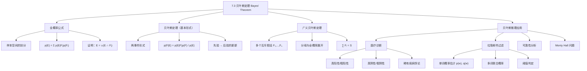

**相关笔记：** [[7.2 概率论]] | [[7.4 期望值与方差]]

> [!abstract] 概览
> 本节系统介绍了==贝叶斯定理（Bayes' Theorem）==及其在实际问题中的应用。贝叶斯定理是==条件概率==理论的核心结果之一，它提供了一种在获得新证据后更新事件发生概率的严格数学方法。
>
> - ==全概率公式（Law of Total Probability）==：若 $F_1, F_2, \ldots, F_n$ 互斥且覆盖整个样本空间，则 $p(E) = \sum_{i=1}^{n} p(E \mid F_i)p(F_i)$
> - ==贝叶斯定理==：$p(F_j \mid E) = \frac{p(E \mid F_j)p(F_j)}{\sum_{i=1}^{n} p(E \mid F_i)p(F_i)}$
> - ==先验概率（Prior Probability）==：在获得新证据之前对事件发生概率的初始估计 $p(F_j)$
> - ==后验概率（Posterior Probability）==：在获得新证据 $E$ 之后对事件发生概率的更新估计 $p(F_j \mid E)$
> - ==似然函数（Likelihood）==：在假设 $F_j$ 为真的条件下观察到证据 $E$ 的概率 $p(E \mid F_j)$
> - 贝叶斯定理广泛应用于==医疗诊断==、==垃圾邮件过滤==、==可靠性分析==等领域
> - 贝叶斯定理可推广到==多个假设==的情形（广义贝叶斯定理）

---

## 一、知识结构总览

---

## 二、核心思想

> [!tip] 核心思想
> 本节的核心思想是==贝叶斯推理（Bayesian Inference）==：通过贝叶斯定理，在获得新证据（evidence）后，系统地更新我们对事件发生概率的估计。具体而言，贝叶斯定理建立了一个从==先验概率（prior probability）==到==后验概率（posterior probability）==的数学桥梁——当我们观察到新证据 $E$ 时，对假设 $F_j$ 的置信度从 $p(F_j)$ 更新为 $p(F_j \mid E)$。更新幅度取决于两个因素：证据在假设为真时的出现概率（似然 $p(E \mid F_j)$），以及证据在所有可能假设下的总出现概率（全概率 $p(E)$）。这一思想是现代机器学习、人工智能、医学诊断等领域的重要基石。

### 1. 全概率公式（Law of Total Probability）

> [!def] 全概率公式
> 设 $F_1, F_2, \ldots, F_n$ 是样本空间 $S$ 中==互斥==的事件，且 $\bigcup_{i=1}^{n} F_i = S$。若 $p(F_i) \neq 0$ 对所有 $i = 1, 2, \ldots, n$ 成立，则对任意事件 $E$：
>
> $$p(E) = \sum_{i=1}^{n} p(E \mid F_i) \cdot p(F_i)$$
>
> - 这里的 $F_1, F_2, \ldots, F_n$ 构成样本空间的一个==划分（partition）==
> - 全概率公式的本质是==全分解==：将事件 $E$ 拆分为 $E = \bigcup_{i=1}^{n} (E \cap F_i)$，由于 $E \cap F_i$ 两两互斥，故 $p(E) = \sum_{i=1}^{n} p(E \cap F_i) = \sum_{i=1}^{n} p(E \mid F_i)p(F_i)$

> [!example] 全概率公式的直观理解
> 假设一个工厂有三条生产线 $F_1, F_2, F_3$，分别生产总产品的 50%、30%、20%。各线的不合格率分别为 2%、3%、1%。则任意一件产品不合格的概率为：
>
> $$p(E) = 0.02 \times 0.50 + 0.03 \times 0.30 + 0.01 \times 0.20 = 0.010 + 0.009 + 0.002 = 0.021$$
>
> 即总不合格率为 2.1%。

### 2. 贝叶斯定理（基本形式）

> [!thm] 贝叶斯定理（Theorem 1）
> 设 $E$ 和 $F$ 是样本空间 $S$ 中的事件，且 $p(E) \neq 0$，$p(F) \neq 0$。则：
>
> $$p(F \mid E) = \frac{p(E \mid F) \cdot p(F)}{p(E \mid F) \cdot p(F) + p(E \mid \overline{F}) \cdot p(\overline{F})}$$
>
> **证明**：
>
> 第一步，由条件概率的定义：
> $$p(F \mid E) = \frac{p(E \cap F)}{p(E)}$$
>
> 第二步，同样由条件概率定义：
> $$p(E \mid F) = \frac{p(E \cap F)}{p(F)} \implies p(E \cap F) = p(E \mid F) \cdot p(F)$$
>
> 第三步，将第二步代入第一步：
> $$p(F \mid E) = \frac{p(E \mid F) \cdot p(F)}{p(E)}$$
>
> 第四步，利用全概率公式展开分母 $p(E)$：
> $$p(E) = p(E \cap F) + p(E \cap \overline{F}) = p(E \mid F) \cdot p(F) + p(E \mid \overline{F}) \cdot p(\overline{F})$$
>
> 这里 $E = E \cap S = E \cap (F \cup \overline{F}) = (E \cap F) \cup (E \cap \overline{F})$，且 $E \cap F$ 与 $E \cap \overline{F}$ 互斥。
>
> 第五步，将第四步代入第三步即得证。
>
> $\blacksquare$

> [!example] 两盒取球问题（Example 1）
> 有两个盒子：第一个盒子有 2 个绿球和 7 个红球，第二个盒子有 4 个绿球和 3 个红球。Bob 先随机选一个盒子，再从中随机取一个球。若取出的是红球，求该球来自第一个盒子的概率。
>
> **解**：设 $E$ 为"取出红球"，$F$ 为"选第一个盒子"，$\overline{F}$ 为"选第二个盒子"。
>
> - $p(E \mid F) = 7/9$（第一个盒子中红球占 7/9）
> - $p(E \mid \overline{F}) = 3/7$（第二个盒子中红球占 3/7）
> - $p(F) = p(\overline{F}) = 1/2$（随机选盒子）
>
> 由贝叶斯定理：
> $$p(F \mid E) = \frac{(7/9)(1/2)}{(7/9)(1/2) + (3/7)(1/2)} = \frac{7/18}{7/18 + 3/14} = \frac{49}{76} \approx 0.645$$
>
> 在没有额外信息时，选第一个盒子的概率是 $1/2$；但知道取出了红球后，概率更新为约 $0.645$。

### 3. 广义贝叶斯定理

> [!thm] 广义贝叶斯定理（Theorem 2）
> 设 $E$ 是样本空间 $S$ 中的事件，$F_1, F_2, \ldots, F_n$ 是==互斥==事件且 $\bigcup_{i=1}^{n} F_i = S$。若 $p(E) \neq 0$ 且 $p(F_i) \neq 0$ 对 $i = 1, 2, \ldots, n$ 成立，则：
>
> $$p(F_j \mid E) = \frac{p(E \mid F_j) \cdot p(F_j)}{\sum_{i=1}^{n} p(E \mid F_i) \cdot p(F_i)}$$
>
> - 分子：在假设 $F_j$ 下观察到证据 $E$ 的概率（似然 $\times$ 先验）
> - 分母：在所有可能假设下观察到证据 $E$ 的总概率（==归一化常数==，即全概率 $p(E)$）
> - 当 $n = 2$ 时退化为基本形式的贝叶斯定理

### 4. 先验概率与后验概率

> [!def] 先验概率与后验概率
> - ==先验概率 $p(F_j)$==：在观察到证据 $E$ 之前，对假设 $F_j$ 成立概率的初始估计，反映我们的背景知识或先验信念
> - ==后验概率 $p(F_j \mid E)$==：在观察到证据 $E$ 之后，对假设 $F_j$ 成立概率的更新估计
> - ==似然 $p(E \mid F_j)$==：假设 $F_j$ 为真时，观察到证据 $E$ 的概率
> - 贝叶斯定理的直觉：==后验 $\propto$ 先验 $\times$ 似然==
>
> $$\underbrace{p(F_j \mid E)}_{\text{后验概率}} \propto \underbrace{p(E \mid F_j)}_{\text{似然}} \times \underbrace{p(F_j)}_{\text{先验概率}}$$

### 5. 贝叶斯推理的实际应用

#### 5.1 医疗诊断

> [!example] 稀有疾病的检测悖论（Example 2）
> 假设每 10 万人中有 1 人患某种稀有疾病。有一种相当准确的诊断测试：对患病者，99.0% 呈阳性（真阳性率）；对未患病者，99.5% 呈阴性（真阴性率）。
>
> **(a)** 检测为阳性的人实际患病的概率是多少？
>
> **解**：设 $F$ 为"患病"，$E$ 为"检测为阳性"。
> - $p(F) = 1/100000 = 0.00001$，$p(\overline{F}) = 0.99999$
> - $p(E \mid F) = 0.99$（真阳性率），$p(E \mid \overline{F}) = 0.005$（假阳性率）
>
> $$p(F \mid E) = \frac{(0.99)(0.00001)}{(0.99)(0.00001) + (0.005)(0.99999)} \approx 0.002$$
>
> 仅有约 0.2% 的阳性检测者实际患病！这是因为疾病极其稀有，假阳性的人数远超真阳性的人数。
>
> **(b)** 检测为阴性的人实际未患病的概率是多少？
>
> $$p(\overline{F} \mid \overline{E}) = \frac{(0.995)(0.99999)}{(0.995)(0.99999) + (0.01)(0.00001)} \approx 0.9999999$$
>
> 99.99999% 的阴性检测者确实未患病。

#### 5.2 贝叶斯垃圾邮件过滤器

> [!def] 贝叶斯垃圾邮件过滤器
> 贝叶斯垃圾邮件过滤器利用已知的垃圾邮件和非垃圾邮件中特定单词的出现频率，估计一封新邮件是垃圾邮件的概率。
>
> - 设 $p(w)$ 为单词 $w$ 在垃圾邮件中出现的经验概率：$p(w) = n_B(w) / |B|$
> - 设 $q(w)$ 为单词 $w$ 在非垃圾邮件中出现的经验概率：$q(w) = n_G(w) / |G|$
> - 假设 $p(S) = p(\overline{S}) = 1/2$（无先验信息），则包含单词 $w$ 的邮件是垃圾邮件的概率估计为：
>
> $$r(w) = \frac{p(w)}{p(w) + q(w)}$$
>
> - 当 $r(w)$ 超过预设阈值（如 0.9）时，将邮件判定为垃圾邮件

> [!example] 单词过滤（Example 3）
> "Rolex"在 2000 封垃圾邮件中出现 250 次，在 1000 封非垃圾邮件中出现 5 次。
>
> $p(\text{Rolex}) = 250/2000 = 0.125$，$q(\text{Rolex}) = 5/1000 = 0.005$
>
> $$r(\text{Rolex}) = \frac{0.125}{0.125 + 0.005} = \frac{0.125}{0.130} \approx 0.962$$
>
> 超过阈值 0.9，判定为垃圾邮件。

> [!def] 多词联合过滤
> 若邮件同时包含单词 $w_1$ 和 $w_2$，假设各单词出现事件独立，则：
>
> $$r(w_1, w_2) = \frac{p(w_1) \cdot p(w_2)}{p(w_1) \cdot p(w_2) + q(w_1) \cdot q(w_2)}$$
>
> 更一般地，对 $k$ 个单词 $w_1, w_2, \ldots, w_k$：
>
> $$r(w_1, w_2, \ldots, w_k) = \frac{\prod_{i=1}^{k} p(w_i)}{\prod_{i=1}^{k} p(w_i) + \prod_{i=1}^{k} q(w_i)}$$

> [!example] 双词过滤（Example 4）
> "stock"在 2000 封垃圾邮件中出现 400 次，在 1000 封非垃圾邮件中出现 60 次；"undervalued"在垃圾邮件中出现 200 次，在非垃圾邮件中出现 25 次。
>
> $p(\text{stock}) = 0.2$，$q(\text{stock}) = 0.06$，$p(\text{undervalued}) = 0.1$，$q(\text{undervalued}) = 0.025$
>
> $$r(\text{stock, undervalued}) = \frac{(0.2)(0.1)}{(0.2)(0.1) + (0.06)(0.025)} = \frac{0.02}{0.02 + 0.0015} \approx 0.930$$
>
> 超过阈值 0.9，判定为垃圾邮件。

---

## 三、补充理解与易混淆点

### 补充理解

> [!info] 补充1：贝叶斯定理的历史与意义
> 贝叶斯定理由英国数学家兼牧师==Thomas Bayes==（1702--1761）提出，其论文《概率论中的一个问题的解法》在他去世后的 1764 年由朋友整理发表。法国数学家==Laplace== 独立发现并推广了这一结果。在过去的二十年中，贝叶斯定理被广泛应用于医学、法律、机器学习、工程和软件开发等领域，成为==贝叶斯统计==和==贝叶斯机器学习==的理论基础。在现代人工智能中，朴素贝叶斯分类器、贝叶斯网络、贝叶斯优化等算法都直接基于贝叶斯定理。
>
> - [Khan Academy: Conditional Probability and Bayes' Theorem](https://www.khanacademy.org/math/statistics-probability/probability-library) -- 条件概率与贝叶斯定理的完整视频教程
> - [3Blue1Brown: Bayes' Theorem](https://www.3blue1brown.com/) -- 可视化讲解贝叶斯定理的几何直觉
> - [Brilliant: Bayes' Theorem](https://brilliant.org/wiki/bayes-theorem/) -- 贝叶斯定理的交互式学习与练习
>
> 来源：Bayes, T. (1763). "An Essay towards solving a Problem in the Doctrine of Chances." *Philosophical Transactions of the Royal Society*, 53, 370–418.
> 来源：Rosen, K. H. (2019). *Discrete Mathematics and Its Applications* (8th ed.), McGraw-Hill, Section 7.3.

> [!info] 补充2：贝叶斯定理与全概率公式的关系
> 贝叶斯定理本质上是==全概率公式==与==条件概率定义==的直接推论。全概率公式回答的问题是"证据 $E$ 出现的总概率是多少？"（对所有假设加权求和），而贝叶斯定理进一步回答"在证据 $E$ 出现的条件下，哪个假设最可能成立？"（比较各假设的后验概率）。二者配合使用，构成了完整的贝叶斯推理框架：
>
> 1. **全概率公式**计算归一化常数：$p(E) = \sum_{i} p(E \mid F_i)p(F_i)$
> 2. **贝叶斯定理**更新后验概率：$p(F_j \mid E) = \frac{p(E \mid F_j)p(F_j)}{p(E)}$
>
> 这种"先分解、再比较"的思想在模式识别、决策理论、信息检索等领域有广泛应用。
>
> - [StatQuest: Naive Bayes](https://www.youtube.com/watch?v=O2L2Uv9pdDA) -- StatQuest 朴素贝叶斯分类器讲解
> - [Brilliant: Law of Total Probability](https://brilliant.org/wiki/law-of-total-probability/) -- 全概率公式的详细讲解与例题
>
> 来源：Ross, S. M. (2019). *A First Course in Probability* (10th ed.), Pearson, Chapter 3.
> 来源：Rosen, K. H. (2019). *Discrete Mathematics and Its Applications* (8th ed.), McGraw-Hill, Section 7.3.

> [!info] 补充3：贝叶斯推理的直觉——"翻转条件"
> 贝叶斯定理的核心操作是==翻转条件方向==：从 $p(E \mid F)$（已知原因求结果）到 $p(F \mid E)$（已知结果求原因）。日常生活中大量推理都是"由果推因"：看到症状推断疾病、看到单词判断垃圾邮件、看到数据更新模型参数。贝叶斯定理为这种逆向推理提供了严格的数学基础。
>
> 一个有用的记忆方式是：
> $$\text{后验概率} = \frac{\text{似然} \times \text{先验概率}}{\text{全概率（证据的总概率）}}$$
>
> 即 $p(\text{原因} \mid \text{结果}) = \frac{p(\text{结果} \mid \text{原因}) \times p(\text{原因})}{p(\text{结果})}$
>
> 来源：Jaynes, E. T. (2003). *Probability Theory: The Logic of Science*. Cambridge University Press, Chapter 4.
> 来源：McGrayne, S. B. (2011). *The Theory That Would Not Die*. Yale University Press.

### 易混淆点

> [!warning] 误区：混淆 $p(F \mid E)$ 与 $p(E \mid F)$
> - ❌ 认为 $p(F \mid E) = p(E \mid F)$，即混淆条件方向
> - ✅ $p(E \mid F)$ 是"假设 $F$ 为真时观察到证据 $E$ 的概率"（似然）
> - ✅ $p(F \mid E)$ 是"观察到证据 $E$ 后假设 $F$ 为真的概率"（后验）
> - ⚠️ 例如：$p(\text{患病} \mid \text{阳性})$ 与 $p(\text{阳性} \mid \text{患病})$ 完全不同。前者仅约 0.2%（Example 2），后者为 99%
> - 这两个量的关系由贝叶斯定理精确给出：$p(F \mid E) = \frac{p(E \mid F) \cdot p(F)}{p(E)}$

> [!warning] 误区：忽视先验概率的影响——稀有疾病悖论
> - ❌ 认为检测准确率高达 99%，所以阳性结果意味着几乎肯定患病
> - ✅ 当疾病极其稀有时（如 $p(F) = 0.00001$），即使测试很准确，阳性结果中假阳性的人数仍远超真阳性
> - 在 Example 2 中，$p(F \mid E) \approx 0.002$，即阳性者中只有 0.2% 真正患病
> - 关键原因：$p(\overline{F}) = 0.99999$ 极大，即使假阳性率仅 0.5%，假阳性人数 $= 0.005 \times 99999 \approx 500$ 也远超真阳性人数 $= 0.99 \times 1 \approx 1$
> - ⚠️ 先验概率在贝叶斯推理中至关重要，不可忽略

> [!warning] 误区：贝叶斯垃圾邮件过滤器中的独立性假设
> - ❌ 认为多词过滤公式 $r(w_1, \ldots, w_k) = \frac{\prod p(w_i)}{\prod p(w_i) + \prod q(w_i)}$ 在任何情况下都精确
> - ✅ 该公式假设各单词出现事件==条件独立==，这在现实中不一定成立
> - 例如："buy" 和 "now" 在垃圾邮件中经常一起出现，并非独立
> - 条件独立性假设会引入一定误差，但在实际应用中通常误差较小，且使用更多单词可以弥补这一缺陷

---

## 四、习题精选

> [!todo] 习题概览
> | 题号范围 | 核心考点 | 难度 |
> |---------|---------|------|
> | 1-2 | 利用条件概率定义和贝叶斯定理求 $p(F \mid E)$ | ⭐ |
> | 3-4 | 两盒取球问题（贝叶斯定理基本应用） | ⭐⭐ |
> | 5-6 | 体育兴奋剂检测（先验概率与后验概率） | ⭐⭐ |
> | 7-8 | 医疗诊断（稀有疾病检测悖论） | ⭐⭐⭐ |
> | 9-10 | 传染病检测（HIV、禽流感） | ⭐⭐⭐ |
> | 11 | 产品成功预测（市场分析） | ⭐⭐ |
> | 12 | 通信信道（位传输错误） | ⭐⭐⭐ |
> | 13-14 | 三假设贝叶斯定理 | ⭐⭐⭐ |
> | 15 | Monty Hall 问题（贝叶斯定理求解） | ⭐⭐⭐⭐ |
> | 16 | 多种通勤方式的贝叶斯推断 | ⭐⭐ |
> | 17 | 证明广义贝叶斯定理 | ⭐⭐⭐ |
> | 18-22 | 贝叶斯垃圾邮件过滤器（单/多词） | ⭐⭐⭐ |

### 题1：贝叶斯定理基本计算

> [!problem] 题目
> 设 $E$ 和 $F$ 是样本空间中的事件，$p(E) = 1/3$，$p(F) = 1/2$，$p(E \mid F) = 2/5$。求 $p(F \mid E)$。

> [!faq]- 解答
> 由条件概率定义：$p(E \cap F) = p(E \mid F) \cdot p(F) = (2/5)(1/2) = 1/10$。
>
> 又 $p(F \mid E) = p(E \cap F) / p(E) = (1/10) / (1/3) = 3/10$。
>
> $\blacksquare$

### 题2：医疗诊断问题

> [!problem] 题目
> 每 10000 人中有 1 人患某种遗传疾病。有一种极佳的检测方法：患病者中 99.9% 检测为阳性，未患病者中仅 0.02% 检测为阳性。
>
> (a) 检测为阳性的人实际患病的概率是多少？
> (b) 检测为阴性的人实际未患病的概率是多少？

> [!faq]- 解答
> 设 $F$ 为"患病"，$E$ 为"检测为阳性"。
>
> - $p(F) = 1/10000 = 0.0001$，$p(\overline{F}) = 0.9999$
> - $p(E \mid F) = 0.999$，$p(E \mid \overline{F}) = 0.0002$
>
> **(a)** 由贝叶斯定理：
> $$p(F \mid E) = \frac{(0.999)(0.0001)}{(0.999)(0.0001) + (0.0002)(0.9999)} = \frac{0.0000999}{0.0000999 + 0.00019998} \approx 0.333$$
>
> 即使检测准确率极高，阳性者中也仅有约 1/3 真正患病。
>
> **(b)** $p(\overline{E} \mid F) = 1 - 0.999 = 0.001$，$p(\overline{E} \mid \overline{F}) = 1 - 0.0002 = 0.9998$。
> $$p(\overline{F} \mid \overline{E}) = \frac{(0.9998)(0.9999)}{(0.9998)(0.9999) + (0.001)(0.0001)} \approx 0.9999999$$
>
> 阴性检测几乎可以完全排除患病可能。
>
> $\blacksquare$

### 题3：垃圾邮件过滤

> [!problem] 题目
> 一个贝叶斯垃圾邮件过滤器在 500 封垃圾邮件和 200 封非垃圾邮件上训练。"exciting"在 40 封垃圾邮件和 25 封非垃圾邮件中出现。若阈值设为 0.9，一封包含"exciting"的邮件会被判定为垃圾邮件吗？

> [!faq]- 解答
> $p(\text{exciting}) = 40/500 = 0.08$，$q(\text{exciting}) = 25/200 = 0.125$。
>
> $$r(\text{exciting}) = \frac{0.08}{0.08 + 0.125} = \frac{0.08}{0.205} \approx 0.390$$
>
> 由于 $0.390 < 0.9$，该邮件==不会==被判定为垃圾邮件。
>
> 直觉解释："exciting"在非垃圾邮件中出现得更频繁（12.5% vs 8%），因此它不是垃圾邮件的强指标。
>
> $\blacksquare$

### 题4：三假设贝叶斯定理

> [!problem] 题目
> 设 $E, F_1, F_2, F_3$ 是样本空间 $S$ 中的事件，$F_1, F_2, F_3$ 两两互斥且 $\bigcup_{i=1}^{3} F_i = S$。已知 $p(E \mid F_1) = 1/8$，$p(E \mid F_2) = 1/4$，$p(E \mid F_3) = 1/6$，$p(F_1) = 1/4$，$p(F_2) = 1/4$，$p(F_3) = 1/2$。求 $p(F_3 \mid E)$。

> [!faq]- 解答
> 由广义贝叶斯定理：
>
> 分子：$p(E \mid F_3) \cdot p(F_3) = (1/6)(1/2) = 1/12$
>
> 分母（全概率）：
> $$p(E) = (1/8)(1/4) + (1/4)(1/4) + (1/6)(1/2) = 1/32 + 1/16 + 1/12$$
> $$= \frac{3}{96} + \frac{6}{96} + \frac{8}{96} = \frac{17}{96}$$
>
> 因此：
> $$p(F_3 \mid E) = \frac{1/12}{17/96} = \frac{8}{17} \approx 0.471$$
>
> $\blacksquare$

### 题5：全概率公式应用

> [!problem] 题目
> 某诊所中 8% 的患者感染 HIV。血液检测中，98% 的 HIV 感染者检测为阳性，3% 的未感染者检测为阳性。求：
>
> (a) 检测为阳性的患者实际感染 HIV 的概率？
> (b) 检测为阳性的患者实际未感染 HIV 的概率？

> [!faq]- 解答
> 设 $F$ 为"感染 HIV"，$E$ 为"检测为阳性"。
>
> - $p(F) = 0.08$，$p(\overline{F}) = 0.92$
> - $p(E \mid F) = 0.98$，$p(E \mid \overline{F}) = 0.03$
>
> **(a)**
> $$p(F \mid E) = \frac{(0.98)(0.08)}{(0.98)(0.08) + (0.03)(0.92)} = \frac{0.0784}{0.0784 + 0.0276} = \frac{0.0784}{0.1060} \approx 0.740$$
>
> **(b)**
> $$p(\overline{F} \mid E) = 1 - p(F \mid E) \approx 1 - 0.740 = 0.260$$
>
> 或直接计算：
> $$p(\overline{F} \mid E) = \frac{(0.03)(0.92)}{0.1060} = \frac{0.0276}{0.1060} \approx 0.260$$
>
> $\blacksquare$

> [!tip] 解题思路提示
> 贝叶斯定理问题的解题方法论：
> 1. **明确事件定义**：设 $F_j$ 为各假设，$E$ 为观察到的证据
> 2. **列出已知量**：先验概率 $p(F_j)$、似然 $p(E \mid F_j)$
> 3. **计算全概率**：$p(E) = \sum_{i} p(E \mid F_i)p(F_i)$（分母）
> 4. **应用贝叶斯定理**：$p(F_j \mid E) = \frac{p(E \mid F_j)p(F_j)}{p(E)}$
> 5. **验证结果**：所有假设的后验概率之和应为 1
> 6. **注意条件方向**：不要混淆 $p(F \mid E)$ 与 $p(E \mid F)$

---

## 五、视频学习指南

> [!info] 视频资源
> | 资源 | 链接 | 对应内容 | 备注 |
> |:-----|:-----|:---------|:-----|
> | Rosen 8e Section 7.3 | [教材原文](https://www.mheducation.com/highered/product/discrete-mathematics-applications-rosen/M9781259676512.html) | 完整定义、定理与例题 | 英文教材 |
> | Khan Academy: Conditional Probability | [链接](https://www.khanacademy.org/math/statistics-probability/probability-library/conditional-probability/a/conditional-probability-and-independence) | 条件概率与贝叶斯定理 | 英文，免费 |
> | 3Blue1Brown: Bayes Theorem | [链接](https://www.youtube.com/watch?v=HZGCoVF3YvM) | 贝叶斯定理可视化讲解 | 英文，直观 |
> | StatQuest: Naive Bayes | [链接](https://www.youtube.com/watch?v=O2L2Uv9pdDA) | 朴素贝叶斯分类器 | 英文，机器学习视角 |
> | Brilliant: Bayes' Theorem | [链接](https://brilliant.org/wiki/bayes-theorem/) | 交互式练习与讲解 | 英文，有练习题 |

---

## 六、教材原文

> [!quote] 教材原文
> "There are many times when we want to assess the probability that a particular event occurs on the basis of partial evidence. For example, suppose we know the percentage of people who have a particular disease for which there is a very accurate diagnostic test. People who test positive for this disease would like to know the likelihood that they actually have the disease."
>
> "The result that we can use to answer questions such as these is called Bayes' theorem and dates back to the eighteenth century. In the past two decades, Bayes' theorem has been extensively applied to estimate probabilities based on partial evidence in areas as diverse as medicine, law, machine learning, engineering, and software development."
>
> "Thomas Bayes was the son of a minister in a religious sect known as the Nonconformists. Bayes is best known for his essay on probability published in 1764, three years after his death. This essay was sent to the Royal Society by a friend who found it in the papers left behind when Bayes died."

---

## 参见 Wiki

- [[离散数学/concepts/贝叶斯定理]] -- 贝叶斯定理的定义、证明与应用
- [[离散数学/concepts/全概率公式]] -- 全概率公式的定义与推导
- [[离散数学/concepts/贝叶斯定理|先验概率]] -- 先验概率的概念与选择
- [[离散数学/concepts/贝叶斯定理|后验概率]] -- 后验概率的计算与解释
- [[离散数学/concepts/条件概率]] -- 条件概率的定义与性质（[[7.2 概率论]]）

#学习/离散数学/离散概率
