**相关笔记：** [[7.3 贝叶斯定理]] | [[8.1 递推关系]]

> [!abstract] 概览
> 本节系统介绍了==随机变量==的两个最重要的数字特征——==期望值（Expected Value）==和==方差（Variance）==，以及它们的性质和重要应用。
>
> - ==随机变量（Random Variable）==：为样本空间中每个结果分配一个实数的函数 $X: S \to \mathbb{R}$
> - ==期望值 $E(X) = \sum_{s \in S} p(s) \cdot X(s) = \sum_{r \in X(S)} p(X = r) \cdot r$==：随机变量的加权平均值，也称均值或数学期望
> - ==期望的线性性质==：$E(X_1 + X_2 + \cdots + X_n) = E(X_1) + E(X_2) + \cdots + E(X_n)$，$E(aX + b) = aE(X) + b$
> - ==方差 $V(X) = E(X^2) - [E(X)]^2$==：衡量随机变量取值偏离期望值的离散程度
> - ==方差性质==：$V(aX + b) = a^2 V(X)$，独立随机变量之和的方差等于方差之和（Bienayme 公式）
> - ==马尔可夫不等式==：$P(X \geq a) \leq E(X)/a$（$X \geq 0$）
> - ==切比雪夫不等式==：$P(|X - \mu| \geq r) \leq \sigma^2 / r^2$
> - ==几何分布==：$p(X = k) = (1-p)^{k-1}p$，期望 $E(X) = 1/p$

---

## 一、知识结构总览

```mermaid
graph TB
    A["7.4 期望值与方差 Expected Value and Variance"] --> B["随机变量"]
    A --> C["期望值 Expected Value"]
    A --> D["期望的线性性"]
    A --> E["几何分布"]
    A --> F["独立随机变量"]
    A --> G["方差 Variance"]
    A --> H["不等式"]

    B --> B1["定义：X: S → R"]
    B --> B2["分布：值与概率的对应"]
    B --> B3["期望、方差等数字特征"]

    C --> C1["定义：E(X) = Σ p(s)X(s)"]
    C --> C2["按值分组：E(X) = Σ p(X=r)·r"]
    C --> C3["Bernoulli 试验期望 = np"]

    D --> D1["E(X₁+...+Xₙ) = Σ E(Xᵢ)"]
    D --> D2["E(aX+b) = aE(X)+b"]
    D --> D3["帽子检查问题"]
    D --> D4["逆序数期望"]

    E --> E1["定义：p(X=k) = (1-p)^(k-1)p"]
    E --> E2["期望：E(X) = 1/p"]
    E --> E3["首次成功的等待时间"]

    F --> F1["独立性定义"]
    F --> F2["E(XY) = E(X)E(Y)"]
    F --> F3["反例：非独立则不成立"]

    G --> G1["定义：V(X) = E(X²) - [E(X)]²"]
    G --> G2["标准差 σ(X) = √V(X)"]
    G --> G3["Bernoulli 方差 = npq"]
    G --> G4["Bienayme 公式"]

    H --> H1["马尔可夫不等式"]
    H --> H2["切比雪夫不等式"]
    H --> H3["应用：概率界限估计"]
```

---

## 二、核心思想

> [!tip] 核心思想
> 本节的核心思想是利用==期望值==和==方差==这两个数字特征来刻画随机变量的"中心位置"和"离散程度"。期望值是随机变量取值的加权平均，告诉我们"平均而言会得到什么结果"；方差衡量随机变量取值偏离期望值的程度，告诉我们"结果的不确定性有多大"。期望的==线性性质==是一个极其强大的工具——即使随机变量之间不独立，期望的和仍然等于和的期望，这使得许多看似复杂的问题（如帽子检查问题、逆序数期望）可以优雅地解决。==切比雪夫不等式==和==马尔可夫不等式==则提供了仅凭期望和方差就能对概率做出定量估计的通用方法。

### 1. 随机变量与期望值

> [!def] 随机变量（Random Variable）
> 设 $S$ 是样本空间。一个==随机变量== $X$ 是从 $S$ 到实数集的函数，即 $X: S \to \mathbb{R}$，它为每个可能的结果 $s \in S$ 分配一个实数值 $X(s)$。

> [!def] 期望值（Definition 1）
> 随机变量 $X$ 在样本空间 $S$ 上的==期望值（Expected Value）==，也称==均值（Mean）==或==数学期望==，定义为：
>
> $$E(X) = \sum_{s \in S} p(s) \cdot X(s)$$
>
> - 期望值是 $X$ 取值的==加权平均==，权重为各结果出现的概率
> - 当 $S = \{x_1, x_2, \ldots, x_n\}$ 时，$E(X) = \sum_{i=1}^{n} p(x_i) \cdot X(x_i)$
> - 对无穷样本空间，期望值仅在级数绝对收敛时存在

> [!example] 掷骰子的期望值（Example 1）
> 设 $X$ 为公平骰子掷出的点数。$X$ 取值 $1, 2, 3, 4, 5, 6$，每个概率 $1/6$。
>
> $$E(X) = \frac{1}{6}(1 + 2 + 3 + 4 + 5 + 6) = \frac{21}{6} = \frac{7}{2} = 3.5$$
>
> 注意 $3.5$ 不是骰子的任何可能取值，但它是大量投掷后的平均值。

> [!thm] 按值分组计算期望（Theorem 1）
> 若 $X$ 是随机变量，$p(X = r)$ 是 $X = r$ 的概率，则：
>
> $$E(X) = \sum_{r \in X(S)} p(X = r) \cdot r$$
>
> 其中 $X(S)$ 是 $X$ 的值域。这个公式将相同取值的结果合并计算，当结果数量很大时特别有用。

> [!example] 掷两枚骰子点数之和的期望（Example 3）
> 设 $X$ 为两枚公平骰子点数之和，值域为 $\{2, 3, \ldots, 12\}$。
>
> $$E(X) = 2 \cdot \frac{1}{36} + 3 \cdot \frac{2}{36} + 4 \cdot \frac{3}{36} + 5 \cdot \frac{4}{36} + 6 \cdot \frac{5}{36} + 7 \cdot \frac{6}{36}$$
> $$+ 8 \cdot \frac{5}{36} + 9 \cdot \frac{4}{36} + 10 \cdot \frac{3}{36} + 11 \cdot \frac{2}{36} + 12 \cdot \frac{1}{36} = 7$$

> [!thm] Bernoulli 试验的期望（Theorem 2）
> $n$ 次相互独立的 Bernoulli 试验中（每次成功概率为 $p$），成功次数的期望值为 $np$。
>
> **证明**：设 $X$ 为成功次数，则 $p(X = k) = C(n,k)p^k q^{n-k}$。
>
> $$E(X) = \sum_{k=1}^{n} k \cdot C(n,k) p^k q^{n-k} = \sum_{k=1}^{n} n \cdot C(n-1, k-1) p^k q^{n-k}$$
> $$= np \sum_{k=1}^{n} C(n-1, k-1) p^{k-1} q^{n-k} = np(p+q)^{n-1} = np$$
>
> $\blacksquare$

### 2. 期望的线性性质

> [!thm] 期望的线性性质（Theorem 3）
> 设 $X_i$（$i = 1, 2, \ldots, n$）是样本空间 $S$ 上的随机变量，$a$ 和 $b$ 是实数，则：
>
> **(i)** $E(X_1 + X_2 + \cdots + X_n) = E(X_1) + E(X_2) + \cdots + E(X_n)$
>
> **(ii)** $E(aX + b) = aE(X) + b$
>
> **证明 (i)**（$n=2$ 的情形）：
> $$E(X_1 + X_2) = \sum_{s \in S} p(s)(X_1(s) + X_2(s)) = \sum_{s \in S} p(s)X_1(s) + \sum_{s \in S} p(s)X_2(s) = E(X_1) + E(X_2)$$
>
> **证明 (ii)**：
> $$E(aX + b) = \sum_{s \in S} p(s)(aX(s) + b) = a\sum_{s \in S} p(s)X(s) + b\sum_{s \in S} p(s) = aE(X) + b$$
>
> 因为 $\sum_{s \in S} p(s) = 1$。
>
> $\blacksquare$
>
> - ⚠️ 注意：期望的线性性==不要求随机变量独立==，这是一个极其强大的性质

> [!example] 利用线性性求两枚骰子之和的期望（Example 4）
> 设 $X_1$ 为第一枚骰子的点数，$X_2$ 为第二枚骰子的点数。$E(X_1) = E(X_2) = 7/2$。
>
> 两枚骰子之和 $X = X_1 + X_2$，由线性性：
> $$E(X) = E(X_1) + E(X_2) = 7/2 + 7/2 = 7$$

> [!example] 帽子检查问题（Example 6）
> $n$ 个人把帽子交给新员工，员工随机归还帽子。求正确归还帽子数量的期望。
>
> **解**：设 $X_i$ 为第 $i$ 个人收到正确帽子的指示变量（$X_i = 1$ 或 $0$），$X = X_1 + X_2 + \cdots + X_n$。
>
> 每个人收到正确帽子的概率为 $1/n$，故 $E(X_i) = 1 \cdot (1/n) + 0 \cdot (1 - 1/n) = 1/n$。
>
> 由线性性：$E(X) = n \cdot (1/n) = 1$。
>
> 无论有多少人，平均只有 1 人收到正确的帽子！

> [!example] 逆序数的期望（Example 7）
> $n$ 个正整数排列中逆序数的期望是多少？
>
> **解**：设 $I_{i,j}$ 为指示变量，$I_{i,j} = 1$ 当且仅当 $(i,j)$ 构成逆序（$i < j$ 但 $j$ 排在 $i$ 前面）。
>
> 在随机排列中，$j$ 排在 $i$ 前面和 $i$ 排在 $j$ 前面的概率相等，故 $E(I_{i,j}) = 1/2$。
>
> 共有 $\binom{n}{2} = n(n-1)/2$ 对，由线性性：
> $$E(X) = \frac{n(n-1)}{2} \cdot \frac{1}{2} = \frac{n(n-1)}{4}$$

### 3. 几何分布

> [!def] 几何分布（Definition 2）
> 随机变量 $X$ 具有==参数为 $p$ 的几何分布==，如果：
>
> $$p(X = k) = (1-p)^{k-1} \cdot p \quad \text{对 } k = 1, 2, 3, \ldots$$
>
> 其中 $0 < p \leq 1$。几何分布描述的是==在独立重复试验中首次成功所需的试验次数==。

> [!thm] 几何分布的期望（Theorem 4）
> 若 $X$ 服从参数为 $p$ 的几何分布，则 $E(X) = 1/p$。
>
> **证明**：
> $$E(X) = \sum_{j=1}^{\infty} j \cdot (1-p)^{j-1} \cdot p = p \sum_{j=1}^{\infty} j(1-p)^{j-1} = p \cdot \frac{1}{p^2} = \frac{1}{p}$$
>
> 其中利用了 $\sum_{j=1}^{\infty} jx^{j-1} = 1/(1-x)^2$（对 $|x| < 1$），取 $x = 1-p$。
>
> $\blacksquare$

> [!example] 硬币首次出现正面的期望次数（Example 10）
> 一枚硬币出现正面的概率为 $p$，反复抛掷直到出现正面。期望抛掷次数为 $1/p$。
>
> 若硬币公平（$p = 1/2$），则 $E(X) = 1/(1/2) = 2$，平均需要抛 2 次。

### 4. 独立随机变量

> [!def] 独立随机变量（Definition 3）
> 样本空间 $S$ 上的随机变量 $X$ 和 $Y$ 是==独立的==，如果对所有实数 $r_1$ 和 $r_2$：
>
> $$p(X = r_1 \text{ 且 } Y = r_2) = p(X = r_1) \cdot p(Y = r_2)$$

> [!thm] 独立随机变量乘积的期望（Theorem 5）
> 若 $X$ 和 $Y$ 是独立的随机变量，则 $E(XY) = E(X) \cdot E(Y)$。
>
> - ⚠️ 注意：若 $X$ 和 $Y$ 不独立，则 $E(XY)$ 一般不等于 $E(X)E(Y)$

### 5. 方差

> [!def] 方差（Definition 4）
> 设 $X$ 是样本空间 $S$ 上的随机变量。$X$ 的==方差（Variance）== $V(X)$ 定义为：
>
> $$V(X) = \sum_{s \in S} (X(s) - E(X))^2 \cdot p(s)$$
>
> 即方差是偏差平方的加权平均。$X$ 的==标准差（Standard Deviation）== $\sigma(X) = \sqrt{V(X)}$。

> [!thm] 方差的计算公式（Theorem 6）
> $$V(X) = E(X^2) - [E(X)]^2$$
>
> **证明**：
> $$V(X) = \sum_{s \in S} (X(s) - E(X))^2 p(s) = \sum_{s \in S} X(s)^2 p(s) - 2E(X)\sum_{s \in S} X(s)p(s) + E(X)^2 \sum_{s \in S} p(s)$$
> $$= E(X^2) - 2E(X)^2 + E(X)^2 = E(X^2) - [E(X)]^2$$
>
> $\blacksquare$

> [!example] Bernoulli 试验的方差（Example 14）
> 设 $X$ 为 Bernoulli 试验的结果（成功 $X=1$，失败 $X=0$），成功概率 $p$，失败概率 $q = 1-p$。
>
> $E(X) = p$，$E(X^2) = p$（因为 $X^2 = X$）。
> $$V(X) = E(X^2) - [E(X)]^2 = p - p^2 = p(1-p) = pq$$

> [!example] 掷骰子的方差（Example 15）
> $E(X) = 7/2$。
>
> $$E(X^2) = \frac{1}{6}(1^2 + 2^2 + 3^2 + 4^2 + 5^2 + 6^2) = \frac{91}{6}$$
>
> $$V(X) = \frac{91}{6} - \left(\frac{7}{2}\right)^2 = \frac{91}{6} - \frac{49}{4} = \frac{35}{12}$$

> [!thm] 方差的线性性质
> 设 $a$ 和 $b$ 为实数，则：
>
> $$V(aX + b) = a^2 V(X)$$
>
> - 平移（$+b$）不影响方差，缩放（$\times a$）使方差乘以 $a^2$

> [!thm] Bienayme 公式（Theorem 7）
> 若 $X$ 和 $Y$ 是独立的随机变量，则：
>
> $$V(X + Y) = V(X) + V(Y)$$
>
> 更一般地，若 $X_1, X_2, \ldots, X_n$ 两两独立，则：
>
> $$V(X_1 + X_2 + \cdots + X_n) = V(X_1) + V(X_2) + \cdots + V(X_n)$$
>
> - ⚠️ 与期望不同，方差的加法性==要求随机变量独立==

> [!example] $n$ 次 Bernoulli 试验的方差（Example 18）
> $n$ 次独立 Bernoulli 试验（成功概率 $p$）的成功次数 $X = X_1 + X_2 + \cdots + X_n$。
>
> 每个 $V(X_i) = pq$，由 Bienayme 公式：
> $$V(X) = npq$$

### 6. 马尔可夫不等式与切比雪夫不等式

> [!thm] 马尔可夫不等式（Markov's Inequality）
> 设 $X$ 是样本空间 $S$ 上的随机变量，且 $X(s) \geq 0$ 对所有 $s \in S$ 成立。则对任意正实数 $a$：
>
> $$P(X \geq a) \leq \frac{E(X)}{a}$$
>
> - 马尔可夫不等式仅利用期望值就给出了概率的上界
> - 适用于==非负==随机变量
> - 直觉：如果期望值很小，则取大值的概率不可能太大

> [!thm] 切比雪夫不等式（Chebyshev's Inequality, Theorem 8）
> 设 $X$ 是样本空间 $S$ 上的随机变量，概率函数为 $p$。若 $r$ 是正实数，则：
>
> $$P(|X(s) - E(X)| \geq r) \leq \frac{V(X)}{r^2}$$
>
> **证明**：设 $A = \{s \in S : |X(s) - E(X)| \geq r\}$。
>
> $$V(X) = \sum_{s \in S} (X(s) - E(X))^2 p(s) = \sum_{s \in A} (X(s) - E(X))^2 p(s) + \sum_{s \notin A} (X(s) - E(X))^2 p(s)$$
>
> 第二个求和非负（每个被加项非负），故：
> $$V(X) \geq \sum_{s \in A} (X(s) - E(X))^2 p(s) \geq \sum_{s \in A} r^2 p(s) = r^2 p(A)$$
>
> 因此 $p(A) \leq V(X)/r^2$。
>
> $\blacksquare$

> [!example] 切比雪夫不等式的应用（Example 19）
> 设 $X$ 为公平硬币抛 $n$ 次出现正面的次数。$E(X) = n/2$，$V(X) = n/4$。
>
> 取 $r = \sqrt{n}$，由切比雪夫不等式：
> $$P\left(\left|X - \frac{n}{2}\right| \geq \sqrt{n}\right) \leq \frac{n/4}{(\sqrt{n})^2} = \frac{1}{4}$$
>
> 即正面次数偏离均值超过 $\sqrt{n}$ 的概率不超过 1/4。

> [!example] 切比雪夫不等式的局限性（Example 20）
> 设 $X$ 为公平骰子的点数。$E(X) = 7/2$，$V(X) = 35/12$。
>
> 取 $r = 3$：$P(|X - 7/2| \geq 3) \leq (35/12)/9 = 35/108 \approx 0.324$。
>
> 但实际上 $X$ 的取值为 $1, 2, 3, 4, 5, 6$，与 $7/2$ 的最大距离为 $5/2 < 3$，故 $P(|X - 7/2| \geq 3) = 0$。
>
> 切比雪夫不等式给出了正确的上界（$0 \leq 0.324$），但估计非常粗糙。

---

## 三、补充理解与易混淆点

### 补充理解

> [!info] 补充1：期望值的直觉——"长期平均值"
> 期望值 $E(X)$ 的核心直觉是==大量重复实验后的长期平均值==。例如，掷公平骰子的期望值是 $3.5$，虽然任何一次投掷都不会得到 $3.5$，但如果你投掷骰子 1000 次，所有结果的平均值将非常接近 $3.5$。这一性质由==大数定律==严格保证。期望值的另一个重要视角是==加权平均==：每个可能取值乘以其出现概率后求和，概率越大的取值对期望的贡献越大。
>
> 在算法分析中，期望值直接对应==平均情况复杂度==。例如，线性搜索的平均比较次数就是查找成功的期望比较次数。
>
> - [Khan Academy: Expected Value](https://www.khanacademy.org/math/statistics-probability/random-variables-stats-library/expected-value/v/expected-value-basic) -- 期望值的直观讲解与计算
> - [3Blue1Brown: The Essence of Calculus](https://www.3blue1brown.com/topics/calculus) -- 理解无穷级数求和（几何分布期望的推导基础）
>
> 来源：Rosen, K. H. (2019). *Discrete Mathematics and Its Applications* (8th ed.), McGraw-Hill, Section 7.4.
> 来源：Ross, S. M. (2019). *A First Course in Probability* (10th ed.), Pearson, Chapter 4.

> [!info] 补充2：方差的直觉——"不确定性度量"
> 方差 $V(X)$ 衡量的是随机变量取值偏离其期望值的平均程度。方差越大，说明取值越分散，不确定性越高；方差为零意味着随机变量是常数（没有任何不确定性）。
>
> 一个有用的类比：期望值是"靶心"，方差是"弹着点的散布范围"。标准差 $\sigma(X) = \sqrt{V(X)}$ 与原始数据具有相同的量纲，因此更便于解释。例如，如果考试成绩的期望是 75 分，标准差是 10 分，那么大多数成绩在 $75 \pm 10$ 分附近。
>
> - [Khan Academy: Variance and Standard Deviation](https://www.khanacademy.org/math/statistics-probability/summarizing-quantitative-data/variance-standard-deviation-population/a/variance-and-standard-deviation) -- 方差与标准差的详细讲解
> - [StatQuest: Variance](https://www.youtube.com/watch?v=-yNq_m7S2W4) -- StatQuest 方差的可视化讲解
> - [Brilliant: Chebyshev's Inequality](https://brilliant.org/wiki/chebyshevs-inequality/) -- 切比雪夫不等式的交互式学习
>
> 来源：Feller, W. (1968). *An Introduction to Probability Theory and Its Applications, Vol. 1* (3rd ed.). Wiley, Chapter IX.
> 来源：Rosen, K. H. (2019). *Discrete Mathematics and Its Applications* (8th ed.), McGraw-Hill, Section 7.4.

> [!info] 补充3：期望线性性的强大之处——指示变量技巧
> 期望线性性最精妙的应用之一是==指示变量技巧（Indicator Variable Trick）==。核心思想是：将一个复杂的随机变量 $X$ 分解为若干简单的指示变量 $X_i$ 之和（$X_i$ 只取 0 或 1），然后利用 $E(X) = \sum E(X_i)$ 求解。由于每个 $E(X_i) = P(X_i = 1)$，问题简化为计算各事件发生的概率。
>
> 经典应用：
> - **帽子检查问题**：$E(X_i) = 1/n$，故 $E(X) = n \cdot 1/n = 1$
> - **逆序数期望**：$E(I_{i,j}) = 1/2$，故 $E(X) = \binom{n}{2} \cdot 1/2 = n(n-1)/4$
> - **插入排序平均比较次数**：$E(X) = (n^2 + 3n - 4)/4 = \Theta(n^2)$
>
> 这种技巧的关键在于：==不需要随机变量之间独立==，线性性无条件成立。
>
> - [Brilliant: Linearity of Expectation](https://brilliant.org/wiki/linearity-of-expectation/) -- 期望线性性的详细例题
>
> 来源：Graham, R. L., Knuth, D. E. & Patashnik, O. (1994). *Concrete Mathematics* (2nd ed.), Addison-Wesley, Section 8.4 (Indicator Random Variables).
> 来源：Cormen, T. H., et al. (2009). *Introduction to Algorithms* (3rd ed.), MIT Press, Chapter 5 (Hiring Problem).

### 易混淆点

> [!warning] 误区：混淆 $E(X^2)$ 与 $[E(X)]^2$
> - ❌ 认为 $E(X^2) = [E(X)]^2$
> - ✅ 方差公式 $V(X) = E(X^2) - [E(X)]^2$ 恰好说明二者之差就是方差
> - ⚠️ 例如：$X$ 取值 $\pm 1$ 各概率 $1/2$，$E(X) = 0$，$[E(X)]^2 = 0$，但 $E(X^2) = 1$，$V(X) = 1$
> - 直觉：$E(X^2)$ 是"平方后的平均值"，$[E(X)]^2$ 是"平均值的平方"，由 Jensen 不等式，$E(X^2) \geq [E(X)]^2$（等号当且仅当 $X$ 为常数）

> [!warning] 误区：期望的线性性 vs 方差的加法性
> - ❌ 认为 $V(X + Y) = V(X) + V(Y)$ 对所有随机变量成立
> - ✅ 期望的线性性==无条件成立==：$E(X + Y) = E(X) + E(Y)$，即使 $X$ 和 $Y$ 不独立
> - ✅ 方差的加法性==要求独立性==：$V(X + Y) = V(X) + V(Y)$ 仅当 $X$ 和 $Y$ 独立时成立
> - ⚠️ 一般情况下：$V(X + Y) = V(X) + V(Y) + 2\text{Cov}(X,Y)$，其中协方差 $\text{Cov}(X,Y) = E(XY) - E(X)E(Y)$

> [!warning] 误区：切比雪夫不等式 vs 马尔可夫不等式
> - ❌ 混淆两个不等式的适用条件和结论
> - ✅ ==马尔可夫不等式==：适用于==非负==随机变量，给出 $P(X \geq a) \leq E(X)/a$
> - ✅ ==切比雪夫不等式==：适用于==任意==随机变量，给出 $P(|X - \mu| \geq r) \leq \sigma^2/r^2$
> - 切比雪夫不等式更强大（因为它同时利用了期望和方差两个信息），但给出的上界可能很宽松
> - 两个不等式都是"最坏情况"的估计，实际概率可能远小于上界

---

## 四、习题精选

> [!todo] 习题概览
> | 题号范围 | 核心考点 | 难度 |
> |---------|---------|------|
> | 1-2 | 抛硬币期望正面数 | ⭐ |
> | 3-4 | 掷骰子期望值（公平/偏置） | ⭐ |
> | 5 | 彩票期望值 | ⭐⭐ |
> | 6 | 考试期望分数 | ⭐⭐ |
> | 7-9 | 线性搜索平均比较次数 | ⭐⭐ |
> | 10-11 | 条件停止的期望试验次数 | ⭐⭐⭐ |
> | 12-13 | 几何分布期望 | ⭐⭐ |
> | 14-15 | 几何分布性质证明 | ⭐⭐⭐ |
> | 16 | 非独立随机变量反例 | ⭐⭐ |
> | 17-18 | 方差计算（骰子、硬币） | ⭐⭐ |
> | 19-20 | 期望与方差的性质 | ⭐⭐⭐ |
> | 27-28 | Bernoulli 试验方差 | ⭐⭐ |
> | 29 | 逆序数方差 | ⭐⭐⭐ |
> | 35-36 | 切比雪夫不等式应用 | ⭐⭐⭐ |
> | 37-39 | 马尔可夫不等式应用 | ⭐⭐⭐ |

### 题1：期望值计算

> [!problem] 题目
> 一枚公平硬币抛 5 次。设 $X$ 为出现正面的次数。
>
> (a) 求 $E(X)$。
> (b) 求 $V(X)$。

> [!faq]- 解答
> 每次抛硬币是 Bernoulli 试验，$p = 1/2$，$q = 1/2$，共 $n = 5$ 次。
>
> **(a)** $E(X) = np = 5 \times 1/2 = 5/2 = 2.5$。
>
> **(b)** $V(X) = npq = 5 \times (1/2) \times (1/2) = 5/4 = 1.25$。
>
> 标准差 $\sigma(X) = \sqrt{5/4} = \sqrt{5}/2 \approx 1.118$。
>
> $\blacksquare$

### 题2：方差计算

> [!problem] 题目
> 一枚公平骰子掷 10 次。设 $X$ 为出现 6 的次数。求 $E(X)$ 和 $V(X)$。

> [!faq]- 解答
> 每次掷骰子出现 6 的概率 $p = 1/6$，$q = 5/6$，共 $n = 10$ 次。
>
> $$E(X) = np = 10 \times \frac{1}{6} = \frac{10}{6} = \frac{5}{3} \approx 1.667$$
>
> $$V(X) = npq = 10 \times \frac{1}{6} \times \frac{5}{6} = \frac{50}{36} = \frac{25}{18} \approx 1.389$$
>
> $\blacksquare$

### 题3：马尔可夫不等式应用

> [!problem] 题目
> 某灌装厂每天灌装汽水的罐数是随机变量 $X$，$E(X) = 10000$，$V(X) = 1000$。
>
> (a) 用马尔可夫不等式求某天灌装超过 11000 罐的概率上界。
> (b) 用切比雪夫不等式求某天灌装 9000 到 11000 罐之间的概率下界。

> [!faq]- 解答
> **(a)** 由马尔可夫不等式（$X \geq 0$）：
> $$P(X \geq 11000) \leq \frac{E(X)}{11000} = \frac{10000}{11000} = \frac{10}{11} \approx 0.909$$
>
> **(b)** 由切比雪夫不等式，取 $r = 1000$：
> $$P(|X - 10000| \geq 1000) \leq \frac{1000}{1000^2} = \frac{1}{1000} = 0.001$$
>
> 因此：
> $$P(|X - 10000| < 1000) \geq 1 - 0.001 = 0.999$$
>
> 即灌装量在 9000 到 11000 之间的概率至少为 99.9%。
>
> $\blacksquare$

### 题4：切比雪夫不等式应用

> [!problem] 题目
> 一枚公平硬币抛 $n$ 次，设 $X$ 为出现正面的次数。用切比雪夫不等式求正面次数偏离均值超过 $5\sqrt{n}$ 的概率上界。

> [!faq]- 解答
> $E(X) = n/2$，$V(X) = n/4$。
>
> 取 $r = 5\sqrt{n}$，由切比雪夫不等式：
> $$P\left(\left|X - \frac{n}{2}\right| \geq 5\sqrt{n}\right) \leq \frac{n/4}{(5\sqrt{n})^2} = \frac{n/4}{25n} = \frac{1}{100} = 0.01$$
>
> 即正面次数偏离均值超过 $5\sqrt{n}$ 的概率不超过 1%。
>
> $\blacksquare$

### 题5：几何分布的期望

> [!problem] 题目
> 某种零件的不合格率为 5%。质检员逐个检查零件，直到发现第一个不合格品为止。
>
> (a) 求需要检查的零件数量的期望值。
> (b) 求恰好检查 3 个零件才发现不合格品的概率。
> (c) 求需要检查超过 10 个零件的概率。

> [!faq]- 解答
> 设 $X$ 为首次发现不合格品时的检查数量。$X$ 服从参数 $p = 0.05$ 的几何分布。
>
> **(a)** $E(X) = 1/p = 1/0.05 = 20$。
>
> 平均需要检查 20 个零件才能发现第一个不合格品。
>
> **(b)** $P(X = 3) = (1-p)^{3-1} \cdot p = (0.95)^2 \times 0.05 = 0.9025 \times 0.05 = 0.045125$。
>
> **(c)** $P(X > 10) = \sum_{k=11}^{\infty} (1-p)^{k-1} p = (1-p)^{10} = (0.95)^{10} \approx 0.5987$。
>
> 即有约 59.87% 的概率需要检查超过 10 个零件。
>
> $\blacksquare$

> [!tip] 解题思路提示
> 期望与方差问题的解题方法论：
> 1. **识别分布类型**：Bernoulli 试验（二项分布）、几何分布、均匀分布等
> 2. **利用已知公式**：二项分布 $E = np, V = npq$；几何分布 $E = 1/p$
> 3. **期望线性性**：将复杂随机变量分解为简单指示变量之和
> 4. **方差计算**：先求 $E(X)$ 和 $E(X^2)$，再利用 $V(X) = E(X^2) - [E(X)]^2$
> 5. **不等式应用**：马尔可夫不等式（非负随机变量）或切比雪夫不等式（任意随机变量）
> 6. **注意独立性条件**：期望的线性性无条件成立，方差的加法性要求独立

---

## 五、视频学习指南

> [!info] 视频资源
> | 资源 | 链接 | 对应内容 | 备注 |
> |:-----|:-----|:---------|:-----|
> | Rosen 8e Section 7.4 | [教材原文](https://www.mheducation.com/highered/product/discrete-mathematics-applications-rosen/M9781259676512.html) | 完整定义、定理与例题 | 英文教材 |
> | Khan Academy: Expected Value | [链接](https://www.khanacademy.org/math/statistics-probability/random-variables-stats-library) | 期望值完整教程 | 英文，免费 |
> | Khan Academy: Variance | [链接](https://www.khanacademy.org/math/statistics-probability/summarizing-quantitative-data/variance-standard-deviation-population/a/variance-and-standard-deviation) | 方差与标准差 | 英文，免费 |
> | StatQuest: Variance | [链接](https://www.youtube.com/watch?v=-yNq_m7S2W4) | 方差的可视化讲解 | 英文，直观 |
> | Brilliant: Chebyshev's Inequality | [链接](https://brilliant.org/wiki/chebyshevs-inequality/) | 切比雪夫不等式交互式学习 | 英文，有练习题 |
> | 3Blue1Brown: Probability | [链接](https://www.3blue1brown.com/topics/probability) | 概率论可视化系列 | 英文，高质量 |

---

## 六、教材原文

> [!quote] 教材原文
> "The expected value of a random variable is the sum over all elements in a sample space of the product of the probability of the element and the value of the random variable at this element. Consequently, the expected value is a weighted average of the values of a random variable."
>
> "The expected value of a random variable provides a central point for the distribution of values of this random variable. We can solve many problems using the notion of the expected value of a random variable, such as determining who has an advantage in gambling games and computing the average-case complexity of algorithms."
>
> "Another useful measure of a random variable is its variance, which tells us how spread out the values of this random variable are. We can use the variance of a random variable to help us estimate the probability that a random variable takes values far removed from its expected value."

---

## 参见 Wiki

- [[离散数学/concepts/期望值]] -- 期望值的定义、性质与计算方法
- [[离散数学/concepts/方差]] -- 方差的定义、计算公式与性质
- [[离散数学/concepts/切比雪夫不等式]] -- 切比雪夫不等式的证明与应用
- [[离散数学/concepts/马尔可夫不等式]] -- 马尔可夫不等式的证明与应用
- [[离散数学/concepts/随机变量]] -- 随机变量的定义与分布
- [[离散数学/concepts/几何分布]] -- 几何分布的定义与期望推导
- [[离散数学/concepts/条件概率]] -- 条件概率的定义（[[7.2 概率论]]）
- [[离散数学/concepts/方差|Bienayme公式]] -- 方差的可加性（Bienayme 公式）

#学习/离散数学/离散概率
