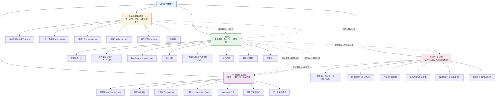

# 第07章 离散概率 — 章节汇总

> [!abstract] 概览
> 第7章系统介绍了==离散概率==（Discrete Probability）的完整理论体系，是离散数学中"不确定性量化"思想的核心章节。全章从==拉普拉斯等可能概率==出发（7.1），建立样本空间、事件、概率的基本概念与性质；进而引入==条件概率==与==独立性==，建立伯努利试验与二项分布模型，并介绍蒙特卡洛算法与概率方法等应用（7.2）；然后深入==贝叶斯定理==（7.3），通过全概率公式与先验-后验推理框架，展示"由果推因"的逆向概率推断能力；最后系统研究==期望值与方差==（7.4），建立随机变量的数字特征理论，并利用马尔可夫不等式与切比雪夫不等式对概率做出定量估计。全章体现了从"基本概率计算"到"条件概率推理"再到"贝叶斯推断"与"数字特征分析"的完整知识链条，为算法平均情况分析、概率算法设计、机器学习等高级主题奠定了数学基础。

---

## 全章知识框架



---

## 各节核心知识点汇总

| 小节 | 核心概念 | 关键公式/定理 | 与前后节的关联 |
|:-----|:---------|:-------------|:---------------|
| 7.1 离散概率导论 | 样本空间、事件、拉普拉斯概率、补事件、互斥事件、容斥原理 | $p(E) = \dfrac{\|E\|}{\|S\|}$；$p(\overline{E}) = 1 - p(E)$；$p(E_1 \cup E_2) = p(E_1) + p(E_2) - p(E_1 \cap E_2)$ | 全章基石，将概率转化为计数问题（衔接第6章）；为 7.2 的概率赋值提供特例 |
| 7.2 概率论 | 概率赋值、条件概率、独立性、乘法规则、伯努利试验、二项分布、蒙特卡洛算法、概率方法 | $p(E\|F) = \dfrac{p(E \cap F)}{p(F)}$；$p(E \cap F) = p(E) \cdot p(F)$；$b(k; n, p) = \dbinom{n}{k} p^k q^{n-k}$ | 推广 7.1 的等可能概率到一般概率分布；条件概率是 7.3 贝叶斯定理的直接前提；二项分布的期望方差在 7.4 中深入讨论 |
| 7.3 贝叶斯定理 | 全概率公式、贝叶斯定理（基本/广义形式）、先验概率、后验概率、似然、贝叶斯垃圾邮件过滤 | $p(F_j\|E) = \dfrac{p(E\|F_j) \cdot p(F_j)}{\sum_{i} p(E\|F_i) \cdot p(F_i)}$；$p(E) = \sum_{i} p(E\|F_i)p(F_i)$ | 直接基于 7.2 的条件概率定义；后验概率为决策推断提供量化基础（联系 7.4 的期望值） |
| 7.4 期望值与方差 | 期望值、期望的线性性、几何分布、独立随机变量、方差、标准差、马尔可夫不等式、切比雪夫不等式 | $E(X) = \sum p(s) \cdot X(s)$；$V(X) = E(X^2) - [E(X)]^2$；$P(\|X - \mu\| \geq r) \leq \dfrac{\sigma^2}{r^2}$ | 利用 7.2 的随机变量与概率分布；Bernoulli 试验的期望 $np$、方差 $npq$ 是二项分布的数字特征总结 |

---

## 学习脉络

```
离散概率导论（7.1）— 样本空间、事件、拉普拉斯概率 p(E) = |E|/|S|，概率的公理化基础
  ↓
概率论（7.2）— 从等可能到一般概率赋值，引入条件概率 p(E|F) 与独立性，建立二项分布模型
  ↓
贝叶斯定理（7.3）— 全概率公式 + 条件概率 → 贝叶斯定理，实现"由果推因"的逆向推理
  ↓
期望值与方差（7.4）— 随机变量的数字特征：期望（中心位置）、方差（离散程度）、概率不等式
```

**学习建议**：7.1 节是全章的基石——务必透彻理解拉普拉斯概率定义 $p(E) = |E|/|S|$ 将概率问题转化为计数问题的核心思想，以及补事件公式 $p(\overline{E}) = 1 - p(E)$ 在"至少一个"类问题中的威力，Monty Hall 三门问题是检验概率直觉的经典案例；7.2 节是概率论的核心扩展——条件概率 $p(E|F)$ 是全章最重要的概念之一，它回答"已知 $F$ 发生后 $E$ 的概率是多少"，独立性 $p(E \cap F) = p(E) \cdot p(F)$ 与互斥事件 $E \cap F = \emptyset$ 的区别是高频考点，伯努利试验与二项分布 $b(k; n, p)$ 为重复独立实验提供了精确模型，蒙特卡洛算法展示了概率论在计算机科学中的实际威力；7.3 节是逆向推理的利器——贝叶斯定理的核心是"翻转条件方向"：从 $p(E|F)$（已知原因求结果）到 $p(F|E)$（已知结果求原因），全概率公式是贝叶斯定理分母的计算工具，稀有疾病检测悖论揭示了先验概率在贝叶斯推理中的关键作用，贝叶斯垃圾邮件过滤器是定理的精彩应用；7.4 节是数字特征的理论总结——期望值 $E(X)$ 是随机变量的加权平均，期望的线性性 $E(X+Y) = E(X)+E(Y)$ 无条件成立，指示变量技巧是解决复杂期望问题的利器（如帽子检查问题），方差 $V(X) = E(X^2) - [E(X)]^2$ 衡量离散程度，切比雪夫不等式仅凭期望和方差就能对概率做出定量估计。

---

## 跨节综合复习题

> [!problem] 综合复习题 1（跨 7.1 / 7.2 / 7.4）
> **题目：** (a) 从一副标准52张扑克牌中随机抽取5张，求恰好获得"同花"（flush，即5张牌花色相同）的概率。
> (b) 将上述实验视为5次不放回的伯努利试验（每次"成功"=抽到指定花色），解释为何不能直接套用二项分布公式。
> (c) 设 $X$ 为从52张牌中有放回地抽取5张时指定花色出现的次数，求 $E(X)$ 和 $V(X)$。

> [!faq]- 解答
> **(a)** 样本空间：从52张牌中选5张，$|S| = \binom{52}{5} = 2{,}598{,}960$。
>
> "同花"的方法数：先从4种花色中选1种（$\binom{4}{1} = 4$），再从该花色的13张牌中选5张（$\binom{13}{5} = 1287$）。
>
> 由乘法规则：$|E| = 4 \times 1287 = 5148$。
>
> $$p(\text{同花}) = \frac{5148}{2{,}598{,}960} = \frac{33}{16660} \approx 0.00198$$
>
> **(b)** 二项分布要求每次试验==独立==且成功概率==固定==。不放回抽取时，每次抽取的条件概率会随之前的结果变化（例如第一次抽到红心后，第二次抽到红心的概率从 $13/52$ 变为 $12/51$），因此各次试验不独立，不能直接套用二项分布公式。
>
> **(c)** 有放回抽取时，每次抽到指定花色的概率 $p = 13/52 = 1/4$，$q = 3/4$，共 $n = 5$ 次独立伯努利试验。
>
> $$E(X) = np = 5 \times \frac{1}{4} = \frac{5}{4} = 1.25$$
>
> $$V(X) = npq = 5 \times \frac{1}{4} \times \frac{3}{4} = \frac{15}{16} \approx 0.9375$$
>
> $\blacksquare$

> [!problem] 综合复习题 2（跨 7.2 / 7.3 / 7.4）
> **题目：** 某工厂有三条生产线 $F_1, F_2, F_3$，分别生产总产品的 50%、30%、20%。各线的不合格率分别为 2%、3%、1%。一件产品被随机抽检。
> (a) 用全概率公式求该产品不合格的概率。
> (b) 若该产品被检测为不合格，用贝叶斯定理求它来自 $F_2$ 的概率。
> (c) 设 $X$ 为从 $F_1$ 生产的100件产品中不合格品的数量，求 $E(X)$ 和 $V(X)$，并用切比雪夫不等式估计 $X$ 偏离均值超过5的概率上界。

> [!faq]- 解答
> **(a)** 设 $E$ 为"产品不合格"。由全概率公式：
> $$p(E) = p(E|F_1) \cdot p(F_1) + p(E|F_2) \cdot p(F_2) + p(E|F_3) \cdot p(F_3)$$
> $$= 0.02 \times 0.50 + 0.03 \times 0.30 + 0.01 \times 0.20 = 0.010 + 0.009 + 0.002 = 0.021$$
>
> **(b)** 由贝叶斯定理：
> $$p(F_2|E) = \frac{p(E|F_2) \cdot p(F_2)}{p(E)} = \frac{0.03 \times 0.30}{0.021} = \frac{0.009}{0.021} = \frac{3}{7} \approx 0.4286$$
>
> 虽然 $F_2$ 只生产了 30% 的产品，但因其不合格率最高（3%），在不合格产品中来自 $F_2$ 的概率超过 42%。
>
> **(c)** $F_1$ 生产的每件产品不合格概率 $p = 0.02$，$q = 0.98$，$n = 100$。
>
> $$E(X) = np = 100 \times 0.02 = 2$$
>
> $$V(X) = npq = 100 \times 0.02 \times 0.98 = 1.96$$
>
> 由切比雪夫不等式，取 $r = 5$：
> $$P(|X - 2| \geq 5) \leq \frac{1.96}{25} = 0.0784$$
>
> 即不合格品数量偏离均值超过5的概率不超过 7.84%。
>
> $\blacksquare$

> [!problem] 综合复习题 3（跨 7.1 / 7.2 / 7.3 / 7.4）
> **题目：** 某疾病的人群患病率为 1%。一种检测方法对患病者有 95% 的真阳性率，对未患病者有 90% 的真阴性率。现对随机选取的一人进行检测。
> (a) 用贝叶斯定理求检测为阳性时实际患病的概率。
> (b) 若对该人独立重复检测3次，且3次均呈阳性，假设各次检测条件独立，求此时实际患病的后验概率。
> (c) 设 $Y$ 为对100个随机选取的人进行检测时真阳性的人数，求 $E(Y)$ 和 $V(Y)$。

> [!faq]- 解答
> **(a)** 设 $F$ 为"患病"，$E$ 为"检测为阳性"。
>
> - $p(F) = 0.01$，$p(\overline{F}) = 0.99$
> - $p(E|F) = 0.95$（真阳性率），$p(E|\overline{F}) = 1 - 0.90 = 0.10$（假阳性率）
>
> 由贝叶斯定理：
> $$p(F|E) = \frac{p(E|F) \cdot p(F)}{p(E|F) \cdot p(F) + p(E|\overline{F}) \cdot p(\overline{F})}$$
> $$= \frac{0.95 \times 0.01}{0.95 \times 0.01 + 0.10 \times 0.99} = \frac{0.0095}{0.0095 + 0.099} = \frac{0.0095}{0.1085} \approx 0.0876$$
>
> 仅有约 8.76% 的阳性检测者实际患病——这是典型的稀有疾病悖论。
>
> **(b)** 3次独立检测均呈阳性，在条件独立的假设下：
> - 患病者3次均阳性的概率：$p(E_1 \cap E_2 \cap E_3|F) = (0.95)^3 = 0.857375$
> - 未患病者3次均阳性的概率：$p(E_1 \cap E_2 \cap E_3|\overline{F}) = (0.10)^3 = 0.001$
>
> 由贝叶斯定理（以"3次均阳性"为新证据 $E^*$）：
> $$p(F|E^*) = \frac{(0.95)^3 \times 0.01}{(0.95)^3 \times 0.01 + (0.10)^3 \times 0.99}$$
> $$= \frac{0.00857375}{0.00857375 + 0.00099} = \frac{0.00857375}{0.00956375} \approx 0.8965$$
>
> 重复检测使后验概率从 8.76% 大幅提升至约 89.65%，接近确诊。
>
> **(c)** 100人中每人患病概率 $p = 0.01$，真阳性率 $0.95$。每个人是真阳性的概率为 $p \times 0.95 = 0.0095$。
>
> $Y$ 服从 $n = 100$、$p' = 0.0095$ 的二项分布：
> $$E(Y) = 100 \times 0.0095 = 0.95$$
> $$V(Y) = 100 \times 0.0095 \times (1 - 0.0095) = 100 \times 0.0095 \times 0.9905 \approx 0.9410$$
>
> $\blacksquare$

---

## 笔记索引

| 小节 | 笔记链接 | 核心主题 |
|:-----|:---------|:---------|
| 7.1 | [[7.1 离散概率导论]] | 样本空间、事件、拉普拉斯概率 $p(E) = \|E\|/\|S\|$、补事件公式、容斥原理、互斥事件、Monty Hall 三门问题 |
| 7.2 | [[7.2 概率论]] | 概率赋值、条件概率 $p(E\|F)$、独立性、乘法规则、伯努利试验、二项分布 $b(k; n, p)$、生日问题、蒙特卡洛算法、概率方法 |
| 7.3 | [[7.3 贝叶斯定理]] | 全概率公式、贝叶斯定理（基本/广义形式）、先验与后验概率、医疗诊断、贝叶斯垃圾邮件过滤器 |
| 7.4 | [[7.4 期望值与方差]] | 期望值 $E(X)$、期望的线性性、几何分布、方差 $V(X)$、Bienaymé 公式、马尔可夫不等式、切比雪夫不等式 |

#学习/离散数学/离散概率
