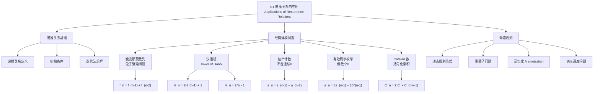

**相关笔记：** [[第07章_离散概率-章节汇总|第07章汇总]] | [[8.2 求解线性递推关系]]

> [!abstract] 概览
> 本节系统介绍了==递推关系（recurrence relation）==在建模和求解计数问题中的应用。递推关系通过==将问题分解为规模更小的子问题==来建立数学模型，是解决许多第6章方法难以直接处理的计数问题的强大工具。
>
> - ==递推关系==将序列的第 $n$ 项表示为前面若干项的函数，配合==初始条件==唯一确定整个序列
> - 经典应用：[[离散数学/concepts/Fibonacci数]]（兔子繁殖）、[[汉诺塔]]（最少移动次数）、位串计数、有效码字枚举
> - 建模方法：分析问题的==递归结构==，将第 $n$ 步的解分解为==互不重叠的若干情况==
> - ==动态规划（dynamic programming）==：通过递推关系求解==重叠子问题==的算法范式，利用==记忆化（memoization）==避免重复计算
> - Catalan 数列：满足递推关系 $C_n = \sum_{k=0}^{n-1} C_k C_{n-k-1}$，闭式公式 $C_n = \frac{1}{n+1}\binom{2n}{n}$

---

## 一、知识结构总览

---

## 二、核心思想

> [!tip] 核心思想
> 本节的核心思想是==递推建模==（recurrence modeling）：许多计数问题无法用第6章的基本计数技术（排列、组合等）直接求解，但可以通过分析问题的==递归结构==，将第 $n$ 步的解表示为==前面若干步的解的组合==，从而建立递推关系。递推关系配合初始条件唯一确定一个序列，再通过==迭代法==或其他求解技术（8.2节将系统介绍）可以得到显式公式。此外，递推关系还是==动态规划==算法的理论基础——通过将问题分解为重叠子问题并记忆化存储中间结果，可以高效求解许多优化问题。

### 1. 递推关系的基本概念

> [!def] 递推关系（Recurrence Relation）
> 一个==递推关系==是将序列 $\{a_n\}$ 的第 $n$ 项表示为前面若干项的函数的等式。如果一个序列的项满足某个递推关系，则称该序列为该递推关系的一个==解==（solution）。
>
> 递推关系的一般形式为：
> $$a_n = f(a_{n-1}, a_{n-2}, \ldots, a_{n-k}, n)$$
>
> 其中 $k$ 称为递推关系的==阶==（degree）。要唯一确定一个序列，除了递推关系外，还需要 $k$ 个==初始条件==（initial conditions）：
> $$a_0 = C_0, \quad a_1 = C_1, \quad \ldots, \quad a_{k-1} = C_{k-1}$$
>
> - 递推关系是[[第05章_归纳与递归/5.3 递归定义与结构归纳|第5章递归定义]]的自然延伸
> - 第二数学归纳原理保证了递推关系加上初始条件能唯一确定一个序列

> [!example] 细菌繁殖问题
> 假设一个菌落中的细菌数量每小时翻倍，初始有5个细菌。设 $a_n$ 为 $n$ 小时后的细菌数量。
>
> 递推关系：$a_n = 2a_{n-1}$（$n \geq 1$）
>
> 初始条件：$a_0 = 5$
>
> 用迭代法求解：
> $$a_n = 2a_{n-1} = 2^2 a_{n-2} = \cdots = 2^n a_0 = 5 \cdot 2^n$$

### 2. 斐波那契数列——兔子繁殖问题

> [!def] 斐波那契数列（Fibonacci Sequence）
> 13世纪，Leonardo Pisano（即 Fibonacci）在其著作《Liber abaci》中提出了如下问题：
>
> 一对幼兔（一公一母）被放置在岛上。兔子在2个月大之前不会繁殖，2个月大之后每对兔子每月产生一对新兔子。假设兔子永不死亡，求 $n$ 个月后岛上兔子对数的递推关系。
>
> 设 $f_n$ 为 $n$ 个月后兔子对数，则：
>
> $$f_n = f_{n-1} + f_{n-2} \quad (n \geq 3)$$
>
> 初始条件：$f_1 = 1$，$f_2 = 1$
>
> - $f_{n-1}$：上个月已有的兔子对数
> - $f_{n-2}$：本月新出生的兔子对数（来自至少2个月大的兔子对）

> [!info] 斐波那契数列的前几项
> $f_1 = 1, f_2 = 1, f_3 = 2, f_4 = 3, f_5 = 5, f_6 = 8, f_7 = 13, f_8 = 21, \ldots$
>
> 斐波那契数列在自然界中广泛出现，包括花瓣数量、松果螺旋数、向日葵种子排列等。

### 3. 汉诺塔问题（Tower of Hanoi）

> [!def] 汉诺塔问题
> 19世纪末法国数学家 Edouard Lucas 发明的经典谜题：三个柱子上放有大小不同的 $n$ 个圆盘，初始时所有圆盘按大小顺序放在第一个柱子上（最大的在底部）。规则：每次只能移动一个圆盘，且不能将较大的圆盘放在较小的圆盘上面。目标：将所有圆盘移到第二个柱子上。
>
> 设 $H_n$ 为解决 $n$ 个圆盘的汉诺塔问题所需的最少移动次数。

> [!thm] 汉诺塔的递推关系与解
> **递推关系**：$H_n = 2H_{n-1} + 1$（$n \geq 2$）
>
> **初始条件**：$H_1 = 1$
>
> **推导过程**：
> 1. 将上面 $n-1$ 个圆盘从柱1移到柱3，需要 $H_{n-1}$ 步
> 2. 将最大的圆盘从柱1移到柱2，需要 $1$ 步
> 3. 将 $n-1$ 个圆盘从柱3移到柱2，需要 $H_{n-1}$ 步
> 4. 总计：$H_n = H_{n-1} + 1 + H_{n-1} = 2H_{n-1} + 1$
>
> **迭代法求解**：
> $$H_n = 2H_{n-1} + 1 = 2(2H_{n-2} + 1) + 1 = 2^2 H_{n-2} + 2 + 1$$
> $$= 2^2(2H_{n-3} + 1) + 2 + 1 = 2^3 H_{n-3} + 2^2 + 2 + 1$$
> $$\vdots$$
> $$= 2^{n-1} H_1 + 2^{n-2} + 2^{n-3} + \cdots + 2 + 1$$
> $$= 2^{n-1} + 2^{n-2} + \cdots + 2 + 1 = 2^n - 1$$
>
> 最后一步使用了等比数列求和公式。

> [!example] 汉诺塔传说
> 传说中，河内的僧侣们正在转移64个金盘。从显式公式可知，需要 $2^{64} - 1 = 18{,}446{,}744{,}073{,}709{,}551{,}615$ 步。即使每秒移动一个圆盘，也需要超过5000亿年才能完成——世界应该还能安全存在相当长的时间。

### 4. 位串计数问题

> [!example] 不含两个连续0的位串
> **问题**：求长度为 $n$ 且不含两个连续0的位串数量的递推关系。
>
> **解法**：设 $a_n$ 为长度为 $n$ 且不含两个连续0的位串数量（$n \geq 3$）。
>
> 按最后一位分类：
> - **以1结尾**：去掉最后的1，得到长度为 $n-1$ 的不含连续0的位串，共 $a_{n-1}$ 个
> - **以0结尾**：倒数第二位必须是1（否则出现连续0），去掉最后的10，得到长度为 $n-2$ 的不含连续0的位串，共 $a_{n-2}$ 个
>
> 因此：$a_n = a_{n-1} + a_{n-2}$（$n \geq 3$）
>
> 初始条件：$a_1 = 2$（位串 0 和 1），$a_2 = 3$（位串 01、10、11）
>
> 计算 $a_5$：
> $$a_3 = a_2 + a_1 = 3 + 2 = 5$$
> $$a_4 = a_3 + a_2 = 5 + 3 = 8$$
> $$a_5 = a_4 + a_3 = 8 + 5 = 13$$
>
> 注意：$\{a_n\}$ 满足与斐波那契数列相同的递推关系。因为 $a_1 = f_3$ 且 $a_2 = f_4$，所以 $a_n = f_{n+2}$。

### 5. 有效码字枚举

> [!example] 有效码字问题
> **问题**：一个计算机系统将含有偶数个0的十进制数字串视为有效码字。设 $a_n$ 为有效的 $n$ 位码字数量，求递推关系。
>
> **解法**：
>
> 初始条件：$a_1 = 9$（10个一位数字串中，只有"0"不是有效的）
>
> 递推关系的建立：从长度为 $n-1$ 的串构造长度为 $n$ 的有效串，有两种方式：
> 1. 在有效的 $(n-1)$ 位串后面追加一个非0数字（9种选择）：$9a_{n-1}$ 种
> 2. 在无效的 $(n-1)$ 位串后面追加一个0（无效串有奇数个0，加0后变偶数个）：$10^{n-1} - a_{n-1}$ 种
>
> 因此：
> $$a_n = 9a_{n-1} + (10^{n-1} - a_{n-1}) = 8a_{n-1} + 10^{n-1}$$

### 6. Catalan 数列——括号化乘积

> [!def] Catalan 数列
> 设 $C_n$ 为将 $n+1$ 个数 $x_0 \cdot x_1 \cdot x_2 \cdots x_n$ 的乘积通过加括号来确定乘法顺序的方法数。
>
> 例如 $C_3 = 5$，因为 $x_0 \cdot x_1 \cdot x_2 \cdot x_3$ 有5种括号化方式：
> $$((x_0 \cdot x_1) \cdot x_2) \cdot x_3, \quad (x_0 \cdot (x_1 \cdot x_2)) \cdot x_3, \quad (x_0 \cdot x_1) \cdot (x_2 \cdot x_3)$$
> $$x_0 \cdot ((x_1 \cdot x_2) \cdot x_3), \quad x_0 \cdot (x_1 \cdot (x_2 \cdot x_3))$$
>
> **递推关系**：
> $$C_n = C_0 C_{n-1} + C_1 C_{n-2} + \cdots + C_{n-2} C_1 + C_{n-1} C_0 = \sum_{k=0}^{n-1} C_k C_{n-k-1}$$
>
> **初始条件**：$C_0 = 1$，$C_1 = 1$
>
> **闭式公式**：$C_n = \frac{1}{n+1}\binom{2n}{n}$（可用[[8.4 生成函数|8.4节的生成函数]]方法证明）
>
> **渐近估计**：$C_n \sim \frac{4^n}{n^{3/2}\sqrt{\pi}}$

> [!info] Catalan 数列的推导思路
> 无论怎样在 $x_0 \cdot x_1 \cdots x_n$ 中插入括号，总有最后一个执行的乘法运算，它对应某个" $\cdot$ "运算符。假设这个运算符位于 $x_k$ 和 $x_{k+1}$ 之间，则：
> - $x_0 \cdot x_1 \cdots x_k$ 有 $C_k$ 种括号化方式
> - $x_{k+1} \cdot x_{k+2} \cdots x_n$ 有 $C_{n-k-1}$ 种括号化方式
> - 两者独立，共 $C_k \cdot C_{n-k-1}$ 种
>
> $k$ 可以取 $0, 1, \ldots, n-1$，对所有情况求和即得递推关系。

### 7. 动态规划（Dynamic Programming）

> [!def] 动态规划
> ==动态规划==是一种算法范式，通过==将问题递归地分解为更简单的重叠子问题==，并利用子问题的解来构造原问题的解。递推关系通常用于从子问题的解推导出整体解。
>
> 关键技术——==记忆化（memoization）==：在计算过程中==存储每个子问题的解==，避免重复计算，将指数级复杂度降低为多项式级。
>
> 动态规划由数学家 Richard Bellman 在1950年代提出，广泛应用于经济学、计算机视觉、语音识别、人工智能、计算机图形学、生物信息学等领域。

> [!example] 讲座调度问题
> **问题**：有 $n$ 个讲座，讲座 $j$ 开始时间为 $s_j$，结束时间为 $e_j$，参加人数为 $w_j$。要求选择一个兼容的讲座子集，使总参加人数最大。
>
> **建模**：按结束时间排序，重新编号使 $e_1 \leq e_2 \leq \cdots \leq e_n$。定义 $p(j)$ 为与讲座 $j$ 兼容的、结束时间最晚且在讲座 $j$ 之前的讲座编号（若不存在则 $p(j) = 0$）。
>
> 设 $T(j)$ 为前 $j$ 个讲座的最优调度方案的最大总参加人数。
>
> **递推关系**：
> $$T(j) = \max(w_j + T(p(j)),\; T(j-1))$$
>
> - $w_j + T(p(j))$：讲座 $j$ 被选入最优方案
> - $T(j-1)$：讲座 $j$ 不被选入最优方案
>
> **初始条件**：$T(0) = 0$
>
> **算法复杂度**：排序 $O(n \log n)$，计算 $p(j)$ 和 $T(j)$ 共 $O(n^2)$，总体 $O(n^2)$。

> [!warning] 建立递推关系的常见策略
> 建立递推关系的关键是==找到问题的递归结构==，常用策略包括：
> 1. **分类讨论法**：将第 $n$ 步的所有可能情况按某种标准分类（如按最后一个元素分类），分别计算各类的数量后求和
> 2. **分解法**：将问题分解为若干独立的子问题，利用乘法原理
> 3. **增删法**：考虑从长度为 $n-1$ 的解如何构造长度为 $n$ 的解（如追加元素、插入元素等）
> 4. **逆向分析法**：从最终状态倒推，分析最后一步操作的可能情况
>
> 注意：必须确保分类==不重不漏==，且每类的计数可以表示为前面项的函数。

---

## 三、补充理解与易混淆点

### 补充理解

> [!info] 补充1：递推关系与数学归纳法的天然联系
> 递推关系和[[第05章_归纳与递归/5.1 数学归纳法|数学归纳法]]是一体两面：
> - 递推关系提供了==归纳步骤==：$a_n$ 如何从 $a_{n-1}$ 等前项得到
> - 初始条件提供了==基础步骤==：$a_0, a_1, \ldots$ 的值
> - 用迭代法求出显式公式后，通常需要用数学归纳法来==严格证明==公式的正确性
>
> 例如，汉诺塔的公式 $H_n = 2^n - 1$ 可以通过数学归纳法验证：
> - 基础：$H_1 = 1 = 2^1 - 1$ ✓
> - 归纳：假设 $H_k = 2^k - 1$，则 $H_{k+1} = 2H_k + 1 = 2(2^k - 1) + 1 = 2^{k+1} - 1$ ✓
> 来源：Rosen, K. H. (2019). *Discrete Mathematics and Its Applications* (8th ed.), McGraw-Hill, Section 8.1.
> 来源：Graham, R. L., Knuth, D. E. & Patashnik, O. (1994). *Concrete Mathematics* (2nd ed.), Addison-Wesley, Chapter 1.

> [!info] 补充2：动态规划的命名趣闻
> Richard Bellman 在1950年代于 RAND 公司为美国军方项目工作时发明了"动态规划"一词。当时美国国防部长对数学研究持敌对态度，Bellman 认为需要一个不含"数学"一词的名字来确保经费。他选择了"dynamic"（动态的），因为他认为"没有人会对动态这个词有负面看法"，而"动态规划"是"连国会议员都无法反对的东西"。
> 来源：Bellman, R. (1984). "Eye of the Hurricane: An Autobiography." World Scientific, Chapter 8.
> 来源：Cormen, T. H., et al. (2009). *Introduction to Algorithms* (3rd ed.), MIT Press, Chapter 15.

> [!info] 补充3：Reve's Puzzle 与 Frame-Stewart 算法
> 汉诺塔的一个经典变体是 Reve's Puzzle（1907年由 Henry Dudeney 提出），使用四个柱子。Frame 和 Stewart 在1939年提出了一个算法，2014年 Thierry Bousch 证明了该算法使用了最少的移动步数。设 $R(n)$ 为 $n$ 个圆盘四柱汉诺塔的最少步数，取 $k$ 为满足 $n \leq k(k+1)/2$ 的最小整数，则：
> $$R(n) = 2R(n-k) + 2^k - 1$$
> 来源：Frame, J. S. (1941). "The Tower of Hanoi Problem with More Pegs." Unpublished manuscript, cited in Stewart, B. M. (1941).
> 来源：Rosen, K. H. (2019). *Discrete Mathematics and Its Applications* (8th ed.), McGraw-Hill, Section 8.1.

### 易混淆点

> [!warning] 误区：递推关系与递归定义的混淆
> - ❌ 认为递推关系和递归定义是完全相同的概念
> - ✅ 递归定义（[[第05章_归纳与递归/5.3 递归定义与结构归纳|第5章]]）是更一般的概念，递推关系是递归定义的一种特殊形式，专门用于定义==序列==
> - 递推关系关注的是序列各项之间的==数值关系==，而递归定义还可以定义集合、字符串、树等结构

> [!warning] 误区：遗漏初始条件
> - ❌ 只写出递推关系就认为问题已解决
> - ✅ 递推关系必须配合==足够的初始条件==才能唯一确定序列
> - 阶为 $k$ 的递推关系需要恰好 $k$ 个初始条件
> - 不同的初始条件会导致完全不同的解，即使递推关系相同

> [!warning] 误区：分类讨论时的遗漏或重复
> - ❌ 建立递推关系时，分类不完整或各类之间存在重叠
> - ✅ 必须确保所有情况被==恰好覆盖一次==
> - 例如在位串计数问题中，按最后一位分类自然地做到了不重不漏（每个位串的最后一位要么是0要么是1）

---

## 四、习题精选

> [!todo] 习题概览
> | 题号范围 | 核心考点 | 难度 |
> |---------|---------|------|
> | 1-2 | 递推关系的验证与迭代求解 | ⭐⭐ |
> | 3-5 | 货币支付/存款问题的递推关系 | ⭐⭐ |
> | 6-9 | 严格递增序列的递推关系 | ⭐⭐⭐ |
> | 7-10 | 位串计数（含/不含特定子串） | ⭐⭐⭐ |
> | 11-12 | 爬楼梯问题（1步/2步/3步） | ⭐⭐ |
> | 13-18 | 三进制字符串计数 | ⭐⭐⭐ |
> | 19-20 | 通信信号/硬币组合问题 | ⭐⭐⭐ |
> | 21-23 | 直线/大圆/平面分割区域 | ⭐⭐⭐ |
> | 24-25 | 偶数个0的位串 | ⭐⭐⭐ |
> | 26-27 | 骨牌覆盖/地砖铺设 | ⭐⭐⭐ |
> | 28 | 斐波那契数的整除性 | ⭐⭐⭐⭐ |
> | 29 | 满射函数的递推关系 | ⭐⭐⭐⭐ |
> | 30-31 | Catalan 数的计算 | ⭐⭐⭐ |
> | 32-37 | Josephus 问题变体 | ⭐⭐⭐⭐ |
> | 38-45 | Reve's Puzzle（四柱汉诺塔） | ⭐⭐⭐⭐ |
> | 46-52 | 差分方程与递推关系 | ⭐⭐⭐ |
> | 53-57 | 动态规划算法 | ⭐⭐⭐⭐ |

### 题1：汉诺塔公式的数学归纳法验证

> [!problem] 题目
> 用数学归纳法验证汉诺塔问题的解 $H_n = 2^n - 1$。

> [!faq]- 解答
> **证明**：对 $n$ 进行数学归纳。
>
> **基础步骤**：$n = 1$ 时，$H_1 = 1 = 2^1 - 1$，成立。
>
> **归纳步骤**：假设 $H_k = 2^k - 1$ 对某个 $k \geq 1$ 成立。则：
> $$H_{k+1} = 2H_k + 1 = 2(2^k - 1) + 1 = 2^{k+1} - 2 + 1 = 2^{k+1} - 1$$
>
> 因此 $H_{k+1} = 2^{k+1} - 1$ 也成立。
>
> 由数学归纳法，$H_n = 2^n - 1$ 对所有正整数 $n$ 成立。
>
> $\blacksquare$

### 题2：位串中含两个连续0的递推关系

> [!problem] 题目
> 求长度为 $n$ 的位串中恰好含有两个连续0的位串数量的递推关系和初始条件，并计算长度为7的位串中有多少个含两个连续0。

> [!faq]- 解答
> 设 $a_n$ 为长度为 $n$ 且含两个连续0的位串数量。
>
> **递推关系**：$a_n = a_{n-1} + a_{n-2} + 2^{n-3}$（$n \geq 4$）
>
> **推导**：按长度为 $n$ 的位串的最后几位分类：
> - 情况1：最后一位是1。去掉最后的1，得到长度为 $n-1$ 且含两个连续0的位串，共 $a_{n-1}$ 个
> - 情况2：最后两位是01。去掉最后的01，得到长度为 $n-2$ 且含两个连续0的位串，共 $a_{n-2}$ 个
> - 情况3：最后两位是00，且前面没有两个连续0。此时第 $n-3$ 位必须是1（否则前面就有连续0了），前 $n-3$ 位是任意不含两个连续0的位串。不含两个连续0的长度为 $n-3$ 的位串数为 $2^{n-3} - a_{n-3}$... 但更简单的方法是：最后三位是100，前 $n-3$ 位不含两个连续0。
>
> **初始条件**：$a_1 = 0$，$a_2 = 1$（即"00"），$a_3 = 3$（"000"、"001"、"100"）
>
> **迭代计算**：
> $$a_4 = a_3 + a_2 + 2^{1} = 3 + 1 + 2 = 6$$
> $$a_5 = a_4 + a_3 + 2^{2} = 6 + 3 + 4 = 13$$
> $$a_6 = a_5 + a_4 + 2^{3} = 13 + 6 + 8 = 27$$
> $$a_7 = a_6 + a_5 + 2^{4} = 27 + 13 + 16 = 56$$
>
> 因此长度为7的位串中有56个含两个连续0。

### 题3：爬楼梯问题

> [!problem] 题目
> 一个人爬楼梯，每次可以上1级或2级台阶。求爬 $n$ 级台阶的方法数的递推关系、初始条件，并计算爬8级台阶有多少种方法。

> [!faq]- 解答
> 设 $a_n$ 为爬 $n$ 级台阶的方法数。
>
> **递推关系**：$a_n = a_{n-1} + a_{n-2}$（$n \geq 3$）
>
> **推导**：最后一步要么上1级（前面爬了 $n-1$ 级，$a_{n-1}$ 种方法），要么上2级（前面爬了 $n-2$ 级，$a_{n-2}$ 种方法）。
>
> **初始条件**：$a_1 = 1$（只上1级），$a_2 = 2$（1+1 或 2）
>
> **迭代计算**：
> $$a_3 = 2 + 1 = 3, \quad a_4 = 3 + 2 = 5, \quad a_5 = 5 + 3 = 8$$
> $$a_6 = 8 + 5 = 13, \quad a_7 = 13 + 8 = 21, \quad a_8 = 21 + 13 = 34$$
>
> 爬8级台阶有34种方法。
>
> 注意：$\{a_n\}$ 实际上就是从 $a_1 = f_2 = 1$ 开始的斐波那契数列，即 $a_n = f_{n+1}$。
>
> $\blacksquare$

### 题4：骨牌覆盖问题

> [!problem] 题目
> 求用 $1 \times 2$ 的多米诺骨牌完全覆盖 $2 \times n$ 棋盘的方法数的递推关系和初始条件。

> [!faq]- 解答
> 设 $a_n$ 为用 $1 \times 2$ 骨牌完全覆盖 $2 \times n$ 棋盘的方法数。
>
> **递推关系**：$a_n = a_{n-1} + a_{n-2}$（$n \geq 3$）
>
> **推导**：考虑棋盘右上角位置的覆盖方式：
> - 情况1：右上角被一个==水平放置==的骨牌覆盖。去掉最右边一列，剩下 $2 \times (n-1)$ 棋盘，有 $a_{n-1}$ 种方法
> - 情况2：右上角被一个==垂直放置==的骨牌覆盖。此时右上角和右下角各有一个垂直骨牌，去掉最右边两列，剩下 $2 \times (n-2)$ 棋盘，有 $a_{n-2}$ 种方法
>
> **初始条件**：$a_1 = 1$（一块垂直骨牌），$a_2 = 2$（两块水平或两块垂直）
>
> 这又是斐波那契数列！$a_n = f_{n+1}$。
>
> $\blacksquare$

### 题5：动态规划——讲座调度

> [!problem] 题目
> 有7个讲座，开始时间、结束时间和参加人数如下：
>
> | 讲座 | 开始时间 | 结束时间 | 参加人数 |
> |------|---------|---------|---------|
> | 1 | 8:00 | 10:00 | 20 |
> | 2 | 9:00 | 11:00 | 10 |
> | 3 | 10:30 | 12:00 | 50 |
> | 4 | 9:30 | 13:00 | 30 |
> | 5 | 8:30 | 14:00 | 15 |
> | 6 | 11:00 | 14:00 | 25 |
> | 7 | 13:00 | 14:00 | 40 |
>
> 用动态规划算法求最大总参加人数。

> [!faq]- 解答
> **第一步**：按结束时间排序（已排好序）。
>
> **第二步**：计算 $p(j)$（与讲座 $j$ 兼容的最近讲座）：
> - $p(1) = 0$，$p(2) = 0$（讲座1和2之前没有兼容讲座）
> - $p(3) = 1$（讲座3兼容讲座1，不兼容讲座2）
> - $p(4) = 0$（讲座4不兼容讲座1、2、3）
> - $p(5) = 0$（讲座5不兼容讲座1-4）
> - $p(6) = 2$（讲座6兼容讲座2）
> - $p(7) = 4$（讲座7兼容讲座4）
>
> **第三步**：递推计算 $T(j)$：
> $$T(0) = 0$$
> $$T(1) = \max(20 + T(0), T(0)) = \max(20, 0) = 20$$
> $$T(2) = \max(10 + T(0), T(1)) = \max(10, 20) = 20$$
> $$T(3) = \max(50 + T(1), T(2)) = \max(50 + 20, 20) = 70$$
> $$T(4) = \max(30 + T(0), T(3)) = \max(30, 70) = 70$$
> $$T(5) = \max(15 + T(0), T(4)) = \max(15, 70) = 70$$
> $$T(6) = \max(25 + T(2), T(5)) = \max(25 + 20, 70) = 70$$
> $$T(7) = \max(40 + T(4), T(6)) = \max(40 + 70, 70) = 110$$
>
> 最大总参加人数为 $T(7) = 110$。
>
> **回溯最优方案**：$w_7 + T(p(7)) = 40 + 70 = 110 \geq T(6) = 70$，选讲座7。
> $w_3 + T(p(3)) = 50 + 20 = 70 = T(2) = 70$，选讲座3。
> $w_1 + T(p(1)) = 20 + 0 = 20 \geq T(0) = 0$，选讲座1。
>
> 最优方案：选择讲座1、3、7，总参加人数 $20 + 50 + 40 = 110$。
>
> $\blacksquare$

> [!tip] 解题思路提示
> 建立递推关系的解题方法论：
> 1. **明确变量**：设 $a_n$（或类似记号）表示要求解的量
> 2. **分类讨论**：将第 $n$ 步的所有可能情况按某个标准分类（如最后一个元素、第一步操作等）
> 3. **建立关系**：对每类情况，用前面项表示该类数量，然后求和
> 4. **确定初始条件**：根据问题的最小情况确定 $a_0, a_1, \ldots$ 的值
> 5. **验证**：用小规模情况手动验证递推关系和初始条件是否正确
> 6. **求解**：用迭代法或其他方法求出显式公式（如果需要）

---

## 五、视频学习指南

> [!info] 视频资源
> | 资源 | 链接 | 对应内容 | 备注 |
> |:-----|:-----|:---------|:-----|
> | Rosen 8e Section 8.1 | [教材原文](https://www.mheducation.com/highered/product/discrete-mathematics-applications-rosen/M9781259676512.html) | 完整定义、定理与例题 | 英文教材 |
> | 3Blue1Brown - Fibonacci | [链接](https://www.youtube.com/watch?v=KKt7iWQiOcg) | 斐波那契数列的几何直觉 | 英文，可视化讲解 |
> | MIT 6.042J - Recurrences | [链接](https://www.youtube.com/watch?v=9Mif8mZKOFc) | 递推关系与动态规划 | 英文，MIT开放课程 |

---

## 六、教材原文

> [!quote] 教材原文
> "Many counting problems cannot be solved easily using the methods discussed in Chapter 6. One such problem is: How many bit strings of length n do not contain two consecutive zeros? To solve this problem, let $a_n$ be the number of such strings of length n. An argument can be given that shows that the sequence $\{a_n\}$ satisfies the recurrence relation $a_{n+1} = a_n + a_{n-1}$ and the initial conditions $a_1 = 2$ and $a_2 = 3$."
>
> "An algorithm follows the dynamic programming paradigm when it recursively breaks down a problem into simpler overlapping subproblems, and computes the solution using the solutions of the subproblems. Generally, recurrence relations are used to find the overall solution from the solutions of the subproblems."

---

## 参见 Wiki

- [[离散数学/concepts/递推关系]] -- 递推关系的定义与分类
- [[离散数学/concepts/递推关系|斐波那契数列]] -- 斐波那契数列的性质与通项公式
- [[离散数学/concepts/递推关系|汉诺塔]] -- 汉诺塔问题的详细分析
- [[离散数学/concepts/递推关系|Catalan数]] -- Catalan 数列的各种组合解释
- [[离散数学/concepts/递推关系|动态规划]] -- 动态规划算法范式
- [[离散数学/concepts/递归定义|递归定义]] -- 第5章递归定义与结构归纳
- [[离散数学/concepts/数学归纳法|数学归纳法]] -- 数学归纳法验证递推解

#学习/离散数学/高级计数技术
