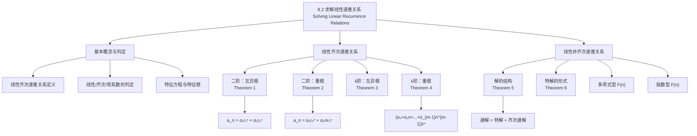

**相关笔记：** [[8.1 递推关系的应用]] | [[8.3 分治算法与递推关系]]

> [!abstract] 概览
> 本节系统介绍了==常系数线性递推关系==的求解方法，包括==线性齐次递推关系==的特征方程法和==线性非齐次递推关系==的特解叠加法。这些方法为8.1节中建立的递推关系提供了==系统化的求解工具==。
>
> - ==线性齐次递推关系== $a_n = c_1 a_{n-1} + \cdots + c_k a_{n-k}$ 通过==特征方程== $r^k - c_1 r^{k-1} - \cdots - c_k = 0$ 求解
> - ==特征根互异==时，通解为 $a_n = \alpha_1 r_1^n + \alpha_2 r_2^n + \cdots + \alpha_k r_k^n$
> - ==特征根有重根==时，$m$ 重根 $r$ 贡献 $(\alpha_0 + \alpha_1 n + \cdots + \alpha_{m-1} n^{m-1})r^n$
> - ==非齐次递推关系==的通解 = ==特解== + ==齐次通解==
> - 特解的形式由 $F(n)$ 的形式决定（Theorem 6），需考虑 $s$ 是否为特征根

---

## 一、知识结构总览

---

## 二、核心思想

> [!tip] 核心思想
> 本节的核心思想是==特征方程法==（characteristic equation method）：对于常系数线性递推关系，通过假设解的形式为 $a_n = r^n$，将递推关系转化为关于 $r$ 的代数方程（==特征方程==），从而将递推关系的求解问题转化为==多项式求根==问题。对于非齐次递推关系，利用==叠加原理==，将通解分解为齐次通解和特解两部分。这种方法为递推关系提供了==系统化、可操作的求解流程==，避免了8.1节中逐个问题寻找特殊技巧的局限。

### 1. 线性齐次递推关系的定义与判定

> [!def] 线性齐次递推关系（Linear Homogeneous Recurrence Relation）
> ==阶为 $k$ 的常系数线性齐次递推关系==是指形如
>
> $$a_n = c_1 a_{n-1} + c_2 a_{n-2} + \cdots + c_k a_{n-k}$$
>
> 的递推关系，其中 $c_1, c_2, \ldots, c_k$ 为实数且 $c_k \neq 0$。
>
> 名称中各术语的含义：
> - ==线性（linear）==：右边是前 $k$ 项的线性组合（每项乘以系数后相加）
> - ==齐次（homogeneous）==：没有不依赖于 $a_j$ 的项（即无常数项或 $F(n)$ 项）
> - ==常系数（constant coefficients）==：系数 $c_1, c_2, \ldots, c_k$ 是常数，不是 $n$ 的函数
> - ==阶为 $k$（degree $k$）==：$a_n$ 由前面 $k$ 项表示

> [!example] 判定示例
> - $P_n = 1.11 \cdot P_{n-1}$：线性齐次，阶为1 ✓
> - $f_n = f_{n-1} + f_{n-2}$：线性齐次，阶为2 ✓
> - $a_n = a_{n-5}$：线性齐次，阶为5 ✓
> - $a_n = a_{n-1} + a_{n-2}^2$：**不是线性的**（$a_{n-2}^2$ 是二次项）
> - $H_n = 2H_{n-1} + 1$：**不是齐次的**（有常数项 $+1$）
> - $B_n = n \cdot B_{n-1}$：**不是常系数**（系数 $n$ 依赖于 $n$）

> [!thm] 解的唯一性
> 由第二数学归纳原理，阶为 $k$ 的线性齐次递推关系配合 $k$ 个初始条件
> $$a_0 = C_0, \quad a_1 = C_1, \quad \ldots, \quad a_{k-1} = C_{k-1}$$
> 唯一确定一个序列。

### 2. 特征方程法的基本思想

> [!def] 特征方程（Characteristic Equation）
> 对于递推关系 $a_n = c_1 a_{n-1} + c_2 a_{n-2} + \cdots + c_k a_{n-k}$，假设解的形式为 $a_n = r^n$（$r \neq 0$），代入得：
>
> $$r^n = c_1 r^{n-1} + c_2 r^{n-2} + \cdots + c_k r^{n-k}$$
>
> 两边除以 $r^{n-k}$，整理得：
>
> $$r^k - c_1 r^{k-1} - c_2 r^{k-2} - \cdots - c_{k-1} r - c_k = 0$$
>
> 这个关于 $r$ 的 $k$ 次方程称为递推关系的==特征方程==，其解称为==特征根==（characteristic roots）。
>
> 关键性质：==线性齐次递推关系解的线性组合仍为解==。即若 $\{s_n\}$ 和 $\{t_n\}$ 都是解，则 $\{b_1 s_n + b_2 t_n\}$ 也是解（$b_1, b_2$ 为常数）。

### 3. 二阶情形：互异特征根（Theorem 1）

> [!thm] Theorem 1：二阶互异根
> 设 $c_1, c_2$ 为实数，特征方程 $r^2 - c_1 r - c_2 = 0$ 有两个==互异根== $r_1$ 和 $r_2$。则序列 $\{a_n\}$ 是递推关系 $a_n = c_1 a_{n-1} + c_2 a_{n-2}$ 的解，当且仅当
>
> $$a_n = \alpha_1 r_1^n + \alpha_2 r_2^n \quad (n = 0, 1, 2, \ldots)$$
>
> 其中 $\alpha_1$ 和 $\alpha_2$ 为常数（由初始条件确定）。
>
> **证明要点**：
> 1. **充分性**：设 $a_n = \alpha_1 r_1^n + \alpha_2 r_2^n$，因为 $r_1, r_2$ 是特征根，有 $r_i^2 = c_1 r_i + c_2$（$i = 1, 2$）。代入递推关系验证：
>    $$c_1 a_{n-1} + c_2 a_{n-2} = \alpha_1 r_1^{n-2}(c_1 r_1 + c_2) + \alpha_2 r_2^{n-2}(c_1 r_2 + c_2) = \alpha_1 r_1^n + \alpha_2 r_2^n = a_n$$
> 2. **必要性**：由初始条件 $a_0 = C_0$ 和 $a_1 = C_1$，解方程组
>    $$\alpha_1 + \alpha_2 = C_0, \quad \alpha_1 r_1 + \alpha_2 r_2 = C_1$$
>    因为 $r_1 \neq r_2$，方程组有唯一解。由解的唯一性，$a_n = \alpha_1 r_1^n + \alpha_2 r_2^n$。

> [!example] 求解 $a_n = a_{n-1} + 2a_{n-2}$，$a_0 = 2$，$a_1 = 7$
> **特征方程**：$r^2 - r - 2 = 0$
>
> **特征根**：$r = \frac{1 \pm \sqrt{1 + 8}}{2} = \frac{1 \pm 3}{2}$，即 $r_1 = 2$，$r_2 = -1$
>
> **通解形式**：$a_n = \alpha_1 \cdot 2^n + \alpha_2 \cdot (-1)^n$
>
> **代入初始条件**：
> $$a_0 = 2 = \alpha_1 + \alpha_2$$
> $$a_1 = 7 = 2\alpha_1 - \alpha_2$$
>
> 两式相加：$3\alpha_1 = 9$，$\alpha_1 = 3$；$\alpha_2 = 2 - 3 = -1$
>
> **解**：$a_n = 3 \cdot 2^n - (-1)^n$

> [!example] 斐波那契数列的显式公式（Binet 公式）
> 递推关系：$f_n = f_{n-1} + f_{n-2}$，初始条件：$f_0 = 0$，$f_1 = 1$
>
> **特征方程**：$r^2 - r - 1 = 0$
>
> **特征根**：$r_1 = \frac{1 + \sqrt{5}}{2}$（黄金比例 $\varphi$），$r_2 = \frac{1 - \sqrt{5}}{2}$
>
> **通解形式**：$f_n = \alpha_1 \varphi^n + \alpha_2 \left(\frac{1 - \sqrt{5}}{2}\right)^n$
>
> **代入初始条件**：
> $$f_0 = 0 = \alpha_1 + \alpha_2$$
> $$f_1 = 1 = \alpha_1 \cdot \frac{1+\sqrt{5}}{2} + \alpha_2 \cdot \frac{1-\sqrt{5}}{2}$$
>
> 解得：$\alpha_1 = \frac{1}{\sqrt{5}}$，$\alpha_2 = -\frac{1}{\sqrt{5}}$
>
> **Binet 公式**：
> $$f_n = \frac{1}{\sqrt{5}}\left(\frac{1+\sqrt{5}}{2}\right)^n - \frac{1}{\sqrt{5}}\left(\frac{1-\sqrt{5}}{2}\right)^n$$

### 4. 二阶情形：重特征根（Theorem 2）

> [!thm] Theorem 2：二阶重根
> 设 $c_1, c_2$ 为实数且 $c_2 \neq 0$，特征方程 $r^2 - c_1 r - c_2 = 0$ 只有==一个根== $r_0$（二重根）。则序列 $\{a_n\}$ 是递推关系 $a_n = c_1 a_{n-1} + c_2 a_{n-2}$ 的解，当且仅当
>
> $$a_n = \alpha_1 r_0^n + \alpha_2 n r_0^n \quad (n = 0, 1, 2, \ldots)$$
>
> 其中 $\alpha_1$ 和 $\alpha_2$ 为常数。
>
> - 当特征方程有重根 $r_0$ 时，$r_0^n$ 和 $nr_0^n$ 是两个==线性无关==的解
> - 这与微分方程中重根情形的 $e^{rx}$ 和 $xe^{rx}$ 完全类似

> [!example] 求解 $a_n = 6a_{n-1} - 9a_{n-2}$，$a_0 = 1$，$a_1 = 6$
> **特征方程**：$r^2 - 6r + 9 = 0$，即 $(r - 3)^2 = 0$
>
> **特征根**：$r_0 = 3$（二重根）
>
> **通解形式**：$a_n = \alpha_1 \cdot 3^n + \alpha_2 \cdot n \cdot 3^n$
>
> **代入初始条件**：
> $$a_0 = 1 = \alpha_1$$
> $$a_1 = 6 = 3\alpha_1 + 3\alpha_2 = 3 + 3\alpha_2$$
>
> 解得：$\alpha_1 = 1$，$\alpha_2 = 1$
>
> **解**：$a_n = 3^n + n \cdot 3^n = (1 + n) \cdot 3^n$

### 5. 一般情形：k阶互异根（Theorem 3）

> [!thm] Theorem 3：k阶互异根
> 设 $c_1, c_2, \ldots, c_k$ 为实数，特征方程
>
> $$r^k - c_1 r^{k-1} - \cdots - c_k = 0$$
>
> 有 $k$ 个==互异根== $r_1, r_2, \ldots, r_k$。则序列 $\{a_n\}$ 是递推关系 $a_n = c_1 a_{n-1} + \cdots + c_k a_{n-k}$ 的解，当且仅当
>
> $$a_n = \alpha_1 r_1^n + \alpha_2 r_2^n + \cdots + \alpha_k r_k^n \quad (n = 0, 1, 2, \ldots)$$
>
> 其中 $\alpha_1, \alpha_2, \ldots, \alpha_k$ 为常数。

> [!example] 求解 $a_n = 6a_{n-1} - 11a_{n-2} + 6a_{n-3}$，$a_0 = 2$，$a_1 = 5$，$a_2 = 15$
> **特征方程**：$r^3 - 6r^2 + 11r - 6 = 0$
>
> **因式分解**：$r^3 - 6r^2 + 11r - 6 = (r-1)(r-2)(r-3) = 0$
>
> **特征根**：$r_1 = 1$，$r_2 = 2$，$r_3 = 3$（三个互异根）
>
> **通解形式**：$a_n = \alpha_1 \cdot 1^n + \alpha_2 \cdot 2^n + \alpha_3 \cdot 3^n$
>
> **代入初始条件**：
> $$a_0 = 2 = \alpha_1 + \alpha_2 + \alpha_3$$
> $$a_1 = 5 = \alpha_1 + 2\alpha_2 + 3\alpha_3$$
> $$a_2 = 15 = \alpha_1 + 4\alpha_2 + 9\alpha_3$$
>
> 解方程组：$\alpha_1 = 1$，$\alpha_2 = -1$，$\alpha_3 = 2$
>
> **解**：$a_n = 1 - 2^n + 2 \cdot 3^n$

### 6. 一般情形：k阶含重根（Theorem 4）

> [!thm] Theorem 4：k阶含重根（最一般情形）
> 设 $c_1, c_2, \ldots, c_k$ 为实数，特征方程
>
> $$r^k - c_1 r^{k-1} - \cdots - c_k = 0$$
>
> 有 $t$ 个==互异根== $r_1, r_2, \ldots, r_t$，重数分别为 $m_1, m_2, \ldots, m_t$（$m_1 + m_2 + \cdots + m_t = k$）。则序列 $\{a_n\}$ 是递推关系的解，当且仅当
>
> $$a_n = (\alpha_{1,0} + \alpha_{1,1}n + \cdots + \alpha_{1,m_1-1}n^{m_1-1})r_1^n$$
> $$\quad + (\alpha_{2,0} + \alpha_{2,1}n + \cdots + \alpha_{2,m_2-1}n^{m_2-1})r_2^n$$
> $$\quad + \cdots + (\alpha_{t,0} + \alpha_{t,1}n + \cdots + \alpha_{t,m_t-1}n^{m_t-1})r_t^n$$
>
> 其中 $\alpha_{i,j}$ 为常数。
>
> - 每个重数为 $m$ 的根 $r$ 贡献 $m$ 个线性无关的解：$r^n, nr^n, n^2 r^n, \ldots, n^{m-1} r^n$
> - 即对应一个 $(m-1)$ 次多项式 $P(n)$ 乘以 $r^n$

> [!example] 确定通解的形式
> 假设特征方程的根为 $2, 2, 2, 5, 5, 9$（根2重数3，根5重数2，根9重数1）。
>
> 由 Theorem 4，通解形式为：
> $$a_n = (\alpha_{1,0} + \alpha_{1,1}n + \alpha_{1,2}n^2) \cdot 2^n + (\alpha_{2,0} + \alpha_{2,1}n) \cdot 5^n + \alpha_{3,0} \cdot 9^n$$

> [!example] 求解 $a_n = -3a_{n-1} - 3a_{n-2} - a_{n-3}$，$a_0 = 1$，$a_1 = -2$，$a_2 = -1$
> **特征方程**：$r^3 + 3r^2 + 3r + 1 = 0$
>
> **因式分解**：$r^3 + 3r^2 + 3r + 1 = (r+1)^3 = 0$
>
> **特征根**：$r = -1$（三重根）
>
> **通解形式**：$a_n = \alpha_{1,0}(-1)^n + \alpha_{1,1}n(-1)^n + \alpha_{1,2}n^2(-1)^n$
>
> **代入初始条件**：
> $$a_0 = 1 = \alpha_{1,0}$$
> $$a_1 = -2 = -\alpha_{1,0} - \alpha_{1,1} - \alpha_{1,2}$$
> $$a_2 = -1 = \alpha_{1,0} + 2\alpha_{1,1} + 4\alpha_{1,2}$$
>
> 代入 $\alpha_{1,0} = 1$：
> $$-2 = -1 - \alpha_{1,1} - \alpha_{1,2} \Rightarrow \alpha_{1,1} + \alpha_{1,2} = 1$$
> $$-1 = 1 + 2\alpha_{1,1} + 4\alpha_{1,2} \Rightarrow 2\alpha_{1,1} + 4\alpha_{1,2} = -2$$
>
> 解得：$\alpha_{1,1} = 3$，$\alpha_{1,2} = -2$
>
> **解**：$a_n = (1 + 3n - 2n^2)(-1)^n$

### 7. 线性非齐次递推关系（Theorem 5）

> [!def] 线性非齐次递推关系
> ==线性非齐次递推关系==是指形如
>
> $$a_n = c_1 a_{n-1} + c_2 a_{n-2} + \cdots + c_k a_{n-k} + F(n)$$
>
> 的递推关系，其中 $c_1, \ldots, c_k$ 为实数，$F(n)$ 是仅依赖于 $n$ 的函数且不恒为零。
>
> 去掉 $F(n)$ 后得到的递推关系 $a_n = c_1 a_{n-1} + \cdots + c_k a_{n-k}$ 称为==关联齐次递推关系==（associated homogeneous recurrence relation）。

> [!thm] Theorem 5：非齐次递推关系的解的结构
> 若 $\{a_n^{(p)}\}$ 是非齐次递推关系的一个==特解==（particular solution），则非齐次递推关系的==所有解==都具有形式
>
> $$\{a_n^{(p)} + a_n^{(h)}\}$$
>
> 其中 $\{a_n^{(h)}\}$ 是关联齐次递推关系的解。
>
> 即：**非齐次通解 = 特解 + 齐次通解**
>
> **证明**：设 $\{b_n\}$ 是非齐次递推关系的任意解，则
> $$b_n = c_1 b_{n-1} + \cdots + c_k b_{n-k} + F(n)$$
> $$a_n^{(p)} = c_1 a_{n-1}^{(p)} + \cdots + c_k a_{n-k}^{(p)} + F(n)$$
>
> 两式相减得：
> $$b_n - a_n^{(p)} = c_1(b_{n-1} - a_{n-1}^{(p)}) + \cdots + c_k(b_{n-k} - a_{n-k}^{(p)})$$
>
> 因此 $\{b_n - a_n^{(p)}\}$ 是齐次递推关系的解，设为 $\{a_n^{(h)}\}$，则 $b_n = a_n^{(p)} + a_n^{(h)}$。

### 8. 特解的形式（Theorem 6）

> [!thm] Theorem 6：特解的形式
> 设 $\{a_n\}$ 满足非齐次递推关系 $a_n = c_1 a_{n-1} + \cdots + c_k a_{n-k} + F(n)$，其中
>
> $$F(n) = (b_t n^t + b_{t-1} n^{t-1} + \cdots + b_1 n + b_0) \cdot s^n$$
>
> 即 $F(n)$ 是一个 $t$ 次多项式与 $s^n$ 的乘积。
>
> - **当 $s$ 不是特征方程的根时**，存在形如
>   $$(p_t n^t + p_{t-1} n^{t-1} + \cdots + p_1 n + p_0) \cdot s^n$$
>   的特解
>
> - **当 $s$ 是特征方程的重数为 $m$ 的根时**，存在形如
>   $$n^m(p_t n^t + p_{t-1} n^{t-1} + \cdots + p_1 n + p_0) \cdot s^n$$
>   的特解
>
> 其中 $p_0, p_1, \ldots, p_t$ 为待定常数，通过代入递推关系确定。
>
> - 因子 $n^m$ 的作用是确保特解不会与齐次解的项重复

> [!example] 求解 $a_n = 3a_{n-1} + 2n$，$a_1 = 3$
> **第一步：求齐次通解**
>
> 关联齐次递推关系：$a_n = 3a_{n-1}$，特征方程 $r - 3 = 0$，根 $r = 3$
>
> 齐次通解：$a_n^{(h)} = \alpha \cdot 3^n$
>
> **第二步：求特解**
>
> $F(n) = 2n = (2n + 0) \cdot 1^n$，即 $s = 1$，多项式次数 $t = 1$
>
> $s = 1$ 不是特征根（特征根为3），所以设特解形式为 $a_n^{(p)} = cn + d$
>
> 代入递推关系：$cn + d = 3(c(n-1) + d) + 2n = 3cn - 3c + 3d + 2n$
>
> 整理：$cn + d = (3c + 2)n + (-3c + 3d)$
>
> 比较系数：
> $$c = 3c + 2 \Rightarrow -2c = 2 \Rightarrow c = -1$$
> $$d = -3c + 3d \Rightarrow -2d = -3c = 3 \Rightarrow d = -3/2$$
>
> 特解：$a_n^{(p)} = -n - \frac{3}{2}$
>
> **第三步：写出通解**
>
> $$a_n = a_n^{(p)} + a_n^{(h)} = -n - \frac{3}{2} + \alpha \cdot 3^n$$
>
> **第四步：代入初始条件**
>
> $a_1 = 3 = -1 - \frac{3}{2} + 3\alpha = -\frac{5}{2} + 3\alpha$
>
> $3\alpha = 3 + \frac{5}{2} = \frac{11}{2}$，$\alpha = \frac{11}{6}$
>
> **解**：$a_n = -n - \frac{3}{2} + \frac{11}{6} \cdot 3^n$

> [!example] 求解 $a_n = 5a_{n-1} - 6a_{n-2} + 7^n$
> **齐次通解**：$a_n = 5a_{n-1} - 6a_{n-2}$，特征方程 $r^2 - 5r + 6 = (r-2)(r-3) = 0$
>
> 齐次通解：$a_n^{(h)} = \alpha_1 \cdot 3^n + \alpha_2 \cdot 2^n$
>
> **特解**：$F(n) = 7^n = 1 \cdot 7^n$，$s = 7$ 不是特征根
>
> 设 $a_n^{(p)} = C \cdot 7^n$，代入递推关系：
> $$C \cdot 7^n = 5C \cdot 7^{n-1} - 6C \cdot 7^{n-2} + 7^n$$
>
> 两边除以 $7^{n-2}$：$49C = 35C - 6C + 49 = 29C + 49$
>
> $20C = 49$，$C = 49/20$
>
> **通解**：$a_n = \alpha_1 \cdot 3^n + \alpha_2 \cdot 2^n + \frac{49}{20} \cdot 7^n$

> [!example] 特解形式判断（Theorem 6 的应用）
> 考虑非齐次递推关系 $a_n = 6a_{n-1} - 9a_{n-2} + F(n)$。
>
> 关联齐次递推关系：$a_n = 6a_{n-1} - 9a_{n-2}$，特征方程 $r^2 - 6r + 9 = (r-3)^2 = 0$
>
> 特征根：$r = 3$（二重根，$m = 2$）
>
> | $F(n)$ | $s$ | $s$ 是否为特征根 | 特解形式 |
> |--------|-----|----------------|---------|
> | $3^n$ | 3 | 是，重数 $m=2$ | $p_0 n^2 \cdot 3^n$ |
> | $n \cdot 3^n$ | 3 | 是，重数 $m=2$ | $n^2(p_1 n + p_0) \cdot 3^n$ |
> | $n^2 \cdot 2^n$ | 2 | 否 | $(p_2 n^2 + p_1 n + p_0) \cdot 2^n$ |
> | $(n^2+1) \cdot 3^n$ | 3 | 是，重数 $m=2$ | $n^2(p_2 n^2 + p_1 n + p_0) \cdot 3^n$ |

> [!example] 利用递推关系求前 $n$ 个正整数之和
> 设 $a_n = \sum_{k=1}^{n} k$，则 $a_n = a_{n-1} + n$，初始条件 $a_1 = 1$。
>
> 关联齐次递推关系：$a_n = a_{n-1}$，特征方程 $r - 1 = 0$，根 $r = 1$
>
> 齐次通解：$a_n^{(h)} = c \cdot 1^n = c$
>
> $F(n) = n = n \cdot 1^n$，$s = 1$ 是特征根（重数 $m = 1$）
>
> 由 Theorem 6，特解形式为 $n(p_1 n + p_0) = p_1 n^2 + p_0 n$
>
> 代入递推关系：$p_1 n^2 + p_0 n = p_1(n-1)^2 + p_0(n-1) + n$
>
> 展开：$p_1 n^2 + p_0 n = p_1 n^2 - 2p_1 n + p_1 + p_0 n - p_0 + n$
>
> 比较 $n$ 的系数：$p_0 = -2p_1 + p_0 + 1$，故 $2p_1 = 1$，$p_1 = 1/2$
>
> 比较常数项：$0 = p_1 - p_0$，故 $p_0 = p_1 = 1/2$
>
> 特解：$a_n^{(p)} = \frac{n^2}{2} + \frac{n}{2} = \frac{n(n+1)}{2}$
>
> 通解：$a_n = c + \frac{n(n+1)}{2}$，由 $a_1 = 1$：$1 = c + 1$，$c = 0$
>
> **解**：$a_n = \frac{n(n+1)}{2}$

> [!warning] 求解非齐次递推关系的注意事项
> 1. **$s = 1$ 的特殊情况**：当 $F(n)$ 是纯多项式（如 $n^2 + 3n + 1$）时，实际上 $s = 1$（因为 $n^k = n^k \cdot 1^n$）。需要检查 $1$ 是否为特征根
> 2. **待定系数法**：设好特解形式后，代入递推关系，比较同类项系数，解线性方程组确定待定系数
> 3. **$F(n)$ 为多项式与指数乘积之和**：若 $F(n) = F_1(n) + F_2(n)$，可分别求对应 $F_1$ 和 $F_2$ 的特解，然后相加（叠加原理）

---

## 三、补充理解与易混淆点

### 补充理解

> [!info] 补充1：特征方程法与微分方程的类比
> 常系数线性递推关系的特征方程法与常系数线性微分方程的求解方法高度类似：
>
> | | 递推关系 | 微分方程 |
> |---|---------|---------|
> | 基本形式 | $a_n = c_1 a_{n-1} + \cdots + c_k a_{n-k}$ | $y^{(k)} = c_1 y^{(k-1)} + \cdots + c_k y$ |
> | 试解形式 | $a_n = r^n$ | $y = e^{rx}$ |
> | 特征方程 | $r^k - c_1 r^{k-1} - \cdots - c_k = 0$ | $r^k - c_1 r^{k-1} - \cdots - c_k = 0$ |
> | 互异根通解 | $\sum \alpha_i r_i^n$ | $\sum C_i e^{r_i x}$ |
> | 重根处理 | $r^n, nr^n, n^2 r^n, \ldots$ | $e^{rx}, xe^{rx}, x^2 e^{rx}, \ldots$ |
> | 非齐次 | 特解 + 齐次通解 | 特解 + 齐次通解 |
>
> 这种类比有助于理解方法的本质：两者都是通过"指数函数/幂函数"的线性组合来构造解空间。
> 来源：Rosen, K. H. (2019). *Discrete Mathematics and Its Applications* (8th ed.), McGraw-Hill, Section 8.2.
> 来源：Graham, R. L., Knuth, D. E. & Patashnik, O. (1994). *Concrete Mathematics* (2nd ed.), Addison-Wesley, Section 6.3.

> [!info] 补充2：Binet 公式的意义
> 斐波那契数列的 Binet 公式 $f_n = \frac{\varphi^n - \psi^n}{\sqrt{5}}$（其中 $\varphi = \frac{1+\sqrt{5}}{2}$，$\psi = \frac{1-\sqrt{5}}{2}$）揭示了一个令人惊讶的事实：一个完全由整数组成的序列，其通项公式却涉及无理数。但由于 $\psi^n / \sqrt{5}$ 的绝对值小于 $1/2$，且当 $n$ 增大时迅速趋近于0，因此 $f_n$ 恰好是最接近 $\varphi^n / \sqrt{5}$ 的整数。
> 来源：Binet, J. P. M. (1843). "Mémoire sur l'intégration des équations linéaires aux différences finies, d'un ordre quelconque, à coefficients variables." *Comptes Rendus de l'Académie des Sciences*, 17, 559–567.
> 来源：Knuth, D. E. (1997). *The Art of Computer Programming, Vol. 1: Fundamental Algorithms* (3rd ed.), Addison-Wesley, Section 1.2.8.

> [!info] 补充3：Lucas 数列
> Lucas 数列满足与斐波那契数列相同的递推关系 $L_n = L_{n-1} + L_{n-2}$，但初始条件为 $L_0 = 2$，$L_1 = 1$。可以证明 $L_n = f_{n-1} + f_{n+1}$，其显式公式为：
> $$L_n = \varphi^n + \psi^n$$
> 其中 $\varphi = \frac{1+\sqrt{5}}{2}$，$\psi = \frac{1-\sqrt{5}}{2}$。
> 来源：Lucas, É. (1878). "Théorie des fonctions numériques simplement périodiques." *American Journal of Mathematics*, 1(3), 184–240.
> 来源：Graham, R. L., Knuth, D. E. & Patashnik, O. (1994). *Concrete Mathematics* (2nd ed.), Addison-Wesley, Section 6.6.

### 易混淆点

> [!warning] 误区：特征根重数与特解中 $n^m$ 因子的关系
> - ❌ 混淆齐次解中重根的处理和非齐次特解中 $s$ 为特征根时的处理
> - ✅ 两者虽然都涉及 $n^m$ 因子，但含义不同：
>   - **齐次解**中：特征根 $r$ 的重数为 $m$，贡献 $r^n, nr^n, \ldots, n^{m-1}r^n$（最高次为 $m-1$）
>   - **非齐次特解**中：$s$ 为特征根且重数为 $m$，乘以 $n^m$ 因子（是 $m$ 而非 $m-1$）
> - 例如：若 $r = 3$ 是二重特征根，$F(n) = 3^n$，则特解形式为 $n^2 \cdot p_0 \cdot 3^n$（乘以 $n^2$，而非 $n$）

> [!warning] 误区：忘记检查 $s = 1$ 的情况
> - ❌ 当 $F(n)$ 是纯多项式时，直接设特解为同次多项式，不检查 $1$ 是否为特征根
> - ✅ 纯多项式 $F(n) = b_t n^t + \cdots + b_0$ 等价于 $F(n) = (b_t n^t + \cdots + b_0) \cdot 1^n$，此时 $s = 1$
> - 若 $1$ 是特征根（重数 $m$），特解需要乘以 $n^m$ 因子
> - 例如 $a_n = a_{n-1} + n$ 中，$1$ 是特征根（重数1），特解形式为 $n(p_1 n + p_0)$

> [!warning] 误区：特征方程的符号错误
> - ❌ 将递推关系 $a_n = c_1 a_{n-1} + c_2 a_{n-2}$ 的特征方程写成 $r^2 + c_1 r + c_2 = 0$
> - ✅ 正确的特征方程是 $r^2 - c_1 r - c_2 = 0$（注意系数的符号）
> - 规则：将所有项移到左边，$a_n$ 的系数为 $1$，其余项系数取反

---

## 四、习题精选

> [!todo] 习题概览
> | 题号范围 | 核心考点 | 难度 |
> |---------|---------|------|
> | 1-2 | 判定线性齐次递推关系及其阶 | ⭐ |
> | 3-4 | 求解齐次递推关系（含初始条件） | ⭐⭐ |
> | 5-6 | 通信信号/消息传输问题 | ⭐⭐⭐ |
> | 7 | 骨牌覆盖问题 | ⭐⭐⭐ |
> | 8-9 | 龙虾/投资模型 | ⭐⭐⭐ |
> | 10 | 证明 Theorem 2 | ⭐⭐⭐⭐ |
> | 11 | Lucas 数列 | ⭐⭐⭐ |
> | 12-15 | 高阶齐次递推关系求解 | ⭐⭐⭐ |
> | 16 | 证明 Theorem 3 | ⭐⭐⭐⭐ |
> | 17 | 斐波那契数与二项式系数恒等式 | ⭐⭐⭐⭐ |
> | 18-19 | 三重根递推关系求解 | ⭐⭐⭐ |
> | 20-22 | 确定通解的一般形式 | ⭐⭐ |
> | 23-25 | 非齐次递推关系求解 | ⭐⭐⭐ |
> | 26-27 | 确定特解的形式（Theorem 6） | ⭐⭐⭐ |
> | 28-35 | 非齐次递推关系综合求解 | ⭐⭐⭐⭐ |
> | 36-37 | 求和公式的递推推导 | ⭐⭐⭐ |
> | 38-39 | 复数特征根 | ⭐⭐⭐⭐ |
> | 40 | 联立递推关系 | ⭐⭐⭐⭐ |
> | 41-42 | Binet 公式的应用 | ⭐⭐⭐ |
> | 43 | 用斐波那契数表达非齐次解 | ⭐⭐⭐⭐ |
> | 44 | 行列式的递推关系 | ⭐⭐⭐⭐ |
> | 45-46 | 兔子/山羊繁殖模型 | ⭐⭐⭐ |

### 题1：判定线性齐次递推关系

> [!problem] 题目
> 判断以下递推关系是否为常系数线性齐次递推关系，并确定阶数：
> a) $a_n = 3a_{n-1} + 4a_{n-2} + 5a_{n-3}$
> b) $a_n = 2na_{n-1} + a_{n-2}$
> c) $a_n = a_{n-1} + a_{n-4}$
> d) $a_n = a_{n-1} + 2$

> [!faq]- 解答
> a) **是**，阶为3。系数 $3, 4, 5$ 均为常数，无非齐次项。
>
> b) **不是**常系数。系数 $2n$ 依赖于 $n$。
>
> c) **是**，阶为4。系数为 $1$（$a_{n-1}$）和 $1$（$a_{n-4}$），均为常数。
>
> d) **不是**齐次的。有常数项 $+2$。
>
> $\blacksquare$

### 题2：求解二阶齐次递推关系

> [!problem] 题目
> 求解递推关系 $a_n = 5a_{n-1} - 6a_{n-2}$，初始条件 $a_0 = 2$，$a_1 = 1$。

> [!faq]- 解答
> **特征方程**：$r^2 - 5r + 6 = 0$
>
> **因式分解**：$(r-2)(r-3) = 0$
>
> **特征根**：$r_1 = 2$，$r_2 = 3$（互异）
>
> **通解形式**：$a_n = \alpha_1 \cdot 2^n + \alpha_2 \cdot 3^n$
>
> **代入初始条件**：
> $$a_0 = 2 = \alpha_1 + \alpha_2$$
> $$a_1 = 1 = 2\alpha_1 + 3\alpha_2$$
>
> 由第一式：$\alpha_2 = 2 - \alpha_1$。代入第二式：
> $$1 = 2\alpha_1 + 3(2 - \alpha_1) = 2\alpha_1 + 6 - 3\alpha_1 = 6 - \alpha_1$$
>
> $\alpha_1 = 5$，$\alpha_2 = 2 - 5 = -3$
>
> **解**：$a_n = 5 \cdot 2^n - 3 \cdot 3^n$
>
> $\blacksquare$

### 题3：求解含重根的齐次递推关系

> [!problem] 题目
> 求解递推关系 $a_n = 4a_{n-1} - 4a_{n-2}$，初始条件 $a_0 = 6$，$a_1 = 8$。

> [!faq]- 解答
> **特征方程**：$r^2 - 4r + 4 = 0$，即 $(r-2)^2 = 0$
>
> **特征根**：$r_0 = 2$（二重根）
>
> **通解形式**：$a_n = \alpha_1 \cdot 2^n + \alpha_2 \cdot n \cdot 2^n$
>
> **代入初始条件**：
> $$a_0 = 6 = \alpha_1$$
> $$a_1 = 8 = 2\alpha_1 + 2\alpha_2 = 12 + 2\alpha_2$$
>
> $2\alpha_2 = 8 - 12 = -4$，$\alpha_2 = -2$
>
> **解**：$a_n = 6 \cdot 2^n - 2n \cdot 2^n = (6 - 2n) \cdot 2^n$
>
> $\blacksquare$

### 题4：求解非齐次递推关系

> [!problem] 题目
> 求解递推关系 $a_n = 2a_{n-1} + 2^n$，初始条件 $a_0 = 2$。

> [!faq]- 解答
> **第一步：齐次通解**
>
> 关联齐次递推关系：$a_n = 2a_{n-1}$，特征方程 $r - 2 = 0$，根 $r = 2$
>
> 齐次通解：$a_n^{(h)} = \alpha \cdot 2^n$
>
> **第二步：求特解**
>
> $F(n) = 2^n = 1 \cdot 2^n$，$s = 2$ 是特征根（重数 $m = 1$）
>
> 由 Theorem 6，特解形式为 $a_n^{(p)} = Cn \cdot 2^n$
>
> 代入递推关系：
> $$Cn \cdot 2^n = 2 \cdot C(n-1) \cdot 2^{n-1} + 2^n$$
> $$Cn \cdot 2^n = C(n-1) \cdot 2^n + 2^n$$
>
> 两边除以 $2^n$：$Cn = C(n-1) + 1 = Cn - C + 1$
>
> 因此 $C = 1$
>
> 特解：$a_n^{(p)} = n \cdot 2^n$
>
> **第三步：通解**
>
> $$a_n = n \cdot 2^n + \alpha \cdot 2^n = (n + \alpha) \cdot 2^n$$
>
> **第四步：代入初始条件**
>
> $a_0 = 2 = (0 + \alpha) \cdot 1 = \alpha$
>
> **解**：$a_n = (n + 2) \cdot 2^n$
>
> $\blacksquare$

### 题5：确定特解的形式

> [!problem] 题目
> 对于非齐次递推关系 $a_n = 6a_{n-1} - 12a_{n-2} + 8a_{n-3} + F(n)$，确定以下各 $F(n)$ 对应的特解形式：
> a) $F(n) = n^2$
> b) $F(n) = 2^n$
> c) $F(n) = n^2 \cdot 2^n$

> [!faq]- 解答
> 关联齐次递推关系：$a_n = 6a_{n-1} - 12a_{n-2} + 8a_{n-3}$
>
> 特征方程：$r^3 - 6r^2 + 12r - 8 = 0$
>
> 因式分解：$r^3 - 6r^2 + 12r - 8 = (r-2)^3 = 0$
>
> 特征根：$r = 2$（三重根，$m = 3$）
>
> a) $F(n) = n^2 = (n^2 + 0n + 0) \cdot 1^n$，$s = 1$ 不是特征根
>
> 特解形式：$(p_2 n^2 + p_1 n + p_0) \cdot 1^n = p_2 n^2 + p_1 n + p_0$
>
> b) $F(n) = 2^n = 1 \cdot 2^n$，$s = 2$ 是特征根，重数 $m = 3$
>
> 特解形式：$n^3 \cdot p_0 \cdot 2^n$
>
> c) $F(n) = n^2 \cdot 2^n$，$s = 2$ 是特征根，重数 $m = 3$
>
> 特解形式：$n^3(p_2 n^2 + p_1 n + p_0) \cdot 2^n$
>
> $\blacksquare$

> [!tip] 解题思路提示
> 求解常系数线性递推关系的完整方法论：
> 1. **判定类型**：确认是齐次还是非齐次，确定阶数
> 2. **写特征方程**：$r^k - c_1 r^{k-1} - \cdots - c_k = 0$（注意符号）
> 3. **求特征根**：因式分解或用求根公式，确定根和重数
> 4. **写齐次通解**：
>    - 互异根 $r_i$：贡献 $\alpha_i r_i^n$
>    - $m$ 重根 $r$：贡献 $(\alpha_0 + \alpha_1 n + \cdots + \alpha_{m-1} n^{m-1}) r^n$
> 5. **若非齐次**：根据 Theorem 6 确定特解形式，用待定系数法求特解
> 6. **写通解**：非齐次通解 = 特解 + 齐次通解
> 7. **代入初始条件**：解线性方程组确定所有待定常数

---

## 五、视频学习指南

> [!info] 视频资源
> | 资源 | 链接 | 对应内容 | 备注 |
> |:-----|:-----|:---------|:-----|
> | Rosen 8e Section 8.2 | [教材原文](https://www.mheducation.com/highered/product/discrete-mathematics-applications-rosen/M9781259676512.html) | 完整定义、定理与例题 | 英文教材 |
> | 3Blue1Brown - Differential Equations | [链接](https://www.youtube.com/watch?v=p_di4Zn4wz4) | 微分方程与递推关系的类比 | 英文，可视化 |
> | MIT 6.042J - Recurrence Relations | [链接](https://www.youtube.com/watch?v=2p3kwVI1nYg) | 递推关系求解方法 | 英文，MIT开放课程 |

---

## 六、教材原文

> [!quote] 教材原文
> "A linear homogeneous recurrence relation of degree $k$ with constant coefficients is a recurrence relation of the form $a_n = c_1 a_{n-1} + c_2 a_{n-2} + \cdots + c_k a_{n-k}$, where $c_1, c_2, \ldots, c_k$ are real numbers, and $c_k \neq 0$."
>
> "If $\{a_n^{(p)}\}$ is a particular solution of the nonhomogeneous linear recurrence relation with constant coefficients $a_n = c_1 a_{n-1} + c_2 a_{n-2} + \cdots + c_k a_{n-k} + F(n)$, then every solution is of the form $\{a_n^{(p)} + a_n^{(h)}\}$, where $\{a_n^{(h)}\}$ is a solution of the associated homogeneous recurrence relation."

---

## 参见 Wiki

- [[离散数学/concepts/递推关系]] -- 递推关系的定义与分类
- [[离散数学/concepts/特征方程]] -- 特征方程的定义与求解
- [[离散数学/concepts/递推关系|斐波那契数列]] -- 斐波那契数列与 Binet 公式
- [[离散数学/concepts/线性递推关系]] -- 线性递推关系的系统理论
- [[离散数学/concepts/线性递推关系|通解]] -- 通解与特解的概念
- [[离散数学/concepts/线性递推关系|特解]] -- 非齐次递推关系的特解求法
- [[离散数学/concepts/数学归纳法|数学归纳法]] -- 验证递推解的正确性
- [[离散数学/concepts/递推关系|Catalan数]] -- Catalan 数列的递推关系

#学习/离散数学/高级计数技术
