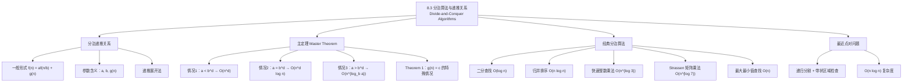

**相关笔记：** [[8.2 求解线性递推关系]] | [[8.4 生成函数]]

> [!abstract] 概览
> 本节系统介绍了==分治算法==（divide-and-conquer algorithms）的复杂度分析方法。分治算法将规模为 $n$ 的问题分解为若干规模更小的子问题，递归求解后合并结果。其复杂度可用==分治递推关系== $f(n) = af(n/b) + g(n)$ 描述。
>
> - ==分治递推关系==的一般形式：$f(n) = af(n/b) + g(n)$，其中 $a$ 为子问题个数，$b$ 为缩小因子，$g(n)$ 为合并开销
> - ==主定理（Master Theorem）==提供了分治递推关系复杂度的直接判定方法，分为三种情况
> - 经典应用：[[归并排序]] $O(n\log n)$、二分查找 $O(\log n)$、快速整数乘法 $O(n^{\log 3})$、Strassen 矩阵乘法 $O(n^{\log 7})$
> - 最近点对问题可通过分治算法在 $O(n\log n)$ 时间内求解

---

## 一、知识结构总览

---

## 二、核心思想

> [!tip] 核心思想
> 本节的核心思想是==分治递推关系的建立与求解==。分治算法遵循"分而治之"（Divide et impera）的策略：将规模为 $n$ 的问题分解为 $a$ 个规模为 $n/b$ 的子问题，分别求解后用 $g(n)$ 的额外开销合并结果。由此产生的递推关系 $f(n) = af(n/b) + g(n)$ 可以通过递推展开法或==主定理==直接求解复杂度，而无需逐项展开。

### 1. 分治递推关系

> [!def] 分治递推关系（Divide-and-Conquer Recurrence Relation）
> 设一个递归算法将规模为 $n$ 的问题分解为 $a$ 个规模为 $n/b$ 的子问题（假设 $n$ 是 $b$ 的倍数），且合并子问题的解需要 $g(n)$ 次额外操作。若 $f(n)$ 表示求解规模为 $n$ 的问题所需的总操作数，则
>
> $$f(n) = af(n/b) + g(n)$$
>
> 这称为==分治递推关系==。
>
> - $a$：子问题的个数
> - $b$：问题规模缩小的因子（$b > 1$ 的整数）
> - $g(n)$：合并步骤的额外开销
> - 当 $n$ 不是 $b$ 的幂时，子问题规模取 $\lfloor n/b \rfloor$ 或 $\lceil n/b \rceil$

> [!example] 二分查找（Binary Search）
> 二分查找将规模为 $n$ 的搜索问题缩减为规模为 $n/2$ 的子问题（$a = 1$，$b = 2$），每次缩减需要 2 次比较（一次确定搜索哪一半，一次检查是否还有剩余元素）。
>
> $$f(n) = f(n/2) + 2$$
>
> 由 Theorem 1（$a = 1$，$b = 2$，$c = 2$），$f(n) = O(\log n)$。

> [!example] 查找最大值和最小值（Example 2）
> 将含 $n$ 个元素的序列分成两个含 $n/2$ 个元素的子序列（$a = 2$，$b = 2$），分别找最大最小值后，需要 2 次比较（比较两个最大值、比较两个最小值）。
>
> $$f(n) = 2f(n/2) + 2$$
>
> 由 Theorem 1（$a = 2$，$b = 2$，$c = 2$），$f(n) = O(n^{\log_2 2}) = O(n)$。

> [!example] 归并排序（Merge Sort）
> 归并排序将含 $n$ 个元素的列表分成两个含 $n/2$ 个元素的子列表（$a = 2$，$b = 2$），排序后合并需要不超过 $n$ 次比较。
>
> $$M(n) = 2M(n/2) + n$$
>
> 由主定理（$a = 2$，$b = 2$，$c = 1$，$d = 1$），$a = b^d = 2$，故 $M(n) = O(n\log n)$。

> [!example] 快速整数乘法（Example 4）
> 将两个 $2n$ 位整数的乘法分解为三个 $n$ 位整数的乘法，加上移位和加法操作。设 $f(n)$ 为两个 $n$ 位整数相乘所需的位运算次数：
>
> $$f(2n) = 3f(n) + Cn$$
>
> 其中 $Cn$ 代表加法、减法和移位的总位运算数。由主定理（$a = 3$，$b = 2$，$d = 1$），$a = 3 > b^d = 2$，故 $f(n) = O(n^{\log_2 3})$。由于 $\log_2 3 \approx 1.585 < 2$，这比传统乘法算法的 $O(n^2)$ 有显著改进。

> [!example] Strassen 矩阵乘法（Example 5）
> Volker Strassen 于 1969 年发明的方法将两个 $n \times n$ 矩阵的乘法（$n$ 为偶数时）分解为 7 个 $(n/2) \times (n/2)$ 矩阵的乘法和 15 个 $(n/2) \times (n/2)$ 矩阵的加法。
>
> $$f(n) = 7f(n/2) + 15n^2/4$$
>
> 由主定理（$a = 7$，$b = 2$，$c = 15/4$，$d = 2$），$a = 7 > b^d = 4$，故 $f(n) = O(n^{\log_2 7})$。由于 $\log_2 7 \approx 2.807 < 3$，这比传统矩阵乘法的 $O(n^3)$ 更高效。

### 2. 递推展开法

> [!thm] 递推展开公式
> 设 $f(n) = af(n/b) + g(n)$，且 $n = b^k$（$k$ 为正整数）。反复展开递推关系：
>
> $$f(n) = af(n/b) + g(n)$$
> $$= a[a f(n/b^2) + g(n/b)] + g(n) = a^2 f(n/b^2) + ag(n/b) + g(n)$$
> $$= a^3 f(n/b^3) + a^2 g(n/b^2) + ag(n/b) + g(n)$$
> $$\cdots$$
> $$= a^k f(n/b^k) + \sum_{j=0}^{k-1} a^j g(n/b^j)$$
>
> 由于 $n/b^k = 1$，即 $f(n/b^k) = f(1)$，最终得到：
>
> $$f(n) = a^k f(1) + \sum_{j=0}^{k-1} a^j g(n/b^j)$$

### 3. Theorem 1：$g(n) = c$ 的特殊情况

> [!thm] Theorem 1（$g(n) = c$ 时分治递推的解）
> 设 $f$ 是递增函数，满足递推关系
>
> $$f(n) = af(n/b) + c$$
>
> 其中 $n$ 是 $b$ 的倍数，$a \geq 1$，$b$ 是大于 $1$ 的整数，$c$ 为正常数。则
>
> $$f(n) = \begin{cases} O(n^{\log_b a}), & \text{若 } a > 1 \\ O(\log n), & \text{若 } a = 1 \end{cases}$$
>
> 进一步，当 $a = 1$ 时，$f(n) = C_1 + C_2 \log_b n$，其中 $C_1 = f(1) + c/(a-1)$，$C_2 = -c/(a-1)$。
>
> **证明**：取 $g(n) = c$，代入递推展开公式：
>
> $$f(n) = a^k f(1) + c \sum_{j=0}^{k-1} a^j$$
>
> **当 $a = 1$ 时**：
> $$f(n) = f(1) + ck = f(1) + c \log_b n$$
> 因为 $n = b^k$，故 $k = \log_b n$。当 $n$ 不是 $b$ 的幂时，$b^k < n < b^{k+1}$，由 $f$ 递增：
> $$f(n) \leq f(b^{k+1}) = f(1) + c(k+1) = (f(1) + c) + ck \leq (f(1) + c) + c\log_b n$$
> 故 $f(n) = O(\log n)$。
>
> **当 $a > 1$ 时**：利用等比数列求和公式：
> $$f(n) = a^k f(1) + c \cdot \frac{a^k - 1}{a - 1} = a^k \left[f(1) + \frac{c}{a-1}\right] - \frac{c}{a-1}$$
> $$= C_1 n^{\log_b a} + C_2$$
> 因为 $a^k = a^{\log_b n} = n^{\log_b a}$（见附录 2 练习 4），其中 $C_1 = f(1) + c/(a-1)$，$C_2 = -c/(a-1)$。
>
> 当 $n$ 不是 $b$ 的幂时，$b^k < n < b^{k+1}$，由 $f$ 递增：
> $$f(n) \leq f(b^{k+1}) = C_1 a^{k+1} + C_2 \leq (C_1 a) a^{\log_b n} + C_2 = (C_1 a) n^{\log_b a} + C_2$$
> 故 $f(n) = O(n^{\log_b a})$。

> [!example] 求解 $f(n) = 5f(n/2) + 3$，$f(1) = 7$
> 由 Theorem 1 的证明，取 $a = 5$，$b = 2$，$c = 3$。当 $n = 2^k$ 时：
>
> $$f(n) = 5^k \left[7 + \frac{3}{5-1}\right] - \frac{3}{5-1} = 5^k \cdot \frac{31}{4} - \frac{3}{4}$$
>
> 若 $f$ 递增，则 $f(n) = O(n^{\log_2 5})$。

### 4. 主定理（Master Theorem）

> [!thm] Theorem 2 — 主定理（Master Theorem）
> 设 $f$ 是递增函数，满足递推关系
>
> $$f(n) = af(n/b) + cn^d$$
>
> 其中 $n = b^k$（$k$ 为正整数），$a \geq 1$，$b$ 是大于 $1$ 的整数，$c > 0$，$d \geq 0$。则
>
> $$f(n) = \begin{cases} O(n^d), & \text{若 } a < b^d \quad \text{（情况1：合并开销主导）} \\ O(n^d \log n), & \text{若 } a = b^d \quad \text{（情况2：平衡情况）} \\ O(n^{\log_b a}), & \text{若 } a > b^d \quad \text{（情况3：递归开销主导）} \end{cases}$$
>
> **证明思路**（Exercises 29-33）：
>
> **情况1**（$a < b^d$）：利用 Exercise 29-30，可证 $f(n) = O(n^d)$。直观理解：每层递归的总合并开销为 $a^j \cdot c(n/b^j)^d = cn^d (a/b^d)^j$，由于 $a/b^d < 1$，这是一个递减的等比数列，总开销以首项 $cn^d$ 为上界。
>
> **情况2**（$a = b^d$）：利用 Exercise 31-32，可证 $f(n) = O(n^d \log n)$。直观理解：每层递归的总合并开销为 $cn^d$（常数），共有 $\log_b n$ 层，故总开销为 $cn^d \log_b n$。
>
> **情况3**（$a > b^d$）：利用 Exercise 31 和 33，可证 $f(n) = O(n^{\log_b a})$。直观理解：底层（叶子节点）有 $a^{\log_b n} = n^{\log_b a}$ 个，每个叶子开销为 $f(1)$，底层总开销主导。

> [!warning] 主定理使用注意事项
> - 主定理要求 $f$ 是==递增函数==，且 $g(n) = cn^d$ 的形式
> - 当 $a = b^d$ 时，复杂度多了一个 $\log n$ 因子，这是最容易出错的地方
> - 判断的关键是比较 $a$ 与 $b^d$ 的大小关系，而非 $a$ 与 $b$ 的大小关系
> - 例如归并排序：$a = 2$，$b = 2$，$d = 1$，$a = b^d = 2$，故 $O(n\log n)$

### 5. 最近点对问题

> [!def] 最近点对问题（Closest-Pair Problem）
> 给定平面上 $n$ 个点 $(x_1, y_1), \ldots, (x_n, y_n)$，求距离最近的点对。两点间的距离使用欧几里得距离 $\sqrt{(x_i - x_j)^2 + (y_i - y_j)^2}$。
>
> **分治算法**（Michael Shamos）：
> 1. 预处理：用归并排序按 $x$ 坐标和 $y$ 坐标分别排序，$O(n\log n)$
> 2. 递归分割：用垂直线 $\ell$ 将点集分成左右两半各 $n/2$ 个点
> 3. 递归求解：分别求左半和右半的最近距离 $d_L$ 和 $d_R$，令 $d = \min(d_L, d_R)$
> 4. 合并检查：只需检查宽度为 $2d$ 的带状区域内的点对
> 5. 关键观察：对带状区域内的每个点 $p$，只需检查以 $p$ 为中心的 $2d \times d$ 矩形内的点，该矩形中至多 8 个点（因为每个 $d/2 \times d/2$ 的小正方形中至多 1 个点，对角线长 $d/\sqrt{2} < d$）
>
> 递推关系：$f(n) = 2f(n/2) + 7n$（带状区域内每个点至多比较 7 个其他点）
>
> 由主定理（$a = 2$，$b = 2$，$c = 7$，$d = 1$），$a = b^d = 2$，故 $f(n) = O(n\log n)$。
>
> 加上预处理的 $O(n\log n)$，总复杂度为 $O(n\log n)$，远优于暴力法的 $O(n^2)$。

---

## 三、补充理解与易混淆点

### 补充理解

> [!info] 补充1：分治思想的历史与直觉
> "分而治之"（Divide et impera）的思想可追溯到古罗马的凯撒大帝。在计算机科学中，分治策略是最高效的算法设计范式之一。其核心直觉可以用"组织大型活动"来类比：如果要组织 1000 人的活动，直接管理所有人效率极低（$O(n^2)$ 的沟通成本）；更好的方式是将 1000 人分成若干小组，每组指定组长，再由组长管理组员——这就是分治思想的本质。
>
> 分治算法的效率取决于三个因素：
> - 子问题的个数 $a$：越少越好
> - 规模缩小因子 $b$：越大越好（问题缩小得越快）
> - 合并开销 $g(n)$：越小越好
>
> 主定理精确地刻画了这三个因素如何共同决定最终复杂度。
> 来源：Cormen, T. H., et al. (2009). *Introduction to Algorithms* (3rd ed.), MIT Press, Chapter 4.
> 来源：Aho, A. V., Hopcroft, J. E. & Ullman, J. D. (1974). *The Design and Analysis of Computer Algorithms*. Addison-Wesley, Chapter 2.

> [!info] 补充2：主定理三种情况的直觉理解
> 可以用"树形递归"的视角理解主定理的三种情况。将分治递推展开为一棵递归树：
>
> - **情况1**（$a < b^d$）：每层的工作量按 $(a/b^d)^j$ 递减，总工作量以==根节点==的工作量 $O(n^d)$ 为上界——合并开销主导
> - **情况2**（$a = b^d$）：每层的工作量相同，都是 $O(n^d)$，共 $\log_b n$ 层——总工作量 $O(n^d \log n)$
> - **情况3**（$a > b^d$）：工作量随层数递增，总工作量以==叶子节点==的工作量 $O(n^{\log_b a})$ 为上界——递归开销主导
>
> 这种递归树分析法（recursion tree method）是理解主定理的最佳方式，也是《算法导论》（CLRS）第4章推荐的分析方法。
> 来源：Cormen, T. H., et al. (2009). *Introduction to Algorithms* (3rd ed.), MIT Press, Chapter 4, Theorem 4.1.
> 来源：Akra, M. & Bazzi, L. (1998). "On the Solution of Linear Recurrences." *Computational Complexity*, 7(1), 3–21.

### 易混淆点

> [!warning] 误区：$a$ 与 $b$ 的比较 vs $a$ 与 $b^d$ 的比较
> - ❌ 比较的是 $a$ 和 $b$ 的大小来判断复杂度
> - ✅ 主定理比较的是 $a$ 和 $b^d$ 的大小，其中 $d$ 是 $g(n) = cn^d$ 中的指数
> - 例如：$f(n) = 2f(n/2) + n$ 中，$a = 2$，$b = 2$，$d = 1$，$b^d = 2$，$a = b^d$，故 $O(n\log n)$
> - 但若 $f(n) = 2f(n/2) + n^2$，则 $d = 2$，$b^d = 4$，$a = 2 < 4$，故 $O(n^2)$

> [!warning] 误区：$a = b^d$ 时忘记 $\log n$ 因子
> - ❌ 认为 $f(n) = 2f(n/2) + n$ 的复杂度是 $O(n)$
> - ✅ $a = b^d = 2$，属于情况2，正确答案是 $O(n\log n)$
> - 直觉：每层合并开销都是 $O(n)$，共 $\log_2 n$ 层，总开销 $O(n\log n)$

> [!warning] 误区：混淆 Theorem 1 和主定理（Theorem 2）
> - Theorem 1 是主定理在 $g(n) = c$（即 $d = 0$）时的特殊情况
> - 当 $d = 0$ 时，$b^d = 1$，所以：
>   - 若 $a > 1$（即 $a > b^d$），情况3：$O(n^{\log_b a})$
>   - 若 $a = 1$（即 $a = b^d$），情况2：$O(\log n)$（因为 $n^0 \log n = \log n$）
> - Theorem 1 的结论与主定理完全一致

---

## 四、习题精选

> [!todo] 习题概览
> | 题号范围 | 核心考点 | 难度 |
> |---------|---------|------|
> | 1-2 | 二分查找/最大最小值的比较次数计算 | ⭐ |
> | 3-5 | 快速整数乘法的手动执行与复杂度估计 | ⭐⭐ |
> | 6 | Strassen 矩阵乘法的操作数计算 | ⭐⭐ |
> | 7-9 | 递推关系的逐层展开与精确求解 | ⭐⭐ |
> | 10-13 | 递推关系的精确求解与 big-O 估计 | ⭐⭐⭐ |
> | 14-16 | 淘汰赛递推关系 | ⭐⭐ |
> | 17-18 | 多数票问题的分治算法设计 | ⭐⭐⭐ |
> | 19-20 | 快速幂算法的递推关系 | ⭐⭐⭐ |
> | 21-22 | 非标准分治递推（$\sqrt{n}$ 分割） | ⭐⭐⭐⭐ |
> | 23 | 最大连续子序列和的分治算法 | ⭐⭐⭐⭐ |
> | 24-25 | 最近点对问题的手动执行 | ⭐⭐⭐ |
> | 26-27 | 最近点对算法的伪代码与变体 | ⭐⭐⭐ |
> | 28-33 | Ulam 搜索问题（含一次撒谎） | ⭐⭐⭐⭐ |
> | 34-37 | 非标准 $b$ 值的递推关系求解 | ⭐⭐⭐ |

### 题1：二分查找的比较次数

> [!problem] 题目
> 在 64 个元素的有序集合中进行二分查找需要多少次比较？

> [!faq]- 解答
> 二分查找的递推关系为 $f(n) = f(n/2) + 2$，$f(1) = 1$。
>
> 由 Theorem 1，$a = 1$，$b = 2$，$c = 2$，故 $f(n) = O(\log n)$。
>
> 精确计算：$n = 64 = 2^6$，需要 6 次分割，每次 2 次比较。
>
> $f(64) = f(1) + 2 \times 6 = 1 + 12 = 13$。
>
> 但更精确地说，最后一次查找 $f(1) = 1$ 次比较即可，所以总比较次数为 $2 \times 6 = 12$（每次分割 2 次比较，共 6 层）。
>
> $\blacksquare$

### 题2：最大最小值的比较次数

> [!problem] 题目
> 使用 Example 2 的算法在含 128 个元素的序列中查找最大值和最小值，需要多少次比较？

> [!faq]- 解答
> 递推关系为 $f(n) = 2f(n/2) + 2$，$f(2) = 1$。
>
> $n = 128 = 2^7$，共 7 层递归。
>
> 第 $j$ 层（$j = 0, 1, \ldots, 6$）有 $2^j$ 个子问题，每个子问题需要 2 次比较来合并，共 $2^{j+1}$ 次比较。
>
> 总比较次数（不含最底层叶子）：
> $$\sum_{j=0}^{6} 2^{j+1} = 2 \times (2^7 - 1) = 2 \times 127 = 254$$
>
> 加上最底层 $2^7 = 128$ 个子问题，每个 $f(2) = 1$ 次比较，共 128 次。
>
> 总计：$254 + 128 = 382$？不对，应重新计算。
>
> 更准确的方法：由 Theorem 1，$a = 2$，$b = 2$，$c = 2$，$f(n) = O(n)$。
>
> 精确公式：$f(n) = n^{\log_2 2}[f(1) + 2/(2-1)] - 2/(2-1) = n(f(1) + 2) - 2$。
>
> 但 $f(1)$ 无意义（至少需要 2 个元素），所以用 $f(2) = 1$ 作为基准。
>
> 直接展开：$f(128) = 2f(64) + 2 = 2(2f(32) + 2) + 2 = 4f(32) + 6 = \cdots$
>
> $f(n) = 2^{k-1} f(2) + 2(2^{k-1} - 1)$，其中 $n = 2^k$。
>
> $f(128) = 2^6 \times 1 + 2(2^6 - 1) = 64 + 126 = 190$。
>
> $\blacksquare$

### 题3：求解分治递推关系

> [!problem] 题目
> 设 $f(n) = f(n/3) + 1$（$n$ 是 3 的倍数），$f(1) = 1$。求 $f(27)$。

> [!faq]- 解答
> 由 Theorem 1，$a = 1$，$b = 3$，$c = 1$。
>
> $f(n) = f(1) + c \log_3 n = 1 + \log_3 n$。
>
> $f(27) = 1 + \log_3 27 = 1 + 3 = 4$。
>
> 验证：$f(27) = f(9) + 1 = (f(3) + 1) + 1 = ((f(1) + 1) + 1) + 1 = 1 + 1 + 1 + 1 = 4$。 ✓
>
> $\blacksquare$

### 题4：利用主定理估计复杂度

> [!problem] 题目
> 设 $f(n) = 5f(n/4) + 6n$，$f(1) = 1$。若 $f$ 递增，给出 $f(n)$ 的 big-O 估计。

> [!faq]- 解答
> 使用主定理（Theorem 2）：
> - $a = 5$，$b = 4$，$c = 6$，$d = 1$
> - $b^d = 4^1 = 4$
> - $a = 5 > b^d = 4$，属于==情况3==
>
> 因此 $f(n) = O(n^{\log_4 5})$。
>
> $\blacksquare$

### 题5：Strassen 矩阵乘法的操作数

> [!problem] 题目
> 使用 Example 5 中的 Strassen 算法，计算两个 $32 \times 32$ 矩阵的乘法需要多少次乘法和加法？

> [!faq]- 解答
> 递推关系：$f(n) = 7f(n/2) + 15n^2/4$，$f(2) = ?$（$2 \times 2$ 矩阵用常规方法需要 $2^3 = 8$ 次乘法）。
>
> $n = 32 = 2^5$，共 5 层递归。
>
> 第 $j$ 层（$j = 0, 1, \ldots, 4$）有 $7^j$ 个子问题，每个子问题的加法次数为 $15(n/2^j)^2/4$。
>
> 加法总次数：
> $$\sum_{j=0}^{4} 7^j \cdot \frac{15(32/2^j)^2}{4} = \frac{15 \times 32^2}{4} \sum_{j=0}^{4} \left(\frac{7}{4}\right)^j = 3840 \times \frac{(7/4)^5 - 1}{7/4 - 1}$$
>
> 乘法总次数：$7^5 = 16807$。
>
> 由主定理，$f(n) = O(n^{\log_2 7}) \approx O(n^{2.807})$。
>
> $\blacksquare$

> [!tip] 解题思路提示
> 分治递推关系的解题方法论：
> 1. **识别参数**：从递推关系中确定 $a$（子问题个数）、$b$（缩小因子）、$g(n)$ 的形式
> 2. **套用主定理**：将 $g(n)$ 写成 $cn^d$ 的形式，比较 $a$ 与 $b^d$
> 3. **特殊情况**：当 $g(n) = c$（常数）时，直接使用 Theorem 1
> 4. **精确求解**：当 $n$ 是 $b$ 的幂时，可利用递推展开公式求精确解
> 5. **非标准情况**：当递推关系不符合主定理形式时（如 $g(n) = n\log n$），需使用递归树法或其他方法

---

## 五、视频学习指南

> [!info] 视频资源
> | 资源 | 链接 | 对应内容 | 备注 |
> |:-----|:-----|:---------|:-----|
> | Rosen 8e Section 8.3 | [教材原文](https://www.mheducation.com/highered/product/discrete-mathematics-applications-rosen/M9781259676512.html) | 完整定义、定理与例题 | 英文教材 |
> | MIT 6.006 Lecture 2 | [链接](https://www.youtube.com/watch?v=0oD6MdbA1K4) | 分治算法与主定理 | 英文，MIT开放课程 |
> | CLRS Chapter 4 | [链接](https://www.youtube.com/watch?v=0oD6MdbA1K4) | 递归树法与主定理证明 | 英文 |

---

## 六、教材原文

> [!quote] 教材原文
> "Many recursive algorithms take a problem with a given input and divide it into one or more smaller problems. This reduction is successively applied until the solutions of the smaller problems can be found quickly."
>
> "This theorem (or more powerful versions, including big-Theta estimates) is sometimes known as the master theorem because it is useful in analyzing the complexity of many important divide-and-conquer algorithms."
>
> "It took researchers more than 10 years to find an algorithm with $O(n \log n)$ complexity that locates the closest pair of points among $n$ points."

---

## 参见 Wiki

- [[离散数学/concepts/分治算法]] -- 分治策略的基本思想与设计范式
- [[离散数学/concepts/主定理]] -- Master Theorem 的完整表述与证明
- [[离散数学/concepts/分治算法|归并排序]] -- 归并排序的分治实现与复杂度分析
- [[离散数学/concepts/递推关系]] -- 递推关系的分类与求解方法
- [[离散数学/concepts/分治算法|递归树法]] -- 递归树分析法（Recursion Tree Method）
- [[离散数学/concepts/分治算法|Strassen矩阵乘法]] -- Strassen 矩阵乘法算法详解

#学习/离散数学/高级计数技术
