**相关笔记：** [[8.3 分治算法与递推关系]] | [[8.5 容斥原理]]

> [!abstract] 概览
> 本节系统介绍了==生成函数==（generating functions）的定义、性质与应用。生成函数将序列的项编码为形式幂级数的系数，是解决计数问题、求解递推关系、证明组合恒等式的强大工具。
>
> - ==常生成函数（OGF）==：$G(x) = \sum_{k=0}^{\infty} a_k x^k$，将序列 $\{a_k\}$ 编码为幂级数的系数
> - 核心幂级数：$\frac{1}{1-x} = \sum_{k=0}^{\infty} x^k$，$\frac{1}{(1-x)^n} = \sum_{k=0}^{\infty} C(n+k-1, k) x^k$
> - ==广义二项式定理==：$(1+x)^u = \sum_{k=0}^{\infty} \binom{u}{k} x^k$，其中 $\binom{u}{k}$ 为广义二项式系数
> - 用生成函数求解计数问题：将约束条件转化为因式的乘积，目标数为展开式中对应幂次的系数
> - 用生成函数求解递推关系：将递推关系转化为关于 $G(x)$ 的方程，解出 $G(x)$ 后提取系数
> - ==指数生成函数（EGF）==：$G_e(x) = \sum_{k=0}^{\infty} a_k \frac{x^k}{k!}$，适用于排列计数等场景

---

## 一、知识结构总览

```mermaid
graph TB
    A["8.4 生成函数<br/>Generating Functions"] --> B["常生成函数 OGF 定义"]
    A --> C["幂级数基本事实"]
    A --> D["广义二项式定理"]
    A --> E["计数问题"]
    A --> F["求解递推关系"]
    A --> G["证明恒等式"]
    A --> H["指数生成函数 EGF"]

    B --> B1["G(x) = Σ a_k x^k"]
    B --> B2["有限序列的多项式表示"]
    B --> B3["生成函数的加法与乘法"]

    C --> C1["1/(1-x) = 1 + x + x² + ..."]
    C --> C2["1/(1-ax) = Σ a^k x^k"]
    C --> C3["1/(1-x)² = Σ(k+1)x^k"]
    C --> C4["Theorem 1：加法与乘法规则"]

    D --> D1["广义二项式系数 binom(u,k)"]
    D --> D2["(1+x)^u = Σ binom(u,k) x^k"]
    D --> D3["(1-x)^(-n) = Σ C(n+k-1,k) x^k"]
    D --> D4["(1+x)^(-n) = Σ(-1)^k C(n+k-1,k) x^k"]

    E --> E1["方程解的计数"]
    E --> E2["分配问题"]
    E --> E3["组合数公式推导"]
    E --> E4["邮票/零钱问题"]

    F --> F1["一阶线性递推"]
    F --> F2["含非齐次项的递推"]
    F --> F3["部分分式分解"]

    G --> G1["Vandermonde 恒等式"]
    G --> G2["Pascal 恒等式"]

    H --> H1["EGF 定义：Σ a_k x^k/k!"]
    H --> H2["EGF 的乘法对应排列"]
```

---

## 二、核心思想

> [!tip] 核心思想
> 本节的核心思想是==用幂级数编码序列==：将一个序列 $\{a_0, a_1, a_2, \ldots\}$ 的各项作为形式幂级数 $G(x) = a_0 + a_1 x + a_2 x^2 + \cdots$ 的系数。这样，序列上的运算（如加法、卷积）就转化为幂级数上的代数运算（如加法、乘法），使我们能够利用微积分和代数工具来解决组合计数和递推关系问题。

### 1. 常生成函数的定义

> [!def] 常生成函数（Ordinary Generating Function, OGF）
> 实数序列 $\{a_k\}_{k=0}^{\infty}$ 的==生成函数==是无穷级数
>
> $$G(x) = \sum_{k=0}^{\infty} a_k x^k = a_0 + a_1 x + a_2 x^2 + \cdots$$
>
> 对于有限序列 $a_0, a_1, \ldots, a_n$，通过令 $a_{n+1} = a_{n+2} = \cdots = 0$ 将其扩展为无穷序列，其生成函数为多项式：
>
> $$G(x) = a_0 + a_1 x + \cdots + a_n x^n$$

> [!example] 基本生成函数示例
> - 常数序列 $\{3, 3, 3, \ldots\}$：$G(x) = \sum_{k=0}^{\infty} 3x^k = \frac{3}{1-x}$
> - 线性序列 $\{1, 2, 3, \ldots\}$（$a_k = k+1$）：$G(x) = \sum_{k=0}^{\infty}(k+1)x^k = \frac{1}{(1-x)^2}$
> - 指数序列 $\{1, 2, 4, 8, \ldots\}$（$a_k = 2^k$）：$G(x) = \sum_{k=0}^{\infty} 2^k x^k = \frac{1}{1-2x}$
> - 有限序列 $\{1, 1, 1, 1, 1, 1\}$：$G(x) = 1 + x + x^2 + x^3 + x^4 + x^5 = \frac{x^6 - 1}{x - 1}$

> [!example] 二项式系数的生成函数
> 设 $a_k = C(m, k)$，$k = 0, 1, \ldots, m$，则
>
> $$G(x) = \sum_{k=0}^{m} C(m, k) x^k = (1+x)^m$$
>
> 这正是==二项式定理==的直接结果。

### 2. 幂级数的基本事实

> [!def] 基本幂级数公式
> 以下幂级数在 $|x| < 1$（或相应的收敛半径内）收敛：
>
> $$\frac{1}{1-x} = \sum_{k=0}^{\infty} x^k = 1 + x + x^2 + \cdots$$
>
> $$\frac{1}{1-ax} = \sum_{k=0}^{\infty} a^k x^k = 1 + ax + a^2 x^2 + \cdots \quad (|ax| < 1)$$
>
> $$\frac{1}{(1-x)^2} = \sum_{k=0}^{\infty} (k+1) x^k = 1 + 2x + 3x^2 + \cdots$$

> [!thm] Theorem 1：生成函数的加法与乘法
> 设 $f(x) = \sum_{k=0}^{\infty} a_k x^k$ 和 $g(x) = \sum_{k=0}^{\infty} b_k x^k$，则
>
> **加法**：
> $$f(x) + g(x) = \sum_{k=0}^{\infty} (a_k + b_k) x^k$$
>
> **乘法**（Cauchy 乘积 / 卷积）：
> $$f(x) \cdot g(x) = \sum_{k=0}^{\infty} \left(\sum_{j=0}^{k} a_j b_{k-j}\right) x^k$$
>
> 乘法公式表明：两个生成函数乘积的第 $k$ 个系数，等于两个序列前 $k+1$ 项的==卷积==。

> [!example] 求 $\frac{1}{(1-x)^2}$ 的展开系数
> 由 Example 4，$\frac{1}{1-x} = \sum_{k=0}^{\infty} x^k$。由 Theorem 1 的乘法规则：
>
> $$\frac{1}{(1-x)^2} = \left(\sum_{k=0}^{\infty} x^k\right)^2 = \sum_{k=0}^{\infty} \left(\sum_{j=0}^{k} 1 \cdot 1\right) x^k = \sum_{k=0}^{\infty} (k+1) x^k$$
>
> 因此 $\frac{1}{(1-x)^2} = 1 + 2x + 3x^2 + 4x^3 + \cdots$。

### 3. 广义二项式系数与广义二项式定理

> [!def] 广义二项式系数（Extended Binomial Coefficient）
> 设 $u$ 为实数，$k$ 为非负整数。==广义二项式系数==定义为
>
> $$\binom{u}{k} = \begin{cases} \frac{u(u-1)(u-2)\cdots(u-k+1)}{k!}, & \text{若 } k > 0 \\ 1, & \text{若 } k = 0 \end{cases}$$
>
> 当 $u$ 为负整数 $-n$ 时，有重要公式：
>
> $$\binom{-n}{r} = (-1)^r C(n+r-1, r) = (-1)^r \binom{n+r-1}{r}$$
>
> **推导**：
> $$\binom{-n}{r} = \frac{(-n)(-n-1)\cdots(-n-r+1)}{r!}$$
> $$= \frac{(-1)^r \cdot n(n+1)\cdots(n+r-1)}{r!}$$
> $$= (-1)^r \frac{(n+r-1)!}{r!(n-1)!} = (-1)^r C(n+r-1, r)$$

> [!example] 广义二项式系数的计算
> - $\binom{-2}{3} = \frac{(-2)(-3)(-4)}{3!} = \frac{-24}{6} = -4$
> - $\binom{1/2}{3} = \frac{(1/2)(1/2-1)(1/2-2)}{3!} = \frac{(1/2)(-1/2)(-3/2)}{6} = \frac{3/8}{6} = \frac{1}{16}$

> [!thm] Theorem 2 — 广义二项式定理（Extended Binomial Theorem）
> 设 $x$ 为实数且 $|x| < 1$，$u$ 为实数，则
>
> $$(1+x)^u = \sum_{k=0}^{\infty} \binom{u}{k} x^k$$
>
> 当 $u$ 为正整数时，广义二项式定理退化为普通的二项式定理（因为当 $k > u$ 时 $\binom{u}{k} = 0$）。

> [!example] $(1-x)^{-n}$ 和 $(1+x)^{-n}$ 的生成函数
> 由广义二项式定理：
>
> $$(1+x)^{-n} = \sum_{k=0}^{\infty} \binom{-n}{k} x^k = \sum_{k=0}^{\infty} (-1)^k C(n+k-1, k) x^k$$
>
> 将 $x$ 替换为 $-x$：
>
> $$(1-x)^{-n} = \sum_{k=0}^{\infty} C(n+k-1, k) x^k$$
>
> 这是生成函数中最重要的公式之一，它告诉我们 $\frac{1}{(1-x)^n}$ 的第 $k$ 个系数是 $C(n+k-1, k) = C(n+k-1, n-1)$。

> [!def] 常用生成函数汇总表
> | 生成函数 $G(x)$ | 展开式 $\sum a_k x^k$ | 系数 $a_k$ |
> |:--|:--|:--|
> | $(1+x)^n$ | $\sum_{k=0}^{n} C(n,k) x^k$ | $C(n,k)$ |
> | $\frac{1}{1-x}$ | $\sum_{k=0}^{\infty} x^k$ | $1$ |
> | $\frac{1}{1-ax}$ | $\sum_{k=0}^{\infty} a^k x^k$ | $a^k$ |
> | $\frac{1}{(1-x)^2}$ | $\sum_{k=0}^{\infty} (k+1) x^k$ | $k+1$ |
> | $\frac{1}{(1-x)^n}$ | $\sum_{k=0}^{\infty} C(n+k-1,k) x^k$ | $C(n+k-1, k)$ |
> | $\frac{1}{(1+x)^n}$ | $\sum_{k=0}^{\infty} (-1)^k C(n+k-1,k) x^k$ | $(-1)^k C(n+k-1, k)$ |
> | $\frac{1}{(1-ax)^n}$ | $\sum_{k=0}^{\infty} C(n+k-1,k) a^k x^k$ | $C(n+k-1, k) a^k$ |
> | $e^x$ | $\sum_{k=0}^{\infty} \frac{x^k}{k!}$ | $1/k!$ |
> | $\ln(1+x)$ | $\sum_{k=1}^{\infty} \frac{(-1)^{k+1}}{k} x^k$ | $(-1)^{k+1}/k$ |

### 4. 用生成函数解决计数问题

> [!tip] 计数问题的生成函数方法
> 用生成函数解决计数问题的核心思路是：
> 1. 将每种选择用一个多项式因式表示，其中 $x^e$ 的系数表示选择 $e$ 个该类物品的方式数
> 2. 将所有因式相乘，乘积展开式中 $x^r$ 的系数就是选择总数为 $r$ 的方式数
>
> 常见因式对应关系：
> - 每种物品可选 $0, 1, 2, \ldots$ 个（无上限）：$\frac{1}{1-x} = 1 + x + x^2 + \cdots$
> - 每种物品可选 $0$ 或 $1$ 个：$1 + x$
> - 每种物品至少选 $1$ 个：$x + x^2 + x^3 + \cdots = \frac{x}{1-x}$
> - 每种物品可选 $a$ 到 $b$ 个：$x^a + x^{a+1} + \cdots + x^b$

> [!example] 方程解的计数（Example 10）
> 求方程 $e_1 + e_2 + e_3 = 17$ 的解的个数，其中 $2 \leq e_1 \leq 5$，$3 \leq e_2 \leq 6$，$4 \leq e_3 \leq 7$。
>
> **解法**：构造生成函数
>
> $$G(x) = (x^2 + x^3 + x^4 + x^5)(x^3 + x^4 + x^5 + x^6)(x^4 + x^5 + x^6 + x^7)$$
>
> 答案为 $x^{17}$ 的系数。逐一枚举：
> - $e_1 = 2$：需要 $e_2 + e_3 = 15$，$e_2 \in [3,6]$，$e_3 \in [4,7]$。$e_2 = 8$ 不在范围内，无解
> - $e_1 = 3$：需要 $e_2 + e_3 = 14$，$e_2 = 7$ 不在范围内，无解
> - $e_1 = 4$：需要 $e_2 + e_3 = 13$。$e_2 = 6$，$e_3 = 7$ ✓
> - $e_1 = 5$：需要 $e_2 + e_3 = 12$。$e_2 = 5$，$e_3 = 7$ ✓；$e_2 = 6$，$e_3 = 6$ ✓
>
> 共 3 个解。

> [!example] 分配问题（Example 11）
> 将 8 个相同的饼干分给 3 个不同的孩子，每个孩子至少 2 个、至多 4 个饼干，有多少种方式？
>
> **解法**：每个孩子对应因式 $x^2 + x^3 + x^4$，生成函数为
>
> $$G(x) = (x^2 + x^3 + x^4)^3$$
>
> 答案为 $x^8$ 的系数。令 $y = x^2$，则 $G(x) = x^6(1 + x + x^2)^3$，需要 $(1+x+x^2)^3$ 中 $x^2$ 的系数。
>
> $(1+x+x^2)^3$ 中 $x^2$ 的系数：展开后 $x^2$ 项来自以下组合：
> - 从三个因式中取 $x^2, 1, 1$：$C(3,1) = 3$ 种
> - 从三个因式中取 $x, x, 1$：$C(3,2) = 3$ 种
>
> 共 $3 + 3 = 6$ 种方式。

> [!example] 用生成函数推导组合数公式（Example 14）
> 用生成函数求从 $n$ 个元素的集合中选取 $r$ 个元素（允许重复）的组合数。
>
> **解法**：每个元素可以被选 $0, 1, 2, \ldots$ 次，对应因式 $1 + x + x^2 + \cdots = \frac{1}{1-x}$。$n$ 个元素的生成函数为
>
> $$G(x) = \left(\frac{1}{1-x}\right)^n = (1-x)^{-n}$$
>
> 由广义二项式定理：
>
> $$(1-x)^{-n} = \sum_{r=0}^{\infty} \binom{-n}{r} (-x)^r = \sum_{r=0}^{\infty} (-1)^r \cdot (-1)^r C(n+r-1, r) x^r = \sum_{r=0}^{\infty} C(n+r-1, r) x^r$$
>
> 因此允许重复的 $r$-组合数为 $C(n+r-1, r)$，这与第6章 Theorem 2 的结论一致。

> [!example] 至少选一个的组合数（Example 15）
> 从 $n$ 种不同物品中选 $r$ 个，每种至少选 1 个。
>
> 每种物品对应因式 $x + x^2 + x^3 + \cdots = \frac{x}{1-x}$，生成函数为
>
> $$G(x) = \left(\frac{x}{1-x}\right)^n = x^n (1-x)^{-n}$$
>
> 由广义二项式定理：
>
> $$G(x) = x^n \sum_{t=0}^{\infty} C(n+t-1, t) x^t = \sum_{t=0}^{\infty} C(n+t-1, t) x^{n+t}$$
>
> 令 $r = n + t$，则 $t = r - n$，系数为 $C(r-1, r-n) = C(r-1, n-1)$。

### 5. 用生成函数求解递推关系

> [!tip] 生成函数求解递推关系的方法
> 1. 设 $G(x) = \sum_{k=0}^{\infty} a_k x^k$ 为序列的生成函数
> 2. 将递推关系两边乘以 $x^k$ 并求和，利用递推关系消去部分项
> 3. 解关于 $G(x)$ 的方程，得到 $G(x)$ 的闭式（有理函数形式）
> 4. 将 $G(x)$ 展开为幂级数（通常用部分分式分解），提取系数 $a_k$

> [!example] 求解 $a_k = 3a_{k-1}$，$a_0 = 2$（Example 16）
> 设 $G(x) = \sum_{k=0}^{\infty} a_k x^k$。则
>
> $$xG(x) = \sum_{k=0}^{\infty} a_k x^{k+1} = \sum_{k=1}^{\infty} a_{k-1} x^k$$
>
> 利用递推关系 $a_k = 3a_{k-1}$：
>
> $$G(x) - 3xG(x) = \sum_{k=0}^{\infty} a_k x^k - 3\sum_{k=1}^{\infty} a_{k-1} x^k = a_0 + \sum_{k=1}^{\infty}(a_k - 3a_{k-1}) x^k = a_0 = 2$$
>
> 因此 $(1-3x)G(x) = 2$，解得 $G(x) = \frac{2}{1-3x}$。
>
> 由 $\frac{1}{1-ax} = \sum_{k=0}^{\infty} a^k x^k$，得 $G(x) = 2 \sum_{k=0}^{\infty} 3^k x^k = \sum_{k=0}^{\infty} 2 \cdot 3^k x^k$。
>
> 因此 $a_k = 2 \cdot 3^k$。

> [!example] 求解含 $10^{n-1}$ 项的递推关系（Example 17）
> 设有效码字是含偶数个 0 的 $n$ 位十进制数，$a_n$ 为长度为 $n$ 的有效码字数。递推关系为
>
> $$a_n = 8a_{n-1} + 10^{n-1}, \quad a_1 = 9$$
>
> 扩展序列令 $a_0 = 1$（空串）。
>
> 设 $G(x) = \sum_{n=0}^{\infty} a_n x^n$。两边乘以 $x^n$ 并从 $n=1$ 求和：
>
> $$G(x) - 1 = \sum_{n=1}^{\infty} a_n x^n = 8x \sum_{n=1}^{\infty} a_{n-1} x^{n-1} + x \sum_{n=1}^{\infty} 10^{n-1} x^{n-1}$$
> $$= 8xG(x) + \frac{x}{1-10x}$$
>
> 解得：
>
> $$G(x) = \frac{1 - 9x}{(1-8x)(1-10x)}$$
>
> 部分分式分解：
>
> $$G(x) = \frac{1}{2} \cdot \frac{1}{1-8x} + \frac{1}{2} \cdot \frac{1}{1-10x}$$
>
> 展开：
>
> $$G(x) = \frac{1}{2} \sum_{n=0}^{\infty} 8^n x^n + \frac{1}{2} \sum_{n=0}^{\infty} 10^n x^n = \sum_{n=0}^{\infty} \frac{8^n + 10^n}{2} x^n$$
>
> 因此 $a_n = \frac{8^n + 10^n}{2}$。

### 6. 用生成函数证明组合恒等式

> [!example] 证明 $\sum_{k=0}^{n} C(n,k)^2 = C(2n, n)$（Example 18）
> **证明**：由二项式定理，$C(2n, n)$ 是 $(1+x)^{2n}$ 中 $x^n$ 的系数。
>
> 另一方面：
>
> $$(1+x)^{2n} = [(1+x)^n]^2 = [C(n,0) + C(n,1)x + \cdots + C(n,n)x^n]^2$$
>
> 展开后 $x^n$ 的系数为：
>
> $$C(n,0)C(n,n) + C(n,1)C(n,n-1) + \cdots + C(n,n)C(n,0) = \sum_{k=0}^{n} C(n,k)C(n,n-k)$$
>
> 由于 $C(n, n-k) = C(n, k)$，这等于 $\sum_{k=0}^{n} C(n,k)^2$。
>
> 两个表达式都是 $(1+x)^{2n}$ 中 $x^n$ 的系数，故相等。
>
> $\blacksquare$

### 7. 指数生成函数简介

> [!def] 指数生成函数（Exponential Generating Function, EGF）
> 序列 $\{a_n\}_{n=0}^{\infty}$ 的==指数生成函数==是
>
> $$G_e(x) = \sum_{n=0}^{\infty} a_n \frac{x^n}{n!}$$
>
> 例如，常数序列 $1, 1, 1, \ldots$ 的指数生成函数为
>
> $$G_e(x) = \sum_{n=0}^{\infty} \frac{x^n}{n!} = e^x$$
>
> 注意：$e^x$ 是常数序列的指数生成函数，但它是序列 $\{1, 1, 1/2!, 1/3!, \ldots\}$ 的常生成函数。
>
> 指数生成函数的乘法对应于==排列的复合==：两个 EGF 乘积的系数涉及排列的标签分配问题，这在排列计数中非常有用。

---

## 三、补充理解与易混淆点

### 补充理解

> [!info] 补充1：生成函数为什么有效——"编码-代数-解码"三步法
> 生成函数的威力在于它将==计数问题==转化为==代数问题==。整个过程可以概括为三步：
>
> 1. **编码**：将每种选择用一个多项式因式表示。例如，"选 0 到 5 个苹果"编码为 $1 + x + x^2 + x^3 + x^4 + x^5$
> 2. **代数**：将所有因式相乘，利用代数工具（部分分式、广义二项式定理等）求出乘积的闭式
> 3. **解码**：从闭式中提取目标幂次的系数，即为答案
>
> 这种方法的优美之处在于：复杂的约束条件被自然地编码为多项式的因式结构，而幂级数的乘法自动处理了"不同选择之间的组合"这一计数核心操作。
>
> 生成函数的理论基础可追溯到 18 世纪 Euler 对整数分拆问题的研究，后经 Laplace 在概率论中的应用而广泛传播。现代组合数学中，生成函数是核心工具之一（Wilf, 2006, *generatingfunctionology*）。
> 来源：Wilf, H. S. (2006). *generatingfunctionology* (3rd ed.). A K Peters/CRC Press, Chapter 1.
> 来源：Graham, R. L., Knuth, D. E. & Patashnik, O. (1994). *Concrete Mathematics* (2nd ed.), Addison-Wesley, Chapter 7.

> [!info] 补充2：常生成函数 vs 指数生成函数
> 常生成函数（OGF）和指数生成函数（EGF）适用于不同类型的计数问题：
>
> | 特性 | 常生成函数 OGF | 指数生成函数 EGF |
> |:--|:--|:--|
> | 定义 | $G(x) = \sum a_n x^n$ | $G_e(x) = \sum a_n \frac{x^n}{n!}$ |
> | 乘法含义 | 无序选择（组合） | 有序选择（排列） |
> | 典型应用 | 组合计数、方程解数 | 排列计数、分配问题 |
> | 核心公式 | $\frac{1}{(1-x)^n}$ | $e^{nx}$ |
>
> 简单的经验法则：如果问题涉及"选若干个"（组合），用 OGF；如果涉及"排列"或"标签分配"，用 EGF。
> 来源：Wilf, H. S. (2006). *generatingfunctionology* (3rd ed.). A K Peters/CRC Press, Chapter 3.
> 来源：Rosen, K. H. (2019). *Discrete Mathematics and Its Applications* (8th ed.), McGraw-Hill, Section 8.4.

### 易混淆点

> [!warning] 误区：生成函数中的 $x$ 不是变量
> - ❌ 认为需要关心 $G(x)$ 在 $x$ 取何值时的收敛性
> - ✅ 在组合数学中，生成函数被当作==形式幂级数==（formal power series）处理，$x$ 只是一个占位符，其作用是将序列的项编码为系数
> - 收敛性问题在微积分中有意义，但在生成函数的应用中通常可以忽略
> - 例如 $G(x) = \frac{x^6 - 1}{x - 1}$ 在 $x = 1$ 处无定义，但这不影响它作为序列 $\{1,1,1,1,1,1\}$ 的生成函数

> [!warning] 误区：广义二项式系数的符号
> - ❌ 混淆 $\binom{-n}{r}$ 与 $\binom{n}{r}$ 的符号
> - ✅ $\binom{-n}{r} = (-1)^r C(n+r-1, r)$，注意前面的 $(-1)^r$ 因子
> - 这意味着 $(1+x)^{-n}$ 的系数是==交错符号==的：$1 - C(n,1)x + C(n+1,2)x^2 - \cdots$
> - 而 $(1-x)^{-n}$ 的系数全部为正：$1 + C(n,1)x + C(n+1,2)x^2 + \cdots$

> [!warning] 误区：生成函数乘积中因式的顺序
> - ❌ 认为因式的顺序会影响结果
> - ✅ 生成函数的乘法满足交换律，因式的顺序不影响最终结果
> - 但每个因式对应的"物品类型"必须区分清楚，不能遗漏或重复

---

## 四、习题精选

> [!todo] 习题概览
> | 题号范围 | 核心考点 | 难度 |
> |---------|---------|------|
> | 1-2 | 有限序列的生成函数 | ⭐ |
> | 3-4 | 无限序列的生成函数闭式 | ⭐⭐ |
> | 5-6 | 特殊序列的生成函数 | ⭐⭐ |
> | 7-8 | 从生成函数求序列 | ⭐⭐ |
> | 9-12 | 求幂级数中特定幂次的系数 | ⭐⭐⭐ |
> | 13-18 | 用生成函数解决分配/选择问题 | ⭐⭐⭐ |
> | 19-22 | 生成函数的构造与系数解释 | ⭐⭐⭐ |
> | 23-26 | 邮票/零钱问题 | ⭐⭐⭐⭐ |
> | 27-28 | 掷骰子问题 | ⭐⭐⭐ |
> | 29-31 | 用生成函数做零钱问题 | ⭐⭐⭐⭐ |
> | 32-33 | 生成函数的变换（平移、缩放等） | ⭐⭐⭐ |
> | 34-40 | 用生成函数求解递推关系 | ⭐⭐⭐⭐ |
> | 41 | Fibonacci 数的生成函数解法 | ⭐⭐⭐⭐ |
> | 42-43 | Catalan 数与生成函数 | ⭐⭐⭐⭐ |
> | 44-45 | 用生成函数证明 Pascal/Vandermonde 恒等式 | ⭐⭐⭐ |
> | 46 | 前 $n$ 个平方和的生成函数推导 | ⭐⭐⭐ |
> | 47-50 | 指数生成函数 | ⭐⭐⭐⭐ |
> | 53-58 | 整数分拆与生成函数 | ⭐⭐⭐⭐ |

### 题1：有限序列的生成函数

> [!problem] 题目
> 求有限序列 $1, 1, 1, 1, 1, 1, 1, 1$ 的生成函数闭式。

> [!faq]- 解答
> $$G(x) = 1 + x + x^2 + x^3 + x^4 + x^5 + x^6 + x^7$$
>
> 这是等比数列，当 $x \neq 1$ 时：
>
> $$G(x) = \frac{1 - x^8}{1 - x} = \frac{x^8 - 1}{x - 1}$$
>
> $\blacksquare$

### 题2：求幂级数的系数

> [!problem] 题目
> 求 $\frac{1}{(1-x)^3}$ 展开式中 $x^5$ 的系数。

> [!faq]- 解答
> 由常用公式 $\frac{1}{(1-x)^n} = \sum_{k=0}^{\infty} C(n+k-1, k) x^k$，取 $n = 3$：
>
> $$\frac{1}{(1-x)^3} = \sum_{k=0}^{\infty} C(3+k-1, k) x^k = \sum_{k=0}^{\infty} C(k+2, k) x^k$$
>
> $x^5$ 的系数为 $C(5+2, 5) = C(7, 5) = C(7, 2) = 21$。
>
> $\blacksquare$

### 题3：分配问题

> [!problem] 题目
> 用生成函数求将 10 个相同的气球分给 4 个不同的孩子、每个孩子至少 2 个气球的方式数。

> [!faq]- 解答
> 每个孩子至少 2 个气球，对应因式 $x^2 + x^3 + x^4 + \cdots = \frac{x^2}{1-x}$。
>
> 4 个孩子的生成函数为
>
> $$G(x) = \left(\frac{x^2}{1-x}\right)^4 = \frac{x^8}{(1-x)^4}$$
>
> 需要求 $x^{10}$ 的系数，即 $\frac{1}{(1-x)^4}$ 中 $x^{10-8} = x^2$ 的系数。
>
> $$\frac{1}{(1-x)^4} = \sum_{k=0}^{\infty} C(4+k-1, k) x^k = \sum_{k=0}^{\infty} C(k+3, k) x^k$$
>
> $x^2$ 的系数为 $C(2+3, 2) = C(5, 2) = 10$。
>
> 因此有 10 种方式。
>
> $\blacksquare$

### 题4：用生成函数求解递推关系

> [!problem] 题目
> 用生成函数求解递推关系 $a_k = 3a_{k-1} + 2$，$a_0 = 1$。

> [!faq]- 解答
> 设 $G(x) = \sum_{k=0}^{\infty} a_k x^k$。则
>
> $$G(x) = a_0 + \sum_{k=1}^{\infty} a_k x^k = 1 + \sum_{k=1}^{\infty}(3a_{k-1} + 2) x^k$$
> $$= 1 + 3x \sum_{k=1}^{\infty} a_{k-1} x^{k-1} + 2 \sum_{k=1}^{\infty} x^k$$
> $$= 1 + 3xG(x) + 2 \cdot \frac{x}{1-x}$$
>
> 解方程：
>
> $$G(x) - 3xG(x) = 1 + \frac{2x}{1-x} = \frac{1-x+2x}{1-x} = \frac{1+x}{1-x}$$
>
> $$G(x) = \frac{1+x}{(1-x)(1-3x)}$$
>
> 部分分式分解：设 $\frac{1+x}{(1-x)(1-3x)} = \frac{A}{1-x} + \frac{B}{1-3x}$。
>
> $1+x = A(1-3x) + B(1-x)$。令 $x = 1$：$2 = A(-2)$，$A = -1$。令 $x = 1/3$：$4/3 = B(2/3)$，$B = 2$。
>
> $$G(x) = \frac{-1}{1-x} + \frac{2}{1-3x} = -\sum_{k=0}^{\infty} x^k + 2\sum_{k=0}^{\infty} 3^k x^k = \sum_{k=0}^{\infty}(2 \cdot 3^k - 1) x^k$$
>
> 因此 $a_k = 2 \cdot 3^k - 1$。
>
> 验证：$a_0 = 2 - 1 = 1$ ✓；$a_1 = 6 - 1 = 5$，而 $3a_0 + 2 = 3 + 2 = 5$ ✓。
>
> $\blacksquare$

### 题5：证明组合恒等式

> [!problem] 题目
> 用生成函数证明 Vandermonde 恒等式：$C(m+n, r) = \sum_{k=0}^{r} C(m, r-k) C(n, k)$。

> [!faq]- 解答
> 考虑 $(1+x)^{m+n}$ 中 $x^r$ 的系数，它等于 $C(m+n, r)$。
>
> 另一方面，$(1+x)^{m+n} = (1+x)^m (1+x)^n$。
>
> 由二项式定理：
>
> $$(1+x)^m = \sum_{i=0}^{m} C(m,i) x^i, \quad (1+x)^n = \sum_{j=0}^{n} C(n,j) x^j$$
>
> 乘积中 $x^r$ 的系数为：
>
> $$\sum_{i+j=r} C(m,i) C(n,j) = \sum_{k=0}^{r} C(m, r-k) C(n, k)$$
>
> 两个表达式都是 $(1+x)^{m+n}$ 中 $x^r$ 的系数，故相等。
>
> $\blacksquare$

> [!tip] 解题思路提示
> 生成函数问题的解题方法论：
> 1. **构造生成函数**：根据约束条件，为每种选择构造对应的多项式因式
> 2. **利用常用公式**：熟记 $\frac{1}{1-x}$、$\frac{1}{(1-x)^n}$、$(1+x)^n$ 等核心公式及其展开
> 3. **提取系数**：目标幂次的系数即为答案，可利用广义二项式定理直接读取
> 4. **求解递推关系**：关键步骤是将递推关系转化为 $G(x)$ 的方程，然后用部分分式分解
> 5. **证明恒等式**：找到同一个生成函数的两种展开方式，比较同次幂的系数

---

## 五、视频学习指南

> [!info] 视频资源
> | 资源 | 链接 | 对应内容 | 备注 |
> |:-----|:-----|:---------|:-----|
> | Rosen 8e Section 8.4 | [教材原文](https://www.mheducation.com/highered/product/discrete-mathematics-applications-rosen/M9781259676512.html) | 完整定义、定理与例题 | 英文教材 |
> | Harvey Mudd — Generating Functions | [链接](https://www.youtube.com/watch?v=5Rq2sHj1j0o) | 生成函数入门与应用 | 英文 |
> | MIT 18.042J | [链接](https://ocw.mit.edu/courses/18-042j-mathematics-for-computer-science-fall-2010/) | 生成函数与组合计数 | 英文，MIT开放课程 |

---

## 六、教材原文

> [!quote] 教材原文
> "Generating functions are used to represent sequences efficiently by coding the terms of a sequence as coefficients of powers of a variable in a formal power series."
>
> "Generating functions can be used to solve many types of counting problems, such as the number of ways to select or distribute objects of different kinds, subject to a variety of constraints, and the number of ways to make change for a dollar using coins of different denominations."
>
> "Generating functions can be used to solve recurrence relations by translating a recurrence relation for the terms of a sequence into an equation involving a generating function. This equation can then be solved to find a closed form for the generating function."

---

## 参见 Wiki

- [[离散数学/concepts/生成函数]] -- 生成函数的定义与基本理论
- [[离散数学/concepts/生成函数|常生成函数]] -- 常生成函数（OGF）的详细性质
- [[离散数学/concepts/生成函数|指数生成函数]] -- 指数生成函数（EGF）的定义与应用
- [[离散数学/concepts/广义二项式定理]] -- 广义二项式定理及其证明
- [[离散数学/concepts/生成函数|形式幂级数]] -- 形式幂级数的代数理论
- [[离散数学/concepts/生成函数|整数分拆]] -- 整数分拆问题与生成函数
- [[离散数学/concepts/生成函数|部分分式分解]] -- 有理函数的部分分式分解方法

#学习/离散数学/高级计数技术
