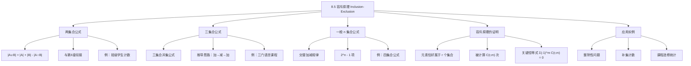

**相关笔记：** [[8.4 生成函数]] | [[8.6 容斥原理的应用]]

> [!abstract] 概览
> 本节系统介绍了==容斥原理（Principle of Inclusion-Exclusion）==的完整理论体系，这是组合数学中处理"集合并集计数"问题的核心工具。在[[6.1 计数基础]]中，我们已经学习了两个集合的容斥公式 $|A_1 \cup A_2| = |A_1| + |A_2| - |A_1 \cap A_2|$，本节将其推广到==任意 $n$ 个有限集==的一般情形。
>
> - ==两集合容斥公式==：$|A \cup B| = |A| + |B| - |A \cap B|$（[[6.1 计数基础|第6章基础版]]）
> - ==三集合容斥公式==：$|A \cup B \cup C| = |A| + |B| + |C| - |A \cap B| - |A \cap C| - |B \cap C| + |A \cap B \cap C|$
> - ==一般 $n$ 集合容斥原理==：交替加减所有非空子集的交集大小
> - ==证明方法==：基于组合计数——每个元素恰好被计算一次
> - 公式共 $2^n - 1$ 项，对应 $\{A_1, \ldots, A_n\}$ 的所有非空子集
> - 核心恒等式：$\binom{r}{0} - \binom{r}{1} + \binom{r}{2} - \cdots + (-1)^r \binom{r}{r} = 0$

---

## 一、知识结构总览

---

## 二、核心思想

> [!tip] 核心思想
> 容斥原理的核心思想是==交替补偿==（alternating compensation）：当我们计算多个集合的并集大小时，先简单地把所有集合的大小相加，然后减去被重复计算的交集部分，再加上被多减的三重交集部分，以此类推。这种"加-减-加-减..."的交替模式确保最终每个元素恰好被计数一次。其数学本质依赖于二项式恒等式 $\sum_{m=0}^{r}(-1)^m \binom{r}{m} = 0$（$r \geq 1$），该恒等式正是[[6.4 二项式系数与恒等式|二项式定理]]中令 $x = -1, y = 1$ 的直接推论。

### 1. 两集合的容斥公式（回顾与衔接）

> [!def] 两集合容斥公式
> 设 $A$ 和 $B$ 为有限集，则
>
> $$|A \cup B| = |A| + |B| - |A \cap B|$$
>
> 这是[[6.1 计数基础]]中==减法法则==的直接结果。直觉上，当我们将 $|A|$ 和 $|B|$ 相加时，$A \cap B$ 中的元素被计算了两次，因此需要减去一次。

> [!example] 例1：离散数学课程的学生数
> 某离散数学课程中，每个学生主修计算机科学或数学（或两者兼修）。主修计算机科学的有 25 人，主修数学的有 13 人，同时主修两门的有 8 人。问共有多少学生？
>
> **解**：设 $A$ 为主修计算机科学的学生集合，$B$ 为主修数学的学生集合。则
>
> $$|A \cup B| = |A| + |B| - |A \cap B| = 25 + 13 - 8 = 30$$
>
> 因此共有 30 名学生。

> [!example] 例2：不超过1000的整数中能被7或11整除的个数
> 设 $A$ 为不超过1000且能被7整除的正整数集合，$B$ 为不超过1000且能被11整除的正整数集合。
>
> $$|A| = \left\lfloor \frac{1000}{7} \right\rfloor = 142, \quad |B| = \left\lfloor \frac{1000}{11} \right\rfloor = 90$$
>
> 因为 $\gcd(7, 11) = 1$，所以能同时被7和11整除的整数就是能被 $7 \times 11 = 77$ 整除的整数：
>
> $$|A \cap B| = \left\lfloor \frac{1000}{77} \right\rfloor = 12$$
>
> 因此：
>
> $$|A \cup B| = 142 + 90 - 12 = 220$$

> [!example] 例3：补集计数——未选修课程的新生数
> 某校有 1807 名新生，其中 453 人选修计算机科学，567人选修数学，299人同时选修两门。问有多少新生两门都未选修？
>
> **解**：选修至少一门的人数为
>
> $$|A \cup B| = 453 + 567 - 299 = 721$$
>
> 因此两门都未选修的人数为 $1807 - 721 = 1086$。

### 2. 三集合的容斥公式

> [!thm] 三集合容斥公式
> 设 $A$、$B$、$C$ 为有限集，则
>
> $$|A \cup B \cup C| = |A| + |B| + |C| - |A \cap B| - |A \cap C| - |B \cap C| + |A \cap B \cap C|$$
>
> **推导思路**（分步补偿法）：
> 1. **第一步（加）**：$|A| + |B| + |C|$ ——恰好在1个集合中的元素被计1次，恰好在2个集合中的元素被计2次，在3个集合中的元素被计3次
> 2. **第二步（减）**：减去所有两两交集 $|A \cap B| + |A \cap C| + |B \cap C|$ ——恰好在1个集合中的元素仍被计1次，恰好在2个集合中的元素被计 $2 - 1 = 1$ 次，但在3个集合中的元素被计 $3 - 3 = 0$ 次
> 3. **第三步（加）**：加上三重交集 $|A \cap B \cap C|$ ——所有元素现在都恰好被计1次

> [!example] 例4：三门语言课程
> 1232名学生选修了西班牙语，879名选修了法语，114名选修了俄语。其中103名同时选修西班牙语和法语，23名同时选修西班牙语和俄语，14名同时选修法语和俄语。已知2092名学生至少选修了其中一门语言，问有多少学生同时选修了三门语言？
>
> **解**：设 $S$、$F$、$R$ 分别为选修西班牙语、法语、俄语的学生集合。代入三集合公式：
>
> $$2092 = 1232 + 879 + 114 - 103 - 23 - 14 + |S \cap F \cap R|$$
>
> $$2092 = 2085 + |S \cap F \cap R|$$
>
> $$|S \cap F \cap R| = 7$$
>
> 因此有7名学生同时选修了三门语言。

### 3. 一般 $n$ 集合的容斥原理

> [!thm] 容斥原理（The Principle of Inclusion-Exclusion）
> 设 $A_1, A_2, \ldots, A_n$ 为有限集，则
>
> $$|A_1 \cup A_2 \cup \cdots \cup A_n| = \sum_{1 \leq i \leq n} |A_i| - \sum_{1 \leq i < j \leq n} |A_i \cap A_j| + \sum_{1 \leq i < j < k \leq n} |A_i \cap A_j \cap A_k| - \cdots + (-1)^{n+1}|A_1 \cap A_2 \cap \cdots \cap A_n|$$
>
> 用紧凑记号表示为：
>
> $$\left|\bigcup_{i=1}^{n} A_i\right| = \sum_{k=1}^{n} (-1)^{k+1} \sum_{1 \leq i_1 < i_2 < \cdots < i_k \leq n} |A_{i_1} \cap A_{i_2} \cap \cdots \cap A_{i_k}|$$
>
> 公式共有 $2^n - 1$ 项，对应 $\{A_1, \ldots, A_n\}$ 的所有非空子集。

> [!def] 容斥原理的证明
> **证明**：我们证明并集中的每个元素恰好被右端表达式计算一次。
>
> 设元素 $a$ 恰好属于 $r$ 个集合（$1 \leq r \leq n$）。我们需要计算该元素在右端各求和项中被计数的总次数。
>
> - 该元素在 $\sum |A_i|$ 中被计数 $\binom{r}{1}$ 次（从它所属的 $r$ 个集合中选1个）
> - 该元素在 $\sum |A_i \cap A_j|$ 中被计数 $\binom{r}{2}$ 次（从 $r$ 个集合中选2个）
> - 一般地，该元素在涉及 $m$ 个集合交集的求和项中被计数 $\binom{r}{m}$ 次
>
> 因此，该元素被计数的总次数为：
>
> $$\binom{r}{1} - \binom{r}{2} + \binom{r}{3} - \cdots + (-1)^{r+1}\binom{r}{r}$$
>
> 由[[6.4 二项式系数与恒等式|二项式定理]]的推论（Corollary 2 of Section 6.4），我们知道：
>
> $$\binom{r}{0} - \binom{r}{1} + \binom{r}{2} - \cdots + (-1)^r \binom{r}{r} = 0$$
>
> 因此：
>
> $$\binom{r}{1} - \binom{r}{2} + \binom{r}{3} - \cdots + (-1)^{r+1}\binom{r}{r} = \binom{r}{0} = 1$$
>
> 这说明每个元素恰好被计数一次。$\blacksquare$

> [!example] 例5：四集合容斥公式
> 对于四个集合 $A_1, A_2, A_3, A_4$，容斥原理给出：
>
> $$|A_1 \cup A_2 \cup A_3 \cup A_4| = |A_1| + |A_2| + |A_3| + |A_4|$$
> $$- |A_1 \cap A_2| - |A_1 \cap A_3| - |A_1 \cap A_4| - |A_2 \cap A_3| - |A_2 \cap A_4| - |A_3 \cap A_4|$$
> $$+ |A_1 \cap A_2 \cap A_3| + |A_1 \cap A_2 \cap A_4| + |A_1 \cap A_3 \cap A_4| + |A_2 \cap A_3 \cap A_4|$$
> $$- |A_1 \cap A_2 \cap A_3 \cap A_4|$$
>
> 共有 $2^4 - 1 = 15$ 项，对应 $\{A_1, A_2, A_3, A_4\}$ 的所有非空子集。

> [!warning] 注意：符号规律
> 容斥原理中各项的符号遵循==交替规律==：
> - 单个集合的大小：$+$（奇数个集合的交集，$(-1)^{1+1} = +$）
> - 两两交集的大小：$-$（偶数个集合的交集，$(-1)^{2+1} = -$）
> - 三重交集的大小：$+$（奇数个集合的交集，$(-1)^{3+1} = +$）
> - 一般地，$k$ 个集合交集的系数为 $(-1)^{k+1}$
>
> 也可以等价地写为：
> $$\left|\bigcup_{i=1}^{n} A_i\right| = \sum_{\emptyset \neq J \subseteq \{1,2,\ldots,n\}} (-1)^{|J|+1} \left|\bigcap_{j \in J} A_j\right|$$

---

## 三、补充理解与易混淆点

### 补充理解

> [!info] 补充1：容斥原理的历史渊源与递进关系
> 容斥原理的思想最早可追溯到 Abraham de Moivre（1718）和 Daniel da Silva（1854）的系统性表述。其名称"Inclusion-Exclusion"反映了"先包含（inclusion）再排除（exclusion）"的操作本质。
>
> 在 Rosen 教材体系中，容斥原理经历了两个层次的递进：
> - **第一层（[[6.1 计数基础|第6章 6.1节]]）**：仅介绍两集合情形 $|A \cup B| = |A| + |B| - |A \cap B|$，作为==减法法则==的特例，用于解决简单的重叠计数问题
> - **第二层（本节 8.5节）**：推广到==任意 $n$ 个集合==的一般情形，并给出严格的组合证明，为 8.6 节的高级应用（错排、onto函数、素数计数等）奠定理论基础
>
> 这种递进设计体现了从特殊到一般的数学思维方法，也与[[5.1 数学归纳法]]的证明思想相呼应——两集合情形是归纳基础，一般 $n$ 集合情形可以通过归纳法证明（见习题24）。
> 来源：da Silva, J. J. (1854). "Propriedades geraes da resolução d'equações binomias." *Memoirs of the Royal Academy of Sciences of Lisbon*, 2, 59–76.
> 来源：Rosen, K. H. (2019). *Discrete Mathematics and Its Applications* (8th ed.), McGraw-Hill, Section 8.5.

> [!info] 补充2：容斥原理与概率论的深层联系
> 容斥原理可以直接推广到概率论中。设 $E_1, E_2, \ldots, E_n$ 为样本空间中的事件，则
>
> $$P(E_1 \cup E_2 \cup \cdots \cup E_n) = \sum_{i} P(E_i) - \sum_{i<j} P(E_i \cap E_j) + \sum_{i<j<k} P(E_i \cap E_j \cap E_k) - \cdots$$
>
> 这与[[7.2 概率论|第7章概率论]]中讨论的事件并集概率公式完全一致。事实上，只需将集合的基数替换为概率，容斥原理的公式结构完全不变。这一联系使得容斥原理成为连接[[第06章_计数-章节汇总|计数理论]]与[[第07章_离散概率-章节汇总|概率理论]]的桥梁。
> 来源：Feller, W. (1968). *An Introduction to Probability Theory and Its Applications, Vol. 1* (3rd ed.). Wiley, Chapter IV.
> 来源：Rosen, K. H. (2019). *Discrete Mathematics and Its Applications* (8th ed.), McGraw-Hill, Section 8.5.

> [!info] 补充3：容斥原理的计算复杂度
> 容斥原理的公式包含 $2^n - 1$ 项，这意味着当 $n$ 较大时，直接套用公式需要指数级计算量。在实际应用中：
> - 当 $n$ 很大但很多交集为空时，大量项为零，实际计算量可能远小于 $2^n - 1$
> - 在某些特殊结构的问题中（如[[8.6 容斥原理的应用|8.6节]]的素数计数），可以利用对称性大幅简化计算
> - 对于 $n$ 很大的一般情形，通常需要借助容斥原理的==补集形式==（见8.6节）或其他高级计数技术
> 来源：Stanley, R. P. (2012). *Enumerative Combinatorics, Vol. 1* (2nd ed.). Cambridge University Press, Section 2.1.
> 来源：van Lint, J. H. & Wilson, R. M. (2001). *A Course in Combinatorics* (2nd ed.). Cambridge University Press, Chapter 10.

### 易混淆点

> [!warning] 误区1：混淆容斥原理的加减方向
> - ❌ 认为所有项都应该相加
> - ✅ 容斥原理的核心是==交替加减==：单个集合加、两两交集减、三重交集加、四重交集减……
> - 记忆口诀："==奇加偶减=="——奇数个集合的交集前面取正号，偶数个集合的交集前面取负号

> [!warning] 误区2：忽略空交集的简化
> - ❌ 机械地写出所有 $2^n - 1$ 项，即使很多交集为空
> - ✅ 在实际计算前，应先分析哪些交集可能为空。例如，若集合两两不相交，则容斥原理退化为简单的加法：$|A_1 \cup A_2 \cup \cdots \cup A_n| = |A_1| + |A_2| + \cdots + |A_n|$
> - 如果没有任何三个集合有公共元素，则所有三重及更高重交集均为零，公式在两两交集项即终止

> [!warning] 误区3：与第6章容斥原理的层次混淆
> - ❌ 认为本节的容斥原理与6.1节的减法法则是完全独立的内容
> - ✅ 6.1节的减法法则 $|A \cup B| = |A| + |B| - |A \cap B|$ 正是容斥原理在 $n = 2$ 时的特例。本节是==同一原理的高级扩展==，从两个集合推广到任意有限个集合
> - 理解这种递进关系有助于建立完整的知识体系

---

## 四、习题精选

> [!todo] 习题概览
> | 题号范围 | 核心考点 | 难度 |
> |---------|---------|------|
> | 1-2 | 两集合容斥公式的基本应用 | ⭐ |
> | 3-4 | 实际问题中的两集合容斥（调查数据、市场报告） | ⭐⭐ |
> | 5-6 | 三集合容斥公式的计算（各种参数组合） | ⭐⭐ |
> | 7-8 | 三集合容斥的实际应用（编程语言、蔬菜偏好） | ⭐⭐⭐ |
> | 9-12 | 补集计数与整除性问题 | ⭐⭐⭐ |
> | 13-14 | 整数性质（奇数/完全平方数/完全立方数） | ⭐⭐⭐ |
> | 15-17 | 排列中的容斥（禁止子串） | ⭐⭐⭐ |
> | 18-19 | 四集合容斥公式的计算 | ⭐⭐⭐ |
> | 20-21 | $n$ 集合容斥的项数与显式公式 | ⭐⭐⭐ |
> | 22 | 五集合容斥的计算 | ⭐⭐⭐⭐ |
> | 23 | 特殊条件下的六集合容斥 | ⭐⭐⭐⭐ |
> | 24-25 | 数学归纳法证明容斥原理、概率推广 | ⭐⭐⭐⭐ |
> | 26-31 | 概率论中的容斥应用 | ⭐⭐⭐⭐ |

### 题1：两集合容斥的基本计算

> [!problem] 题目
> 若 $|A_1| = 12$，$|A_2| = 18$，在以下情况下 $|A_1 \cup A_2|$ 分别是多少？
> (a) $A_1 \cap A_2 = \emptyset$
> (b) $|A_1 \cap A_2| = 1$
> (c) $|A_1 \cap A_2| = 6$
> (d) $A_1 \subseteq A_2$

> [!faq]- 解答
> 由容斥公式 $|A_1 \cup A_2| = |A_1| + |A_2| - |A_1 \cap A_2|$：
>
> (a) $|A_1 \cup A_2| = 12 + 18 - 0 = 30$
>
> (b) $|A_1 \cup A_2| = 12 + 18 - 1 = 29$
>
> (c) $|A_1 \cup A_2| = 12 + 18 - 6 = 24$
>
> (d) 若 $A_1 \subseteq A_2$，则 $A_1 \cap A_2 = A_1$，$|A_1 \cap A_2| = 12$，故 $|A_1 \cup A_2| = 12 + 18 - 12 = 18$
>
> $\blacksquare$

### 题2：课程选修的容斥计数

> [!problem] 题目
> 某学院有345名学生选修了微积分，212名选修了离散数学，188名同时选修了两门课程。问有多少学生至少选修了其中一门？

> [!faq]- 解答
> 设 $A$ 为选修微积分的学生集合，$B$ 为选修离散数学的学生集合。
>
> $$|A \cup B| = |A| + |B| - |A \cap B| = 345 + 212 - 188 = 369$$
>
> 因此有369名学生至少选修了其中一门课程。
>
> $\blacksquare$

### 题3：三集合容斥计算

> [!problem] 题目
> 求 $|A_1 \cup A_2 \cup A_3|$，已知每个集合各有100个元素，且：
> (a) 集合两两不相交
> (b) 每对集合有50个公共元素，三个集合没有公共元素
> (c) 每对集合有50个公共元素，三个集合有25个公共元素
> (d) 三个集合相等

> [!faq]- 解答
> 由三集合容斥公式 $|A_1 \cup A_2 \cup A_3| = |A_1| + |A_2| + |A_3| - |A_1 \cap A_2| - |A_1 \cap A_3| - |A_2 \cap A_3| + |A_1 \cap A_2 \cap A_3|$：
>
> (a) 所有交集为空：$|A_1 \cup A_2 \cup A_3| = 100 + 100 + 100 = 300$
>
> (b) 两两交集各50，三重交集为0：
> $|A_1 \cup A_2 \cup A_3| = 300 - 50 - 50 - 50 + 0 = 150$
>
> (c) 两两交集各50，三重交集为25：
> $|A_1 \cup A_2 \cup A_3| = 300 - 150 + 25 = 175$
>
> (d) 三个集合相等意味着 $A_1 = A_2 = A_3$，所以 $|A_1 \cap A_2| = |A_1 \cap A_3| = |A_2 \cap A_3| = |A_1 \cap A_2 \cap A_3| = 100$：
> $|A_1 \cup A_2 \cup A_3| = 300 - 300 + 100 = 100$
>
> $\blacksquare$

### 题4：补集计数——整除性问题

> [!problem] 题目
> 求不超过100的正整数中，既不能被5整除也不能被7整除的整数个数。

> [!faq]- 解答
> 设 $A$ 为不超过100且能被5整除的正整数集合，$B$ 为不超过100且能被7整除的正整数集合。
>
> $$|A| = \left\lfloor \frac{100}{5} \right\rfloor = 20, \quad |B| = \left\lfloor \frac{100}{7} \right\rfloor = 14$$
>
> $$|A \cap B| = \left\lfloor \frac{100}{35} \right\rfloor = 2$$
>
> 能被5或7整除的整数个数：
> $$|A \cup B| = 20 + 14 - 2 = 32$$
>
> 因此既不能被5也不能被7整除的整数个数为 $100 - 32 = 68$。
>
> $\blacksquare$

### 题5：用数学归纳法证明容斥原理

> [!problem] 题目
> 用数学归纳法证明容斥原理。

> [!faq]- 解答
> **基础步**（$n = 2$）：$|A_1 \cup A_2| = |A_1| + |A_2| - |A_1 \cap A_2|$，这是[[6.1 计数基础]]中已证明的减法法则。
>
> **归纳步**：假设容斥原理对 $n = k$ 个集合成立。考虑 $k + 1$ 个集合 $A_1, A_2, \ldots, A_{k+1}$。
>
> 令 $B = A_1 \cup A_2 \cup \cdots \cup A_k$，则
>
> $$|A_1 \cup A_2 \cup \cdots \cup A_{k+1}| = |B \cup A_{k+1}| = |B| + |A_{k+1}| - |B \cap A_{k+1}|$$
>
> 由归纳假设，$|B|$ 可以展开为 $k$ 个集合的容斥公式。而
>
> $$B \cap A_{k+1} = (A_1 \cap A_{k+1}) \cup (A_2 \cap A_{k+1}) \cup \cdots \cup (A_k \cap A_{k+1})$$
>
> 再次由归纳假设，$|B \cap A_{k+1}|$ 也可以展开。将两部分展开后代入，经过整理（注意符号的交替），即可得到 $k + 1$ 个集合的容斥公式。
>
> $\blacksquare$

> [!tip] 解题思路提示
> 容斥原理问题的解题方法论：
> 1. **识别集合**：将问题中的每个条件/属性对应到一个集合
> 2. **确定目标**：明确要求的是并集大小还是补集大小
> 3. **计算各交集**：系统地计算所有必要交集的大小
> 4. **代入公式**：根据集合数量选择相应版本的容斥公式
> 5. **检查简化**：利用空交集、包含关系等特殊条件简化计算
> 6. **验证结果**：确保结果不超过全集大小，且非负

---

## 五、视频学习指南

> [!info] 视频资源
> | 资源 | 链接 | 对应内容 | 备注 |
> |:-----|:-----|:---------|:-----|
> | Rosen 8e Section 8.5 | [教材原文](https://www.mheducation.com/highered/product/discrete-mathematics-applications-rosen/M9781259676512.html) | 完整定义、定理与例题 | 英文教材 |
> | TrevTutor: Inclusion-Exclusion | [链接](https://www.youtube.com/watch?v=3H28LsQH1xE) | 容斥原理完整讲解 | 英文，含例题 |
> | MIT 6.042J Lecture 12 | [链接](https://www.youtube.com/watch?v=kE1KlRkOa5I) | 容斥原理与概率 | 英文，MIT开放课程 |

---

## 六、教材原文

> [!quote] 教材原文
> "A technique for solving such counting problems was introduced in Section 6.1. In this section we will generalize the ideas introduced in that section to solve problems that require us to count the number of elements in the union of more than two sets."
>
> "The inclusion-exclusion principle tells us that we can count the elements in a union of n sets by adding the number of elements in the sets, then subtracting the sum of the number of elements in all intersections of two of these sets, then adding the number of elements in all intersections of three of these sets, and so on, until we reach the number of elements in the intersection of all the sets."

---

## 参见 Wiki

- [[离散数学/concepts/容斥原理]] -- 容斥原理的定义、公式与证明
- [[离散数学/concepts/容斥原理|指示器函数]] -- 指示器函数（特征函数）与容斥原理的代数证明
- [[离散数学/concepts/排列组合恒等式|二项式恒等式]] -- 容斥原理证明中用到的关键恒等式
- [[离散数学/concepts/集合运算]] -- 并集、交集等基本集合运算
- [[离散数学/concepts/排列组合恒等式|组合恒等式]] -- $\sum_{m=0}^{r}(-1)^m \binom{r}{m} = 0$ 及相关恒等式

#学习/离散数学/高级计数技术
