**相关笔记：** [[8.5 容斥原理]] | [[第09章 关系 — 章节汇总]]

> [!abstract] 概览
> 本节展示了[[8.5 容斥原理|容斥原理]]在若干经典组合计数问题中的强大应用能力。核心应用包括：==容斥原理的补集形式==（计算不具有任何性质的元素数）、==埃拉托斯特尼筛法==（素数计数）、==onto 函数的计数==、==错排问题（derangement）==以及==欧拉函数 $\phi(n)$== 的计算。
>
> - ==容斥原理的补集形式==：$N(\overline{P_1} \cdots \overline{P_n}) = N - \sum N(P_i) + \sum N(P_i P_j) - \cdots$
> - ==埃拉托斯特尼筛法==：用容斥原理计算不超过 $n$ 的素数个数
> - ==onto 函数计数定理==：从 $m$ 元集到 $n$ 元集的 onto 函数有 $\sum_{k=1}^{n}(-1)^{k+1}\binom{n}{k}(n-k)^m$ 个
> - ==错排公式==：$D_n = n!\left[1 - \frac{1}{1!} + \frac{1}{2!} - \cdots + \frac{(-1)^n}{n!}\right]$，且 $\lim_{n \to \infty} \frac{D_n}{n!} = \frac{1}{e} \approx 0.368$
> - ==欧拉函数==：$\phi(n)$ 等于不超过 $n$ 且与 $n$ 互素的正整数个数
> - 跨章关联：[[6.5 广义排列与组合|第二类Stirling数]] $S(m,n)$、[[7.2 概率论|概率论]]、[[4.3 素数与最大公约数|数论]]

---

## 一、知识结构总览

```mermaid
graph TB
    A["8.6 容斥原理的应用"] --> B["补集形式"]
    A --> C["埃拉托斯特尼筛法"]
    A --> D["onto函数计数"]
    A --> E["错排问题 Derangement"]
    A --> F["欧拉函数"]
    A --> G["组合恒等式"]

    B --> B1["N(P1'...Pn') 公式"]
    B --> B2["方程约束解的计数"]
    B --> B3["例：x1+x2+x3=11"]

    C --> C1["不超过n的素数计数"]
    C --> C2["筛除合数因子"]
    C --> C3["例：100以内素数=25"]

    D --> D1["Theorem 1: onto函数公式"]
    D --> D2["与Stirling数的关系"]
    D --> D3["例：工作分配"]

    E --> E1["Dn 的定义"]
    E --> E2["Theorem 2: 错排公式"]
    E --> E3["帽子检查问题"]
    E --> E4["极限 1/e"]
    E --> E5["递推关系"]

    F --> F1["φ(n) 的定义"]
    F --> F2["积性函数性质"]
    F --> F3["容斥原理计算"]

    G --> G1["n! = ΣC(n,k)Dk"]
    G --> G2["Stirling数公式推导"]
```

---

## 二、核心思想

> [!tip] 核心思想
> 本节的核心思想是==容斥原理的补集形式==（alternative form）：在很多计数问题中，我们需要的不是"具有至少一个性质的元素数"（即并集大小），而是"不具有任何性质的元素数"（即补集大小）。通过 $N(\overline{P_1} \cdots \overline{P_n}) = N - |A_1 \cup \cdots \cup A_n|$，我们可以将容斥原理转化为补集计数工具。这一转化是本节所有应用的基础——无论是计算方程约束解的个数、素数的个数、onto函数的个数，还是错排的个数，本质上都是在问"不具有某种'坏'性质的元素有多少个"。

### 1. 容斥原理的补集形式

> [!def] 容斥原理的补集形式
> 设 $N$ 为全集中的元素总数，$P_1, P_2, \ldots, P_n$ 为 $n$ 个性质。令 $N(P_{i_1} P_{i_2} \cdots P_{i_k})$ 表示同时具有性质 $P_{i_1}, P_{i_2}, \ldots, P_{i_k}$ 的元素个数，$N(\overline{P_1} \overline{P_2} \cdots \overline{P_n})$ 表示不具有任何性质的元素个数。则
>
> $$N(\overline{P_1} \overline{P_2} \cdots \overline{P_n}) = N - \sum_{i} N(P_i) + \sum_{i<j} N(P_i P_j) - \sum_{i<j<k} N(P_i P_j P_k) + \cdots + (-1)^n N(P_1 P_2 \cdots P_n)$$
>
> 直觉理解：从总数中减去具有至少一个性质的元素数（由[[8.5 容斥原理|容斥原理]]计算），剩下的就是不具有任何性质的元素数。

> [!example] 例1：带约束的方程解的计数
> 求方程 $x_1 + x_2 + x_3 = 11$ 的非负整数解的个数，其中 $x_1 \leq 3$，$x_2 \leq 4$，$x_3 \leq 6$。
>
> **解**：定义性质：$P_1$ 为 $x_1 > 3$（即 $x_1 \geq 4$），$P_2$ 为 $x_2 > 4$（即 $x_2 \geq 5$），$P_3$ 为 $x_3 > 6$（即 $x_3 \geq 7$）。
>
> 我们需要求 $N(\overline{P_1}\,\overline{P_2}\,\overline{P_3})$，即不满足任何"越界"性质的解的个数。
>
> 利用[[6.5 广义排列与组合|第6章 6.5节]]的"方程非负整数解"方法（等价于"将11个不可区分的球放入3个可区分的盒子"），令 $y_i = x_i - c_i$ 进行变量替换：
>
> - $N$（总解数）$= \binom{3+11-1}{11} = \binom{13}{11} = 78$
> - $N(P_1)$（$x_1 \geq 4$）：令 $y_1 = x_1 - 4$，则 $y_1 + x_2 + x_3 = 7$，解数 $= \binom{3+7-1}{7} = \binom{9}{7} = 36$
> - $N(P_2)$（$x_2 \geq 5$）：令 $y_2 = x_2 - 5$，则 $x_1 + y_2 + x_3 = 6$，解数 $= \binom{8}{6} = 28$
> - $N(P_3)$（$x_3 \geq 7$）：令 $y_3 = x_3 - 7$，则 $x_1 + x_2 + y_3 = 4$，解数 $= \binom{6}{4} = 15$
> - $N(P_1 P_2)$（$x_1 \geq 4, x_2 \geq 5$）：$y_1 + y_2 + x_3 = 2$，解数 $= \binom{4}{2} = 6$
> - $N(P_1 P_3)$（$x_1 \geq 4, x_3 \geq 7$）：$y_1 + x_2 + y_3 = 0$，解数 $= \binom{2}{0} = 1$
> - $N(P_2 P_3)$（$x_2 \geq 5, x_3 \geq 7$）：$x_1 + y_2 + y_3 = -1$，解数 $= 0$
> - $N(P_1 P_2 P_3)$：解数 $= 0$
>
> 代入补集形式公式：
>
> $$N(\overline{P_1}\,\overline{P_2}\,\overline{P_3}) = 78 - 36 - 28 - 15 + 6 + 1 + 0 - 0 = 6$$

### 2. 埃拉托斯特尼筛法（Sieve of Eratosthenes）

> [!def] 用容斥原理计数素数
> [[4.3 素数与最大公约数|第4章]]介绍了埃拉托斯特尼筛法，本节用容斥原理给出其数学基础。
>
> **核心思想**：不超过 $n$ 的合数必有一个不超过 $\sqrt{n}$ 的素因子。因此，不超过 $n$ 的素数 = 不超过 $\sqrt{n}$ 的素数 + 大于1且不超过 $n$ 且不被任何不超过 $\sqrt{n}$ 的素数整除的整数。
>
> **例：计算不超过100的素数个数**
>
> 不超过 $\sqrt{100} = 10$ 的素数为 2, 3, 5, 7。定义性质：
> - $P_1$：被2整除，$P_2$：被3整除，$P_3$：被5整除，$P_4$：被7整除
>
> 大于1且不超过100的整数共99个。由补集形式：
>
> $$N(\overline{P_1}\,\overline{P_2}\,\overline{P_3}\,\overline{P_4}) = 99 - \left\lfloor\frac{100}{2}\right\rfloor - \left\lfloor\frac{100}{3}\right\rfloor - \left\lfloor\frac{100}{5}\right\rfloor - \left\lfloor\frac{100}{7}\right\rfloor$$
> $$+ \left\lfloor\frac{100}{6}\right\rfloor + \left\lfloor\frac{100}{10}\right\rfloor + \left\lfloor\frac{100}{14}\right\rfloor + \left\lfloor\frac{100}{15}\right\rfloor + \left\lfloor\frac{100}{21}\right\rfloor + \left\lfloor\frac{100}{35}\right\rfloor$$
> $$- \left\lfloor\frac{100}{30}\right\rfloor - \left\lfloor\frac{100}{42}\right\rfloor - \left\lfloor\frac{100}{70}\right\rfloor - \left\lfloor\frac{100}{105}\right\rfloor + \left\lfloor\frac{100}{210}\right\rfloor$$
> $$= 99 - 50 - 33 - 20 - 14 + 16 + 10 + 7 + 6 + 4 + 2 - 3 - 2 - 1 - 0 + 0 = 21$$
>
> 因此不超过100的素数共有 $4 + 21 = 25$ 个。

### 3. onto 函数的计数

> [!thm] onto 函数计数定理（Theorem 1）
> 设 $m$ 和 $n$ 为正整数且 $m \geq n$。则从 $m$ 元集到 $n$ 元集的==onto 函数==共有
>
> $$\sum_{k=1}^{n}(-1)^{k+1}\binom{n}{k}(n-k)^m = n^m - \binom{n}{1}(n-1)^m + \binom{n}{2}(n-2)^m - \cdots + (-1)^{n-1}\binom{n}{n-1} \cdot 1^m$$
>
> 个。
>
> **证明思路**：设到达域为 $\{b_1, b_2, \ldots, b_n\}$。定义性质 $P_i$ 为"$b_i$ 不在函数的值域中"。一个函数是 onto 的当且仅当它不具有任何性质 $P_i$。
>
> - 总函数数 $N = n^m$
> - $N(P_i) = (n-1)^m$（值域中不含 $b_i$，每个自变量有 $n-1$ 个选择），共有 $\binom{n}{1}$ 个这样的项
> - $N(P_i P_j) = (n-2)^m$（值域中不含 $b_i$ 和 $b_j$），共有 $\binom{n}{2}$ 个这样的项
> - 一般地，$N(P_{i_1} \cdots P_{i_k}) = (n-k)^m$，共有 $\binom{n}{k}$ 个这样的项
>
> 代入补集形式即得公式。$\blacksquare$

> [!example] 例2：从6元集到3元集的onto函数
> $$\text{onto函数数} = 3^6 - \binom{3}{1} \cdot 2^6 + \binom{3}{2} \cdot 1^6 = 729 - 192 + 3 = 540$$

> [!example] 例3：工作分配问题
> 将5个不同的工作分配给4个不同的员工，要求每个员工至少分到一个工作。这等价于求从5元集（工作集）到4元集（员工集）的onto函数数：
>
> $$4^5 - \binom{4}{1} \cdot 3^5 + \binom{4}{2} \cdot 2^5 - \binom{4}{3} \cdot 1^5 = 1024 - 972 + 192 - 4 = 240$$

> [!info] onto函数与第二类Stirling数的关系
> 从 $m$ 元集到 $n$ 元集的onto函数数等于 $n! \cdot S(m,n)$，其中 $S(m,n)$ 是[[6.5 广义排列与组合|第二类Stirling数]]。
>
> **直觉解释**：将 $m$ 个可区分的球放入 $n$ 个不可区分的非空盒子有 $S(m,n)$ 种方式，再对 $n$ 个盒子赋予标签（排列）有 $n!$ 种方式，因此onto函数数 $= n! \cdot S(m,n)$。
>
> 由此可以反推Stirling数的公式：
>
> $$S(m,n) = \frac{1}{n!}\sum_{k=0}^{n}(-1)^k \binom{n}{k}(n-k)^m$$

### 4. 错排问题（Derangements）

> [!def] 错排（Derangement）
> ==错排==是 $\{1, 2, \ldots, n\}$ 的一种排列，其中==没有任何元素留在其原始位置==上。用 $D_n$ 表示 $n$ 个元素的错排数。
>
> **例**：排列 $21453$ 是 $12345$ 的错排（没有数字在原位），但 $21543$ 不是（4留在原位）。
>
> 小规模验证：$D_3 = 2$，错排为 $231$ 和 $312$。

> [!thm] 错排公式（Theorem 2）
> $n$ 个元素的错排数为
>
> $$D_n = n!\left[1 - \frac{1}{1!} + \frac{1}{2!} - \frac{1}{3!} + \cdots + \frac{(-1)^n}{n!}\right]$$
>
> **证明**：
>
> 设性质 $P_i$ 为"排列固定了元素 $i$"（$i = 1, 2, \ldots, n$）。错排数就是不具有任何性质 $P_i$ 的排列数：
>
> $$D_n = N(\overline{P_1}\,\overline{P_2} \cdots \overline{P_n})$$
>
> 由容斥原理的补集形式：
>
> $$D_n = N - \sum_i N(P_i) + \sum_{i<j} N(P_i P_j) - \sum_{i<j<k} N(P_i P_j P_k) + \cdots + (-1)^n N(P_1 P_2 \cdots P_n)$$
>
> 逐项计算：
> - $N = n!$（总排列数）
> - $N(P_i) = (n-1)!$（固定第 $i$ 个位置，其余 $n-1$ 个位置任意排列），共有 $\binom{n}{1}$ 个这样的项
> - $N(P_i P_j) = (n-2)!$（固定第 $i$ 和第 $j$ 个位置），共有 $\binom{n}{2}$ 个这样的项
> - 一般地，$N(P_{i_1} P_{i_2} \cdots P_{i_m}) = (n-m)!$，共有 $\binom{n}{m}$ 个这样的项
>
> 代入得：
>
> $$D_n = n! - \binom{n}{1}(n-1)! + \binom{n}{2}(n-2)! - \cdots + (-1)^n \binom{n}{n}(n-n)!$$
>
> 利用 $\binom{n}{m}(n-m)! = \frac{n!}{m!}$，化简得：
>
> $$D_n = n! - \frac{n!}{1!} + \frac{n!}{2!} - \cdots + (-1)^n \frac{n!}{n!} = n!\left[1 - \frac{1}{1!} + \frac{1}{2!} - \cdots + \frac{(-1)^n}{n!}\right]$$
>
> $\blacksquare$

> [!example] 例4：帽子检查问题（The Hatcheck Problem）
> 一位新员工负责检查餐厅顾客的帽子，但忘记在帽子上做标记。当顾客取回帽子时，检查员从剩余帽子中随机分配。问没有人拿到自己帽子的概率是多少？
>
> **解**：该概率为 $\frac{D_n}{n!}$，由错排公式：
>
> $$\frac{D_n}{n!} = 1 - \frac{1}{1!} + \frac{1}{2!} - \frac{1}{3!} + \cdots + \frac{(-1)^n}{n!}$$
>
> | $n$ | 2 | 3 | 4 | 5 | 6 | 7 |
> |:---:|:---:|:---:|:---:|:---:|:---:|:---:|
> | $D_n/n!$ | 0.50000 | 0.33333 | 0.37500 | 0.36667 | 0.36806 | 0.36786 |

> [!thm] 错排概率的极限
> 由微积分中的指数函数展开式 $e^x = \sum_{j=0}^{\infty} \frac{x^j}{j!}$，令 $x = -1$ 得
>
> $$e^{-1} = 1 - \frac{1}{1!} + \frac{1}{2!} - \frac{1}{3!} + \cdots + \frac{(-1)^n}{n!} + \cdots \approx 0.368$$
>
> 由于这是一个各项趋于零的==交错级数==，当 $n$ 增大时，错排概率收敛于 $e^{-1} \approx 0.368$。事实上，该概率与 $e^{-1}$ 的误差不超过 $\frac{1}{(n+1)!}$。
>
> 这意味着无论有多少人，没有人拿到自己帽子的概率大约都是 ==36.8%==，这是一个非常优美的结果。

> [!thm] 错排的递推关系
> 错排数 $D_n$ 满足递推关系：
>
> $$D_n = (n-1)(D_{n-1} + D_{n-2}), \quad n \geq 2$$
>
> 初始条件：$D_0 = 1$，$D_1 = 0$。
>
> **组合证明**：考虑 $n$ 个元素的错排中第1个元素的位置。它不能在位置1，所以它可以在位置 $2, 3, \ldots, n$ 中的任意一个，共 $n-1$ 种选择。假设第1个元素放在位置 $k$：
> - **情况1**：第 $k$ 个元素放在位置1（两个元素交换），则剩余 $n-2$ 个元素需要错排，有 $D_{n-2}$ 种方式
> - **情况2**：第 $k$ 个元素不放在位置1，则元素 $2, \ldots, n$（除第1个外）在位置 $1, 2, \ldots, k-1, k+1, \ldots, n$ 中需要形成错排（其中位置1现在"属于"第 $k$ 个元素），有 $D_{n-1}$ 种方式
>
> 因此 $D_n = (n-1)(D_{n-1} + D_{n-2})$。$\blacksquare$

> [!thm] 错排的另一递推形式
> $$D_n = nD_{n-1} + (-1)^n, \quad n \geq 1$$
>
> 这可以由显式公式直接验证，也可以由前一递推关系推导。

### 5. 欧拉函数 $\phi(n)$

> [!def] 欧拉函数（Euler's Totient Function）
> ==欧拉函数== $\phi(n)$ 表示不超过 $n$ 且与 $n$ 互素的正整数个数。即
>
> $$\phi(n) = |\{k \in \mathbb{Z}^+ : 1 \leq k \leq n, \gcd(k, n) = 1\}|$$
>
> 欧拉函数在[[4.3 素数与最大公约数|数论]]和密码学中有重要应用。

> [!thm] 用容斥原理计算欧拉函数
> 设 $n = p_1^{a_1} p_2^{a_2} \cdots p_k^{a_k}$ 为 $n$ 的素因子分解。定义性质 $P_i$ 为"整数能被 $p_i$ 整除"（$i = 1, 2, \ldots, k$）。则
>
> $$\phi(n) = n - \sum_{i} \frac{n}{p_i} + \sum_{i<j} \frac{n}{p_i p_j} - \sum_{i<j<l} \frac{n}{p_i p_j p_l} + \cdots + (-1)^k \frac{n}{p_1 p_2 \cdots p_k}$$
>
> 利用乘法公式，可以化简为：
>
> $$\phi(n) = n\left(1 - \frac{1}{p_1}\right)\left(1 - \frac{1}{p_2}\right) \cdots \left(1 - \frac{1}{p_k}\right) = n \prod_{p \mid n}\left(1 - \frac{1}{p}\right)$$
>
> **推导**：不超过 $n$ 且能被 $p_{i_1} p_{i_2} \cdots p_{i_m}$ 整除的整数有 $\left\lfloor \frac{n}{p_{i_1} p_{i_2} \cdots p_{i_m}} \right\rfloor = \frac{n}{p_{i_1} p_{i_2} \cdots p_{i_m}}$ 个（因为 $n$ 是这些素数的幂的乘积，所以整除）。代入容斥原理的补集形式，再因式分解即得乘积公式。

> [!example] 计算欧拉函数的例子
> - $\phi(12) = \phi(2^2 \cdot 3) = 12\left(1 - \frac{1}{2}\right)\left(1 - \frac{1}{3}\right) = 12 \cdot \frac{1}{2} \cdot \frac{2}{3} = 4$
>
> 验证：不超过12且与12互素的正整数为 1, 5, 7, 11，共4个。
>
> - $\phi(30) = \phi(2 \cdot 3 \cdot 5) = 30 \cdot \frac{1}{2} \cdot \frac{2}{3} \cdot \frac{4}{5} = 8$
>
> 验证：1, 7, 11, 13, 17, 19, 23, 29，共8个。
>
> - $\phi(pq)$（$p, q$ 为不同素数）$= pq\left(1 - \frac{1}{p}\right)\left(1 - \frac{1}{q}\right) = (p-1)(q-1)$

### 6. 容斥原理在组合恒等式中的应用

> [!thm] 全排列的错排分解
> $n$ 个元素的全排列可以按"恰好固定了 $k$ 个元素"来分类：
>
> $$n! = \binom{n}{0}D_n + \binom{n}{1}D_{n-1} + \binom{n}{2}D_{n-2} + \cdots + \binom{n}{n-1}D_1 + \binom{n}{n}D_0$$
>
> 其中 $D_k$ 是 $k$ 个元素的错排数。
>
> **直觉解释**：从 $n$ 个元素中选 $k$ 个固定位置（有 $\binom{n}{k}$ 种选法），其余 $n-k$ 个元素形成错排（有 $D_{n-k}$ 种方式）。对所有 $k$ 求和即得全排列数 $n!$。
>
> 这一恒等式将排列计数与错排计数联系起来，是容斥原理思想的自然推论。

---

## 三、补充理解与易混淆点

### 补充理解

> [!info] 补充1：错排问题的历史——Montmort 的邂逅问题
> 错排问题有着悠久的历史。1708年，法国数学家 Pierre Raymond de Montmort (1678-1719) 在研究一种叫做"rencontres（邂逅）"的法国纸牌游戏时提出了这个问题：将两副52张的牌分别排成一行，求没有一张牌在同一位置匹配的概率。这个概率正是 $D_{52}/52!$，由错排公式可知其近似值为 $1/e \approx 0.368$。
>
> 错排问题也被称为"derangement problem"或"probleme des rencontres"，是组合数学中最经典的计数问题之一。其解法的优美之处在于：尽管问题看似复杂，但最终的概率竟然趋近于一个与 $n$ 无关的常数 $1/e$，这深刻地揭示了离散数学与连续数学（微积分）之间的内在联系。
> 来源：Montmort, P. R. de (1708). *Essay d'Analyse sur les Jeux de Hazard*. Paris: Quillau.
> 来源：Rosen, K. H. (2019). *Discrete Mathematics and Its Applications* (8th ed.), McGraw-Hill, Section 8.6.

> [!info] 补充2：容斥原理与第二类Stirling数的深层联系
> 由 onto 函数计数定理，我们知道：
>
> $$\sum_{k=0}^{n}(-1)^k \binom{n}{k}(n-k)^m = n! \cdot S(m,n)$$
>
> 这给出了[[6.5 广义排列与组合|第二类Stirling数]]的一个显式公式：
>
> $$S(m,n) = \frac{1}{n!}\sum_{k=0}^{n}(-1)^k \binom{n}{k}(n-k)^m$$
>
> 这一公式在组合数学中极其重要，它将"将 $m$ 个可区分的球放入 $n$ 个不可区分的非空盒子"这个看似困难的计数问题，转化为一个可以直接计算的代数表达式。这也解释了为什么[[6.5 广义排列与组合|第6章]]在介绍Stirling数时只给出了递推定义而没有给出闭式公式——闭式公式的推导需要容斥原理这一更高级的工具。
> 来源：Graham, R. L., Knuth, D. E. & Patashnik, O. (1994). *Concrete Mathematics* (2nd ed.), Addison-Wesley, Section 6.1.
> 来源：Knuth, D. E. (1997). *The Art of Computer Programming, Vol. 3: Sorting and Searching* (2nd ed.), Addison-Wesley, Section 5.1.2.

> [!info] 补充3：容斥原理在概率论中的应用
> 容斥原理的补集形式可以直接推广到概率论中。设 $E_1, E_2, \ldots, E_n$ 为样本空间中的事件，则
>
> $$P(\overline{E_1} \cap \overline{E_2} \cap \cdots \cap \overline{E_n}) = 1 - \sum_i P(E_i) + \sum_{i<j} P(E_i \cap E_j) - \cdots$$
>
> 这与[[7.2 概率论|第7章]]中讨论的事件概率公式一致。帽子检查问题的解正是这一推广的直接应用：$P(\text{无匹配}) = D_n/n!$。当 $n$ 较大时，这个概率接近 $1/e$，这一结果在实际应用中（如随机排序、密码学中的置换分析）有重要意义。
> 来源：Feller, W. (1968). *An Introduction to Probability Theory and Its Applications, Vol. 1* (3rd ed.). Wiley, Chapter IV.
> 来源：Rosen, K. H. (2019). *Discrete Mathematics and Its Applications* (8th ed.), McGraw-Hill, Section 8.6.

### 易混淆点

> [!warning] 误区1：混淆"至少一个固定"与"恰好一个固定"
> - ❌ 认为错排公式给出的是"恰好一个元素在原位"的排列数
> - ✅ 错排 $D_n$ 是"没有任何元素在原位"的排列数
> - "恰好 $k$ 个元素在原位"的排列数为 $\binom{n}{k} D_{n-k}$（先选 $k$ 个固定，其余错排）
> - "至少一个元素在原位"的排列数为 $n! - D_n$

> [!warning] 误区2：onto函数公式中 $(n-k)^m$ 与 $k^m$ 的混淆
> - ❌ 写成 $\binom{n}{k} k^m$（这是"值域恰好有 $k$ 个元素"的函数数的错误公式）
> - ✅ onto函数公式中是 $\binom{n}{k}(n-k)^m$，含义是"从到达域中排除 $k$ 个元素后，每个自变量有 $n-k$ 个选择"
> - 直觉：$N(P_{i_1} \cdots P_{i_k}) = (n-k)^m$ 表示值域中不包含指定的 $k$ 个元素

> [!warning] 误区3：欧拉函数 $\phi(n)$ 的计算范围
> - ❌ 认为 $\phi(n)$ 计算的是不超过 $n$ 的素数个数
> - ✅ $\phi(n)$ 计算的是不超过 $n$ 且与 $n$ 互素的正整数个数（包括1，但不一定都是素数）
> - 例如 $\phi(12) = 4$，对应的整数是 1, 5, 7, 11，其中1不是素数
> - 不超过 $n$ 的素数个数记为 $\pi(n)$（素数计数函数），与欧拉函数是不同的概念

---

## 四、习题精选

> [!todo] 习题概览
> | 题号范围 | 核心考点 | 难度 |
> |---------|---------|------|
> | 1-2 | 补集形式的基本应用（苹果、登山申请） | ⭐⭐ |
> | 3-4 | 带约束的方程解计数 | ⭐⭐⭐ |
> | 5-7 | 素数计数、无平方因子数、高次幂 | ⭐⭐⭐ |
> | 8-10 | onto函数计数与分配问题 | ⭐⭐⭐ |
> | 11-12 | 带附加约束的工作分配 | ⭐⭐⭐⭐ |
> | 13-14 | 错排的计算与概率 | ⭐⭐⭐ |
> | 15-17 | 错排的变体（信封、座位、偶数位） | ⭐⭐⭐⭐ |
> | 18-19 | 错排的递推关系与显式公式 | ⭐⭐⭐⭐ |
> | 20-21 | 错排的奇偶性与显式推导 | ⭐⭐⭐⭐ |
> | 22-23 | 欧拉函数 $\phi(n)$ 的计算 | ⭐⭐⭐⭐ |
> | 24-27 | 组合恒等式与全排列分解 | ⭐⭐⭐⭐ |

### 题1：补集形式的基本应用

> [!problem] 题目
> 一筐100个苹果中，20个有虫，15个有碰伤。只有既无虫又无碰伤的苹果才能出售。如果有10个苹果同时有虫和碰伤，问这筐苹果中有多少个可以出售？

> [!faq]- 解答
> 设 $A$ 为有虫的苹果集合，$B$ 为有碰伤的苹果集合。
>
> $$|A| = 20, \quad |B| = 15, \quad |A \cap B| = 10$$
>
> 有虫或有碰伤的苹果数：
> $$|A \cup B| = 20 + 15 - 10 = 25$$
>
> 因此可以出售的苹果数为 $100 - 25 = 75$ 个。
>
> $\blacksquare$

### 题2：带约束的方程解计数

> [!problem] 题目
> 方程 $x_1 + x_2 + x_3 = 13$ 有多少非负整数解，其中 $x_1, x_2, x_3$ 均小于6？

> [!faq]- 解答
> 定义性质：$P_1$ 为 $x_1 \geq 6$，$P_2$ 为 $x_2 \geq 6$，$P_3$ 为 $x_3 \geq 6$。
>
> - $N = \binom{3+13-1}{13} = \binom{15}{13} = 105$
> - $N(P_1)$：令 $y_1 = x_1 - 6$，$y_1 + x_2 + x_3 = 7$，解数 $= \binom{9}{7} = 36$
> - 同理 $N(P_2) = N(P_3) = 36$
> - $N(P_1 P_2)$：$y_1 + y_2 + x_3 = 1$，解数 $= \binom{3}{1} = 3$
> - 同理 $N(P_1 P_3) = N(P_2 P_3) = 3$
> - $N(P_1 P_2 P_3)$：$y_1 + y_2 + y_3 = -5$，解数 $= 0$
>
> $$N(\overline{P_1}\,\overline{P_2}\,\overline{P_3}) = 105 - 3 \times 36 + 3 \times 3 - 0 = 105 - 108 + 9 = 6$$
>
> $\blacksquare$

### 题3：onto函数计数

> [!problem] 题目
> 从7元集到5元集有多少个onto函数？

> [!faq]- 解答
> 由onto函数计数定理：
>
> $$\sum_{k=1}^{5}(-1)^{k+1}\binom{5}{k}(5-k)^7$$
> $$= \binom{5}{1} \cdot 4^7 - \binom{5}{2} \cdot 3^7 + \binom{5}{3} \cdot 2^7 - \binom{5}{4} \cdot 1^7 + \binom{5}{5} \cdot 0^7$$
> $$= 5 \cdot 16384 - 10 \cdot 2187 + 10 \cdot 128 - 5 \cdot 1 + 0$$
> $$= 81920 - 21870 + 1280 - 5$$
> $$= 61325$$
>
> $\blacksquare$

### 题4：错排的计算

> [!problem] 题目
> 求7个元素的错排数 $D_7$。

> [!faq]- 解答
> 由错排公式：
>
> $$D_7 = 7!\left[1 - \frac{1}{1!} + \frac{1}{2!} - \frac{1}{3!} + \frac{1}{4!} - \frac{1}{5!} + \frac{1}{6!} - \frac{1}{7!}\right]$$
> $$= 5040\left[1 - 1 + \frac{1}{2} - \frac{1}{6} + \frac{1}{24} - \frac{1}{120} + \frac{1}{720} - \frac{1}{5040}\right]$$
> $$= 5040 \times \frac{1854}{5040} = 1854$$
>
> 也可以用递推关系验证：$D_5 = 44$，$D_6 = 265$，则 $D_7 = 6(D_6 + D_5) = 6 \times 309 = 1854$。$\blacksquare$

### 题5：欧拉函数的计算

> [!problem] 题目
> 设 $p$ 和 $q$ 为不同的素数，用容斥原理求不超过 $pq$ 且与 $pq$ 互素的正整数个数 $\phi(pq)$。

> [!faq]- 解答
> 定义性质：$P_1$ 为"能被 $p$ 整除"，$P_2$ 为"能被 $q$ 整除"。
>
> 不超过 $pq$ 的正整数共 $pq$ 个。
>
> - $N(P_1) = \left\lfloor \frac{pq}{p} \right\rfloor = q$（能被 $p$ 整除）
> - $N(P_2) = \left\lfloor \frac{pq}{q} \right\rfloor = p$（能被 $q$ 整除）
> - $N(P_1 P_2) = \left\lfloor \frac{pq}{pq} \right\rfloor = 1$（能被 $pq$ 整除，即 $pq$ 本身）
>
> 由容斥原理的补集形式：
>
> $$\phi(pq) = pq - q - p + 1 = (p-1)(q-1)$$
>
> 这与乘积公式 $\phi(pq) = pq\left(1 - \frac{1}{p}\right)\left(1 - \frac{1}{q}\right) = (p-1)(q-1)$ 一致。
>
> $\blacksquare$

> [!tip] 解题思路提示
> 容斥原理应用问题的解题方法论：
> 1. **识别性质**：将"不希望发生的情况"定义为性质 $P_i$
> 2. **确定目标**：明确求的是 $N(\overline{P_1} \cdots \overline{P_n})$（补集形式）
> 3. **计算各 $N(P_{i_1} \cdots P_{i_k})$**：利用[[6.5 广义排列与组合|方程解计数]]、整除性等工具
> 4. **代入公式**：注意交替加减的符号
> 5. **特殊技巧**：
>    - onto函数：$N(P_{i_1} \cdots P_{i_k}) = (n-k)^m$
>    - 错排：$N(P_{i_1} \cdots P_{i_k}) = (n-k)!$
>    - 欧拉函数：$N(P_{i_1} \cdots P_{i_k}) = n/(p_{i_1} \cdots p_{i_k})$

---

## 五、视频学习指南

> [!info] 视频资源
> | 资源 | 链接 | 对应内容 | 备注 |
> |:-----|:-----|:---------|:-----|
> | Rosen 8e Section 8.6 | [教材原文](https://www.mheducation.com/highered/product/discrete-mathematics-applications-rosen/M9781259676512.html) | 完整定理与例题 | 英文教材 |
> | TrevTutor: Derangements | [链接](https://www.youtube.com/watch?v=bKcL2cE1F9Y) | 错排问题完整讲解 | 英文，含例题 |
> | Numberphile: Derangements | [链接](https://www.youtube.com/watch?v=6DpBk2aGxVs) | 帽子问题与 $1/e$ | 英文，科普风格 |
> | Mathologer: Euler's totient | [链接](https://www.youtube.com/watch?v=UX6KxT3G1Bk) | 欧拉函数的直觉理解 | 英文，可视化讲解 |

---

## 六、教材原文

> [!quote] 教材原文
> "Many counting problems can be solved using the principle of inclusion-exclusion. For instance, we can use this principle to find the number of primes less than a positive integer. Many problems can be solved by counting the number of onto functions from one finite set to another."
>
> "A derangement is a permutation of objects that leaves no object in its original position. The well-known hatcheck problem can be solved using the principle of inclusion-exclusion. This problem asks for the probability that no person is given the correct hat back by a hatcheck person who gives the hats back randomly."
>
> "By the identity $e^x = \sum_{j=0}^{\infty} x^j/j!$ for all real numbers (from calculus), we know that $e^{-1} = 1 - 1/1! + 1/2! - 1/3! + \cdots + (-1)^n/n! + \cdots \approx 0.368$."

---

## 参见 Wiki

- [[离散数学/concepts/容斥原理]] -- 容斥原理的完整理论体系
- [[离散数学/concepts/错排问题]] -- 错排的定义、公式、递推关系与概率极限
- [[离散数学/concepts/欧拉函数]] -- 欧拉函数 $\phi(n)$ 的定义、计算公式与性质
- [[离散数学/concepts/onto函数]] -- onto函数（满射）的计数公式
- [[离散数学/concepts/容斥原理|指示器函数]] -- 指示器函数与容斥原理的代数证明
- [[离散数学/concepts/斯特林数|第二类Stirling数]] -- Stirling数与onto函数的关系
- [[离散数学/concepts/素数|埃拉托斯特尼筛法]] -- 素数筛法与容斥原理

#学习/离散数学/高级计数技术
