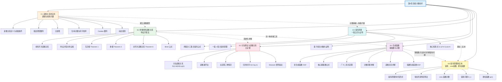

# 第08章 高级计数技术 — 章节汇总

> [!abstract] 概览
> 第8章系统介绍了三大高级计数技术：==递推关系==（Recurrence Relations）、==生成函数==（Generating Functions）和==容斥原理==（Inclusion–Exclusion），是第6章基础计数方法的深度扩展。全章首先展示如何用递推关系对实际问题建模（8.1），然后系统讲解常系数线性递推关系的求解方法——特征方程法与待定系数法（8.2）；进而将递推关系应用于分治算法的复杂度分析，引入==主定理（Master Theorem）==（8.3）；随后介绍==生成函数==这一将计数问题转化为幂级数系数提取的强大工具（8.4）；最后深入==容斥原理==的一般公式及其在错排问题、onto 函数计数、欧拉函数计算等经典问题中的应用（8.5-8.6）。全章体现了从"递推建模→系统求解→分治分析→生成函数→容斥计数"的完整知识链条，为算法复杂度分析、组合数学和概率论提供了核心数学工具。

---

## 全章知识框架



---

## 各节核心知识点汇总

| 小节 | 核心概念 | 关键公式/定理 | 与前后节的关联 |
|:-----|:---------|:-------------|:---------------|
| 8.1 递推关系的应用 | 递推关系建模、初始条件、斐波那契数列、汉诺塔、位串计数、Catalan 数、动态规划 | $F_n = F_{n-1} + F_{n-2}$；$H_n = 2H_{n-1} + 1$；$C_n = \sum_{k=0}^{n-1} C_k C_{n-k-1}$ | 全章起点，将实际问题转化为递推模型；为 8.2 提供求解对象；与第5章递归定义直接衔接 |
| 8.2 求解线性递推关系 | 线性齐次/非齐次递推关系、特征方程、特征根、通解、特解、Binet 公式 | $r^k - c_1 r^{k-1} - \cdots - c_k = 0$；$a_n = \sum \alpha_i r_i^n$；通解 = 齐次通解 + 特解 | 为 8.1 的递推模型提供系统求解方法；为 8.3 分治递推提供理论基础；与第5章数学归纳法验证解的正确性 |
| 8.3 分治算法与递推关系 | 分治递推关系、递推展开法、主定理（Master Theorem）、归并排序、Strassen 矩阵乘法 | $f(n) = af(n/b) + g(n)$；主定理三种情况；归并排序 $O(n\log n)$ | 8.2 的特殊应用场景；与第3章算法复杂度、大O记号紧密关联 |
| 8.4 生成函数 | 常生成函数（OGF）、指数生成函数（EGF）、广义二项式定理、幂级数运算 | $G(x) = \sum a_k x^k$；$\frac{1}{(1-x)^n} = \sum \binom{n+k-1}{k} x^k$；$(1+x)^u = \sum \binom{u}{k} x^k$ | 递推关系的另一种求解工具（与 8.2 互补）；与第6章排列组合、二项式定理紧密关联 |
| 8.5 容斥原理 | 一般 $n$ 集合容斥原理、基于组合计数的证明、核心恒等式 | $|A_1 \cup \cdots \cup A_n| = \sum |A_i| - \sum |A_i \cap A_j| + \cdots$；$\sum_{k=0}^{r}(-1)^k \binom{r}{k} = 0$ | 第6章容斥原理的高级扩展；为 8.6 的应用提供理论基础；与第7章概率论中的容斥公式呼应 |
| 8.6 容斥原理的应用 | 补集形式、埃拉托斯特尼筛法、onto 函数计数、错排问题、欧拉函数 | $D_n = n![1 - 1/1! + 1/2! - \cdots]$；$\phi(n) = n\prod_{p|n}(1-1/p)$；onto 函数 $\sum(-1)^{k+1}\binom{n}{k}(n-k)^m$ | 8.5 理论的直接应用；与第4章数论（欧拉函数、素数）、第6章（Stirling 数）、第7章（概率）跨章关联 |

---

## 学习脉络

```
递推关系的应用（8.1）— 从实际问题（斐波那契、汉诺塔等）建立递推模型，配合初始条件定义序列
  ↓
求解线性递推关系（8.2）— 特征方程法求解齐次递推，待定系数法求解非齐次递推，获得闭式解
  ↓
分治算法与递推关系（8.3）— 将递推关系应用于分治算法复杂度分析，主定理直接判定复杂度阶
  ↓
生成函数（8.4）— 另一种强大工具：将计数/递推问题转化为幂级数运算，提取系数获得答案
  ↓
容斥原理（8.5）— 从两集合/三集合推广到一般 n 集合的容斥公式，完整证明
  ↓
容斥原理的应用（8.6）— 错排、onto 函数、欧拉函数、素数筛法等经典组合计数问题
```

**学习建议**：8.1 节是全章的建模起点——务必掌握从实际问题中提取递推关系的方法论：分析递归结构、将第 $n$ 步分解为互不重叠的若干情况、建立递推公式与初始条件，Catalan 数列是递推建模的经典范例；8.2 节是递推求解的核心——特征方程法是求解线性齐次递推关系的标准方法，需熟练掌握互异根和重根两种情况，非齐次递推的待定系数法需根据 $F(n)$ 的形式选择特解结构并注意特征根的影响，Binet 公式是特征方程法的精彩应用；8.3 节是算法分析的关键——主定理的三种情况是判断分治算法复杂度的核心工具，建议结合归并排序、二分查找等经典算法加深理解，递推展开法是主定理的补充验证手段；8.4 节是计数方法的飞跃——生成函数将计数问题转化为幂级数系数提取，核心幂级数公式表必须熟记，广义二项式定理是处理非整数指数的关键工具，部分分式分解是从生成函数提取系数的标准技术；8.5 节是容斥理论的完整建立——从两集合到 $n$ 集合的推广过程体现了数学归纳法的力量，核心恒等式 $\sum(-1)^k \binom{r}{k} = 0$ 是证明的关键；8.6 节是容斥原理的实战——错排问题 $D_n$ 的公式与概率极限 $1/e$ 是高频考点，onto 函数计数与第二类 Stirling 数的关系体现了不同计数方法之间的深层联系，欧拉函数 $\phi(n)$ 的容斥推导是数论与组合数学的完美交汇。

---

## 跨节综合复习题

> [!problem] 综合复习题 1（跨 8.1 / 8.2 / 8.4）
> **题目：** 考虑用 $1 \times 2$ 多米诺骨牌完美覆盖 $2 \times n$ 棋盘的方法数 $a_n$。
> (a) 建立 $a_n$ 的递推关系与初始条件。
> (b) 用特征方程法求 $a_n$ 的闭式公式。
> (c) 用生成函数方法重新求解，验证结果一致。

> [!faq]- 解答
> **(a)** 考虑 $2 \times n$ 棋盘最左列的覆盖方式：
> - 竖放一块 $1 \times 2$ 骨牌：剩余 $2 \times (n-1)$ 棋盘，有 $a_{n-1}$ 种方法
> - 横放两块 $1 \times 2$ 骨牌（占据最左列的两格）：剩余 $2 \times (n-2)$ 棋盘，有 $a_{n-2}$ 种方法
>
> 因此递推关系：$a_n = a_{n-1} + a_{n-2}$，$n \geq 3$
>
> 初始条件：$a_1 = 1$（竖放），$a_2 = 2$（两块竖放或两块横放）
>
> **(b)** 特征方程：$r^2 - r - 1 = 0$，解得 $r = \frac{1 \pm \sqrt{5}}{2}$
>
> 设 $\alpha = \frac{1+\sqrt{5}}{2}$，$\beta = \frac{1-\sqrt{5}}{2}$，则通解为 $a_n = A\alpha^n + B\beta^n$
>
> 代入初始条件：
> - $a_1 = A\alpha + B\beta = 1$
> - $a_2 = A\alpha^2 + B\beta^2 = 2$
>
> 注意到 $\alpha^2 = \alpha + 1$，$\beta^2 = \beta + 1$，因此 $a_2 = A(\alpha+1) + B(\beta+1) = (A\alpha + B\beta) + (A+B) = 1 + (A+B) = 2$，得 $A + B = 1$。
>
> 由 $A\alpha + B\beta = 1$ 和 $A + B = 1$：
> $A\alpha + (1-A)\beta = 1 \Rightarrow A(\alpha - \beta) = 1 - \beta \Rightarrow A = \frac{1-\beta}{\alpha-\beta} = \frac{1 - \frac{1-\sqrt{5}}{2}}{\sqrt{5}} = \frac{\frac{1+\sqrt{5}}{2}}{\sqrt{5}} = \frac{1}{\sqrt{5}}$
>
> 同理 $B = \frac{\alpha - 1}{\alpha - \beta} = \frac{\frac{-1+\sqrt{5}}{2}}{\sqrt{5}} = -\frac{1}{\sqrt{5}}$
>
> 因此 $a_n = \frac{1}{\sqrt{5}}\left(\frac{1+\sqrt{5}}{2}\right)^n - \frac{1}{\sqrt{5}}\left(\frac{1-\sqrt{5}}{2}\right)^n = \frac{\alpha^n - \beta^n}{\sqrt{5}}$
>
> 这正是斐波那契数列的 Binet 公式！$a_n = F_n$。
>
> **(c)** 设生成函数 $G(x) = \sum_{n=1}^{\infty} a_n x^n$。由 $a_n = a_{n-1} + a_{n-2}$（$n \geq 3$）：
>
> $G(x) - a_1 x - a_2 x^2 = x(G(x) - a_1 x) + x^2 G(x)$
>
> $G(x) - x - 2x^2 = xG(x) - x^2 + x^2 G(x)$
>
> $G(x)(1 - x - x^2) = x + 2x^2 - x^2 = x + x^2$
>
> $G(x) = \frac{x + x^2}{1 - x - x^2} = \frac{x(1+x)}{1-x-x^2}$
>
> 对 $1 - x - x^2 = (1-\alpha x)(1-\beta x)$ 做部分分式分解：
>
> $G(x) = \frac{x(1+x)}{(1-\alpha x)(1-\beta x)} = \frac{A}{1-\alpha x} + \frac{B}{1-\beta x}$
>
> 其中 $A = \frac{1}{\sqrt{5}}$，$B = -\frac{1}{\sqrt{5}}$（与(b)中相同）。
>
> 因此 $G(x) = \frac{1}{\sqrt{5}} \sum_{n=0}^{\infty} \alpha^n x^n - \frac{1}{\sqrt{5}} \sum_{n=0}^{\infty} \beta^n x^n$
>
> 提取 $x^n$ 系数：$a_n = \frac{\alpha^n - \beta^n}{\sqrt{5}}$，与(b)结果完全一致。
>
> $\blacksquare$

> [!problem] 综合复习题 2（跨 8.5 / 8.6 / 7.2）
> **题目：** (a) 用容斥原理证明错排公式 $D_n = n!\left[1 - \frac{1}{1!} + \frac{1}{2!} - \cdots + \frac{(-1)^n}{n!}\right]$。
> (b) 计算 $D_5$ 和 $D_6$ 的值。
> (c) 若将 6 封信随机装入 6 个信封，求恰好没有一封装对的概率。
> (d) 证明 $\lim_{n \to \infty} \frac{D_n}{n!} = \frac{1}{e}$。

> [!faq]- 解答
> **(a)** 设 $S$ 为 $\{1, 2, \ldots, n\}$ 的全排列集合，$|S| = n!$。设 $A_i$ 为"第 $i$ 个元素保持不动"的排列集合。
>
> 错排数 $D_n = |\overline{A_1} \cap \overline{A_2} \cap \cdots \cap \overline{A_n}|$。
>
> 由容斥原理的补集形式：
> $D_n = |S| - \sum|A_i| + \sum|A_i \cap A_j| - \cdots + (-1)^n |A_1 \cap \cdots \cap A_n|$
>
> 其中：
> - $|A_i| = (n-1)!$（固定第 $i$ 个元素，其余 $n-1$ 个任意排列）
> - $|A_i \cap A_j| = (n-2)!$（固定第 $i$ 和第 $j$ 个元素）
> - 一般地，$|A_{i_1} \cap \cdots \cap A_{i_k}| = (n-k)!$
> - 共有 $\binom{n}{k}$ 个 $k$ 个集合的交集
>
> 因此：
> $$D_n = n! - \binom{n}{1}(n-1)! + \binom{n}{2}(n-2)! - \cdots + (-1)^n \binom{n}{n}(n-n)!$$
> $$= n! - \frac{n!}{1!} + \frac{n!}{2!} - \cdots + (-1)^n \frac{n!}{n!}$$
> $$= n!\left[1 - \frac{1}{1!} + \frac{1}{2!} - \cdots + \frac{(-1)^n}{n!}\right]$$
>
> $\blacksquare$
>
> **(b)** $D_5 = 5!\left[1 - 1 + \frac{1}{2} - \frac{1}{6} + \frac{1}{24} - \frac{1}{120}\right] = 120 \times \frac{44}{120} = 44$
>
> $D_6 = 6!\left[1 - 1 + \frac{1}{2} - \frac{1}{6} + \frac{1}{24} - \frac{1}{120} + \frac{1}{720}\right] = 720 \times \frac{265}{720} = 265$
>
> **(c)** 恰好没有一封装对的概率：
> $$p = \frac{D_6}{6!} = \frac{265}{720} = \frac{53}{144} \approx 0.3681$$
>
> **(d)** 由 $e^x = \sum_{k=0}^{\infty} \frac{x^k}{k!}$，取 $x = -1$：
> $$e^{-1} = \sum_{k=0}^{\infty} \frac{(-1)^k}{k!} = 1 - \frac{1}{1!} + \frac{1}{2!} - \frac{1}{3!} + \cdots$$
>
> 因此 $\frac{D_n}{n!} = \sum_{k=0}^{n} \frac{(-1)^k}{k!}$，当 $n \to \infty$ 时收敛于 $e^{-1} = \frac{1}{e}$。
>
> $\blacksquare$

---

## 笔记索引

| 小节 | 笔记链接 | 核心主题 |
|:-----|:---------|:---------|
| 8.1 | [[8.1 递推关系的应用]] | 递推关系建模、斐波那契数列、汉诺塔、位串计数、Catalan 数、动态规划 |
| 8.2 | [[8.2 求解线性递推关系]] | 特征方程法、线性齐次/非齐次递推关系、通解与特解、Binet 公式 |
| 8.3 | [[8.3 分治算法与递推关系]] | 分治递推关系、主定理（Master Theorem）、归并排序、Strassen 矩阵乘法 |
| 8.4 | [[8.4 生成函数]] | 常生成函数（OGF）、广义二项式定理、计数问题求解、递推关系求解、指数生成函数（EGF） |
| 8.5 | [[8.5 容斥原理]] | 一般 $n$ 集合容斥原理、组合计数证明、核心恒等式 |
| 8.6 | [[8.6 容斥原理的应用]] | 错排问题、onto 函数计数、欧拉函数、埃拉托斯特尼筛法 |

#学习/离散数学/高级计数技术
