**相关笔记：** [[第08章_高级计数技术-章节汇总|第08章汇总]] | [[9.2 n元关系及其应用]]

> [!abstract] 概览
> 本节系统介绍了==二元关系（binary relation）==的基本概念与核心性质。二元关系是==笛卡尔积 $A \times B$ 的子集==，用于描述两个集合元素之间的关联。本节重点讨论了关系在集合 $A$ 上的五种重要性质：==自反性==、==对称性==、==反对称性==、==传递性==，以及==关系的复合运算== $S \circ R$、==关系幂== $R^n$ 和==逆关系== $R^{-1}$。
>
> - ==二元关系== $R$：$A \times B$ 的子集，用 $aRb$ 表示 $(a,b) \in R$
> - ==自反性==：$\forall a \in A$，$(a,a) \in R$
> - ==对称性==：$\forall a,b \in A$，$(a,b) \in R \Rightarrow (b,a) \in R$
> - ==反对称性==：$\forall a,b \in A$，$(a,b) \in R \wedge (b,a) \in R \Rightarrow a = b$
> - ==传递性==：$\forall a,b,c \in A$，$(a,b) \in R \wedge (b,c) \in R \Rightarrow (a,c) \in R$
> - ==关系复合== $S \circ R$：$(a,c) \in S \circ R$ 当且仅当存在 $b$ 使得 $(a,b) \in R$ 且 $(b,c) \in S$
> - ==关系幂== $R^n$：递归定义 $R^1 = R$，$R^{n+1} = R^n \circ R$
> - ==逆关系== $R^{-1} = \{(b,a) \mid (a,b) \in R\}$

---

## 一、知识结构总览

```mermaid
graph TB
    A["9.1 关系及其性质 Relations and Their Properties"] --> B["二元关系定义"]
    A --> C["函数作为关系"]
    A --> D["集合上的关系"]
    A --> E["关系的性质"]
    A --> F["关系的组合运算"]
    A --> G["关系复合与幂"]
    A --> H["逆关系"]

    B --> B1["A×B 的子集"]
    B --> B2["aRb 记号"]
    B --> B3["有向图表示"]

    C --> C1["函数图是特殊关系"]
    C --> C2["一对一 vs 一对多"]

    D --> D1["A 上的关系 = A×A 的子集"]
    D --> D2["n 元素集合上有 2^n² 个关系"]

    E --> E1["自反性 Reflexive"]
    E --> E2["对称性 Symmetric"]
    E --> E3["反对称性 Antisymmetric"]
    E --> E4["传递性 Transitive"]
    E --> E5["性质计数：自反关系有 2^n(n-1) 个"]

    F --> F1["并 ∪、交 ∩、差 −、对称差 ⊕"]

    G --> G1["复合 S∘R"]
    G --> G2["幂 R^n 递归定义"]
    G --> G3["定理：R 传递 ⟺ Rⁿ ⊆ R"]

    H --> H1["R⁻¹ = {(b,a)|(a,b)∈R}"]
    H --> H2["R 对称 ⟺ R = R⁻¹"]
```

---

## 二、核心思想

> [!tip] 核心思想
> 本节的核心思想是==用集合论的语言精确描述元素之间的关联==。二元关系将"关系"这一日常概念形式化为笛卡尔积的子集，使得我们可以用数学工具（集合运算、逻辑量词、矩阵、有向图）来研究和分类各种关系。关系的五大性质（自反、对称、反对称、传递）是后续研究==等价关系==和==偏序关系==的基础，而关系的复合运算则为研究==关系的闭包==和==可达性==提供了代数工具。

### 1. 二元关系的定义

> [!def] 二元关系（Binary Relation）
> 设 $A$ 和 $B$ 是集合。从 $A$ 到 $B$ 的==二元关系== $R$ 是 $A \times B$ 的一个子集，即 $R \subseteq A \times B$。
>
> - 若 $(a, b) \in R$，记作 $aRb$，读作"$a$ 通过 $R$ 关联到 $b$"
> - 若 $(a, b) \notin R$，记作 $a \not{R} b$
> - $a$ 称为该有序对的==第一元素==，$b$ 称为==第二元素==
> - 当不引起混淆时，"二元关系"简称为"关系"

> [!example] 学生与课程的关系
> 设 $A$ 为学校所有学生的集合，$B$ 为所有课程的集合。令 $R$ 为"学生选修课程"的关系：
>
> $$R = \{(a, b) \mid a \text{ 是学生，} b \text{ 是课程，且 } a \text{ 选修了 } b\}$$
>
> 若 Jason Goodfriend 选修了 CS518，则 $(\text{Jason Goodfriend}, \text{CS518}) \in R$，即 Jason Goodfriend $R$ CS518。

> [!example] 有限集合上的关系
> 设 $A = \{0, 1, 2\}$，$B = \{a, b\}$，则 $R = \{(0,a), (0,b), (1,a), (2,b)\}$ 是从 $A$ 到 $B$ 的一个关系。
>
> 此时有 $0Ra$、$0Rb$、$1Ra$、$2Rb$，但 $1 \not{R} b$。

### 2. 函数作为关系

> [!def] 函数与关系的关系
> 回顾[[2.3 函数]]中函数 $f: A \to B$ 的定义：$f$ 为 $A$ 中每个元素分配恰好一个 $B$ 中的元素。$f$ 的==图（graph）==为有序对集合 $\{(a, f(a)) \mid a \in A\}$。
>
> - 函数的图是 $A \times B$ 的子集，因此==函数的图是一个关系==
> - 函数的图具有特殊性质：$A$ 中每个元素恰好是图中一个有序对的第一元素
> - 反之，若关系 $R \subseteq A \times B$ 中 $A$ 的每个元素恰好出现一次作为第一元素，则 $R$ 可以定义一个函数
> - 关系是函数的推广：关系允许"一对多"（一个 $a$ 关联多个 $b$），而函数只允许"一对一"

> [!warning] 关系 vs 函数
> - 函数：每个 $a \in A$ 恰好对应一个 $b \in B$（一对一映射）
> - 关系：每个 $a \in A$ 可以对应零个、一个或多个 $b \in B$（一对多映射）
> - 例如：城市名到州的关系不是函数（Middletown 同时对应 New Jersey 和 New York）

### 3. 集合上的关系

> [!def] 集合上的关系（Relation on a Set）
> 集合 $A$ 上的关系是从 $A$ 到 $A$ 的关系，即 $A \times A$ 的子集。

> [!example] 整除关系
> 设 $A = \{1, 2, 3, 4\}$，整除关系 $R = \{(a, b) \mid a \text{ 整除 } b\}$：
>
> $$R = \{(1,1), (1,2), (1,3), (1,4), (2,2), (2,4), (3,3), (4,4)\}$$

> [!thm] $n$ 元素集合上的关系个数
> 若集合 $A$ 有 $n$ 个元素，则 $A \times A$ 有 $n^2$ 个元素。$A \times A$ 的子集个数为 $2^{n^2}$，因此 $A$ 上有 $2^{n^2}$ 个不同的关系。
>
> 例如，集合 $\{a, b, c\}$ 上有 $2^9 = 512$ 个不同的关系。

### 4. 关系的性质

> [!def] 自反性（Reflexive）
> 集合 $A$ 上的关系 $R$ 是==自反的==，如果对于 $A$ 中的每个元素 $a$，都有 $(a, a) \in R$。
>
> 用量词表示：$\forall a \in A, (a, a) \in R$
>
> - 直觉：每个元素都与自身相关联
> - 判定方法：检查 $A$ 中所有元素 $a$，验证 $(a, a) \in R$ 是否全部成立

> [!example] 自反性判定
> 设 $A = \{1, 2, 3, 4\}$，以下关系中哪些是自反的？
>
> - $R_3 = \{(1,1),(1,2),(1,4),(2,1),(2,2),(3,3),(4,1),(4,4)\}$：**自反**，包含 $(1,1),(2,2),(3,3),(4,4)$
> - $R_5 = \{(1,1),(1,2),(1,3),(1,4),(2,2),(2,3),(2,4),(3,3),(3,4),(4,4)\}$：**自反**，包含所有 $(a,a)$
> - $R_1 = \{(1,1),(1,2),(2,1),(2,2),(3,4),(4,1),(4,4)\}$：**不自反**，缺少 $(3,3)$
>
> 在整数集上，"$\leq$"关系是自反的（$a \leq a$ 恒成立），"$>$"关系不是自反的（$a > a$ 不成立）。

> [!def] 对称性（Symmetric）
> 集合 $A$ 上的关系 $R$ 是==对称的==，如果对于所有 $a, b \in A$，只要 $(a, b) \in R$ 就有 $(b, a) \in R$。
>
> 用量词表示：$\forall a \forall b \in A, ((a, b) \in R \rightarrow (b, a) \in R)$
>
> - 直觉：关系是"双向的"，$a$ 关联到 $b$ 则 $b$ 也关联到 $a$
> - 判定方法：对 $R$ 中每个有序对 $(a, b)$，检查 $(b, a)$ 是否也在 $R$ 中

> [!def] 反对称性（Antisymmetric）
> 集合 $A$ 上的关系 $R$ 是==反对称的==，如果对于所有 $a, b \in A$，$(a, b) \in R$ 且 $(b, a) \in R$ 蕴含 $a = b$。
>
> 用量词表示：$\forall a \forall b \in A, ((a, b) \in R \wedge (b, a) \in R \rightarrow a = b)$
>
> - 直觉：不同元素之间不会"双向关联"
> - 等价表述：不存在 $a \neq b$ 使得 $(a, b) \in R$ 且 $(b, a) \in R$
> - 判定方法：对 $R$ 中所有 $a \neq b$ 的有序对 $(a, b)$，验证 $(b, a) \notin R$

> [!warning] 对称性与反对称性不是对立面
> - 一个关系可以==既对称又反对称==：例如 $R = \{(1,1), (2,2)\}$（只含自反对的子集）
> - 一个关系可以==既不对称也不反对称==：例如 $R = \{(1,2), (2,1), (2,3)\}$（$(1,2)$ 和 $(2,1)$ 互在，但 $1 \neq 2$，不满足反对称；$(2,3)$ 在但 $(3,2)$ 不在，不满足对称）
> - 一个关系==不能同时包含 $(a,b)$ 和 $(b,a)$（其中 $a \neq b$）又同时满足对称性和反对称性==

> [!example] 对称性与反对称性判定
> 在整数集上：
> - "$=$"关系：**既对称又反对称**（$a = b \Leftrightarrow b = a$，且 $a = b \wedge b = a \Rightarrow a = b$）
> - "$\leq$"关系：**反对称但不对称**（$a \leq b \wedge b \leq a \Rightarrow a = b$，但 $1 \leq 2$ 而 $2 \not\leq 1$）
> - "$\equiv \pmod m$"关系：**对称但不反对称**（$a \equiv b \pmod m \Rightarrow b \equiv a \pmod m$，但 $1 \equiv 3 \pmod 2$ 且 $3 \equiv 1 \pmod 2$ 而 $1 \neq 3$）
> - "整除"关系（正整数上）：**反对称但不对称**（$a \mid b \wedge b \mid a \Rightarrow a = b$，但 $1 \mid 2$ 而 $2 \not\mid 1$）

> [!def] 传递性（Transitive）
> 集合 $A$ 上的关系 $R$ 是==传递的==，如果对于所有 $a, b, c \in A$，$(a, b) \in R$ 且 $(b, c) \in R$ 蕴含 $(a, c) \in R$。
>
> 用量词表示：$\forall a \forall b \forall c \in A, ((a, b) \in R \wedge (b, c) \in R \rightarrow (a, c) \in R)$
>
> - 直觉：关系可以"传递"或"链式传导"
> - 判定方法：对 $R$ 中所有满足 $(a, b) \in R$ 和 $(b, c) \in R$ 的三元组，验证 $(a, c) \in R$

> [!example] 传递性判定
> 在整数集上：
> - "$\leq$"关系：**传递**（$a \leq b \wedge b \leq c \Rightarrow a \leq c$）
> - "$>$"关系：**传递**（$a > b \wedge b > c \Rightarrow a > c$）
> - "$a = b+1$"关系：**不传递**（$(2,1) \in R$ 且 $(1,0) \in R$，但 $(2,0) \notin R$）
> - "$a + b \leq 3$"关系：**不传递**（$(2,1) \in R$ 且 $(1,2) \in R$，但 $(2,2) \notin R$）
> - "整除"关系（正整数上）：**传递**（$a \mid b \Rightarrow b = ak$，$b \mid c \Rightarrow c = bl = a(kl)$，故 $a \mid c$）

> [!thm] 自反关系的计数
> $n$ 元素集合上有 $2^{n(n-1)}$ 个自反关系。
>
> **证明**：自反关系必须包含所有 $n$ 个自反对 $(a, a)$。剩余的 $n^2 - n = n(n-1)$ 个有序对 $(a, b)$（$a \neq b$）可以自由选择是否包含在关系中。由乘法规则，共有 $2^{n(n-1)}$ 种选择。

> [!info] 各性质关系的计数
> - 自反关系：$2^{n(n-1)}$ 个
> - 对称关系：$2^{n(n+1)/2}$ 个（对角线 $n$ 个 + 上三角 $n(n-1)/2$ 个自由选择）
> - 反对称关系：$2^n \cdot 3^{n(n-1)/2}$ 个（对角线 $n$ 个自由选择，上三角每对有 3 种选择：都不取、只取 $(a,b)$、只取 $(b,a)$）
> - 传递关系：无一般公式，仅对 $n \leq 18$ 有已知值（如 $T(4) = 3994$，$T(5) = 154303$）

### 5. 关系的组合运算

因为关系是集合，所以两个关系可以用集合运算进行组合。

> [!def] 关系的集合运算
> 设 $R_1$ 和 $R_2$ 都是从 $A$ 到 $B$ 的关系，则：
> - $R_1 \cup R_2$：并集，$(a,b) \in R_1$ 或 $(a,b) \in R_2$
> - $R_1 \cap R_2$：交集，$(a,b) \in R_1$ 且 $(a,b) \in R_2$
> - $R_1 - R_2$：差集，$(a,b) \in R_1$ 且 $(a,b) \notin R_2$
> - $R_1 \oplus R_2$：对称差，$(a,b) \in R_1$ 或 $(a,b) \in R_2$ 但不同时属于两者

> [!example] 小于关系与大于关系的组合
> 设 $R_1 = \{(x,y) \mid x < y\}$（小于关系），$R_2 = \{(x,y) \mid x > y\}$（大于关系）：
>
> - $R_1 \cup R_2 = \{(x,y) \mid x \neq y\}$（不等于关系）
> - $R_1 \cap R_2 = \emptyset$（不可能同时 $x < y$ 且 $x > y$）
> - $R_1 - R_2 = R_1$，$R_2 - R_1 = R_2$

### 6. 关系的复合

> [!def] 关系的复合（Composition of Relations）
> 设 $R$ 是从集合 $A$ 到集合 $B$ 的关系，$S$ 是从集合 $B$ 到集合 $C$ 的关系。$R$ 与 $S$ 的==复合== $S \circ R$ 是从 $A$ 到 $C$ 的关系，定义为：
>
> $$S \circ R = \{(a, c) \mid \exists b \in B, (a, b) \in R \wedge (b, c) \in S\}$$
>
> - 直觉：$a$ 通过 $R$ 关联到某个中间元素 $b$，$b$ 又通过 $S$ 关联到 $c$，则 $a$ 与 $c$ 在复合关系中关联
> - 注意记号顺序：$S \circ R$ 先应用 $R$，再应用 $S$（与函数复合 $f \circ g$ 的记号一致）

> [!example] 关系复合的计算
> 设 $R = \{(1,1),(1,4),(2,3),(3,1),(3,4)\}$（从 $\{1,2,3\}$ 到 $\{1,2,3,4\}$），$S = \{(1,0),(2,0),(3,1),(3,2),(4,1)\}$（从 $\{1,2,3,4\}$ 到 $\{0,1,2\}$）。
>
> 逐步计算 $S \circ R$：
> - $(1,1) \in R$，$(1,0) \in S$ $\Rightarrow$ $(1,0) \in S \circ R$
> - $(1,4) \in R$，$(4,1) \in S$ $\Rightarrow$ $(1,1) \in S \circ R$
> - $(2,3) \in R$，$(3,1) \in S$ $\Rightarrow$ $(2,1) \in S \circ R$
> - $(2,3) \in R$，$(3,2) \in S$ $\Rightarrow$ $(2,2) \in S \circ R$
> - $(3,1) \in R$，$(1,0) \in S$ $\Rightarrow$ $(3,0) \in S \circ R$
> - $(3,4) \in R$，$(4,1) \in S$ $\Rightarrow$ $(3,1) \in S \circ R$
>
> 因此 $S \circ R = \{(1,0),(1,1),(2,1),(2,2),(3,0),(3,1)\}$。

> [!example] 亲子关系的复合
> 设 $R$ 为"父母"关系：$(a,b) \in R$ 当且仅当 $a$ 是 $b$ 的父/母。则 $R \circ R$ 是"祖父母"关系：$(a,c) \in R \circ R$ 当且仅当存在 $b$ 使得 $a$ 是 $b$ 的父/母且 $b$ 是 $c$ 的父/母，即 $a$ 是 $c$ 的祖父母。

### 7. 关系的幂

> [!def] 关系的幂（Powers of Relations）
> 设 $R$ 是集合 $A$ 上的关系。$R$ 的幂 $R^n$（$n = 1, 2, 3, \ldots$）递归定义为：
>
> $$R^1 = R, \quad R^{n+1} = R^n \circ R$$
>
> - $R^2 = R \circ R$：通过一个中间元素的两步关联
> - $R^3 = R^2 \circ R = (R \circ R) \circ R$：通过两个中间元素的三步关联
> - 一般地，$R^n$ 表示通过 $n-1$ 个中间元素的 $n$ 步关联

> [!example] 关系幂的计算
> 设 $R = \{(1,1),(2,1),(3,2),(4,3)\}$，计算 $R^n$：
>
> - $R^2 = R \circ R = \{(1,1),(2,1),(3,1),(4,2)\}$
> - $R^3 = R^2 \circ R = \{(1,1),(2,1),(3,1),(4,1)\}$
> - $R^4 = R^3 \circ R = \{(1,1),(2,1),(3,1),(4,1)\} = R^3$
>
> 对所有 $n \geq 3$，$R^n = R^3$（关系幂在有限集合上最终会稳定）。

> [!thm] 传递性的等价刻画（Theorem 1）
> 集合 $A$ 上的关系 $R$ 是传递的，当且仅当对一切 $n = 1, 2, 3, \ldots$，都有 $R^n \subseteq R$。
>
> **证明**：
>
> **必要性（$\Rightarrow$）**：对 $n$ 用数学归纳法。
> - 基础步：$n = 1$ 时 $R^1 = R \subseteq R$，平凡成立。
> - 归纳假设：设 $R^n \subseteq R$。
> - 归纳步：要证 $R^{n+1} \subseteq R$。设 $(a, b) \in R^{n+1}$，由定义 $R^{n+1} = R^n \circ R$，存在 $x \in A$ 使得 $(a, x) \in R$ 且 $(x, b) \in R^n$。由归纳假设 $(x, b) \in R$。又因为 $R$ 传递，$(a, x) \in R$ 且 $(x, b) \in R$ 蕴含 $(a, b) \in R$。因此 $R^{n+1} \subseteq R$。
>
> **充分性（$\Leftarrow$）**：设 $R^n \subseteq R$ 对所有 $n$ 成立。特别地 $R^2 \subseteq R$。若 $(a, b) \in R$ 且 $(b, c) \in R$，由复合的定义 $(a, c) \in R^2$。因为 $R^2 \subseteq R$，所以 $(a, c) \in R$。因此 $R$ 是传递的。
>
> $\blacksquare$

### 8. 逆关系

> [!def] 逆关系（Inverse Relation）
> 设 $R$ 是从集合 $A$ 到集合 $B$ 的关系。$R$ 的==逆关系== $R^{-1}$ 是从 $B$ 到 $A$ 的关系，定义为：
>
> $$R^{-1} = \{(b, a) \mid (a, b) \in R\}$$
>
> - 直觉：将 $R$ 中所有有序对的两个元素交换位置
> - $R$ 是对称的当且仅当 $R = R^{-1}$
> - $R$ 是反对称的当且仅当 $R \cap R^{-1} \subseteq \Delta$（其中 $\Delta = \{(a,a) \mid a \in A\}$ 是对角线关系）

> [!example] 逆关系的例子
> - 设 $R = \{(a,b) \mid a < b\}$（整数上的小于关系），则 $R^{-1} = \{(a,b) \mid a > b\}$（大于关系）
> - 设 $R = \{(a,b) \mid a \text{ 整除 } b\}$（正整数上的整除关系），则 $R^{-1} = \{(a,b) \mid b \text{ 整除 } a\}$（"是...的倍数"关系）

---

## 三、补充理解与易混淆点

### 补充理解

> [!info] 补充1：关系与笛卡尔积的联系
> 二元关系的定义直接依赖于第2章中[[笛卡尔积]]的概念。$A \times B$ 是所有可能的有序对 $(a, b)$ 的集合（其中 $a \in A$，$b \in B$），而关系 $R$ 是从中选取的一个子集。这意味着：
> - $A \times B$ 本身也是一个关系（最大的关系，包含所有可能的关联）
> - 空集 $\emptyset$ 也是一个关系（最小的关系，不包含任何关联）
> - 从 $A$ 到 $B$ 的关系共有 $2^{|A| \cdot |B|}$ 个
>
> 这种将"关系"定义为"有序对的集合"的方法，使得我们可以用集合论的全部工具来研究关系，包括子集、并、交、补等运算。
> 来源：Rosen, K. H. (2019). *Discrete Mathematics and Its Applications* (8th ed.), McGraw-Hill, Section 9.1.
> 来源：Halmos, P. R. (1960). *Naive Set Theory*. Van Nostrand, Chapter 6 (Relations).

> [!info] 补充2：关系性质的直觉记忆法
> - **自反性**：照镜子——每个元素都能"看到自己"
> - **对称性**：双向车道——$a$ 到 $b$ 通，$b$ 到 $a$ 也通
> - **反对称性**：单行道——不同元素之间最多只能单向通行
> - **传递性**：接力赛——$a$ 传给 $b$，$b$ 传给 $c$，则 $a$ 可以直接传给 $c$
>
> 这些直觉可以帮助快速判断常见关系是否具有特定性质：
> - "$\leq$"：自反（$a \leq a$）、反对称（$a \leq b \wedge b \leq a \Rightarrow a = b$）、传递（$a \leq b \wedge b \leq c \Rightarrow a \leq c$）、不对称（$1 \leq 2$ 但 $2 \not\leq 1$）
> - "$=$"：自反、对称、反对称、传递
> - "$<$"：不自反、不对称、反对称、传递
> 来源：Rosen, K. H. (2019). *Discrete Mathematics and Its Applications* (8th ed.), McGraw-Hill, Section 9.1.
> 来源：Enderton, H. B. (1977). *Elements of Set Theory*. Academic Press, Chapter 3.

> [!info] 补充3：关系复合与函数复合的类比
> 关系的复合 $S \circ R$ 与[[函数的复合]]完全类似。若将关系视为"可能的多值函数"，则 $S \circ R$ 的定义与 $g \circ f$ 的定义一致：先应用 $R$（或 $f$），再应用 $S$（或 $g$）。区别在于：
> - 函数复合：每个输入恰好有一个输出
> - 关系复合：每个输入可以有零个、一个或多个输出
>
> 关系幂 $R^n$ 也有函数幂的类比：$f^n(x) = f(f(\cdots f(x)\cdots))$ 对应 $R^n$ 中 $a$ 通过 $n$ 步关联到 $c$。
> 来源：Rosen, K. H. (2019). *Discrete Mathematics and Its Applications* (8th ed.), McGraw-Hill, Section 9.1.
> 来源：Codd, E. F. (1970). "A Relational Model of Data for Large Shared Data Banks." *Communications of the ACM*, 13(6), 377–387.

### 易混淆点

> [!warning] 误区：对称性与反对称性的关系
> - ❌ 认为"对称"和"反对称"互斥——一个关系不能同时满足两者
> - ✅ 一个关系可以==既对称又反对称==。例如相等关系 $R = \{(a,a) \mid a \in A\}$：$(a,b) \in R \Rightarrow a = b \Rightarrow (b,a) \in R$（对称）；$(a,b) \in R \wedge (b,a) \in R \Rightarrow a = b$（反对称）
> - ❌ 认为"不对称"就是"反对称"
> - ✅ "不对称"（asymmetric）是更强的条件：$(a,b) \in R \Rightarrow (b,a) \notin R$。反对称允许 $(a,a) \in R$，但不对称不允许任何 $(a,a) \in R$
>
> 总结：
> | 性质 | 条件 | 与其他性质的关系 |
> |------|------|------------------|
> | 对称 | $(a,b) \in R \Rightarrow (b,a) \in R$ | 可与反对称共存 |
> | 反对称 | $(a,b) \in R \wedge (b,a) \in R \Rightarrow a = b$ | 可与对称共存 |
> | 不对称 | $(a,b) \in R \Rightarrow (b,a) \notin R$ | 蕴含反对称和反自反 |

> [!warning] 误区：传递性判定的常见错误
> - ❌ 只检查 $R$ 中已有的有序对 $(a,c)$ 是否满足条件
> - ✅ 正确做法：找到所有满足 $(a,b) \in R$ 且 $(b,c) \in R$ 的三元组，然后验证 $(a,c) \in R$ 是否成立。如果找不到这样的三元组，则关系==平凡地==满足传递性
> - ❌ 认为"空关系不满足传递性"
> - ✅ 空关系 $\emptyset$ 满足传递性（因为不存在 $(a,b) \in R$ 和 $(b,c) \in R$，前提为假，蕴含式恒真）
> - ❌ 认为"只含一个有序对的关系不满足传递性"
> - ✅ 只含一个有序对 $(a,b)$ 的关系也满足传递性（前提 $(a,b) \in R \wedge (b,c) \in R$ 中，需要 $b$ 作为第一元素出现在 $R$ 中，但 $(b,c) \notin R$，前提为假）

> [!warning] 误区：关系复合的记号顺序
> - ❌ 认为 $S \circ R$ 表示先应用 $S$ 再应用 $R$
> - ✅ $S \circ R$ 表示==先应用 $R$ 再应用 $S$==，即 $(a,c) \in S \circ R$ 当且仅当存在 $b$ 使得 $(a,b) \in R$ 且 $(b,c) \in S$
> - 这与函数复合 $g \circ f$ 的记号一致：$(g \circ f)(x) = g(f(x))$，先应用 $f$ 再应用 $g$

---

## 四、习题精选

> [!todo] 习题概览
> | 题号范围 | 核心考点 | 难度 |
> |---------|---------|------|
> | 1-2 | 列举关系中的有序对、整除关系 | ⭐ |
> | 3 | 判断有限集上关系的四大性质 | ⭐⭐ |
> | 4-8 | 判断实际关系（人、网页、实数）的性质 | ⭐⭐ |
> | 9-10 | 空关系的性质、对称与反对称共存 | ⭐⭐ |
> | 11-24 | 反自反性、不对称性的判定 | ⭐⭐⭐ |
> | 25-29 | 逆关系与补关系的计算 | ⭐⭐ |
> | 30-33 | 关系的并、交、差、复合运算 | ⭐⭐⭐ |
> | 34-39 | 实数上六种关系（$<, \leq, >, \geq, =, \neq$）的组合与幂 | ⭐⭐⭐ |
> | 40-41 | 亲子关系与导师关系的幂 | ⭐⭐ |
> | 42-43 | 整除关系与同余关系的集合运算 | ⭐⭐⭐ |
> | 44-48 | 有限集上关系的计数 | ⭐⭐⭐ |
> | 49-50 | 对称/反对称/传递关系的计数公式 | ⭐⭐⭐⭐ |
> | 51-57 | 关系性质的证明与反例 | ⭐⭐⭐⭐ |
> | 58-62 | 关系幂的计算与性质 | ⭐⭐⭐ |

### 题1：判断关系的四大性质

> [!problem] 题目
> 判断集合 $\{1, 2, 3, 4\}$ 上的关系 $R = \{(1,1), (1,2), (2,1), (2,2), (3,3), (4,4)\}$ 是否自反、对称、反对称、传递。

> [!faq]- 解答
> **自反性**：$\{1,1\}, \{2,2\}, \{3,3\}, \{4,4\}$ 都在 $R$ 中。✅ 自反。
>
> **对称性**：$(1,2) \in R$ 且 $(2,1) \in R$；$(1,1) \in R$ 且 $(1,1) \in R$（平凡）；其余有序对也满足对称。✅ 对称。
>
> **反对称性**：$(1,2) \in R$ 且 $(2,1) \in R$，但 $1 \neq 2$。❌ 不反对称。
>
> **传递性**：检查所有满足 $(a,b) \in R$ 且 $(b,c) \in R$ 的三元组：
> - $(1,2)$ 和 $(2,1)$：$(1,1) \in R$ ✅
> - $(1,2)$ 和 $(2,2)$：$(1,2) \in R$ ✅
> - $(2,1)$ 和 $(1,1)$：$(2,1) \in R$ ✅
> - $(2,1)$ 和 $(1,2)$：$(2,2) \in R$ ✅
> - 其余均为自反对的平凡情况 ✅
>
> ✅ 传递。
>
> **结论**：$R$ 是自反的、对称的、传递的，但不是反对称的。

### 题2：判断实数集上关系的性质

> [!problem] 题目
> 判断实数集 $\mathbb{R}$ 上的关系 $R = \{(x, y) \mid x + y = 0\}$ 是否自反、对称、反对称、传递。

> [!faq]- 解答
> **自反性**：$(a, a) \in R$ 需要 $a + a = 0$，即 $a = 0$。对于 $a \neq 0$，$(a, a) \notin R$。❌ 不自反。
>
> **对称性**：若 $(x, y) \in R$，则 $x + y = 0$，从而 $y + x = 0$，故 $(y, x) \in R$。✅ 对称。
>
> **反对称性**：$(1, -1) \in R$ 且 $(-1, 1) \in R$，但 $1 \neq -1$。❌ 不反对称。
>
> **传递性**：$(1, -1) \in R$ 且 $(-1, 1) \in R$，但 $(1, 1) \notin R$（因为 $1 + 1 = 2 \neq 0$）。❌ 不传递。
>
> **结论**：$R$ 仅是对称的。

### 题3：关系复合的计算

> [!problem] 题目
> 设 $R = \{(1,2), (1,3), (2,3), (2,4), (3,1)\}$，$S = \{(2,1), (3,1), (3,2), (4,2)\}$。求 $S \circ R$。

> [!faq]- 解答
> $S \circ R$ 包含所有满足"存在 $b$ 使得 $(a,b) \in R$ 且 $(b,c) \in S$"的有序对 $(a,c)$：
>
> 逐一检查 $R$ 中的每个有序对：
> - $(1,2) \in R$：在 $S$ 中找第二元素为 2 的有序对 $\Rightarrow$ $(2,1) \in S$，故 $(1,1) \in S \circ R$
> - $(1,3) \in R$：在 $S$ 中找第二元素为 3 的有序对 $\Rightarrow$ $(3,1) \in S$ 和 $(3,2) \in S$，故 $(1,1) \in S \circ R$ 和 $(1,2) \in S \circ R$
> - $(2,3) \in R$：$(3,1) \in S$ 和 $(3,2) \in S$，故 $(2,1) \in S \circ R$ 和 $(2,2) \in S \circ R$
> - $(2,4) \in R$：$(4,2) \in S$，故 $(2,2) \in S \circ R$
> - $(3,1) \in R$：在 $S$ 中找第二元素为 1 的有序对 $\Rightarrow$ 无（$S$ 中没有第二元素为 1 的有序对）
>
> 因此 $S \circ R = \{(1,1), (1,2), (2,1), (2,2)\}$。
>
> $\blacksquare$

### 题4：证明关系的传递性

> [!problem] 题目
> 证明正整数集上的"整除"关系 $R = \{(a, b) \mid a \text{ 整除 } b\}$ 是传递的。

> [!faq]- 解答
> 设 $(a, b) \in R$ 且 $(b, c) \in R$。由整除的定义：
>
> - $a \mid b$ 意味着存在正整数 $k$ 使得 $b = ak$
> - $b \mid c$ 意味着存在正整数 $l$ 使得 $c = bl$
>
> 将 $b = ak$ 代入 $c = bl$：
>
> $$c = bl = (ak)l = a(kl)$$
>
> 因为 $k$ 和 $l$ 都是正整数，所以 $kl$ 也是正整数。因此 $a \mid c$，即 $(a, c) \in R$。
>
> 故"整除"关系是传递的。
>
> $\blacksquare$

### 题5：关系幂的计算

> [!problem] 题目
> 设 $R = \{(1,1), (1,2), (1,3), (2,3), (2,4), (3,1), (3,4), (3,5), (4,2), (4,5), (5,1), (5,2), (5,4)\}$ 是集合 $\{1,2,3,4,5\}$ 上的关系。求 $R^2$。

> [!faq]- 解答
> $R^2 = R \circ R$：对所有 $(a,b) \in R$ 和 $(b,c) \in R$，将 $(a,c)$ 加入 $R^2$。
>
> 逐一检查：
> - $(1,1) \in R$，$(1,1),(1,2),(1,3) \in R$ $\Rightarrow$ $(1,1),(1,2),(1,3) \in R^2$
> - $(1,2) \in R$，$(2,3),(2,4) \in R$ $\Rightarrow$ $(1,3),(1,4) \in R^2$
> - $(1,3) \in R$，$(3,1),(3,4),(3,5) \in R$ $\Rightarrow$ $(1,1),(1,4),(1,5) \in R^2$
> - $(2,3) \in R$，$(3,1),(3,4),(3,5) \in R$ $\Rightarrow$ $(2,1),(2,4),(2,5) \in R^2$
> - $(2,4) \in R$，$(4,2),(4,5) \in R$ $\Rightarrow$ $(2,2),(2,5) \in R^2$
> - $(3,1) \in R$，$(1,1),(1,2),(1,3) \in R$ $\Rightarrow$ $(3,1),(3,2),(3,3) \in R^2$
> - $(3,4) \in R$，$(4,2),(4,5) \in R$ $\Rightarrow$ $(3,2),(3,5) \in R^2$
> - $(3,5) \in R$，$(5,1),(5,2),(5,4) \in R$ $\Rightarrow$ $(3,1),(3,2),(3,4) \in R^2$
> - $(4,2) \in R$，$(2,3),(2,4) \in R$ $\Rightarrow$ $(4,3),(4,4) \in R^2$
> - $(4,5) \in R$，$(5,1),(5,2),(5,4) \in R$ $\Rightarrow$ $(4,1),(4,2),(4,4) \in R^2$
> - $(5,1) \in R$，$(1,1),(1,2),(1,3) \in R$ $\Rightarrow$ $(5,1),(5,2),(5,3) \in R^2$
> - $(5,2) \in R$，$(2,3),(2,4) \in R$ $\Rightarrow$ $(5,3),(5,4) \in R^2$
> - $(5,4) \in R$，$(4,2),(4,5) \in R$ $\Rightarrow$ $(5,2),(5,5) \in R^2$
>
> 整理去重后：$R^2 = \{(1,1),(1,2),(1,3),(1,4),(1,5),(2,1),(2,2),(2,3),(2,4),(2,5),(3,1),(3,2),(3,3),(3,4),(3,5),(4,1),(4,2),(4,3),(4,4),(4,5),(5,1),(5,2),(5,3),(5,4),(5,5)\}$。
>
> 注意到 $R^2 = \{1,2,3,4,5\} \times \{1,2,3,4,5\}$，即全集。
>
> $\blacksquare$

> [!tip] 解题思路提示
> 关系性质的判定方法论：
> 1. **自反性**：检查所有 $(a,a)$ 是否都在 $R$ 中。如果集合是无限的，需要用代数方法验证（如 $a \leq a$ 恒成立）
> 2. **对称性**：对 $R$ 中每个 $(a,b)$（$a \neq b$），检查 $(b,a)$ 是否也在 $R$ 中
> 3. **反对称性**：对 $R$ 中每个 $(a,b)$（$a \neq b$），检查 $(b,a)$ 是否不在 $R$ 中
> 4. **传递性**：找到所有满足 $(a,b) \in R$ 且 $(b,c) \in R$ 的三元组，验证 $(a,c) \in R$。如果不存在这样的三元组，则平凡满足
> 5. **关系复合**：对 $R$ 中每个有序对 $(a,b)$，在 $S$ 中找所有以 $b$ 为第一元素的有序对 $(b,c)$，将 $(a,c)$ 加入结果
> 6. **关系幂**：$R^n$ 表示通过 $n-1$ 个中间元素的 $n$ 步关联，有限集上关系幂最终会稳定

---

## 五、视频学习指南

> [!info] 视频资源
> | 资源 | 链接 | 对应内容 | 备注 |
> |:-----|:-----|:---------|:-----|
> | Rosen 8e Section 9.1 | [教材原文](https://www.mheducation.com/highered/product/discrete-mathematics-applications-rosen/M9781259676512.html) | 完整定义、定理与例题 | 英文教材 |
> | MIT 6.042J Lecture 12 | [链接](https://www.youtube.com/watch?v=TaF7d7FgBpI) | 关系与性质讲解 | 英文，MIT开放课程 |
> | TrevTutor - Relations | [链接](https://www.youtube.com/watch?v=V3S-u3G8JQo) | 关系性质判定方法 | 英文，适合入门 |

---

## 六、教材原文

> [!quote] 教材原文
> "Relationships between elements of sets occur in many contexts. Every day we deal with relationships such as those between a business and its telephone number, an employee and his or her salary, a person and a relative, and so on."
>
> "The most direct way to express a relationship between elements of two sets is to use ordered pairs made up of two related elements. For this reason, sets of ordered pairs are called binary relations."
>
> "A relation on a set A is called reflexive if (a, a) ∈ R for every element a ∈ A. A relation R on a set A is called symmetric if (b, a) ∈ R whenever (a, b) ∈ R, for all a, b ∈ A. A relation R on a set A such that for all a, b ∈ A, if (a, b) ∈ R and (b, a) ∈ R then a = b is called antisymmetric. A relation R on a set A is called transitive if whenever (a, b) ∈ R and (b, c) ∈ R, then (a, c) ∈ R, for all a, b, c ∈ A."

---

## 参见 Wiki

- [[离散数学/concepts/二元关系]] -- 二元关系的定义与表示
- [[离散数学/concepts/二元关系|自反性]] -- 自反性的定义与判定
- [[离散数学/concepts/二元关系|对称性]] -- 对称性的定义与判定
- [[离散数学/concepts/二元关系|反对称性]] -- 反对称性的定义与判定
- [[离散数学/concepts/二元关系|传递性]] -- 传递性的定义与判定
- [[离散数学/concepts/二元关系|关系复合]] -- 关系复合的定义与计算
- [[离散数学/concepts/二元关系|逆关系]] -- 逆关系的定义与性质
- [[离散数学/concepts/笛卡尔积]] -- 笛卡尔积的定义（第2章）
- [[离散数学/concepts/函数]] -- 函数作为特殊关系（第2章）

#学习/离散数学/关系
