**相关笔记：** [[9.1 关系及其性质]] | [[9.3 关系的表示]]

> [!abstract] 概览
> 本节将[[9.1 关系及其性质|二元关系]]推广到==n元关系（n-ary relation）==，并重点讨论其在==关系数据库==和==数据挖掘==中的应用。n元关系是==笛卡尔积 $A_1 \times A_2 \times \cdots \times A_n$ 的子集==，其核心概念包括==度（degree）==、==域（domain）==。关系数据库模型将数据存储为 n 元组（即记录），通过==选择（selection）==、==投影（projection）==、==连接（join）==三种基本操作实现数据查询。本节还介绍了数据库查询语言 ==SQL== 的基本用法，以及数据挖掘中的==关联规则（association rule）==、==支持度（support）==、==置信度（confidence）== 和==频繁项集（frequent itemset）== 等核心概念。
>
> - ==n元关系==：$A_1 \times A_2 \times \cdots \times A_n$ 的子集，$n$ 为度，$A_i$ 为域
> - ==关系数据库==：用 n 元组（记录/行）和属性（字段/列）的表格存储数据
> - ==主键（primary key）==：能唯一标识每条记录的属性域
> - ==复合关键字（composite key）==：多个属性的组合能唯一标识每条记录
> - ==选择操作== $s_C$：筛选满足条件 $C$ 的 n 元组
> - ==投影操作== $P_{i_1, i_2, \ldots, i_m}$：保留指定列，删除其余列
> - ==连接操作== $J_p(R, S)$：基于 $p$ 个公共字段合并两个关系
> - ==SQL==：SELECT（投影）、FROM（关系）、WHERE（选择条件）
> - ==关联规则== $I \to J$：支持度 $\sigma(I \cup J)/|T|$，置信度 $\sigma(I \cup J)/\sigma(I)$
> - ==频繁项集==：支持度不低于阈值 $s$ 的项集

---

## 一、知识结构总览

```mermaid
graph TB
    A["9.2 n元关系及其应用 n-ary Relations and Their Applications"] --> B["n元关系定义"]
    A --> C["关系数据库模型"]
    A --> D["n元关系上的操作"]
    A --> E["SQL 查询语言"]
    A --> F["数据挖掘与关联规则"]

    B --> B1["A1×A2×...×An 的子集"]
    B --> B2["度 degree = n"]
    B --> B3["域 domain = Ai"]

    C --> C1["记录 = n元组"]
    C --> C2["字段 = 属性"]
    C --> C3["表 = 关系的表格表示"]
    C --> C4["主键 primary key"]
    C --> C5["复合关键字 composite key"]
    C --> C6["外延 extension vs 内涵 intension"]

    D --> D1["选择 sC"]
    D --> D2["投影 Pi1,i2,...,im"]
    D --> D3["连接 Jp(R,S)"]

    E --> E1["SELECT = 投影"]
    E --> E2["FROM = 关系"]
    E --> E3["WHERE = 选择条件"]
    E --> E4["多表查询 = 连接"]

    F --> F1["事务 transaction / 购物篮"]
    F --> F2["项集 itemset"]
    F --> F3["计数 σ(I) 与支持度 support"]
    F --> F4["频繁项集挖掘"]
    F --> F5["关联规则 I→J"]
    F --> F6["支持度与置信度"]
```



---

## 二、核心思想

> [!tip] 核心思想
> 本节的核心思想是==将关系从二元推广到 n 元，并利用集合运算的视角来理解和操作结构化数据==。n元关系是关系数据库的理论基础——数据库中的每一张表就是一个 n 元关系，每一行是一个 n 元组（记录），每一列对应一个域（属性）。通过选择、投影、连接三种操作，我们可以从数据库中提取所需信息。SQL 语言将这些操作封装为声明式查询语句。在数据挖掘领域，n 元关系（事务数据库）被用于发现==关联规则==，揭示数据中隐藏的关联模式，如经典的"啤酒与尿布"案例。

### 1. n元关系的定义

> [!def] n元关系（n-ary Relation）
> 设 $A_1, A_2, \ldots, A_n$ 是集合。在这些集合上的==n元关系== $R$ 是笛卡尔积 $A_1 \times A_2 \times \cdots \times A_n$ 的一个子集。
>
> - 集合 $A_1, A_2, \ldots, A_n$ 称为该关系的==域（domains）==
> - 整数 $n$ 称为该关系的==度（degree）==
> - $R$ 中的元素 $(a_1, a_2, \ldots, a_n)$ 称为==n元组（n-tuples）==

> [!example] 三元关系：严格递增三元组
> 设 $R$ 是 $\mathbb{N} \times \mathbb{N} \times \mathbb{N}$ 上的关系，$R = \{(a, b, c) \mid a < b < c\}$。
>
> - $(1, 2, 3) \in R$ ✅（$1 < 2 < 3$）
> - $(2, 4, 3) \notin R$ ❌（$4 \not< 3$）
> - 度为 3，三个域都是自然数集 $\mathbb{N}$

> [!example] 三元关系：同余关系
> 设 $R$ 是 $\mathbb{Z} \times \mathbb{Z} \times \mathbb{Z}^+$ 上的关系，$R = \{(a, b, m) \mid a \equiv b \pmod m\}$。
>
> - $(8, 2, 3) \in R$ ✅（$8 \equiv 2 \pmod 3$，因为 $8 - 2 = 6 = 2 \times 3$）
> - $(7, 2, 3) \notin R$ ❌（$7 - 2 = 5$，$5$ 不能被 $3$ 整除）
> - 度为 3，前两个域是 $\mathbb{Z}$，第三个域是 $\mathbb{Z}^+$

> [!example] 五元关系：航班信息
> 设 $R$ 由 5 元组 $(A, N, S, D, T)$ 组成，分别表示航空公司、航班号、起点、目的地、出发时间。
>
> 例如 $(\text{Nadir}, 963, \text{Newark}, \text{Bangor}, 15:00) \in R$。
>
> 度为 5，域分别为航空公司集合、航班号集合、城市集合、城市集合、时间集合。

### 2. 关系数据库模型

> [!def] 关系数据库（Relational Database）
> ==关系数据模型==用 n 元关系来表示数据库。核心术语：
>
> - ==记录（record）==：n 元组，即关系中的一个元素
> - ==字段（field）==：n 元组的各个分量，也称为==属性（attribute）==
> - ==表（table）==：关系的表格表示，每行是一条记录，每列是一个属性
> - ==主键（primary key）==：某个域（属性），使得该域的值能唯一确定一条记录（n 元组）
> - ==复合关键字（composite key）==：多个域的笛卡尔积，使得这些域的值的组合能唯一确定一条记录
> - ==外延（extension）==：数据库当前的记录集合（即关系本身）
> - ==内涵（intension）==：数据库的永久部分，包括名称、属性等结构信息

> [!example] 学生数据库
> | Student Name | ID Number | Major | GPA |
> |:------------|:----------|:------|:----:|
> | Ackermann | 231455 | Computer Science | 3.88 |
> | Adams | 888323 | Physics | 3.45 |
> | Chou | 102147 | Computer Science | 3.49 |
> | Goodfriend | 453876 | Mathematics | 3.45 |
> | Rao | 678543 | Mathematics | 3.90 |
> | Stevens | 786576 | Psychology | 2.99 |
>
> - 度为 4，域分别为姓名集合、学号集合、专业集合、GPA 集合
> - **Student Name** 是主键（每个学生姓名唯一）
> - **ID Number** 也是主键（每个学号唯一）
> - **Major** 不是主键（多个学生有相同专业）
> - **GPA** 不是主键（Adams 和 Goodfriend 的 GPA 都是 3.45）

> [!example] 复合关键字
> 在上表中，(Major, GPA) 的笛卡尔积是复合关键字吗？
>
> 检查：没有任何两条记录同时具有相同的专业和 GPA。例如 Computer Science + 3.88 唯一对应 Ackermann，Mathematics + 3.45 唯一对应 Goodfriend。✅ 是复合关键字。
>
> 但注意：复合关键字依赖于当前数据。如果未来添加一条 (Zhang, 999999, Computer Science, 3.88) 的记录，则 (Major, GPA) 不再是复合关键字。

> [!warning] 主键的选择原则
> - 主键应选择在==所有可能的扩展==中都保持唯一的属性
> - 学号通常是好的主键（系统保证唯一性）
> - 姓名不是好的主键（可能存在同名同姓）
> - 当单个属性无法保证唯一时，使用复合关键字

### 3. 选择操作

> [!def] 选择操作（Selection）
> 设 $R$ 是一个 n 元关系，$C$ 是元素可能满足的条件。==选择操作== $s_C$ 将 $R$ 映射到由 $R$ 中所有满足条件 $C$ 的 n 元组构成的新关系：
>
> $$s_C(R) = \{(a_1, a_2, \ldots, a_n) \in R \mid C(a_1, a_2, \ldots, a_n) \text{ 为真}\}$$
>
> - 直觉：==按条件筛选行==（记录），不改变列的结构
> - 条件 $C$ 可以是简单条件（如 $\text{Major} = \text{"Computer Science"}$）或复合条件（用 $\wedge$、$\vee$、$\neg$ 组合）

> [!example] 选择操作的应用
> 在学生数据库上：
> - $s_{C_1}$（$C_1$: Major = "Computer Science"）：筛选出计算机科学专业的学生
>   - 结果：$\{(\text{Ackermann}, 231455, \text{CS}, 3.88), (\text{Chou}, 102147, \text{CS}, 3.49)\}$
> - $s_{C_2}$（$C_2$: GPA > 3.5）：筛选出 GPA 大于 3.5 的学生
>   - 结果：$\{(\text{Ackermann}, 231455, \text{CS}, 3.88), (\text{Rao}, 678543, \text{Math}, 3.90)\}$
> - $s_{C_3}$（$C_3$: Major = "Computer Science" $\wedge$ GPA > 3.5）：筛选出计算机科学专业且 GPA > 3.5 的学生
>   - 结果：$\{(\text{Ackermann}, 231455, \text{CS}, 3.88)\}$

### 4. 投影操作

> [!def] 投影操作（Projection）
> ==投影== $P_{i_1, i_2, \ldots, i_m}$（其中 $i_1 < i_2 < \cdots < i_m$）将 n 元组 $(a_1, a_2, \ldots, a_n)$ 映射到 m 元组 $(a_{i_1}, a_{i_2}, \ldots, a_{i_m})$，其中 $m \leq n$。
>
> - 直觉：==保留指定列，删除其余列==
> - 投影后可能产生重复行，需要去重（因为关系是集合，不能有重复元素）

> [!example] 投影操作的应用
> 对学生数据库应用 $P_{1,4}$（保留第 1 列 Student Name 和第 4 列 GPA）：
>
> | Student Name | GPA |
> |:------------|:---:|
> | Ackermann | 3.88 |
> | Adams | 3.45 |
> | Chou | 3.49 |
> | Goodfriend | 3.45 |
> | Rao | 3.90 |
> | Stevens | 2.99 |
>
> 注意：投影后行数不变（因为没有两行在第 1 和第 4 列上完全相同）。

> [!example] 投影导致行数减少
> 对选课数据库应用 $P_{1,2}$（保留 Student 和 Major 列）：
>
> 原表（8 条记录）：
> | Student | Major | Course |
> |:--------|:------|:-------|
> | Glauser | Biology | BI 290 |
> | Glauser | Biology | MS 475 |
> | Glauser | Biology | PY 410 |
> | Marcus | Mathematics | MS 511 |
> | Marcus | Mathematics | MS 603 |
> | Marcus | Mathematics | CS 322 |
> | Miller | Computer Science | MS 575 |
> | Miller | Computer Science | CS 455 |
>
> 投影 $P_{1,2}$ 后（3 条记录，因为 Glauser-Biology、Marcus-Mathematics、Miller-CS 各出现多次，去重后只保留一个）：
>
> | Student | Major |
> |:--------|:------|
> | Glauser | Biology |
> | Marcus | Mathematics |
> | Miller | Computer Science |

### 5. 连接操作

> [!def] 连接操作（Join）
> 设 $R$ 是度为 $m$ 的关系，$S$ 是度为 $n$ 的关系。==连接== $J_p(R, S)$（其中 $p \leq m$ 且 $p \leq n$）是度为 $m + n - p$ 的关系，由所有满足以下条件的 $(m+n-p)$ 元组构成：
>
> $$J_p(R, S) = \{(a_1, \ldots, a_{m-p}, c_1, \ldots, c_p, b_1, \ldots, b_{n-p}) \mid (a_1, \ldots, a_{m-p}, c_1, \ldots, c_p) \in R \wedge (c_1, \ldots, c_p, b_1, \ldots, b_{n-p}) \in S\}$$
>
> - 直觉：将两个表中==最后 $p$ 列与最前 $p$ 列匹配==的行拼接起来
> - 结果的度 = $m + n - p$（因为 $p$ 个公共列只保留一份）

> [!example] 连接操作的应用
> 将教学分配表（Teaching assignments）和课程时间表（Class schedule）用 $J_2$ 连接：
>
> 教学分配表（Table 5）：
> | Professor | Department | Course number |
> |:----------|:-----------|:-------------:|
> | Cruz | Zoology | 335 |
> | Cruz | Zoology | 412 |
> | Farber | Psychology | 501 |
> | Farber | Psychology | 617 |
> | Grammer | Physics | 544 |
> | Grammer | Physics | 551 |
> | Rosen | Computer Science | 518 |
> | Rosen | Mathematics | 575 |
>
> 课程时间表（Table 6）：
> | Department | Course number | Room | Time |
> |:-----------|:-------------:|:-----|:-----|
> | Computer Science | 518 | N521 | 2:00 P.M. |
> | Mathematics | 575 | N502 | 3:00 P.M. |
> | Mathematics | 611 | N521 | 4:00 P.M. |
> | Physics | 544 | B505 | 4:00 P.M. |
> | Psychology | 501 | A100 | 3:00 P.M. |
> | Psychology | 617 | A110 | 11:00 A.M. |
> | Zoology | 335 | A100 | 9:00 A.M. |
> | Zoology | 412 | A100 | 8:00 A.M. |
>
> $J_2$ 连接结果（Table 7）：基于最后 2 列（Department, Course number）与最前 2 列匹配：
>
> | Professor | Department | Course number | Room | Time |
> |:----------|:-----------|:-------------:|:-----|:-----|
> | Cruz | Zoology | 335 | A100 | 9:00 A.M. |
> | Cruz | Zoology | 412 | A100 | 8:00 A.M. |
> | Farber | Psychology | 501 | A100 | 3:00 P.M. |
> | Farber | Psychology | 617 | A110 | 11:00 A.M. |
> | Grammer | Physics | 544 | B505 | 4:00 P.M. |
> | Rosen | Computer Science | 518 | N521 | 2:00 P.M. |
> | Rosen | Mathematics | 575 | N502 | 3:00 P.M. |
>
> 注意：Grammer 的 Physics 551 和 Mathematics 611 没有匹配项，不出现在结果中。

### 6. SQL 查询语言

> [!def] SQL（Structured Query Language）
> SQL 是关系数据库的标准查询语言，其基本语句结构对应 n 元关系上的操作：
>
> - ==SELECT 子句==：对应==投影操作==（注意：SQL 的 SELECT 实际上是投影，这是一个术语冲突）
> - ==FROM 子句==：指定查询所基于的 n 元关系（表）
> - ==WHERE 子句==：对应==选择操作==的条件
> - 多表 FROM：对应==连接操作==

> [!example] SQL 基本查询
> 查询航班数据库（Table 8）中目的地为 Detroit 的航班出发时间：
>
> ```sql
> SELECT Departure_time
> FROM Flights
> WHERE Destination = 'Detroit'
> ```
>
> 对应的操作：先对 Flights 关系执行选择 $s_C$（$C$: Destination = 'Detroit'），再执行投影 $P_5$（第 5 列 Departure_time）。
>
> 输出：08:10, 08:47, 09:44。

> [!example] SQL 多表查询
> 查询 Mathematics 系教授的上课时间：
>
> ```sql
> SELECT Professor, Time
> FROM Teaching_assignments, Class_schedule
> WHERE Department = 'Mathematics'
> ```
>
> 对应的操作：先对 Teaching_assignments 和 Class_schedule 执行 $J_2$ 连接，再选择 Department = 'Mathematics' 的记录，最后投影 $P_{1,5}$。
>
> 输出：(Rosen, 3:00 P.M.)。

> [!warning] SQL 术语冲突
> - SQL 中的 ==SELECT== 对应数学中的==投影（projection）==，而非选择
> - SQL 中的 ==WHERE== 对应数学中的==选择（selection）==
> - 这种术语冲突容易造成混淆，需要特别注意

### 7. 数据挖掘与关联规则

> [!def] 基本术语
> - ==事务（transaction）==：一次购买活动中购买的商品集合，也称为==购物篮（basket）==
> - ==项（item）==：商店中的每种商品
> - ==项集（itemset）==：商品的集合；包含 $k$ 个商品的项集称为 $k$-项集（$k$-itemset）
> - ==事务数据库==：所有事务的集合 $T = \{t_1, t_2, \ldots, t_k\}$，每个事务可用 $(n+1)$ 元组表示

> [!def] 计数、支持度与频繁项集
> 设 $I$ 是一个项集，$T = \{t_1, t_2, \ldots, t_k\}$ 是事务集合。
>
> - ==计数（count）==：$\sigma(I) = |\{t_i \in T \mid I \subseteq t_i\}|$，即包含项集 $I$ 的事务数量
> - ==支持度（support）==：$\text{support}(I) = \dfrac{\sigma(I)}{|T|}$，即随机选取的事务包含 $I$ 的概率
> - ==支持阈值（support threshold）== $s$：应用中指定的最小支持度
> - ==频繁项集（frequent itemset）==：支持度 $\geq s$ 的项集
> - ==频繁项集挖掘==：从事务数据库中找出所有频繁项集的过程

> [!example] 频繁项集的计算
> 市场早上的 8 笔交易如下：
>
> | 事务编号 | 商品 |
> |:-------:|:-----|
> | 1 | {apples, pears, mangos} |
> | 2 | {pears, cider} |
> | 3 | {apples, cider, donuts, mangos} |
> | 4 | {apples, pears, cider, donuts} |
> | 5 | {apples, cider, donuts} |
> | 6 | {pears, cider, donuts} |
> | 7 | {pears, donuts} |
> | 8 | {apples, pears, cider} |
>
> 对应的二进制数据库：
>
> | 事务编号 | Apples | Pears | Cider | Donuts | Mangos |
> |:-------:|:------:|:-----:|:-----:|:------:|:------:|
> | 1 | 1 | 1 | 0 | 0 | 1 |
> | 2 | 0 | 1 | 1 | 0 | 0 |
> | 3 | 1 | 0 | 1 | 1 | 1 |
> | 4 | 1 | 1 | 1 | 1 | 0 |
> | 5 | 1 | 0 | 1 | 1 | 0 |
> | 6 | 0 | 1 | 1 | 1 | 0 |
> | 7 | 0 | 1 | 0 | 1 | 0 |
> | 8 | 1 | 1 | 1 | 0 | 0 |
>
> 计算各商品的支持度：
> - $\sigma(\{\text{apples}\}) = 5$（事务 1, 3, 4, 5, 8），$\text{support} = 5/8$
> - $\sigma(\{\text{pears}\}) = 5$（事务 1, 2, 4, 6, 7, 8 中的 5 个），$\text{support} = 5/8$
> - $\sigma(\{\text{cider}\}) = 6$（事务 2, 3, 4, 5, 6, 8），$\text{support} = 6/8 = 3/4$
> - $\sigma(\{\text{donuts}\}) = 5$（事务 3, 4, 5, 6, 7），$\text{support} = 5/8$
> - $\sigma(\{\text{mangos}\}) = 2$（事务 1, 3），$\text{support} = 2/8 = 1/4$
>
> 若支持阈值 $s = 0.5$，则频繁项为：apples、pears、cider、donuts（支持度均 $\geq 4/8 = 0.5$）。mangos 不是频繁项（$1/4 < 0.5$）。
>
> 2-项集 $\{\text{apples}, \text{cider}\}$：$\sigma = 4$（事务 3, 4, 5, 8），$\text{support} = 4/8 = 0.5$，是频繁项集。

> [!def] 关联规则（Association Rule）
> 设 $I$ 和 $J$ 是项集 $S$ 的不相交子集。==关联规则== $I \to J$ 的强度由以下两个指标度量：
>
> - ==支持度==：$\text{support}(I \to J) = \dfrac{\sigma(I \cup J)}{|T|}$
>
>   即事务同时包含 $I$ 和 $J$ 的概率
>
> - ==置信度==：$\text{confidence}(I \to J) = \dfrac{\sigma(I \cup J)}{\sigma(I)}$
>
>   即在包含 $I$ 的事务中，也包含 $J$ 的条件概率
>
> - ==强关联规则==：支持度 $\geq$ 最小支持度 且 置信度 $\geq$ 最小置信度 的关联规则

> [!example] 关联规则的计算
> 对上述交易数据，计算关联规则 $\{\text{cider}, \text{donuts}\} \to \{\text{apples}\}$ 的支持度和置信度：
>
> - $\sigma(\{\text{cider}, \text{donuts}, \text{apples}\}) = 3$（事务 3, 4, 5 同时包含这三个商品）
> - $\sigma(\{\text{cider}, \text{donuts}\}) = 4$（事务 3, 4, 5, 6 同时包含 cider 和 donuts）
>
> $$\text{support}(\{\text{cider}, \text{donuts}\} \to \{\text{apples}\}) = \frac{3}{8} = 0.375$$
>
> $$\text{confidence}(\{\text{cider}, \text{donuts}\} \to \{\text{apples}\}) = \frac{3}{4} = 0.75$$
>
> 解释：在所有交易中，有 37.5% 的交易同时购买了 cider、donuts 和 apples；在购买了 cider 和 donuts 的交易中，有 75% 也购买了 apples。

> [!info] 关联规则的实际应用
> 关联规则的应用远超购物篮分析：
> - **医疗诊断**：项集为检查结果/症状的集合，事务为患者记录
> - **搜索引擎**：项集为关键词集合，事务为网页内容
> - **抄袭检测**：项集为句子集合，事务为文档内容
> - **网络安全**：项集为攻击模式集合，事务为网络传输数据
> - **经典案例**："啤酒与尿布"——超市数据挖掘发现购买尿布的顾客往往同时购买啤酒

---

## 三、补充理解与易混淆点

### 补充理解

> [!info] 补充1：n元关系与二元关系的关系
> n元关系是[[9.1 关系及其性质|二元关系]]的自然推广。二元关系是 $A \times B$ 的子集（度 $n = 2$），而 n 元关系是 $A_1 \times A_2 \times \cdots \times A_n$ 的子集（度 $n \geq 2$）。当 $n = 2$ 时，n 元关系退化为二元关系。
>
> 在实际应用中，n 元关系（$n \geq 3$）更为常见，因为现实世界的数据通常涉及多个属性。例如：学生记录涉及姓名、学号、专业、GPA（4 个属性）；航班信息涉及航空公司、航班号、起点、目的地、出发时间（5 个属性）。
> 来源：Rosen, K. H. (2019). *Discrete Mathematics and Its Applications* (8th ed.), McGraw-Hill, Section 9.2.
> 来源：Codd, E. F. (1970). "A Relational Model of Data for Large Shared Data Banks." *Communications of the ACM*, 13(6), 377–387.

> [!info] 补充2：关系代数与 SQL 的对应关系
> 关系代数是关系数据库的理论基础，SQL 是其商业化实现。核心对应关系如下：
>
> | 关系代数操作 | SQL 对应 | 功能描述 |
> |:------------|:---------|:---------|
> | 选择 $s_C(R)$ | WHERE 子句 | 按条件筛选行 |
> | 投影 $P_{i_1,\ldots,i_m}(R)$ | SELECT 子句 | 选取指定列 |
> | 连接 $J_p(R, S)$ | FROM 多表 | 合并两个表 |
> | 并 $R \cup S$ | UNION | 合并查询结果 |
> | 差 $R - S$ | EXCEPT | 差集 |
> | 笛卡尔积 $R \times S$ | CROSS JOIN | 笛卡尔积 |
>
> SQL 的 SELECT 语句的一般形式：
> ```sql
> SELECT 列名1, 列名2, ...     -- 投影
> FROM 表名1, 表名2, ...       -- 关系（多表时隐含连接）
> WHERE 条件                   -- 选择
> ```
> 来源：Codd, E. F. (1972). "Relational Completeness of Data Base Sublanguages." *Database Systems*, 6, 65–98.
> 来源：Date, C. J. (2003). *An Introduction to Database Systems* (8th ed.). Addison-Wesley, Chapter 6.

> [!info] 补充3：频繁项集挖掘算法
> 暴力枚举所有可能的关联规则是不可行的，因为可能的规则数量是指数级的。实际中使用的算法（如 Apriori 算法）采用以下策略：
> 1. **先找频繁项集**：利用支持度阈值逐步剪枝，从 1-项集开始，只保留频繁的，再组合生成 2-项集候选，依此类推
> 2. **再生成关联规则**：从频繁项集中提取高置信度的规则
>
> Apriori 算法的关键性质（反单调性）：如果某个项集不是频繁的，则它的所有超集也不是频繁的。这大大减少了需要检查的项集数量。
> 来源：Agrawal, R. & Srikant, R. (1994). "Fast Algorithms for Mining Association Rules." *Proceedings of the 20th VLDB Conference*, 487–499.
> 来源：Rosen, K. H. (2019). *Discrete Mathematics and Its Applications* (8th ed.), McGraw-Hill, Section 9.2.

### 易混淆点

> [!warning] 误区：SQL 中 SELECT 与数学中选择操作的术语冲突
> - ❌ 认为 SQL 的 SELECT 对应数学中的选择（selection）
> - ✅ SQL 的 ==SELECT== 对应数学中的==投影（projection）==（选取列）
> - ✅ SQL 的 ==WHERE== 对应数学中的==选择（selection）==（筛选行）
> - 这是一个不幸的术语冲突，在学习和使用中需要特别注意

> [!warning] 误区：主键与复合关键字的区别
> - ❌ 认为任何属性都可以作为主键
> - ✅ 主键要求该属性的值在所有记录中==唯一==。例如"姓名"通常不是好的主键（可能重名），而"学号"是好的主键
> - ❌ 认为复合关键字就是多个主键
> - ✅ 复合关键字是==多个属性的值的组合==能唯一标识记录，但单独每个属性不一定能唯一标识
> - ❌ 忽略主键的时间依赖性
> - ✅ 选择主键时应考虑数据库的==所有可能扩展==，确保主键在添加新记录后仍然有效

> [!warning] 误区：支持度与置信度的区别
> - ❌ 混淆支持度和置信度
> - ✅ ==支持度==衡量规则的"普遍性"：$\sigma(I \cup J) / |T|$，即 $I$ 和 $J$ 同时出现的概率
> - ✅ ==置信度==衡量规则的"可靠性"：$\sigma(I \cup J) / \sigma(I)$，即在已知 $I$ 出现的条件下 $J$ 也出现的概率
> - 例如：规则 $\{A\} \to \{B\}$ 的支持度为 0.1%（很少同时出现），置信度为 99%（只要买了 $A$ 几乎必买 $B$）。这说明规则虽然可靠，但适用范围很窄
> - 一个有用的关联规则应该==同时具有较高的支持度和较高的置信度==

> [!warning] 误区：投影操作可能减少行数
> - ❌ 认为投影只改变列数，不改变行数
> - ✅ 投影后可能产生==重复行==，需要去重（因为关系是集合）。例如选课表中多个学生选了同一门课，投影到 (Student, Major) 后行数会减少
> - 这与 SQL 中 SELECT DISTINCT 的行为一致

---

## 四、习题精选

> [!todo] 习题概览
> | 题号范围 | 核心考点 | 难度 |
> |---------|---------|------|
> | 1-3 | 列举 n 元关系中的元组 | ⭐ |
> | 4-6 | 判断主键和复合关键字 | ⭐⭐ |
> | 7-9 | 实际数据库的主键分析 | ⭐⭐ |
> | 10-13 | 选择操作 $s_C$ 的应用 | ⭐⭐ |
> | 14-17 | 投影操作 $P_{i_1,\ldots,i_m}$ 的应用 | ⭐⭐ |
> | 18-19 | 连接操作 $J_p$ 的应用 | ⭐⭐⭐ |
> | 20-27 | 选择、投影操作的代数性质证明 | ⭐⭐⭐ |
> | 28-29 | SQL 查询与关系操作的对应 | ⭐⭐⭐ |
> | 30-32 | 主键与函数的关系 | ⭐⭐ |
> | 33-36 | 事务数据库：计数、支持度、频繁项集、关联规则 | ⭐⭐⭐ |

### 题1：判断主键

> [!problem] 题目
> 考虑以下航班数据库（Table 8）：
>
> | Airline | Flight number | Gate | Destination | Departure time |
> |:--------|:-------------:|:----:|:-----------:|:--------------:|
> | Nadir | 122 | 34 | Detroit | 08:10 |
> | Acme | 221 | 22 | Denver | 08:17 |
> | Acme | 122 | 33 | Anchorage | 08:22 |
> | Acme | 323 | 34 | Honolulu | 08:30 |
> | Nadir | 199 | 13 | Detroit | 08:47 |
> | Acme | 222 | 22 | Denver | 09:10 |
> | Nadir | 322 | 34 | Detroit | 09:44 |
>
> 假设不会添加新的记录，哪些域是主键？是否存在包含 Airline 域的复合关键字？

> [!faq]- 解答
> **主键分析**：
> - **Airline**：不是主键（Nadir 出现 3 次，Acme 出现 4 次）
> - **Flight number**：不是主键（122 出现 2 次：Nadir 122 和 Acme 122）
> - **Gate**：不是主键（34 出现 3 次，22 出现 2 次）
> - **Destination**：不是主键（Detroit 出现 3 次，Denver 出现 2 次）
> - **Departure time**：不是主键（没有重复，但仅凭时间无法区分航班——虽然当前数据中时间都不同，但时间作为主键不够语义化）
>
> 严格来说，在当前数据中每个域的值都不同... 等等，Flight number 122 出现了两次（Nadir 和 Acme），Gate 34 出现了三次。所以：
> - 没有单个域是主键（Flight number 和 Gate 有重复）
> - **Departure time** 在当前数据中是唯一的（7 个不同的时间），可以作为主键
>
> **复合关键字**：
> - (Airline, Flight number)：每对组合唯一 ✅ 是复合关键字
> - 例如 (Nadir, 122)、(Acme, 122)、(Acme, 221) 等都只出现一次
>
> $\blacksquare$

### 题2：选择操作

> [!problem] 题目
> 对航班数据库（Table 8）应用选择操作 $s_C$，其中 $C$ 为条件 Destination = 'Detroit'。结果是什么？

> [!faq]- 解答
> 筛选 Destination 列为 'Detroit' 的所有记录：
>
> | Airline | Flight number | Gate | Destination | Departure time |
> |:--------|:-------------:|:----:|:-----------:|:--------------:|
> | Nadir | 122 | 34 | Detroit | 08:10 |
> | Nadir | 199 | 13 | Detroit | 08:47 |
> | Nadir | 322 | 34 | Detroit | 09:44 |
>
> 结果包含 3 条记录，全部是 Nadir 航空公司飞往 Detroit 的航班。
>
> $\blacksquare$

### 题3：投影操作

> [!problem] 题目
> 对航班数据库（Table 8）应用投影 $P_{1,4}$（保留 Airline 和 Destination 列），结果是什么？

> [!faq]- 解答
> 保留第 1 列（Airline）和第 4 列（Destination），删除其余列：
>
> | Airline | Destination |
> |:--------|:-----------:|
> | Nadir | Detroit |
> | Acme | Denver |
> | Acme | Anchorage |
> | Acme | Honolulu |
> | Nadir | Detroit |
> | Acme | Denver |
> | Nadir | Detroit |
>
> 注意：投影后存在重复行（Nadir-Detroit 出现 3 次，Acme-Denver 出现 2 次）。由于关系是集合，需要去重：
>
> | Airline | Destination |
> |:--------|:-----------:|
> | Nadir | Detroit |
> | Acme | Denver |
> | Acme | Anchorage |
> | Acme | Honolulu |
>
> 最终结果有 4 条记录。
>
> $\blacksquare$

### 题4：连接操作

> [!problem] 题目
> 设 $R$ 是度为 5 的关系（Table 5，教学分配），$S$ 是度为 4 的关系（Table 6，课程时间表）。$J_2(R, S)$ 的结果的度是多少？请解释连接过程。

> [!faq]- 解答
> **度的计算**：$J_2(R, S)$ 的度 = $m + n - p = 5 + 4 - 2 = 7$。
>
> **连接过程**：
> - $R$ 的最后 2 列是 (Department, Course number)
> - $S$ 的最前 2 列是 (Department, Course number)
> - 对 $R$ 中每条记录，在 $S$ 中查找 Department 和 Course number 都匹配的记录
> - 匹配成功则将两条记录拼接（公共列只保留一份）
>
> 例如：$R$ 中 (Cruz, Zoology, 335) 与 $S$ 中 (Zoology, 335, A100, 9:00 A.M.) 匹配，拼接为 (Cruz, Zoology, 335, A100, 9:00 A.M.)。
>
> 不匹配的记录不出现在结果中（如 Grammer 的 Physics 551 在 $S$ 中没有对应记录）。
>
> $\blacksquare$

### 题5：关联规则的计算

> [!problem] 题目
> 某便利店晚上的 6 笔交易为：
> $\{bread, milk, diapers, juice\}$，$\{bread, milk, diapers, eggs\}$，$\{milk, diapers, beer, eggs\}$，$\{bread, beer\}$，$\{milk, diapers, eggs, juice\}$，$\{milk, diapers, beer\}$。
>
> (a) 求 diapers 的计数和支持度。
> (b) 若支持阈值为 0.6，求所有频繁项集。
> (c) 求关联规则 $\{beer\} \to \{diapers\}$ 的支持度和置信度。

> [!faq]- 解答
> **(a) diapers 的计数和支持度**
>
> 检查每笔交易是否包含 diapers：
> - 交易 1：$\{bread, milk, diapers, juice\}$ ✅
> - 交易 2：$\{bread, milk, diapers, eggs\}$ ✅
> - 交易 3：$\{milk, diapers, beer, eggs\}$ ✅
> - 交易 4：$\{bread, beer\}$ ❌
> - 交易 5：$\{milk, diapers, eggs, juice\}$ ✅
> - 交易 6：$\{milk, diapers, beer\}$ ✅
>
> $\sigma(\{diapers\}) = 5$，$\text{support}(\{diapers\}) = 5/6$。
>
> **(b) 支持阈值 $s = 0.6$ 时的频繁项集**
>
> 首先计算各 1-项集的支持度：
> - bread：交易 1, 2, 4 $\Rightarrow$ $\sigma = 3$，support $= 3/6 = 0.5$ ❌ 不频繁
> - milk：交易 1, 2, 3, 5, 6 $\Rightarrow$ $\sigma = 5$，support $= 5/6$ ✅ 频繁
> - diapers：$\sigma = 5$，support $= 5/6$ ✅ 频繁
> - juice：交易 1, 5 $\Rightarrow$ $\sigma = 2$，support $= 2/6 = 1/3$ ❌ 不频繁
> - eggs：交易 2, 3, 5 $\Rightarrow$ $\sigma = 3$，support $= 3/6 = 0.5$ ❌ 不频繁
> - beer：交易 3, 4, 6 $\Rightarrow$ $\sigma = 3$，support $= 3/6 = 0.5$ ❌ 不频繁
>
> 频繁 1-项集：$\{milk\}$，$\{diapers\}$。
>
> 检查 2-项集（只由频繁 1-项集组合而成）：
> - $\{milk, diapers\}$：交易 1, 2, 3, 5, 6 $\Rightarrow$ $\sigma = 5$，support $= 5/6$ ✅ 频繁
>
> 频繁 2-项集：$\{milk, diapers\}$。
>
> 检查 3-项集：$\{milk, diapers\}$ 的超集中，只有 $\{milk, diapers\}$ 本身是频繁的，无法生成更大的频繁项集。
>
> **所有频繁项集**：$\{milk\}$，$\{diapers\}$，$\{milk, diapers\}$。
>
> **(c) 关联规则 $\{beer\} \to \{diapers\}$ 的支持度和置信度**
>
> - $\sigma(\{beer, diapers\})$：同时包含 beer 和 diapers 的交易为 3 和 6，故 $\sigma = 2$
> - $\sigma(\{beer\}) = 3$（交易 3, 4, 6）
>
> $$\text{support}(\{beer\} \to \{diapers\}) = \frac{2}{6} = \frac{1}{3} \approx 0.333$$
>
> $$\text{confidence}(\{beer\} \to \{diapers\}) = \frac{2}{3} \approx 0.667$$
>
> 解释：在所有交易中，有 33.3% 同时购买了啤酒和尿布；在购买了啤酒的交易中，有 66.7% 也购买了尿布。
>
> $\blacksquare$

> [!tip] 解题思路提示
> n元关系与数据库操作的方法论：
> 1. **主键判定**：检查该属性的值在所有记录中是否唯一。注意考虑未来可能的扩展
> 2. **选择操作**：逐行检查条件，保留满足条件的行，列结构不变
> 3. **投影操作**：保留指定列，删除其余列。注意去重（关系是集合）
> 4. **连接操作**：找到两个表中公共字段匹配的行，拼接成新表。不匹配的行被丢弃
> 5. **SQL 解读**：SELECT = 投影，FROM = 关系，WHERE = 选择，多表 FROM = 连接
> 6. **关联规则**：先计算计数 $\sigma$，再计算支持度和置信度。注意区分支持度（全局概率）和置信度（条件概率）

---

## 五、视频学习指南

> [!info] 视频资源
> | 资源 | 链接 | 对应内容 | 备注 |
> |:-----|:-----|:---------|:-----|
> | Rosen 8e Section 9.2 | [教材原文](https://www.mheducation.com/highered/product/discrete-mathematics-applications-rosen/M9781259676512.html) | 完整定义、定理与例题 | 英文教材 |
> | Stanford CS145 | [链接](https://www.youtube.com/watch?v=4cWkVbC2bNE) | 关系数据库基础 | 英文，Stanford课程 |
> | Apriori Algorithm | [链接](https://www.youtube.com/watch?v=0jGaMPnQBdQ) | 频繁项集挖掘算法 | 英文，数据挖掘 |

---

## 六、教材原文

> [!quote] 教材原文
> "Relationships among elements of more than two sets often arise. For instance, there is a relationship involving the name of a student, the student's major, and the student's grade point average."
>
> "The relational data model represents a database of records as an n-ary relation. Thus, student records are represented as 4-tuples of the form (Student name, ID number, Major, GPA)."
>
> "We will now introduce concepts from data mining, the discipline with the goal of gaining useful information from data. In particular, we will discuss information that can be gleaned from databases of transactions."
>
> "An important problem in data mining is to find strong association rules, which have support greater than or equal to a minimum support level and confidence greater than or equal to a minimum confidence level."

---

## 参见 Wiki

- [[离散数学/concepts/n元关系]] -- n元关系的定义与度、域
- [[离散数学/concepts/n元关系|关系数据库]] -- 关系数据库模型（表、记录、字段）
- [[离散数学/concepts/n元关系|选择操作]] -- 选择操作的定义与应用
- [[离散数学/concepts/n元关系|投影操作]] -- 投影操作的定义与应用
- [[离散数学/concepts/n元关系|连接操作]] -- 连接操作的定义与应用
- [[离散数学/concepts/关联规则]] -- 关联规则的定义与度量
- [[离散数学/concepts/关联规则|支持度]] -- 支持度的定义与计算
- [[离散数学/concepts/关联规则|置信度]] -- 置信度的定义与计算
- [[离散数学/concepts/二元关系]] -- 二元关系（n=2 的特例）
- [[离散数学/concepts/笛卡尔积]] -- 笛卡尔积的定义（第2章）
- [[离散数学/concepts/n元关系|SQL]] -- SQL 查询语言基础

#学习/离散数学/关系
