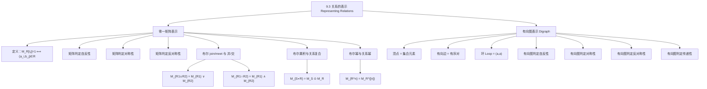

**相关笔记：** [[9.2 n元关系及其应用]] | [[9.4 关系的闭包]]

> [!abstract] 概览
> 本节系统介绍了表示有限集上==二元关系==的两种重要方法：==零一矩阵（zero-one matrix）==和==有向图（directed graph / digraph）==。零一矩阵适合计算机程序处理，有向图则便于直观理解关系的性质。
>
> - ==零一矩阵表示==：$M_R[i,j]=1$ 当且仅当 $(a_i, b_j) \in R$，矩阵的行列对应集合元素的排列顺序
> - ==矩阵判定关系性质==：自反性（主对角线全为 1）、对称性（矩阵关于主对角线对称）、反对称性（$m_{ij}=1 \Rightarrow m_{ji}=0$）
> - ==布尔运算对应关系运算==：$\vee$（join）对应并集，$\wedge$（meet）对应交集，$\odot$（Boolean product）对应复合
> - ==有向图表示==：顶点对应集合元素，有向边对应有序对，环（loop）对应 $(a,a)$ 形式的有序对
> - ==有向图判定关系性质==：自反性（每个顶点都有环）、对称性（不同顶点间的边成对出现）、反对称性（不同顶点间无双向边）、传递性（路径可闭合为三角形）

---

## 一、知识结构总览

---

## 二、核心思想

> [!tip] 核心思想
> 本节的核心思想是==关系的多种等价表示==：同一个二元关系可以用有序对集合、零一矩阵或有向图三种方式表示，它们之间一一对应。零一矩阵将关系转化为适合计算机处理的==布尔矩阵运算==（join、meet、Boolean product），而有向图则将关系转化为直观的==图形结构==，使得自反性、对称性、反对称性和传递性等性质可以通过矩阵或图形的视觉特征直接判定。这种多表示方法的思想贯穿整个离散数学，是后续学习图论和关系闭包的基础。

### 1. 零一矩阵表示关系

> [!def] 零一矩阵表示（Zero-One Matrix Representation）
> 设 $R$ 是从集合 $A = \{a_1, a_2, \ldots, a_m\}$ 到集合 $B = \{b_1, b_2, \ldots, b_n\}$ 的关系（集合元素按某种任意但确定的顺序排列），则 $R$ 可以用一个 $m \times n$ 的==零一矩阵== $M_R = [m_{ij}]$ 表示，其中
>
> $$m_{ij} = \begin{cases} 1 & \text{若 } (a_i, b_j) \in R \\ 0 & \text{若 } (a_i, b_j) \notin R \end{cases}$$
>
> - 当 $A = B$ 时，$M_R$ 是一个 $n \times n$ 的==方阵==
> - 矩阵的表示依赖于集合元素的排列顺序，不同的排列顺序会产生不同的矩阵

> [!example] 例1：构造关系的零一矩阵
> 设 $A = \{1, 2, 3\}$，$B = \{1, 2\}$，$R$ 是从 $A$ 到 $B$ 的关系，包含所有满足 $a > b$ 的有序对 $(a, b)$。
>
> **分析**：逐一检查所有可能的有序对：
> - $(1,1)$：$1 > 1$？否 $\Rightarrow m_{11} = 0$
> - $(1,2)$：$1 > 2$？否 $\Rightarrow m_{12} = 0$
> - $(2,1)$：$2 > 1$？是 $\Rightarrow m_{21} = 1$
> - $(2,2)$：$2 > 2$？否 $\Rightarrow m_{22} = 0$
> - $(3,1)$：$3 > 1$？是 $\Rightarrow m_{31} = 1$
> - $(3,2)$：$3 > 2$？是 $\Rightarrow m_{32} = 1$
>
> 因此 $R = \{(2,1), (3,1), (3,2)\}$，对应的零一矩阵为：
>
> $$M_R = \begin{bmatrix} 0 & 0 \\ 1 & 0 \\ 1 & 1 \end{bmatrix}$$

> [!example] 例2：从零一矩阵还原关系
> 设 $A = \{a_1, a_2, a_3\}$，$B = \{b_1, b_2, b_3, b_4, b_5\}$，关系的零一矩阵为
>
> $$M_R = \begin{bmatrix} 0 & 1 & 0 & 0 & 0 \\ 1 & 0 & 1 & 1 & 0 \\ 1 & 0 & 1 & 0 & 1 \end{bmatrix}$$
>
> 则 $R$ 由所有满足 $m_{ij} = 1$ 的有序对 $(a_i, b_j)$ 组成：
>
> $$R = \{(a_1, b_2), (a_2, b_1), (a_2, b_3), (a_2, b_4), (a_3, b_1), (a_3, b_3), (a_3, b_5)\}$$

### 2. 用矩阵判定关系的性质

> [!thm] 自反性的矩阵判定
> 设 $R$ 是集合 $A = \{a_1, a_2, \ldots, a_n\}$ 上的关系，则
>
> $$R \text{ 是自反的} \iff m_{ii} = 1 \text{ 对所有 } i = 1, 2, \ldots, n$$
>
> 即==主对角线上的元素全部为 1==（非对角线元素可以是 0 或 1）。
>
> **证明**：$R$ 自反当且仅当对所有 $a_i \in A$，$(a_i, a_i) \in R$，当且仅当对所有 $i$，$m_{ii} = 1$。

> [!thm] 对称性的矩阵判定
> 设 $R$ 是集合 $A = \{a_1, a_2, \ldots, a_n\}$ 上的关系，则
>
> $$R \text{ 是对称的} \iff m_{ij} = m_{ji} \text{ 对所有 } i, j$$
>
> 即 $M_R$ 是一个==对称矩阵==：$M_R = (M_R)^t$。
>
> **证明**：$R$ 对称当且仅当 $(a_i, a_j) \in R \Rightarrow (a_j, a_i) \in R$，即 $m_{ij} = 1 \Rightarrow m_{ji} = 1$。等价地，$m_{ij} = m_{ji}$ 对所有 $i, j$ 成立。

> [!thm] 反对称性的矩阵判定
> 设 $R$ 是集合 $A = \{a_1, a_2, \ldots, a_n\}$ 上的关系，则
>
> $$R \text{ 是反对称的} \iff \text{对所有 } i \neq j, \text{ 若 } m_{ij} = 1 \text{ 则 } m_{ji} = 0$$
>
> 即对于主对角线以外的位置，$m_{ij}$ 和 $m_{ji}$ 不能同时为 1（但可以同时为 0）。
>
> **证明**：$R$ 反对称当且仅当 $(a_i, a_j) \in R$ 且 $(a_j, a_i) \in R$（$i \neq j$）蕴含 $a_i = a_j$。由于 $i \neq j$ 时 $a_i \neq a_j$，所以不可能同时有 $m_{ij} = 1$ 和 $m_{ji} = 1$。

> [!warning] 对称性与反对称性不互斥
> - 一个关系可以==既不是对称的也不是反对称的==
> - 一个关系也可以==既是对称的又是反对称的==（例如恒等关系 $I_A = \{(a,a) \mid a \in A\}$）
> - 对称性要求 $m_{ij} = 1 \Rightarrow m_{ji} = 1$；反对称性要求 $m_{ij} = 1 \Rightarrow m_{ji} = 0$（$i \neq j$ 时）
> - 两者矛盾仅发生在 $i \neq j$ 且 $m_{ij} = m_{ji} = 1$ 的情况

> [!example] 例3：用矩阵判定关系性质
> 设关系 $R$ 的零一矩阵为
>
> $$M_R = \begin{bmatrix} 1 & 1 & 0 \\ 1 & 1 & 1 \\ 0 & 1 & 1 \end{bmatrix}$$
>
> - **自反性**：主对角线元素 $m_{11} = m_{22} = m_{33} = 1$，全部为 1，故 $R$ 是==自反的==
> - **对称性**：$m_{12} = m_{21} = 1$，$m_{23} = m_{32} = 1$，$m_{13} = m_{31} = 0$，矩阵关于主对角线对称，故 $R$ 是==对称的==
> - **反对称性**：$m_{12} = m_{21} = 1$（$1 \neq 2$），故 $R$ ==不是反对称的==

### 3. 布尔运算与关系运算

> [!def] 布尔 join 和 meet（回顾第2章）
> 设 $A = [a_{ij}]$ 和 $B = [b_{ij}]$ 是两个 $m \times n$ 的零一矩阵，则
>
> - **布尔 join**（$\vee$）：$A \vee B = [a_{ij} \vee b_{ij}]$，即按位"或"运算
> - **布尔 meet**（$\wedge$）：$A \wedge B = [a_{ij} \wedge b_{ij}]$，即按位"与"运算

> [!thm] 并集与交集的矩阵表示
> 设 $R_1$ 和 $R_2$ 是集合 $A$ 上的关系，分别用零一矩阵 $M_{R_1}$ 和 $M_{R_2}$ 表示，则
>
> $$M_{R_1 \cup R_2} = M_{R_1} \vee M_{R_2}$$
> $$M_{R_1 \cap R_2} = M_{R_1} \wedge M_{R_2}$$
>
> **证明**：$(a_i, a_j) \in R_1 \cup R_2$ 当且仅当 $(a_i, a_j) \in R_1$ 或 $(a_i, a_j) \in R_2$，即 $m_{ij}^{(1)} = 1$ 或 $m_{ij}^{(2)} = 1$，即 $m_{ij}^{(1)} \vee m_{ij}^{(2)} = 1$。交集的证明类似。

> [!example] 例4：计算关系并集和交集的矩阵
> 设
>
> $$M_{R_1} = \begin{bmatrix} 1 & 0 & 1 \\ 1 & 0 & 0 \\ 0 & 1 & 0 \end{bmatrix}, \quad M_{R_2} = \begin{bmatrix} 1 & 0 & 1 \\ 0 & 1 & 1 \\ 1 & 0 & 0 \end{bmatrix}$$
>
> 则
>
> $$M_{R_1 \cup R_2} = M_{R_1} \vee M_{R_2} = \begin{bmatrix} 1 \vee 1 & 0 \vee 0 & 1 \vee 1 \\ 1 \vee 0 & 0 \vee 1 & 0 \vee 1 \\ 0 \vee 1 & 1 \vee 0 & 0 \vee 0 \end{bmatrix} = \begin{bmatrix} 1 & 0 & 1 \\ 1 & 1 & 1 \\ 1 & 1 & 0 \end{bmatrix}$$
>
> $$M_{R_1 \cap R_2} = M_{R_1} \wedge M_{R_2} = \begin{bmatrix} 1 \wedge 1 & 0 \wedge 0 & 1 \wedge 1 \\ 1 \wedge 0 & 0 \wedge 1 & 0 \wedge 1 \\ 0 \wedge 1 & 1 \wedge 0 & 0 \wedge 0 \end{bmatrix} = \begin{bmatrix} 1 & 0 & 1 \\ 0 & 0 & 0 \\ 0 & 0 & 0 \end{bmatrix}$$

### 4. 布尔乘积与关系复合

> [!def] 布尔乘积（Boolean Product，回顾第2章）
> 设 $A$ 是 $m \times n$ 的零一矩阵，$B$ 是 $n \times p$ 的零一矩阵，则 $A$ 和 $B$ 的==布尔乘积== $A \odot B$ 是 $m \times p$ 的零一矩阵 $C = [c_{ij}]$，其中
>
> $$c_{ij} = \bigvee_{k=1}^{n}(a_{ik} \wedge b_{kj})$$
>
> 即：$c_{ij} = 1$ 当且仅当存在某个 $k$ 使得 $a_{ik} = b_{kj} = 1$。

> [!thm] 关系复合的矩阵表示
> 设 $R$ 是从 $A$ 到 $B$ 的关系，$S$ 是从 $B$ 到 $C$ 的关系，$A$、$B$、$C$ 分别有 $m$、$n$、$p$ 个元素。则
>
> $$M_{S \circ R} = M_S \odot M_R$$
>
> **证明**：$(a_i, c_j) \in S \circ R$ 当且仅当存在 $b_k \in B$ 使得 $(a_i, b_k) \in R$ 且 $(b_k, c_j) \in S$，即存在 $k$ 使得 $r_{ik} = s_{kj} = 1$，即 $\bigvee_k (r_{ik} \wedge s_{kj}) = 1$，这正是布尔乘积的定义。

> [!example] 例5：用布尔乘积计算关系复合
> 设
>
> $$M_R = \begin{bmatrix} 1 & 0 & 1 \\ 1 & 1 & 0 \\ 0 & 0 & 0 \end{bmatrix}, \quad M_S = \begin{bmatrix} 0 & 1 & 0 \\ 0 & 0 & 1 \\ 1 & 0 & 1 \end{bmatrix}$$
>
> 计算 $M_{S \circ R} = M_S \odot M_R$：
>
> $$c_{11} = (0 \wedge 1) \vee (1 \wedge 0) \vee (0 \wedge 0) = 0 \vee 0 \vee 0 = 0$$
> $$c_{12} = (0 \wedge 0) \vee (1 \wedge 1) \vee (0 \wedge 0) = 0 \vee 1 \vee 0 = 1$$
> $$c_{13} = (0 \wedge 1) \vee (1 \wedge 0) \vee (0 \wedge 0) = 0 \vee 0 \vee 0 = 0$$
> $$c_{21} = (0 \wedge 1) \vee (0 \wedge 0) \vee (1 \wedge 0) = 0 \vee 0 \vee 0 = 0$$
> $$c_{22} = (0 \wedge 0) \vee (0 \wedge 1) \vee (1 \wedge 0) = 0 \vee 0 \vee 0 = 0$$
> $$c_{23} = (0 \wedge 1) \vee (0 \wedge 0) \vee (1 \wedge 0) = 0 \vee 0 \vee 0 = 0$$
> $$c_{31} = (1 \wedge 1) \vee (0 \wedge 0) \vee (1 \wedge 0) = 1 \vee 0 \vee 0 = 1$$
> $$c_{32} = (1 \wedge 0) \vee (0 \wedge 1) \vee (1 \wedge 0) = 0 \vee 0 \vee 0 = 0$$
> $$c_{33} = (1 \wedge 1) \vee (0 \wedge 0) \vee (1 \wedge 0) = 1 \vee 0 \vee 0 = 1$$
>
> 因此
>
> $$M_{S \circ R} = \begin{bmatrix} 0 & 1 & 0 \\ 0 & 0 & 0 \\ 1 & 0 & 1 \end{bmatrix}$$

### 5. 布尔幂与关系幂

> [!thm] 关系幂的矩阵表示
> 设 $R$ 是集合 $A$ 上的关系，$M_R$ 是其零一矩阵，则
>
> $$M_{R^n} = M_R^{[n]}$$
>
> 其中 $M_R^{[n]}$ 表示 $M_R$ 的第 $n$ 次==布尔幂==（Boolean power），即 $n$ 个 $M_R$ 的布尔乘积。

> [!example] 例6：计算关系的布尔幂
> 设
>
> $$M_R = \begin{bmatrix} 0 & 1 & 0 \\ 0 & 1 & 1 \\ 1 & 0 & 0 \end{bmatrix}$$
>
> 计算 $M_R^{[2]} = M_R \odot M_R$：
>
> $$M_R^{[2]} = \begin{bmatrix} (0 \wedge 0) \vee (1 \wedge 0) \vee (0 \wedge 1) & (0 \wedge 1) \vee (1 \wedge 1) \vee (0 \wedge 0) & (0 \wedge 0) \vee (1 \wedge 1) \vee (0 \wedge 0) \\ (0 \wedge 0) \vee (1 \wedge 0) \vee (1 \wedge 1) & (0 \wedge 1) \vee (1 \wedge 1) \vee (1 \wedge 0) & (0 \wedge 0) \vee (1 \wedge 1) \vee (1 \wedge 0) \\ (1 \wedge 0) \vee (0 \wedge 0) \vee (0 \wedge 1) & (1 \wedge 1) \vee (0 \wedge 1) \vee (0 \wedge 0) & (1 \wedge 0) \vee (0 \wedge 1) \vee (0 \wedge 0) \end{bmatrix} = \begin{bmatrix} 0 & 1 & 1 \\ 1 & 1 & 1 \\ 0 & 1 & 0 \end{bmatrix}$$

### 6. 有向图表示关系

> [!def] 有向图（Directed Graph / Digraph）
> 一个==有向图==（digraph）由==顶点==（vertices/nodes）集 $V$ 和==边==（edges/arcs）集 $E$ 组成，其中 $E$ 是 $V$ 中有序对的集合。边 $(a, b)$ 中，$a$ 称为==初始顶点==（initial vertex），$b$ 称为==终端顶点==（terminal vertex）。
>
> - 形如 $(a, a)$ 的边称为==环==（loop），表示从顶点 $a$ 回到自身的边
> - 集合 $A$ 上的关系 $R$ 对应一个有向图：以 $A$ 的元素为顶点，以 $R$ 中的有序对为边
> - 关系与有向图之间存在==一一对应==关系

> [!example] 例7：构造有向图
> 设 $A = \{a, b, c, d\}$，关系 $R = \{(a,b), (a,d), (b,b), (b,d), (c,a), (c,b), (d,b)\}$。
>
> 对应的有向图包含 4 个顶点 $a, b, c, d$ 和 7 条有向边：
> - $a \to b$，$a \to d$
> - $b \to b$（环），$b \to d$
> - $c \to a$，$c \to b$
> - $d \to b$

> [!example] 例8：从有向图还原关系
> 设有向图包含顶点 $\{1, 2, 3, 4\}$ 和以下边：
> - $1 \to 1$（环），$1 \to 3$
> - $2 \to 1$，$2 \to 3$，$2 \to 4$
> - $3 \to 1$，$3 \to 2$
> - $4 \to 1$
>
> 则对应的关系为
>
> $$R = \{(1,1), (1,3), (2,1), (2,3), (2,4), (3,1), (3,2), (4,1)\}$$

### 7. 用有向图判定关系的性质

> [!thm] 有向图判定关系性质
> 设 $R$ 是集合 $A$ 上的关系，$G$ 是其对应的有向图，则：
>
> | 性质 | 有向图判定条件 |
> |------|----------------|
> | ==自反性== | 每个顶点都有==环==（loop） |
> | ==对称性== | 任意两个不同顶点之间，若有边则必有==反向边== |
> | ==反对称性== | 任意两个不同顶点之间，==不能同时存在双向边== |
> | ==传递性== | 若存在从 $x$ 到 $y$ 的边和从 $y$ 到 $z$ 的边，则必存在从 $x$ 到 $z$ 的边（==三角形闭合==） |

> [!example] 例10：用有向图判定关系性质
> 设 $S_1$ 的有向图：每个顶点都有环；存在 $a \to b$ 但没有 $b \to a$；存在 $b \to c$ 但没有 $c \to b$；存在 $a \to b$ 和 $b \to c$ 但没有 $a \to c$。
>
> - **自反性**：每个顶点都有环 $\Rightarrow$ $S_1$ 是==自反的==
> - **对称性**：$a \to b$ 存在但 $b \to a$ 不存在 $\Rightarrow$ $S_1$ ==不是对称的==
> - **反对称性**：$b \to c$ 和 $c \to b$ 同时存在 $\Rightarrow$ $S_1$ ==不是反对称的==
> - **传递性**：$a \to b$ 和 $b \to c$ 存在但 $a \to c$ 不存在 $\Rightarrow$ $S_1$ ==不是传递的==
>
> 设 $S_2$ 的有向图：并非每个顶点都有环；不同顶点间的边都成对出现（双向边）；存在 $(c,a)$ 和 $(a,b)$ 但没有 $(c,b)$。
>
> - **自反性**：并非每个顶点都有环 $\Rightarrow$ $S_2$ ==不是自反的==
> - **对称性**：所有不同顶点间的边都成对出现 $\Rightarrow$ $S_2$ 是==对称的==
> - **反对称性**：存在双向边 $\Rightarrow$ $S_2$ ==不是反对称的==
> - **传递性**：$(c,a) \in S_2$ 且 $(a,b) \in S_2$ 但 $(c,b) \notin S_2$ $\Rightarrow$ $S_2$ ==不是传递的==

---

## 三、补充理解与易混淆点

### 补充理解

> [!info] 补充1：零一矩阵与布尔运算的历史背景
> 零一矩阵（也称为布尔矩阵）的理论基础源于 George Boole 在 1854 年创立的布尔代数。布尔代数将逻辑运算（与、或、非）系统化为代数结构，后来成为数字电路设计和计算机科学的理论基石。在关系理论中，零一矩阵将关系的集合运算自然地转化为矩阵的布尔运算，这种对应关系使得我们可以利用线性代数的工具来研究离散结构。
>
> 布尔矩阵乘法与普通矩阵乘法的区别在于：普通乘法用"乘加"（$\sum a_{ik} \cdot b_{kj}$），而布尔乘法用"与或"（$\bigvee (a_{ik} \wedge b_{kj})$）。前者计算的是数值的线性组合，后者判定的是"是否存在"某种连接，这恰好对应了关系复合的本质——是否存在中间元素使得两步关系成立。
> 来源：Boole, G. (1854). *An Investigation of the Laws of Thought*. Walton and Maberly.
> 来源：Shannon, C. E. (1938). "A Symbolic Analysis of Relay and Switching Circuits." *Transactions of the AIEE*, 57(12), 713–723.

> [!info] 补充2：有向图与无向图的关系
> 对称关系可以用==无向图==（undirected graph）来表示，因为对称关系中的每条有向边 $(a,b)$ 都伴随反向边 $(b,a)$，可以简化为一条无向边 $\{a, b\}$。这种简化将在第10章图论中详细讨论。有向图是更一般的表示方式，可以表示任意二元关系，而不仅仅是对称关系。
>
> 在实际应用中，有向图广泛用于建模：网页之间的超链接（网页排名 PageRank 的基础）、社交网络中的关注关系、程序中的函数调用关系、编译器中的数据流分析等。
> 来源：Rosen, K. H. (2019). *Discrete Mathematics and Its Applications* (8th ed.), McGraw-Hill, Section 9.3 & 10.1.
> 来源：Diestel, R. (2017). *Graph Theory* (5th ed.). Springer, Chapter 1.

### 易混淆点

> [!warning] 误区1：矩阵表示依赖于元素排列顺序
> - 零一矩阵的表示依赖于集合 $A$ 和 $B$ 中元素的排列顺序
> - 同一个关系，如果元素排列顺序不同，对应的零一矩阵也不同
> - 在实际问题中，必须==明确约定==元素的排列顺序，否则矩阵表示不唯一
> - 但关系的性质（自反性、对称性等）不依赖于排列顺序

> [!warning] 误区2：布尔乘积与普通矩阵乘积的区别
> - 普通矩阵乘积：$c_{ij} = \sum_{k=1}^{n} a_{ik} \cdot b_{kj}$，结果可以是任意数值
> - 布尔乘积：$c_{ij} = \bigvee_{k=1}^{n}(a_{ik} \wedge b_{kj})$，结果只能是 0 或 1
> - 普通乘积中的"乘法"被替换为"与"（$\wedge$），"加法"被替换为"或"（$\vee$）
> - 布尔乘积回答的问题是"是否存在路径"，而非"有多少条路径"

> [!warning] 误区3：传递性在有向图中的判定
> - 传递性要求==所有==满足条件的路径都必须闭合，而非只检查某几条
> - 即使大部分路径都闭合了，只要存在一条 $x \to y \to z$ 但没有 $x \to z$，关系就不是传递的
> - 判定传递性需要==穷举检查所有长度为 2 的路径==，对于 $n$ 个元素的关系，最多需要检查 $n^2(n-1)$ 种情况

---

## 四、习题精选

> [!todo] 习题概览
> | 题号范围 | 核心考点 | 难度 |
> |---------|---------|------|
> | 1-2 | 用零一矩阵表示给定关系 | ⭐ |
> | 3-4 | 从零一矩阵还原有序对 | ⭐ |
> | 5-6 | 用矩阵判定反自反性/非对称性 | ⭐⭐ |
> | 7-8 | 综合判定矩阵的自反/对称/反对称/传递性 | ⭐⭐ |
> | 9-10 | 计算特定关系矩阵的非零元素个数 | ⭐⭐ |
> | 11-12 | 求补关系和逆关系的矩阵 | ⭐⭐ |
> | 13-15 | 计算逆关系、关系幂的矩阵 | ⭐⭐⭐ |
> | 16-17 | 关系幂的非零元素个数分析 | ⭐⭐⭐ |
> | 18-21 | 用有向图表示给定关系 | ⭐⭐ |
> | 22-28 | 从有向图还原关系、判定性质 | ⭐⭐⭐ |
> | 29-30 | 用有向图判定非对称性/反自反性 | ⭐⭐ |
> | 31-32 | 综合判定有向图的关系性质 | ⭐⭐⭐ |
> | 33-34 | 用有向图求逆关系 | ⭐⭐ |
> | 35-36 | 证明布尔幂与关系幂的关系 | ⭐⭐⭐⭐ |

### 题1：用零一矩阵表示关系

> [!problem] 题目
> 用零一矩阵表示集合 $\{1, 2, 3\}$ 上的关系 $R = \{(1,1), (1,2), (1,3)\}$（元素按递增顺序排列）。

> [!faq]- 解答
> 集合 $A = \{1, 2, 3\}$，按递增顺序排列为 $a_1 = 1, a_2 = 2, a_3 = 3$。
>
> 逐一检查每个位置：
> - $m_{11}$：$(1,1) \in R$？是 $\Rightarrow 1$
> - $m_{12}$：$(1,2) \in R$？是 $\Rightarrow 1$
> - $m_{13}$：$(1,3) \in R$？是 $\Rightarrow 1$
> - $m_{21}$：$(2,1) \in R$？否 $\Rightarrow 0$
> - $m_{22}$：$(2,2) \in R$？否 $\Rightarrow 0$
> - $m_{23}$：$(2,3) \in R$？否 $\Rightarrow 0$
> - $m_{31}$：$(3,1) \in R$？否 $\Rightarrow 0$
> - $m_{32}$：$(3,2) \in R$？否 $\Rightarrow 0$
> - $m_{33}$：$(3,3) \in R$？否 $\Rightarrow 0$
>
> $$M_R = \begin{bmatrix} 1 & 1 & 1 \\ 0 & 0 & 0 \\ 0 & 0 & 0 \end{bmatrix}$$
>
> $\blacksquare$

### 题2：从矩阵还原关系并判定性质

> [!problem] 题目
> 给定零一矩阵
>
> $$M_R = \begin{bmatrix} 1 & 0 & 1 & 0 \\ 0 & 1 & 0 & 1 \\ 0 & 1 & 0 & 1 \\ 1 & 0 & 1 & 1 \end{bmatrix}$$
>
> 列出关系 $R$ 中的所有有序对，并判定 $R$ 是否自反、对称、反对称。

> [!faq]- 解答
> **还原关系**（集合 $\{1,2,3,4\}$，按递增顺序排列）：
>
> $m_{ij} = 1$ 的位置：$(1,1), (1,3), (2,2), (2,4), (3,2), (3,4), (4,1), (4,3), (4,4)$
>
> $$R = \{(1,1), (1,3), (2,2), (2,4), (3,2), (3,4), (4,1), (4,3), (4,4)\}$$
>
> **判定性质**：
> - **自反性**：主对角线 $m_{11} = m_{22} = m_{33} = 0 \neq 1$，$m_{33} = 0$ $\Rightarrow$ $R$ ==不是自反的==
> - **对称性**：$m_{13} = 1$ 但 $m_{31} = 0$；$m_{24} = 1$ 但 $m_{42} = 0$ $\Rightarrow$ $R$ ==不是对称的==
> - **反对称性**：$m_{13} = 1$ 且 $m_{31} = 0$ ✓；$m_{24} = 1$ 且 $m_{42} = 0$ ✓；$m_{32} = 1$ 且 $m_{23} = 0$ ✓；$m_{41} = 1$ 且 $m_{14} = 0$ ✓；$m_{43} = 1$ 且 $m_{34} = 0$ ✓ $\Rightarrow$ $R$ ==是反对称的==
>
> $\blacksquare$

### 题3：计算关系并集和交集的矩阵

> [!problem] 题目
> 设 $R_1$ 和 $R_2$ 是集合 $\{1, 2, 3\}$ 上的关系，分别用以下矩阵表示：
>
> $$M_{R_1} = \begin{bmatrix} 0 & 1 & 0 \\ 1 & 1 & 1 \\ 1 & 0 & 0 \end{bmatrix}, \quad M_{R_2} = \begin{bmatrix} 0 & 1 & 0 \\ 0 & 1 & 1 \\ 1 & 1 & 1 \end{bmatrix}$$
>
> 求 $M_{R_1 \cup R_2}$ 和 $M_{R_1 \cap R_2}$。

> [!faq]- 解答
> **并集**（布尔 join）：
>
> $$M_{R_1 \cup R_2} = M_{R_1} \vee M_{R_2} = \begin{bmatrix} 0 \vee 0 & 1 \vee 1 & 0 \vee 0 \\ 1 \vee 0 & 1 \vee 1 & 1 \vee 1 \\ 1 \vee 1 & 0 \vee 1 & 0 \vee 1 \end{bmatrix} = \begin{bmatrix} 0 & 1 & 0 \\ 1 & 1 & 1 \\ 1 & 1 & 1 \end{bmatrix}$$
>
> **交集**（布尔 meet）：
>
> $$M_{R_1 \cap R_2} = M_{R_1} \wedge M_{R_2} = \begin{bmatrix} 0 \wedge 0 & 1 \wedge 1 & 0 \wedge 0 \\ 1 \wedge 0 & 1 \wedge 1 & 1 \wedge 1 \\ 1 \wedge 1 & 0 \wedge 1 & 0 \wedge 1 \end{bmatrix} = \begin{bmatrix} 0 & 1 & 0 \\ 0 & 1 & 1 \\ 1 & 0 & 0 \end{bmatrix}$$
>
> $\blacksquare$

### 题4：用布尔乘积计算关系复合

> [!problem] 题目
> 设 $R$ 和 $S$ 是集合 $\{1, 2, 3\}$ 上的关系，分别用以下矩阵表示：
>
> $$M_R = \begin{bmatrix} 0 & 1 & 0 \\ 0 & 0 & 1 \\ 1 & 0 & 0 \end{bmatrix}, \quad M_S = \begin{bmatrix} 1 & 0 & 0 \\ 0 & 1 & 0 \\ 0 & 0 & 1 \end{bmatrix}$$
>
> 求 $M_{S \circ R}$ 和 $M_{R^2}$。

> [!faq]- 解答
> **计算 $M_{S \circ R} = M_S \odot M_R$**：
>
> $$c_{11} = (1 \wedge 0) \vee (0 \wedge 0) \vee (0 \wedge 1) = 0$$
> $$c_{12} = (1 \wedge 1) \vee (0 \wedge 0) \vee (0 \wedge 0) = 1$$
> $$c_{13} = (1 \wedge 0) \vee (0 \wedge 1) \vee (0 \wedge 0) = 0$$
> $$c_{21} = (0 \wedge 0) \vee (1 \wedge 0) \vee (0 \wedge 1) = 0$$
> $$c_{22} = (0 \wedge 1) \vee (1 \wedge 0) \vee (0 \wedge 0) = 0$$
> $$c_{23} = (0 \wedge 0) \vee (1 \wedge 1) \vee (0 \wedge 0) = 1$$
> $$c_{31} = (0 \wedge 0) \vee (0 \wedge 0) \vee (1 \wedge 1) = 1$$
> $$c_{32} = (0 \wedge 1) \vee (0 \wedge 0) \vee (1 \wedge 0) = 0$$
> $$c_{33} = (0 \wedge 0) \vee (0 \wedge 1) \vee (1 \wedge 0) = 0$$
>
> $$M_{S \circ R} = \begin{bmatrix} 0 & 1 & 0 \\ 0 & 0 & 1 \\ 1 & 0 & 0 \end{bmatrix}$$
>
> 注意：$S$ 是恒等关系 $I_A$，所以 $S \circ R = R$，验证正确。
>
> **计算 $M_{R^2} = M_R \odot M_R$**：
>
> $$M_R^{[2]} = \begin{bmatrix} 0 & 0 & 1 \\ 1 & 0 & 0 \\ 0 & 1 & 0 \end{bmatrix}$$
>
> 这表示 $R^2 = \{(1,3), (2,1), (3,2)\}$，即每个元素通过两步到达下一个元素（循环移位）。
>
> $\blacksquare$

### 题5：综合判定有向图的关系性质

> [!problem] 题目
> 设关系 $R$ 的有向图包含顶点 $\{a, b, c, d\}$ 和以下有向边：
> - $a \to a$（环），$a \to b$，$a \to d$
> - $b \to b$（环），$b \to d$
> - $c \to a$，$c \to b$
> - $d \to b$
>
> 判定 $R$ 是否自反、对称、反对称、传递。

> [!faq]- 解答
> **自反性**：检查每个顶点是否有环
> - $a$ 有环 ✓，$b$ 有环 ✓，$c$ ==没有环== ✗，$d$ ==没有环== ✗
> - 结论：$R$ ==不是自反的==
>
> **对称性**：检查每条边是否有反向边
> - $a \to b$ 存在，但 $b \to a$ ==不存在== ✗
> - 结论：$R$ ==不是对称的==
>
> **反对称性**：检查是否存在不同顶点间的双向边
> - $a \to b$：$b \to a$ 不存在 ✓
> - $a \to d$：$d \to a$ 不存在 ✓
> - $b \to d$：$d \to b$ 存在 ✗
> - 结论：$R$ ==不是反对称的==（因为 $b \to d$ 和 $d \to b$ 同时存在且 $b \neq d$）
>
> **传递性**：检查所有长度为 2 的路径是否闭合
> - $a \to b \to b$：需要 $a \to b$，存在 ✓
> - $a \to b \to d$：需要 $a \to d$，存在 ✓
> - $a \to d \to b$：需要 $a \to b$，存在 ✓
> - $c \to a \to a$：需要 $c \to a$，存在 ✓
> - $c \to a \to b$：需要 $c \to b$，存在 ✓
> - $c \to a \to d$：需要 $c \to d$，==不存在== ✗
> - 结论：$R$ ==不是传递的==
>
> $\blacksquare$

> [!tip] 解题思路提示
> 零一矩阵与有向图相关题目的解题方法论：
> 1. **关系转矩阵**：按约定顺序排列元素，逐一检查每个有序对是否属于关系
> 2. **矩阵转关系**：找出所有 $m_{ij} = 1$ 的位置，还原为有序对
> 3. **判定自反性**：矩阵看主对角线是否全为 1；有向图看每个顶点是否有环
> 4. **判定对称性**：矩阵看是否关于主对角线对称；有向图看边是否成对出现
> 5. **判定反对称性**：矩阵看非对角线位置是否无 $(1,1)$ 对；有向图看不同顶点间是否有双向边
> 6. **布尔运算**：join（$\vee$）对应并集，meet（$\wedge$）对应交集，Boolean product（$\odot$）对应复合
> 7. **布尔乘积计算**：$c_{ij} = \bigvee_k (a_{ik} \wedge b_{kj})$，即检查是否存在 $k$ 使得两步都通

---

## 五、视频学习指南

> [!info] 视频资源
> | 资源 | 链接 | 对应内容 | 备注 |
> |:-----|:-----|:---------|:-----|
> | Rosen 8e Section 9.3 | [教材原文](https://www.mheducation.com/highered/product/discrete-mathematics-applications-rosen/M9781259676512.html) | 完整定义、定理与例题 | 英文教材 |
> | MIT 6.042J Lecture 5 | [链接](https://www.youtube.com/watch?v=JPLmLvVNEJM) | 关系、矩阵表示与有向图 | 英文，MIT开放课程 |

---

## 六、教材原文

> [!quote] 教材原文
> "There are many ways to represent a relation between finite sets. As we have seen in Section 9.1, one way is to list its ordered pairs. Another way to represent a relation is to use a table. In this section we will discuss two alternative methods for representing relations. One method uses zero-one matrices. The other method uses pictorial representations called directed graphs."
>
> "Generally, matrices are appropriate for the representation of relations in computer programs. On the other hand, people often find the representation of relations using directed graphs useful for understanding the properties of these relations."

---

## 参见 Wiki

- [[离散数学/concepts/零一矩阵]] -- 零一矩阵的定义与布尔运算
- [[离散数学/concepts/零一矩阵|布尔矩阵运算]] -- 布尔 join、meet、Boolean product
- [[离散数学/concepts/有向图]] -- 有向图的定义、顶点、边、环
- [[离散数学/concepts/二元关系|关系复合]] -- 关系复合的矩阵表示
- [[离散数学/concepts/二元关系|关系的性质]] -- 自反性、对称性、反对称性、传递性的判定
- [[离散数学/concepts/矩阵|矩阵转置]] -- 矩阵转置与对称矩阵

#学习/离散数学/关系
