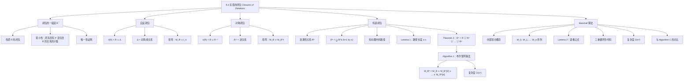

**相关笔记：** [[9.3 关系的表示]] | [[9.5 等价关系]]

> [!abstract] 概览
> 本节系统介绍了==关系的闭包==（closure）概念，即如何为不具有某种性质的关系"补全"该性质，使其成为包含原关系的==最小==具有该性质的关系。重点讨论了三种闭包：==自反闭包==、==对称闭包==和==传递闭包==，其中传递闭包的计算最为复杂，涉及两种经典算法。
>
> - ==闭包的一般定义==：包含 $R$ 且具有性质 $P$ 的最小关系，若存在则唯一
> - ==自反闭包== $r(R) = R \cup \Delta$，其中 $\Delta = \{(a,a) \mid a \in A\}$ 是对角线关系
> - ==对称闭包== $s(R) = R \cup R^{-1}$，添加所有缺失的反向有序对
> - ==传递闭包== $t(R) = R^* = \bigcup_{k=1}^{\infty} R^k$，对于有限集可简化为 $R \cup R^2 \cup \cdots \cup R^n$
> - ==布尔矩阵乘法算法==（Algorithm 1）：计算 $M_{R^*} = M_R \vee M_R^{[2]} \vee \cdots \vee M_R^{[n]}$，复杂度 $O(n^4)$
> - ==Warshall 算法==（Algorithm 2）：利用内部顶点逐步扩展，复杂度 $O(n^3)$，是传递闭包计算的经典高效算法

---

## 一、知识结构总览



---

## 二、核心思想

> [!tip] 核心思想
> 本节的核心思想是==闭包运算==（closure operation）：给定一个关系 $R$ 和一个期望的性质 $P$（如自反性、对称性、传递性），构造包含 $R$ 的==最小的==具有性质 $P$ 的关系。这种"最小补全"的思想在数学和计算机科学中广泛出现——例如拓扑学中的闭包、逻辑中的演绎闭包、数据库中的传递闭包查询等。三种闭包中，自反闭包和对称闭包的构造简单直接（只需添加特定的有序对），而传递闭包的构造则需要借助==有向图中的路径==概念和==矩阵幂运算==，引出了两种重要的算法设计思想：朴素的布尔矩阵乘法算法（$O(n^4)$）和 Warshall 的动态规划式算法（$O(n^3)$）。

### 1. 闭包的一般定义

> [!def] 闭包（Closure）
> 设 $R$ 是集合 $A$ 上的关系，$P$ 是关系的某个性质。如果存在集合 $A$ 上的关系 $S$ 满足：
> 1. $S$ 具有性质 $P$
> 2. $R \subseteq S$
> 3. $S$ 是所有满足条件 1 和 2 的关系中最小的（即 $S \subseteq T$ 对所有满足条件 1 和 2 的 $T$ 成立）
>
> 则称 $S$ 是 $R$ 关于性质 $P$ 的==闭包==。
>
> - 闭包如果存在，则一定是==唯一的==
> - **唯一性证明**：设 $S$ 和 $T$ 都是 $R$ 关于 $P$ 的闭包，则 $S \subseteq T$（因为 $T$ 满足条件，$S$ 是最小的）且 $T \subseteq S$（因为 $S$ 满足条件，$T$ 是最小的），故 $S = T$

> [!warning] 并非所有性质都存在闭包
> - 自反性、对称性、传递性的闭包一定存在
> - 但某些性质（如"反自反性"）的闭包可能不存在
> - 例如，如果 $R$ 本身包含 $(a,a)$，则任何包含 $R$ 的反自反关系都不存在，因为反自反要求不包含任何 $(a,a)$

### 2. 自反闭包

> [!def] 自反闭包（Reflexive Closure）
> 设 $R$ 是集合 $A$ 上的关系，$R$ 的==自反闭包==为
>
> $$r(R) = R \cup \Delta$$
>
> 其中 $\Delta = \{(a, a) \mid a \in A\}$ 是 $A$ 上的==对角线关系==（diagonal relation）。
>
> - 自反闭包就是将 $R$ 中缺失的所有 $(a, a)$ 形式的有序对补上
> - 在矩阵表示中，$M_{r(R)} = M_R \vee I_n$，其中 $I_n$ 是 $n \times n$ 的单位矩阵

> [!thm] 自反闭包的最小性
> $r(R) = R \cup \Delta$ 是包含 $R$ 的最小自反关系。
>
> **证明**：
> 1. $R \cup \Delta$ 是自反的：对任意 $a \in A$，$(a,a) \in \Delta \subseteq R \cup \Delta$
> 2. $R \subseteq R \cup \Delta$：显然
> 3. 设 $S$ 是任意包含 $R$ 的自反关系，则对任意 $a \in A$，$(a,a) \in S$（因为 $S$ 自反），故 $\Delta \subseteq S$，从而 $R \cup \Delta \subseteq S$
>
> 因此 $R \cup \Delta$ 是包含 $R$ 的最小自反关系。

> [!example] 例1：求自反闭包
> 设 $R = \{(a, b) \mid a < b\}$ 是整数集上的"小于"关系，求其自反闭包。
>
> $$r(R) = R \cup \Delta = \{(a, b) \mid a < b\} \cup \{(a, a) \mid a \in \mathbb{Z}\} = \{(a, b) \mid a \leq b\}$$
>
> 即"小于"关系的自反闭包是"小于等于"关系。

### 3. 对称闭包

> [!def] 对称闭包（Symmetric Closure）
> 设 $R$ 是集合 $A$ 上的关系，$R$ 的==对称闭包==为
>
> $$s(R) = R \cup R^{-1}$$
>
> 其中 $R^{-1} = \{(b, a) \mid (a, b) \in R\}$ 是 $R$ 的==逆关系==（inverse relation）。
>
> - 对称闭包就是将 $R$ 中每条有向边的反向边也补上
> - 在矩阵表示中，$M_{s(R)} = M_R \vee M_R^t$，其中 $M_R^t$ 是 $M_R$ 的转置

> [!thm] 对称闭包的最小性
> $s(R) = R \cup R^{-1}$ 是包含 $R$ 的最小对称关系。
>
> **证明**：
> 1. $R \cup R^{-1}$ 是对称的：若 $(a,b) \in R \cup R^{-1}$，则 $(a,b) \in R$ 或 $(a,b) \in R^{-1}$。若 $(a,b) \in R$，则 $(b,a) \in R^{-1} \subseteq R \cup R^{-1}$；若 $(a,b) \in R^{-1}$，则 $(b,a) \in R \subseteq R \cup R^{-1}$。
> 2. $R \subseteq R \cup R^{-1}$：显然
> 3. 设 $S$ 是任意包含 $R$ 的对称关系，若 $(a,b) \in R^{-1}$，则 $(b,a) \in R \subseteq S$，由对称性 $(a,b) \in S$，故 $R^{-1} \subseteq S$，从而 $R \cup R^{-1} \subseteq S$

> [!example] 例2：求对称闭包
> 设 $R = \{(a, b) \mid a > b\}$ 是正整数集上的"大于"关系，求其对称闭包。
>
> $$s(R) = R \cup R^{-1} = \{(a, b) \mid a > b\} \cup \{(b, a) \mid a > b\} = \{(a, b) \mid a > b\} \cup \{(a, b) \mid a < b\} = \{(a, b) \mid a \neq b\}$$
>
> 即"大于"关系的对称闭包是"不等于"关系。

### 4. 有向图中的路径

> [!def] 路径（Path）与回路（Circuit/Cycle）
> 在有向图 $G$ 中，从顶点 $a$ 到顶点 $b$ 的一条==路径==是一个边序列 $(x_0, x_1), (x_1, x_2), \ldots, (x_{n-1}, x_n)$，其中 $x_0 = a$，$x_n = b$。这条路径的==长度==为 $n$（即边的条数）。
>
> - 长度为 0 的路径（空边集）是从 $a$ 到 $a$ 的路径
> - 长度为 1 且起点等于终点的路径称为==回路==（circuit）或==环==（cycle）
> - 路径可以经过同一顶点多次，同一条边也可以在路径中出现多次

> [!thm] 路径与关系幂的关系（Theorem 1）
> 设 $R$ 是集合 $A$ 上的关系，则从 $a$ 到 $b$ 存在长度为 $n$（$n$ 为正整数）的路径，当且仅当 $(a, b) \in R^n$。
>
> **证明**（数学归纳法）：
>
> **基础步**（$n = 1$）：由定义，从 $a$ 到 $b$ 存在长度为 1 的路径当且仅当 $(a, b) \in R$，即 $(a, b) \in R^1$。
>
> **归纳假设**：假设定理对正整数 $n$ 成立。
>
> **归纳步**（$n + 1$）：从 $a$ 到 $b$ 存在长度为 $n+1$ 的路径，当且仅当存在元素 $c \in A$ 使得从 $a$ 到 $c$ 存在长度为 1 的路径（即 $(a,c) \in R$）且从 $c$ 到 $b$ 存在长度为 $n$ 的路径（由归纳假设即 $(c,b) \in R^n$）。
>
> 由关系复合的定义，$(a,c) \in R$ 且 $(c,b) \in R^n$ 当且仅当 $(a,b) \in R \circ R^n = R^{n+1}$。
>
> 因此，从 $a$ 到 $b$ 存在长度为 $n+1$ 的路径当且仅当 $(a,b) \in R^{n+1}$。
>
> 由数学归纳法，定理对所有正整数 $n$ 成立。$\blacksquare$

### 5. 连通性关系与传递闭包

> [!def] 连通性关系（Connectivity Relation）
> 设 $R$ 是集合 $A$ 上的关系，$R$ 的==连通性关系== $R^*$ 由所有满足以下条件的有序对 $(a, b)$ 组成：在 $R$ 中存在从 $a$ 到 $b$ 的长度至少为 1 的路径。
>
> $$R^* = \bigcup_{k=1}^{\infty} R^k$$
>
> - $R^*$ 包含所有通过一步或多步可以"到达"的顶点对
> - $R^*$ 在许多应用模型中非常有用（社交网络中的人际连接、交通网络中的可达性等）

> [!example] 例4：社交网络中的连通性
> 设 $R$ 是全世界所有人之间的关系，$(a, b) \in R$ 表示 $a$ 认识 $b$。则：
> - $R^2$ 包含 $(a, b)$ 当且仅当存在中间人 $c$ 使得 $a$ 认识 $c$ 且 $c$ 认识 $b$（"朋友的朋友"）
> - $R^n$ 包含 $(a, b)$ 当且仅当存在一条长度为 $n$ 的认识链
> - $R^*$ 包含 $(a, b)$ 当且仅当存在一条从 $a$ 到 $b$ 的认识链（无论多长）

> [!thm] 传递闭包等于连通性关系（Theorem 2）
> 关系 $R$ 的传递闭包等于连通性关系 $R^*$。
>
> **证明**：
>
> **第一步：$R^*$ 是传递的**。设 $(a,b) \in R^*$ 且 $(b,c) \in R^*$，则存在从 $a$ 到 $b$ 的路径和从 $b$ 到 $c$ 的路径。将两条路径首尾相连，得到从 $a$ 到 $c$ 的路径，故 $(a,c) \in R^*$。
>
> **第二步：$R^*$ 是包含 $R$ 的最小传递关系**。设 $S$ 是任意包含 $R$ 的传递关系。因为 $S$ 传递，所以 $S^n$ 也是传递的（读者可验证），且 $R^n \subseteq S^n \subseteq S$（因为 $R \subseteq S$）。因此 $R^* = \bigcup_{n=1}^{\infty} R^n \subseteq S$。
>
> 综上，$R^*$ 是传递的、包含 $R$ 的、且是所有包含 $R$ 的传递关系中最小的，因此 $R^*$ 就是 $R$ 的传递闭包。$\blacksquare$

> [!thm] 路径长度的上界（Lemma 1）
> 设 $A$ 是有 $n$ 个元素的集合，$R$ 是 $A$ 上的关系。若 $R$ 中存在从 $a$ 到 $b$ 的路径（长度至少为 1），则存在长度不超过 $n$ 的这样的路径。进一步，当 $a \neq b$ 时，存在长度不超过 $n - 1$ 的这样的路径。
>
> **证明**：设从 $a$ 到 $b$ 的最短路径为 $x_0, x_1, \ldots, x_m$，其中 $x_0 = a$，$x_m = b$。
>
> 假设 $m > n$。由==鸽巢原理==，在 $m$ 个顶点 $x_0, x_1, \ldots, x_{m-1}$ 中（注意不含 $x_m = b$），至少有两个顶点相同（因为 $A$ 只有 $n$ 个元素）。设 $x_i = x_j$（$0 \leq i < j \leq m - 1$），则路径中包含一个从 $x_i$ 到自身的回路。删除这个回路，得到一条更短的路径 $x_0, x_1, \ldots, x_i, x_{j+1}, \ldots, x_m$，这与"最短路径"的假设矛盾。
>
> 因此最短路径的长度 $m \leq n$。$a \neq b$ 的情况类似可证。$\blacksquare$

> [!thm] 传递闭包的有限表示（Theorem 3）
> 设 $M_R$ 是 $n$ 个元素集合上关系 $R$ 的零一矩阵，则传递闭包 $R^*$ 的零一矩阵为
>
> $$M_{R^*} = M_R \vee M_R^{[2]} \vee M_R^{[3]} \vee \cdots \vee M_R^{[n]}$$
>
> **推导过程**：由 Theorem 2，$R^* = \bigcup_{k=1}^{\infty} R^k$。由 Lemma 1，对于有限集 $A$（$|A| = n$），$R^*$ 中任意有序对 $(a,b)$ 都在某个 $R^k$（$k \leq n$）中出现。因此
>
> $$R^* = R \cup R^2 \cup R^3 \cup \cdots \cup R^n$$
>
> 用零一矩阵表示，并集对应布尔 join：
>
> $$M_{R^*} = M_R \vee M_R^{[2]} \vee M_R^{[3]} \vee \cdots \vee M_R^{[n]}$$

> [!example] 例7：用布尔幂求传递闭包
> 设
>
> $$M_R = \begin{bmatrix} 1 & 0 & 1 \\ 0 & 1 & 0 \\ 1 & 1 & 0 \end{bmatrix}$$
>
> 由 Theorem 3，$M_{R^*} = M_R \vee M_R^{[2]} \vee M_R^{[3]}$。
>
> 计算 $M_R^{[2]} = M_R \odot M_R$：
>
> $$M_R^{[2]} = \begin{bmatrix} 1 & 1 & 1 \\ 0 & 1 & 0 \\ 1 & 1 & 1 \end{bmatrix}$$
>
> 计算 $M_R^{[3]} = M_R^{[2]} \odot M_R$：
>
> $$M_R^{[3]} = \begin{bmatrix} 1 & 1 & 1 \\ 0 & 1 & 0 \\ 1 & 1 & 1 \end{bmatrix}$$
>
> 因此
>
> $$M_{R^*} = \begin{bmatrix} 1 & 0 & 1 \\ 0 & 1 & 0 \\ 1 & 1 & 0 \end{bmatrix} \vee \begin{bmatrix} 1 & 1 & 1 \\ 0 & 1 & 0 \\ 1 & 1 & 1 \end{bmatrix} \vee \begin{bmatrix} 1 & 1 & 1 \\ 0 & 1 & 0 \\ 1 & 1 & 1 \end{bmatrix} = \begin{bmatrix} 1 & 1 & 1 \\ 0 & 1 & 0 \\ 1 & 1 & 1 \end{bmatrix}$$

### 6. Algorithm 1：布尔矩阵乘法算法

> [!def] Algorithm 1 -- 传递闭包的布尔矩阵乘法算法
> **输入**：$n \times n$ 零一矩阵 $M_R$
> **输出**：传递闭包 $R^*$ 的零一矩阵
>
> **伪代码**：
> ```
> procedure transitive closure (M_R: n × n zero-one matrix)
>     A := M_R
>     B := A
>     for i := 2 to n
>         A := A ⊙ M_R          // 计算布尔幂 M_R^{[i]}
>         B := B ∨ A            // 累积 join
>     return B                  // B = M_{R^*}
> ```
>
> - 外层循环执行 $n - 1$ 次
> - 每次循环计算一次布尔乘积（$n^2(2n-1)$ 次位运算）和一次布尔 join（$n^2$ 次位运算）
> - 总复杂度：$n^2(2n-1)(n-1) + (n-1)n^2 = 2n^3(n-1)$，即 $O(n^4)$

### 7. Warshall 算法

> [!def] 内部顶点（Interior Vertices）
> 设路径为 $a, x_1, x_2, \ldots, x_{m-1}, b$，则==内部顶点==是路径中除起点 $a$ 和终点 $b$ 之外的所有顶点，即 $x_1, x_2, \ldots, x_{m-1}$。
>
> - 长度为 1 的路径没有内部顶点
> - 如果路径经过某个顶点两次（如 $a, c, d, a, f, b$），则 $a$ 也是内部顶点（因为路径再次经过它）

> [!def] Warshall 算法的矩阵序列
> 设 $R$ 是 $n$ 个元素集合 $\{v_1, v_2, \ldots, v_n\}$ 上的关系。定义零一矩阵序列 $W_0, W_1, \ldots, W_n$：
>
> - $W_0 = M_R$（原始关系的零一矩阵）
> - $W_k = [w_{ij}^{(k)}]$，其中 $w_{ij}^{(k)} = 1$ 当且仅当存在从 $v_i$ 到 $v_j$ 的路径，且该路径的所有内部顶点都在集合 $\{v_1, v_2, \ldots, v_k\}$ 中
>
> 关键结论：$W_n = M_{R^*}$（传递闭包的零一矩阵），因为当允许所有 $n$ 个顶点作为内部顶点时，$w_{ij}^{(n)} = 1$ 当且仅当从 $v_i$ 到 $v_j$ 存在任意路径。

> [!thm] Warshall 算法的递推公式（Lemma 2）
> 对所有正整数 $i, j, k \leq n$：
>
> $$w_{ij}^{(k)} = w_{ij}^{(k-1)} \vee (w_{ik}^{(k-1)} \wedge w_{kj}^{(k-1)})$$
>
> **直觉理解**：从 $v_i$ 到 $v_j$ 的路径（内部顶点限于 $\{v_1, \ldots, v_k\}$）存在，当且仅当以下两种情况之一成立：
> 1. **Case 1**：不经过 $v_k$ 作为内部顶点就已经有路径（$w_{ij}^{(k-1)} = 1$）
> 2. **Case 2**：从 $v_i$ 到 $v_k$ 有路径（内部顶点限于 $\{v_1, \ldots, v_{k-1}\}$），且从 $v_k$ 到 $v_j$ 也有路径（内部顶点限于 $\{v_1, \ldots, v_{k-1}\}$），即 $w_{ik}^{(k-1)} = 1$ 且 $w_{kj}^{(k-1)} = 1$

> [!def] Warshall 算法（Algorithm 2）
> **输入**：$n \times n$ 零一矩阵 $M_R$
> **输出**：传递闭包 $R^*$ 的零一矩阵
>
> **伪代码**：
> ```
> procedure Warshall (M_R: n × n zero-one matrix)
>     W := M_R
>     for k := 1 to n
>         for i := 1 to n
>             for j := 1 to n
>                 w_ij := w_ij ∨ (w_ik ∧ w_kj)
>     return W              // W = M_{R^*}
> ```
>
> - 三重嵌套循环，每层循环执行 $n$ 次
> - 最内层每次执行 2 次位运算（一次 $\wedge$，一次 $\vee$）
> - 总复杂度：$n \cdot n \cdot n \cdot 2 = 2n^3$，即==$O(n^3)$==
> - 相比 Algorithm 1 的 $O(n^4)$，Warshall 算法效率提高了一个数量级

> [!example] 例8：Warshall 算法逐步演示
> 设 $R$ 的有向图包含顶点 $\{a, b, c, d\}$ 和边 $\{a \to d, b \to a, b \to c, c \to b, c \to d, d \to c\}$。
>
> 令 $v_1 = a, v_2 = b, v_3 = c, v_4 = d$。
>
> **$W_0 = M_R$**：
> $$W_0 = \begin{bmatrix} 0 & 0 & 0 & 1 \\ 1 & 0 & 1 & 0 \\ 0 & 1 & 0 & 0 \\ 0 & 0 & 1 & 0 \end{bmatrix}$$
>
> **$W_1$**（允许 $a$ 作为内部顶点）：
> - 新增路径 $b \to a \to d$，故 $w_{24}^{(1)} = 1$
> $$W_1 = \begin{bmatrix} 0 & 0 & 0 & 1 \\ 1 & 0 & 1 & 1 \\ 0 & 1 & 0 & 0 \\ 0 & 0 & 1 & 0 \end{bmatrix}$$
>
> **$W_2$**（允许 $a, b$ 作为内部顶点）：
> - $b$ 没有入边（没有边以 $b$ 为终点），所以允许 $b$ 作为内部顶点不会产生新路径
> $$W_2 = W_1 = \begin{bmatrix} 0 & 0 & 0 & 1 \\ 1 & 0 & 1 & 1 \\ 0 & 1 & 0 & 0 \\ 0 & 0 & 1 & 0 \end{bmatrix}$$
>
> **$W_3$**（允许 $a, b, c$ 作为内部顶点）：
> - 新增路径 $d \to c \to b \to a$，故 $w_{41}^{(3)} = 1$
> - 新增路径 $d \to c \to d$，故 $w_{44}^{(3)} = 1$
> $$W_3 = \begin{bmatrix} 0 & 0 & 0 & 1 \\ 1 & 0 & 1 & 1 \\ 0 & 1 & 0 & 0 \\ 1 & 0 & 1 & 1 \end{bmatrix}$$
>
> **$W_4$**（允许所有顶点作为内部顶点）：
> - 新增路径 $a \to d \to c \to b \to a$，故 $w_{11}^{(4)} = 1$
> - 新增路径 $a \to d \to c \to b$，故 $w_{12}^{(4)} = 1$
> - 新增路径 $a \to d \to c$，故 $w_{13}^{(4)} = 1$
> $$W_4 = \begin{bmatrix} 1 & 0 & 1 & 1 \\ 1 & 0 & 1 & 1 \\ 1 & 0 & 1 & 1 \\ 1 & 0 & 1 & 1 \end{bmatrix}$$
>
> $W_4$ 即为传递闭包 $R^*$ 的零一矩阵。

### 8. 两种算法的对比

> [!info] Algorithm 1 vs Warshall 算法
> | 特征 | Algorithm 1（布尔矩阵乘法） | Warshall 算法 |
> |------|---------------------------|---------------|
> | ==时间复杂度== | $O(n^4)$ | ==$O(n^3)$== |
> | 位运算次数 | $2n^3(n-1)$ | $2n^3$ |
> | 核心思想 | 计算布尔幂 $M_R^{[k]}$ 并累积 join | 逐步扩展允许的内部顶点集合 |
> | 空间复杂度 | $O(n^2)$（可原地更新） | $O(n^2)$（原地更新） |
> | 实现难度 | 较简单（布尔乘积 + join） | 简单（三重循环） |
> | 适用场景 | 需要中间幂结果时 | 仅需传递闭包时 |
>
> Warshall 算法的效率优势来源于其==动态规划==思想：不是独立计算每个布尔幂再合并，而是利用前一步的结果逐步扩展可达性信息。每一步只考虑"是否通过新允许的内部顶点可以到达更多顶点"，避免了重复计算。

---

## 三、补充理解与易混淆点

### 补充理解

> [!info] 补充1：闭包思想在计算机科学中的广泛应用
> 传递闭包的概念在计算机科学中有极其重要的应用：
>
> - **数据库查询**：SQL 中的递归公共表表达式（Recursive CTE）本质上就是在计算传递闭包。例如，在组织架构表中查询"某员工的所有下属（包括间接下属）"就是计算管理层级关系的传递闭包。
> - **程序分析**：编译器中的==可达性分析==（reachability analysis）需要计算控制流图的传递闭包，以确定哪些代码块可以从入口到达。
> - **网络路由**：互联网路由协议（如 BGP）需要计算网络拓扑的传递闭包，以确定数据包的可达性。
> - **社交网络**：推荐系统中的"朋友的朋友"推荐就是计算社交关系图的传递闭包。
>
> Warshall 算法由 Stephen Warshall 于 1960 年提出（Bernard Roy 在 1959 年也独立描述了该算法，因此也称为 Roy-Warshall 算法）。该算法的优美之处在于：它不需要计算矩阵乘法，仅通过简单的位运算就能高效地计算出传递闭包。
> 来源：Rosen, K. H. (2019). *Discrete Mathematics and Its Applications* (8th ed.), McGraw-Hill, Section 9.4.
> 来源：Aho, A. V., Lam, M. S., Sethi, R. & Ullman, J. D. (2006). *Compilers: Principles, Techniques, and Tools* (2nd ed.), Pearson, Chapter 4 (Syntax Analysis).

> [!info] 补充2：Warshall 算法与 Floyd-Warshall 算法的关系
> Warshall 算法（1960）计算的是布尔矩阵的传递闭包（判定可达性：0 或 1），而 Floyd-Warshall 算法（1962，由 Robert Floyd 独立发现）计算的是加权图中的==最短路径==（数值距离）。两者的核心思想完全相同——都是通过逐步扩展允许经过的中间顶点来更新信息——但 Warshall 用布尔运算（$\vee, \wedge$），Floyd-Warshall 用算术运算（$+$, $\min$）。
>
> 可以将 Warshall 算法视为 Floyd-Warshall 算法在布尔半环上的特例。这种"同一思想在不同代数结构上的实例化"的模式在算法设计中非常常见。
> 来源：Warshall, S. (1962). "A Theorem on Boolean Matrices." *Journal of the ACM*, 9(1), 11–12.
> 来源：Floyd, R. W. (1962). "Algorithm 97: Shortest Path." *Communications of the ACM*, 5(6), 345.

### 易混淆点

> [!warning] 误区1：传递闭包不能简单通过"添加缺失的三元组"一步完成
> - 自反闭包只需一步：$R \cup \Delta$
> - 对称闭包只需一步：$R \cup R^{-1}$
> - 但传递闭包==不能一步完成==！
> - 添加所有 $(a,c)$（其中 $(a,b) \in R$ 且 $(b,c) \in R$）后，新的有序对可能与现有有序对组合产生更多需要添加的有序对
> - 例如：$R = \{(1,3), (1,4), (2,1), (3,2)\}$，添加 $(1,2), (2,3), (2,4), (3,1)$ 后，又需要添加 $(1,1), (2,2), (3,3), (3,4)$ 等
> - 这就是为什么传递闭包需要借助路径概念和迭代算法来计算

> [!warning] 误区2：$R^*$ 中不包含长度为 0 的路径
> - $R^*$ 的定义是"长度至少为 1 的路径"，即 $R^* = \bigcup_{k=1}^{\infty} R^k$
> - $R^*$ ==不自动包含对角线关系== $\Delta$
> - 如果需要"长度至少为 0 的路径"（即包含自反性），应使用 $R^* \cup \Delta$
> - 自反传递闭包 $= R^* \cup \Delta = \bigcup_{k=0}^{\infty} R^k$（其中 $R^0 = \Delta$）

> [!warning] 误区3：Warshall 算法中 $k$ 循环不能放在最内层
> - Warshall 算法的三重循环顺序是 $k \to i \to j$，==$k$ 必须是最外层循环==
> - 这是因为 $W_k$ 的计算依赖于 $W_{k-1}$ 的完整结果
> - 如果将 $k$ 放在内层，则在计算 $w_{ij}^{(k)}$ 时，某些 $w_{ik}^{(k)}$ 或 $w_{kj}^{(k)}$ 可能已经被更新为 $W_k$ 的值而非 $W_{k-1}$ 的值，导致结果错误
> - 这是初学者实现 Warshall 算法时最常见的错误之一

---

## 四、习题精选

> [!todo] 习题概览
> | 题号范围 | 核心考点 | 难度 |
> |---------|---------|------|
> | 1-3 | 求给定关系的自反闭包/对称闭包 | ⭐ |
> | 4-9 | 用有向图构造自反闭包/对称闭包 | ⭐⭐ |
> | 10-11 | 求同时满足自反和对称的最小关系 | ⭐⭐ |
> | 12-13 | 证明自反闭包/对称闭包的矩阵公式 | ⭐⭐ |
> | 14 | 证明闭包等于所有满足条件的关系的交集 | ⭐⭐⭐ |
> | 15 | 反自反闭包的存在性讨论 | ⭐⭐⭐ |
> | 16-18 | 判定路径、回路、可达性 | ⭐⭐ |
> | 19-24 | 用 Algorithm 1 计算传递闭包 | ⭐⭐⭐ |
> | 25-30 | 用 Warshall 算法计算传递闭包 | ⭐⭐⭐ |
> | 31-36 | 传递闭包的性质证明 | ⭐⭐⭐⭐ |
> | 37-40 | 闭包的组合与性质 | ⭐⭐⭐⭐ |
> | 41-46 | Warshall 算法的正确性与变体 | ⭐⭐⭐⭐ |

### 题1：求自反闭包和对称闭包

> [!problem] 题目
> 设 $R = \{(0,1), (1,1), (1,2), (2,0), (2,2), (3,0)\}$ 是集合 $\{0,1,2,3\}$ 上的关系。求 $R$ 的自反闭包和对称闭包。

> [!faq]- 解答
> **自反闭包** $r(R) = R \cup \Delta$：
>
> $\Delta = \{(0,0), (1,1), (2,2), (3,3)\}$
>
> $R$ 中已有 $(1,1)$ 和 $(2,2)$，需要添加 $(0,0)$ 和 $(3,3)$：
>
> $$r(R) = \{(0,0), (0,1), (1,1), (1,2), (2,0), (2,2), (3,0), (3,3)\}$$
>
> **对称闭包** $s(R) = R \cup R^{-1}$：
>
> $R^{-1} = \{(1,0), (1,1), (2,1), (0,2), (2,2), (0,3)\}$
>
> $R$ 中已有 $(1,1)$ 和 $(2,2)$（它们是自逆的），需要添加 $(1,0), (2,1), (0,2), (0,3)$：
>
> $$s(R) = \{(0,1), (0,2), (0,3), (1,0), (1,1), (1,2), (2,0), (2,1), (2,2), (3,0)\}$$
>
> $\blacksquare$

### 题2：用矩阵公式求闭包

> [!problem] 题目
> 设关系 $R$ 的零一矩阵为
>
> $$M_R = \begin{bmatrix} 0 & 1 & 0 \\ 0 & 0 & 1 \\ 1 & 0 & 0 \end{bmatrix}$$
>
> 用矩阵公式求 $R$ 的自反闭包和对称闭包的零一矩阵。

> [!faq]- 解答
> **自反闭包**：$M_{r(R)} = M_R \vee I_3$
>
> $$I_3 = \begin{bmatrix} 1 & 0 & 0 \\ 0 & 1 & 0 \\ 0 & 0 & 1 \end{bmatrix}$$
>
> $$M_{r(R)} = \begin{bmatrix} 0 & 1 & 0 \\ 0 & 0 & 1 \\ 1 & 0 & 0 \end{bmatrix} \vee \begin{bmatrix} 1 & 0 & 0 \\ 0 & 1 & 0 \\ 0 & 0 & 1 \end{bmatrix} = \begin{bmatrix} 1 & 1 & 0 \\ 0 & 1 & 1 \\ 1 & 0 & 1 \end{bmatrix}$$
>
> **对称闭包**：$M_{s(R)} = M_R \vee M_R^t$
>
> $$M_R^t = \begin{bmatrix} 0 & 0 & 1 \\ 1 & 0 & 0 \\ 0 & 1 & 0 \end{bmatrix}$$
>
> $$M_{s(R)} = \begin{bmatrix} 0 & 1 & 0 \\ 0 & 0 & 1 \\ 1 & 0 & 0 \end{bmatrix} \vee \begin{bmatrix} 0 & 0 & 1 \\ 1 & 0 & 0 \\ 0 & 1 & 0 \end{bmatrix} = \begin{bmatrix} 0 & 1 & 1 \\ 1 & 0 & 1 \\ 1 & 1 & 0 \end{bmatrix}$$
>
> $\blacksquare$

### 题3：用 Algorithm 1 求传递闭包

> [!problem] 题目
> 设关系 $R$ 的零一矩阵为
>
> $$M_R = \begin{bmatrix} 0 & 1 & 0 \\ 0 & 0 & 1 \\ 1 & 0 & 0 \end{bmatrix}$$
>
> 用 Algorithm 1 求 $R$ 的传递闭包。

> [!faq]- 解答
> 由 Theorem 3，$M_{R^*} = M_R \vee M_R^{[2]} \vee M_R^{[3]}$。
>
> **计算 $M_R^{[2]} = M_R \odot M_R$**：
>
> $$M_R^{[2]} = \begin{bmatrix} (0 \wedge 0) \vee (1 \wedge 0) \vee (0 \wedge 1) & (0 \wedge 1) \vee (1 \wedge 0) \vee (0 \wedge 0) & (0 \wedge 0) \vee (1 \wedge 1) \vee (0 \wedge 0) \\ (0 \wedge 0) \vee (0 \wedge 0) \vee (1 \wedge 1) & (0 \wedge 1) \vee (0 \wedge 0) \vee (1 \wedge 0) & (0 \wedge 0) \vee (0 \wedge 1) \vee (1 \wedge 0) \\ (1 \wedge 0) \vee (0 \wedge 0) \vee (0 \wedge 1) & (1 \wedge 1) \vee (0 \wedge 0) \vee (0 \wedge 0) & (1 \wedge 0) \vee (0 \wedge 1) \vee (0 \wedge 0) \end{bmatrix} = \begin{bmatrix} 0 & 0 & 1 \\ 1 & 0 & 0 \\ 0 & 1 & 0 \end{bmatrix}$$
>
> **计算 $M_R^{[3]} = M_R^{[2]} \odot M_R$**：
>
> $$M_R^{[3]} = \begin{bmatrix} (0 \wedge 0) \vee (0 \wedge 0) \vee (1 \wedge 1) & (0 \wedge 1) \vee (0 \wedge 0) \vee (1 \wedge 0) & (0 \wedge 0) \vee (0 \wedge 1) \vee (1 \wedge 0) \\ (1 \wedge 0) \vee (0 \wedge 0) \vee (0 \wedge 1) & (1 \wedge 1) \vee (0 \wedge 0) \vee (0 \wedge 0) & (1 \wedge 0) \vee (0 \wedge 1) \vee (0 \wedge 0) \\ (0 \wedge 0) \vee (1 \wedge 0) \vee (0 \wedge 1) & (0 \wedge 1) \vee (1 \wedge 0) \vee (0 \wedge 0) & (0 \wedge 0) \vee (1 \wedge 1) \vee (0 \wedge 0) \end{bmatrix} = \begin{bmatrix} 1 & 0 & 0 \\ 0 & 1 & 0 \\ 0 & 0 & 1 \end{bmatrix}$$
>
> **计算 $M_{R^*}$**：
>
> $$M_{R^*} = \begin{bmatrix} 0 & 1 & 0 \\ 0 & 0 & 1 \\ 1 & 0 & 0 \end{bmatrix} \vee \begin{bmatrix} 0 & 0 & 1 \\ 1 & 0 & 0 \\ 0 & 1 & 0 \end{bmatrix} \vee \begin{bmatrix} 1 & 0 & 0 \\ 0 & 1 & 0 \\ 0 & 0 & 1 \end{bmatrix} = \begin{bmatrix} 1 & 1 & 1 \\ 1 & 1 & 1 \\ 1 & 1 & 1 \end{bmatrix}$$
>
> 传递闭包是全关系（所有元素互相可达），因为 $R$ 是一个 3-循环（$1 \to 2 \to 3 \to 1$）。
>
> $\blacksquare$

### 题4：用 Warshall 算法求传递闭包

> [!problem] 题目
> 设关系 $R$ 的零一矩阵为
>
> $$M_R = \begin{bmatrix} 1 & 0 & 0 \\ 0 & 1 & 1 \\ 0 & 1 & 0 \end{bmatrix}$$
>
> 用 Warshall 算法逐步求 $R$ 的传递闭包。

> [!faq]- 解答
> **初始**：$W = M_R = \begin{bmatrix} 1 & 0 & 0 \\ 0 & 1 & 1 \\ 0 & 1 & 0 \end{bmatrix}$
>
> **$k = 1$**（允许 $v_1$ 作为内部顶点）：
> - $w_{11}^{(1)} = w_{11}^{(0)} \vee (w_{11}^{(0)} \wedge w_{11}^{(0)}) = 1 \vee (1 \wedge 1) = 1$
> - $w_{12}^{(1)} = w_{12}^{(0)} \vee (w_{11}^{(0)} \wedge w_{12}^{(0)}) = 0 \vee (1 \wedge 0) = 0$
> - $w_{13}^{(1)} = w_{13}^{(0)} \vee (w_{11}^{(0)} \wedge w_{13}^{(0)}) = 0 \vee (1 \wedge 0) = 0$
> - $w_{21}^{(1)} = w_{21}^{(0)} \vee (w_{21}^{(0)} \wedge w_{11}^{(0)}) = 0 \vee (0 \wedge 1) = 0$
> - $w_{22}^{(1)} = w_{22}^{(0)} \vee (w_{21}^{(0)} \wedge w_{12}^{(0)}) = 1 \vee (0 \wedge 0) = 1$
> - $w_{23}^{(1)} = w_{23}^{(0)} \vee (w_{21}^{(0)} \wedge w_{13}^{(0)}) = 1 \vee (0 \wedge 0) = 1$
> - $w_{31}^{(1)} = w_{31}^{(0)} \vee (w_{31}^{(0)} \wedge w_{11}^{(0)}) = 0 \vee (0 \wedge 1) = 0$
> - $w_{32}^{(1)} = w_{32}^{(0)} \vee (w_{31}^{(0)} \wedge w_{12}^{(0)}) = 1 \vee (0 \wedge 0) = 1$
> - $w_{33}^{(1)} = w_{33}^{(0)} \vee (w_{31}^{(0)} \wedge w_{13}^{(0)}) = 0 \vee (0 \wedge 0) = 0$
>
> $W = \begin{bmatrix} 1 & 0 & 0 \\ 0 & 1 & 1 \\ 0 & 1 & 0 \end{bmatrix}$（无变化，因为 $v_1$ 没有入边）
>
> **$k = 2$**（允许 $v_1, v_2$ 作为内部顶点）：
> - $w_{12}^{(2)} = 0 \vee (0 \wedge 1) = 0$
> - $w_{13}^{(2)} = 0 \vee (0 \wedge 1) = 0$
> - $w_{22}^{(2)} = 1 \vee (0 \wedge 1) = 1$
> - $w_{23}^{(2)} = 1 \vee (0 \wedge 1) = 1$
> - $w_{32}^{(2)} = 1 \vee (0 \wedge 1) = 1$
> - $w_{33}^{(2)} = 0 \vee (0 \wedge 1) = 0$（注意：$w_{32}^{(1)} \wedge w_{23}^{(1)} = 1 \wedge 1 = 1$，所以 $w_{33}^{(2)} = 0 \vee 1 = 1$）
>
> 修正：$w_{33}^{(2)} = w_{33}^{(1)} \vee (w_{32}^{(1)} \wedge w_{23}^{(1)}) = 0 \vee (1 \wedge 1) = 1$
>
> $W = \begin{bmatrix} 1 & 0 & 0 \\ 0 & 1 & 1 \\ 0 & 1 & 1 \end{bmatrix}$（新增 $w_{33} = 1$，因为 $v_3 \to v_2 \to v_3$）
>
> **$k = 3$**（允许所有顶点作为内部顶点）：
> - $w_{13}^{(3)} = 0 \vee (0 \wedge 1) = 0$
> - $w_{23}^{(3)} = 1 \vee (0 \wedge 1) = 1$
> - $w_{33}^{(3)} = 1 \vee (0 \wedge 1) = 1$
>
> $W = \begin{bmatrix} 1 & 0 & 0 \\ 0 & 1 & 1 \\ 0 & 1 & 1 \end{bmatrix}$（无变化）
>
> **最终结果**：$M_{R^*} = \begin{bmatrix} 1 & 0 & 0 \\ 0 & 1 & 1 \\ 0 & 1 & 1 \end{bmatrix}$
>
> 直觉验证：$v_2 \to v_3$ 且 $v_3 \to v_2$，所以 $v_2$ 和 $v_3$ 互相可达（包括通过 $v_3 \to v_2 \to v_3$ 回到自身），而 $v_1$ 与 $\{v_2, v_3\}$ 之间没有路径。
>
> $\blacksquare$

### 题5：证明闭包的交集表示

> [!problem] 题目
> 证明：关系 $R$ 关于性质 $P$ 的闭包（如果存在）等于所有具有性质 $P$ 且包含 $R$ 的关系的交集。

> [!faq]- 解答
> 设 $S$ 是 $R$ 关于性质 $P$ 的闭包，$\mathcal{F} = \{T \mid T \text{ 具有性质 } P \text{ 且 } R \subseteq T\}$ 是所有满足条件的关系的集合。
>
> 我们需要证明 $S = \bigcap_{T \in \mathcal{F}} T$。
>
> **证明 $S \subseteq \bigcap_{T \in \mathcal{F}} T$**：
>
> 对任意 $T \in \mathcal{F}$，$T$ 具有性质 $P$ 且 $R \subseteq T$。由闭包的定义，$S$ 是所有满足这些条件的关系中最小的，故 $S \subseteq T$。因为这对所有 $T \in \mathcal{F}$ 成立，所以 $S \subseteq \bigcap_{T \in \mathcal{F}} T$。
>
> **证明 $\bigcap_{T \in \mathcal{F}} T \subseteq S$**：
>
> 首先，$S \in \mathcal{F}$（因为 $S$ 具有性质 $P$ 且 $R \subseteq S$），所以 $\bigcap_{T \in \mathcal{F}} T \subseteq S$（交集是每个集合的子集）。
>
> 因此 $S = \bigcap_{T \in \mathcal{F}} T$。$\blacksquare$

> [!tip] 解题思路提示
> 闭包相关题目的解题方法论：
> 1. **求自反闭包**：$r(R) = R \cup \Delta$，只需添加所有缺失的 $(a,a)$
> 2. **求对称闭包**：$s(R) = R \cup R^{-1}$，只需添加所有缺失的反向有序对
> 3. **求传递闭包（Algorithm 1）**：计算 $M_R^{[2]}, M_R^{[3]}, \ldots, M_R^{[n]}$，然后取布尔 join
> 4. **求传递闭包（Warshall）**：三重循环 $k \to i \to j$，核心公式 $w_{ij} := w_{ij} \vee (w_{ik} \wedge w_{kj})$
> 5. **证明闭包性质**：通常需要证明三个方面——具有目标性质、包含原关系、最小性
> 6. **注意传递闭包的迭代性**：添加新有序对后可能产生更多需要添加的有序对，不能一步完成

---

## 五、视频学习指南

> [!info] 视频资源
> | 资源 | 链接 | 对应内容 | 备注 |
> |:-----|:-----|:---------|:-----|
> | Rosen 8e Section 9.4 | [教材原文](https://www.mheducation.com/highered/product/discrete-mathematics-applications-rosen/M9781259676512.html) | 完整定义、定理与例题 | 英文教材 |
> | MIT 6.042J Lecture 9 | [链接](https://www.youtube.com/watch?v=JPLmLvVNEJM) | 关系闭包与传递闭包 | 英文，MIT开放课程 |
> | Warshall 算法可视化 | [链接](https://www.cs.usfca.edu/~galles/visualization/Floyd.html) | Floyd-Warshall 算法交互式演示 | 可视化工具 |

---

## 六、教材原文

> [!quote] 教材原文
> "A computer network has data centers in Boston, Chicago, Denver, Detroit, New York, and San Diego. There are direct, one-way telephone lines from Boston to Chicago, from Boston to Detroit, from Chicago to Detroit, from Detroit to Denver, and from New York to San Diego. Let R be the relation containing (a, b) if there is a telephone line from the data center in a to that in b. How can we determine if there is some (possibly indirect) link composed of one or more telephone lines from one center to another?"
>
> "Warshall's algorithm, named after Stephen Warshall, who described this algorithm in 1960, is an efficient method for computing the transitive closure of a relation."

---

## 参见 Wiki

- [[离散数学/concepts/零一矩阵]] -- 零一矩阵的定义与布尔运算
- [[离散数学/concepts/零一矩阵|布尔矩阵运算]] -- 布尔 join、meet、Boolean product
- [[离散数学/concepts/有向图]] -- 有向图的定义、顶点、边、路径
- [[离散数学/concepts/传递闭包|自反闭包]] -- 自反闭包的定义与计算
- [[离散数学/concepts/传递闭包|对称闭包]] -- 对称闭包的定义与计算
- [[离散数学/concepts/传递闭包]] -- 传递闭包的定义、连通性关系
- [[离散数学/concepts/传递闭包|Warshall算法]] -- Warshall 算法的伪代码与复杂度分析
- [[离散数学/concepts/传递闭包|连通性]] -- 连通性关系及其应用
- [[离散数学/concepts/二元关系|关系复合]] -- 关系复合与关系幂
- [[离散数学/concepts/传递闭包|对角线关系]] -- 对角线关系 $\Delta$ 的定义

#学习/离散数学/关系
