**相关笔记：** [[9.4 关系的闭包]] | [[9.6 偏序关系]]

> [!abstract] 概览
> 本节系统介绍了==等价关系==（equivalence relation）的概念、性质及其与==划分==（partition）之间的深刻联系。等价关系是同时满足==自反性==、==对称性==和==传递性==的关系，它能将集合中的元素分成若干不相交的等价类。本节的核心结论是：==等价关系与划分之间存在一一对应==——每个等价关系确定一个划分，每个划分也确定一个等价关系。
>
> - ==等价关系==：同时满足自反、对称、传递的关系，用 $\sim$ 表示
> - ==等价类== $[a]_R$：与元素 $a$ 等价的所有元素组成的集合
> - ==等价类性质==（定理1）：两个等价类要么相等，要么不相交
> - ==等价关系与划分的一一对应==（定理2）：等价类的集合构成划分，反之亦然
> - ==同余关系== $a \equiv b \pmod{m}$：最重要的等价关系实例
> - ==Bell 数== $B_n$：$n$ 元集合上的等价关系（划分）个数

---

## 一、知识结构总览

```mermaid
graph TB
    A["9.5 等价关系 Equivalence Relations"] --> B["等价关系的定义"]
    A --> C["等价类"]
    A --> D["等价类与划分"]
    A --> E["同余关系"]
    A --> F["Bell数与划分计数"]

    B --> B1["自反 + 对称 + 传递"]
    B --> B2["等价元素 a ~ b"]
    B --> B3["正例：相等关系、同余、字符串前缀"]
    B --> B4["反例：整除关系、接近关系"]

    C --> C1["定义：[a]_R = {s | (a,s) ∈ R}"]
    C --> C2["代表元：类中任一元素"]
    C --> C3["同余类 [a]_m"]
    C --> C4["字符串等价类"]

    D --> D1["定理1：等价类要么相等要么不相交"]
    D --> D2["定理2：等价关系 ↔ 划分 一一对应"]
    D --> D3["从划分构造等价关系"]
    D --> D4["从等价关系得到划分"]

    E --> E1["a ≡ b (mod m) 的定义"]
    E --> E2["自反性证明"]
    E --> E3["对称性证明"]
    E --> E4["传递性证明"]
    E --> E5["m 个同余类 [0]_m, [1]_m, ..., [m-1]_m"]

    F --> F1["Bell数 B_n 的定义"]
    F --> F2["递推公式"]
    F --> F3["初始条件 B_0 = 1"]
```

---

## 二、核心思想

> [!tip] 核心思想
> 本节的核心思想是==等价关系将集合"分类"==。当我们只关心元素属于哪个类别，而不关心其具体身份时，等价关系提供了数学工具。例如，编译器只检查变量名的前 $n$ 个字符（将不同的长名称视为等价），整数除以 $m$ 的余数相同则视为等价。等价关系的本质是：==在保持自反、对称、传递的前提下，用"等价类"代替单个元素进行推理==。这一定理（定理2）建立了等价关系与划分之间的一一对应，是后续学习群论中"陪集"、拓扑学中"商空间"等概念的基础。

### 1. 等价关系的定义

> [!def] 等价关系（Equivalence Relation）
> 设 $R$ 是集合 $A$ 上的关系。若 $R$ 同时满足以下三个性质，则称 $R$ 为 $A$ 上的==等价关系==：
>
> 1. **自反性**：对任意 $a \in A$，有 $(a, a) \in R$
> 2. **对称性**：若 $(a, b) \in R$，则 $(b, a) \in R$
> 3. **传递性**：若 $(a, b) \in R$ 且 $(b, c) \in R$，则 $(a, c) \in R$
>
> 若 $a$ 和 $b$ 在等价关系 $R$ 下相关，记作 $a \sim b$，称 $a$ 和 $b$ 是==等价的==（equivalent）。

> [!example] 例1：相等关系是等价关系
> 设 $R$ 是整数集上的关系，$aRb$ 当且仅当 $a = b$ 或 $a = -b$。
>
> - **自反性**：$a = a$，故 $(a, a) \in R$
> - **对称性**：若 $aRb$，则 $a = b$ 或 $a = -b$，即 $b = a$ 或 $b = -a$，故 $bRa$
> - **传递性**：若 $aRb$ 且 $bRc$，则 $a = \pm b$ 且 $b = \pm c$，故 $a = \pm c$，即 $aRc$
>
> 因此 $R$ 是等价关系。

> [!example] 例2：实数上的"差为整数"关系
> 设 $R$ 是实数集上的关系，$aRb$ 当且仅当 $a - b$ 是整数。
>
> - **自反性**：$a - a = 0$ 是整数，故 $aRa$
> - **对称性**：若 $aRb$，则 $a - b$ 是整数，故 $b - a = -(a - b)$ 也是整数，故 $bRa$
> - **传递性**：若 $aRb$ 且 $bRc$，则 $a - b$ 和 $b - c$ 都是整数，故 $a - c = (a - b) + (b - c)$ 也是整数，故 $aRc$
>
> 因此 $R$ 是等价关系。

### 2. 同余关系

> [!def] 同余模 $m$（Congruence Modulo $m$）
> 设 $m$ 为正整数。整数集上的关系
>
> $$R = \{(a, b) \mid a \equiv b \pmod{m}\}$$
>
> 称为==同余模 $m$== 关系，其中 $a \equiv b \pmod{m}$ 表示 $m$ 整除 $a - b$。

> [!thm] 同余模 $m$ 是等价关系
> 设 $m$ 为正整数，则同余模 $m$ 是整数集上的等价关系。
>
> **证明**：
>
> **自反性**：$a - a = 0 = 0 \cdot m$，故 $m \mid (a - a)$，即 $a \equiv a \pmod{m}$。
>
> **对称性**：设 $a \equiv b \pmod{m}$，则 $m \mid (a - b)$，即存在整数 $k$ 使得 $a - b = km$。于是 $b - a = (-k)m$，故 $m \mid (b - a)$，即 $b \equiv a \pmod{m}$。
>
> **传递性**：设 $a \equiv b \pmod{m}$ 且 $b \equiv c \pmod{m}$，则 $m \mid (a - b)$ 且 $m \mid (b - c)$，即存在整数 $k, l$ 使得 $a - b = km$ 且 $b - c = lm$。于是
>
> $$a - c = (a - b) + (b - c) = km + lm = (k + l)m$$
>
> 故 $m \mid (a - c)$，即 $a \equiv c \pmod{m}$。
>
> 因此，同余模 $m$ 是等价关系。$\blacksquare$

> [!example] 例3：同余模 4 的等价类
> 同余模 4 将整数集分为 4 个等价类：
>
> - $[0]_4 = \{\ldots, -8, -4, 0, 4, 8, \ldots\}$（被 4 整除的整数）
> - $[1]_4 = \{\ldots, -7, -3, 1, 5, 9, \ldots\}$（除以 4 余 1 的整数）
> - $[2]_4 = \{\ldots, -6, -2, 2, 6, 10, \ldots\}$（除以 4 余 2 的整数）
> - $[3]_4 = \{\ldots, -5, -1, 3, 7, 11, \ldots\}$（除以 4 余 3 的整数）
>
> 每个整数恰好属于其中一个等价类。

### 3. 等价类

> [!def] 等价类（Equivalence Class）
> 设 $R$ 是集合 $A$ 上的等价关系。元素 $a \in A$ 的==等价类==（记为 $[a]_R$ 或简写为 $[a]$）定义为：
>
> $$[a]_R = \{s \in A \mid (a, s) \in R\}$$
>
> 即所有与 $a$ 等价的元素组成的集合。若 $b \in [a]_R$，则称 $b$ 是该等价类的一个==代表元==（representative）。
>
> 等价类中的任何元素都可以作为代表元——代表元的选择不具有特殊性。

> [!example] 例4：字符串前缀等价类
> 设 $R_3$ 是所有比特串上的关系：$sR_3t$ 当且仅当 $s = t$，或 $s$ 和 $t$ 都至少有 3 位且前 3 位相同。
>
> 例如，$[011]_{R_3} = \{011, 0110, 0111, 01100, 01101, 01110, 01111, \ldots\}$。
>
> 长度小于 3 的比特串各自构成只含自身的等价类：$[\lambda] = \{\lambda\}$，$[0] = \{0\}$，$[1] = \{1\}$，$[00] = \{00\}$，$[01] = \{01\}$，$[10] = \{10\}$，$[11] = \{11\}$。

> [!example] 例5：C 语言标识符等价类
> 在标准 C 中，编译器只检查标识符的前 31 个字符。两个标识符被视为相同当且仅当它们在关系 $R_{31}$ 下等价。
>
> - 标识符 "Number of tropical storms"（25 个字符）的等价类只含自身
> - 标识符 "Number of named tropical storms"（恰好 31 个字符）的等价类包含所有以这 31 个字符开头的标识符
> - "Number of named tropical storms in the Atlantic in 2017" 与 "Number of named tropical storms" 属于同一等价类（前 31 个字符相同）

### 4. 等价类的性质

> [!thm] 定理1：等价类要么相等要么不相交
> 设 $R$ 是集合 $A$ 上的等价关系，$a, b \in A$。以下三个命题等价：
>
> (i) $aRb$
>
> (ii) $[a] = [b]$
>
> (iii) $[a] \cap [b] \neq \emptyset$
>
> **证明**：
>
> **(i) $\Rightarrow$ (ii)**：设 $aRb$。要证 $[a] = [b]$，分别证 $[a] \subseteq [b]$ 和 $[b] \subseteq [a]$。
>
> 设 $c \in [a]$，即 $aRc$。由 $aRb$ 和 $R$ 的对称性得 $bRa$。由 $bRa$、$aRc$ 和 $R$ 的传递性得 $bRc$，故 $c \in [b]$。因此 $[a] \subseteq [b]$。
>
> 类似地，设 $c \in [b]$，即 $bRc$。由 $aRb$ 和 $bRc$ 及传递性得 $aRc$，故 $c \in [a]$。因此 $[b] \subseteq [a]$。
>
> 综上 $[a] = [b]$。
>
> **(ii) $\Rightarrow$ (iii)**：设 $[a] = [b]$。因为 $R$ 是自反的，$a \in [a]$，故 $[a] \neq \emptyset$，从而 $[a] \cap [b] = [a] \neq \emptyset$。
>
> **(iii) $\Rightarrow$ (i)**：设 $[a] \cap [b] \neq \emptyset$，则存在 $c \in [a] \cap [b]$，即 $aRc$ 且 $bRc$。由对称性得 $cRb$。由传递性，$aRc$ 且 $cRb$ 推出 $aRb$。
>
> 由于三个命题互相蕴含，它们是等价的。$\blacksquare$

### 5. 等价关系与划分的一一对应

> [!def] 划分（Partition）
> 集合 $S$ 的==划分==是 $S$ 的一组不相交的非空子集 $\{A_i \mid i \in I\}$（$I$ 为指标集），使得：
>
> 1. 对所有 $i \in I$，$A_i \neq \emptyset$
> 2. 当 $i \neq j$ 时，$A_i \cap A_j = \emptyset$
> 3. $\bigcup_{i \in I} A_i = S$
>
> 即划分将 $S$ 不重叠、不遗漏地分成若干块。

> [!thm] 定理2：等价关系与划分的一一对应
> 设 $R$ 是集合 $S$ 上的等价关系。则 $R$ 的等价类构成 $S$ 的一个划分。反之，给定 $S$ 的一个划分 $\{A_i \mid i \in I\}$，存在等价关系 $R$ 使得其等价类恰好是 $A_i$（$i \in I$）。
>
> **证明（等价关系 $\Rightarrow$ 划分）**：
>
> 设 $R$ 是 $S$ 上的等价关系。需要验证等价类满足划分的三个条件：
>
> 1. **非空性**：对任意 $a \in S$，因为 $R$ 自反，$a \in [a]$，故 $[a] \neq \emptyset$。
>
> 2. **不相交性**：由定理1，若 $[a] \neq [b]$，则 $[a] \cap [b] = \emptyset$。
>
> 3. **并集为 $S$**：$\bigcup_{a \in S} [a] = S$，因为每个 $a \in S$ 都属于其自身的等价类 $[a]$。
>
> **证明（划分 $\Rightarrow$ 等价关系）**：
>
> 设 $\{A_i \mid i \in I\}$ 是 $S$ 的划分。定义关系 $R$：$(x, y) \in R$ 当且仅当 $x$ 和 $y$ 属于划分中的同一个子集 $A_i$。
>
> - **自反性**：每个 $a \in S$ 属于某个 $A_i$，$a$ 与自身在同一子集中，故 $(a, a) \in R$。
> - **对称性**：若 $(a, b) \in R$，则 $a, b$ 在同一子集中，故 $b, a$ 也在同一子集中，即 $(b, a) \in R$。
> - **传递性**：若 $(a, b) \in R$ 且 $(b, c) \in R$，则 $a, b$ 在同一子集 $X$ 中，$b, c$ 在同一子集 $Y$ 中。因为 $b \in X \cap Y$ 且 $X \neq \emptyset$、$Y \neq \emptyset$，由划分的不相交性得 $X = Y$。故 $a, c$ 也在同一子集中，即 $(a, c) \in R$。
>
> 因此 $R$ 是等价关系，其等价类恰好是划分中的子集 $A_i$。$\blacksquare$

> [!example] 例6：从划分构造等价关系
> 设 $S = \{1, 2, 3, 4, 5, 6\}$，划分为 $A_1 = \{1, 2, 3\}$，$A_2 = \{4, 5\}$，$A_3 = \{6\}$。
>
> 对应的等价关系为：
> $$R = \{(1,1),(1,2),(1,3),(2,1),(2,2),(2,3),(3,1),(3,2),(3,3),$$
> $$(4,4),(4,5),(5,4),(5,5),(6,6)\}$$

### 6. Bell 数与划分计数

> [!def] Bell 数（Bell Numbers）
> 设 $p(n)$ 表示 $n$ 元集合上的==等价关系个数==（由定理2，也等于 $n$ 元集合的==划分数==）。$p(n)$ 称为==Bell 数==，记作 $B_n$。
>
> $B_n$ 满足以下递推关系：
>
> $$B_n = \sum_{j=0}^{n-1} \binom{n-1}{j} B_{n-j-1}$$
>
> 初始条件：$B_0 = 1$。
>
> 前几个 Bell 数为：$B_0 = 1$，$B_1 = 1$，$B_2 = 2$，$B_3 = 5$，$B_4 = 15$，$B_5 = 52$，$B_6 = 203$，$\ldots$

> [!info] Bell 数递推公式的直观理解
> 考虑 $n$ 元集合 $\{a_1, a_2, \ldots, a_n\}$ 的所有划分。固定元素 $a_1$，考虑 $a_1$ 所在的块的大小：
>
> - 若 $a_1$ 所在的块有 $j+1$ 个元素（$j$ 个其他元素与 $a_1$ 同块），则从剩余 $n-1$ 个元素中选 $j$ 个与 $a_1$ 同块，有 $\binom{n-1}{j}$ 种选法。剩下的 $n - j - 1$ 个元素需要划分，有 $B_{n-j-1}$ 种方式。
> - $j$ 的取值范围是 $0$ 到 $n-1$（$j = 0$ 时 $a_1$ 独占一块）。
>
> 对所有 $j$ 求和即得递推公式。

---

## 三、补充理解与易混淆点

### 补充理解

> [!info] 补充1：等价关系的历史与应用
> 等价关系的概念可追溯到 19 世纪末。Leopold Kronecker 在研究代数数论时系统使用了同余关系。等价关系在现代数学中无处不在：在代数中用于定义商群和商环，在拓扑学中用于定义商空间和等价度量，在集合论中用于定义基数（通过双射等价关系）。
>
> 在计算机科学中，等价关系有广泛应用：编译器中的标识符等价（如本节讨论的 C 语言前缀匹配）、数据库中的实体识别（record linkage）、图论中的连通分量（连通关系是等价关系）、程序分析中的指针等价（alias analysis）等。
>
> - [Equivalence Relation - Wikipedia](https://en.wikipedia.org/wiki/Equivalence_relation) -- 等价关系的百科介绍
> - [Bell Number - Wikipedia](https://en.wikipedia.org/wiki/Bell_number) -- Bell 数的百科介绍
> 来源：Rosen, K. H. (2019). *Discrete Mathematics and Its Applications* (8th ed.), McGraw-Hill, Section 9.5.
> 来源：Halmos, P. R. (1960). *Naive Set Theory*. Van Nostrand, Chapter 12 (Partitions).

> [!info] 补充2：等价关系与函数的逆像
> 等价关系与函数有深刻的联系。给定函数 $f: A \to B$，定义 $A$ 上的关系 $R_f$：$(x, y) \in R_f$ 当且仅当 $f(x) = f(y)$。则 $R_f$ 是 $A$ 上的等价关系。
>
> 反之，给定 $A$ 上的等价关系 $R$，可以构造一个函数 $f: A \to A/R$（$A/R$ 是等价类的集合），使得 $f(a) = [a]$。这个函数称为==自然投影==（canonical projection）或==商映射==。
>
> 这说明：==每个等价关系都可以看作某个函数的"等值核"==，每个函数也自然诱导一个等价关系。这一对应关系在代数、拓扑和范畴论中都是基本工具。
> 来源：Enderton, H. B. (1977). *Elements of Set Theory*. Academic Press, Chapter 3.
> 来源：Rosen, K. H. (2019). *Discrete Mathematics and Its Applications* (8th ed.), McGraw-Hill, Section 9.5.

### 易混淆点

> [!warning] 误区1：等价关系 vs. 一般二元关系
> - ❌ 认为自反+对称就足以保证等价关系
> - ✅ 必须同时满足==自反、对称、传递==三个条件
> - 典型反例：$R = \{(x, y) \in \mathbb{R}^2 \mid |x - y| < 1\}$ 是自反且对称的，但不是传递的（例如 $2.8 R 1.9$ 且 $1.9 R 1.1$，但 $|2.8 - 1.1| = 1.7 > 1$，故 $2.8 \cancel{R}\, 1.1$）

> [!warning] 误区2：等价类 vs. 子集
> - ❌ 认为等价类是任意选取的子集
> - ✅ 等价类由等价关系唯一确定，且满足定理1的关键性质：==要么相等，要么不相交==
> - ❌ 认为不同代表元一定给出不同的等价类
> - ✅ 若 $b \in [a]$，则 $[a] = [b]$，代表元的选择不影响等价类本身

> [!warning] 误区3：整除关系不是等价关系
> - ❌ 认为"整除"关系是等价关系（因为它看起来"公平"）
> - ✅ 正整数集上的整除关系是自反和传递的，但==不是对称的==（例如 $2 \mid 4$ 但 $4 \nmid 2$）
> - 整除关系实际上是==偏序关系==（见 9.6 节），不是等价关系

---

## 四、习题精选

> [!todo] 习题概览
> | 题号范围 | 核心考点 | 难度 |
> |---------|---------|------|
> | 1-3 | 判断关系是否为等价关系，指出缺少的性质 | ⭐ |
> | 4-6 | 构造等价关系并求等价类 | ⭐⭐ |
> | 7-10 | 证明特定关系是等价关系 | ⭐⭐ |
> | 11-14 | 比特串等价关系 | ⭐⭐ |
> | 15-16 | 有序对上的等价关系 | ⭐⭐⭐ |
> | 17-18 | 微积分相关等价关系（导数相等） | ⭐⭐⭐ |
> | 19-20 | URL/网页等价关系 | ⭐⭐ |
> | 21-23 | 有向图判断等价关系 | ⭐⭐ |
> | 24-25 | 比特串等价关系（含 1 的个数相同） | ⭐⭐⭐ |
> | 26-34 | 求等价类 | ⭐⭐ |
> | 35-38 | 同余类计算 | ⭐⭐ |
> | 39-40 | 有序对等价类的几何解释 | ⭐⭐⭐ |
> | 41-46 | 判断集合族是否为划分 | ⭐⭐⭐ |
> | 47-48 | 从划分构造等价关系 | ⭐⭐⭐ |
> | 49-54 | 划分的加细（refinement） | ⭐⭐⭐⭐ |
> | 55-56 | 等价关系的交与并 | ⭐⭐⭐ |
> | 57-58 | Bell 数递推与计算 | ⭐⭐⭐⭐ |
> | 59-67 | 项链/棋盘着色等价关系 | ⭐⭐⭐⭐ |

### 题1：判断等价关系

> [!problem] 题目
> 以下哪些关系是 $\{0, 1, 2, 3\}$ 上的等价关系？指出非等价关系缺少的性质。
>
> a) $\{(0,0), (1,1), (2,2), (3,3)\}$
>
> b) $\{(0,0), (0,2), (2,0), (2,2), (2,3), (3,2), (3,3)\}$

> [!faq]- 解答
> **a)** 这是相等关系（恒等关系）。
> - 自反：每个元素都有 $(a, a)$，满足
> - 对称：只有 $(a, a)$ 形式的有序对，$(a, a)$ 的对称还是 $(a, a)$，满足
> - 传递：只有 $(a, a)$ 形式，若 $(a, b) \in R$ 且 $(b, c) \in R$，则 $a = b = c$，故 $(a, c) = (a, a) \in R$，满足
>
> 因此 a) 是等价关系。
>
> **b)**
> - 自反：$(0,0), (2,2), (3,3)$ 都在，但 $(1,1)$ **不在**，不满足自反性
> - 对称：每对 $(a, b)$ 都有 $(b, a)$，满足
> - 传递：$(0,2)$ 和 $(2,3)$ 在 $R$ 中，但 $(0,3)$ **不在** $R$ 中，不满足传递性
>
> 因此 b) 不是等价关系（缺少自反性和传递性）。
>
> $\blacksquare$

### 题2：证明比特串等价关系

> [!problem] 题目
> 设 $R$ 是所有比特串上的关系，$sRt$ 当且仅当 $s$ 和 $t$ 包含相同个数的 1。证明 $R$ 是等价关系。

> [!faq]- 解答
> 设 $l(x)$ 表示比特串 $x$ 中 1 的个数。
>
> **自反性**：对任意比特串 $s$，$l(s) = l(s)$，故 $sRs$。
>
> **对称性**：若 $sRt$，则 $l(s) = l(t)$，故 $l(t) = l(s)$，即 $tRs$。
>
> **传递性**：若 $sRt$ 且 $tRu$，则 $l(s) = l(t)$ 且 $l(t) = l(u)$，故 $l(s) = l(u)$，即 $sRu$。
>
> 因此 $R$ 是等价关系。
>
> **等价类**：$[s] = \{t \mid t \text{ 中有 } l(s) \text{ 个 } 1\}$。例如，$[011]$ 是所有恰好含 2 个 1 的比特串的集合。
>
> $\blacksquare$

### 题3：求同余类

> [!problem] 题目
> 求整数 $n$ 在模 5 下的同余类 $[n]_5$，其中 $n = 2, 3, 6, -3$。

> [!faq]- 解答
> $[n]_5 = \{n + 5k \mid k \in \mathbb{Z}\}$。
>
> - $[2]_5 = \{\ldots, -8, -3, 2, 7, 12, \ldots\}$（所有除以 5 余 2 的整数）
> - $[3]_5 = \{\ldots, -7, -2, 3, 8, 13, \ldots\}$（所有除以 5 余 3 的整数）
> - $[6]_5 = \{\ldots, -9, -4, 1, 6, 11, \ldots\}$（因为 $6 \equiv 1 \pmod{5}$，所以 $[6]_5 = [1]_5$）
> - $[-3]_5 = \{\ldots, -8, -3, 2, 7, 12, \ldots\}$（因为 $-3 \equiv 2 \pmod{5}$，所以 $[-3]_5 = [2]_5$）
>
> 注意 $[6]_5 = [1]_5$ 和 $[-3]_5 = [2]_5$ 体现了定理1：等价类中的任何元素都可以作为代表元。
>
> $\blacksquare$

### 题4：判断划分

> [!problem] 题目
> 以下哪些集合族是 $\{1, 2, 3, 4, 5, 6\}$ 的划分？
>
> a) $\{\{1, 2\}, \{3, 4\}, \{5\}\}$
>
> b) $\{\{1, 2, 3\}, \{4, 5, 6\}\}$

> [!faq]- 解答
> 划分需要满足三个条件：子集非空、两两不相交、并集为全集。
>
> **a)** $\{\{1, 2\}, \{3, 4\}, \{5\}\}$
> - 非空：满足
> - 不相交：$\{1,2\} \cap \{3,4\} = \emptyset$，$\{1,2\} \cap \{5\} = \emptyset$，$\{3,4\} \cap \{5\} = \emptyset$，满足
> - 并集：$\{1,2\} \cup \{3,4\} \cup \{5\} = \{1,2,3,4,5\} \neq \{1,2,3,4,5,6\}$，**不满足**
>
> 因此 a) 不是划分（缺少元素 6）。
>
> **b)** $\{\{1, 2, 3\}, \{4, 5, 6\}\}$
> - 非空：满足
> - 不相交：$\{1,2,3\} \cap \{4,5,6\} = \emptyset$，满足
> - 并集：$\{1,2,3\} \cup \{4,5,6\} = \{1,2,3,4,5,6\}$，满足
>
> 因此 b) 是划分。
>
> $\blacksquare$

### 题5：Bell 数递推计算

> [!problem] 题目
> 利用递推公式 $B_n = \sum_{j=0}^{n-1} \binom{n-1}{j} B_{n-j-1}$，已知 $B_0 = 1$，计算 $B_1, B_2, B_3, B_4$。

> [!faq]- 解答
> **$B_1$**：$B_1 = \sum_{j=0}^{0} \binom{0}{j} B_{0-j} = \binom{0}{0} B_0 = 1 \times 1 = 1$
>
> **$B_2$**：$B_2 = \sum_{j=0}^{1} \binom{1}{j} B_{1-j} = \binom{1}{0} B_1 + \binom{1}{1} B_0 = 1 \times 1 + 1 \times 1 = 2$
>
> **$B_3$**：$B_3 = \sum_{j=0}^{2} \binom{2}{j} B_{2-j} = \binom{2}{0} B_2 + \binom{2}{1} B_1 + \binom{2}{2} B_0 = 1 \times 2 + 2 \times 1 + 1 \times 1 = 5$
>
> **$B_4$**：$B_4 = \sum_{j=0}^{3} \binom{3}{j} B_{3-j} = \binom{3}{0} B_3 + \binom{3}{1} B_2 + \binom{3}{2} B_1 + \binom{3}{3} B_0 = 1 \times 5 + 3 \times 2 + 3 \times 1 + 1 \times 1 = 15$
>
> 验证：3 元集合 $\{a, b, c\}$ 的 5 种划分：$\{\{a,b,c\}\}$，$\{\{a\},\{b,c\}\}$，$\{\{b\},\{a,c\}\}$，$\{\{c\},\{a,b\}\}$，$\{\{a\},\{b\},\{c\}\}$。$B_3 = 5$ 正确。
>
> $\blacksquare$

> [!tip] 解题思路提示
> 等价关系相关问题的解题方法论：
> 1. **证明等价关系**：逐一验证自反性、对称性、传递性，缺一不可
> 2. **否定等价关系**：只需找到一个不满足的性质即可（通常最容易检查对称性）
> 3. **求等价类**：明确等价关系的定义，找出所有满足条件的元素
> 4. **判断划分**：检查三个条件——非空、不相交、并集为全集
> 5. **划分与等价关系的互化**：利用定理2，划分的子集就是等价类

---

## 五、视频学习指南

> [!info] 视频资源
> | 资源 | 链接 | 对应内容 | 备注 |
> |:-----|:-----|:---------|:-----|
> | Rosen 8e Section 9.5 | [教材原文](https://www.mheducation.com/highered/product/discrete-mathematics-applications-rosen/M9781259676512.html) | 完整定义、定理与例题 | 英文教材 |
> | MIT 6.042J Lecture 10 | [链接](https://www.youtube.com/watch?v=RSWkF5pVOII) | 等价关系与等价类 | 英文，MIT开放课程 |
> | TrevTutor - Equivalence Relations | [链接](https://www.youtube.com/watch?v=6bQHQgGpFyc) | 等价关系完整讲解 | 英文，适合入门 |

---

## 六、教材原文

> [!quote] 教材原文
> "In some programming languages the names of variables can contain an unlimited number of characters. However, there is a limit on the number of characters that are checked when a compiler determines whether two variables are equal."
>
> "These two relations, R and congruence modulo 4, are examples of equivalence relations, namely, relations that are reflexive, symmetric, and transitive. In this section we will show that such relations split sets into disjoint classes of equivalent elements."
>
> "The equivalence classes of an equivalence relation on a set form a partition of the set. Conversely, every partition of a set can be used to form an equivalence relation."

---

## 参见 Wiki

- [[离散数学/concepts/等价关系]] -- 等价关系的定义与判定
- [[离散数学/concepts/等价关系|等价类]] -- 等价类的定义与性质
- [[离散数学/concepts/划分]] -- 集合划分的定义
- [[离散数学/concepts/同余|同余关系]] -- 同余模 $m$ 的定义与证明
- [[离散数学/concepts/Bell数]] -- Bell 数的定义与递推公式
- [[离散数学/concepts/等价关系|代表元]] -- 等价类的代表元
- [[离散数学/concepts/等价关系|商集]] -- 等价类集合 $A/R$

#学习/离散数学/关系
