**相关笔记：** [[9.5 等价关系]] | [[第10章_图论-章节汇总|第10章 图论 — 章节汇总]]

> [!abstract] 概览
> 本节系统介绍了==偏序关系==（partial ordering）及其相关的核心概念。偏序关系是满足==自反性==、==反对称性==和==传递性==的关系，用于对集合中的元素建立"大小"或"先后"的层次关系。本节从偏序的定义出发，介绍了==Hasse 图==的绘制方法、==极大/极小/最大/最小元==的定义与区别、==上界/下界/上确界/下确界==的概念、==格==的定义，以及==拓扑排序==算法。最后讨论了==全序==和==良序==，并介绍了==良序归纳法==。
>
> - ==偏序==：自反 + 反对称 + 传递的关系，记号 $(S, \preceq)$
> - ==Hasse 图==：偏序集的简洁图形表示，省略自环、传递边和箭头
> - ==极大元/极小元/最大元/最小元==：四种特殊元素，定义和区别至关重要
> - ==上确界(lub)/下确界(glb)==：上界中最小者 / 下界中最大者
> - ==格==：每对元素都有 lub 和 glb 的偏序集
> - ==拓扑排序==：将偏序扩展为全序的算法
> - ==全序/良序==：所有元素可比 / 每个非空子集有最小元
> - ==良序归纳法==：良序集上的证明技术

---

## 一、知识结构总览

```mermaid
graph TB
    A["9.6 偏序关系 Partial Orderings"] --> B["偏序的定义"]
    A --> C["全序与良序"]
    A --> D["字典序"]
    A --> E["Hasse图"]
    A --> F["极值与界"]
    A --> G["格"]
    A --> H["拓扑排序"]

    B --> B1["自反 + 反对称 + 传递"]
    B --> B2["偏序集 poset (S, ⪯)"]
    B --> B3["可比 vs 不可比"]
    B --> B4["例：≥, 整除, ⊆"]

    C --> C1["全序/线性序/链"]
    C --> C2["良序集定义"]
    C --> C3["良序归纳法 Theorem 1"]

    D --> D1["笛卡尔积上的字典序"]
    D --> D2["字符串的字典序"]
    D --> D3["n元组的字典序"]

    E --> E1["删除自环"]
    E --> E2["删除传递边"]
    E --> E3["箭头向上"]
    E --> E4["覆盖关系"]

    F --> F1["极大元 maximal"]
    F --> F2["极小元 minimal"]
    F --> F3["最大元 greatest"]
    F --> F4["最小元 least"]
    F --> F5["上界/下界"]
    F --> F6["上确界 lub / 下确界 glb"]

    G --> G1["格的定义"]
    G --> G2["例：(Z+, |), (P(S), ⊆)"]
    G --> G3["信息流格模型"]

    H --> H1["引理：有限偏序集有极小元"]
    H --> H2["拓扑排序算法 Algorithm 1"]
    H --> H3["应用：任务调度"]
```



---

## 二、核心思想

> [!tip] 核心思想
> 本节的核心思想是==用偏序关系建立元素之间的层次结构==。与等价关系（将元素"分类"）不同，偏序关系将元素"排列"——但不是所有元素都能比较大小，因此称为"偏"序。Hasse 图是偏序集的可视化工具，极大/极小/最大/最小元和上确界/下确界是偏序集上的关键分析概念。当需要将偏序"线性化"时，拓扑排序提供了算法支持。良序集上的良序归纳法则是一种比数学归纳法更一般的证明技术。

### 1. 偏序关系的定义

> [!def] 偏序关系（Partial Ordering）
> 集合 $S$ 上的关系 $R$ 如果同时满足以下三个性质，则称为 $S$ 上的==偏序==（partial ordering）或==偏序关系==：
>
> 1. **自反性**：对任意 $a \in S$，有 $(a, a) \in R$
> 2. **反对称性**：若 $(a, b) \in R$ 且 $(b, a) \in R$，则 $a = b$
> 3. **传递性**：若 $(a, b) \in R$ 且 $(b, c) \in R$，则 $(a, c) \in R$
>
> 集合 $S$ 连同其上的偏序 $R$ 称为==偏序集==（partially ordered set），记作 $(S, R)$。偏序集中的元素也称为偏序集的元素。
>
> 习惯上用 $\preceq$ 表示偏序关系：$a \preceq b$ 表示 $(a, b) \in R$。用 $a \prec b$ 表示 $a \preceq b$ 且 $a \neq b$。

> [!def] 可比与不可比（Comparable / Incomparable）
> 在偏序集 $(S, \preceq)$ 中：
> - 若 $a \preceq b$ 或 $b \preceq a$，则称 $a$ 和 $b$ 是==可比的==（comparable）
> - 若 $a$ 和 $b$ 既不满足 $a \preceq b$ 也不满足 $b \preceq a$，则称 $a$ 和 $b$ 是==不可比的==（incomparable）
>
> "偏"序的含义正是：并非所有元素对都是可比的。

> [!example] 例1：大于等于关系是偏序
> $(\mathbb{Z}, \geq)$ 是偏序集。
>
> - 自反：$a \geq a$ 对所有整数 $a$ 成立
> - 反对称：若 $a \geq b$ 且 $b \geq a$，则 $a = b$
> - 传递：若 $a \geq b$ 且 $b \geq c$，则 $a \geq c$

> [!example] 例2：整除关系是偏序
> $(\mathbb{Z}^+, |)$ 是偏序集（$\mathbb{Z}^+$ 为正整数集）。
>
> - 自反：$a \mid a$ 对所有正整数 $a$ 成立
> - 反对称：若 $a \mid b$ 且 $b \mid a$，则 $a = b$（正整数范围内）
> - 传递：若 $a \mid b$ 且 $b \mid c$，则 $a \mid c$
>
> 注意：$5$ 和 $7$ 在整除关系下是不可比的（$5 \nmid 7$ 且 $7 \nmid 5$）。

> [!example] 例3：包含关系是偏序
> $(\mathcal{P}(S), \subseteq)$ 是偏序集（$\mathcal{P}(S)$ 为 $S$ 的幂集）。
>
> - 自反：$A \subseteq A$ 对所有 $A \subseteq S$ 成立
> - 反对称：若 $A \subseteq B$ 且 $B \subseteq A$，则 $A = B$
> - 传递：若 $A \subseteq B$ 且 $B \subseteq C$，则 $A \subseteq C$

> [!warning] 反例："年龄大于"关系不是偏序
> 设 $R$ 是人的集合上的关系，$xRy$ 当且仅当 $x$ 比 $y$ 年长。
>
> - 反对称：满足（若 $x$ 比 $y$ 年长，则 $y$ 不比 $x$ 年长）
> - 传递：满足
> - 自反：**不满足**（没有人比自己年长）
>
> 因此 $R$ 不是偏序关系。

### 2. 全序与良序

> [!def] 全序（Total Order / Linear Order）
> 若偏序集 $(S, \preceq)$ 中==每对元素都是可比的==，则 $\preceq$ 称为==全序==（total order）或==线性序==（linear order），$(S, \preceq)$ 称为==全序集==（totally ordered set）或==链==（chain）。
>
> 即：对任意 $a, b \in S$，$a \preceq b$ 或 $b \preceq a$ 至少有一个成立。

> [!example] 例4：整数上的小于等于是全序
> $(\mathbb{Z}, \leq)$ 是全序集，因为对任意整数 $a, b$，$a \leq b$ 或 $b \leq a$ 必有一个成立。
>
> 但 $(\mathbb{Z}^+, |)$ 不是全序集，因为 $5$ 和 $7$ 不可比。

> [!def] 良序（Well Order）
> 若偏序集 $(S, \preceq)$ 满足：
> 1. $\preceq$ 是全序
> 2. $S$ 的每个非空子集都有==最小元==
>
> 则称 $(S, \preceq)$ 为==良序集==（well-ordered set）。

> [!example] 例5：良序与非良序
> - $(\mathbb{Z}^+, \leq)$ 是良序集（每个非空子集都有最小元）
> - $(\mathbb{Z}^+ \times \mathbb{Z}^+, \preceq)$（字典序）是良序集
> - $(\mathbb{Z}, \leq)$ **不是**良序集（负整数集 $\{\ldots, -3, -2, -1\}$ 是 $\mathbb{Z}$ 的非空子集，但没有最小元）

### 3. 良序归纳法

> [!thm] 定理1：良序归纳法原理（Principle of Well-Ordered Induction）
> 设 $(S, \preceq)$ 是良序集。若对任意 $y \in S$，只要 $P(x)$ 对所有 $x \prec y$ 的 $x \in S$ 成立就能推出 $P(y)$ 成立，则 $P(x)$ 对所有 $x \in S$ 成立。
>
> **证明**：
>
> 反证法。假设 $P(x)$ 不是对所有 $x \in S$ 成立。令 $A = \{x \in S \mid P(x) \text{ 为假}\}$，则 $A \neq \emptyset$。
>
> 因为 $S$ 是良序集，$A$ 有最小元，设为 $a$。由 $a$ 是 $A$ 的最小元可知，对所有 $x \prec y$（此处 $y = a$）的 $x \in S$，$P(x)$ 为真。
>
> 由归纳步骤的条件，$P(a)$ 为真。但这与 $a \in A$（即 $P(a)$ 为假）矛盾。
>
> 因此 $P(x)$ 必须对所有 $x \in S$ 成立。$\blacksquare$
>
> **注**：良序归纳法不需要单独的基础步骤。因为若 $x_0$ 是良序集的最小元，则不存在 $x \prec x_0$ 的元素，"对所有 $x \prec x_0$ 的 $x$，$P(x)$ 为真"是空虚为真的（vacuously true），从而由归纳步骤直接得出 $P(x_0)$ 为真。

### 4. 字典序（Lexicographic Order）

> [!def] 笛卡尔积上的字典序
> 设 $(A_1, \preceq_1)$ 和 $(A_2, \preceq_2)$ 是两个偏序集。$A_1 \times A_2$ 上的==字典序==定义为：
>
> $$(a_1, a_2) \prec (b_1, b_2)$$
>
> 当且仅当以下条件之一成立：
> 1. $a_1 \prec_1 b_1$
> 2. $a_1 = b_1$ 且 $a_2 \prec_2 b_2$
>
> 加上相等关系后得到偏序 $\preceq$。

> [!def] $n$ 元组的字典序
> 设 $(A_1, \preceq_1), \ldots, (A_n, \preceq_n)$ 是偏序集。$A_1 \times A_2 \times \cdots \times A_n$ 上的字典序定义为：
>
> $$(a_1, a_2, \ldots, a_n) \prec (b_1, b_2, \ldots, b_n)$$
>
> 当且仅当存在整数 $i > 0$ 使得 $a_1 = b_1, \ldots, a_i = b_i$，且 $a_{i+1} \prec_{i+1} b_{i+1}$。

> [!def] 字符串的字典序
> 设字符串 $a_1 a_2 \ldots a_m$ 和 $b_1 b_2 \ldots b_n$ 在偏序集 $S$ 上。设 $t = \min(m, n)$。定义：
>
> $$a_1 a_2 \ldots a_m \prec b_1 b_2 \ldots b_n$$
>
> 当且仅当：
> 1. $(a_1, a_2, \ldots, a_t) \prec (b_1, b_2, \ldots, b_t)$（按 $S^t$ 的字典序），或
> 2. $(a_1, a_2, \ldots, a_t) = (b_1, b_2, \ldots, b_t)$ 且 $m < n$
>
> 这与字典中单词的排列方式一致。

> [!example] 例6：字符串字典序
> 在小写英文字母集上：
> - $\text{discreet} \prec \text{discrete}$（第 7 个字母 $e \prec t$）
> - $\text{discreet} \prec \text{discreetness}$（前 8 个字母相同，但后者更长）

### 5. Hasse 图

> [!def] Hasse 图（Hasse Diagram）
> 有限偏序集 $(S, \preceq)$ 的==Hasse 图==是按以下步骤从有向图得到的简化图：
>
> 1. **删除所有自环**（因为偏序是自反的，自环必然存在）
> 2. **删除所有由传递性蕴含的边**：若存在 $z$ 使得 $x \prec z$ 且 $z \prec y$，则删除 $x$ 到 $y$ 的边
> 3. **使所有边指向"上方"**（初始顶点在下方，终端顶点在上方）
> 4. **删除所有箭头**（因为方向由位置隐含）
>
> Hasse 图以 20 世纪德国数学家 Helmut Hasse 命名。

> [!def] 覆盖关系（Covering Relation）
> 在偏序集 $(S, \preceq)$ 中，若 $y \in S$ ==覆盖==（covers）$x \in S$，即 $x \prec y$ 且不存在 $z \in S$ 使得 $x \prec z \prec y$，则 $(x, y)$ 属于==覆盖关系==。
>
> Hasse 图中的边恰好对应覆盖关系中的有序对。

> [!example] 例7：整除关系的 Hasse 图
> 画 $\{1, 2, 3, 4, 6, 8, 12\}$ 上整除关系的 Hasse 图。
>
> 覆盖关系为：$(1,2), (1,3), (2,4), (2,6), (3,6), (4,8), (4,12), (6,12)$。
>
> Hasse 图结构（从下到上）：
> ```
>       12
>      /  \
>     8    6
>     |   / \
>     4  3   |
>     | /    |
>     2      |
>      \    /
>       1
> ```
>
> 注意：$1$ 到 $12$ 的边被删除（因为 $1 \prec 4 \prec 12$），$2$ 到 $12$ 的边被删除（因为 $2 \prec 6 \prec 12$），等等。

> [!example] 例8：幂集的 Hasse 图
> 画 $(\mathcal{P}(\{a, b, c\}), \subseteq)$ 的 Hasse 图。
>
> ```
>        {a,b,c}
>       /   |   \
>   {a,b} {a,c} {b,c}
>     |  \  /   |
>    {a}  {b}  {c}
>      \   |   /
>         ∅
> ```
>
> 这恰好是一个 3 维立方体的投影，共有 $2^3 = 8$ 个顶点。

### 6. 极大元、极小元、最大元、最小元

> [!def] 极大元与极小元（Maximal / Minimal Element）
> 在偏序集 $(S, \preceq)$ 中：
> - $a$ 是==极大元==（maximal）当且仅当**不存在** $b \in S$ 使得 $a \prec b$
>   - 即：$a$ 上方没有其他元素
> - $a$ 是==极小元==（minimal）当且仅当**不存在** $b \in S$ 使得 $b \prec a$
>   - 即：$a$ 下方没有其他元素
>
> 极大/极小元可以有==多个==。在 Hasse 图中，极大元是"顶层"元素，极小元是"底层"元素。

> [!def] 最大元与最小元（Greatest / Least Element）
> 在偏序集 $(S, \preceq)$ 中：
> - $a$ 是==最大元==（greatest）当且仅当对**所有** $b \in S$，$b \preceq a$
>   - 即：$a$ 比所有其他元素都"大"
> - $a$ 是==最小元==（least）当且仅当对**所有** $b \in S$，$a \preceq b$
>   - 即：$a$ 比所有其他元素都"小"
>
> 最大/最小元如果存在，则是==唯一的==。

> [!warning] 极大元 vs. 最大元（关键区别）
> | 性质 | 极大元 (maximal) | 最大元 (greatest) |
> |------|:---:|:---:|
> | 定义 | 不存在比它更大的元素 | 比所有元素都大（或相等） |
> | 唯一性 | 可以有多个 | 最多一个（若存在则唯一） |
> | 与其他元素的关系 | 不要求与其他元素可比 | 必须与所有元素可比 |
> | 存在性 | 有限偏序集必有极大元 | 不一定存在 |
>
> - 最大元一定是极大元，但极大元不一定是最大元
> - 若最大元存在，则它就是唯一的极大元

> [!example] 例9：极值分析
> 在偏序集 $(\{2, 4, 5, 10, 12, 20, 25\}, |)$ 中：
>
> Hasse 图：
> ```
>     12    20    25
>     |    / \     |
>     4   10   |
>     |  /  |
>     2    5
> ```
>
> - **极大元**：12, 20, 25（它们上方没有其他元素）
> - **极小元**：2, 5（它们下方没有其他元素）
> - **最大元**：不存在（没有元素能被所有其他元素整除）
> - **最小元**：不存在（没有元素能整除所有其他元素；$2 \nmid 5$ 且 $5 \nmid 2$）

> [!example] 例10：幂集的极值
> 在 $(\mathcal{P}(S), \subseteq)$ 中：
> - **最小元**是 $\emptyset$（空集是每个集合的子集）
> - **最大元**是 $S$（$S$ 是每个子集的超集）

### 7. 上界、下界、上确界、下确界

> [!def] 上界与下界（Upper Bound / Lower Bound）
> 设 $A$ 是偏序集 $(S, \preceq)$ 的子集。
> - $u \in S$ 是 $A$ 的==上界==（upper bound），若对**所有** $a \in A$，$a \preceq u$
> - $l \in S$ 是 $A$ 的==下界==（lower bound），若对**所有** $a \in A$，$l \preceq a$

> [!def] 上确界与下确界（Least Upper Bound / Greatest Lower Bound）
> - $x$ 是 $A$ 的==最小上界==（least upper bound, lub）或==上确界==（supremum, sup），若：
>   1. $x$ 是 $A$ 的上界
>   2. 对 $A$ 的任意上界 $z$，$x \preceq z$
> - $y$ 是 $A$ 的==最大下界==（greatest lower bound, glb）或==下确界==（infimum, inf），若：
>   1. $y$ 是 $A$ 的下界
>   2. 对 $A$ 的任意下界 $z$，$z \preceq y$
>
> 上确界和下确界如果存在，则是==唯一的==。记 $\operatorname{lub}(A) = \sup(A)$，$\operatorname{glb}(A) = \inf(A)$。

> [!example] 例11：整除关系中的上确界和下确界
> 在 $(\mathbb{Z}^+, |)$ 中：
>
> - $\{3, 9, 12\}$ 的下界：$1, 3$（因为 $3|3, 3|9, 3|12$ 且 $1|3, 1|9, 1|12$）。$\operatorname{glb} = 3$。
> - $\{3, 9, 12\}$ 的上界：所有被 $3, 9, 12$ 整除的正整数，即 $\operatorname{lcm}(3, 9, 12) = 36$ 的倍数。$\operatorname{lub} = 36$。
> - $\{1, 2, 4, 5, 10\}$ 的下界：只有 $1$。$\operatorname{glb} = 1$。
> - $\{1, 2, 4, 5, 10\}$ 的上界：$\operatorname{lcm}(1, 2, 4, 5, 10) = 20$ 的倍数。$\operatorname{lub} = 20$。
>
> 一般地，在 $(\mathbb{Z}^+, |)$ 中，$\operatorname{lub}(A) = \operatorname{lcm}(A)$，$\operatorname{glb}(A) = \gcd(A)$。

### 8. 格（Lattice）

> [!def] 格（Lattice）
> 偏序集 $(S, \preceq)$ 如果满足：==每对元素都有最小上界和最大下界==，则称 $(S, \preceq)$ 为==格==。
>
> 即：对任意 $a, b \in S$，$\operatorname{lub}(a, b)$ 和 $\operatorname{glb}(a, b)$ 都存在。

> [!example] 例12：格的判定
> - $(\mathbb{Z}^+, |)$ 是格：$\operatorname{lub}(a, b) = \operatorname{lcm}(a, b)$，$\operatorname{glb}(a, b) = \gcd(a, b)$
> - $(\mathcal{P}(S), \subseteq)$ 是格：$\operatorname{lub}(A, B) = A \cup B$，$\operatorname{glb}(A, B) = A \cap B$
> - $(\{1, 2, 3, 4, 5\}, |)$ **不是**格：$2$ 和 $3$ 没有上界（没有同时被 $2$ 和 $3$ 整除的元素）
> - $(\{1, 2, 4, 8, 16\}, |)$ 是格：$\operatorname{lub}(a, b) = \max(a, b)$，$\operatorname{glb}(a, b) = \min(a, b)$

> [!example] 例13：信息流的格模型
> 在安全信息流策略中，每个安全类表示为有序对 $(A, C)$，其中 $A$ 是权限级别，$C$ 是类别（机密范围的子集）。
>
> 定义 $(A_1, C_1) \preceq (A_2, C_2)$ 当且仅当 $A_1 \leq A_2$ 且 $C_1 \subseteq C_2$。
>
> 信息从安全类 $(A_1, C_1)$ 流向 $(A_2, C_2)$ 当且仅当 $(A_1, C_1) \preceq (A_2, C_2)$。
>
> - $\operatorname{lub}((A_1, C_1), (A_2, C_2)) = (\max(A_1, A_2), C_1 \cup C_2)$
> - $\operatorname{glb}((A_1, C_1), (A_2, C_2)) = (\min(A_1, A_2), C_1 \cap C_2)$
>
> 因此安全类的集合构成一个格。

### 9. 拓扑排序（Topological Sorting）

> [!def] 拓扑排序（Topological Sort）
> 设 $(S, R)$ 是偏序集。==拓扑排序==是构造一个与 $R$ ==相容的全序==的过程。全序 $\preceq_t$ 与偏序 $R$ 相容意味着：若 $aRb$（即 $a \preceq b$），则 $a \preceq_t b$。
>
> 直觉：将偏序"线性化"，使得所有原有的先后关系都被保持。

> [!thm] 引理1：有限偏序集有极小元
> 每个有限非空偏序集至少有一个==极小元==。
>
> **证明**：
>
> 任取 $a_0 \in S$。若 $a_0$ 不是极小元，则存在 $a_1$ 使得 $a_1 \prec a_0$。若 $a_1$ 不是极小元，则存在 $a_2$ 使得 $a_2 \prec a_1$。继续此过程。
>
> 因为 $S$ 是有限集，此过程必终止于某个极小元 $a_n$。$\blacksquare$

> [!thm] 拓扑排序算法（Algorithm 1）
> **输入**：有限非空偏序集 $(S, \preceq)$
>
> **算法步骤**：
> 1. $k \leftarrow 1$
> 2. 当 $S \neq \emptyset$ 时：
>    a. $a_k \leftarrow S$ 的一个极小元（由引理1，极小元存在）
>    b. $S \leftarrow S - \{a_k\}$
>    c. $k \leftarrow k + 1$
> 3. 返回 $a_1, a_2, \ldots, a_n$（这是一个相容的全序）
>
> **正确性**：若 $b \prec c$ 在原偏序中成立，则在算法中 $c$ 不可能在 $b$ 之前被选为极小元（因为 $b \prec c$ 意味着 $c$ 不是极小元，只要 $b$ 还在集合中）。因此 $b$ 一定先于 $c$ 被选出。

> [!example] 例14：拓扑排序
> 对偏序集 $(\{1, 2, 4, 5, 12, 20\}, |)$ 进行拓扑排序。
>
> 步骤：
> 1. 极小元只有 $1$，选 $a_1 = 1$。剩余 $\{2, 4, 5, 12, 20\}$。
> 2. 极小元有 $2, 5$，选 $a_2 = 5$。剩余 $\{2, 4, 12, 20\}$。
> 3. 极小元只有 $2$，选 $a_3 = 2$。剩余 $\{4, 12, 20\}$。
> 4. 极小元只有 $4$，选 $a_4 = 4$。剩余 $\{12, 20\}$。
> 5. 极小元有 $12, 20$，选 $a_5 = 20$。剩余 $\{12\}$。
> 6. 选 $a_6 = 12$。
>
> 结果：$1 \prec 5 \prec 2 \prec 4 \prec 20 \prec 12$。
>
> 注意：拓扑排序的结果不唯一（步骤 2 可以选 2 而非 5，步骤 5 可以选 12 而非 20）。

> [!example] 例15：任务调度
> 一个开发项目有 7 个任务，部分任务必须在其他任务完成后才能开始。偏序由 Hasse 图给出：
>
> ```
>     G
>    / \
>   D   F
>   |   |
>   B   E
>   |  / \
>   A-C
> ```
>
> 拓扑排序结果之一：$A \prec C \prec B \prec E \prec F \prec D \prec G$。
>
> 这给出了任务执行的一个合法顺序。

---

## 三、补充理解与易混淆点

### 补充理解

> [!info] 补充1：偏序关系与等价关系的对比
> 偏序关系和等价关系都要求自反性和传递性，但关键区别在于第三个性质：
>
> | 性质 | 等价关系 | 偏序关系 |
> |------|:---:|:---:|
> | 自反性 | 要求 | 要求 |
> | 对称性 | 要求 | **不要求** |
> | 反对称性 | **不要求** | 要求 |
> | 传递性 | 要求 | 要求 |
>
> 等价关系将元素"分类"（同一类中的元素等价），偏序关系将元素"排列"（建立层次结构）。
>
> 一个关系不可能同时是等价关系和偏序关系（除非是相等关系——既是等价关系也是偏序关系）。
> 来源：Rosen, K. H. (2019). *Discrete Mathematics and Its Applications* (8th ed.), McGraw-Hill, Section 9.6.
> 来源：Davey, B. A. & Priestley, H. A. (2002). *Introduction to Lattices and Order* (2nd ed.). Cambridge University Press, Chapter 1.

> [!info] 补充2：拓扑排序的应用
> 拓扑排序在计算机科学中有广泛应用：
>
> - **任务调度**：确定项目任务的执行顺序（如本节例15）
> - **编译器优化**：确定指令的调度顺序
> - **电子表格求值**：确定单元格的求值顺序（依赖关系构成偏序）
> - **包管理**：确定软件包的安装顺序（依赖关系构成偏序）
> - **课程规划**：确定选修课程的先后顺序（先修课程构成偏序）
>
> 拓扑排序的时间复杂度为 $O(n^2)$（朴素实现），使用优先队列和邻接表可以优化到 $O(V + E)$（其中 $V$ 是顶点数，$E$ 是边数），这就是著名的 Kahn 算法。
>
> - [Topological Sorting - Wikipedia](https://en.wikipedia.org/wiki/Topological_sorting) -- 拓扑排序的百科介绍
> 来源：Kahn, A. B. (1962). "Topological Sorting of Large Networks." *Communications of the ACM*, 5(11), 558–562.
> 来源：Cormen, T. H., et al. (2009). *Introduction to Algorithms* (3rd ed.), MIT Press, Section 22.4.

### 易混淆点

> [!warning] 误区1：极大元 vs. 最大元
> - ❌ 认为"极大元"就是"最大的那个元素"
> - ✅ 极大元只是"上方没有更大的元素"，不要求与所有元素可比
> - ❌ 认为极大元一定唯一
> - ✅ 极大元可以有多个（例如 $\{2, 4, 5, 10, 12, 20, 25\}$ 上的整除关系有 3 个极大元：12, 20, 25）
> - ✅ 最大元如果存在则唯一，且一定是唯一的极大元

> [!warning] 误区2：上确界 vs. 上界
> - ❌ 认为上确界就是"随便一个上界"
> - ✅ 上确界是上界中==最小==的那个（比所有其他上界都小）
> - ❌ 认为上确界一定属于子集 $A$
> - ✅ 上确界不一定属于 $A$（例如 $\{2, 3\}$ 在 $(\mathbb{Z}^+, |)$ 中的上确界是 $6$，但 $6 \notin \{2, 3\}$）
> - ✅ 上确界如果存在则唯一

> [!warning] 误区3：格 vs. 偏序集
> - ❌ 认为所有偏序集都是格
> - ✅ 格要求==每对元素==都有 lub 和 glb，这是一个更强的条件
> - ❌ 认为 Hasse 图"看起来像格子"的就是格
> - ✅ 格的定义是代数性质的，与图形外观无关。例如 $(\{1, 2, 4, 8, 16\}, |)$ 是一条链（Hasse 图是一条直线），但它确实是格

> [!warning] 误区4：全序 vs. 良序
> - ❌ 认为全序就是良序
> - ✅ 良序 = 全序 + 每个非空子集有最小元
> - $(\mathbb{Z}, \leq)$ 是全序但不是良序（负整数集无最小元）
> - $(\mathbb{Z}^+, \leq)$ 既是全序也是良序
> - $(\mathbb{Q} \cap [0, 1], \leq)$ 是全序但不是良序（例如 $\{x \in \mathbb{Q} \cap [0, 1] \mid x > \sqrt{2}/2\}$ 无最小元）

---

## 四、习题精选

> [!todo] 习题概览
> | 题号范围 | 核心考点 | 难度 |
> |---------|---------|------|
> | 1-6 | 判断关系是否为偏序 | ⭐ |
> | 7-8 | 零一矩阵判断偏序 | ⭐⭐ |
> | 9-11 | 有向图判断偏序 | ⭐⭐ |
> | 12-13 | 偏序集的对偶 | ⭐ |
> | 14-15 | 可比与不可比元素 | ⭐ |
> | 16-19 | 字典序比较与排序 | ⭐⭐ |
> | 20-24 | 绘制 Hasse 图 | ⭐⭐ |
> | 25-32 | 从 Hasse 图回答极值/界问题 | ⭐⭐⭐ |
> | 33-35 | 极大/极小/最大/最小元 | ⭐⭐ |
> | 36 | 构造特定极值偏序集 | ⭐⭐ |
> | 37-39 | 字典序是偏序的证明 | ⭐⭐⭐ |
> | 40-42 | 最大/最小/上确界/下确界的唯一性 | ⭐⭐⭐ |
> | 43-46 | 格的判定与性质 | ⭐⭐⭐ |
> | 47-49 | 信息流格模型 | ⭐⭐⭐ |
> | 50-51 | 全序集与有限格的性质 | ⭐⭐⭐ |
> | 52-53 | 良序集判定 | ⭐⭐ |
> | 54-59 | 良基性、稠密性 | ⭐⭐⭐⭐ |
> | 60-65 | 拓扑排序 | ⭐⭐⭐ |

### 题1：判断偏序关系

> [!problem] 题目
> 以下哪些关系是 $\{0, 1, 2, 3\}$ 上的偏序？指出非偏序关系缺少的性质。
>
> a) $\{(0,0), (1,1), (2,2), (3,3)\}$
>
> b) $\{(0,0), (1,1), (2,0), (2,2), (2,3), (3,2), (3,3)\}$

> [!faq]- 解答
> **a)** 恒等关系。
> - 自反：每个 $(a, a)$ 都在，满足
> - 反对称：只有 $(a, a)$ 形式，若 $(a, b)$ 和 $(b, a)$ 都在，则 $a = b$，满足
> - 传递：若 $(a, b)$ 和 $(b, c)$ 都在，则 $a = b = c$，故 $(a, c) = (a, a)$ 在，满足
>
> 因此 a) 是偏序。
>
> **b)**
> - 自反：$(0,0), (1,1), (2,2), (3,3)$ 都在，满足
> - 反对称：$(2,3)$ 和 $(3,2)$ 都在，但 $2 \neq 3$，**不满足**
> - 传递：$(2,3)$ 和 $(3,2)$ 在，但 $(2,2)$ 在（这没问题）；$(3,2)$ 和 $(2,0)$ 在，$(3,0)$ 不在，**不满足**
>
> 因此 b) 不是偏序（缺少反对称性和传递性）。
>
> $\blacksquare$

### 题2：绘制 Hasse 图

> [!problem] 题目
> 画出 $\{1, 2, 3, 4, 6\}$ 上整除关系的 Hasse 图。

> [!faq]- 解答
> 首先确定覆盖关系：
> - $1$ 被谁覆盖？$2$（因为 $1|2$，中间无元素），$3$（因为 $1|3$，中间无元素）
> - $2$ 被谁覆盖？$4$（因为 $2|4$），$6$（因为 $2|6$）
> - $3$ 被谁覆盖？$6$（因为 $3|6$）
> - $4$ 和 $6$ 不被任何其他元素覆盖
>
> 覆盖关系：$(1,2), (1,3), (2,4), (2,6), (3,6)$。
>
> Hasse 图：
> ```
>     4   6
>     |  /|
>     2 / |
>     |/  |
>     3   |
>      \  |
>       \ |
>        1
> ```
>
> 更准确的排列：
> ```
>       4   6
>       |  / \
>       2 /   |
>       |/    |
>       3     |
>        \   /
>         \ /
>          1
> ```
>
> $\blacksquare$

### 题3：求极大元、极小元、最大元、最小元

> [!problem] 题目
> 对偏序集 $(\{3, 5, 9, 15, 24, 45\}, |)$，求：
> a) 极大元
> b) 极小元
> c) 最大元（若存在）
> d) 最小元（若存在）
> e) $\{3, 5\}$ 的所有上界
> f) $\{3, 5\}$ 的最小上界（若存在）
> g) $\{15, 45\}$ 的所有下界
> h) $\{15, 45\}$ 的最大下界（若存在）

> [!faq]- 解答
> 首先分析整除关系：
> - $3$ 整除 $9, 15, 24, 45$
> - $5$ 整除 $15, 45$
> - $9$ 整除 $45$
> - $15$ 整除 $45$
> - $24$ 不整除也不被其他元素整除（除 $3$ 外）
> - $45$ 不被任何其他元素整除（除 $3, 5, 9, 15$ 外）
>
> Hasse 图：
> ```
>     24   45
>     |   /|\
>     |  / | \
>     9 15  |
>     | /|  |
>     |/ 5  |
>     3    /
>      \ /
>       (3,5 不可比)
> ```
>
> a) **极大元**：24, 45（上方没有其他元素）
>
> b) **极小元**：3, 5（下方没有其他元素）
>
> c) **最大元**：不存在（24 和 45 不可比，没有元素比所有元素都大）
>
> d) **最小元**：不存在（3 和 5 不可比，没有元素比所有元素都小）
>
> e) $\{3, 5\}$ 的**上界**：同时被 $3$ 和 $5$ 整除的元素，即 $\operatorname{lcm}(3, 5) = 15$ 的倍数。在集合中为 $\{15, 45\}$。
>
> f) $\{3, 5\}$ 的**最小上界**：$\operatorname{lub} = 15$（因为 $15 \mid 45$，故 $15 \preceq 45$）。
>
> g) $\{15, 45\}$ 的**下界**：同时整除 $15$ 和 $45$ 的元素。在集合中为 $\{3, 15\}$（$3|15, 3|45, 15|15, 15|45$）。注意 $5$ 不整除 $15$... 实际上 $5|15$，所以 $5$ 也是下界。重新检查：$5|15$ 且 $5|45$，所以 $5$ 也是下界。下界为 $\{3, 5, 15\}$。
>
> h) $\{15, 45\}$ 的**最大下界**：$\operatorname{glb} = 15$（因为 $3|15$ 且 $5|15$，故 $3 \preceq 15$ 且 $5 \preceq 15$）。
>
> $\blacksquare$

### 题4：格的判定

> [!problem] 题目
> 判断以下偏序集是否为格：
>
> a) $(\{1, 3, 6, 9, 12\}, |)$
>
> b) $(\{1, 5, 25, 125\}, |)$

> [!faq]- 解答
> **a)** $(\{1, 3, 6, 9, 12\}, |)$
>
> 检查 $6$ 和 $9$：$6$ 的倍数在集合中有 $\{12\}$，$9$ 的倍数在集合中有 $\{12\}$。但 $6 \nmid 12$... 等等，$6|12$ 成立。$9 \nmid 12$。所以 $12$ 不是 $9$ 的上界。
>
> $6$ 和 $9$ 的上界：需要同时被 $6$ 和 $9$ 整除的元素，即 $\operatorname{lcm}(6, 9) = 18$ 的倍数。但 $18 \notin \{1, 3, 6, 9, 12\}$。
>
> 因此 $6$ 和 $9$ 没有上界，更没有上确界。**不是格**。
>
> **b)** $(\{1, 5, 25, 125\}, |)$
>
> 这是整除关系下的一条链：$1|5|25|125$。每对元素都是可比的。
>
> 对任意 $a, b$：$\operatorname{lub}(a, b) = \max(a, b)$，$\operatorname{glb}(a, b) = \min(a, b)$。
>
> 因此**是格**。
>
> $\blacksquare$

### 题5：拓扑排序

> [!problem] 题目
> 对偏序集 $(\{1, 2, 3, 6, 8, 12, 24, 36\}, |)$ 进行拓扑排序，给出一个合法的全序。

> [!faq]- 解答
> 首先确定覆盖关系（Hasse 图）：
> - $1$ 覆盖：无（$1$ 是极小元）
> - $1$ 被覆盖：$2, 3$
> - $2$ 被覆盖：$6, 8$
> - $3$ 被覆盖：$6$
> - $6$ 被覆盖：$12, 36$
> - $8$ 被覆盖：$24$
> - $12$ 被覆盖：$24, 36$
> - $24$ 和 $36$ 是极大元
>
> 拓扑排序步骤：
> 1. 极小元只有 $1$，选 $a_1 = 1$
> 2. 极小元有 $2, 3$，选 $a_2 = 2$
> 3. 极小元有 $3, 8$，选 $a_3 = 3$
> 4. 极小元只有 $6$，选 $a_4 = 6$
> 5. 极小元有 $8, 12$，选 $a_5 = 8$
> 6. 极小元有 $12$，选 $a_6 = 12$
> 7. 极小元有 $24, 36$，选 $a_7 = 24$
> 8. 选 $a_8 = 36$
>
> 结果：$1 \prec 2 \prec 3 \prec 6 \prec 8 \prec 12 \prec 24 \prec 36$。
>
> $\blacksquare$

> [!tip] 解题思路提示
> 偏序关系相关问题的解题方法论：
> 1. **判断偏序**：逐一验证自反性、反对称性、传递性。注意反对称性要求 $(a,b) \in R$ 且 $(b,a) \in R$ 时 $a = b$
> 2. **绘制 Hasse 图**：先确定覆盖关系，再从下到上排列。覆盖关系是关键——$y$ 覆盖 $x$ 当且仅当 $x \prec y$ 且中间无其他元素
> 3. **求极值**：在 Hasse 图上，极大元是顶层元素，极小元是底层元素。最大/最小元需要与所有元素可比
> 4. **求上确界/下确界**：先找出所有上界/下界，再在其中找最小/最大者。在整除关系中，lub = lcm，glb = gcd
> 5. **判断格**：检查每对元素是否都有 lub 和 glb。如果有一对没有，就不是格
> 6. **拓扑排序**：反复选取极小元并删除，直到集合为空。结果不唯一

---

## 五、视频学习指南

> [!info] 视频资源
> | 资源 | 链接 | 对应内容 | 备注 |
> |:-----|:-----|:---------|:-----|
> | Rosen 8e Section 9.6 | [教材原文](https://www.mheducation.com/highered/product/discrete-mathematics-applications-rosen/M9781259676512.html) | 完整定义、定理与例题 | 英文教材 |
> | TrevTutor - Partial Orders | [链接](https://www.youtube.com/watch?v=S2CHvFZ4BLU) | 偏序关系完整讲解 | 英文，适合入门 |
> | MIT 6.042J Lecture 11 | [链接](https://www.youtube.com/watch?v=iYs60K6JmX0) | 偏序与 Hasse 图 | 英文，MIT开放课程 |

---

## 六、教材原文

> [!quote] 教材原文
> "We often use relations to order some or all of the elements of sets. For instance, we order words using the relation containing pairs of words (x,y), where x comes before y in the dictionary. We schedule projects using the relation consisting of pairs (x,y), where x and y are tasks in a project such that x must be completed before y begins."
>
> "A relation R on a set S is called a partial ordering or partial order if it is reflexive, antisymmetric, and transitive. A set S together with a partial ordering R is called a partially ordered set, or poset, and is denoted by (S,R)."
>
> "The adjective 'partial' is used to describe partial orderings because pairs of elements may be incomparable. When every two elements in the set are comparable, the relation is called a total ordering."

---

## 参见 Wiki

- [[离散数学/concepts/偏序关系]] -- 偏序关系的定义与判定
- [[离散数学/concepts/偏序关系|偏序集]] -- 偏序集的定义与记号
- [[离散数学/concepts/Hasse图]] -- Hasse 图的绘制规则
- [[离散数学/concepts/偏序关系|极大元]] -- 极大元的定义
- [[离散数学/concepts/偏序关系|极小元]] -- 极小元的定义
- [[离散数学/concepts/偏序关系|最大元]] -- 最大元的定义与唯一性
- [[离散数学/concepts/偏序关系|最小元]] -- 最小元的定义与唯一性
- [[离散数学/concepts/偏序关系|上界]] -- 上界的定义
- [[离散数学/concepts/偏序关系|下界]] -- 下界的定义
- [[离散数学/concepts/偏序关系|上确界]] -- 上确界（最小上界/lub/sup）
- [[离散数学/concepts/偏序关系|下确界]] -- 下确界（最大下界/glb/inf）
- [[离散数学/concepts/格]] -- 格的定义与性质
- [[离散数学/concepts/拓扑排序]] -- 拓扑排序算法
- [[离散数学/concepts/偏序关系|全序]] -- 全序/线性序/链
- [[离散数学/concepts/良序性|良序]] -- 良序集的定义
- [[离散数学/concepts/良序性|良序归纳法]] -- 良序归纳法原理
- [[离散数学/concepts/字典序]] -- 字典序的定义
- [[离散数学/concepts/偏序关系|覆盖关系]] -- 覆盖关系与 Hasse 图的边

#学习/离散数学/关系
