# 第09章 关系 — 章节汇总

> [!abstract] 概览
> 第9章系统介绍了==关系==（Relations）的理论与应用，是离散数学中连接集合论、代数结构和计算机科学的核心章节。全章从二元关系的基本定义和四大性质（自反、对称、反对称、传递）出发（9.1），扩展到 n 元关系在关系数据库和数据挖掘中的应用（9.2）；然后介绍关系的两种重要表示方法——零一矩阵和有向图（9.3），并基于矩阵运算讨论关系的闭包问题，重点讲解 ==Warshall 算法==（9.4）；最后深入两种最重要的特殊关系——==等价关系==（Equivalence Relations）与==偏序关系==（Partial Orderings），前者将集合划分为不相交的等价类（9.5），后者定义了元素之间的层次序结构（9.6）。全章体现了从"基本定义→表示方法→闭包运算→特殊关系"的递进知识链条，为后续图论（第10章）、树（第11章）和布尔代数（第12章）奠定了基础。

---

## 全章知识框架

```mermaid
graph TB
    A["第9章 关系"] --> B["9.1 关系及其性质"]
    A --> C["9.2 n元关系及其应用"]
    A --> D["9.3 关系的表示"]
    A --> E["9.4 关系的闭包"]
    A --> F["9.5 等价关系"]
    A --> G["9.6 偏序关系"]

    B --> B1["二元关系定义<br/>A×B 的子集"]
    B --> B2["自反性 Reflexive"]
    B --> B3["对称性 Symmetric"]
    B --> B4["反对称性 Antisymmetric"]
    B --> B5["传递性 Transitive"]
    B --> B6["关系复合 S∘R"]
    B --> B7["关系幂 R^n"]
    B --> B8["逆关系 R⁻¹"]

    C --> C1["n元关系定义"]
    C --> C2["关系数据库模型"]
    C --> C3["选择/投影/连接"]
    C --> C4["SQL 简介"]
    C --> C5["数据挖掘<br/>关联规则/支持度/置信度"]

    D --> D1["零一矩阵表示"]
    D --> D2["布尔运算"]
    D --> D3["有向图表示"]
    D --> D4["性质在矩阵/图上的判定"]

    E --> E1["自反闭包 r(R)"]
    E --> E2["对称闭包 s(R)"]
    E --> E3["传递闭包 t(R)"]
    E --> E4["布尔矩阵算法 O(n⁴)"]
    E --> E5["Warshall 算法 O(n³)"]

    F --> F1["等价关系定义"]
    F --> F2["等价类 [a]_R"]
    F --> F3["等价关系与划分的对应"]
    F --> F4["同余关系"]
    F --> F5["Bell 数"]

    G --> G1["偏序定义"]
    G --> G2["Hasse 图"]
    G --> G3["极大/极小/最大/最小元"]
    G --> G4["上界/下界/上确界/下确界"]
    G --> G5["格"]
    G --> G6["拓扑排序"]
    G --> G7["全序与良序"]

    B -.->|"表示工具"| D
    D -.->|"矩阵运算→闭包"| E
    B -.->|"四大性质→特殊关系"| F
    B -.->|"四大性质→特殊关系"| G
    E -.->|"传递闭包→连通性"| G
    F -.->|"划分→等价类"| G

    style A fill:#e3f2fd,stroke:#1565c0,stroke-width:2px
    style B fill:#fff3e0,stroke:#e65100
    style C fill:#e8f5e9,stroke:#2e7d32
    style D fill:#fce4ec,stroke:#c62828
    style E fill:#f3e5f5,stroke:#6a1b9a
    style F fill:#e0f7fa,stroke:#00695c
    style G fill:#fff9c4,stroke:#f57f17
```



---

## 各节核心知识点汇总

| 小节 | 核心概念 | 关键公式/定理 | 与前后节的关联 |
|:-----|:---------|:-------------|:---------------|
| 9.1 关系及其性质 | 二元关系、自反/对称/反对称/传递性、关系复合、关系幂、逆关系 | $R \subseteq A \times B$；$(S \circ R)(a,c) \Leftrightarrow \exists b: (a,b)\in R \wedge (b,c)\in S$；$R^n = R^{n-1} \circ R$ | 全章基础，定义关系的四大性质，为 9.5 等价关系（自反+对称+传递）和 9.6 偏序关系（自反+反对称+传递）提供判定标准；与第2章笛卡尔积直接衔接 |
| 9.2 n元关系及其应用 | n元关系、关系数据库、选择/投影/连接、SQL、关联规则、支持度/置信度 | 选择 $s_C(R)$；投影 $P_{i_1,\ldots,i_m}(R)$；支持度 $s(R) = N(R)/N$；置信度 $c(R) = N(R)/N(\text{前提})$ | 关系的实际应用扩展；与第2章集合运算、第8章计数（支持度计算）关联 |
| 9.3 关系的表示 | 零一矩阵、布尔运算、有向图、性质判定 | $M_{R \cap S} = M_R \wedge M_S$；$M_{S \circ R} = M_R \odot M_S$（布尔乘积） | 为 9.4 闭包计算提供矩阵工具；与第2章矩阵运算关联 |
| 9.4 关系的闭包 | 自反/对称/传递闭包、Warshall 算法 | $r(R) = R \cup \Delta$；$s(R) = R \cup R^{-1}$；$t(R) = \bigcup_{k=1}^{n} R^k$；Warshall $O(n^3)$ | 9.3 矩阵表示的直接应用；传递闭包为 9.6 偏序中的可达性提供基础；与第3章算法复杂度关联 |
| 9.5 等价关系 | 等价关系、等价类、划分、同余关系、Bell 数 | 等价类 $[a]_R = \{s : (a,s) \in R\}$；等价类要么相等要么不相交；$B_{n+1} = \sum_{k=0}^{n}\binom{n}{k}B_k$ | 9.1 四大性质中自反+对称+传递的组合；与第4章同余/模运算、第6章 Bell 数递推、第8章递推关系关联 |
| 9.6 偏序关系 | 偏序集、Hasse 图、极大/极小/最大/最小元、上确界/下确界、格、拓扑排序、良序 | 偏序（自反+反对称+传递）；Hasse 图规则；格（每对元素有 lub 和 glb）；拓扑排序 | 9.1 四大性质中自反+反对称+传递的组合；与第10章图论（有向图/拓扑排序）、第11章树（Hasse 图是特殊有向无环图）紧密关联 |

---

## 学习脉络

```
关系的定义与性质（9.1）— 二元关系是 A×B 的子集，掌握四大性质（自反/对称/反对称/传递）的量词定义与判定
  ↓
n元关系与数据库应用（9.2）— 从二元扩展到 n 元，关系数据库的数学基础，SQL 与数据挖掘
  ↓
关系的表示（9.3）— 零一矩阵和有向图两种表示方法，性质在两种表示下的直观判定
  ↓
关系的闭包（9.4）— 添加最少元素使关系具有特定性质，Warshall 算法高效计算传递闭包
  ↓
等价关系（9.5）— 自反+对称+传递，等价类将集合划分为不相交子集，与划分一一对应
  ↓
偏序关系（9.6）— 自反+反对称+传递，Hasse 图可视化，格与拓扑排序
```

**学习建议**：9.1 节是全章的基石——务必彻底掌握四大性质的量词定义，这是后续所有特殊关系判定的基础，特别注意反对称性（$aRb \wedge bRa \Rightarrow a=b$）与对称性（$aRb \Rightarrow bRa$）的区别；9.3 节的零一矩阵表示是 9.4 节 Warshall 算法的前置知识，矩阵的布尔乘积与关系复合的对应关系需要熟练掌握；9.4 节的 Warshall 算法是本章最重要的算法——理解"内部顶点"概念和 Lemma 2 的递推公式是关键，建议手动模拟一个 3×3 或 4×4 的完整执行过程；9.5 节等价关系与划分的双向对应定理是理论核心——理解"等价类要么相等要么不相交"的证明思路（反证法+传递性），同余关系是等价关系在数论中的经典应用；9.6 节是本章内容最丰富的一节——Hasse 图的绘制规则（省略自环、省略由传递性推导的边、按偏序方向从下到上排列）需要通过大量练习掌握，极大元与最大元、上界与上确界的区别是高频考点。

---

## 跨节综合复习题

> [!problem] 综合复习题 1（跨 9.1 / 9.3 / 9.4）
> **题目：** 设 $A = \{1, 2, 3, 4\}$，关系 $R = \{(1,1), (1,2), (2,3), (3,4), (4,1)\}$。
> (a) 写出 $R$ 的零一矩阵 $M_R$。
> (b) 计算 $M_R^2$（布尔乘积），并据此求 $R^2$。
> (c) $R$ 是否具有自反性？对称性？反对称性？传递性？说明理由。
> (d) 求 $R$ 的传递闭包 $t(R)$。

> [!faq]- 解答
> **(a)** 将元素按序排列 $\{1,2,3,4\}$：
> $$M_R = \begin{pmatrix} 1 & 1 & 0 & 0 \\ 0 & 0 & 1 & 0 \\ 0 & 0 & 0 & 1 \\ 1 & 0 & 0 & 0 \end{pmatrix}$$
>
> **(b)** 布尔乘积 $M_R^2 = M_R \odot M_R$：
> - $(1,1)$：$\bigvee_{k=1}^{4}(M_R[1,k] \wedge M_R[k,1]) = (1\wedge1)\vee(1\wedge0)\vee(0\wedge0)\vee(0\wedge1) = 1$
> - $(1,2)$：$(1\wedge1)\vee(1\wedge0)\vee(0\wedge0)\vee(0\wedge0) = 1$
> - $(1,3)$：$(1\wedge0)\vee(1\wedge1)\vee(0\wedge0)\vee(0\wedge0) = 1$
> - $(1,4)$：$(1\wedge0)\vee(1\wedge0)\vee(0\wedge1)\vee(0\wedge0) = 0$
> - $(2,1)$：$(0\wedge1)\vee(0\wedge1)\vee(1\wedge0)\vee(0\wedge1) = 0$
> - $(2,2)$：$(0\wedge1)\vee(0\wedge0)\vee(1\wedge0)\vee(0\wedge0) = 0$
> - $(2,3)$：$(0\wedge0)\vee(0\wedge1)\vee(1\wedge0)\vee(0\wedge0) = 0$
> - $(2,4)$：$(0\wedge0)\vee(0\wedge0)\vee(1\wedge1)\vee(0\wedge0) = 1$
> - $(3,1)$：$(0\wedge1)\vee(0\wedge1)\vee(0\wedge0)\vee(1\wedge1) = 1$
> - $(3,2)$：$(0\wedge1)\vee(0\wedge0)\vee(0\wedge0)\vee(1\wedge0) = 0$
> - $(3,3)$：$(0\wedge0)\vee(0\wedge1)\vee(0\wedge0)\vee(1\wedge0) = 0$
> - $(3,4)$：$(0\wedge0)\vee(0\wedge0)\vee(0\wedge1)\vee(1\wedge0) = 0$
> - $(4,1)$：$(1\wedge1)\vee(0\wedge1)\vee(0\wedge0)\vee(0\wedge1) = 1$
> - $(4,2)$：$(1\wedge1)\vee(0\wedge0)\vee(0\wedge0)\vee(0\wedge0) = 1$
> - $(4,3)$：$(1\wedge0)\vee(0\wedge1)\vee(0\wedge0)\vee(0\wedge0) = 0$
> - $(4,4)$：$(1\wedge0)\vee(0\wedge0)\vee(0\wedge1)\vee(0\wedge0) = 0$
>
> $$M_{R^2} = \begin{pmatrix} 1 & 1 & 1 & 0 \\ 0 & 0 & 0 & 1 \\ 1 & 0 & 0 & 0 \\ 1 & 1 & 0 & 0 \end{pmatrix}$$
>
> 因此 $R^2 = \{(1,1),(1,2),(1,3),(2,4),(3,1),(4,1),(4,2)\}$。
>
> **(c)**
> - **自反性**：❌。$2 \notin R$（即 $(2,2)\notin R$），不满足 $\forall a: (a,a)\in R$。
> - **对称性**：❌。$(1,2)\in R$ 但 $(2,1)\notin R$。
> - **反对称性**：✅。检查所有 $a \neq b$：$(1,2)\in R$ 且 $(2,1)\notin R$；$(2,3)\in R$ 且 $(3,2)\notin R$；$(3,4)\in R$ 且 $(4,3)\notin R$；$(4,1)\in R$ 且 $(1,4)\notin R$。没有同时存在 $(a,b)$ 和 $(b,a)$ 的反例。
> - **传递性**：❌。$(1,2)\in R$ 且 $(2,3)\in R$，但 $(1,3)\notin R$。
>
> **(d)** 传递闭包 $t(R) = R \cup R^2 \cup R^3 \cup R^4$。
>
> 已知 $R = \{(1,1),(1,2),(2,3),(3,4),(4,1)\}$，$R^2 = \{(1,1),(1,2),(1,3),(2,4),(3,1),(4,1),(4,2)\}$。
>
> 计算 $R^3 = R^2 \circ R$：
> - $(1,1)\circ R$：$(1,1),(1,2)$
> - $(1,2)\circ R$：$(2,3)$
> - $(1,3)\circ R$：$(3,4)$
> - $(2,4)\circ R$：$(4,1)$
> - $(3,1)\circ R$：$(1,1),(1,2)$
> - $(4,1)\circ R$：$(1,1),(1,2)$
> - $(4,2)\circ R$：$(2,3)$
>
> $R^3 = \{(1,1),(1,2),(1,3),(1,4),(2,1),(3,1),(3,2),(4,1),(4,2),(4,3)\}$
>
> 计算 $R^4 = R^3 \circ R$：
> - $(1,4)\circ R$：$(4,1)$
> - $(2,1)\circ R$：$(1,1),(1,2)$
> - $(3,2)\circ R$：$(2,3)$
> - $(4,3)\circ R$：$(3,4)$
>
> $R^4 = \{(1,1),(1,2),(1,3),(1,4),(2,1),(2,2),(2,3),(2,4),(3,1),(3,2),(3,3),(3,4),(4,1),(4,2),(4,3),(4,4)\}$
>
> 注意到 $R^4 = A \times A$（全关系），因此 $R^5 = R^4 \circ R = A \times A$。
>
> $$t(R) = R \cup R^2 \cup R^3 \cup R^4 = A \times A = \{(a,b) : a,b \in \{1,2,3,4\}\}$$
>
> 直觉上，$R$ 形成了一条路径 $1 \to 2 \to 3 \to 4 \to 1$（一个 4-环），因此从任意元素出发可以到达任意其他元素，传递闭包就是全关系。
>
> $\blacksquare$

> [!problem] 综合复习题 2（跨 9.5 / 9.6 / 4.3）
> **题目：** (a) 证明 $\mathbb{Z}$ 上的模 3 同余关系 $R = \{(a,b) : a \equiv b \pmod{3}\}$ 是等价关系，并写出所有等价类。
> (b) 设 $A = \{1,2,3,4,6,8,12,24\}$，$R$ 为 $A$ 上的整除关系。画出 $(A, R)$ 的 Hasse 图，找出所有极大元、极小元、最大元、最小元。
> (c) (b) 中的偏序集是否构成格？说明理由。

> [!faq]- 解答
> **(a)** 需证自反性、对称性、传递性：
>
> - **自反性**：$\forall a \in \mathbb{Z}$，$a - a = 0 = 3 \cdot 0$，故 $3 \mid (a-a)$，即 $a \equiv a \pmod{3}$。✅
>
> - **对称性**：若 $a \equiv b \pmod{3}$，则 $3 \mid (a-b)$，即 $a-b = 3k$。因此 $b-a = -3k = 3(-k)$，故 $3 \mid (b-a)$，即 $b \equiv a \pmod{3}$。✅
>
> - **传递性**：若 $a \equiv b \pmod{3}$ 且 $b \equiv c \pmod{3}$，则 $a-b=3k_1$，$b-c=3k_2$。因此 $a-c = (a-b)+(b-c) = 3k_1+3k_2 = 3(k_1+k_2)$，故 $3 \mid (a-c)$，即 $a \equiv c \pmod{3}$。✅
>
> 三个等价类为：
> - $[0]_3 = \{\ldots,-6,-3,0,3,6,9,\ldots\} = \{n \in \mathbb{Z} : n \equiv 0 \pmod{3}\}$
> - $[1]_3 = \{\ldots,-5,-2,1,4,7,10,\ldots\} = \{n \in \mathbb{Z} : n \equiv 1 \pmod{3}\}$
> - $[2]_3 = \{\ldots,-4,-1,2,5,8,11,\ldots\} = \{n \in \mathbb{Z} : n \equiv 2 \pmod{3}\}$
>
> **(b)** 整除关系 $R = \{(a,b) : a \mid b\}$。
>
> 先列出所有整除关系对：
> - $1 \mid n$ 对所有 $n \in A$（1 整除一切）
> - $2 \mid 2,4,6,8,12,24$
> - $3 \mid 3,6,12,24$
> - $4 \mid 4,8,12,24$
> - $6 \mid 6,12,24$
> - $8 \mid 8,24$
> - $12 \mid 12,24$
> - $24 \mid 24$
>
> **Hasse 图绘制规则**：省略自环（$a \mid a$），省略由传递性推导的边（如 $1 \mid 4$ 因为 $1 \mid 2$ 且 $2 \mid 4$），按"整除者在下方"排列。
>
> 覆盖关系（直接整除，无中间元素）：
> - $1 \to 2$, $1 \to 3$
> - $2 \to 4$, $2 \to 6$
> - $3 \to 6$
> - $4 \to 8$, $4 \to 12$
> - $6 \to 12$
> - $8 \to 24$
> - $12 \to 24$
>
> ```
>       24
>      /  \
>     8    12
>     |   / |
>     4  6  |
>    / \ |
>   2   3
>    \ /
>     1
> ```
>
> - **极大元**：$\{24\}$（没有元素能被 24 整除，除了 24 自身）
> - **极小元**：$\{1\}$（1 不能被 $A$ 中任何其他元素整除）
> - **最大元**：$24$（因为 $a \mid 24$ 对所有 $a \in A$ 成立）
> - **最小元**：$1$（因为 $1 \mid a$ 对所有 $a \in A$ 成立）
>
> **(c)** 要判断 $(A, |)$ 是否构成格，需要验证每对元素都有 lub 和 glb。
>
> 以 $\{8, 12\}$ 为例：
> - **上界**：$\{x \in A : 8 \mid x \text{ 且 } 12 \mid x\} = \{24\}$
> - **lub(8,12)** = 24 ✅
> - **下界**：$\{x \in A : x \mid 8 \text{ 且 } x \mid 12\} = \{1, 2, 4\}$
> - **glb(8,12)** = 4（4 是下界中的最大者，因为 $2 \mid 4$ 且 $1 \mid 4$）✅
>
> 以 $\{3, 8\}$ 为例：
> - **上界**：$\{x \in A : 3 \mid x \text{ 且 } 8 \mid x\} = \{24\}$
> - **lub(3,8)** = 24 ✅
> - **下界**：$\{x \in A : x \mid 3 \text{ 且 } x \mid 8\} = \{1\}$
> - **glb(3,8)** = 1 ✅
>
> 由于 $A$ 上的整除关系对任意子集都有 lub（最小公倍数在 $A$ 中）和 glb（最大公约数在 $A$ 中），$(A, |)$ ==构成格==。
>
> $\blacksquare$

---

## 笔记索引

| 小节 | 笔记链接 | 核心主题 |
|:-----|:---------|:---------|
| 9.1 | [[9.1 关系及其性质]] | 二元关系定义、四大性质、关系复合、关系幂、逆关系 |
| 9.2 | [[9.2 n元关系及其应用]] | n元关系、关系数据库、选择/投影/连接、SQL、数据挖掘 |
| 9.3 | [[9.3 关系的表示]] | 零一矩阵、布尔运算、有向图、性质判定 |
| 9.4 | [[9.4 关系的闭包]] | 自反/对称/传递闭包、Warshall 算法 |
| 9.5 | [[9.5 等价关系]] | 等价关系、等价类、划分、同余关系、Bell 数 |
| 9.6 | [[9.6 偏序关系]] | 偏序集、Hasse 图、极大/极小元、上确界/下确界、格、拓扑排序 |

#学习/离散数学/关系
