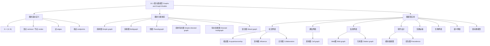

**相关笔记：** [[第09章_关系-章节汇总|第09章汇总]] | [[10.2 图的术语与特殊图]]

> [!abstract] 概览
> 本节系统介绍了==图（graph）==的基本定义与各类图模型。图是==由顶点集和边集组成的离散结构==，用于建模对象之间的二元关系。本节重点介绍了图的分类体系：==简单图==、==多重图==、==伪图==、==有向图==、==有向多重图==和==混合图==，以及图在社交网络、通信网络、信息网络、软件设计、交通运输、生物网络等领域的丰富应用。
>
> - ==图== $G = (V, E)$：非空顶点集 $V$ 和边集 $E$
> - ==简单图==：无环、无多重边的无向图
> - ==多重图==：允许多重边但无环的无向图
> - ==伪图==：允许环和多重边的无向图
> - ==有向图（digraph）==：每条边关联一个有序对 $(u, v)$
> - ==有向多重图==：允许多重有向边和环的有向图
> - ==混合图==：同时包含有向边和无向边
> - 图模型应用：社交网络、Web图、调用图、依赖图、交通网络、生物网络

---

## 一、知识结构总览

---

## 二、核心思想

> [!tip] 核心思想
> 本节的核心思想是==用顶点和边的离散结构来建模现实世界中对象之间的二元关系==。图论为描述和研究各种网络（社交网络、通信网络、信息网络等）提供了统一的数学框架。理解图的关键在于回答三个问题：边是有向还是无向？是否允许多重边？是否允许环？这三个问题的不同回答对应了不同类型的图。图与[[离散数学/concepts/二元关系|二元关系]]密切相关——有向图本质上就是关系的可视化表示。

### 1. 图的基本定义

> [!def] 图（Graph）
> 一个==图== $G = (V, E)$ 由非空的==顶点集==（或称节点集）$V$ 和==边集== $E$ 组成。每条边与一个或两个顶点（称为其==端点==）相关联，边连接其端点。
>
> - 顶点集 $V$ 可以是无限的（无限图），但本书主要讨论有限图
> - 每条边连接两个不同的顶点，或连接一个顶点到自身
> - 图的绘制方式是任意的，只要正确表示顶点之间的连接关系

> [!example] 计算机网络模型
> 一个由数据中心和通信链路组成的计算机网络可以用图来建模：
> - 顶点表示数据中心
> - 边表示通信链路
> - 例如：旧金山—洛杉矶—丹佛—芝加哥—纽约—华盛顿构成一个网络

### 2. 简单图

> [!def] 简单图（Simple Graph）
> ==简单图==是满足以下两个条件的无向图：
> 1. 每条边连接两个==不同==的顶点（无环）
> 2. 没有两条不同的边连接同一对顶点（无多重边）
>
> 在简单图中，每条边与一个无序对 $\{u, v\}$ 相关联，且没有其他边与同一无序对关联。因此，当简单图中存在与 $\{u, v\}$ 关联的边时，可以直接说"$\{u, v\}$ 是图的边"。

### 3. 多重图与伪图

> [!def] 多重图（Multigraph）
> ==多重图==是允许多重边但不含环的无向图。当有 $m$ 条不同的边与同一无序对 $\{u, v\}$ 相关联时，称 $\{u, v\}$ 是一条==重数为 $m$== 的边。

> [!def] 伪图（Pseudograph）
> ==伪图==是允许==环==（loop，连接顶点到自身的边）和==多重边==的无向图。

> [!def] 环（Loop）
> ==环==是连接一个顶点到自身的边。一个顶点可以有多个环。

### 4. 有向图

> [!def] 有向图（Directed Graph / Digraph）
> 一个==有向图== $G = (V, E)$ 由非空顶点集 $V$ 和有向边集 $E$（也称弧）组成。每条有向边与一个==有序对== $(u, v)$ 相关联：
> - $u$ 称为该边的==起点==（initial vertex）
> - $v$ 称为该边的==终点==（terminal vertex / end vertex）
> - 绘制时用从 $u$ 指向 $v$ 的箭头表示方向
>
> 有向图可以包含环和多重有向边，也可以同时包含 $(u, v)$ 和 $(v, u)$ 两个方向的边。

> [!def] 简单有向图（Simple Directed Graph）
> ==简单有向图==是没有环且没有多重有向边的有向图。每条边与唯一的有序对 $(u, v)$ 相关联。

> [!def] 有向多重图（Directed Multigraph）
> ==有向多重图==是允许多重有向边（从一个顶点到另一个顶点可以有多条同方向的边）和环的有向图。当有 $m$ 条有向边与同一有序对 $(u, v)$ 相关联时，称 $(u, v)$ 是一条==重数为 $m$== 的边。

> [!def] 混合图（Mixed Graph）
> ==混合图==是同时包含有向边和无向边的图。例如，一个同时有双向通信链路和单向通信链路的计算机网络就需要用混合图来建模。

> [!info] 图的分类总结
> | 类型 | 边的方向 | 多重边？ | 环？ |
> |:-----|:---------|:---------|:-----|
> | 简单图 | 无向 | 否 | 否 |
> | 多重图 | 无向 | 是 | 否 |
> | 伪图 | 无向 | 是 | 是 |
> | 简单有向图 | 有向 | 否 | 否 |
> | 有向多重图 | 有向 | 是 | 是 |
> | 混合图 | 有向+无向 | 是 | 是 |

### 5. 图模型实例

#### 社交网络

> [!example] 相识图与友谊图（Acquaintanceship and Friendship Graphs）
> 用简单图表示人与人之间的相识或朋友关系：
> - 每个人用一个顶点表示
> - 两个人相识（或为好友）时用一条无向边连接
> - 全世界所有人的相识图有超过 60 亿个顶点和超过 1 万亿条边

> [!example] 影响图（Influence Graph）
> 用有向图表示群体中人与人之间的影响力：
> - 每个人用一个顶点表示
> - 当 $a$ 能影响 $b$ 时，有一条从 $a$ 到 $b$ 的有向边
> - 不含环和多重有向边

> [!example] 合作图（Collaboration Graphs）
> 用简单图表示人与人之间的合作关系：
> - 顶点表示人，边表示两人曾合作（如合著论文、同队打球等）
> - 好莱坞图：顶点表示演员，边表示两人在同一部电影中出演（超过 290 万个顶点）
> - 学术合作图：顶点表示数学家，边表示两人合著论文（2004 年超过 40 万个顶点）

#### 通信网络

> [!example] 调用图（Call Graphs）
> 用有向多重图表示电话网络中的通话：
> - 每个电话号码用一个顶点表示
> - 每次通话用一条有向边表示（从呼叫方到接听方）
> - 需要有向边（通话有方向）和多重边（同一对号码间可能多次通话）
> - AT&T 研究的 20 天通话图约有 2.9 亿个顶点和 40 亿条边

#### 信息网络

> [!example] Web 图（Web Graph）
> 用有向图表示万维网：
> - 每个网页用一个顶点表示
> - 如果页面 $a$ 有指向页面 $b$ 的链接，则有一条从 $a$ 到 $b$ 的有向边
> - Web 图几乎每秒都在变化（新页面创建、旧页面删除）
> - 1999 年快照：超过 2 亿个顶点和 15 亿条边；2010 年估计：至少 550 亿个顶点和 1 万亿条边

> [!example] 引用图（Citation Graphs）
> 用有向图表示文档之间的引用关系：
> - 每个文档（论文、专利、法律意见）用一个顶点表示
> - 如果文档 $a$ 引用了文档 $b$，则有一条从 $a$ 到 $b$ 的有向边
> - 不含环和多重边

#### 软件设计

> [!example] 模块依赖图（Module Dependency Graph）
> 用有向图表示软件模块之间的依赖关系：
> - 每个模块用一个顶点表示
> - 如果模块 $B$ 依赖于模块 $A$，则有一条从 $A$ 到 $B$ 的有向边

> [!example] 优先图（Precedence Graph）
> 用有向图表示程序语句之间的执行依赖：
> - 每条语句用一个顶点表示
> - 如果语句 $S_j$ 必须在 $S_i$ 之后执行，则有一条从 $S_i$ 到 $S_j$ 的有向边
> - 用于并发处理中确定哪些语句可以同时执行

#### 交通运输网络

> [!example] 航线网络
> 用有向多重图表示航空公司的日常航班：
> - 每个机场用一个顶点表示
> - 每个航班用一条有向边表示（从出发机场到目的机场）
> - 同一天可能有多班从同一机场到另一机场的航班（多重边）

> [!example] 公路网络
> 用混合图表示公路网络：
> - 顶点表示路口，边表示路段
> - 双向道路用无向边，单向道路用有向边
> - 多条道路连接同一对路口用多重边，环线道路用环

#### 生物网络

> [!example] 生态位重叠图（Niche Overlap Graph）
> 用简单图表示生态系统中物种之间的竞争关系：
> - 每个物种用一个顶点表示
> - 如果两个物种竞争（使用部分相同的食物资源），则用一条无向边连接

> [!example] 蛋白质相互作用图（Protein Interaction Graph）
> 用无向图表示细胞中蛋白质之间的相互作用：
> - 每种蛋白质用一个顶点表示
> - 如果两种蛋白质相互结合以执行生物功能，则用一条无向边连接
> - 酵母细胞：超过 6000 种蛋白质，超过 80000 种已知相互作用
> - 人类细胞：超过 100000 种蛋白质，可能有约 1000000 种相互作用

#### 语义网络与锦标赛

> [!example] 语义网络（Semantic Networks）
> 用无向图表示词语之间的语义关系：
> - 顶点表示词语，边连接具有相似含义的词语
> - 通过分析大规模文本语料库（如英国国家语料库，1 亿词）发现相似词
> - 产生约 100000 个名词顶点和约 500000 条边的图

> [!example] 循环赛模型
> - ==循环赛==：每队与其他每队恰好比赛一次，用简单有向图建模（顶点为队伍，$(a, b)$ 表示 $a$ 击败 $b$）
> - ==淘汰赛==：每名参赛者输一次即被淘汰，用顶点表示每场比赛，有向边连接比赛到胜者参加的下一场比赛

---

## 三、补充理解与易混淆点

### 补充理解

> [!info] 补充1：图与二元关系的关系
> 图论与[[离散数学/concepts/二元关系|二元关系]]有着深刻的联系。有向图本质上就是[[离散数学/concepts/有向图|关系的可视化表示]]：
> - 集合 $A$ 上的关系 $R \subseteq A \times A$ 可以用有向图表示：顶点集为 $A$，当 $(a, b) \in R$ 时画一条从 $a$ 到 $b$ 的有向边
> - 反之，任何有向图也定义了一个关系（边集就是关系的有序对集合）
> - 简单有向图对应不含环的关系；有向多重图对应一个顶点可以多次关联到另一个顶点的情况
>
> 第 9 章中我们用有向图来可视化关系，第 10 章则进一步发展了图论自身的理论体系。
> 来源：Rosen, K. H. (2019). *Discrete Mathematics and Its Applications* (8th ed.), McGraw-Hill, Section 10.1.
> 来源：Diestel, R. (2017). *Graph Theory* (5th ed.). Springer, Chapter 1.

> [!info] 补充2：图论术语的多样性
> 图论是一门相对现代的学科，不同教材和不同领域使用的术语可能不同。理解图的关键不在于记住特定术语，而在于回答三个核心问题：
> 1. 边是有向的还是无向的（或两者兼有）？
> 2. 是否允许多重边？
> 3. 是否允许环？
>
> 例如，有些教材用"walk"代替"path"，用"trail"表示不重复边的通路，用"simple path"表示不重复顶点的通路。阅读不同资料时需要确认术语定义。
> 来源：Berge, C. (1958). *Théorie des Graphes et ses Applications*. Dunod, Paris.
> 来源：Bondy, J. A. & Murty, U. S. R. (2008). *Graph Theory* (Graduate Texts in Mathematics 244). Springer.

> [!info] 补充3：图的绘制与同构
> 图的绘制方式是任意的。同一个图可以有多种不同的画法，只要正确表示了顶点之间的连接关系。两个画法不同但结构相同的图称为==同构==的图（将在 10.3 节详细讨论）。因此，判断两个图是否"相同"不能仅看画法，而要看它们的顶点和边之间是否存在一一对应关系。
> 来源：Rosen, K. H. (2019). *Discrete Mathematics and Its Applications* (8th ed.), McGraw-Hill, Section 10.1 & 10.3.
> 来源：Diestel, R. (2017). *Graph Theory* (5th ed.). Springer, Chapter 1.

### 易混淆点

> [!warning] 误区：简单图 vs 多重图 vs 伪图
> - ❌ 认为"图"就是简单图
> - ✅ "图"是一个通用术语，可以指代上述任何类型。需要根据上下文或明确说明来确定具体类型
> - ❌ 认为多重图和伪图是同一种图
> - ✅ 多重图允许多重边但**不允许环**；伪图**同时允许**多重边和环

> [!warning] 误区：有向边与无向边的区别
> - ❌ 认为有向边 $(u, v)$ 和 $(v, u)$ 是同一条边
> - ✅ 在有向图中，$(u, v)$ 和 $(v, u)$ 是**两条不同的边**，分别表示从 $u$ 到 $v$ 和从 $v$ 到 $u$ 的连接
> - ❌ 认为无向边 $\{u, v\}$ 有方向
> - ✅ 无向边 $\{u, v\} = \{v, u\}$，没有方向之分

> [!warning] 误区：图的"大小"与"画法"
> - ❌ 认为图画得越大，图的规模越大
> - ✅ 图的规模由顶点数和边数决定，与画法无关。一个很大的图可以画得很紧凑，一个很小的图也可以画得很分散
> - ❌ 认为边不能交叉
> - ✅ 图的绘制中边可以交叉。有些图（如 $K_5$、$K_{3,3}$）无论如何画都不可避免边交叉（将在 10.7 节讨论平面图）

---

## 四、习题精选

> [!todo] 习题概览
> | 题号范围 | 核心考点 | 难度 |
> |---------|---------|------|
> | 1-2 | 根据描述确定图的类型 | ⭐ |
> | 3-9 | 判断给定图的类型（有向/无向、多重边、环） | ⭐⭐ |
> | 10 | 将非简单图转化为简单图 | ⭐⭐ |
> | 11-12 | 图与二元关系之间的联系 | ⭐⭐ |
> | 13 | 交集图的构造 | ⭐⭐⭐ |
> | 14-17 | 图模型的应用（生态、社交、历史） | ⭐⭐ |
> | 18-25 | 图模型的构建与分析 | ⭐⭐⭐ |
> | 26-38 | 描述性建模问题 | ⭐⭐⭐ |

### 题1：判断图的类型

> [!problem] 题目
> 判断以下各图应使用哪种类型的图（简单图、多重图、伪图、简单有向图、有向多重图、混合图）来建模：
>
> a) 顶点表示城市，如果两个城市之间有航班（任一方向），则有一条边
> b) 顶点表示城市，每个航班（任一方向）对应一条边
> c) 顶点表示城市，每个航班对应一条边，另加一个环表示迈阿密的观光飞行

> [!faq]- 解答
> a) **简单图**：城市之间有航班连接就用一条无向边表示，不需要方向（任一方向都算），不需要多重边（只要知道是否有航班），不需要环
>
> b) **多重图**：每个航班对应一条边，同一对城市之间可能有多个航班（多重边），但航班不是从城市出发又回到同一城市（无环）
>
> c) **伪图**：每个航班对应一条边（可能有多重边），观光飞行从迈阿密出发又回到迈阿密需要一个环

### 题2：高速公路系统的图模型

> [!problem] 题目
> 用图来建模主要城市之间的高速公路系统：
>
> a) 如果两个城市之间有州际高速公路，则有一条边——应使用什么类型的图？
> b) 每条州际高速公路对应一条边——应使用什么类型的图？
> c) 每条州际高速公路对应一条边，且如果有一条环绕城市的州际公路，则在表示该城市的顶点处有一个环——应使用什么类型的图？

> [!faq]- 解答
> a) **简单图**：只需要知道两个城市之间是否有高速公路连接，用一条无向边即可
>
> b) **多重图**：两个城市之间可能有多条不同的州际高速公路，需要允许多重边，但不需要环
>
> c) **伪图**：允许多重边（多条高速公路连接同一对城市）和环（环绕城市的公路）

### 题3：图与二元关系

> [!problem] 题目
> 设 $G$ 是一个简单图。证明 $G$ 的顶点集上的关系 $R$（$uRv$ 当且仅当 $\{u, v\}$ 是 $G$ 的边）是一个对称的、反自反的关系。

> [!faq]- 解答
> **对称性**：若 $uRv$，则 $\{u, v\}$ 是 $G$ 的边。因为 $G$ 是无向图，$\{u, v\} = \{v, u\}$，所以 $\{v, u\}$ 也是 $G$ 的边，故 $vRu$。因此 $R$ 是对称的。
>
> **反自反性**：$G$ 是简单图，不含环。因此对于任何顶点 $u$，$\{u, u\}$ 不是 $G$ 的边（简单图的边连接两个不同的顶点）。故 $u \not{R} u$，$R$ 是反自反的。
>
> $\blacksquare$

### 题4：构建影响图

> [!problem] 题目
> 为以下公司董事会成员构建一个影响图：董事长可以影响研发总监、营销总监和运营总监；研发总监可以影响运营总监；营销总监可以影响运营总监；没有人可以影响或被财务总监影响。

> [!faq]- 解答
> 顶点集：$\{$董事长, 研发总监, 营销总监, 运营总监, 财务总监$\}$
>
> 有向边：
> - 董事长 $\to$ 研发总监
> - 董事长 $\to$ 营销总监
> - 董事长 $\to$ 运营总监
> - 研发总监 $\to$ 运营总监
> - 营销总监 $\to$ 运营总监
>
> 财务总监是一个孤立顶点（没有入边也没有出边）。
>
> $\blacksquare$

### 题5：课程先修关系的图模型

> [!problem] 题目
> 每门大学课程可能有一门或多门先修课程。如何用图来建模这些课程以及哪些课程是哪些课程的先修课程？边应该是有向的还是无向的？如何从图中找到没有先修条件的课程和不是任何课程先修的课程？

> [!faq]- 解答
> **图模型**：
> - 顶点表示课程
> - 边应该是**有向的**：如果课程 $u$ 是课程 $v$ 的先修课程，则有一条从 $u$ 到 $v$ 的有向边
>
> **查找方法**：
> - **没有先修条件的课程**：图中==入度为 0== 的顶点（没有边指向这些顶点）
> - **不是任何课程先修的课程**：图中==出度为 0== 的顶点（没有边从这些顶点出发）
>
> $\blacksquare$

> [!tip] 解题思路提示
> 图模型构建方法论：
> 1. **确定顶点**：明确要建模的对象是什么（人、城市、网页、课程等）
> 2. **确定边**：明确对象之间的关系是什么（相识、连接、引用、先修等）
> 3. **确定方向**：关系是否有方向性？如果有，使用有向边
> 4. **确定多重边**：同一对对象之间是否可能有多重关系？
> 5. **确定环**：对象是否可能与自身有关系？

---

## 五、视频学习指南

> [!info] 视频资源
> | 资源 | 链接 | 对应内容 | 备注 |
> |:-----|:-----|:---------|:-----|
> | Rosen 8e Section 10.1 | [教材原文](https://www.mheducation.com/highered/product/discrete-mathematics-applications-rosen/M9781259676512.html) | 完整定义、图模型与例题 | 英文教材 |
> | MIT 6.042J Lecture 1 | [链接](https://www.youtube.com/watch?v=rfG3scF1HzY) | 图论引论 | 英文，MIT开放课程 |
> | TrevTutor - Graph Theory | [链接](https://www.youtube.com/watch?v=LFKZLXVO-Dg) | 图的基本概念与分类 | 英文，适合入门 |

---

## 六、教材原文

> [!quote] 教材原文
> "We begin with the definition of a graph. A graph $G = (V, E)$ consists of a nonempty set of vertices $V$ and a set of edges $E$. Each edge has either one or two vertices associated with it, called its endpoints. An edge is said to connect its endpoints."
>
> "A graph in which each edge connects two different vertices and where no two edges connect the same pair of vertices is called a simple graph."
>
> "A directed graph (or digraph) $(V, E)$ consists of a nonempty set of vertices $V$ and a set of directed edges (or arcs) $E$. Each directed edge is associated with an ordered pair of vertices. The directed edge associated with the ordered pair $(u, v)$ is said to start at $u$ and end at $v$."

---

## 参见 Wiki

- [[离散数学/concepts/有向图]] -- 有向图的定义与表示（与二元关系的关系）
- [[离散数学/concepts/二元关系]] -- 二元关系作为有向图的理论基础（第9章）
- [[离散数学/concepts/拉姆齐理论]] -- 完全图的子图结构（后续章节）

#学习/离散数学/图论
