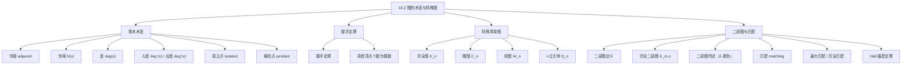

**相关笔记：** [[10.1 图与图模型]] | [[10.3 图的表示与同构]]

> [!abstract] 概览
> 本节系统介绍了图论的基本术语和几类重要的特殊图。核心内容包括：==邻接==、==关联==、==度==（含入度/出度）、==孤立点==、==悬挂点==等基本概念；==握手定理== $\sum_{v \in V} \deg(v) = 2|E|$ 及其推论；特殊图族：==完全图== $K_n$、==圈图== $C_n$、==轮图== $W_n$、==$n$ 立方体== $Q_n$、==二部图== $K_{m,n}$；以及二部图中的==匹配==问题与==Hall 婚配定理==。
>
> - ==邻接（adjacent）==：两个顶点是一条边的两个端点
> - ==度（degree）== $\deg(v)$：与顶点 $v$ 关联的边数（环贡献 2）
> - ==握手定理==：$\sum_{v \in V} \deg(v) = 2|E|$
> - ==完全图== $K_n$：$n$ 个顶点的简单图，每对顶点之间恰有一条边
> - ==二部图==：顶点集可划分为两个不相交子集，每条边连接不同子集的顶点
> - ==匹配== $M$：边的子集，任意两条边不共享端点
> - ==Hall 婚配定理==：二部图 $G$ 存在从 $V_1$ 到 $V_2$ 的完全匹配 $\Leftrightarrow$ $\forall A \subseteq V_1$，$|N(A)| \geq |A|$

---

## 一、知识结构总览

---

## 二、核心思想

> [!tip] 核心思想
> 本节的核心思想是==用精确的数学语言描述图的局部和全局结构==。度（degree）是最基本的局部性质，握手定理将所有顶点的局部性质（度）与全局性质（边数）联系起来。特殊图族（完全图、圈图、轮图、$n$ 立方体、二部图）为图论研究提供了重要的"标准模型"。二部图与匹配理论则展示了图论在资源分配、任务调度等实际问题中的强大应用能力。

### 1. 基本术语

> [!def] 邻接（Adjacent）与邻域（Neighborhood）
> 在无向图 $G$ 中，两个顶点 $u$ 和 $v$ 称为==邻接的==（或互为==邻居==），如果它们是一条边的两个端点。一条连接 $u$ 和 $v$ 的边称为与 $u$ 和 $v$ ==关联的==（incident），并称该边==连接== $u$ 和 $v$。
>
> 顶点 $v$ 的==邻域== $N(v)$ 是 $G$ 中所有与 $v$ 邻接的顶点的集合。对于顶点子集 $A \subseteq V$，$N(A) = \bigcup_{v \in A} N(v)$ 表示 $A$ 中至少一个顶点的所有邻居的集合。

> [!def] 度（Degree）
> 在无向图中，顶点 $v$ 的==度== $\deg(v)$ 是与 $v$ 关联的边数，但==环在度中贡献 2==（因为环的两个端点都是 $v$ 自身）。
>
> - ==孤立点（isolated vertex）==：度为 0 的顶点，不与任何顶点邻接
> - ==悬挂点（pendant vertex）==：度为 1 的顶点，恰好与一个顶点邻接

> [!example] 度的计算
> 在图 $G$ 中（顶点为 $a, b, c, d, e, f, g$）：
> - $\deg(a) = 2$，$\deg(b) = 4$，$\deg(c) = 1$（悬挂点），$\deg(d) = 3$，$\deg(e) = 0$（孤立点），$\deg(f) = 4$
> - $N(a) = \{b, f\}$，$N(b) = \{a, c, e, f\}$，$N(g) = \emptyset$

### 2. 有向图的度

> [!def] 入度与出度
> 在有向图中，顶点 $v$ 的==入度== $\deg^{-}(v)$ 是以 $v$ 为终点的边数；==出度== $\deg^{+}(v)$ 是以 $v$ 为起点的边数。==环同时贡献 1 到入度和 1 到出度==。
>
> 顶点的总度 $\deg(v) = \deg^{-}(v) + \deg^{+}(v)$。

> [!thm] 有向图的度定理（Theorem 3）
> 设 $G = (V, E)$ 是有向图，则
>
> $$\sum_{v \in V} \deg^{-}(v) = \sum_{v \in V} \deg^{+}(v) = |E|$$
>
> **证明**：每条有向边恰好有一个起点和一个终点。将所有顶点的入度求和，每条边恰好被计算一次（以其终点计数），因此入度之和等于 $|E|$。同理，出度之和也等于 $|E|$。
>
> $\blacksquare$

### 3. 握手定理

> [!thm] 握手定理（The Handshaking Theorem, Theorem 1）
> 设 $G = (V, E)$ 是有 $m$ 条边的无向图，则
>
> $$\sum_{v \in V} \deg(v) = 2m$$
>
> （即使存在多重边和环，此定理仍然成立。）

> [!example] 握手定理的应用
> 一个有 10 个顶点的图，每个顶点的度都是 6，有多少条边？
>
> 度之和 $= 6 \times 10 = 60$。由握手定理，$2m = 60$，因此 $m = 30$。

> [!thm] 奇度顶点个数定理（Theorem 2）
> 无向图中==奇数度的顶点个数一定是偶数==。
>
> **证明**：设 $V_1$ 为偶数度顶点的集合，$V_2$ 为奇数度顶点的集合。由握手定理：
>
> $$2m = \sum_{v \in V} \deg(v) = \sum_{v \in V_1} \deg(v) + \sum_{v \in V_2} \deg(v)$$
>
> 因为 $V_1$ 中每个顶点的度是偶数，所以 $\sum_{v \in V_1} \deg(v)$ 是偶数。又因为 $2m$ 是偶数，所以 $\sum_{v \in V_2} \deg(v)$ 也是偶数。而 $V_2$ 中每个顶点的度都是奇数，奇数个奇数之和为奇数，偶数个奇数之和为偶数。因此 $V_2$ 中必须有偶数个顶点。
>
> $\blacksquare$

> [!info] 握手定理的直觉
> 握手定理的名称来自一个类比：在一次聚会上，每个人握手次数的总和等于握手总次数的 2 倍（每次握手涉及两个人）。类似地，每条边恰好贡献 2 到度之和（因为每条边有两个端点）。

### 4. 特殊简单图

> [!def] 完全图（Complete Graph）$K_n$
> $n$ 个顶点的==完全图== $K_n$ 是一个简单图，其中每对不同的顶点之间恰好有一条边。
>
> - $K_n$ 有 $\binom{n}{2} = \frac{n(n-1)}{2}$ 条边
> - 每个顶点的度都是 $n - 1$
> - $K_1$：单个顶点，无边；$K_2$：一条边；$K_3$：三角形；$K_4$：四面体骨架

> [!def] 圈图（Cycle Graph）$C_n$（$n \geq 3$）
> ==圈图== $C_n$ 由 $n$ 个顶点 $v_1, v_2, \ldots, v_n$ 和 $n$ 条边 $\{v_1, v_2\}, \{v_2, v_3\}, \ldots, \{v_{n-1}, v_n\}, \{v_n, v_1\}$ 组成。
>
> - $C_n$ 有 $n$ 个顶点和 $n$ 条边
> - 每个顶点的度都是 2
> - $C_n$ 是==2-正则图==（所有顶点度数相同）

> [!def] 轮图（Wheel）$W_n$（$n \geq 3$）
> ==轮图== $W_n$ 是在圈图 $C_n$ 的基础上增加一个新顶点（称为"中心"），并将该中心与 $C_n$ 的每个顶点用新边连接。
>
> - $W_n$ 有 $n + 1$ 个顶点和 $2n$ 条边
> - 中心的度为 $n$，轮缘上每个顶点的度为 3
> - $W_n$ 可以看作 $C_n$ 和 $K_{1,n}$ 的"叠加"

> [!def] $n$ 立方体（$n$-Cube）$Q_n$
> ==$n$ 立方体== $Q_n$ 是一个有 $2^n$ 个顶点的图，每个顶点表示一个长度为 $n$ 的比特串。两个顶点邻接当且仅当它们对应的比特串恰好在一个比特位上不同。
>
> - $Q_n$ 有 $2^n$ 个顶点和 $n \cdot 2^{n-1}$ 条边
> - 每个顶点的度都是 $n$（$n$-正则图）
> - 递归构造：$Q_{n+1}$ 由两个 $Q_n$ 的副本组成，加上连接对应顶点的边（新比特位为 0 和为 1 的副本）
> - $Q_1$：两个顶点一条边；$Q_2$：正方形；$Q_3$：立方体

> [!info] 特殊图的参数总结
> | 图 | 顶点数 | 边数 | 每个顶点的度 | 正则？ |
> |:---|:------|:----|:-----------|:------|
> | $K_n$ | $n$ | $\binom{n}{2}$ | $n - 1$ | $(n-1)$-正则 |
> | $C_n$ | $n$ | $n$ | $2$ | 2-正则 |
> | $W_n$ | $n + 1$ | $2n$ | 中心 $n$，轮缘 $3$ | 否 |
> | $Q_n$ | $2^n$ | $n \cdot 2^{n-1}$ | $n$ | $n$-正则 |

### 5. 二部图

> [!def] 二部图（Bipartite Graph）
> 简单图 $G$ 称为==二部图==，如果其顶点集可以划分为两个不相交的子集 $V_1$ 和 $V_2$，使得 $G$ 中的每条边都连接 $V_1$ 中的一个顶点和 $V_2$ 中的一个顶点（即没有边连接同一子集中的两个顶点）。
>
> 此时 $(V_1, V_2)$ 称为 $G$ 的顶点集的一个==二划分==（bipartition）。

> [!thm] 二部图的判定定理（Theorem 4）
> 一个简单图是二部图当且仅当可以用两种不同的颜色给每个顶点着色，使得没有两个相邻的顶点被赋予相同的颜色。
>
> **证明**：
>
> **必要性**：设 $G$ 是二部图，$V = V_1 \cup V_2$。将 $V_1$ 中所有顶点着色为颜色 1，$V_2$ 中所有顶点着色为颜色 2。因为 $G$ 的每条边连接 $V_1$ 和 $V_2$ 中的顶点，所以没有两个相邻顶点同色。
>
> **充分性**：设可以用两种颜色给 $G$ 的顶点着色，使得相邻顶点不同色。令 $V_1$ 为颜色 1 的顶点集，$V_2$ 为颜色 2 的顶点集。则 $V_1 \cap V_2 = \emptyset$，$V = V_1 \cup V_2$，且每条边连接 $V_1$ 和 $V_2$ 中的顶点。因此 $G$ 是二部图。
>
> $\blacksquare$

> [!example] 二部图判定
> - $C_6$ 是二部图：交替着色即可（$V_1 = \{v_1, v_3, v_5\}$，$V_2 = \{v_2, v_4, v_6\}$）
> - $K_3$ 不是二部图：3 个顶点分到 2 个集合中，必有一个集合含至少 2 个顶点，而 $K_3$ 中每对顶点之间都有边

> [!warning] $K_{1,1}$ 与 $K_3$ 的区别
> - $K_3$（三角形）不是二部图，因为它含有长度为 3 的奇数圈
> - 一般地，一个图是二部图当且仅当它不包含奇数长度的圈（将在 10.4 节的习题中讨论）

> [!def] 完全二部图（Complete Bipartite Graph）$K_{m,n}$
> ==完全二部图== $K_{m,n}$ 是一个二部图，其顶点集划分为大小分别为 $m$ 和 $n$ 的两个子集，且两个子集中的每对顶点之间恰好有一条边。
>
> - $K_{m,n}$ 有 $m + n$ 个顶点和 $m \cdot n$ 条边
> - $V_1$ 中每个顶点的度为 $n$，$V_2$ 中每个顶点的度为 $m$
> - $K_{3,3}$ 是一个重要的非平面图（将在 10.7 节讨论）

### 6. 匹配与 Hall 婚配定理

> [!def] 匹配（Matching）
> 简单图 $G = (V, E)$ 中的一个==匹配== $M$ 是 $E$ 的一个子集，使得 $M$ 中任意两条边都不共享端点。即如果 $\{s, t\}$ 和 $\{u, v\}$ 是 $M$ 中不同的边，则 $s, t, u, v$ 互不相同。
>
> - 被 $M$ 中边覆盖的顶点称为==已匹配的==（matched），否则称为==未匹配的==（unmatched）
> - ==最大匹配==（maximum matching）：边数最多的匹配
> - 在二部图 $G = (V, E)$ 中，二划分 $(V_1, V_2)$ 的==完全匹配==（complete matching）是从 $V_1$ 到 $V_2$ 的匹配，使得 $V_1$ 中每个顶点都被匹配，即 $|M| = |V_1|$

> [!example] 工作分配问题
> 4 名员工（Alvarez, Berkowitz, Chen, Davis）和 4 项工作（需求分析、架构、实现、测试）。每名员工受过一项或多项工作的培训。用二部图建模：
> - 顶点集划分为员工集和工作集
> - 如果员工受过某项工作的培训，则有一条边连接
>
> **Project 1**：可以找到完全匹配（Alvarez→测试，Berkowitz→实现，Chen→架构，Davis→需求分析）
>
> **Project 2**：不存在完全匹配，因为需求分析、实现、测试三项工作只有 2 名员工（Xuan, Ziegler）受过培训

> [!thm] Hall 婚配定理（Hall's Marriage Theorem, Theorem 5）
> 设 $G = (V, E)$ 是二划分 $(V_1, V_2)$ 的二部图。$G$ 存在从 $V_1$ 到 $V_2$ 的完全匹配，当且仅当对于 $V_1$ 的所有子集 $A$，都有
>
> $$|N(A)| \geq |A|$$
>
> 即 $V_1$ 中任意 $k$ 个顶点的邻居集合至少包含 $V_2$ 中的 $k$ 个顶点。

> [!example] Hall 定理的应用
> 设每个男人恰好愿意娶 $k$ 个女人，每个女人恰好愿意嫁 $k$ 个男人，且男人愿意娶某女人当且仅当该女人也愿意嫁该男人。证明可以匹配所有男女。
>
> **证明**：设 $A$ 是男人集的任意子集，$|A| = j$。因为 $A$ 中每个男人恰好有 $k$ 个愿意娶的女人，所以从 $A$ 出发的边共有 $jk$ 条。这些边的另一端都是 $N(A)$ 中的女人。$N(A)$ 中每个女人最多有 $k$ 条来自 $A$ 的边（因为每个女人恰好愿意嫁 $k$ 个男人），所以 $|N(A)| \cdot k \geq jk$，即 $|N(A)| \geq j = |A|$。由 Hall 定理，存在完全匹配。
>
> $\blacksquare$

> [!info] Hall 定理的证明思路
> Hall 定理的证明使用**强归纳法**对 $|V_1|$ 进行归纳：
> - **基础步**：$|V_1| = 1$ 时，$|N(\{v\})| \geq 1$，直接取一条边即可
> - **归纳步**（$|V_1| = k + 1$），分两种情况：
>   - **Case (i)**：$V_1$ 中每个大小为 $j$（$1 \leq j \leq k$）的子集都至少有 $j + 1$ 个邻居。任选一条边 $\{v, w\}$，删除 $v$ 和 $w$ 后，剩余图满足归纳假设，得到完全匹配，再加上 $\{v, w\}$
>   - **Case (ii)**：存在某个大小为 $j$ 的子集 $W_1$ 恰好有 $j$ 个邻居 $W_2$。先用归纳假设得到 $W_1$ 到 $W_2$ 的完全匹配，再证明剩余图也满足 Hall 条件，得到第二个完全匹配，合并两者

### 7. 子图与图的运算

> [!def] 子图（Subgraph）
> 图 $H = (W, F)$ 是图 $G = (V, E)$ 的==子图==，如果 $W \subseteq V$ 且 $F \subseteq E$。若 $H \neq G$，则称 $H$ 是 $G$ 的==真子图==。
>
> - ==诱导子图==（induced subgraph）：由顶点子集 $W \subseteq V$ 诱导的子图包含 $W$ 中所有顶点以及 $E$ 中两端点都在 $W$ 中的所有边
> - $G - e$：删除边 $e$（保留端点）
> - $G + e$：添加边 $e$（连接已有的两个不邻接的顶点）
> - $G - v$：删除顶点 $v$ 及其所有关联边
> - $G_1 \cup G_2$：两个简单图的并（顶点集和边集分别取并）

---

## 三、补充理解与易混淆点

### 补充理解

> [!info] 补充1：握手定理的广泛应用
> 握手定理是图论中最基本也最实用的定理之一，其应用包括：
> - **判断度序列是否可能**：如果度序列之和不是偶数，则不可能对应任何图
> - **证明图的存在性**：例如，不存在 5 个顶点的简单图使得每个顶点的度都是 3（因为 $5 \times 3 = 15$ 是奇数，而握手定理要求度之和为偶数）
> - **正则图的边数计算**：$n$-正则图有 $n$ 个顶点，每个顶点度为 $r$，则边数为 $nr/2$，因此 $nr$ 必须是偶数
> 来源：Rosen, K. H. (2019). *Discrete Mathematics and Its Applications* (8th ed.), McGraw-Hill, Section 10.2.
> 来源：Bondy, J. A. & Murty, U. S. R. (2008). *Graph Theory*. Springer, Theorem 1.1.

> [!info] 补充2：特殊图的应用背景
> - **完全图 $K_n$**：代表所有对象两两之间都有关系的情况（如小型会议中所有人都互相认识）
> - **圈图 $C_n$**：代表环形拓扑结构（如环形局域网、环形交通路线）
> - **轮图 $W_n$**：代表星形+环形的混合拓扑（如带冗余的局域网）
> - **$n$ 立方体 $Q_n$**：代表超立方体互连网络（如并行计算机的处理器互连），平衡了每个处理器的直连数和通信跳数
> - **完全二部图 $K_{m,n}$**：代表两组对象之间的完全对应关系（如星形网络 $K_{1,n}$）
> 来源：Rosen, K. H. (2019). *Discrete Mathematics and Its Applications* (8th ed.), McGraw-Hill, Section 10.2.
> 来源：Harary, F. (1969). *Graph Theory*. Addison-Wesley, Chapter 4.

> [!info] 补充3：度序列与图的存在性
> 一个非负整数序列 $d_1, d_2, \ldots, d_n$（非递增排列）如果是一个简单图的度序列，则称为==可图序列==（graphic sequence）。判断一个序列是否可图有递归算法（Havel-Hakimi 定理）：
> - 删除最大度 $d_1$，将后续 $d_1$ 个度各减 1
> - 对新序列重新排序，重复上述过程
> - 如果某一步出现负数或无法继续，则原序列不可图
> 来源：Erdős, P. & Gallai, T. (1960). "Gráfok előírt fokszámú pontokkal." *Matematikai Lapok*, 11, 264–274.
> 来源：Bondy, J. A. & Murty, U. S. R. (2008). *Graph Theory*. Springer, Section 1.6.

### 易混淆点

> [!warning] 误区：环对度的贡献
> - ❌ 认为环在度中贡献 1
> - ✅ 环在度中贡献 **2**，因为环的两个端点都是同一个顶点。这与握手定理一致：环仍然是一条边，贡献 2 到度之和

> [!warning] 误区：二部图的判定
> - ❌ 认为只要能将顶点分成两组就是二部图
> - ✅ 二部图要求**每条边**都连接不同组的顶点。如果存在一条边连接同一组的两个顶点，则不是二部图
> - ❌ 认为 $K_n$ 可能是二部图
> - ✅ $K_n$（$n \geq 3$）不是二部图，因为将 $n$ 个顶点分到 2 个集合中，至少有一个集合有 2 个顶点，而 $K_n$ 中这两个顶点之间有边

> [!warning] 误区：完全匹配 vs 最大匹配
> - ❌ 认为完全匹配就是最大匹配
> - ✅ 完全匹配要求 $V_1$ 中**所有**顶点都被匹配；最大匹配只是边数最多的匹配，不一定覆盖 $V_1$ 的所有顶点
> - 当 $|V_1| > |V_2|$ 时，不可能存在从 $V_1$ 到 $V_2$ 的完全匹配（因为 $V_2$ 中顶点不够）
> - 完全匹配一定是最大匹配（在 $|V_1| \leq |V_2|$ 的前提下），但最大匹配不一定是完全匹配

> [!warning] 误区：Hall 条件的必要性 vs 充分性
> - Hall 条件既是必要的也是充分的。必要性容易理解：如果某个子集 $A$ 的邻居少于 $|A|$，则 $A$ 中的顶点不可能全部被匹配
> - 充分性是更深刻的结果：即使对每个子集 $A$ 都恰好有 $|N(A)| = |A|$（"紧绷"的情况），仍然存在完全匹配

---

## 四、习题精选

> [!todo] 习题概览
> | 题号范围 | 核心考点 | 难度 |
> |---------|---------|------|
> | 1-3 | 度的计算、孤立点与悬挂点 | ⭐ |
> | 4 | 握手定理验证 | ⭐ |
> | 5-6 | 握手定理的应用 | ⭐⭐ |
> | 7-10 | 有向图的入度与出度 | ⭐⭐ |
> | 11-16 | 度在图模型中的含义 | ⭐⭐ |
> | 17-19 | 简单图中度相同的顶点 | ⭐⭐⭐ |
> | 20 | 特殊图的绘制 | ⭐ |
> | 21-25 | 二部图的判定 | ⭐⭐ |
> | 26-30 | 二部图匹配与 Hall 定理 | ⭐⭐⭐ |
> | 31-34 | Hall 定理的应用证明 | ⭐⭐⭐⭐ |
> | 44-49 | 度序列与可图性 | ⭐⭐⭐ |

### 题1：度与握手定理

> [!problem] 题目
> 在无向图中，已知顶点 $a$ 的度为 3，顶点 $b$ 的度为 4，顶点 $c$ 的度为 1，顶点 $d$ 的度为 2，顶点 $e$ 的度为 5。求该图的边数，并验证握手定理。

> [!faq]- 解答
> 度之和 $= 3 + 4 + 1 + 2 + 5 = 15$。
>
> 由握手定理，$2m = 15$，因此 $m = 7.5$。
>
> 但边数必须是整数！这说明**不存在**具有给定度序列的图。度序列之和必须是偶数（这是握手定理的直接推论）。
>
> $\blacksquare$

### 题2：握手定理的应用

> [!problem] 题目
> 一个简单图能否有 15 个顶点，每个顶点的度都是 5？

> [!faq]- 解答
> 如果存在这样的图，度之和 $= 15 \times 5 = 75$。
>
> 由握手定理，$2m = 75$，即 $m = 37.5$。
>
> 边数不可能是非整数，因此**不存在**这样的简单图。
>
> $\blacksquare$

### 题3：二部图的判定

> [!problem] 题目
> 判断以下图是否是二部图：
>
> a) $K_{2,3}$
> b) $C_5$（五边形）
> c) $Q_3$（3-立方体）

> [!faq]- 解答
> a) **是二部图**。$K_{2,3}$ 的定义就是完全二部图，顶点集天然分为大小为 2 和 3 的两个子集
>
> b) **不是二部图**。$C_5$ 有 5 个顶点和 5 条边构成一个奇数圈。尝试 2-着色：给 $v_1$ 着红色，则 $v_2$ 着蓝色，$v_3$ 着红色，$v_4$ 着蓝色，$v_5$ 着红色。但 $v_5$ 和 $v_1$ 相邻且同色，矛盾
>
> c) **是二部图**。$Q_3$ 的顶点是长度为 3 的比特串。将偶数个 1 的比特串放入 $V_1$，奇数个 1 的比特串放入 $V_2$。相邻的两个比特串恰好在一个比特位上不同，因此奇偶性不同，分别属于 $V_1$ 和 $V_2$

### 题4：Hall 定理的应用

> [!problem] 题目
> 4 名员工需要支持 4 个领域（硬件、软件、网络、无线）。Ping 能支持硬件、网络、无线；Quiggley 能支持软件、网络；Ruiz 能支持网络、无线；Sitea 能支持硬件、软件。
>
> a) 用二部图建模
> b) 用 Hall 定理判断是否存在完全匹配
> c) 如果存在，找到一个完全匹配

> [!faq]- 解答
> a) 员工集 $V_1 = \{$Ping, Quiggley, Ruiz, Sitea$\}$，领域集 $V_2 = \{$硬件, 软件, 网络, 无线$\}$
>
> 边：Ping—硬件，Ping—网络，Ping—无线，Quiggley—软件，Quiggley—网络，Ruiz—网络，Ruiz—无线，Sitea—硬件，Sitea—软件
>
> b) 检查 Hall 条件。$V_1$ 有 $2^4 - 1 = 15$ 个非空子集，逐一检查：
> - 单元素子集：每个员工至少支持 2 个领域 $\geq 1$ ✅
> - 双元素子集：例如 $\{$Quiggley, Ruiz$\}$ 的邻居为 $\{$软件, 网络, 无线$\}$，$|N| = 3 \geq 2$ ✅
> - 三元素子集：例如 $\{$Quiggley, Ruiz, Sitea$\}$ 的邻居为 $\{$软件, 网络, 无线, 硬件$\}$，$|N| = 4 \geq 3$ ✅
> - 全集：邻居为全部 4 个领域，$|N| = 4 \geq 4$ ✅
>
> 所有子集满足 Hall 条件，因此存在完全匹配。
>
> c) 一个完全匹配：Ping→硬件，Quiggley→软件，Ruiz→无线，Sitea→网络（或 Ping→无线，Quiggley→软件，Ruiz→网络，Sitea→硬件）
>
> $\blacksquare$

### 题5：度序列的可图性

> [!problem] 题目
> 判断以下序列是否是可图序列（即是否是某个简单图的度序列）：
>
> a) $5, 4, 3, 2, 1, 0$
> b) $3, 3, 3, 2, 2, 2$
> c) $1, 1, 1, 1, 1, 1$

> [!faq]- 解答
> a) **不可图**。度之和 $= 5 + 4 + 3 + 2 + 1 + 0 = 15$ 是奇数，而握手定理要求度之和为偶数
>
> b) **可图**。度之和 $= 3 + 3 + 3 + 2 + 2 + 2 = 15$ 是奇数——等等，$15$ 是奇数！所以**不可图**
>
> 重新计算：$3 + 3 + 3 + 2 + 2 + 2 = 15$。确实是奇数，不可图。
>
> c) **可图**。度之和 $= 1 + 1 + 1 + 1 + 1 + 1 = 6$ 是偶数。可以用 Havel-Hakimi 算法验证：删除第一个 1，将下一个 1 减 1 得 0，排序得 $1, 1, 1, 1, 0$；继续删除 1，得 $0, 1, 1, 0$，排序得 $1, 1, 0, 0$；继续得 $0, 0, 0$。全部为零，可图。对应的图是三个不相交的边（$K_2 \cup K_2 \cup K_2$）
>
> $\blacksquare$

> [!tip] 解题思路提示
> 1. **握手定理**：首先检查度之和是否为偶数，这是必要条件
> 2. **度序列**：使用 Havel-Hakimi 算法判断可图性
> 3. **二部图判定**：尝试 2-着色，或检查是否含有奇数圈
> 4. **Hall 定理**：检查所有子集的邻居数，但实际中往往只需检查"瓶颈"子集（邻居最少的子集）
> 5. **特殊图计数**：记住 $K_n$ 有 $\binom{n}{2}$ 条边，$C_n$ 有 $n$ 条边，$Q_n$ 有 $n \cdot 2^{n-1}$ 条边，$K_{m,n}$ 有 $mn$ 条边

---

## 五、视频学习指南

> [!info] 视频资源
> | 资源 | 链接 | 对应内容 | 备注 |
> |:-----|:-----|:---------|:-----|
> | Rosen 8e Section 10.2 | [教材原文](https://www.mheducation.com/highered/product/discrete-mathematics-applications-rosen/M9781259676512.html) | 完整定义、定理与例题 | 英文教材 |
> | MIT 6.042J Lecture 2 | [链接](https://www.youtube.com/watch?v=QDscVTsKlBE) | 图的术语与握手定理 | 英文，MIT开放课程 |
> | TrevTutor - Bipartite Graphs | [链接](https://www.youtube.com/watch?v=HmUJ_yaRzjY) | 二部图与匹配 | 英文，适合入门 |

---

## 六、教材原文

> [!quote] 教材原文
> "Two vertices $u$ and $v$ in an undirected graph $G$ are called adjacent (or neighbors) in $G$ if $u$ and $v$ are endpoints of an edge of $G$. An edge that connects $u$ and $v$ is called incident with the vertices $u$ and $v$ and is said to connect $u$ and $v$."
>
> "The degree of a vertex in an undirected graph is the number of edges incident with it, except that a loop at a vertex contributes twice to the degree of that vertex."
>
> "Let $G = (V, E)$ be an undirected graph with $m$ edges. Then $\sum_{v \in V} \deg(v) = 2m$."
>
> "A simple graph is called bipartite if its vertex set can be partitioned into two disjoint sets $V_1$ and $V_2$ such that every edge in the graph connects a vertex in $V_1$ and a vertex in $V_2$."
>
> "The bipartite graph $G = (V, E)$ with bipartition $(V_1, V_2)$ has a complete matching from $V_1$ to $V_2$ if and only if $|N(A)| \geq |A|$ for all subsets $A$ of $V_1$."

---

## 参见 Wiki

- [[离散数学/concepts/有向图]] -- 有向图中的入度与出度
- [[离散数学/concepts/二元关系]] -- 二元关系与有向图的联系（第9章）
- [[离散数学/concepts/拉姆齐理论]] -- 完全图的子图结构（后续章节）

#学习/离散数学/图论
