**相关笔记：** [[10.2 图的术语与特殊图]] | [[10.4 连通性]]

> [!abstract] 概览
> 本节介绍了图的多种计算机表示方法，以及==图的同构==这一核心概念。图的表示方法包括==邻接表==、==邻接矩阵==和==关联矩阵==，它们各有优劣，适用于不同的应用场景。==图的同构==刻画了两个图在忽略顶点标签后是否具有相同的结构，判定同构是图论中的重要问题。本节还讨论了==图的不变量==（如顶点数、边数、度序列等），它们是判断两个图不同构的有力工具，但不存在一组已知的不变量能完全判定同构。
>
> - ==邻接表==：列出每个顶点的所有邻接顶点，适合稀疏图
> - ==邻接矩阵==：$n \times n$ 的零一矩阵，$(i,j)$ 位置为 1 当且仅当 $v_i$ 与 $v_j$ 邻接，适合稠密图
> - ==关联矩阵==：$n \times m$ 的零一矩阵，$(i,j)$ 位置为 1 当且仅当 $v_i$ 与 $e_j$ 关联
> - ==图的同构==：存在双射 $f: V_1 \to V_2$，使得 $a$ 与 $b$ 邻接当且仅当 $f(a)$ 与 $f(b)$ 邻接
> - ==图的不变量==：顶点数、边数、度序列、回路长度分布等在同构下保持不变
> - ==同构判定==：目前没有多项式时间算法，Babai (2017) 给出了拟多项式时间算法

---

## 一、知识结构总览

```mermaid
graph TB
    A["10.3 图的表示与同构 Representing Graphs and Graph Isomorphism"] --> B["图的表示方法"]
    A --> C["图的同构"]

    B --> B1["邻接表 Adjacency Lists"]
    B --> B2["邻接矩阵 Adjacency Matrices"]
    B --> B3["关联矩阵 Incidence Matrices"]
    B --> B4["表示方法的权衡"]

    B1 --> B1a["列出每个顶点的邻接顶点"]
    B1 --> B1b["适合稀疏图"]

    B2 --> B2a["零一矩阵（简单图）"]
    B2 --> B2b["对称性（无向图）"]
    B2 --> B2c["多重边/自环的推广"]
    B2 --> B2d["有向图的邻接矩阵"]

    B3 --> B3a["顶点 × 边的零一矩阵"]
    B3 --> B3b["多重边与自环的处理"]

    B4 --> B4a["稀疏图：邻接表更优"]
    B4 --> B4b["稠密图：邻接矩阵更优"]

    C --> C1["同构的定义"]
    C --> C2["同构的判定"]
    C --> C3["图的不变量"]
    C --> C4["算法复杂度"]

    C1 --> C1a["双射保持邻接关系"]
    C1 --> C1b["等价关系"]

    C2 --> C2a["邻接矩阵验证法"]
    C2 --> C2b["不存在通用充分必要条件"]

    C3 --> C3a["顶点数、边数"]
    C3 --> C3b["度序列"]
    C3 --> C3c["回路长度分布"]
    C3 --> C3d["不变量相同 ≠ 同构"]

    C4 --> C4a["NP 困难问题"]
    C4 --> C4b["Babai 拟多项式算法"]
    C4 --> C4c["实际工具 NAUTY"]

    C --> C5["应用"]
    C5 --> C5a["化学：分子图"]
    C5 --> C5b["电路设计验证"]
```

---

## 二、核心思想

> [!tip] 核心思想
> 本节的核心思想是==如何在计算机中高效地表示图==，以及==如何判断两个图是否具有相同的结构==。图的表示方法的选择取决于图的稀疏程度和需要执行的操作类型。图的同构则回答了一个深层问题：两个图是否只是"换了标签"的同一个图？同构的判定没有简单的充分必要条件，但通过==图的不变量==可以排除大量不同构的情况。

### 1. 邻接表

> [!def] 邻接表（Adjacency Lists）
> 对于没有多重边的图，可以用邻接表来表示：对图中的每个顶点，列出所有与它邻接的顶点。
>
> - 对于有向图，列出从每个顶点出发的边所指向的终端顶点
> - 邻接表是图的一种紧凑表示，特别适合==稀疏图==（边数远小于 $n^2$ 的图）

> [!example] 邻接表的构造
> 对于图 $G$（顶点为 $a, b, c, d, e$），其邻接表为：
>
> | 顶点 | 邻接顶点 |
> |:----:|:--------:|
> | $a$ | $b, c, e$ |
> | $b$ | $a$ |
> | $c$ | $a, d, e$ |
> | $d$ | $c, e$ |
> | $e$ | $a, c, d$ |

### 2. 邻接矩阵

> [!def] 邻接矩阵（Adjacency Matrix）
> 设 $G = (V, E)$ 是简单图，$|V| = n$。将顶点列为 $v_1, v_2, \ldots, v_n$，则 $G$ 的==邻接矩阵== $A$（或 $A_G$）是 $n \times n$ 的零一矩阵，其 $(i,j)$ 位置定义为：
>
> $$a_{ij} = \begin{cases} 1 & \text{若 } \{v_i, v_j\} \text{ 是 } G \text{ 的边} \\ 0 & \text{否则} \end{cases}$$
>
> - 邻接矩阵依赖于顶点的排列顺序，同一图最多有 $n!$ 种不同的邻接矩阵
> - 简单图的邻接矩阵是==对称的==（$a_{ij} = a_{ji}$），且==对角线全为零==（无自环）

> [!example] 邻接矩阵的构造
> 设顶点按 $a, b, c, d$ 排列，则图的邻接矩阵为：
>
> $$A = \begin{pmatrix} 0 & 1 & 1 & 1 \\ 1 & 0 & 1 & 0 \\ 1 & 1 & 0 & 0 \\ 1 & 0 & 0 & 0 \end{pmatrix}$$

> [!info] 邻接矩阵的推广
> - **多重边**：$(i,j)$ 位置的值等于连接 $v_i$ 和 $v_j$ 的边数（不再是零一矩阵）
> - **自环**：$(i,i)$ 位置的值等于 $v_i$ 上的自环数
> - **有向图**：$a_{ij} = 1$ 当且仅当 $(v_i, v_j)$ 是有向边。有向图的邻接矩阵==不一定对称==
> - 所有==无向图==（包括多重图和伪图）的邻接矩阵都是==对称的==

> [!def] 有向图的邻接矩阵
> 设 $G = (V, E)$ 是有向图，顶点列为 $v_1, v_2, \ldots, v_n$。邻接矩阵 $A = [a_{ij}]$ 定义为：
>
> $$a_{ij} = \begin{cases} 1 & \text{若 } (v_i, v_j) \text{ 是 } G \text{ 的边} \\ 0 & \text{否则} \end{cases}$$
>
> - 有向图的邻接矩阵==不需要对称==
> - 对于有向多重图，$a_{ij}$ 等于从 $v_i$ 到 $v_j$ 的有向边的条数

### 3. 关联矩阵

> [!def] 关联矩阵（Incidence Matrix）
> 设 $G = (V, E)$ 是无向图，顶点列为 $v_1, v_2, \ldots, v_n$，边列为 $e_1, e_2, \ldots, e_m$。$G$ 的==关联矩阵== $M = [m_{ij}]$ 是 $n \times m$ 的零一矩阵，定义为：
>
> $$m_{ij} = \begin{cases} 1 & \text{若边 } e_j \text{ 与顶点 } v_i \text{ 关联} \\ 0 & \text{否则} \end{cases}$$
>
> - 关联矩阵的行对应顶点，列对应边
> - 每一列（对应一条边）恰好有两个 1（因为每条边恰好关联两个端点）
> - ==多重边==用具有相同 entries 的列表示
> - ==自环==用恰好有一个 1 的列表示

> [!example] 关联矩阵的构造
> 设图有 5 个顶点 $v_1, \ldots, v_5$ 和 6 条边 $e_1, \ldots, e_6$，则关联矩阵为：
>
> $$M = \begin{pmatrix} 1 & 0 & 0 & 0 & 0 & 0 \\ 0 & 0 & 1 & 1 & 0 & 1 \\ 0 & 0 & 0 & 0 & 1 & 1 \\ 1 & 0 & 1 & 0 & 0 & 0 \\ 0 & 1 & 0 & 1 & 1 & 0 \end{pmatrix}$$

### 4. 邻接表与邻接矩阵的权衡

> [!warning] 稀疏图 vs 稠密图的表示选择
> - ==稀疏图==（边数远小于 $n^2$）：使用==邻接表==更高效。若每个顶点度数不超过常数 $c$，则所有邻接表共含不超过 $cn$ 个 entries
> - ==稠密图==（边数超过所有可能边数的一半）：使用==邻接矩阵==更高效。判断边 $\{v_i, v_j\}$ 是否存在只需检查矩阵的 $(i,j)$ 位置（$O(1)$），而邻接表需要 $O(|V|)$ 搜索
> - 邻接矩阵的存储空间为 $O(n^2)$，邻接表的存储空间为 $O(|V| + |E|)$

### 5. 图的同构

> [!def] 图的同构（Graph Isomorphism）
> 简单图 $G_1 = (V_1, E_1)$ 和 $G_2 = (V_2, E_2)$ 称为==同构的==，如果存在一个从 $V_1$ 到 $V_2$ 的==一一对应（双射）== $f$，使得对于 $V_1$ 中的所有 $a$ 和 $b$：
>
> $$\{a, b\} \in E_1 \iff \{f(a), f(b)\} \in E_2$$
>
> - 这样的函数 $f$ 称为==同构映射==
> - 同构意味着两个图在忽略顶点标签后具有完全相同的结构
> - 不互相同构的两个简单图称为==非同构的==
> - 简单图的同构是一种==等价关系==（自反性、对称性、传递性）

> [!example] 同构的判定
> 设 $G$ 和 $H$ 都是 4 顶点图。定义 $f(u_1) = v_1$，$f(u_2) = v_4$，$f(u_3) = v_3$，$f(u_4) = v_2$。
>
> 需要验证：$G$ 中邻接的顶点对在 $H$ 中也邻接，$G$ 中不邻接的顶点对在 $H$ 中也不邻接。
>
> $G$ 的邻接边为 $\{u_1, u_2\}$，$\{u_1, u_3\}$，$\{u_2, u_4\}$，$\{u_3, u_4\}$。
>
> 对应 $H$ 中的边为 $\{v_1, v_4\}$，$\{v_1, v_3\}$，$\{v_4, v_2\}$，$\{v_3, v_2\}$，这些恰好是 $H$ 的所有边。因此 $f$ 是同构映射。

### 6. 图的不变量

> [!def] 图的不变量（Graph Invariant）
> 在同构下保持不变的图的性质称为==图的不变量==。如果两个图在某个不变量上不同，则它们一定不同构。
>
> 常用的不变量包括：
> - ==顶点数== $|V|$
> - ==边数== $|E|$
> - ==度序列==（将各顶点的度按非递增顺序排列）
> - ==各度数的顶点个数==
> - ==回路长度分布==（长度为 $k$ 的简单回路的个数）
> - ==连通分量数==
> - ==二部性==（是否为二部图）

> [!warning] 不变量相同不保证同构
> 即使两个图的所有已知不变量都相同，它们也==不一定同构==。目前不存在一组已知的不变量能完全判定同构。
>
> 例如，两个图都有 8 个顶点、10 条边、4 个度 2 的顶点和 4 个度 3 的顶点，但它们可能不同构。进一步检查可以发现：在其中一个图中，度 2 的顶点不与另一个度 2 的顶点邻接，而在另一个图中则存在这样的邻接关系。

> [!example] 利用不变量判断非同构
> 图 $G$ 有 5 个顶点和 6 条边，所有顶点的度都 $\geq 2$。图 $H$ 也有 5 个顶点和 6 条边，但有一个度 1 的顶点 $e$。
>
> 因为度序列不同，$G$ 和 $H$ 不同构。

### 7. 同构判定的方法

> [!thm] 邻接矩阵验证法
> 要证明 $f: V_1 \to V_2$ 是同构映射，可以将 $H$ 的邻接矩阵的行和列按 $f$ 下的像重新排列，然后与 $G$ 的邻接矩阵比较。若两个矩阵完全相同，则 $f$ 是同构映射。
>
> 注意：如果某个特定的 $f$ 不是同构映射，这==不能==说明 $G$ 和 $H$ 不同构，因为可能存在另一个对应关系是同构。

### 8. 同构判定的算法复杂度

> [!info] 同构问题的计算复杂度
> - 两个 $n$ 顶点图之间有 $n!$ 种可能的一一对应，逐一验证不切实际
> - 目前最好的算法具有==指数级最坏时间复杂度==
> - **Babai (2017)**：给出了 $2^{f(n)}$ 时间的算法，其中 $f(n) = O((\log n)^3)$，即==拟多项式时间==（介于多项式和指数之间）
> - 图的同构问题是少数几个==既未被证明是多项式时间可解、也未被证明是 NP 完全==的 NP 问题之一
> - 实际工具 **NAUTY** 可以在不到一秒内判定 100 个顶点的图是否同构

---

## 三、补充理解与易混淆点

### 补充理解

> [!info] 补充1：邻接矩阵与[[离散数学/concepts/零一矩阵]]的联系
> 简单图的邻接矩阵是一种特殊的[[离散数学/concepts/零一矩阵]]，具有对称性和零对角线。在第 9 章中，零一矩阵被用来表示[[离散数学/concepts/有向图]]，其定义方式与本节有向图的邻接矩阵完全一致。邻接矩阵的运算（如矩阵乘法）可以用来计算图中路径的存在性：$(A^k)_{ij} = 1$ 当且仅当从 $v_i$ 到 $v_j$ 存在长度为 $k$ 的路径。
> 来源：Rosen, K. H. (2019). *Discrete Mathematics and Its Applications* (8th ed.), McGraw-Hill, Section 10.3.
> 来源：Biggs, N. (1993). *Algebraic Graph Theory* (2nd ed.). Cambridge University Press, Chapter 2.

> [!info] 补充2：关联矩阵的行和与列和
> - 关联矩阵每一行（对应顶点 $v_i$）的和等于 $v_i$ 的度 $\deg(v_i)$
> - 关联矩阵每一列（对应边 $e_j$）的和等于 2（对于非自环边），或等于 1（对于自环）
> - 关联矩阵与其转置的乘积 $MM^T$ 的对角线元素为各顶点的度，非对角线元素为两个顶点之间的公共边数
> 来源：Rosen, K. H. (2019). *Discrete Mathematics and Its Applications* (8th ed.), McGraw-Hill, Section 10.3.
> 来源：Harary, F. (1969). *Graph Theory*. Addison-Wesley, Chapter 5.

> [!info] 补充3：同构的应用
> - **化学**：用分子图表示化学化合物，同构的分子图对应相同的化合物结构（结构异构体有不同构的分子图）
> - **电路设计**：用图模拟电子电路，同构判定用于验证电路布局是否与原始设计一致
> - **知识产权**：通过查找大型同构子图来判断一个芯片是否包含另一厂商的知识产权
> 来源：Rosen, K. H. (2019). *Discrete Mathematics and Its Applications* (8th ed.), McGraw-Hill, Section 10.3.
> 来源：Read, R. C. & Wilson, R. J. (1998). *An Atlas of Graphs*. Oxford University Press.

### 易混淆点

> [!warning] 误区：不变量相同 ⇒ 同构
> - ❌ 认为如果两个图的所有不变量都相同，则它们一定同构
> - ✅ 不变量相同是同构的==必要条件==，但不是==充分条件==。目前不存在一组已知的不变量能完全刻画同构
> - 例如：两个图可以具有相同的顶点数、边数、度序列、甚至相同的回路长度分布，但仍然不同构

> [!warning] 误区：一个对应关系失败 ⇒ 不同构
> - ❌ 尝试了一个双射 $f$ 发现它不是同构映射，就断言两个图不同构
> - ✅ 两个 $n$ 顶点图之间有 $n!$ 种可能的双射，一个失败只能说明这个特定的 $f$ 不是同构。需要尝试所有可能的双射或找到不变量上的差异才能断言不同构

> [!warning] 误区：邻接矩阵不同 ⇒ 不同构
> - ❌ 比较两个图的邻接矩阵发现它们不同，就断言两个图不同构
> - ✅ 邻接矩阵依赖于顶点的排列顺序。同一个图可以有 $n!$ 种不同的邻接矩阵。只有在所有可能的排列下都无法使两个矩阵相同，才能断言不同构

> [!warning] 误区：有向图的邻接矩阵一定对称
> - ❌ 认为所有邻接矩阵都是对称的
> - ✅ 只有==无向图==的邻接矩阵才是对称的。==有向图==的邻接矩阵一般不对称，因为 $(v_i, v_j)$ 是边不意味着 $(v_j, v_i)$ 也是边

---

## 四、习题精选

> [!todo] 习题概览
> | 题号范围 | 核心考点 | 难度 |
> |---------|---------|------|
> | 1-4 | 用邻接表表示图 | ⭐ |
> | 5-8 | 用邻接矩阵表示图 | ⭐ |
> | 9 | 特殊图（$K_n$, $C_n$, $W_n$, $Q_n$）的邻接矩阵 | ⭐⭐ |
> | 10-12 | 由邻接矩阵画图 | ⭐ |
> | 13-15 | 无向图的邻接矩阵 | ⭐ |
> | 16-18 | 由邻接矩阵画无向图 | ⭐ |
> | 19-21 | 有向多重图的邻接矩阵 | ⭐⭐ |
> | 30-35 | 关联矩阵的性质 | ⭐⭐ |
> | 38-48 | 判断两图是否同构 | ⭐⭐⭐ |
> | 49-50 | 同构的等价关系、补图同构 | ⭐⭐⭐ |
> | 54-57 | 自补图的性质 | ⭐⭐⭐⭐ |
> | 63-64 | 邻接矩阵/关联矩阵的同构判定 | ⭐⭐⭐ |

### 题1：用邻接矩阵表示图

> [!problem] 题目
> 用邻接矩阵表示完全图 $K_4$ 和完全二部图 $K_{2,3}$。

> [!faq]- 解答
> **$K_4$**：顶点为 $v_1, v_2, v_3, v_4$，每对顶点之间都有边。
>
> $$A(K_4) = \begin{pmatrix} 0 & 1 & 1 & 1 \\ 1 & 0 & 1 & 1 \\ 1 & 1 & 0 & 1 \\ 1 & 1 & 1 & 0 \end{pmatrix}$$
>
> **$K_{2,3}$**：设二部为 $\{u_1, u_2\}$ 和 $\{v_1, v_2, v_3\}$，每个 $u_i$ 与每个 $v_j$ 之间有边。
>
> $$A(K_{2,3}) = \begin{pmatrix} 0 & 0 & 1 & 1 & 1 \\ 0 & 0 & 1 & 1 & 1 \\ 1 & 1 & 0 & 0 & 0 \\ 1 & 1 & 0 & 0 & 0 \\ 1 & 1 & 0 & 0 & 0 \end{pmatrix}$$
>
> 注意 $K_{2,3}$ 的邻接矩阵具有分块结构 $\begin{pmatrix} O & J \\ J^T & O \end{pmatrix}$，其中 $J$ 是全 1 矩阵。
>
> $\blacksquare$

### 题2：由邻接矩阵画图

> [!problem] 题目
> 画出邻接矩阵 $\begin{pmatrix} 0 & 1 & 1 & 0 \\ 1 & 0 & 0 & 1 \\ 1 & 0 & 0 & 1 \\ 0 & 1 & 1 & 0 \end{pmatrix}$（顶点为 $a, b, c, d$）所表示的图，并判断它是否同构于 $C_4$。

> [!faq]- 解答
> 由邻接矩阵可知边为：$\{a,b\}$，$\{a,c\}$，$\{b,d\}$，$\{c,d\}$。
>
> 画出的图是一个四边形 $a-b-d-c-a$，这正是 $C_4$（4 个顶点的回路）。
>
> 因此该图与 $C_4$ 同构（实际上就是 $C_4$）。
>
> $\blacksquare$

### 题3：利用不变量判断非同构

> [!problem] 题目
> 图 $G$ 有 5 个顶点，度序列为 $(4, 3, 3, 2, 2)$。图 $H$ 有 5 个顶点，度序列为 $(4, 3, 3, 3, 1)$。判断 $G$ 和 $H$ 是否同构。

> [!faq]- 解答
> $G$ 的度序列为 $(4, 3, 3, 2, 2)$，$H$ 的度序列为 $(4, 3, 3, 3, 1)$。
>
> 度序列是图的不变量。因为两个图的度序列不同，所以 $G$ 和 $H$ 不同构。
>
> $\blacksquare$

### 题4：判断同构

> [!problem] 题目
> 判断以下两个图是否同构：
> - $G$：顶点 $u_1, u_2, u_3, u_4, u_5, u_6$，边为 $\{u_1, u_2\}$，$\{u_1, u_3\}$，$\{u_2, u_3\}$，$\{u_2, u_4\}$，$\{u_3, u_5\}$，$\{u_4, u_5\}$，$\{u_4, u_6\}$，$\{u_5, u_6\}$
> - $H$：顶点 $v_1, v_2, v_3, v_4, v_5, v_6$，边为 $\{v_1, v_2\}$，$\{v_1, v_6\}$，$\{v_2, v_3\}$，$\{v_2, v_6\}$，$\{v_3, v_4\}$，$\{v_3, v_5\}$，$\{v_4, v_5\}$，$\{v_5, v_6\}$

> [!faq]- 解答
> 首先，两个图都有 6 个顶点和 8 条边。
>
> 计算度序列：
> - $G$：$\deg(u_1) = 2$，$\deg(u_2) = 3$，$\deg(u_3) = 3$，$\deg(u_4) = 3$，$\deg(u_5) = 3$，$\deg(u_6) = 2$。度序列为 $(3, 3, 3, 3, 2, 2)$
> - $H$：$\deg(v_1) = 2$，$\deg(v_2) = 3$，$\deg(v_3) = 3$，$\deg(v_4) = 2$，$\deg(v_5) = 3$，$\deg(v_6) = 3$。度序列为 $(3, 3, 3, 3, 2, 2)$
>
> 度序列相同，不能排除同构。尝试建立双射。
>
> 注意到 $G$ 中度 2 的顶点 $u_1$ 和 $u_6$ 不邻接，而 $H$ 中度 2 的顶点 $v_1$ 和 $v_4$ 也不邻接。
>
> 尝试 $f(u_1) = v_1$，$f(u_6) = v_4$。$u_1$ 的邻接顶点为 $u_2, u_3$，$v_1$ 的邻接顶点为 $v_2, v_6$。尝试 $f(u_2) = v_2$，$f(u_3) = v_6$。
>
> 继续验证：$u_2$ 的邻接顶点为 $u_1, u_3, u_4$。$v_2$ 的邻接顶点为 $v_1, v_3, v_6$。$f(u_1) = v_1$，$f(u_3) = v_6$，需要 $f(u_4) = v_3$。
>
> $u_4$ 的邻接顶点为 $u_2, u_5, u_6$。$v_3$ 的邻接顶点为 $v_2, v_4, v_5$。$f(u_2) = v_2$，$f(u_6) = v_4$，需要 $f(u_5) = v_5$。
>
> 验证 $u_5$：邻接顶点为 $u_3, u_4, u_6$。$v_5$ 的邻接顶点为 $v_3, v_4, v_6$。$f(u_3) = v_6$，$f(u_4) = v_3$，$f(u_6) = v_4$。全部匹配。
>
> 因此 $f(u_1) = v_1$，$f(u_2) = v_2$，$f(u_3) = v_6$，$f(u_4) = v_3$，$f(u_5) = v_5$，$f(u_6) = v_4$ 是同构映射。$G$ 和 $H$ 同构。
>
> $\blacksquare$

### 题5：自补图

> [!problem] 题目
> 证明：若 $n$ 阶自补简单图存在（即 $G \cong \overline{G}$），则 $n \equiv 0$ 或 $1 \pmod 4$。

> [!faq]- 解答
> $G$ 有 $n$ 个顶点，$K_n$ 有 $\binom{n}{2} = \frac{n(n-1)}{2}$ 条边。
>
> 因为 $G \cong \overline{G}$，所以 $|E(G)| = |E(\overline{G})|$。
>
> 又因为 $E(G) \cup E(\overline{G}) = E(K_n)$ 且 $E(G) \cap E(\overline{G}) = \emptyset$，所以：
>
> $$|E(G)| + |E(\overline{G})| = \binom{n}{2}$$
>
> 即 $2|E(G)| = \frac{n(n-1)}{2}$，因此 $|E(G)| = \frac{n(n-1)}{4}$。
>
> 因为 $|E(G)|$ 是整数，所以 $\frac{n(n-1)}{4}$ 是整数，即 $n(n-1)$ 能被 4 整除。
>
> $n$ 和 $n-1$ 是连续整数，其中恰有一个是偶数。
>
> - 若 $n$ 是偶数，则 $n$ 含因子 2，还需要 $n/2$ 或 $n-1$ 含因子 2，即 $n \equiv 0 \pmod 4$
> - 若 $n$ 是奇数，则 $n-1$ 是偶数，需要 $(n-1)/2$ 含因子 2，即 $n-1 \equiv 0 \pmod 4$，即 $n \equiv 1 \pmod 4$
>
> 因此 $n \equiv 0$ 或 $1 \pmod 4$。
>
> $\blacksquare$

> [!tip] 解题思路提示
> 图表示与同构的解题方法论：
> 1. **邻接矩阵**：注意顶点排列顺序的影响，简单图对称、零对角线
> 2. **关联矩阵**：行和 = 度，列和 = 2（非自环）
> 3. **同构判定**：先比较不变量（顶点数、边数、度序列），再尝试构造双射
> 4. **证明非同构**：找到一个不变量上的差异即可
> 5. **证明同构**：需要显式构造双射并验证邻接关系保持

---

## 五、视频学习指南

> [!info] 视频资源
> | 资源 | 链接 | 对应内容 | 备注 |
> |:-----|:-----|:---------|:-----|
> | Rosen 8e Section 10.3 | [教材原文](https://www.mheducation.com/highered/product/discrete-mathematics-applications-rosen/M9781259676512.html) | 完整定义、定理与例题 | 英文教材 |
> | 3Blue1Brown - Graph Isomorphism | [链接](https://www.youtube.com/watch?v=PLFyqeyL7jU) | 图的同构直觉讲解 | 英文，可视化 |
> | TrevTutor - Graph Theory | [链接](https://www.youtube.com/playlist?list=PLDDGPdw7e6AjWAmOeLh7Z1QrM8EwTjO7v) | 图论系列含同构 | 英文，适合入门 |

---

## 六、教材原文

> [!quote] 教材原文
> "There are many useful ways to represent graphs. As we will see throughout this chapter, in working with a graph it is helpful to be able to choose its most convenient representation."
>
> "The simple graphs $G_1 = (V_1, E_1)$ and $G_2 = (V_2, E_2)$ are isomorphic if there exists a one-to-one and onto function $f$ from $V_1$ to $V_2$ with the property that $a$ and $b$ are adjacent in $G_1$ if and only if $f(a)$ and $f(b)$ are adjacent in $G_2$, for all $a$ and $b$ in $V_1$."
>
> "A property preserved by isomorphism of graphs is called a graph invariant. For instance, isomorphic simple graphs must have the same number of vertices, because there is a one-to-one correspondence between the sets of vertices of the graphs."
>
> "There are no useful sets of invariants currently known that can be used to determine whether simple graphs are isomorphic."

---

## 参见 Wiki

- [[离散数学/concepts/矩阵]] -- 矩阵的基本概念与运算（第6章）
- [[离散数学/concepts/零一矩阵]] -- 零一矩阵的定义与运算（第9章）
- [[离散数学/concepts/有向图]] -- 有向图的邻接矩阵表示（第9章）
- [[离散数学/concepts/算法复杂度]] -- 多项式时间、NP 完全等概念（第3章）

#学习/离散数学/图论
