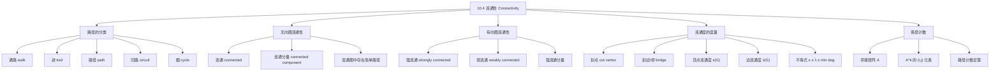

**相关笔记：** [[10.3 图的表示与同构]] | [[10.5 欧拉路径与哈密顿路径]]

> [!abstract] 概览
> 本节系统介绍了图中==路径==的分类、无向图和有向图的==连通性==概念，以及图的==连通度==度量。核心内容包括：路径的分类（通路/迹/路径/回路）；无向图的==连通==与==连通分量==；有向图的==强连通==与==弱连通==；==割点==（cut vertex）与==割边/桥==（bridge）；顶点连通度 $\kappa(G)$ 与边连通度 $\lambda(G)$；以及利用==邻接矩阵的幂== $A^k$ 计算长度为 $k$ 的路径数。
>
> - ==通路（walk）==：顶点和边的交替序列，允许重复顶点和边
> - ==迹（trail）==：不重复边的通路
> - ==路径（path）==：不重复边的通路（Rosen 定义）
> - ==简单路径==：不重复顶点（和边）的通路
> - ==回路/圈（circuit/cycle）==：起点和终点相同的路径
> - ==连通图==：任意两个不同顶点之间都有路径
> - ==强连通==：有向图中任意两顶点之间都有双向路径
> - ==割点/桥==：删除后使连通分量增加的顶点/边
> - $A^k$ 的 $(i,j)$ 元素 = 顶点 $v_i$ 到 $v_j$ 的长度为 $k$ 的路径数

---

## 一、知识结构总览

---

## 二、核心思想

> [!tip] 核心思想
> 本节的核心思想是==通过路径的概念来刻画图的"连通程度"==。连通性是图论中最基本的全局性质之一，决定了信息、资源等能否在图中从一个顶点传递到另一个顶点。连通度的度量（割点、割边、顶点连通度、边连通度）进一步量化了图的"脆弱性"——需要移除多少元素才能使图断开。邻接矩阵的幂则提供了用代数方法计算路径数的强大工具，与[[离散数学/concepts/矩阵|矩阵运算]]和[[离散数学/concepts/传递闭包|传递闭包]]密切相关。

### 1. 路径的分类

> [!def] 路径（Path）与相关概念
> 设 $n$ 是非负整数，$G$ 是无向图。从顶点 $u$ 到顶点 $v$ 的==长度为 $n$ 的路径==是 $G$ 中 $n$ 条边的序列 $e_1, e_2, \ldots, e_n$，使得存在顶点序列 $x_0, x_1, \ldots, x_n$（其中 $x_0 = u$，$x_n = v$），使得对于 $i = 1, \ldots, n$，边 $e_i$ 的端点为 $x_{i-1}$ 和 $x_i$。
>
> 当 $G$ 是简单图时，路径可以用其顶点序列 $x_0, x_1, \ldots, x_n$ 唯一确定。
>
> - ==回路（circuit）==：起点和终点相同的路径（$u = v$），且长度大于 0
> - ==简单（simple）==：路径或回路不包含同一条边超过一次

> [!warning] 术语说明
> 不同教材对路径相关术语的定义可能不同。在 Rosen 的定义中：
> - "path" = 不重复边的通路（允许重复顶点，只要不重复边）
> - "simple path" = 不重复顶点的路径（在简单图中等价于不重复边）
>
> 在其他一些教材中：
> - "walk" = 通路（可重复顶点和边）
> - "trail" = 迹（不重复边）
> - "path" = 路径（不重复顶点）
>
> 阅读不同资料时请注意确认术语定义。

> [!example] 路径的判定
> 在图 $G$ 中（顶点 $a, b, c, d, e, f$，边 $\{a,b\}, \{a,d\}, \{a,e\}, \{b,c\}, \{b,e\}, \{c,f\}, \{d,e\}, \{e,f\}$）：
> - $a, d, c, f, e$：**简单路径**，长度 4。所有相邻顶点对之间都有边，且不重复顶点
> - $b, c, f, e, b$：**回路**，长度 4。起点和终点都是 $b$，且不重复边
> - $a, b, e, d, a, b$：**不是简单路径**（因为边 $\{a, b\}$ 出现了两次），长度 5

> [!def] 有向图中的路径
> 在有向图中，从 $u$ 到 $v$ 的长度为 $n$ 的路径是 $n$ 条有向边的序列 $e_1, e_2, \ldots, e_n$，使得 $e_i$ 从 $x_{i-1}$ 指向 $x_i$（$x_0 = u$，$x_n = v$）。路径的方向必须沿着边的方向。

### 2. 无向图的连通性

> [!def] 连通图（Connected Graph）
> 无向图称为==连通的==，如果其任意两个不同的顶点之间都存在路径。不连通的无向图称为==不连通的==（disconnected）。
>
> ==断开（disconnect）==一个图是指移除顶点或边（或两者），使得产生的子图是不连通的。

> [!thm] 连通图中存在简单路径（Theorem 1）
> 在连通无向图中，任意两个不同的顶点之间存在一条简单路径。
>
> **证明**：设 $u$ 和 $v$ 是连通无向图 $G = (V, E)$ 中两个不同的顶点。因为 $G$ 连通，$u$ 和 $v$ 之间至少存在一条路径。设 $x_0, x_1, \ldots, x_n$（其中 $x_0 = u$，$x_n = v$）是所有路径中长度最短的一条。
>
> 我们证明这条最短路径是简单的。假设不是，则存在 $i < j$ 使得 $x_i = x_j$。那么 $x_0, x_1, \ldots, x_{i-1}, x_j, x_{j+1}, \ldots, x_n$ 是一条从 $u$ 到 $v$ 的更短路径（删除了 $x_i$ 到 $x_{j-1}$ 的部分），与"最短"矛盾。因此，最短路径一定是简单的。
>
> $\blacksquare$

> [!def] 连通分量（Connected Component）
> 图 $G$ 的==连通分量==是 $G$ 的一个连通子图，且不是 $G$ 的任何其他连通子图的真子图（即==极大连通子图==）。
>
> - 不连通的图有两个或更多不相交的连通分量，它们的并集就是整个图
> - 连通图只有一个连通分量（即自身）

> [!example] 连通分量的应用
> - **电话呼叫图的连通分量**：两个电话号码在同一个连通分量中，当且仅当存在一系列电话从一个号码开始到另一个号码结束。AT&T 研究的 20 天通话图有超过 5300 万个顶点、超过 1.7 亿条边和超过 370 万个连通分量。其中最大的连通分量有约 4500 万个顶点（超过 80%），且其中任意两个顶点可以通过不超过 20 次通话的链路相连
> - **相识图的连通分量**：代表"社交圈"——在一个连通分量中的人可以通过熟人链相互认识

### 3. 有向图的连通性

> [!def] 强连通（Strongly Connected）
> 有向图称为==强连通的==，如果对于图中任意两个顶点 $a$ 和 $b$，都存在从 $a$ 到 $b$ 的路径和从 $b$ 到 $a$ 的路径。
>
> 即：沿着边的方向，可以从任何顶点到达任何其他顶点。

> [!def] 弱连通（Weakly Connected）
> 有向图称为==弱连通的==，如果在其==底图==（underlying undirected graph，即忽略所有边的方向后得到的无向图）中，任意两个顶点之间都存在路径。
>
> - 任何强连通的有向图也是弱连通的
> - 但弱连通的有向图不一定是强连通的

> [!example] 强连通与弱连通的判定
> - 图 $G$（顶点 $a, b, c, d, e$，有向边 $a \to b$，$b \to c$，$c \to d$，$d \to a$，$a \to e$，$e \to d$）：**强连通**（任意两顶点之间都有双向路径）
> - 图 $H$（顶点 $a, b, c, d, e$，有向边 $a \to b$，$b \to c$，$c \to a$，$a \to d$，$d \to e$）：**不是强连通**（没有从 $e$ 到 $a$ 的路径），但是**弱连通**（底图中任意两顶点之间有路径）

> [!def] 强连通分量（Strongly Connected Components）
> 有向图的==强连通分量==（或称强分量）是极大的强连通子图。
>
> - 两个顶点的强分量要么相同，要么不相交
> - 有向图是其所有强连通分量的并集

> [!example] Web 图的强连通分量
> Web 图的底图不是连通的，但有一个包含约 90% 顶点的巨大连通分量。该连通分量对应的有向子图有一个非常大的强连通分量（GSCC，包含超过 5300 万个顶点），以及三个各约 4400 万顶点的集合：
> - 可以从 GSCC 到达但不能返回的页面
> - 可以链接到 GSCC 但不能从 GSCC 到达的页面
> - 既不能到达 GSCC 也不能从 GSCC 到达的页面

### 4. 割点与割边

> [!def] 割点（Cut Vertex / Articulation Point）
> 图 $G$ 的一个顶点 $v$ 称为==割点==，如果删除 $v$ 及其所有关联边后，产生的子图比原图有更多的连通分量。
>
> 直觉：割点是"关键的"顶点，它的移除会断开图。

> [!def] 割边/桥（Cut Edge / Bridge）
> 图 $G$ 的一条边 $e$ 称为==割边==（或==桥==），如果删除 $e$ 后，产生的子图比原图有更多的连通分量。

> [!example] 割点与割边的判定
> 在图 $G_1$ 中（顶点 $a, b, c, d, e, f$，边 $\{a,b\}, \{b,c\}, \{c,e\}, \{e,f\}, \{c,d\}, \{b,d\}, \{a,f\}$）：
> - **割点**：$b, c, e$。删除 $b$ 后，$a$ 和 $f$ 与其余顶点断开；删除 $c$ 后，$d$ 被隔离；删除 $e$ 后，$f$ 被隔离
> - **割边**：$\{a, b\}$ 和 $\{c, e\}$

> [!warning] 割边端点的性质
> 割边的一个端点是割点当且仅当该端点不是悬挂点。悬挂点（度为 1 的顶点）是割边的端点，但不是割点（因为删除悬挂点后，与之关联的割边也被删除，剩余图仍然连通）。

### 5. 顶点连通度与边连通度

> [!def] 顶点连通度（Vertex Connectivity）$\kappa(G)$
> 设 $G = (V, E)$ 是非完全的连通图。$G$ 的==顶点连通度== $\kappa(G)$（$\kappa$ 是小写希腊字母 kappa）是使 $G - V'$ 不连通的顶点子集 $V'$ 的最小大小。对于完全图 $K_n$，定义 $\kappa(K_n) = n - 1$。
>
> - $\kappa(G) = 0$：$G$ 不连通或 $G = K_1$
> - $\kappa(G) = 1$：$G$ 连通但有割点
> - $\kappa(G) = n - 1$：$G = K_n$（完全图）
> - $G$ 称为==$k$-连通==的，如果 $\kappa(G) \geq k$

> [!def] 边连通度（Edge Connectivity）$\lambda(G)$
> 图 $G$ 的==边连通度== $\lambda(G)$（$\lambda$ 是小写希腊字母 lambda）是使 $G - E'$ 不连通的边子集 $E'$ 的最小大小。
>
> - $\lambda(G) = 0$：$G$ 不连通或 $G$ 是单顶点图
> - $\lambda(G) = 1$：$G$ 有割边
> - $\lambda(G) = n - 1$：$G = K_n$（当 $G$ 有 $n$ 个顶点时）

> [!thm] 连通度不等式
> 对于任何图 $G$（有 $n$ 个顶点），
>
> $$\kappa(G) \leq \lambda(G) \leq \min_{v \in V} \deg(v)$$
>
> **直觉**：
> - $\lambda(G) \leq \min \deg(v)$：删除一个最小度顶点的所有关联边就足以断开该顶点
> - $\kappa(G) \leq \lambda(G)$：断开图所需的顶点数不超过所需的边数（每条边最多"保护"一个顶点）

> [!example] 连通度的计算
> | 图 | $\kappa(G)$ | $\lambda(G)$ | $\min \deg(v)$ |
> |:--|:----------|:------------|:--------------|
> | $G_1$（有割点和割边） | 1 | 1 | 2 |
> | $G_2$（有割点，无割边） | 1 | 2 | 3 |
> | $G_3$（无割点，有大小为 2 的顶点割） | 2 | 2 | 3 |
> | $G_4$（无割点，有大小为 2 的顶点割） | 2 | 3 | 3 |
> | $G_5$（最小顶点割大小为 3） | 3 | 3 | 4 |

### 6. 路径计数：邻接矩阵的幂

> [!thm] 路径计数定理（Theorem 2）
> 设 $G$ 是一个图（有向或无向，允许多重边和环），其邻接矩阵为 $A$（顶点按 $v_1, v_2, \ldots, v_n$ 排序）。则从 $v_i$ 到 $v_j$ 的==长度为 $r$ 的不同路径数==等于 $A^r$ 的第 $(i, j)$ 个元素。
>
> **证明**：对 $r$ 用数学归纳法。
>
> **基础步**（$r = 1$）：$A$ 的第 $(i, j)$ 个元素 $a_{ij}$ 等于从 $v_i$ 到 $v_j$ 的边数，即长度为 1 的路径数。✅
>
> **归纳假设**：设 $A^r$ 的第 $(i, j)$ 个元素等于从 $v_i$ 到 $v_j$ 的长度为 $r$ 的路径数。
>
> **归纳步**：$A^{r+1} = A^r \cdot A$。$A^{r+1}$ 的第 $(i, j)$ 个元素为：
>
> $$\sum_{k=1}^{n} b_{ik} \cdot a_{kj}$$
>
> 其中 $b_{ik}$ 是 $A^r$ 的第 $(i, k)$ 个元素。由归纳假设，$b_{ik}$ 是从 $v_i$ 到 $v_k$ 的长度为 $r$ 的路径数。$a_{kj}$ 是从 $v_k$ 到 $v_j$ 的边数。
>
> 一条从 $v_i$ 到 $v_j$ 的长度为 $r + 1$ 的路径由一条从 $v_i$ 到某个中间顶点 $v_k$ 的长度为 $r$ 的路径，加上一条从 $v_k$ 到 $v_j$ 的边组成。由乘法规则，经过 $v_k$ 的路径数为 $b_{ik} \cdot a_{kj}$。对所有可能的中间顶点 $v_k$ 求和（加法规则），得到从 $v_i$ 到 $v_j$ 的所有长度为 $r + 1$ 的路径数。
>
> $\blacksquare$

> [!example] 邻接矩阵的幂与路径计数
> 设简单图 $G$ 的顶点为 $a, b, c, d$，边为 $\{a,b\}, \{a,c\}, \{b,d\}, \{c,d\}$。邻接矩阵为（按 $a, b, c, d$ 排序）：
>
> $$A = \begin{pmatrix} 0 & 1 & 1 & 0 \\ 1 & 0 & 0 & 1 \\ 1 & 0 & 0 & 1 \\ 0 & 1 & 1 & 0 \end{pmatrix}$$
>
> 计算 $A^4$：
>
> $$A^4 = \begin{pmatrix} 8 & 0 & 0 & 8 \\ 0 & 8 & 8 & 0 \\ 0 & 8 & 8 & 0 \\ 8 & 0 & 0 & 8 \end{pmatrix}$$
>
> $A^4$ 的第 $(1, 4)$ 个元素为 8，因此从 $a$ 到 $d$ 有 8 条长度为 4 的路径。通过枚举验证：
> $a,b,a,b,d$；$a,b,a,c,d$；$a,b,d,b,d$；$a,b,d,c,d$；$a,c,a,b,d$；$a,c,a,c,d$；$a,c,d,b,d$；$a,c,d,c,d$。

> [!info] 路径计数定理的应用
> - **判断连通性**：$G$ 连通当且仅当对于某个 $r$，$A + A^2 + \cdots + A^r$ 的所有非对角线元素都为正
> - **最短路径长度**：$A^k$ 的第 $(i, j)$ 个元素首次变为正数时的最小 $k$ 就是从 $v_i$ 到 $v_j$ 的最短路径长度
> - **与传递闭包的关系**：$A + A^2 + \cdots + A^{n-1}$（其中 $n$ 为顶点数）的非零元素位置指示了[[离散数学/concepts/传递闭包|传递闭包]]中的关系

---

## 三、补充理解与易混淆点

### 补充理解

> [!info] 补充1：连通性与实际网络
> 连通性在现实网络中有重要的实际意义：
> - **计算机网络**：连通性决定了任意两台计算机之间是否可以通信。割点和割边代表关键路由器和关键链路——它们的故障会导致网络部分断开
> - **公路网络**：顶点连通度表示需要关闭多少个路口才能使某些路口之间无法通行；边连通度表示需要关闭多少条道路
> - **社交网络**：连通分量代表"社交圈"——在一个连通分量中的人可以通过熟人链相互认识。六度分隔理论指出，全球相识图的最大连通分量中，任意两个人之间大约相隔不超过 6 步
> 来源：Rosen, K. H. (2019). *Discrete Mathematics and Its Applications* (8th ed.), McGraw-Hill, Section 10.4.
> 来源：Bondy, J. A. & Murty, U. S. R. (2008). *Graph Theory*. Springer, Chapter 3.

> [!info] 补充2：路径术语对照表
> | Rosen 术语 | 其他常见术语 | 是否可重复边 | 是否可重复顶点 |
> |:-----------|:------------|:----------|:----------|
> | path | walk / 通路 | 可 | 可 |
> | （无对应） | trail / 迹 | 不可 | 可 |
> | simple path | path / 路径 | 不可 | 不可 |
> | circuit | closed walk / 闭通路 | 可 | 可 |
> | simple circuit | cycle / 圈 | 不可 | 不可（起终点除外） |
> 来源：Rosen, K. H. (2019). *Discrete Mathematics and Its Applications* (8th ed.), McGraw-Hill, Section 10.4.
> 来源：Diestel, R. (2017). *Graph Theory* (5th ed.). Springer, Chapter 1.

> [!info] 补充3：连通度与网络可靠性
> 连通度的三个层次提供了网络可靠性的量化度量：
> - $\kappa(G)$：网络中需要同时故障多少个==路由器==才会导致部分断开
> - $\lambda(G)$：网络中需要同时故障多少条==通信链路==才会导致部分断开
> - $\min \deg(v)$：网络中最少连接的路由器的连接数（连通度的上界）
>
> 不等式 $\kappa(G) \leq \lambda(G) \leq \min \deg(v)$ 表明：网络的最薄弱环节要么是某个路由器（顶点连通度），要么是某组链路（边连通度），且两者都不超过最小度。
> 来源：Menger, K. (1927). "Zur allgemeinen Kurventheorie." *Fundamenta Mathematicae*, 10, 96–115.
> 来源：Bondy, J. A. & Murty, U. S. R. (2008). *Graph Theory*. Springer, Theorem 3.3 (Menger's Theorem).

### 易混淆点

> [!warning] 误区：连通 vs 弱连通 vs 强连通
> - ❌ 认为有向图只要"看起来连在一起"就是强连通
> - ✅ 强连通要求**沿着边的方向**可以从任何顶点到达任何其他顶点。弱连通只要求忽略方向后连通
> - ❌ 认为弱连通的有向图一定是强连通的
> - ✅ 强连通 $\Rightarrow$ 弱连通，但弱连通 $\not\Rightarrow$ 强连通

> [!warning] 误区：割点与悬挂点
> - ❌ 认为割边的端点一定是割点
> - ✅ 割边的一个端点是割点**当且仅当**该端点**不是悬挂点**。悬挂点（度为 1）虽然是割边的端点，但删除悬挂点不会增加连通分量（因为与之关联的唯一边也被删除了）
> - 例如：在一条路径 $a\text{---}b\text{---}c$ 中，$\{a,b\}$ 和 $\{b,c\}$ 都是割边，$b$ 是割点，但 $a$ 和 $c$ 不是割点（它们是悬挂点）

> [!warning] 误区：路径长度 vs 路径中的顶点数
> - ❌ 认为路径长度等于路径中的顶点数
> - ✅ 路径长度 = 路径中的**边数** = 顶点数 - 1。例如，路径 $a, b, c, d$ 的长度为 3（3 条边），而非 4

> [!warning] 误区：邻接矩阵的幂与图的连通性
> - ❌ 认为 $A^k$ 的所有元素都为正就说明图连通
> - ✅ 需要检查 $A + A^2 + \cdots + A^{n-1}$（$n$ 为顶点数）的所有非对角线元素是否都为正。单独的 $A^k$ 只计算长度恰好为 $k$ 的路径

---

## 四、习题精选

> [!todo] 习题概览
> | 题号范围 | 核心考点 | 难度 |
> |---------|---------|------|
> | 1-2 | 路径的判定（是否为路径/回路/简单） | ⭐ |
> | 3-6 | 连通性判定与连通分量 | ⭐⭐ |
> | 7-10 | 连通分量的实际含义 | ⭐⭐ |
> | 11-12 | 强连通与弱连通的判定 | ⭐⭐ |
> | 13-15 | 强连通分量的求解 | ⭐⭐⭐ |
> | 19-24 | 利用路径判断同构 | ⭐⭐⭐ |
> | 26-27 | 路径计数（邻接矩阵的幂） | ⭐⭐⭐ |
> | 31-34 | 割点与割边的求解 | ⭐⭐ |
> | 35-38 | 割点与割边的性质证明 | ⭐⭐⭐⭐ |
> | 50-55 | 连通度 $\kappa(G)$ 和 $\lambda(G)$ 的计算与性质 | ⭐⭐⭐⭐ |

### 题1：路径的判定

> [!problem] 题目
> 在图 $G$ 中（顶点 $a, b, c, d, e$，边 $\{a,b\}, \{a,e\}, \{b,c\}, \{b,e\}, \{c,d\}, \{d,e\}$），判断以下顶点序列是否构成路径，是否是简单路径，是否是回路，以及路径长度：
>
> a) $a, e, b, c, b$
> b) $a, e, a, d, b, c, a$

> [!faq]- 解答
> a) $a, e, b, c, b$：
> - $\{a, e\}$ 是边 ✅，$\{e, b\}$ 是边 ✅，$\{b, c\}$ 是边 ✅，$\{c, b\}$ 是边 ✅
> - **是路径**，长度为 4
> - **不是简单路径**（边 $\{b, c\}$ 出现了两次：$b \to c$ 和 $c \to b$）
> - **不是回路**（起点 $a \neq$ 终点 $b$）
>
> b) $a, e, a, d, b, c, a$：
> - $\{a, e\}$ ✅，$\{e, a\}$ ✅（与 $\{a, e\}$ 是同一条边），$\{a, d\}$ ✅，$\{d, b\}$ ❌（$\{d, b\}$ 不是边！）
> - **不是路径**（$d$ 和 $b$ 之间没有边）

### 题2：连通分量

> [!problem] 题目
> 求以下图的连通分量：
>
> 顶点：$a, b, c, d, e, f, g, h$
> 边：$\{a, b\}, \{a, c\}, \{b, c\}, \{d, e\}, \{e, f\}, \{f, g\}, \{g, h\}, \{h, d\}$

> [!faq]- 解答
> 该图有两个连通分量：
>
> 1. 分量 1：顶点 $\{a, b, c\}$，边 $\{a, b\}, \{a, c\}, \{b, c\}$（三角形）
> 2. 分量 2：顶点 $\{d, e, f, g, h\}$，边 $\{d, e\}, \{e, f\}, \{f, g\}, \{g, h\}, \{h, d\}$（五边形）
>
> 注意：分量 1 和分量 2 之间没有路径相连。
>
> $\blacksquare$

### 题3：强连通分量的求解

> [!problem] 题目
> 求以下有向图的强连通分量：
>
> 顶点：$a, b, c, d, e$
> 有向边：$a \to b$，$b \to c$，$c \to d$，$d \to b$，$a \to e$

> [!faq]- 解答
> 逐一分析：
> - 顶点 $a$：可以到达 $b, c, d, e$，但从 $b, c, d, e$ 无法回到 $a$。所以 $a$ 自成一个强连通分量 $\{a\}$
> - 顶点 $e$：从 $a$ 可以到达 $e$，但从 $e$ 无法到达任何其他顶点。所以 $e$ 自成一个强连通分量 $\{e\}$
> - 顶点 $b, c, d$：$b \to c \to d \to b$ 形成一个有向圈，任意两顶点之间都有双向路径。所以 $\{b, c, d\}$ 构成一个强连通分量
>
> 因此，强连通分量为：$\{a\}$，$\{e\}$，$\{b, c, d\}$。
>
> $\blacksquare$

### 题4：路径计数

> [!problem] 题目
> 求完全图 $K_4$ 中任意两个不同顶点之间的长度为 2 的路径数和长度为 3 的路径数。

> [!faq]- 解答
> $K_4$ 的邻接矩阵为（4 个顶点，每对之间有边）：
>
> $$A = \begin{pmatrix} 0 & 1 & 1 & 1 \\ 1 & 0 & 1 & 1 \\ 1 & 1 & 0 & 1 \\ 1 & 1 & 1 & 0 \end{pmatrix}$$
>
> 计算 $A^2$：
>
> $$A^2 = \begin{pmatrix} 3 & 2 & 2 & 2 \\ 2 & 3 & 2 & 2 \\ 2 & 2 & 3 & 2 \\ 2 & 2 & 2 & 3 \end{pmatrix}$$
>
> - 对角线元素为 3：每个顶点到自身的长度为 2 的路径有 3 条（经过另外 3 个顶点中的任意一个再返回）
> - 非对角线元素为 2：任意两个不同顶点之间的长度为 2 的路径有 2 条（经过另外 2 个中间顶点中的任意一个）
>
> 计算 $A^3$：
>
> $$A^3 = A^2 \cdot A = \begin{pmatrix} 6 & 5 & 5 & 5 \\ 5 & 6 & 5 & 5 \\ 5 & 5 & 6 & 5 \\ 5 & 5 & 5 & 6 \end{pmatrix}$$
>
> - 对角线元素为 6：每个顶点到自身的长度为 3 的路径有 6 条
> - 非对角线元素为 5：任意两个不同顶点之间的长度为 3 的路径有 5 条
>
> $\blacksquare$

### 题5：割点与割边的判定

> [!problem] 题目
> 求以下图的割点和割边：
>
> 顶点：$a, b, c, d, e, f, g$
> 边：$\{a, b\}, \{b, c\}, \{c, d\}, \{d, e\}, \{e, f\}, \{f, g\}, \{g, a\}, \{a, d\}$

> [!faq]- 解答
> 该图是一个"房子"形状：底边为 $a\text{---}d$，两侧为 $a\text{---}b\text{---}c\text{---}d$ 和 $a\text{---}g\text{---}f\text{---}e\text{---}d$。
>
> **割点**：$a$ 和 $d$。
> - 删除 $a$ 后，$b$ 和 $g$ 被隔离（与 $c, d, e, f$ 断开）
> - 删除 $d$ 后，$c$ 和 $e$ 被隔离
> - 其他顶点（$b, c, e, f, g$）不是割点
>
> **割边**：$\{a, b\}$，$\{a, g\}$，$\{c, d\}$，$\{d, e\}$。
> - 删除 $\{a, b\}$ 后，$b$ 被隔离
> - 删除 $\{a, g\}$ 后，$g$ 被隔离
> - 删除 $\{c, d\}$ 后，$c$ 被隔离（通过 $b$）
> - 删除 $\{d, e\}$ 后，$e$ 被隔离（通过 $f, g$）
> - 注意：$\{a, d\}$ 不是割边（删除后图仍然通过 $a\text{---}b\text{---}c\text{---}d$ 和 $a\text{---}g\text{---}f\text{---}e\text{---}d$ 连通）
>
> $\blacksquare$

> [!tip] 解题思路提示
> 1. **路径判定**：逐一检查相邻顶点对之间是否有边；检查是否有重复边（判断是否简单）；检查起终点是否相同（判断是否为回路）
> 2. **连通分量**：从任意顶点出发，通过 BFS/DFS 找到所有可达顶点，构成一个连通分量；对剩余顶点重复此过程
> 3. **强连通分量**：在有向图中，找到可以通过双向路径相互到达的最大顶点集
> 4. **割点判定**：尝试删除每个顶点，检查连通分量数是否增加。更高效的算法有 Tarjan 算法
> 5. **割边判定**：尝试删除每条边，检查连通分量数是否增加。割边等价于"不属于任何简单回路的边"
> 6. **路径计数**：计算邻接矩阵的幂 $A^k$，第 $(i, j)$ 个元素即为路径数

---

## 五、视频学习指南

> [!info] 视频资源
> | 资源 | 链接 | 对应内容 | 备注 |
> |:-----|:-----|:---------|:-----|
> | Rosen 8e Section 10.4 | [教材原文](https://www.mheducation.com/highered/product/discrete-mathematics-applications-rosen/M9781259676512.html) | 完整定义、定理与例题 | 英文教材 |
> | MIT 6.042J Lecture 5 | [链接](https://www.youtube.com/watch?v=k1QMq7vB9Y8) | 连通性与路径 | 英文，MIT开放课程 |
> | TrevTutor - Connectivity | [链接](https://www.youtube.com/watch?v=2kRE6a3F_p8) | 连通性、割点与割边 | 英文，适合入门 |

---

## 六、教材原文

> [!quote] 教材原文
> "A path of length $n$ from $u$ to $v$ in $G$ is a sequence of $n$ edges $e_1, e_2, \ldots, e_n$ of $G$ such that there exists a sequence $x_0, x_1, \ldots, x_n$ of vertices with $x_0 = u$ and $x_n = v$, and for $i = 1, \ldots, n$, $e_i$ has endpoints $x_{i-1}$ and $x_i$."
>
> "An undirected graph is called connected if there is a path between every pair of distinct vertices of the graph."
>
> "A directed graph is strongly connected if there is a path from $a$ to $b$ and from $b$ to $a$ whenever $a$ and $b$ are vertices in the graph."
>
> "Let $G$ be a graph with adjacency matrix $A$ with respect to the ordering $v_1, v_2, \ldots, v_n$. The number of different paths of length $r$ from $v_i$ to $v_j$ equals the $(i,j)$th entry of $A^r$."

---

## 参见 Wiki

- [[离散数学/concepts/矩阵]] -- 邻接矩阵的定义与运算（路径计数的基础）
- [[离散数学/concepts/传递闭包]] -- 传递闭包与路径计数的关系（第9章）
- [[离散数学/concepts/有向图]] -- 有向图的强连通与弱连通

#学习/离散数学/图论
