**相关笔记：** [[10.4 连通性]] | [[10.6 最短路径问题]]

> [!abstract] 概览
> 本节研究两类重要的路径问题：==欧拉路径/回路==和==哈密顿路径/回路==。欧拉路径/回路要求经过图的每条边恰好一次，存在简单的==充分必要条件==（基于顶点度的奇偶性）。哈密顿路径/回路要求经过每个顶点恰好一次，但==没有简单的充分必要条件==，只有若干充分条件（如==Dirac 定理==和==Ore 定理==）。哈密顿回路问题是==NP 完全==的，而欧拉回路问题可以在==多项式时间==内解决。
>
> - ==欧拉回路==：经过每条边恰好一次的简单回路，连通多重图有欧拉回路 $\iff$ 所有顶点度数均为偶数
> - ==欧拉路径==：经过每条边恰好一次的简单路径，连通多重图有欧拉路径但无欧拉回路 $\iff$ 恰有 2 个奇度顶点
> - ==哈密顿回路==：经过每个顶点恰好一次的简单回路
> - ==哈密顿路径==：经过每个顶点恰好一次的简单路径
> - ==Dirac 定理==：$n \geq 3$ 的简单图中，若每个顶点度数 $\geq n/2$，则有哈密顿回路
> - ==Ore 定理==：$n \geq 3$ 的简单图中，若每对非邻接顶点的度数之和 $\geq n$，则有哈密顿回路
> - ==旅行商问题 (TSP)==：在完全加权图中找总权重最小的哈密顿回路，NP 困难

---

## 一、知识结构总览

```mermaid
graph TB
    A["10.5 欧拉路径与哈密顿路径 Euler and Hamilton Paths"] --> B["欧拉路径与回路"]
    A --> C["哈密顿路径与回路"]

    B --> B1["哥尼斯堡七桥问题"]
    B --> B2["欧拉回路定义与判定"]
    B --> B3["欧拉路径定义与判定"]
    B --> B4["欧拉回路构造算法"]
    B --> B5["Fleury 算法"]
    B --> B6["应用"]

    B2 --> B2a["定理1：连通+全偶度 ⟺ 欧拉回路"]
    B2 --> B2b["必要性证明：度数分析"]
    B2 --> B2c["充分性证明：构造法"]

    B3 --> B3a["定理2：连通+恰2奇度 ⟺ 欧拉路径"]
    B3 --> B3b["欧拉路径的端点是两个奇度顶点"]

    B4 --> B4a["Algorithm 1：拼接回路法"]
    B4 --> B4b["时间复杂度 O(m)"]

    B5 --> B5a["避免走桥的贪心策略"]

    B6 --> B6a["中国邮递员问题"]
    B6 --> B6b["DNA 测序"]
    B6 --> B6c["电路布局"]

    C --> C1["哈密顿回路定义"]
    C --> C2["哈密顿路径定义"]
    C --> C3["存在性判定"]
    C --> C4["充分条件"]
    C --> C5["NP 完全性"]
    C --> C6["应用"]

    C3 --> C3a["无简单充要条件"]
    C3 --> C3b["必要条件：度≥1, 度=2的顶点强制选边"]

    C4 --> C4a["Dirac 定理：deg(v) ≥ n/2"]
    C4 --> C4b["Ore 定理：deg(u)+deg(v) ≥ n"]
    C4 --> C4c["Dirac 是 Ore 的推论"]

    C5 --> C5a["NP 完全问题"]
    C5 --> C5b["指数级最坏时间"]

    C6 --> C6a["旅行商问题 TSP"]
    C6 --> C6b["Gray 码"]
```

---

## 二、核心思想

> [!tip] 核心思想
> 本节的核心思想是对比两类看似相似但难度截然不同的路径问题。==欧拉路径/回路==关注"遍历每条边"，其存在性可以通过==顶点度数的奇偶性==完全判定，且存在高效的构造算法。==哈密顿路径/回路==关注"遍历每个顶点"，其判定是==NP 完全==的，没有已知的多项式时间算法，也没有简单的充分必要条件。这种难度的巨大差异是图论中一个深刻的现象。

### 1. 哥尼斯堡七桥问题

> [!info] 历史背景
> 1736 年，瑞士数学家==欧拉 (Euler)== 解决了著名的==哥尼斯堡七桥问题==。普鲁士的哥尼斯堡城被普雷格尔河分为四个区域，由七座桥连接。市民们好奇：能否从某处出发，走过每座桥恰好一次，然后回到出发点？
>
> 欧拉将四个区域表示为顶点，七座桥表示为边，得到一个多重图。问题转化为：这个多重图是否有欧拉回路？由于该图有 4 个奇度顶点，答案是否定的。这篇论文被认为是==图论的诞生==。

### 2. 欧拉回路

> [!def] 欧拉回路与欧拉路径（Euler Circuit and Euler Path）
> 设 $G$ 是图。
> - $G$ 的==欧拉回路==是包含 $G$ 中每条边恰好一次的==简单回路==
> - $G$ 的==欧拉路径==是包含 $G$ 中每条边恰好一次的==简单路径==

> [!thm] 定理1：欧拉回路的充要条件
> 一个至少有两个顶点的==连通多重图==有欧拉回路，当且仅当它的每个顶点的度数都是==偶数==。
>
> **证明**：
>
> **必要性（$\Rightarrow$）**：设连通多重图 $G$ 有欧拉回路。欧拉回路从某个顶点 $a$ 出发，沿边 $\{a, b\}$ 开始。这条边对 $\deg(a)$ 贡献 1。此后，每次回路经过一个顶点时，它通过一条边进入、通过另一条边离开，对顶点度数贡献 2。最后，回路终止于起点 $a$，对 $\deg(a)$ 再贡献 1。因此 $\deg(a)$ 是偶数（$1 + 1 + \text{若干个 } 2$）。对于 $a$ 以外的任何顶点，回路每次经过都贡献 2，所以度数也是偶数。
>
> **充分性（$\Leftarrow$）**：设 $G$ 是连通多重图，每个顶点度数为偶数。我们从任意顶点 $a$ 开始，逐步构造一条简单路径：
> 1. 从 $a$ 出发，选择一条边 $\{a, x_1\}$（因为 $G$ 连通，这总是可能的）
> 2. 不断添加边，形成路径 $\{a, x_1\}, \{x_1, x_2\}, \ldots, \{x_{n-1}, x_n\}$
> 3. 当到达某个顶点，其所有关联边都已被使用时，路径终止
>
> 由于 $G$ 只有有限条边，路径必然终止。我们证明路径终止于 $a$：每次经过偶度顶点时，使用一条边进入，还剩奇数条边可用，至少有一条可以离开。因此路径只能在 $a$ 处终止（因为 $a$ 是唯一一个被使用了奇数次边的顶点——开始时用了一条，之后每次经过用两条）。
>
> 如果所有边都已使用，则已构造出欧拉回路。否则，从 $G$ 中删除已使用的边和孤立顶点，得到子图 $H$。因为 $G$ 连通，$H$ 与已删除的回路至少有一个公共顶点 $w$。$H$ 中每个顶点度数仍为偶数（因为每次删除回路时，每个顶点失去偶数条边）。从 $w$ 开始在 $H$ 中构造回路，然后将其拼接到原回路中。重复此过程直到所有边都被使用。
>
> $\blacksquare$

> [!example] 欧拉回路的判定
> - $G_1$：所有顶点度数为偶数 $\Rightarrow$ 有欧拉回路，例如 $a, e, c, d, e, b, a$
> - $G_2$：有奇度顶点 $\Rightarrow$ 无欧拉回路，但有欧拉路径 $a, c, d, e, b, d, a, b$
> - $G_3$：有超过 2 个奇度顶点 $\Rightarrow$ 无欧拉路径也无欧拉回路

### 3. 欧拉路径

> [!thm] 定理2：欧拉路径的充要条件
> 一个==连通多重图==有欧拉路径但无欧拉回路，当且仅当它恰好有==两个奇度顶点==。
>
> **证明**：
>
> **必要性**：设 $G$ 有从 $a$ 到 $b$ 的欧拉路径（$a \neq b$）。路径的第一条边对 $\deg(a)$ 贡献 1，之后每次经过 $a$ 贡献 2，最后一条边不对 $a$ 贡献（因为路径终止于 $b$）。所以 $\deg(a)$ 是奇数。同理 $\deg(b)$ 是奇数。其他每个顶点每次被经过贡献 2，所以度数为偶数。
>
> **充分性**：设 $G$ 恰有两个奇度顶点 $a$ 和 $b$。添加边 $\{a, b\}$ 得到图 $G'$。$G'$ 中所有顶点度数为偶数，由定理 1，$G'$ 有欧拉回路。删除添加的边 $\{a, b\}$，得到 $G$ 中从 $a$ 到 $b$ 的欧拉路径。
>
> $\blacksquare$

> [!example] 欧拉路径的判定
> - $G_1$：恰有 2 个奇度顶点 $b$ 和 $d$ $\Rightarrow$ 有欧拉路径，端点为 $b$ 和 $d$，例如 $d, a, b, c, d, b$
> - $G_2$：恰有 2 个奇度顶点 $b$ 和 $d$ $\Rightarrow$ 有欧拉路径，端点为 $b$ 和 $d$
> - $G_3$：有 6 个奇度顶点 $\Rightarrow$ 无欧拉路径

### 4. 欧拉回路的构造算法

> [!def] 欧拉回路构造算法（Algorithm 1）
> **输入**：所有顶点度数为偶数的连通多重图 $G$
>
> **步骤**：
> 1. 从任意顶点开始，贪心地选择边构造一条回路（回到起点）
> 2. 删除已使用的边和孤立顶点，得到子图 $H$
> 3. 若 $H$ 中仍有边，找到 $H$ 与已构造回路的公共顶点 $w$，从 $w$ 开始在 $H$ 中构造回路
> 4. 将 $H$ 中的回路拼接到原回路中（在顶点 $w$ 处拼接）
> 5. 重复步骤 2-4 直到所有边都被使用
>
> **时间复杂度**：$O(m)$，其中 $m$ 是图的边数

> [!def] Fleury 算法
> Fleury 算法是另一种构造欧拉回路的算法，其核心思想是：在每一步选择边时，==不要走"桥"==（除非没有其他选择）。所谓桥，是删除后会使图变得不连通的边。
>
> - 如果当前边不是桥，可以安全地选择它
> - 如果当前边是桥，只有当它是唯一的可选边时才选择它
> - 这种策略确保算法不会"走入死胡同"

> [!example] 一笔画问题
> "能否一笔画完" Mohammed's scimitars 图形（不抬笔、不重复）？
>
> 该图所有顶点度数为偶数，所以有欧拉回路。使用 Algorithm 1：
> 1. 先构造回路 $a, b, d, c, b, e, i, f, e, a$
> 2. 剩余子图中构造回路 $d, g, h, j, i, h, k, g, f, d$
> 3. 在顶点 $d$ 处拼接，得到欧拉回路 $a, b, d, g, h, j, i, h, k, g, f, d, c, b, e, i, f, e, a$

### 5. 哈密顿路径与回路

> [!def] 哈密顿路径与哈密顿回路（Hamilton Path and Hamilton Circuit）
> 设 $G = (V, E)$ 是图。
> - $G$ 的==哈密顿路径==是经过 $G$ 中每个顶点==恰好一次==的简单路径
> - $G$ 的==哈密顿回路==是经过 $G$ 中每个顶点==恰好一次==的简单回路
>
> 即，简单路径 $x_0, x_1, \ldots, x_{n-1}, x_n$（其中 $V = \{x_0, x_1, \ldots, x_n\}$，且对所有 $0 \leq i < j \leq n$ 有 $x_i \neq x_j$）是哈密顿路径。若还有 $n > 0$ 且 $\{x_0, x_n\} \in E$（即首尾相连），则是哈密顿回路。

> [!info] 历史背景
> "哈密顿"这一术语来源于爱尔兰数学家 Sir William Rowan Hamilton 在 1857 年发明的==Icosian 游戏==。游戏在一个正十二面体上进行，20 个顶点标记为世界各地的城市，目标是从一个城市出发，沿边访问每个城市恰好一次，然后回到起点。

> [!example] 哈密顿回路的判定
> - $G_1$（五边形）：有哈密顿回路 $a, b, c, d, e, a$
> - $G_2$（两个三角形共享一条边）：无哈密顿回路（因为包含所有顶点的回路必须经过边 $\{a, b\}$ 两次），但有哈密顿路径 $a, b, c, d$
> - $G_3$（两个三角形通过一条边连接）：既无哈密顿回路也无哈密顿路径（因为包含所有顶点的路径必须经过 $\{a, b\}$、$\{e, f\}$ 或 $\{c, d\}$ 中的某条边两次）

### 6. 哈密顿回路的存在性条件

> [!warning] 哈密顿回路没有简单的充要条件
> 与欧拉回路不同，哈密顿回路==没有已知简单的充分必要判定条件==。但有以下有用的必要条件和充分条件：
>
> **必要条件（用于证明无哈密顿回路）**：
> - 度为 1 的顶点 $\Rightarrow$ 无哈密顿回路（回路中每个顶点恰好关联 2 条边）
> - 度为 2 的顶点 $\Rightarrow$ 两条关联边都必须在哈密顿回路中
> - 哈密顿回路不能包含更小的回路
> - 经过某顶点后，该顶点剩余的边（除回路中的 2 条外）可以忽略

> [!example] 证明无哈密顿回路
> - $G$：有一个度 1 的顶点 $e$，所以无哈密顿回路
> - $H$：顶点 $a, b, d, e$ 的度都是 2，所以它们的 4 条关联边都必须在哈密顿回路中。但这样 $c$ 就需要关联 4 条回路边，不可能（每个顶点在回路中只能关联 2 条边）

> [!thm] 定理3：Dirac 定理（1952）
> 若 $G$ 是 $n$ 个顶点（$n \geq 3$）的简单图，且 $G$ 中每个顶点的度数至少为 $n/2$，则 $G$ 有哈密顿回路。

> [!thm] 定理4：Ore 定理（1960）
> 若 $G$ 是 $n$ 个顶点（$n \geq 3$）的简单图，且对 $G$ 中每对==非邻接==顶点 $u$ 和 $v$，都有 $\deg(u) + \deg(v) \geq n$，则 $G$ 有哈密顿回路。
>
> - Dirac 定理是 Ore 定理的==推论==：若每个顶点度数 $\geq n/2$，则对任意非邻接顶点 $u, v$，$\deg(u) + \deg(v) \geq n/2 + n/2 = n$
> - 这两个定理都是==充分条件==，不是必要条件。例如 $C_5$ 有哈密顿回路，但不满足 Dirac 或 Ore 的条件（$C_5$ 中每个顶点度数为 2，而 $n/2 = 2.5$）

### 7. 哈密顿回路的计算复杂度

> [!warning] 哈密顿回路问题是 NP 完全的
> - 寻找哈密顿回路或判定其不存在的最好已知算法具有==指数级最坏时间复杂度==
> - 该问题已被证明是==NP 完全==的（参见 3.3 节）
> - 如果能找到多项式时间的算法，将意味着 P = NP，解决计算机科学中最重要的开放问题之一

### 8. 应用

> [!info] 旅行商问题（Traveling Salesperson Problem, TSP）
> ==旅行商问题==要求在完全加权图中找到总权重最小的哈密顿回路。即：给定一组城市和每对城市之间的距离，找到一条经过每个城市恰好一次并回到起点的最短路线。
>
> - TSP 是 NP 困难的（比 NP 完全更强，因为它是优化问题）
> - 将在 10.6 节进一步讨论

> [!info] Gray 码
> ==Gray 码==是一种二进制编码方案，使得相邻的码字恰好有一位不同。Gray 码可以用 $n$-立方体 $Q_n$ 中的==哈密顿回路==来构造。
>
> 例如，$Q_3$ 的一个哈密顿回路产生的 Gray 码序列为：
> $$000, 001, 011, 010, 110, 111, 101, 100$$
>
> Gray 码广泛应用于数字通信和旋转编码器中，以最小化由于位置读取误差导致的错误。

> [!info] 中国邮递员问题
> ==中国邮递员问题==（1962 年由管梅古提出）：在图中找到一条经过每条边至少一次且总长度最短的回路。如果图有欧拉回路，则欧拉回路就是最优解；否则，需要重复某些边使得所有顶点度数变为偶数。

---

## 三、补充理解与易混淆点

### 补充理解

> [!info] 补充1：欧拉 vs 哈密顿的核心区别
> | 性质 | 欧拉路径/回路 | 哈密顿路径/回路 |
> |:-----|:-------------|:---------------|
> | 遍历对象 | 每条边恰好一次 | 每个顶点恰好一次 |
> | 判定难度 | 多项式时间（简单） | NP 完全（困难） |
> | 充要条件 | 有（度数奇偶性） | 无简单充要条件 |
> | 充分条件 | 不需要（已有充要条件） | Dirac、Ore 等定理 |
> | 历史起源 | 哥尼斯堡七桥 (1736) | Icosian 游戏 (1857) |
> 来源：Rosen, K. H. (2019). *Discrete Mathematics and Its Applications* (8th ed.), McGraw-Hill, Section 10.5.
> 来源：Bondy, J. A. & Murty, U. S. R. (2008). *Graph Theory*. Springer, Chapter 10.

> [!info] 补充2：为什么哈密顿问题比欧拉问题难？
> 直觉上，欧拉问题只关心"边的遍历"，而边数是有限的，可以通过度数的局部性质（奇偶性）来判定。哈密顿问题关心"顶点的遍历顺序"，这是一个全局性的组合问题——需要考虑所有可能的顶点排列（$n!$ 种），无法通过局部性质完全判定。这种从"边"到"顶点"的转变导致了计算复杂度的巨大跳跃。
> 来源：Garey, M. R. & Johnson, D. S. (1979). *Computers and Intractability: A Guide to the Theory of NP-Completeness*. W. H. Freeman, Problem GT39.
> 来源：Rosen, K. H. (2019). *Discrete Mathematics and Its Applications* (8th ed.), McGraw-Hill, Section 10.5.

> [!info] 补充3：欧拉回路与[[离散数学/concepts/算法复杂度]]
> - 欧拉回路判定：$O(|V| + |E|)$（只需检查每个顶点的度数）
> - 欧拉回路构造：$O(|E|)$（Algorithm 1）
> - 哈密顿回路判定：NP 完全，无已知多项式算法
> - 旅行商问题（最优哈密顿回路）：NP 困难
> 来源：Hierholzer, C. & Wiener, C. (1873). "Über die Möglichkeit, einen Linienzug ohne Wiederholung und ohne Unterbrechung zu umfahren." *Mathematische Annalen*, 6, 30–32.
> 来源：Cormen, T. H., et al. (2009). *Introduction to Algorithms* (3rd ed.), MIT Press, Problem 22-2.

### 易混淆点

> [!warning] 误区：有欧拉回路 ⇒ 有哈密顿回路
> - ❌ 认为能遍历所有边就能遍历所有顶点
> - ✅ 欧拉回路和哈密顿回路是两个独立的概念。例如，两个三角形共享一个顶点的图有欧拉回路（所有度数为偶数），但没有哈密顿回路（因为需要经过共享顶点两次才能遍历所有边）

> [!warning] 误区：无欧拉回路 ⇒ 无哈密顿回路
> - ❌ 认为不能遍历所有边就不能遍历所有顶点
> - ✅ $K_n$（$n \geq 3$）有哈密顿回路但没有欧拉回路（当 $n$ 为奇数时，所有顶点度数为 $n-1$，是偶数，此时有欧拉回路；当 $n$ 为偶数时，所有顶点度数为奇数，无欧拉回路但有哈密顿回路）

> [!warning] 误区：Dirac 定理是充要条件
> - ❌ 认为度数 $\geq n/2$ 是有哈密顿回路的充要条件
> - ✅ Dirac 定理和 Ore 定理都是==充分条件==，不是必要条件。$C_5$（5 个顶点的回路）每个顶点度数为 2，不满足 $\geq n/2 = 2.5$，但显然有哈密顿回路

> [!warning] 误区：欧拉路径的端点可以是任意顶点
> - ❌ 认为欧拉路径可以从任意顶点开始和结束
> - ✅ 欧拉路径的端点==必须是两个奇度顶点==。如果图有欧拉路径但无欧拉回路，则恰好有两个奇度顶点，路径必须从一个奇度顶点开始，到另一个奇度顶点结束

---

## 四、习题精选

> [!todo] 习题概览
> | 题号范围 | 核心考点 | 难度 |
> |---------|---------|------|
> | 1-4 | 判断欧拉回路/路径的存在 | ⭐ |
> | 5-12 | 构造欧拉回路/路径 | ⭐⭐ |
> | 13-15 | 有向图的欧拉回路/路径 | ⭐⭐ |
> | 16-17 | 有向图欧拉回路/路径的充要条件 | ⭐⭐⭐ |
> | 19-24 | 判断哈密顿回路/路径的存在 | ⭐⭐ |
> | 25-30 | 哈密顿回路的充分条件 | ⭐⭐⭐ |
> | 31-40 | 应用题（TSP、Gray 码等） | ⭐⭐⭐ |
> | 41-50 | Fleury 算法与证明 | ⭐⭐⭐ |
> | 51-57 | 二部图与哈密顿回路 | ⭐⭐⭐⭐ |
> | 61-65 | 骑士巡游与 Ore 定理证明 | ⭐⭐⭐⭐ |

### 题1：判断欧拉回路与路径

> [!problem] 题目
> 判断以下图是否有欧拉回路。如果没有，判断是否有欧拉路径。
> - $G_1$：顶点 $a, b, c, d, e$，边为 $\{a,b\}$，$\{a,e\}$，$\{b,c\}$，$\{b,e\}$，$\{c,d\}$，$\{d,e\}$，$\{e,b\}$（注意 $b$ 和 $e$ 之间有两条边）
> - $G_2$：顶点 $a, b, c, d$，边为 $\{a,b\}$，$\{a,c\}$，$\{a,d\}$，$\{b,c\}$，$\{c,d\}$

> [!faq]- 解答
> **$G_1$**：计算各顶点度数：$\deg(a) = 2$，$\deg(b) = 3$（边 $\{a,b\}$，$\{b,c\}$，$\{b,e\}$ 两条），$\deg(c) = 2$，$\deg(d) = 2$，$\deg(e) = 3$（边 $\{a,e\}$，$\{d,e\}$，$\{b,e\}$ 两条）。
>
> 恰有 2 个奇度顶点（$b$ 和 $e$），所以无欧拉回路，但有欧拉路径。端点为 $b$ 和 $e$。
>
> **$G_2$**：$\deg(a) = 3$，$\deg(b) = 2$，$\deg(c) = 3$，$\deg(d) = 2$。
>
> 恰有 2 个奇度顶点（$a$ 和 $c$），所以无欧拉回路，但有欧拉路径。端点为 $a$ 和 $c$。例如 $a, b, c, d, a, c$。
>
> $\blacksquare$

### 题2：构造欧拉回路

> [!problem] 题目
> 图 $G$ 的顶点为 $a, b, c, d, e$，边为 $\{a,b\}$，$\{a,e\}$，$\{b,c\}$，$\{b,e\}$，$\{c,d\}$，$\{c,e\}$，$\{d,e\}$。判断是否有欧拉回路，若有则构造一条。

> [!faq]- 解答
> 计算度数：$\deg(a) = 2$，$\deg(b) = 3$，$\deg(c) = 3$，$\deg(d) = 2$，$\deg(e) = 4$。
>
> 有 2 个奇度顶点（$b$ 和 $c$），所以无欧拉回路，但有欧拉路径。
>
> 欧拉路径从 $b$ 到 $c$：$b, a, e, d, c, e, b, c$。
>
> 验证：经过的边为 $\{b,a\}$，$\{a,e\}$，$\{e,d\}$，$\{d,c\}$，$\{c,e\}$，$\{e,b\}$，$\{b,c\}$，共 7 条边，恰好是所有边。✅
>
> $\blacksquare$

### 题3：判断哈密顿回路

> [!problem] 题目
> 判断完全图 $K_n$（$n \geq 3$）是否有哈密顿回路。

> [!faq]- 解答
> $K_n$ 中每对顶点之间都有边。从任意顶点开始，可以按任意顺序访问其余 $n-1$ 个顶点，然后回到起点。因为任意两个顶点之间都有边，所以最后一步（从最后一个顶点回到起点）也一定存在。
>
> 因此 $K_n$（$n \geq 3$）总有哈密顿回路。
>
> $\blacksquare$

### 题4：利用充分条件判断哈密顿回路

> [!problem] 题目
> 设 $G$ 是 7 个顶点的简单图，每个顶点的度数至少为 4。判断 $G$ 是否有哈密顿回路。

> [!faq]- 解答
> $n = 7$，$n/2 = 3.5$。每个顶点度数 $\geq 4 > 3.5$。
>
> 由 Dirac 定理，$G$ 有哈密顿回路。
>
> $\blacksquare$

### 题5：利用 Ore 定理判断哈密顿回路

> [!problem] 题目
> 设 $G$ 是 6 个顶点的简单图。已知 $G$ 中每对非邻接顶点的度数之和至少为 6。判断 $G$ 是否有哈密顿回路。

> [!faq]- 解答
> $n = 6$，对每对非邻接顶点 $u, v$，$\deg(u) + \deg(v) \geq 6 = n$。
>
> 由 Ore 定理，$G$ 有哈密顿回路。
>
> 注意：Ore 定理的条件比 Dirac 定理弱。例如，一个顶点度数为 2、另一个顶点度数为 4 的非邻接顶点对满足 Ore 的条件（$2 + 4 = 6 \geq 6$），但不满足 Dirac 的条件（$2 < 3$）。
>
> $\blacksquare$

> [!tip] 解题思路提示
> 欧拉与哈密顿路径的解题方法论：
> 1. **欧拉回路判定**：检查所有顶点度数是否全为偶数
> 2. **欧拉路径判定**：检查是否恰有 2 个奇度顶点
> 3. **欧拉回路构造**：使用 Algorithm 1（贪心构造 + 拼接）
> 4. **哈密顿回路否定**：找度 1 顶点、度 2 顶点强制选边、检查是否产生矛盾
> 5. **哈密顿回路肯定**：使用 Dirac 或 Ore 定理（充分条件）
> 6. **旅行商问题**：在完全加权图中找最短哈密顿回路

---

## 五、视频学习指南

> [!info] 视频资源
> | 资源 | 链接 | 对应内容 | 备注 |
> |:-----|:-----|:---------|:-----|
> | Rosen 8e Section 10.5 | [教材原文](https://www.mheducation.com/highered/product/discrete-mathematics-applications-rosen/M9781259676512.html) | 完整定义、定理与例题 | 英文教材 |
> | Numberphile - Euler | [链接](https://www.youtube.com/watch?v=ANLBv-u3QgI) | 哥尼斯堡七桥问题 | 英文，科普 |
> | 3Blue1Brown - TSP | [链接](https://www.youtube.com/watch?v=SC5CX8drAtU) | 旅行商问题可视化 | 英文，动画 |
> | TrevTutor - Hamilton | [链接](https://www.youtube.com/watch?v=PLFyqeyL7jU) | 哈密顿路径与回路 | 英文，入门 |

---

## 六、教材原文

> [!quote] 教材原文
> "Can we travel along the edges of a graph starting at a vertex and returning to it by traversing each edge of the graph exactly once? Similarly, can we travel along the edges of a graph starting at a vertex and returning to it while visiting each vertex of the graph exactly once? Although these questions seem to be similar, the first question, which asks whether a graph has an Euler circuit, can be easily answered simply by examining the degrees of the vertices of the graph, while the second question, which asks whether a graph has a Hamilton circuit, is quite difficult to solve for most graphs."
>
> "A connected multigraph has an Euler circuit if and only if each of its vertices has even degree."
>
> "A connected multigraph has an Euler path but not an Euler circuit if and only if it has exactly two vertices of odd degree."
>
> "If G is a simple graph with n vertices with n ≥ 3 such that the degree of every vertex in G is at least n/2, then G has a Hamilton circuit." (Dirac's Theorem)
>
> "If G is a simple graph with n vertices with n ≥ 3 such that deg(u) + deg(v) ≥ n for every pair of nonadjacent vertices u and v in G, then G has a Hamilton circuit." (Ore's Theorem)

---

## 参见 Wiki

- [[离散数学/concepts/算法复杂度]] -- P、NP、NP 完全的概念（第3章）
- [[离散数学/concepts/有向图]] -- 有向图的欧拉路径/回路条件

#学习/离散数学/图论
