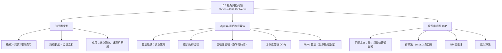

**相关笔记：** [[10.5 欧拉路径与哈密顿路径]] | [[10.7 平面图]]

> [!abstract] 概览
> 本节讨论==加权图（weighted graph）==中的==最短路径问题==。加权图的每条边都被赋予一个数值（权重），路径的==长度==定义为路径上所有边权重之和。本节重点介绍两个核心问题：
>
> - ==Dijkstra 算法==：由 Edsger Dijkstra 于 1959 年提出的贪心算法，用于在==边权非负==的无向连通加权简单图中，找到两个指定顶点之间的最短路径长度，时间复杂度为 $O(n^2)$
> - ==旅行商问题（TSP）==：在加权完全图中求访问每个顶点恰好一次并返回起点的==最小总权重哈密顿回路==，属于 NP 困难问题，没有已知的多项式时间精确算法
>
> 关键术语：
> - ==加权图==：每条边关联一个数值（权重）的图
> - ==路径长度==：路径上所有边权重之和（注意：与无权图中"边的条数"含义不同）
> - ==最短路径==：两个顶点之间长度最小的路径
> - ==贪心算法==：每步做出局部最优选择的算法策略
> - ==NP 困难==：不存在已知多项式时间精确算法的问题类别

---

## 一、知识结构总览

---

## 二、核心思想

> [!tip] 核心思想
> 本节的核心思想是==在加权图中高效地求解最优路径问题==。Dijkstra 算法利用贪心策略，通过逐步构建"已确定最短距离的顶点集合"，保证每一步加入的顶点都具有从源点出发的最短路径。旅行商问题则展示了==计算复杂性理论==中的一个重要现象：某些看似简单的问题实际上极其困难，其精确求解需要指数级时间。

### 1. 加权图与最短路径问题

> [!def] 加权图（Weighted Graph）
> ==加权图==是指每条边都被赋予一个数值（称为==权重==或==长度==）的图。权重可以表示距离、时间、费用等实际量。
>
> 在加权图中，一条路径的==长度（length）==定义为该路径上所有边的权重之和。
>
> **注意**：这里的"长度"与无权图中的"长度"（边的条数）含义不同。

> [!example] 航空系统的加权图模型
> 用顶点表示城市，用边表示航线。可以为边赋予不同的权重来建模不同的问题：
> - 赋予城市间距离 → 求最短飞行距离
> - 赋予飞行时间 → 求最少飞行时间
> - 赋予票价 → 求最低费用
>
> 类似地，计算机网络也可以用加权图建模：顶点表示计算机，边表示通信线路，权重可以表示通信成本、响应时间或物理距离。

> [!def] 最短路径问题（Shortest-Path Problem）
> 给定加权图中的两个顶点 $a$ 和 $z$，==最短路径问题==要求找到从 $a$ 到 $z$ 的一条路径，使得该路径的长度（边权之和）在所有从 $a$ 到 $z$ 的路径中最小。

### 2. Dijkstra 算法

> [!def] Dijkstra 算法（Dijkstra's Algorithm）
> Dijkstra 算法是荷兰数学家 Edsger Dijkstra 于 1959 年发现的==贪心算法==，用于求解==边权均为正数==的无向连通加权简单图中两个顶点之间的最短路径。
>
> **算法核心思想**：维护一个"已确定最短距离的顶点集合" $S$，每次从不在 $S$ 中的顶点中选择标签值最小的顶点 $u$ 加入 $S$，然后更新 $u$ 的所有邻居的标签值。

> [!thm] Dijkstra 算法（Algorithm 1）
> **输入**：加权连通简单图 $G$，所有边权为正数；顶点 $a$（源点）和 $z$（终点）
>
> **输出**：从 $a$ 到 $z$ 的最短路径长度 $L(z)$
>
> **步骤**：
> 1. **初始化**：$L(a) := 0$；对所有其他顶点 $v_i$，$L(v_i) := \infty$；$S := \emptyset$
> 2. **循环**：当 $z \notin S$ 时，重复以下操作：
>    - 选择不在 $S$ 中且标签 $L(u)$ 最小的顶点 $u$
>    - $S := S \cup \{u\}$
>    - 对所有不在 $S$ 中的顶点 $v$：若 $L(u) + w(u, v) < L(v)$，则 $L(v) := L(u) + w(u, v)$
> 3. **返回** $L(z)$

> [!example] Dijkstra 算法逐步执行
> 用 Dijkstra 算法求下图从 $a$ 到 $z$ 的最短路径：
>
> 图的边权如下：$w(a,b)=4$，$w(a,d)=2$，$w(b,c)=3$，$w(b,e)=5$，$w(c,b)=2$，$w(c,e)=1$，$w(d,e)=3$，$w(e,z)=3$
>
> **第 0 步（初始化）**：
>
> | 顶点 | $a$ | $b$ | $c$ | $d$ | $e$ | $z$ |
> |:----:|:---:|:---:|:---:|:---:|:---:|:---:|
> | 标签 | $0$ | $\infty$ | $\infty$ | $\infty$ | $\infty$ | $\infty$ |
> | $S = \emptyset$ |
>
> **第 1 步**：$a$ 标签最小（$0$），加入 $S$。更新 $a$ 的邻居：
> - $L(b) = \min(\infty, 0+4) = 4$
> - $L(d) = \min(\infty, 0+2) = 2$
>
> | 顶点 | $a$ | $b$ | $c$ | $d$ | $e$ | $z$ |
> |:----:|:---:|:---:|:---:|:---:|:---:|:---:|
> | 标签 | $\mathbf{0}$ | $4$ | $\infty$ | $2$ | $\infty$ | $\infty$ |
> | $S = \{a\}$ |
>
> **第 2 步**：$d$ 标签最小（$2$），加入 $S$。更新 $d$ 的邻居 $e$：
> - $L(e) = \min(\infty, 2+3) = 5$
>
> | 顶点 | $a$ | $b$ | $c$ | $d$ | $e$ | $z$ |
> |:----:|:---:|:---:|:---:|:---:|:---:|:---:|
> | 标签 | $\mathbf{0}$ | $4$ | $\infty$ | $\mathbf{2}$ | $5$ | $\infty$ |
> | $S = \{a, d\}$ |
>
> **第 3 步**：$b$ 标签最小（$4$），加入 $S$。更新 $b$ 的邻居 $c$ 和 $e$：
> - $L(c) = \min(\infty, 4+3) = 7$
> - $L(e) = \min(5, 4+5) = 5$（不更新）
>
> | 顶点 | $a$ | $b$ | $c$ | $d$ | $e$ | $z$ |
> |:----:|:---:|:---:|:---:|:---:|:---:|:---:|
> | 标签 | $\mathbf{0}$ | $\mathbf{4}$ | $7$ | $\mathbf{2}$ | $5$ | $\infty$ |
> | $S = \{a, d, b\}$ |
>
> **第 4 步**：$e$ 标签最小（$5$），加入 $S$。更新 $e$ 的邻居 $c$ 和 $z$：
> - $L(c) = \min(7, 5+1) = 6$
> - $L(z) = \min(\infty, 5+3) = 8$
>
> | 顶点 | $a$ | $b$ | $c$ | $d$ | $e$ | $z$ |
> |:----:|:---:|:---:|:---:|:---:|:---:|:---:|
> | 标签 | $\mathbf{0}$ | $\mathbf{4}$ | $6$ | $\mathbf{2}$ | $\mathbf{5}$ | $8$ |
> | $S = \{a, d, b, e\}$ |
>
> **第 5 步**：$c$ 标签最小（$6$），加入 $S$。更新 $c$ 的邻居 $b$ 和 $e$（但 $b, e$ 已在 $S$ 中，跳过）。
>
> | 顶点 | $a$ | $b$ | $c$ | $d$ | $e$ | $z$ |
> |:----:|:---:|:---:|:---:|:---:|:---:|:---:|
> | 标签 | $\mathbf{0}$ | $\mathbf{4}$ | $\mathbf{6}$ | $\mathbf{2}$ | $\mathbf{5}$ | $8$ |
> | $S = \{a, d, b, e, c\}$ |
>
> **第 6 步**：$z$ 标签最小（$8$），加入 $S$。算法终止。
>
> **结果**：$L(z) = 8$，最短路径为 $a \to d \to e \to z$，长度为 $2 + 3 + 3 = 8$。
>
> $\blacksquare$

> [!thm] Dijkstra 算法的正确性（Theorem 1）
> Dijkstra 算法能够正确找到连通无向加权简单图中两个顶点之间的最短路径长度。
>
> **证明**（数学归纳法）：
>
> **归纳假设**：在第 $k$ 次迭代后，
> - (i) $S$ 中每个顶点 $v$ 的标签是从 $a$ 到 $v$ 的最短路径长度
> - (ii) 不在 $S$ 中的每个顶点 $v$ 的标签是从 $a$ 到 $v$ 的、仅经过 $S$ 中顶点的最短路径长度
>
> **基础步**（$k = 0$）：$S = \emptyset$，$L(a) = 0$，其余标签为 $\infty$。从 $a$ 到其他顶点不存在仅经过 $S$ 中顶点的路径（因为 $S$ 为空），所以 $\infty$ 是正确的。基础步成立。
>
> **归纳步**：假设第 $k$ 次迭代后归纳假设成立。设 $v$ 是第 $(k+1)$ 次迭代中加入 $S$ 的顶点（即不在 $S$ 中标签最小的顶点）。
>
> 由归纳假设 (ii)，$v$ 的标签 $L_k(v)$ 是从 $a$ 到 $v$ 仅经过 $S$ 中顶点的最短路径长度。如果存在从 $a$ 到 $v$ 的更短路径，该路径必须经过某个不在 $S$ 中的顶点。设 $u$ 是该路径中第一个不在 $S$ 中的顶点，则从 $a$ 到 $u$ 的路径仅经过 $S$ 中的顶点，其长度小于 $L_k(v)$，这与 $v$ 是标签最小的顶点矛盾。因此 (i) 在第 $(k+1)$ 次迭代后成立。
>
> 对于不在 $S$ 中的顶点 $u$（第 $k+1$ 次迭代后），从 $a$ 到 $u$ 仅经过 $S$ 中顶点的最短路径要么不经过 $v$（长度为 $L_k(u)$），要么经过 $v$（长度为 $L_k(v) + w(v, u)$）。因此：
>
> $$L_{k+1}(u) = \min\{L_k(u),\ L_k(v) + w(v, u)\}$$
>
> 这正是算法的更新规则，因此 (ii) 也成立。
>
> 由数学归纳法，算法正确。
>
> $\blacksquare$

> [!thm] Dijkstra 算法的复杂度（Theorem 2）
> Dijkstra 算法使用 $O(n^2)$ 次运算（加法和比较）来找到 $n$ 个顶点的连通无向加权简单图中两个顶点之间的最短路径。
>
> **证明**：
> - 算法最多进行 $n - 1$ 次迭代（每次加入一个顶点到 $S$ 中）
> - 每次迭代中：
>   - 找到不在 $S$ 中标签最小的顶点：最多 $n - 1$ 次比较
>   - 更新每个不在 $S$ 中的顶点的标签：每次更新需要 1 次加法和 1 次比较，最多 $n - 1$ 个顶点
>   - 每次迭代最多 $2(n - 1)$ 次运算
> - 总运算次数：$(n-1) \times 2(n-1) = O(n^2)$
>
> $\blacksquare$

> [!info] Dijkstra 算法的扩展
> - **单源最短路径**：若继续算法直到所有顶点都加入 $S$，则可求出从源点 $a$ 到所有其他顶点的最短路径
> - **有向图**：Dijkstra 算法可以容易地推广到有向加权图
> - **Floyd 算法**：用于求所有顶点对之间的最短路径，时间复杂度为 $O(n^3)$，但无法构造具体路径
> - **负权边**：Dijkstra 算法==不能==处理含负权边的图（贪心选择可能不正确）

### 3. 旅行商问题（TSP）

> [!def] 旅行商问题（Traveling Salesperson Problem, TSP）
> ==旅行商问题==要求在加权完全无向图中，找到一条==访问每个顶点恰好一次并返回起点==的回路（即哈密顿回路），使得该回路的总权重最小。
>
> 等价地，TSP 要求在完全图中找到一条==总权重最小的哈密顿回路==。

> [!example] 五城市旅行商问题
> 一个旅行商需要访问 Detroit、Toledo、Saginaw、Grand Rapids 和 Kalamazoo 五个城市各一次并返回 Detroit。共有 $(5-1)!/2 = 12$ 条不同的哈密顿回路需要检查。
>
> 通过穷举所有 12 条回路，发现最短总距离为 458 英里，对应路线：
> Detroit → Toledo → Kalamazoo → Grand Rapids → Saginaw → Detroit（或其逆序）。

> [!thm] TSP 的计算复杂度
> 对于 $n$ 个顶点的完全图，需要检查的哈密顿回路数量为 $(n-1)!/2$（选择起点后，其余 $n-1$ 个顶点有 $(n-1)!$ 种排列，但正反方向是同一条回路）。
>
> $(n-1)!/2$ 增长得极其迅速。例如：
> - $n = 5$：$4!/2 = 12$ 条回路
> - $n = 10$：$9!/2 = 181{,}440$ 条回路
> - $n = 25$：$24!/2 \approx 3.1 \times 10^{23}$ 条回路
>
> 即使每秒检查 $10^9$ 条回路，$n = 25$ 时也需要约==一千万年==。

> [!warning] TSP 的 NP 困难性
> - 旅行商问题是==NP 困难（NP-hard）==问题
> - 目前==不存在已知的多项式时间精确算法==
> - 如果发现了 TSP 的多项式时间算法，则许多其他困难问题（如判断命题公式是否为永真式）也将有多项式时间算法
> - 这与==P vs NP== 问题——计算机科学中最著名的开放问题——密切相关

> [!info] 近似算法（Approximation Algorithm）
> 由于 TSP 的精确求解在实际中不可行，常用==近似算法==来获得接近最优的解：
>
> - 近似算法不保证找到精确最优解，但保证解的总权重 $W'$ 满足 $W \leq W' \leq cW$，其中 $W$ 是最优解的总权重，$c$ 是常数
> - 对于满足三角不等式的加权图，存在 $c = 3/2$ 的多项式时间近似算法
> - 对于一般加权图，对任意正实数 $k$，目前没有已知算法能保证解不超过最优解的 $k$ 倍
> - 实践中，已有算法能在几分钟内求解约 1000 个顶点的 TSP 实例，误差在最优解的 2% 以内

---

## 三、补充理解与易混淆点

### 补充理解

> [!info] 补充1：Dijkstra 算法与 BFS 的关系
> Dijkstra 算法可以看作==广度优先搜索（BFS）在加权图上的推广==：
> - 在无权图中，BFS 按层次遍历，天然找到最短路径（以边数计）
> - 在加权图中，Dijkstra 用优先队列（或线性扫描）代替 BFS 的普通队列，按"当前最短距离"选择下一个顶点
> - 如果所有边权都为 1，Dijkstra 算法退化为 BFS
> 来源：Dijkstra, E. W. (1959). "A Note on Two Problems in Connexion with Graphs." *Numerische Mathematik*, 1, 269–271.
> 来源：Cormen, T. H., et al. (2009). *Introduction to Algorithms* (3rd ed.), MIT Press, Section 24.3.

> [!info] 补充2：贪心策略为何有效
> Dijkstra 算法使用贪心策略：每步选择当前标签最小的顶点加入 $S$。贪心策略之所以有效，关键在于==所有边权为正==：
> - 一旦顶点 $v$ 加入 $S$，任何后续通过其他顶点到达 $v$ 的路径只会更长（因为需要经过额外的正权边）
> - 这保证了 $v$ 的标签不会再被更新，即 $v$ 的最短距离已经确定
> - 如果允许负权边，这一性质不再成立，贪心策略可能失败
> 来源：Cormen, T. H., et al. (2009). *Introduction to Algorithms* (3rd ed.), MIT Press, Section 24.3, Theorem 24.6.
> 来源：Rosen, K. H. (2019). *Discrete Mathematics and Its Applications* (8th ed.), McGraw-Hill, Section 10.6.

> [!info] 补充3：最短路径问题的实际应用
> - **导航系统**：Google Maps、高德地图等使用 Dijkstra（或更高效的 A*、Dijkstra with priority queue）算法计算最短驾车路线
> - **网络路由**：OSPF 协议使用 Dijkstra 算法确定数据包的最短传输路径
> - **社交网络**：求两个人之间的最短关系链（"六度分隔"理论）
> - **游戏 AI**：寻路算法（如 A* 是 Dijkstra 的启发式改进版）
> 来源：Cormen, T. H., et al. (2009). *Introduction to Algorithms* (3rd ed.), MIT Press, Chapter 24.
> 来源：Rosen, K. H. (2019). *Discrete Mathematics and Its Applications* (8th ed.), McGraw-Hill, Section 10.6.

### 易混淆点

> [!warning] 误区：路径"长度"的两种含义
> - ❌ 混淆无权图中的"路径长度"（边的条数）和加权图中的"路径长度"（边权之和）
> - ✅ 在加权图中，"长度"始终指边权之和。例如，一条经过 3 条边但每条边权为 1 的路径，长度为 3（而非 2）
> - ✅ 在无权图中，"长度"指边的条数。一条经过 3 条边的路径长度为 3
>
> Rosen 教材特别提醒读者注意这一区别。

> [!warning] 误区：Dijkstra 算法不能处理负权边
> - ❌ 认为 Dijkstra 算法适用于所有加权图
> - ✅ Dijkstra 算法==仅适用于边权非负==的图。如果存在负权边，贪心选择可能导致错误结果
> - ✅ 对于含负权边的图，应使用 Bellman-Ford 算法（时间复杂度 $O(n \cdot m)$，其中 $m$ 为边数）
>
> 反例：若 $a \to b$ 权重为 1，$a \to c$ 权重为 4，$c \to b$ 权重为 $-3$，则 Dijkstra 会错误地认为 $a \to b$ 的最短路径长度为 1，而实际最短路径 $a \to c \to b$ 的长度为 $4 + (-3) = 1$。更极端的负权情况会导致更大误差。

> [!warning] 误区：最短路径不一定唯一
> - ❌ 认为两个顶点之间的最短路径只有一条
> - ✅ 最短路径可能不唯一。例如，若图中存在两条从 $a$ 到 $z$ 的路径，长度相同且都是最小值，则它们都是最短路径
> - ✅ 即使所有边权都不同，最短路径也可能不唯一（虽然这种情况较少见）

---

## 四、习题精选

> [!todo] 习题概览
> | 题号范围 | 核心考点 | 难度 |
> |---------|---------|------|
> | 1-4 | 加权图建模、求最短路径长度 | ⭐⭐ |
> | 5-7 | 用 Dijkstra 算法求最短路径 | ⭐⭐⭐ |
> | 8-13 | 航空/计算机网络最短路径应用 | ⭐⭐⭐ |
> | 14-16 | Dijkstra 算法的扩展与变体 | ⭐⭐⭐ |
> | 17-18 | 实际道路网络最短路径 | ⭐⭐ |
> | 19-20 | 最长路径问题 | ⭐⭐⭐⭐ |
> | 21-23 | Floyd 算法（全源最短路径） | ⭐⭐⭐⭐ |
> | 24 | 负权边导致 Dijkstra 失败 | ⭐⭐⭐ |
> | 25 | 旅行商问题穷举求解 | ⭐⭐⭐ |

### 题1：用 Dijkstra 算法求最短路径

> [!problem] 题目
> 使用 Dijkstra 算法，求下图中从 $a$ 到 $z$ 的最短路径长度。边权如下：$w(a,b) = 2$，$w(a,c) = 1$，$w(b,d) = 5$，$w(b,e) = 8$，$w(c,b) = 2$，$w(c,d) = 6$，$w(c,e) = 2$，$w(d,e) = 3$，$w(d,z) = 6$，$w(e,z) = 4$。

> [!faq]- 解答
> **第 0 步（初始化）**：
>
> | 顶点 | $a$ | $b$ | $c$ | $d$ | $e$ | $z$ |
> |:----:|:---:|:---:|:---:|:---:|:---:|:---:|
> | 标签 | $0$ | $\infty$ | $\infty$ | $\infty$ | $\infty$ | $\infty$ |
>
> **第 1 步**：选 $a$（标签 $0$），$S = \{a\}$。更新邻居：
> - $L(b) = \min(\infty, 0+2) = 2$
> - $L(c) = \min(\infty, 0+1) = 1$
>
> **第 2 步**：选 $c$（标签 $1$），$S = \{a, c\}$。更新邻居：
> - $L(b) = \min(2, 1+2) = 2$（不更新）
> - $L(d) = \min(\infty, 1+6) = 7$
> - $L(e) = \min(\infty, 1+2) = 3$
>
> **第 3 步**：选 $b$（标签 $2$），$S = \{a, c, b\}$。更新邻居：
> - $L(d) = \min(7, 2+5) = 7$（不更新）
> - $L(e) = \min(3, 2+8) = 3$（不更新）
>
> **第 4 步**：选 $e$（标签 $3$），$S = \{a, c, b, e\}$。更新邻居：
> - $L(d) = \min(7, 3+3) = 6$
> - $L(z) = \min(\infty, 3+4) = 7$
>
> **第 5 步**：选 $d$（标签 $6$），$S = \{a, c, b, e, d\}$。更新邻居：
> - $L(z) = \min(7, 6+6) = 7$（不更新）
>
> **第 6 步**：选 $z$（标签 $7$），算法终止。
>
> **结果**：$L(z) = 7$，最短路径为 $a \to c \to e \to z$，长度为 $1 + 2 + 4 = 7$。
>
> $\blacksquare$

### 题2：加权图建模

> [!problem] 题目
> 对于以下关于地铁系统的问题，描述如何用加权图模型来求解：
> (a) 两个站点之间所需的最少时间是多少？
> (b) 从一个站点到另一个站点可以行驶的最短距离是多少？
> (c) 如果两站之间的票价相加得到总票价，两个站点之间的最低票价是多少？

> [!faq]- 解答
> 对所有三个问题，图的构建方式相同：
> - **顶点**：地铁系统的每个站点
> - **边**：连接相邻站点（有直达线路的站点对）
>
> 区别仅在于边的**权重**：
> - (a) 权重 = 两站之间的行驶时间 → 最短路径 = 最少时间
> - (b) 权重 = 两站之间的物理距离 → 最短路径 = 最短距离
> - (c) 权重 = 两站之间的票价 → 最短路径 = 最低总票价
>
> 求解方法：使用 Dijkstra 算法求指定两站之间的最短路径。
>
> $\blacksquare$

### 题3：旅行商问题求解

> [!problem] 题目
> 对下图中的加权完全图求解旅行商问题，找出总权重最小的哈密顿回路。顶点为 $\{a, b, c, d\}$，边权为：$w(a,b) = 3$，$w(a,c) = 5$，$w(a,d) = 2$，$w(b,c) = 6$，$w(b,d) = 4$，$w(c,d) = 7$。

> [!faq]- 解答
> 4 个顶点的完全图有 $(4-1)!/2 = 3$ 条不同的哈密顿回路（固定起点 $a$，考虑方向）：
>
> 1. $a \to b \to c \to d \to a$：$3 + 6 + 7 + 2 = 18$
> 2. $a \to b \to d \to c \to a$：$3 + 4 + 7 + 5 = 19$
> 3. $a \to c \to b \to d \to a$：$5 + 6 + 4 + 2 = 17$
>
> 最小总权重为 $17$，对应哈密顿回路：$a \to c \to b \to d \to a$（或其逆序 $a \to d \to b \to c \to a$）。
>
> $\blacksquare$

### 题4：Dijkstra 算法与负权边

> [!problem] 题目
> 举一个反例说明 Dijkstra 算法在边权可以为负时可能不正确。

> [!faq]- 解答
> 考虑如下加权图：顶点 $\{a, b, c, z\}$，边权为 $w(a,b) = 1$，$w(a,c) = 4$，$w(b,z) = 2$，$w(c,b) = -3$，$w(c,z) = 1$。
>
> **Dijkstra 算法的执行过程**：
> - 初始化：$L(a)=0$，$L(b)=\infty$，$L(c)=\infty$，$L(z)=\infty$
> - 第 1 步：选 $a$，更新 $L(b)=1$，$L(c)=4$
> - 第 2 步：选 $b$（标签 $1 < 4$），更新 $L(z)=3$
> - 第 3 步：选 $c$（标签 $4$），更新 $L(b)=\min(1, 4+(-3))=1$（不更新），$L(z)=\min(3, 4+1)=3$（不更新）
> - 第 4 步：选 $z$，返回 $L(z)=3$
>
> **实际最短路径**：$a \to c \to b \to z$，长度为 $4 + (-3) + 2 = 3$。
>
> 在这个例子中结果恰好相同。换一个更极端的例子：$w(a,b)=1$，$w(a,c)=2$，$w(b,z)=3$，$w(c,b)=-2$，$w(c,z)=4$。
>
> - Dijkstra：选 $a \to b$（标签 1），$L(z)=4$；再选 $c$（标签 2），$L(b)=\min(1, 2+(-2))=0$（但 $b$ 已在 $S$ 中，不更新！），返回 $L(z)=4$
> - 实际最短路径：$a \to c \to b \to z$，长度为 $2 + (-2) + 3 = 3$
>
> Dijkstra 给出 $4$，但实际最短路径长度为 $3$，算法失败！
>
> $\blacksquare$

### 题5：Floyd 算法

> [!problem] 题目
> 描述 Floyd 算法的基本思想，并说明其与 Dijkstra 算法的区别。

> [!faq]- 解答
> **Floyd 算法**用于求加权简单图中==所有顶点对==之间的最短路径。
>
> **基本思想**：使用动态规划。设 $d(v_i, v_j)$ 为从 $v_i$ 到 $v_j$ 的最短路径长度的当前估计。算法逐步考虑是否通过中间顶点 $v_k$（$k = 1, 2, \ldots, n$）来缩短路径：
>
> $$d(v_i, v_j) := \min\{d(v_i, v_j),\ d(v_i, v_k) + d(v_k, v_j)\}$$
>
> **与 Dijkstra 算法的区别**：
>
> | 特性 | Dijkstra 算法 | Floyd 算法 |
> |:-----|:------------|:----------|
> | 求解范围 | 单源最短路径 | 所有顶点对最短路径 |
> | 时间复杂度 | $O(n^2)$ | $O(n^3)$ |
> | 负权边 | 不能处理 | 可以处理（无负权回路时） |
> | 路径构造 | 可以构造具体路径 | 仅求距离，不构造路径 |
> | 算法策略 | 贪心 | 动态规划 |
>
> $\blacksquare$

> [!tip] 解题思路提示
> 1. **Dijkstra 算法执行**：按步骤维护表格，每次选最小标签顶点加入 $S$，然后更新所有不在 $S$ 中的邻居
> 2. **加权图建模**：确定顶点和边的含义，根据问题选择合适的权重
> 3. **TSP 穷举**：列出所有 $(n-1)!/2$ 条哈密顿回路，计算总权重，取最小值
> 4. **负权边反例**：构造一个图使得通过负权边的绕行路径比直接路径更短，且 Dijkstra 会先选择直接路径的中间顶点

---

## 五、视频学习指南

> [!info] 视频资源
> | 资源 | 链接 | 对应内容 | 备注 |
> |:-----|:-----|:---------|:-----|
> | Rosen 8e Section 10.6 | [教材原文](https://www.mheducation.com/highered/product/discrete-mathematics-applications-rosen/M9781259676512.html) | 完整定义、定理与例题 | 英文教材 |
> | MIT 6.006 Lecture 16 | [链接](https://www.youtube.com/watch?v=SJYmFnE1Hzw) | Dijkstra 算法详解 | 英文，MIT算法导论 |
> | WilliamFiset - Dijkstra | [链接](https://www.youtube.com/watch?v=pSqmAOm7VRs) | Dijkstra 可视化与实现 | 英文，动画演示 |
> | 3Blue1Brown - TSP | [链接](https://www.youtube.com/watch?v=SC5CX8drAtU) | 旅行商问题与 NP 困难性 | 英文，直观讲解 |

---

## 六、教材原文

> [!quote] 教材原文
> "Many problems can be modeled using graphs with weights assigned to their edges. As an illustration, consider how an airline system can be modeled. We set up the basic graph model by representing cities by vertices and flights by edges."
>
> "There are several different algorithms that find a shortest path between two vertices in a weighted graph. We will present a greedy algorithm discovered by the Dutch mathematician Edsger Dijkstra in 1959."
>
> "Dijkstra's algorithm finds the length of a shortest path between two vertices in a connected simple undirected weighted graph."
>
> "The traveling salesperson problem asks for the circuit of minimum total weight in a weighted, complete, undirected graph that visits each vertex exactly once and returns to its starting point."
>
> "However, no algorithm with polynomial worst-case time complexity is known for solving this problem. Furthermore, if a polynomial worst-case time complexity algorithm were discovered for the traveling salesperson problem, many other difficult problems would also be solvable using polynomial worst-case time complexity algorithms."

---

## 参见 Wiki

- [[离散数学/concepts/加权图]] -- 加权图的定义与表示
- [[离散数学/concepts/矩阵]] -- 邻接矩阵与加权邻接矩阵（第10章）
- [[离散数学/concepts/算法复杂度]] -- 算法复杂度分析、NP 困难性（第3章）
- [[离散数学/concepts/哈密顿路径]] -- 哈密顿回路与旅行商问题的联系
- [[离散数学/concepts/贪心算法]] -- 贪心算法策略

#学习/离散数学/图论
