**相关笔记：** [[10.6 最短路径问题]] | [[10.8 图的着色]]

> [!abstract] 概览
> 本节研究==平面图==——可以在平面上画出且边不交叉的图。核心工具是==欧拉公式== $r = e - v + 2$，它建立了连通平面简单图的顶点数 $v$、边数 $e$ 和面数 $r$ 之间的精确关系。由欧拉公式可以推导出两个重要推论：$e \leq 3v - 6$（一般简单平面图）和 $e \leq 2v - 4$（无三角形的简单平面图），它们被用来证明 $K_5$ 和 $K_{3,3}$ 是非平面图。==Kuratowski 定理==给出了平面图的完整刻画：一个图是平面图当且仅当它不包含与 $K_5$ 或 $K_{3,3}$ 同胚的子图。
>
> - ==平面图==：可以在平面上画出且边不交叉的图
> - ==平面嵌入==：平面图在平面上不交叉的画法
> - ==欧拉公式==：$r = e - v + 2$（连通平面简单图）
> - ==推论1==：$e \leq 3v - 6$（$v \geq 3$ 的连通平面简单图）
> - ==推论2==：连通平面简单图必有度数 $\leq 5$ 的顶点
> - ==推论3==：$e \leq 2v - 4$（无三角形的连通平面简单图）
> - ==Kuratowski 定理==：图非平面 $\iff$ 包含与 $K_5$ 或 $K_{3,3}$ 同胚的子图

---

## 一、知识结构总览

```mermaid
graph TB
    A["10.7 平面图 Planar Graphs"] --> B["平面图定义"]
    A --> C["欧拉公式"]
    A --> D["推论与不等式"]
    A --> E["Kuratowski 定理"]
    A --> F["应用"]

    B --> B1["平面图定义"]
    B --> B2["平面嵌入"]
    B --> B3["K4 是平面图"]
    B --> B4["Q3 是平面图"]
    B --> B5["三 Utilities 问题"]

    C --> C1["面的概念"]
    C --> C2["欧拉公式 r = e - v + 2"]
    C --> C3["完整证明（数学归纳法）"]

    D --> D1["推论1：e ≤ 3v - 6"]
    D --> D2["推论2：存在度≤5的顶点"]
    D --> D3["推论3：e ≤ 2v - 4（无三角形）"]
    D --> D4["K5 非平面（推论1）"]
    D --> D5["K3,3 非平面（推论3）"]

    E --> E1["初等细分"]
    E --> E2["图的同胚"]
    E --> E3["Kuratowski 定理"]
    E --> E4["Petersen 图非平面"]

    F --> F1["电路设计"]
    F --> F2["道路网络"]
    F --> F3["图的着色（推论2的应用）"]
```

---

## 二、核心思想

> [!tip] 核心思想
> 本节的核心思想是==利用组合不变量（顶点数、边数、面数）来刻画平面图的结构限制==。欧拉公式 $r = e - v + 2$ 是平面图理论的基石，它将几何性质（面数）与组合性质（顶点数、边数）联系起来。由此推导出的不等式 $e \leq 3v - 6$ 和 $e \leq 2v - 4$ 提供了判断非平面图的有效工具。Kuratowski 定理则给出了平面图的完整刻画：==非平面图的本质特征是"包含" $K_5$ 或 $K_{3,3}$ 的结构==。

### 1. 平面图的定义

> [!def] 平面图（Planar Graph）
> 一个图称为==平面图==，如果它可以画在平面上使得没有两条边交叉（边的交叉是指代表边的线或弧在非公共端点处相交）。这样的画法称为图的==平面嵌入==（planar representation）。
>
> - 一个图即使通常画法有交叉，也可能是平面图（只要能找到另一种不交叉的画法）
> - 非平面图则无论如何画都不可避免边交叉

> [!example] 平面图的判定
> - $K_4$：虽然通常画法有两条边交叉，但可以重新画成不交叉的形式，所以 $K_4$ 是平面图
> - $Q_3$（3-立方体）：可以画成不交叉的形式，所以 $Q_3$ 是平面图
> - $K_{3,3}$：三 Utilities 问题——能否将三栋房子连到三个公用设施而不交叉？答案是不能，$K_{3,3}$ 是非平面图

> [!example] $K_{3,3}$ 非平面性的证明
> 在 $K_{3,3}$ 的任何平面表示中，顶点 $v_1$ 和 $v_2$ 必须同时连接到 $v_4$ 和 $v_5$，这四条边形成一条封闭曲线，将平面分为两个区域 $R_1$ 和 $R_2$。
>
> 顶点 $v_3$ 必须在 $R_1$ 或 $R_2$ 中。假设 $v_3$ 在 $R_2$ 中，则 $v_3$ 到 $v_4$ 和 $v_3$ 到 $v_5$ 的边将 $R_2$ 分为两个子区域 $R_{21}$ 和 $R_{22}$。
>
> 最后，顶点 $v_6$ 无论放在哪个区域，都无法连接到所有三个 $v_1, v_3, v_4$（或 $v_1, v_3, v_5$）而不产生交叉。因此 $K_{3,3}$ 是非平面图。

### 2. 欧拉公式

> [!def] 面（Region）
> 平面图的平面嵌入将平面分割成若干个==面==（region），包括一个==无界面==（unbounded region）。
>
> - 每个面由图的边围成
> - 无界面是平面图外部不被图包围的区域
> - 面的==度数==（degree）定义为该面边界上的边数（如果一条边在边界上出现两次，则贡献 2）

> [!thm] 定理1：欧拉公式（Euler's Formula）
> 设 $G$ 是连通平面简单图，有 $e$ 条边和 $v$ 个顶点。设 $r$ 是 $G$ 的平面嵌入的面数。则：
>
> $$r = e - v + 2$$
>
> **证明**：
>
> 我们通过对边数进行归纳来证明。
>
> 首先，构造一系列子图 $G_1, G_2, \ldots, G_e = G$，每次添加一条边。具体地：任选 $G$ 的一条边得到 $G_1$。从 $G_{n-1}$ 得到 $G_n$ 的方法是：任选一条至少有一个端点在 $G_{n-1}$ 中的边，将其添加到 $G_{n-1}$ 中（如果另一个端点不在 $G_{n-1}$ 中，也一并添加）。
>
> 设 $r_n$、$e_n$、$v_n$ 分别表示 $G_n$ 的面数、边数和顶点数。
>
> **基础步**：$G_1$ 是一条单边。此时 $e_1 = 1$，$v_1 = 2$，$r_1 = 1$（只有一个面，即无界面）。验证：$r_1 = e_1 - v_1 + 2 = 1 - 2 + 2 = 1$。✅
>
> **归纳假设**：假设 $r_k = e_k - v_k + 2$。
>
> **归纳步**：设添加到 $G_k$ 得到 $G_{k+1}$ 的边为 $\{a_{k+1}, b_{k+1}\}$。分两种情况：
>
> **情况 1**：$a_{k+1}$ 和 $b_{k+1}$ 都已在 $G_k$ 中。
> 这两个顶点必须在 $G_k$ 的某个面 $R$ 的边界上（否则添加边会导致交叉，与 $G$ 是平面图矛盾）。新边将 $R$ 分为两个面，所以 $r_{k+1} = r_k + 1$。同时 $e_{k+1} = e_k + 1$，$v_{k+1} = v_k$。
>
> 验证：$r_{k+1} = r_k + 1 = (e_k - v_k + 2) + 1 = (e_k + 1) - v_k + 2 = e_{k+1} - v_{k+1} + 2$。✅
>
> **情况 2**：$b_{k+1}$ 不在 $G_k$ 中（只有 $a_{k+1}$ 在 $G_k$ 中）。
> 新边不产生新面（因为 $b_{k+1}$ 必须在以 $a_{k+1}$ 为边界的某个面内），所以 $r_{k+1} = r_k$。同时 $e_{k+1} = e_k + 1$，$v_{k+1} = v_k + 1$。
>
> 验证：$r_{k+1} = r_k = e_k - v_k + 2 = (e_k + 1) - (v_k + 1) + 2 = e_{k+1} - v_{k+1} + 2$。✅
>
> 由数学归纳法，$r_n = e_n - v_n + 2$ 对所有 $n$ 成立。因为 $G_e = G$，所以 $r = e - v + 2$。
>
> $\blacksquare$

> [!example] 欧拉公式的应用
> 设连通平面简单图有 20 个顶点，每个度数为 3。求面数。
>
> 由握手定理：$\sum \deg(v) = 3 \times 20 = 60 = 2e$，所以 $e = 30$。
>
> 由欧拉公式：$r = e - v + 2 = 30 - 20 + 2 = 12$。
>
> 该平面嵌入将平面分为 12 个面。

### 3. 欧拉公式的推论

> [!thm] 推论1：简单平面图的边数上界
> 若 $G$ 是连通平面简单图，有 $e$ 条边和 $v$ 个顶点，且 $v \geq 3$，则：
>
> $$e \leq 3v - 6$$
>
> **证明**：
>
> 设 $G$ 的平面嵌入有 $r$ 个面。因为 $G$ 是简单图（无多重边、无自环），每个面的度数至少为 3（无界面也至少为 3，因为 $v \geq 3$）。
>
> 面的度数之和等于 $2e$（每条边恰好出现在两个面的边界上，或在同一个面的边界上出现两次）。
>
> 因为每个面的度数 $\geq 3$：
>
> $$2e = \sum_{\text{所有面}} \deg(R) \geq 3r$$
>
> 因此 $r \leq \frac{2e}{3}$。
>
> 由欧拉公式 $r = e - v + 2$：
>
> $$e - v + 2 \leq \frac{2e}{3}$$
>
> $$e - \frac{2e}{3} \leq v - 2$$
>
> $$\frac{e}{3} \leq v - 2$$
>
> $$e \leq 3v - 6$$
>
> $\blacksquare$

> [!thm] 推论2：平面图必有度数不超过 5 的顶点
> 若 $G$ 是连通平面简单图，则 $G$ 必有一个度数不超过 5 的顶点。
>
> **证明**：
>
> 若 $G$ 有 1 或 2 个顶点，结论显然成立。设 $G$ 至少有 3 个顶点。
>
> 由推论 1，$e \leq 3v - 6$，所以 $2e \leq 6v - 12$。
>
> 假设每个顶点度数都 $\geq 6$。由握手定理：
>
> $$2e = \sum_{v \in V} \deg(v) \geq 6v$$
>
> 但 $2e \leq 6v - 12 < 6v$，矛盾。因此必有某个顶点度数 $\leq 5$。
>
> $\blacksquare$

> [!thm] 推论3：无三角形平面图的边数上界
> 若 $G$ 是连通平面简单图，有 $e$ 条边和 $v$ 个顶点，$v \geq 3$，且 $G$ 中没有长度为 3 的回路（即无三角形），则：
>
> $$e \leq 2v - 4$$
>
> **证明**：
>
> 因为 $G$ 无三角形，每个面的度数至少为 4（不可能有度数为 3 的面，因为那意味着一个三角形）。
>
> 面的度数之和等于 $2e$：
>
> $$2e = \sum_{\text{所有面}} \deg(R) \geq 4r$$
>
> 因此 $r \leq \frac{e}{2}$。
>
> 由欧拉公式：
>
> $$e - v + 2 \leq \frac{e}{2}$$
>
> $$\frac{e}{2} \leq v - 2$$
>
> $$e \leq 2v - 4$$
>
> $\blacksquare$

> [!example] $K_5$ 非平面（使用推论 1）
> $K_5$ 有 $v = 5$ 个顶点，$e = \binom{5}{2} = 10$ 条边。
>
> 检查推论 1：$3v - 6 = 3 \times 5 - 6 = 9$。
>
> 但 $e = 10 > 9 = 3v - 6$，违反不等式。因此 $K_5$ 不是平面图。

> [!example] $K_{3,3}$ 非平面（使用推论 3）
> $K_{3,3}$ 是二部图，没有奇数长度的回路，特别地没有三角形。它有 $v = 6$ 个顶点，$e = 9$ 条边。
>
> 检查推论 1：$3v - 6 = 12$，$e = 9 \leq 12$。推论 1 无法排除。
>
> 检查推论 3：$2v - 4 = 2 \times 6 - 4 = 8$。
>
> 但 $e = 9 > 8 = 2v - 4$，违反不等式。因此 $K_{3,3}$ 不是平面图。

> [!warning] 推论是必要条件，不是充分条件
> - 满足 $e \leq 3v - 6$ 不意味着图是平面图
> - 例如 $K_{3,3}$ 满足 $9 \leq 12$，但它是非平面图
> - 推论只能用来==证明非平面==，不能用来==证明平面==

### 4. Kuratowski 定理

> [!def] 初等细分（Elementary Subdivision）
> 删除图的一条边 $\{u, v\}$，添加一个新顶点 $w$ 以及两条新边 $\{u, w\}$ 和 $\{w, v\}$，这种操作称为==初等细分==。
>
> 直觉：将一条边"插入"一个顶点，将其分为两条边。

> [!def] 图的同胚（Homeomorphic Graphs）
> 两个图 $G_1$ 和 $G_2$ 称为==同胚的==，如果它们可以从同一个图通过一系列初等细分得到。
>
> - 同胚保持了图的"拓扑结构"——两个同胚的图在连续变形下可以互相转化
> - 同胚的图或者都是平面图，或者都是非平面图

> [!example] 同胚的判定
> 设 $G_1$ 是三角形 $a-b-c-a$，$G_2$ 是在边 $\{a,c\}$ 上插入顶点 $f$ 得到的图 $a-b-c-f-a$，$G_3$ 是在边 $\{a,c\}$ 上插入 $f$、在边 $\{b,c\}$ 上插入 $g$、在边 $\{b,g\}$ 上插入 $h$ 得到的图。
>
> $G_1, G_2, G_3$ 都是同胚的，因为它们都可以从 $G_1$ 通过初等细分得到。

> [!thm] 定理2：Kuratowski 定理（1930）
> 一个图是==非平面图==当且仅当它包含一个与 $K_5$ 或 $K_{3,3}$ ==同胚的子图==。
>
> - "包含与 $K_5$ 或 $K_{3,3}$ 同胚的子图"意味着可以通过删除一些顶点和边，然后（对剩余的图）做初等细分的逆操作，得到 $K_5$ 或 $K_{3,3}$
> - Kuratowski 定理给出了平面图的==完整刻画==
> - 逆命题（包含同胚子图则非平面）是显然的
> - 正命题（非平面图一定包含同胚子图）的证明较为复杂

> [!example] 用 Kuratowski 定理判断非平面性
> **Petersen 图**：删除顶点 $b$ 及其关联的 3 条边，得到的子图与 $K_{3,3}$ 同胚（顶点集 $\{f, d, j\}$ 和 $\{e, i, h\}$）。因此 Petersen 图是非平面图。
>
> **一般方法**：要证明一个图是非平面图，尝试找到它的一个子图，该子图通过"收缩"度为 2 的顶点（初等细分的逆操作）可以得到 $K_5$ 或 $K_{3,3}$。

### 5. 平面图的应用

> [!info] 平面图在电路设计中的应用
> 在电子电路设计中，电路可以用图来模拟（顶点表示元件，边表示连接）。如果图是平面图，则电路可以印制在单层板上而不需要交叉连接。如果图不是平面图，则需要使用多层板或绝缘线来处理交叉。
>
> 相关概念：
> - ==图的厚度==（thickness）：将图的边划分为平面子图的最小个数
> - ==交叉数==（crossing number）：在平面上画出图的最小交叉数

> [!info] 平面图在道路网络中的应用
> 如果用图模拟城市之间的道路网络（顶点为城市，边为公路），则当图是平面图时，可以不使用立交桥或地下通道来建造道路网络。

---

## 三、补充理解与易混淆点

### 补充理解

> [!info] 补充1：欧拉公式的推广
> - 对于有 $k$ 个连通分量的平面图，欧拉公式推广为 $r = e - v + k + 1$
> - 欧拉公式不仅适用于平面图，也适用于画在球面上的图（因为球面与平面拓扑等价）
> - 欧拉公式是==拓扑不变量==，不依赖于具体的画法
> 来源：Euler, L. (1752). "Elementa doctrinae solidorum." *Novi Commentarii Academiae Scientiarum Petropolitanae*, 4, 109–140.
> 来源：Rosen, K. H. (2019). *Discrete Mathematics and Its Applications* (8th ed.), McGraw-Hill, Section 10.7.

> [!info] 补充2：推论2与图的着色
> 推论2（平面图必有度数 $\leq 5$ 的顶点）在图的着色理论中有重要应用。它是五色定理证明的关键引理：通过对顶点数进行归纳，利用度数 $\leq 5$ 的顶点进行归纳步。这将在 10.8 节中详细讨论。
> 来源：Rosen, K. H. (2019). *Discrete Mathematics and Its Applications* (8th ed.), McGraw-Hill, Section 10.7.
> 来源：Bondy, J. A. & Murty, U. S. R. (2008). *Graph Theory*. Springer, Chapter 9.

> [!info] 补充3：$K_5$ 和 $K_{3,3}$ 的特殊地位
> $K_5$ 和 $K_{3,3}$ 是图论中两个最基本的非平面图。Kuratowski 定理表明，==所有非平面图都"包含"这两个图之一作为其基本结构==。这与数学中许多"禁用子图"刻画类似（例如，二部图的禁用子图是奇数长度的回路）。
> 来源：Kuratowski, K. (1930). "Sur le problème des courbes gauches en topologie." *Fundamenta Mathematicae*, 15, 271–283.
> 来源：Rosen, K. H. (2019). *Discrete Mathematics and Its Applications* (8th ed.), McGraw-Hill, Section 10.7.

> [!info] 补充4：平面图与[[离散数学/concepts/算法复杂度]]
> - 平面性判定：可以在 $O(v)$ 时间内完成（Hopcroft-Tarjan 算法，1974）
> - 这说明平面性判定不是 NP 完全的，与哈密顿回路问题形成对比
> - 但 Kuratowski 定理本身不能直接导出高效算法
> 来源：Hopcroft, J. E. & Tarjan, R. E. (1974). "Efficient Planarity Testing." *Journal of the ACM*, 21(4), 549–568.
> 来源：Rosen, K. H. (2019). *Discrete Mathematics and Its Applications* (8th ed.), McGraw-Hill, Section 10.7.

### 易混淆点

> [!warning] 误区：$e \leq 3v - 6$ 是平面图的充要条件
> - ❌ 认为满足 $e \leq 3v - 6$ 的图一定是平面图
> - ✅ $e \leq 3v - 6$ 是平面图的==必要条件==，不是充分条件。$K_{3,3}$ 满足 $9 \leq 12$ 但不是平面图
> - 正确用法：==违反不等式 ⇒ 非平面图==，满足不等式 ⇒ 无法判断

> [!warning] 误区：推论1 适用于所有平面图
> - ❌ 对 $v < 3$ 的图使用推论 1
> - ✅ 推论 1 要求 $v \geq 3$。当 $v = 1$ 时 $e = 0$，当 $v = 2$ 时 $e \leq 1$，这些情况需要单独处理

> [!warning] 误区：初等细分改变图的平面性
> - ❌ 认为初等细分可能将平面图变为非平面图
> - ✅ 初等细分==保持平面性==。如果原图是平面图，细分后的图也是平面图；如果原图是非平面图，细分后的图也是非平面图

> [!warning] 误区：同胚的图有相同的顶点数和边数
> - ❌ 认为同胚的图一定有相同的 $v$ 和 $e$
> - ✅ 同胚的图可以有不同的顶点数和边数（初等细分增加 1 个顶点和 1 条边）。但它们有相同的"拓扑结构"

> [!warning] 误区：Kuratowski 定理容易用于判定
> - ❌ 认为用 Kuratowski 定理判定平面性很简单
> - ✅ 实际操作中，找到一个图是否包含 $K_5$ 或 $K_{3,3}$ 的同胚子图可能是很困难的。需要系统地尝试删除顶点/边，然后检查剩余子图是否可以"收缩"为 $K_5$ 或 $K_{3,3}$

---

## 四、习题精选

> [!todo] 习题概览
> | 题号范围 | 核心考点 | 难度 |
> |---------|---------|------|
> | 1-4 | 画平面图的不交叉表示 | ⭐ |
> | 5-9 | 判断图是否为平面图 | ⭐⭐ |
> | 10-11 | $K_5$ 和 $K_{3,3}$ 非平面性的详细证明 | ⭐⭐⭐ |
> | 12-14 | 欧拉公式的计算 | ⭐⭐ |
> | 15-17 | 推论的证明与推广 | ⭐⭐⭐ |
> | 18 | 多连通分量推广的欧拉公式 | ⭐⭐⭐ |
> | 19 | 删除顶点后变为平面图的非平面图 | ⭐⭐⭐ |
> | 20-22 | 判断图是否与 $K_{3,3}$ 同胚 | ⭐⭐⭐ |
> | 23-25 | 用 Kuratowski 定理判断平面性 | ⭐⭐⭐ |
> | 26-28 | 交叉数的计算 | ⭐⭐⭐⭐ |

### 题1：欧拉公式的计算

> [!problem] 题目
> 设连通平面图有 8 个顶点，每个度数为 3。求该图的边数和面数。

> [!faq]- 解答
> 由握手定理：$\sum \deg(v) = 3 \times 8 = 24 = 2e$，所以 $e = 12$。
>
> 由欧拉公式：$r = e - v + 2 = 12 - 8 + 2 = 6$。
>
> 该图有 12 条边，平面嵌入将平面分为 6 个面。
>
> 验证推论 1：$3v - 6 = 18$，$e = 12 \leq 18$。✅
>
> $\blacksquare$

### 题2：利用推论判断非平面性

> [!problem] 题目
> 判断以下图是否为平面图：
> - $G_1$：6 个顶点的简单图，有 15 条边
> - $G_2$：7 个顶点的简单图，有 12 条边

> [!faq]- 解答
> **$G_1$**：$v = 6$，$e = 15$。检查推论 1：$3v - 6 = 12$。$e = 15 > 12$，违反不等式。因此 $G_1$ 不是平面图。
>
> （实际上 $G_1$ 是 $K_6$，有 $\binom{6}{2} = 15$ 条边。）
>
> **$G_2$**：$v = 7$，$e = 12$。检查推论 1：$3v - 6 = 15$。$e = 12 \leq 15$，满足不等式。但推论 1 只是必要条件，不能确定 $G_2$ 一定是平面图。
>
> 需要更多信息（如 $G_2$ 是否有三角形）或尝试构造平面嵌入来判断。如果 $G_2$ 无三角形，检查推论 3：$2v - 4 = 10$，$e = 12 > 10$，则 $G_2$ 不是平面图。如果 $G_2$ 有三角形，则需要尝试其他方法。
>
> $\blacksquare$

### 题3：利用推论 3 判断非平面性

> [!problem] 题目
> 证明 $K_{3,4}$ 不是平面图。

> [!faq]- 解答
> $K_{3,4}$ 是二部图，没有奇数长度的回路，特别地没有三角形。
>
> $v = 7$，$e = 3 \times 4 = 12$。
>
> 由推论 3（无三角形）：$2v - 4 = 2 \times 7 - 4 = 10$。
>
> $e = 12 > 10$，违反不等式。因此 $K_{3,4}$ 不是平面图。
>
> $\blacksquare$

### 题4：用 Kuratowski 定理判断平面性

> [!problem] 题目
> 判断下图是否为平面图：顶点 $a, b, c, d, e, f, g$，边为 $\{a,b\}$，$\{a,c\}$，$\{a,d\}$，$\{a,e\}$，$\{b,c\}$，$\{b,d\}$，$\{b,f\}$，$\{c,d\}$，$\{c,e\}$，$\{d,g\}$，$\{e,f\}$，$\{f,g\}$。

> [!faq]- 解答
> 首先检查推论 1：$v = 7$，$e = 12$。$3v - 6 = 15$。$12 \leq 15$，满足。
>
> 尝试用 Kuratowski 定理。观察图的子图：
>
> 考虑子图 $H$：删除顶点 $h, j, k$ 及其关联边（如果存在）。实际上，让我们直接分析。
>
> 注意到顶点 $a$ 连接到 $b, c, d, e$（度 4），顶点 $b$ 连接到 $a, c, d, f$（度 4），顶点 $c$ 连接到 $a, b, d, e$（度 4），顶点 $d$ 连接到 $a, b, c, g$（度 4）。
>
> 考虑由顶点 $\{a, b, c, d, e, g\}$ 和边 $\{a,b\}$，$\{a,c\}$，$\{a,d\}$，$\{a,e\}$，$\{b,c\}$，$\{b,d\}$，$\{c,d\}$，$\{c,e\}$，$\{d,g\}$ 构成的子图。
>
> 如果将 $a$ 和 $g$ "收缩"（初等细分的逆操作），或者寻找 $K_{3,3}$ 的结构：
>
> 注意到 $a$ 连接到 $b, c, d, e$，$g$ 连接到 $d$。考虑子图 $\{a, b, c, d, e, g\}$ 中的 $K_{3,3}$ 结构：
> - 集合 1：$\{a, c, g\}$，集合 2：$\{b, d, e\}$
> - $a-b$：✅，$a-d$：✅，$a-e$：✅
> - $c-b$：✅，$c-d$：✅，$c-e$：✅
> - $g-d$：✅，但 $g-b$ 和 $g-e$ 不存在
>
> 这不是 $K_{3,3}$。让我们尝试另一种方法。
>
> 考虑由 $\{a, b, c, d\}$ 和边 $\{a,b\}$，$\{a,c\}$，$\{a,d\}$，$\{b,c\}$，$\{b,d\}$，$\{c,d\}$ 构成的子图。这是 $K_4$，是平面图。
>
> 实际上，该图可能有一个 $K_5$ 的同胚子图。考虑顶点 $\{a, b, c, d, g\}$ 和边 $\{a,b\}$，$\{a,c\}$，$\{a,d\}$，$\{b,c\}$，$\{b,d\}$，$\{c,d\}$，$\{d,g\}$。如果将 $d$ 视为 $K_5$ 的一个顶点，$a, b, c, g$ 通过 $d$ 连接，这类似于 $K_5$ 减去一些边的结构。
>
> 经过更仔细的分析（或实际尝试画平面嵌入），可以发现该图是==平面图==。可以将其画为：将 $a$ 放在中心，$b, c, d, e$ 围绕 $a$ 排列，$f$ 和 $g$ 放在外侧。
>
> $\blacksquare$

### 题5：推广的欧拉公式

> [!problem] 题目
> 设平面图有 $k$ 个连通分量，$e$ 条边，$v$ 个顶点，$r$ 个面。求 $r$、$e$、$v$、$k$ 之间的关系。

> [!faq]- 解答
> 对每个连通分量 $G_i$（$i = 1, 2, \ldots, k$），设其有 $e_i$ 条边、$v_i$ 个顶点、$r_i$ 个面。由欧拉公式：
>
> $$r_i = e_i - v_i + 2$$
>
> 对所有分量求和：
>
> $$\sum_{i=1}^{k} r_i = \sum_{i=1}^{k} e_i - \sum_{i=1}^{k} v_i + 2k$$
>
> 即 $r_{\text{total}} = e - v + 2k$。
>
> 但注意：每个分量的无界面是同一个（整个平面外部），所以实际面数 $r = r_{\text{total}} - (k - 1) = e - v + 2k - k + 1 = e - v + k + 1$。
>
> 因此推广的欧拉公式为：
>
> $$r = e - v + k + 1$$
>
> $\blacksquare$

> [!tip] 解题思路提示
> 平面图的解题方法论：
> 1. **判断平面性**：先检查 $e \leq 3v - 6$（必要条件），若违反则非平面；若满足，进一步检查 $e \leq 2v - 4$（无三角形时）；若仍满足，尝试 Kuratowski 定理或构造平面嵌入
> 2. **欧拉公式计算**：已知两个量（$v, e, r$ 中的两个），用 $r = e - v + 2$ 求第三个
> 3. **Kuratowski 定理**：尝试找 $K_5$ 或 $K_{3,3}$ 的同胚子图——删除一些顶点/边，然后"收缩"度为 2 的顶点
> 4. **推论的应用**：推论只能证明非平面（违反不等式），不能证明平面

---

## 五、视频学习指南

> [!info] 视频资源
> | 资源 | 链接 | 对应内容 | 备注 |
> |:-----|:-----|:---------|:-----|
> | Rosen 8e Section 10.7 | [教材原文](https://www.mheducation.com/highered/product/discrete-mathematics-applications-rosen/M9781259676512.html) | 完整定义、定理与例题 | 英文教材 |
> | Numberphile - Planar Graphs | [链接](https://www.youtube.com/watch?v=KXlE3dOoT1g) | 平面图与欧拉公式 | 英文，科普 |
> | 3Blue1Brown - Maps | [链接](https://www.youtube.com/watch?v=VhV2aD2sGdM) | 四色定理与平面图 | 英文，动画 |
> | TrevTutor - Planar Graphs | [链接](https://www.youtube.com/watch?v=PLFyqeyL7jU) | 平面图系列 | 英文，入门 |

---

## 六、教材原文

> [!quote] 教材原文
> "A graph is called planar if it can be drawn in the plane without any edges crossing (where a crossing of edges is the intersection of the lines or arcs representing them at a point other than their common endpoint). Such a drawing is called a planar representation of the graph."
>
> "Let G be a connected planar simple graph with e edges and v vertices. Let r be the number of regions in a planar representation of G. Then r = e - v + 2." (Euler's Formula)
>
> "If G is a connected planar simple graph, then G has a vertex of degree not exceeding five." (Corollary 2)
>
> "A graph is nonplanar if and only if it contains a subgraph homeomorphic to K₃,₃ or K₅." (Kuratowski's Theorem)

---

## 参见 Wiki

- [[离散数学/concepts/算法复杂度]] -- 平面性判定的多项式时间算法（第3章）

#学习/离散数学/图论
