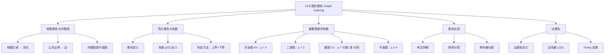

**相关笔记：** [[10.7 平面图]] | [[第11章 树 — 章节汇总|第11章汇总]]

> [!abstract] 概览
> 本节系统介绍==图的着色（graph coloring）==理论及其应用。图的着色是将颜色分配给图的元素（顶点或边），使得满足特定约束。本节重点讨论==顶点着色==和==色数== $\chi(G)$ 的概念，以及著名的==四色定理==。
>
> - ==顶点着色==：为图的每个顶点分配颜色，使得相邻顶点颜色不同
> - ==色数== $\chi(G)$：对图 $G$ 进行合法着色所需的最少颜色数
> - ==四色定理==：任何平面图的色数不超过 4（Appel-Haken 1976 年用计算机证明）
> - ==边着色==：为图的每条边分配颜色，使得共享端点的边颜色不同
> - ==应用==：考试排期、频率分配、寄存器分配、地图着色

---

## 一、知识结构总览

---

## 二、核心思想

> [!tip] 核心思想
> 本节的核心思想是==用颜色分配问题来建模和求解实际中的资源冲突问题==。图的着色将"相邻元素不能共享资源"这一约束形式化为"相邻顶点不能同色"，使得==图论==成为解决调度、分配等组合优化问题的强大工具。色数 $\chi(G)$ 是衡量图"着色难度"的核心参数，而四色定理则是数学史上最著名的定理之一，其证明首次大规模使用了计算机辅助。

### 1. 地图着色与对偶图

> [!def] 地图着色问题
> 在给地图着色时，==共享公共边界==的两个区域必须被分配不同的颜色。目标是使用尽可能少的颜色完成着色。
>
> 注意：仅在一点相切的两个区域不被视为相邻（例如美国犹他州和新墨西哥州仅在四角地区的一个点相切，可以同色）。

> [!def] 对偶图（Dual Graph）
> 给定一个平面地图，其==对偶图==的构造方法如下：
> - 每个区域对应一个顶点
> - 如果两个区域有公共边界，则在对应的两个顶点之间连一条边
>
> 对偶图一定是==平面图==。地图着色问题等价于对偶图的==顶点着色==问题。

> [!example] 地图与对偶图
> 考虑一个被分为区域 $A, B, C, D, E, F$ 的地图，其中 $A$ 与 $B, C, D$ 相邻，$B$ 与 $A, C, E$ 相邻，等等。其对偶图的顶点为 $\{A, B, C, D, E, F\}$，边反映区域间的相邻关系。对该对偶图进行顶点着色，等价于对原地图进行区域着色。

### 2. 顶点着色与色数

> [!def] 顶点着色（Graph Coloring）
> 简单图 $G$ 的一个==着色==是将颜色分配给 $G$ 的每个顶点，使得==没有两个相邻的顶点被分配相同的颜色==。

> [!def] 色数（Chromatic Number）
> 图 $G$ 的==色数== $\chi(G)$（$\chi$ 是希腊字母 chi）是对 $G$ 进行着色所需的==最少颜色数==。
>
> **判定色数的两个步骤**：
> 1. **上界**：构造一个使用 $k$ 种颜色的合法着色，证明 $\chi(G) \leq k$
> 2. **下界**：证明使用少于 $k$ 种颜色不可能完成着色，证明 $\chi(G) \geq k$
> - 若上界等于下界，则 $\chi(G) = k$

> [!example] 求色数的例子
> **图 $G$**：顶点 $\{a, b, c, d, e, f, g\}$，其中 $a, b, c$ 两两相邻（构成三角形），$d$ 与 $b, c$ 相邻，$e$ 与 $a, b$ 相邻，$f$ 与 $a, c$ 相邻，$g$ 与 $a, b$ 相邻。
>
> - **下界**：$a, b, c$ 两两相邻，必须用 3 种不同颜色，所以 $\chi(G) \geq 3$
> - **上界**：$a$ 着红色，$b$ 着蓝色，$c$ 着绿色，$d$ 着红色（仅与蓝、绿相邻），$e$ 着绿色（仅与红、蓝相邻），$f$ 着蓝色（仅与红、绿相邻），$g$ 着红色（仅与蓝、绿相邻）
> - 因此 $\chi(G) = 3$
>
> **图 $H$**：在图 $G$ 的基础上增加边 $(a, g)$。
>
> - 此时 $g$ 与 $a$（红色）、$b$（蓝色）相邻，不能着红或蓝；但 $g$ 也与新增的边 $(a,g)$ 相连的 $a$（红色）相邻。$g$ 原来与 $a, b$ 相邻，现在仍与 $a, b$ 相邻
> - 实际上，$g$ 与 $a$（红）、$b$（蓝）相邻，需要第三种颜色（绿色）。但 $c$ 已经是绿色，而 $g$ 不与 $c$ 相邻，所以 $g$ 可以着绿色... 
> - 关键观察：在图 $H$ 中，$g$ 与 $a, b$ 相邻（$a$ 红，$b$ 蓝），所以 $g$ 需要第三种颜色。但如果 $g$ 着绿色，检查是否与绿色顶点相邻：$c$ 是绿色，但 $g$ 不与 $c$ 相邻。所以 $g$ 着绿色可行
> - 等等——教材中图 $H$ 的 $g$ 与 $a, b$ 以外的顶点也有边。根据教材原图，$g$ 与 $a, b, c$ 都相邻（$H$ 比 $G$ 多了边 $(a,g)$，但 $g$ 原来就与 $a, b$ 相邻，不一定与 $c$ 相邻）
> - 根据教材 Example 1 的描述：$H$ 是 $G$ 加上边 $(a,g)$。在 $G$ 中 $g$ 与 $a, b$ 相邻。在 $H$ 中 $g$ 与 $a, b$ 相邻，且 $a$ 与 $g$ 之间有边。着色 $G$ 时 $g$ 着红色（与 $a$ 同色），但在 $H$ 中 $a$ 和 $g$ 相邻不能同色。$g$ 与 $a$（红）、$b$（蓝）相邻，需要第三种颜色。但 $g$ 不与 $c$（绿）相邻，所以 $g$ 着绿色可行... 
> - 教材结论是 $\chi(H) = 4$。这说明在 $H$ 中 $g$ 与 $a, b, c$ 都相邻（即 $H$ 中 $g$ 与 $c$ 之间也有边），因此 $g$ 需要第四种颜色
> - 因此 $\chi(H) = 4$

### 3. 四色定理

> [!thm] 四色定理（The Four Color Theorem）
> ==任何平面图的色数不超过 4==。即对于任何平面图 $G$，$\chi(G) \leq 4$。
>
> 等价地：任何平面地图可以用不超过 4 种颜色着色，使得相邻区域颜色不同。

> [!info] 四色定理的历史
> - **1852 年**：Francis Guthrie（De Morgan 的学生）首先提出四色猜想，发现英格兰的郡可以用 4 种颜色着色
> - **1879 年**：伦敦律师 Alfred Kempe 发表了一个"证明"，被数学界接受
> - **1890 年**：Percy Heawood 发现了 Kempe 证明中的错误
> - **1976 年**：美国数学家 Kenneth Appel 和 Wolfgang Haken 利用计算机完成了证明
> - **1996 年**：Robertson、Sanders、Seymour 和 Thomas 找到了更简化的证明，将需要检查的构型从约 2000 种减少到 633 种
>
> Appel-Haken 的证明使用了超过 1000 小时的计算机时间，通过穷举检查所有可能的反例类型（约 2000 种），证明不存在需要 5 种颜色的平面图。这一证明引发了巨大争议，因为它是第一个==大规模依赖计算机==的数学证明。

> [!warning] 四色定理的适用范围
> - ✅ 四色定理==仅适用于平面图==
> - ❌ 非平面图可以有任意大的色数。例如，完全图 $K_n$（$n \geq 5$ 时非平面）的色数为 $n$

### 4. 重要图类的色数

> [!thm] 完全图的色数
> 对于正整数 $n$，$\chi(K_n) = n$。
>
> **证明**：
> - $K_n$ 有 $n$ 个顶点，每两个顶点之间都有边
> - 任何两个顶点都相邻，所以每个顶点都需要不同的颜色
> - 因此至少需要 $n$ 种颜色：$\chi(K_n) \geq n$
> - 为每个顶点分配不同颜色，得到使用 $n$ 种颜色的合法着色：$\chi(K_n) \leq n$
> - 因此 $\chi(K_n) = n$
>
> $\blacksquare$

> [!thm] 完全二部图的色数
> 对于正整数 $m$ 和 $n$，$\chi(K_{m,n}) = 2$。
>
> **证明**：
> - $K_{m,n}$ 是二部图，顶点集可分为两个部分 $V_1$（$m$ 个顶点）和 $V_2$（$n$ 个顶点），边只连接 $V_1$ 和 $V_2$ 中的顶点
> - 将 $V_1$ 中所有顶点着一种颜色，$V_2$ 中所有顶点着另一种颜色，得到合法着色
> - 因为 $K_{m,n}$ 有边（$m, n \geq 1$），至少需要 2 种颜色
> - 因此 $\chi(K_{m,n}) = 2$
>
> $\blacksquare$

> [!thm] 圈图的色数
> 对于 $n \geq 3$ 的圈图 $C_n$：
> $$\chi(C_n) = \begin{cases} 2 & \text{若 } n \text{ 为偶数} \\ 3 & \text{若 } n \text{ 为奇数} \end{cases}$$
>
> **证明**：
>
> **$n$ 为偶数时**：
> - 从任意顶点开始，沿顺时针方向交替着红色和蓝色
> - 第 $n$ 个顶点与第 $1$ 个顶点相邻，但第 $n$ 个顶点的前一个（第 $n-1$ 个）和第 $1$ 个顶点都是红色，所以第 $n$ 个顶点着蓝色，与第 $1$ 个顶点（红色）不同，合法
> - 因此 $\chi(C_n) \leq 2$。又因为 $C_n$ 有边，$\chi(C_n) \geq 2$。故 $\chi(C_n) = 2$
>
> **$n$ 为奇数时**：
> - 若只用 2 种颜色，从第 1 个顶点开始交替着色，第 $n$ 个顶点应着蓝色（与第 $1$ 个红色、第 $n-1$ 个红色不同），但 $n$ 为奇数时第 $n$ 个顶点与第 $1$ 个顶点相邻，而交替着色后第 $n$ 个顶点与第 $1$ 个顶点同色（因为走了奇数步），矛盾
> - 因此至少需要 3 种颜色：$\chi(C_n) \geq 3$
> - 用 3 种颜色可以完成着色：前 $n-1$ 个顶点交替着红蓝色，第 $n$ 个顶点着绿色
> - 因此 $\chi(C_n) = 3$
>
> $\blacksquare$

> [!info] 色数的计算复杂度
> - 求图的色数的最佳已知算法具有==指数级最坏情况时间复杂度==
> - 即使是==近似==色数也是困难的：如果存在一个多项式时间算法能将色数近似到不超过 2 倍，则色数的精确多项式时间算法也将存在
> - 这意味着色数问题与 [[离散数学/concepts/算法复杂度|算法复杂度理论]]中的 NP 困难问题密切相关

### 5. 图着色的应用

> [!example] 应用1：考试排期
> **问题**：如何安排期末考试时间，使得没有学生同时参加两场考试？
>
> **建模**：
> - 顶点 = 课程
> - 边 = 两门课程有共同学生
> - 颜色 = 考试时间段
>
> 着色方案即为考试安排：同色的课程安排在同一时间段。
>
> **实例**：7 门课程 $\{1, 2, 3, 4, 5, 6, 7\}$，有共同学生的课程对为：$\{1,2\}, \{1,3\}, \{1,4\}, \{1,7\}, \{2,3\}, \{2,4\}, \{2,5\}, \{2,7\}, \{3,4\}, \{3,6\}, \{3,7\}, \{4,5\}, \{4,6\}, \{5,6\}, \{5,7\}, \{6,7\}$。
>
> 该图的色数为 4，因此需要 4 个时间段：
> - 时间段 I：课程 1, 6
> - 时间段 II：课程 2
> - 时间段 III：课程 3, 5
> - 时间段 IV：课程 4, 7

> [!example] 应用2：频率分配
> **问题**：电视台频道 2-13 分配给北美各站点，使得 150 英里内的两个站点不能使用相同频道。
>
> **建模**：
> - 顶点 = 电视台站点
> - 边 = 两个站点距离在 150 英里以内
> - 颜色 = 电视频道
>
> 着色方案即为频道分配方案。

> [!example] 应用3：索引寄存器分配
> **问题**：在高效编译器中，循环中频繁使用的变量应临时存储在 CPU 的索引寄存器中。一个循环需要多少个索引寄存器？
>
> **建模**：
> - 顶点 = 循环中的变量
> - 边 = 两个变量必须在循环执行的同一时段存储在寄存器中
> - 颜色 = 索引寄存器
>
> 色数即为所需的索引寄存器数量。

### 6. 边着色

> [!def] 边着色（Edge Coloring）
> 图 $G$ 的一个==边着色==是将颜色分配给 $G$ 的每条边，使得==共享公共端点的边被分配不同的颜色==。

> [!def] 边色数（Edge Chromatic Number）
> 图 $G$ 的==边色数== $\chi'(G)$ 是对 $G$ 进行边着色所需的==最少颜色数==。

> [!thm] 边色数的下界
> 图 $G$ 的边色数至少等于 $G$ 的==最大度== $\Delta(G)$：
>
> $$\chi'(G) \geq \Delta(G)$$
>
> **证明**：设顶点 $v$ 的度数为 $\Delta(G)$，则 $v$ 关联了 $\Delta(G)$ 条边。这 $\Delta(G)$ 条边都共享端点 $v$，因此必须被分配不同的颜色。所以至少需要 $\Delta(G)$ 种颜色。
>
> $\blacksquare$

> [!thm] Vizing 定理（Vizing's Theorem）
> 对于任何简单图 $G$，其边色数满足：
>
> $$\Delta(G) \leq \chi'(G) \leq \Delta(G) + 1$$
>
> 即简单图的边色数要么等于最大度，要么等于最大度加 1。
>
> - 若 $\chi'(G) = \Delta(G)$，称 $G$ 为==第一类图==
> - 若 $\chi'(G) = \Delta(G) + 1$，称 $G$ 为==第二类图==
>
> 判断一个图属于哪一类是困难的，但以下结论已知：
> - 二部图（包括 $K_{m,n}$）是第一类图：$\chi'(K_{m,n}) = \max(m, n)$
> - 完全图 $K_n$：当 $n$ 为奇数时 $\chi'(K_n) = n = \Delta(K_n)$（第一类），当 $n$ 为偶数时 $\chi'(K_n) = n - 1 = \Delta(K_n)$（第一类）
> - 圈图 $C_n$：当 $n$ 为偶数时 $\chi'(C_n) = 2 = \Delta(C_n)$（第一类），当 $n$ 为奇数时 $\chi'(C_n) = 3 = \Delta(C_n) + 1$（第二类）

> [!example] 边着色实例
> **电路板着线问题**：$n$ 个设备安装在电路板上，用彩色导线连接。要求从同一设备引出的导线颜色不同。所需颜色数即为图的边色数 $\chi'(G)$。

> [!info] 贪心着色算法
> 教材介绍了一种贪心着色算法：
> 1. 将顶点按度数==递减==排列：$\deg(v_1) \geq \deg(v_2) \geq \cdots \geq \deg(v_n)$
> 2. 将颜色 1 分配给 $v_1$，然后依次分配给列表中不与已着色 1 的顶点相邻的顶点
> 3. 将颜色 2 分配给列表中第一个未着色的顶点，依次类推
> 4. 重复直到所有顶点都被着色
>
> **注意**：贪心着色算法==不一定使用最少的颜色==。它可能使用比色数更多的颜色。

---

## 三、补充理解与易混淆点

### 补充理解

> [!info] 补充1：地图着色与图着色的等价性
> 地图着色问题与平面图的顶点着色问题完全等价，这一转换通过==对偶图==实现：
> - 地图的每个区域 → 对偶图的一个顶点
> - 两个区域有公共边界 → 对偶图中对应顶点之间有边
> - 地图着色（相邻区域不同色）→ 对偶图的顶点着色（相邻顶点不同色）
>
> 因此，四色定理（地图最多需要 4 种颜色）等价于"任何平面图的色数不超过 4"。
> 来源：Appel, K. & Haken, W. (1977). "Every Planar Map is Four Colorable." *Illinois Journal of Mathematics*, 21(3), 429–567.
> 来源：Rosen, K. H. (2019). *Discrete Mathematics and Its Applications* (8th ed.), McGraw-Hill, Section 10.8.

> [!info] 补充2：色数与图的结构特征
> 色数与图的以下结构特征密切相关：
> - **最大团的大小** $\omega(G)$：完全子图的最大顶点数。$\chi(G) \geq \omega(G)$（因为团中所有顶点两两相邻，需要不同颜色）
> - **最大度** $\Delta(G)$：$\chi(G) \leq \Delta(G) + 1$（Brooks 定理：除非 $G$ 是完全图或奇数圈，否则 $\chi(G) \leq \Delta(G)$）
> - **平面性**：平面图 $\chi(G) \leq 4$（四色定理）
> - **二部性**：二部图 $\chi(G) \leq 2$
> 来源：Rosen, K. H. (2019). *Discrete Mathematics and Its Applications* (8th ed.), McGraw-Hill, Section 10.8.
> 来源：Bondy, J. A. & Murty, U. S. R. (2008). *Graph Theory*. Springer, Chapter 5.

> [!info] 补充3：色数判定的一般策略
> 求一个图的色数时，通常采用以下策略：
> 1. **找下界**：寻找最大的完全子图（团），其大小给出色数的下界。例如，含三角形的图至少需要 3 种颜色
> 2. **找上界**：尝试构造一个着色方案。贪心着色算法可以提供一个上界
> 3. **缩小范围**：如果下界等于上界，则色数确定。否则需要更精细的分析
> 来源：Welsh, D. J. A. & Powell, M. B. (1967). "An Upper Bound for the Chromatic Number of a Graph and Its Application to Timetabling Problems." *The Computer Journal*, 10(1), 85–86.
> 来源：Rosen, K. H. (2019). *Discrete Mathematics and Its Applications* (8th ed.), McGraw-Hill, Section 10.8.

### 易混淆点

> [!warning] 误区：色数等于最大团的大小
> - ❌ 认为 $\chi(G) = \omega(G)$（色数等于最大团的大小）
> - ✅ $\chi(G) \geq \omega(G)$，但 $\chi(G)$ 可以严格大于 $\omega(G)$
> - ✅ 例如，圈图 $C_5$ 的最大团大小为 $\omega(C_5) = 2$（没有三角形），但 $\chi(C_5) = 3$
> - ✅ 满足 $\chi(G) = \omega(G)$ 的图称为==完美图（perfect graph）==，但并非所有图都是完美的

> [!warning] 误区：四色定理适用于所有图
> - ❌ 认为任何图都可以用 4 种颜色着色
> - ✅ 四色定理==仅适用于平面图==
> - ✅ 非平面图可以有任意大的色数。例如 $K_n$ 的色数为 $n$，当 $n \geq 5$ 时 $K_n$ 不是平面图
> - ✅ 例如，$K_5$ 需要 5 种颜色，$K_{100}$ 需要 100 种颜色

> [!warning] 误区：地图着色中"相邻"的定义
> - ❌ 认为仅在一点相切的两个区域也需要不同颜色
> - ✅ 地图着色中，仅在一点相切的两个区域==不被视为相邻==，可以着相同颜色
> - ✅ 例如，美国犹他州和新墨西哥州仅在四角地区的一个点相切，在地图着色中可以同色
> - ✅ 这一约定确保了对偶图中不会出现"两个不真正相邻的区域之间有边"的情况

> [!warning] 误区：贪心着色算法总是最优
> - ❌ 认为按某种顺序贪心着色一定使用最少颜色
> - ✅ 贪心着色算法的结果依赖于顶点的排列顺序，不同顺序可能产生不同结果
> - ✅ 贪心着色算法可能使用比色数更多的颜色
> - ✅ 按度数递减排列（最大度优先）通常能得到较好的结果，但不保证最优

---

## 四、习题精选

> [!todo] 习题概览
> | 题号范围 | 核心考点 | 难度 |
> |---------|---------|------|
> | 1-4 | 地图对偶图构造与着色 | ⭐⭐ |
> | 5-11 | 求各类图的色数 | ⭐⭐⭐ |
> | 13 | 色数为 1 的图 | ⭐ |
> | 15-16 | $W_n$ 和奇圈的色数 | ⭐⭐⭐ |
> | 17 | 考试排期应用 | ⭐⭐⭐ |
> | 18 | 频率分配应用 | ⭐⭐ |
> | 21-23 | 边着色与边色数 | ⭐⭐⭐ |
> | 26 | $K_n$ 的边色数 | ⭐⭐ |
> | 35 | $k$-临界图的性质 | ⭐⭐⭐⭐ |
> | 40-41 | 平面图五色/六色定理 | ⭐⭐⭐⭐ |

### 题1：求图的色数

> [!problem] 题目
> 求完全图 $K_5$、完全二部图 $K_{3,4}$、圈图 $C_6$ 和圈图 $C_7$ 的色数。

> [!faq]- 解答
> - $\chi(K_5) = 5$：$K_5$ 中每对顶点都相邻，5 个顶点需要 5 种不同颜色
> - $\chi(K_{3,4}) = 2$：$K_{3,4}$ 是二部图，将两个部分的顶点分别着不同颜色即可
> - $\chi(C_6) = 2$：$C_6$ 有偶数个顶点，可以交替着两种颜色
> - $\chi(C_7) = 3$：$C_7$ 有奇数个顶点，交替着色后首尾同色（相邻），需要第三种颜色
>
> $\blacksquare$

### 题2：考试排期问题

> [!problem] 题目
> 安排 Math 115、Math 116、Math 185、Math 195、CS 101、CS 102、CS 273、CS 473 八门课程的期末考试，使用最少的时段。已知以下课程对有共同学生（不需要排在不同时段）：Math 115 和 CS 473、Math 116 和 CS 473、Math 195 和 CS 101、Math 195 和 CS 102、Math 115 和 Math 116、Math 115 和 Math 185、Math 185 和 Math 195。其他所有课程对都有共同学生。

> [!faq]- 解答
> **建模**：8 门课程为顶点，没有共同学生的课程对之间没有边，有共同学生的课程对之间有边。
>
> 没有边的课程对（可以同时考试）：{Math 115, CS 473}、{Math 116, CS 473}、{Math 195, CS 101}、{Math 195, CS 102}、{Math 115, Math 116}、{Math 115, Math 185}、{Math 185, Math 195}
>
> 这意味着除了上述 7 对之外，所有其他课程对之间都有边。
>
> **分析**：
> - Math 115 与 Math 116、Math 185 无边（可同时段），但与其他课程（Math 195、CS 101、CS 102、CS 273）有边
> - CS 473 与 Math 115、Math 116 无边（可同时段），但与其他课程（Math 185、Math 195、CS 101、CS 102、CS 273）有边
>
> **着色方案**（5 个时段）：
> - 时段 1：Math 115, Math 185（两者无边）
> - 时段 2：Math 116, CS 473（两者无边）
> - 时段 3：Math 195, CS 101（两者无边）
> - 时段 4：CS 102
> - 时段 5：CS 273
>
> 需要验证是否可以减少到 4 个时段。注意 CS 273 与除 Math 115、Math 116 外的所有课程都有共同学生（即 CS 273 与 Math 185、Math 195、CS 101、CS 102、CS 473 都有边）。CS 273 与 Math 115 无边，所以 CS 273 可以和 Math 115 同时段。但 Math 115 已经与 Math 185 同时段，而 CS 273 与 Math 185 有边，所以 CS 273 不能与 Math 185 同时段。
>
> 重新安排：
> - 时段 1：Math 115, CS 273（两者无边）
> - 时段 2：Math 116, CS 473（两者无边）
> - 时段 3：Math 185, Math 195（两者无边）
> - 时段 4：CS 101, CS 102（检查：CS 101 与 CS 102 有共同学生吗？题目说"其他所有课程对都有共同学生"，所以 CS 101 与 CS 102 有边，不能同时段）
>
> 再调整：
> - 时段 1：Math 115, CS 273
> - 时段 2：Math 116, CS 473
> - 时段 3：Math 185, Math 195
> - 时段 4：CS 101
> - 时段 5：CS 102
>
> 因此最少需要 5 个时段。
>
> $\blacksquare$

### 题3：边着色

> [!problem] 题目
> 求圈图 $C_n$（$n \geq 3$）和轮图 $W_n$（$n \geq 3$）的边色数。

> [!faq]- 解答
> **圈图 $C_n$**：
> - $C_n$ 的最大度 $\Delta(C_n) = 2$
> - 当 $n$ 为偶数时：交替着 2 种颜色即可，$\chi'(C_n) = 2$
> - 当 $n$ 为奇数时：用 2 种颜色交替着色，最后一条边的两端点已经分别着了两种颜色，需要第 3 种颜色，$\chi'(C_n) = 3$
>
> **轮图 $W_n$**（$C_{n-1}$ 加上一个中心顶点与所有轮缘顶点相连）：
> - $W_n$ 的最大度 $\Delta(W_n) = n - 1$（中心顶点的度数为 $n-1$）
> - 中心顶点关联了 $n-1$ 条边（辐条），需要 $n-1$ 种颜色
> - 轮缘的 $n-1$ 条边构成圈 $C_{n-1}$，需要 2 种颜色（$n-1$ 为偶数时）或 3 种颜色（$n-1$ 为奇数时）
> - 但辐条已经用了 $n-1$ 种颜色，轮缘边只需要不与辐条冲突
> - 实际上，$\chi'(W_n) = n - 1$（当 $n$ 为奇数时）或 $\chi'(W_n) = n - 1$（当 $n$ 为偶数时）
> - 统一结论：$\chi'(W_n) = n - 1$（因为 $W_n$ 是第一类图）
>
> $\blacksquare$

### 题4：四色定理的应用

> [!problem] 题目
> 用最少颜色给美国地图着色（不考虑仅在角落相接的州），需要多少种颜色？假设密歇根州是一个区域，阿拉斯加和夏威夷视为孤立顶点。

> [!faq]- 解答
> 美国地图是一个平面地图（可以画在平面上没有交叉），因此由四色定理，最多需要 4 种颜色。
>
> 阿拉斯加和夏威夷是孤立顶点（不与任何州相邻），可以着任何颜色。
>
> 实际上，美国地图中存在四个州两两相邻的情况（如科罗拉多、堪萨斯、俄克拉荷马、新墨西哥形成一个"四联"），需要 4 种颜色。因此最少需要 4 种颜色。
>
> $\blacksquare$

### 题5：$k$-临界图的性质

> [!problem] 题目
> 证明：如果 $G$ 是色数为 $k$ 的 $k$-临界图（即删除任何一条边后色数降为 $k-1$），则 $G$ 中每个顶点的度数至少为 $k - 1$。

> [!faq]- 解答
> **证明**（反证法）：
>
> 假设 $G$ 是 $k$-临界的，但存在一个顶点 $v$ 的度数 $\deg(v) \leq k - 2$。
>
> 从 $v$ 的关联边中删除一条边 $e$，得到图 $G - e$。由 $k$-临界的定义，$\chi(G - e) = k - 1$。
>
> 用 $k - 1$ 种颜色对 $G - e$ 进行着色。现在恢复边 $e$，将 $G - e$ 的着色用于 $G$ 中除 $v$ 以外的所有顶点。
>
> 因为 $G - e$ 的着色是合法的，$v$ 的邻居（在 $G - e$ 中）使用了不同的颜色。$v$ 在 $G$ 中有 $\deg(v) \leq k - 2$ 个邻居，所以这些邻居最多使用了 $k - 2$ 种颜色。
>
> 在 $k - 1$ 种可用颜色中，至少有 $(k-1) - (k-2) = 1$ 种颜色未被 $v$ 的任何邻居使用。将这种颜色分配给 $v$，得到 $G$ 的一个使用 $k - 1$ 种颜色的合法着色。
>
> 这与 $\chi(G) = k$ 矛盾。因此假设错误，$G$ 中每个顶点的度数至少为 $k - 1$。
>
> $\blacksquare$

> [!tip] 解题思路提示
> 1. **求色数**：先找最大完全子图确定下界，再构造着色方案确定上界
> 2. **应用题**：正确建模（顶点=实体，边=冲突关系，颜色=资源），然后求色数
> 3. **边着色**：利用 Vizing 定理确定范围 $\Delta \leq \chi' \leq \Delta + 1$，再根据具体图的结构确定精确值
> 4. **证明题**：常用反证法，结合 $k$-临界图的定义和度数条件

---

## 五、视频学习指南

> [!info] 视频资源
> | 资源 | 链接 | 对应内容 | 备注 |
> |:-----|:-----|:---------|:-----|
> | Rosen 8e Section 10.8 | [教材原文](https://www.mheducation.com/highered/product/discrete-mathematics-applications-rosen/M9781259676512.html) | 完整定义、定理与例题 | 英文教材 |
> | Numberphile - Four Color | [链接](https://www.youtube.com/watch?v=NgbK43j_5Rw) | 四色定理的历史与直觉 | 英文，科普讲解 |
> | 3Blue1Brown - Map Coloring | [链接](https://www.youtube.com/watch?v=bMBrSKKDV5k) | 图着色与地图着色 | 英文，动画演示 |
> | TrevTutor - Chromatic Number | [链接](https://www.youtube.com/watch?v=7K1sB05pE0A) | 色数的计算方法 | 英文，适合入门 |

---

## 六、教材原文

> [!quote] 教材原文
> "Problems related to the coloring of maps of regions, such as maps of parts of the world, have generated many results in graph theory. When a map is colored, two regions with a common border are customarily assigned different colors."
>
> "A coloring of a simple graph is the assignment of a color to each vertex of the graph so that no two adjacent vertices are assigned the same color."
>
> "The chromatic number of a graph is the least number of colors needed for a coloring of this graph. The chromatic number of a graph is denoted by χ(G)."
>
> "The four color theorem was originally posed as a conjecture in the 1850s. It was finally proved by the American mathematicians Kenneth Appel and Wolfgang Haken in 1976."
>
> "The best algorithms known for finding the chromatic number of a graph have exponential worst-case time complexity (in the number of vertices of the graph)."

---

## 参见 Wiki

- [[离散数学/concepts/图的着色]] -- 顶点着色与色数的定义
- [[离散数学/concepts/平面图]] -- 平面图与四色定理的关系
- [[离散数学/concepts/二部图]] -- 二部图的色数性质
- [[离散数学/concepts/算法复杂度]] -- 色数问题的计算复杂度、NP 困难性
- [[离散数学/concepts/完全图]] -- 完全图 $K_n$ 的色数

#学习/离散数学/图论
