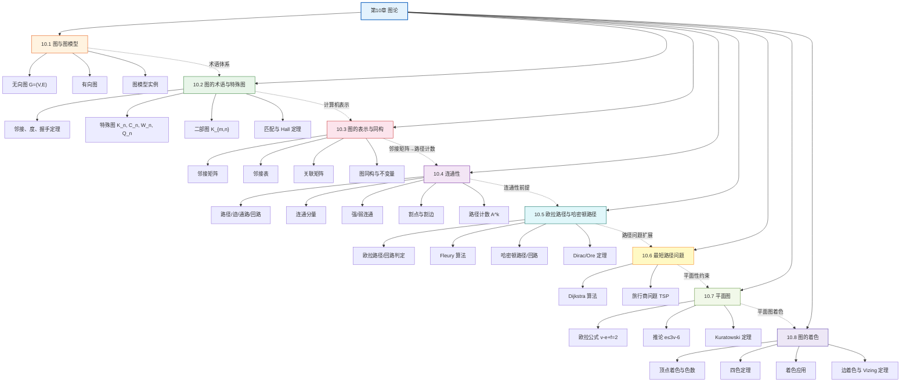

# 第10章 图论 — 章节汇总

> [!abstract] 概览
> 第10章系统介绍了==图论==（Graph Theory）的基本概念、核心定理和重要算法，是离散数学中应用最广泛的章节之一。全章从图的基本定义与图模型出发（10.1），建立图的术语体系与特殊图分类（10.2）；然后介绍图的三种计算机表示方法——邻接矩阵、邻接表、关联矩阵，以及图的同构判定问题（10.3）；接着讨论图的==连通性==，包括无向图的连通分量和有向图的强/弱连通性（10.4）；在此基础上深入两类经典路径问题——==欧拉路径/回路==与==哈密顿路径/回路==（10.5），以及==最短路径问题==与 Dijkstra 算法（10.6）；最后探讨==平面图==的欧拉公式与 Kuratowski 定理（10.7），以及==图的着色==理论与四色定理（10.8）。全章体现了从"基本定义→表示方法→连通性→经典路径→特殊图类"的递进知识链条，与第9章关系（有向图作为关系的可视化）紧密衔接，为第11章树和第12章布尔代数奠定基础。

---

## 全章知识框架



---

## 各节核心知识点汇总

| 小节 | 核心概念 | 关键公式/定理 | 与前后节的关联 |
|:-----|:---------|:-------------|:---------------|
| 10.1 图与图模型 | 无向图 $G=(V,E)$、有向图、多重图、伪图、图模型 | 图 $G=(V,E)$，$V$ 顶点集，$E$ 边集 | 全章基础，定义图的基本结构；与第9章关系（有向图作为二元关系的可视化）衔接 |
| 10.2 图的术语与特殊图 | 邻接、度、握手定理、完全图 $K_n$、圈图 $C_n$、轮图 $W_n$、n立方体 $Q_n$、二部图 $K_{m,n}$、匹配、Hall 定理 | $\sum_{v \in V}\deg(v) = 2|E|$；二部图判定定理；Hall 婚配定理 | 10.1 的术语扩展；特殊图为后续各节提供重要实例；二部图匹配与第6章组合关联 |
| 10.3 图的表示与同构 | 邻接矩阵、邻接表、关联矩阵、图同构、不变量 | 邻接矩阵 $A$；$A^k[i][j]$ = 长度 $k$ 的路径数；同构不变量 | 为 10.4 路径计数提供矩阵工具；与第2章矩阵、第9章零一矩阵关联 |
| 10.4 连通性 | 路径/迹/通路/回路、连通分量、强/弱连通、割点/割边、路径计数 | $A^k$ 路径计数定理；$\kappa(G) \leq \lambda(G) \leq \min\deg$ | 10.3 邻接矩阵的直接应用；连通性是欧拉/哈密顿路径的前提条件 |
| 10.5 欧拉路径与哈密顿路径 | 欧拉路径/回路判定、Fleury 算法、哈密顿路径/回路、Dirac 定理、Ore 定理 | 欧拉回路：连通 + 全偶度；欧拉路径：连通 + 恰 2 奇度；Dirac：$\deg(v) \geq n/2 \Rightarrow$ 哈密顿回路 | 10.4 连通性的直接应用；欧拉问题关注边的遍历，哈密顿问题关注顶点的遍历 |
| 10.6 最短路径问题 | 加权图、Dijkstra 算法、旅行商问题 | Dijkstra $O(n^2)$；TSP $(n-1)!/2$ 条路线 | 10.4 路径概念的加权扩展；与第3章算法复杂度关联 |
| 10.7 平面图 | 平面嵌入、欧拉公式、Kuratowski 定理 | $v - e + f = 2$；$e \leq 3v - 6$；$K_5$、$K_{3,3}$ 非平面 | 平面性约束为着色理论提供基础；欧拉公式是图论最重要的公式之一 |
| 10.8 图的着色 | 顶点着色、色数 $\chi(G)$、四色定理、着色应用、边着色、Vizing 定理 | $\chi(K_n) = n$；$\chi(K_{m,n}) = 2$；$\chi(C_n) = 2$（$n$ 偶）/ $3$（$n$ 奇）；$\Delta \leq \chi' \leq \Delta + 1$ | 10.7 平面图的直接应用（四色定理）；着色应用广泛（考试排期、频率分配、寄存器分配） |

---

## 学习脉络

```
图的基本定义与图模型（10.1）— 掌握无向图/有向图/多重图的定义，理解图模型在现实中的广泛应用
  ↓
图的术语与特殊图（10.2）— 握手定理是核心，特殊图（K_n, C_n, W_n, Q_n, K_{m,n}）是后续各节的重要实例
  ↓
图的表示与同构（10.3）— 邻接矩阵是连接线性代数与图论的桥梁，同构不变量是判定同构的关键工具
  ↓
连通性（10.4）— 路径分类（通路/迹/路径/回路）是基础，邻接矩阵幂的路径计数定理连接了矩阵与图论
  ↓
欧拉路径与哈密顿路径（10.5）— 欧拉问题有高效判定条件，哈密顿问题是 NP 完全的（本质区别）
  ↓
最短路径问题（10.6）— Dijkstra 算法是图论最重要的算法之一，TSP 是 NP 困难的经典问题
  ↓
平面图（10.7）— 欧拉公式 v-e+f=2 是图论最美公式之一，Kuratowski 定理刻画了非平面图的特征
  ↓
图的着色（10.8）— 四色定理是数学史上最著名的定理之一，着色理论有广泛的应用价值
```

**学习建议**：10.1 节是全章的基石——务必彻底掌握图的形式化定义 $G=(V,E)$，理解无向图与有向图的区别；10.2 节的==握手定理==是高频考点——$\sum\deg(v)=2|E|$ 及其推论"奇度顶点个数为偶数"需要熟练运用，特殊图 $K_n, C_n, W_n, Q_n$ 的参数（顶点数、边数）是后续各节的重要实例；10.3 节的==邻接矩阵==是全章最重要的工具——它连接了线性代数与图论，$A^k$ 的路径计数定理在 10.4 节直接应用；10.5 节的核心在于理解欧拉问题与哈密顿问题的本质区别——前者关注边的遍历（有高效判定），后者关注顶点的遍历（NP 完全）；10.6 节的==Dijkstra 算法==必须手动模拟一个完整实例；10.7 节的==欧拉公式== $v-e+f=2$ 是图论最美的公式之一，其推论 $e \leq 3v-6$ 是证明 $K_5$ 和 $K_{3,3}$ 非平面图的关键工具。

---

## 跨节综合复习题

> [!problem] 综合复习题 1（跨 10.2 / 10.3 / 10.4）
> **题目：** 设无向简单图 $G$ 有 6 个顶点，度序列为 $(5, 3, 3, 2, 2, 1)$。
> (a) 验证握手定理是否成立。
> (b) 写出 $G$ 的邻接矩阵 $A$ 的一个可能形式（给出一个满足度序列的具体图）。
> (c) 计算 $A^2$，并解释 $A^2[1][3]$ 的含义。
> (d) $G$ 是否连通？说明理由。

> [!faq]- 解答
> **(a)** 握手定理：$\sum\deg(v) = 5 + 3 + 3 + 2 + 2 + 1 = 16$。边数 $|E| = 16/2 = 8$。✅ 握手定理成立。
>
> **(b)** 构造一个满足度序列 $(5,3,3,2,2,1)$ 的图。设顶点为 $v_1, v_2, v_3, v_4, v_5, v_6$。
>
> $v_1$ 度为 5，与所有其他顶点相连。剩余度需求：$v_2:2, v_3:2, v_4:1, v_5:1, v_6:0$。
>
> 添加边 $v_2v_3$（$v_2:1, v_3:1$），$v_2v_4$（$v_2:0, v_4:0$），$v_3v_5$（$v_3:0, v_5:0$）。
>
> 边集：$\{v_1v_2, v_1v_3, v_1v_4, v_1v_5, v_1v_6, v_2v_3, v_2v_4, v_3v_5\}$
>
> $$A = \begin{pmatrix} 0 & 1 & 1 & 1 & 1 & 1 \\ 1 & 0 & 1 & 1 & 0 & 0 \\ 1 & 1 & 0 & 0 & 1 & 0 \\ 1 & 1 & 0 & 0 & 0 & 0 \\ 1 & 0 & 1 & 0 & 0 & 0 \\ 1 & 0 & 0 & 0 & 0 & 0 \end{pmatrix}$$
>
> **(c)** $A^2[1][3]$ 表示从 $v_1$ 到 $v_3$ 长度为 2 的路径数。
>
> $A^2[1][3] = \sum_{k=1}^{6} A[1][k] \cdot A[k][3]$
> $= A[1][1]A[1][3] + A[1][2]A[2][3] + A[1][3]A[3][3] + A[1][4]A[4][3] + A[1][5]A[5][3] + A[1][6]A[6][3]$
> $= 0 \cdot 1 + 1 \cdot 1 + 1 \cdot 0 + 1 \cdot 0 + 1 \cdot 1 + 1 \cdot 0 = 2$
>
> 长度为 2 的路径：$v_1 \to v_2 \to v_3$ 和 $v_1 \to v_5 \to v_3$。
>
> **(d)** $v_6$ 仅与 $v_1$ 相邻（度为 1），而 $v_1$ 与所有顶点相连，因此从 $v_6$ 可以到达任何顶点。$G$ 是连通的。✅
>
> $\blacksquare$

> [!problem] 综合复习题 2（跨 10.5 / 10.7 / 10.8）
> **题目：** (a) 判断 $K_{3,3}$ 是否存在欧拉回路和哈密顿回路，说明理由。
> (b) 证明 $K_{3,3}$ 不是平面图。
> (c) 求 $K_{3,3}$ 的色数 $\chi(K_{3,3})$，并给出一个 2-着色方案。

> [!faq]- 解答
> **(a)** $K_{3,3}$ 有 $v=6$ 个顶点，每个顶点度数均为 3（奇数）。
>
> - **欧拉回路**：❌。欧拉回路要求所有顶点度数为偶数，但 $K_{3,3}$ 所有 6 个顶点度数均为 3（奇数）。
> - **欧拉路径**：❌。欧拉路径要求恰有 0 或 2 个奇度顶点，但 $K_{3,3}$ 有 6 个奇度顶点。
> - **哈密顿回路**：✅。$K_{3,3}$ 是二部图 $K_{m,n}$（$m=n=3$），当 $m=n \geq 2$ 时 $K_{n,n}$ 存在哈密顿回路。例如：$u_1 \to v_1 \to u_2 \to v_2 \to u_3 \to v_3 \to u_1$。
>
> **(b)** 用反证法。假设 $K_{3,3}$ 是平面图。
>
> $K_{3,3}$ 有 $v=6$ 个顶点，$e=9$ 条边。由于 $K_{3,3}$ 不含三角形（二部图无奇圈），应用无三角形平面图的推论：$e \leq 2v - 4 = 2 \times 6 - 4 = 8$。
>
> 但 $e = 9 > 8$，矛盾！因此 $K_{3,3}$ 不是平面图。$\blacksquare$
>
> **(c)** $K_{3,3}$ 是二部图，因此 $\chi(K_{3,3}) = 2$。
>
> 设顶点集分为 $U = \{u_1, u_2, u_3\}$ 和 $V = \{v_1, v_2, v_3\}$，所有边连接 $U$ 和 $V$。
>
> 2-着色方案：将 $U$ 中所有顶点着色 1，$V$ 中所有顶点着色 2。由于 $K_{3,3}$ 中没有 $U$ 内部或 $V$ 内部的边，相邻顶点颜色一定不同。✅
>
> $\blacksquare$

---

## 笔记索引

| 小节 | 笔记链接 | 核心主题 |
|:-----|:---------|:---------|
| 10.1 | [[10.1 图与图模型]] | 图的基本定义、无向图/有向图/多重图、图模型实例 |
| 10.2 | [[10.2 图的术语与特殊图]] | 握手定理、特殊图 $K_n/C_n/W_n/Q_n$、二部图、匹配、Hall 定理 |
| 10.3 | [[10.3 图的表示与同构]] | 邻接矩阵、邻接表、关联矩阵、图同构与不变量 |
| 10.4 | [[10.4 连通性]] | 路径分类、连通分量、强/弱连通、割点割边、路径计数 |
| 10.5 | [[10.5 欧拉路径与哈密顿路径]] | 欧拉判定、Fleury 算法、哈密顿 NP 完全性、Dirac/Ore 定理 |
| 10.6 | [[10.6 最短路径问题]] | Dijkstra 算法、旅行商问题 |
| 10.7 | [[10.7 平面图]] | 欧拉公式、Kuratowski 定理 |
| 10.8 | [[10.8 图的着色]] | 顶点着色、色数、四色定理、着色应用、边着色 |

#学习/离散数学/图论
