**相关笔记：** [[第10章 图论 — 章节汇总|第10章汇总]] | [[11.2 树的应用]]

> [!abstract] 概览
> 本节系统介绍了==树（tree）==的基本概念、等价定义与核心性质。树是==连通且无简单回路的无向图==，是图论中最重要的特殊图类之一。本节首先给出树的定义，然后证明树的多种等价刻画条件，接着引入==根树==、==有序根树==和==$m$叉树==等衍生概念，最后讨论了树的基本性质，包括边数与顶点数的关系、满$m$叉树中内部顶点与叶子数的关系，以及树的高度与叶子数的上界。
>
> - ==树==：连通且无简单回路的无向图
> - ==森林==：每个连通分支都是树的图
> - ==根树==：指定了一个根顶点、所有边都远离根方向的有向树
> - ==$m$叉树==：每个内部顶点至多有$m$个孩子的根树
> - ==满$m$叉树==：每个内部顶点恰好有$m$个孩子的根树
> - ==有序根树==：每个内部顶点的孩子有固定顺序的根树
> - ==叶子==：没有孩子的顶点；==内部顶点==：有孩子的顶点
> - 树的等价条件：连通无回路 $\Leftrightarrow$ 连通且 $e = v - 1$ $\Leftrightarrow$ 无回路且 $e = v - 1$ $\Leftrightarrow$ 连通且删任一边不连通 $\Leftrightarrow$ 无回路且加任一边恰产生一个回路
> - 满$m$叉树性质：$n = mi + 1$，$l = (m-1)i + 1$

---

## 一、知识结构总览

```mermaid
graph TB
    A["11.1 树的介绍 Introduction to Trees"] --> B["无向树的定义"]
    A --> C["树的等价条件"]
    A --> D["根树 Rooted Trees"]
    A --> E["有序根树与二叉树"]
    A --> F["树作为模型"]
    A --> G["树的基本性质"]

    B --> B1["连通无回路图"]
    B --> B2["森林 Forest"]
    B --> B3["定理1：唯一简单路径"]

    C --> C1["连通 ⟺ 存在生成树"]
    C --> C2["连通且 e=v-1"]
    C --> C3["无回路且 e=v-1"]
    C --> C4["连通且删任一边不连通"]
    C --> C5["无回路且加任一边产生回路"]

    D --> D1["根、父母、孩子、兄弟"]
    D --> D2["祖先、后代"]
    D --> D3["内部顶点与叶子"]
    D --> D4["子树"]
    D --> D5["m叉树与满m叉树"]

    E --> E1["有序根树"]
    E --> E2["二叉树：左孩子与右孩子"]
    E --> E3["左子树与右子树"]

    F --> F1["饱和烃的分子结构"]
    F --> F2["组织结构图"]
    F --> F3["计算机文件系统"]
    F --> F4["树连接并行处理器"]

    G --> G1["定理2：n个顶点的树有n-1条边"]
    G --> G2["定理3：满m叉树 n=mi+1"]
    G --> G3["定理4：满m叉树的顶点/叶子/内部顶点关系"]
    G --> G4["定理5：m叉树叶子数上界 m^h"]
    G --> G5["推论1：高度下界 ⌈log_m l⌉"]
    G --> G6["平衡m叉树"]
```

---

## 二、核心思想

> [!tip] 核心思想
> 本节的核心思想是==将"树"这一直观概念形式化为严格的数学对象==。树是图论中结构最简单却又应用最广泛的图类——它恰好是"连通且没有多余连接"的图。树的多种等价刻画揭示了"连通性"与"无回路性"之间的深刻联系，而根树和$m$叉树则为后续的搜索算法、排序算法、编码理论等提供了基础的数据结构。理解树的关键在于把握其"极简连通性"的本质：树是连通图的"骨架"，任何多余的边都会产生回路。

### 1. 无向树的定义

> [!def] 树（Tree）
> ==树==是一个==连通的无回路无向图==（connected undirected graph with no simple circuits）。
>
> - 因为树不能有简单回路，所以树不能含有多重边或自环，因此树一定是简单图
> - 不连通且无回路的图称为==森林==（forest），森林的每个连通分支都是一棵树

> [!example] 判断哪些图是树
> 设 $G_1, G_2, G_3, G_4$ 为四个图：
> - $G_1$（4个顶点3条边，连通无回路）：**是树**
> - $G_2$（5个顶点4条边，连通无回路）：**是树**
> - $G_3$（5个顶点5条边，含回路 $a \to b \to c \to d \to e \to a$）：**不是树**（有简单回路）
> - $G_4$（6个顶点4条边，不连通）：**不是树**（不连通），但 $G_4$ 是一个森林

> [!thm] 定理1：树的等价定义——唯一简单路径
> 一个无向图是树，当且仅当其任意两个顶点之间存在==唯一简单路径==。
>
> **证明**：
>
> **必要性（$\Rightarrow$）**：设 $T$ 是一棵树，则 $T$ 是连通图且无简单回路。设 $x$ 和 $y$ 是 $T$ 的两个顶点。因为 $T$ 连通，由第10.4节定理1，$x$ 和 $y$ 之间存在简单路径。此外，这条路径必须唯一：如果存在第二条简单路径，则将第一条路径（$x$ 到 $y$）与第二条路径的逆序（$y$ 到 $x$）拼接起来，将形成一个回路。由第10.4节练习59，这意味着 $T$ 中存在简单回路，与树的定义矛盾。因此，任意两个顶点之间存在唯一简单路径。
>
> **充分性（$\Leftarrow$）**：设无向图 $T$ 中任意两个顶点之间存在唯一简单路径。则 $T$ 是连通的（因为任意两个顶点之间有路径）。此外，$T$ 不可能有简单回路：假设 $T$ 含有包含顶点 $x$ 和 $y$ 的简单回路，则该回路由从 $x$ 到 $y$ 的简单路径和从 $y$ 到 $x$ 的简单路径组成，这意味着 $x$ 和 $y$ 之间存在两条不同的简单路径，与唯一性矛盾。因此 $T$ 是树。
>
> $\blacksquare$

### 2. 树的等价条件

> [!thm] 定理：树的五种等价刻画
> 设 $G$ 是含 $n$ 个顶点的简单无向图，则以下五个条件等价：
>
> 1. $G$ 是一棵==树==（连通且无简单回路）
> 2. $G$ 是连通的，且 $G$ 有 $n - 1$ 条边
> 3. $G$ 无简单回路，且 $G$ 有 $n - 1$ 条边
> 4. $G$ 是连通的，且删除 $G$ 的任意一条边都会使其不连通
> 5. $G$ 无简单回路，且添加连接 $G$ 中任意两个不相邻顶点的边都会恰好产生一个简单回路
>
> **证明思路**：
>
> - **(1) $\Rightarrow$ (2)**：由定理2（见下文），$n$ 个顶点的树有 $n - 1$ 条边。树本身连通，故 (2) 成立。
> - **(2) $\Rightarrow$ (1)**：若 $G$ 连通且有 $n - 1$ 条边，则 $G$ 无简单回路（否则删去回路中的一条边仍连通，得到的连通子图有 $n - 2$ 条边和 $n$ 个顶点，这与定理2矛盾）。故 $G$ 是树。
> - **(1) $\Rightarrow$ (4)**：树中任意一条边都是连接两个顶点的唯一路径上的边，删除它将使这两个顶点不再连通。
> - **(4) $\Rightarrow$ (1)**：若 $G$ 连通且删任一边不连通，则 $G$ 不可能有简单回路（因为删除回路中的任一条边不会使图不连通）。故 $G$ 是树。
> - **(1) $\Rightarrow$ (5)**：树中任意两个不相邻顶点之间有唯一简单路径，添加连接它们的边恰好形成以此路径为基础的唯一简单回路。
> - **(5) $\Rightarrow$ (1)**：若 $G$ 无简单回路且加任一边产生回路，则 $G$ 必须连通（否则添加连接两个不同连通分支的边不会产生回路）。
>
> $\blacksquare$

> [!info] 等价条件的直觉理解
> 这五个条件从不同角度刻画了树的"极简连通性"：
> - 条件 (1) 是基本定义
> - 条件 (2) 说"连通图的最少边数是 $n - 1$"——树就是用最少边保持连通的图
> - 条件 (3) 说"无回路图的最多边数是 $n - 1$"——树就是没有多余边的无回路图
> - 条件 (4) 说"每条边都是不可替代的"——树中没有冗余连接
> - 条件 (5) 说"任何缺失的连接都会恰好补成一个回路"——树是"差一条边就有回路"的图

### 3. 根树

> [!def] 根树（Rooted Tree）
> ==根树==是一棵指定了一个顶点作为==根==（root）的树，且每条边的方向都远离根。
>
> - 因为树中任意两个顶点之间存在唯一路径（定理1），所以从根到每个顶点的方向是唯一确定的
> - 不同的根选择会产生不同的根树
> - 通常将根画在顶部，箭头可以省略（因为根的选择隐含了方向）

> [!def] 根树中的亲属关系术语
> 设 $T$ 是以 $r$ 为根的根树，$v$ 是 $T$ 中非根顶点：
> - ==父母（parent）==：$v$ 的父母是到 $v$ 有有向边的唯一顶点 $u$（即 $u$ 是从根到 $v$ 的路径上 $v$ 的前驱）
> - ==孩子（child）==：若 $u$ 是 $v$ 的父母，则 $v$ 是 $u$ 的孩子
> - ==兄弟（siblings）==：有相同父母的顶点
> - ==祖先（ancestors）==：从根到 $v$ 的路径上的所有顶点（不含 $v$ 本身，含根）
> - ==后代（descendants）==：以 $v$ 为祖先的所有顶点
> - ==叶子（leaf）==：没有孩子的顶点
> - ==内部顶点（internal vertex）==：有孩子的顶点（根也是内部顶点，除非它是唯一的顶点）
> - ==子树（subtree）==：以顶点 $a$ 为根的子树是由 $a$ 及其后代以及关联的所有边构成的子图

> [!example] 根树中的亲属关系
> 在以 $a$ 为根的根树中（$a$ 的孩子为 $b, f$；$b$ 的孩子为 $c, d, e$；$c$ 的孩子为 $g, h, j$；$g$ 的孩子为 $k, l, m$）：
> - $c$ 的父母是 $b$
> - $g$ 的孩子是 $h, i, j$（注意：此处 $i$ 是 $g$ 的孩子，取决于具体图结构）
> - $h$ 的兄弟是 $i$ 和 $j$
> - $e$ 的祖先是 $c, b, a$
> - $b$ 的后代是 $c, d, e$（以及 $c$ 的后代 $g, h, j, k, l, m$）
> - 内部顶点：$a, b, c, g, h, j$
> - 叶子：$d, e, f, i, k, l, m$

### 4. $m$叉树与有序根树

> [!def] $m$叉树（$m$-ary Tree）
> 一棵根树称为==$m$叉树==，如果每个内部顶点至多有 $m$ 个孩子。
>
> - ==满$m$叉树==（full $m$-ary tree）：每个内部顶点恰好有 $m$ 个孩子
> - ==二叉树==（binary tree）：$m = 2$ 的$m$叉树（$m$叉树中最重要的特例）

> [!def] 有序根树（Ordered Rooted Tree）
> ==有序根树==是每个内部顶点的孩子有固定顺序的根树。在图中，孩子的顺序从左到右表示。
>
> - 在有序二叉树中，内部顶点的第一个孩子称为==左孩子==（left child），第二个称为==右孩子==（right child）
> - 以左孩子为根的子树称为==左子树==，以右孩子为根的子树称为==右子树==
> - 在某些应用中，即使顶点只有一个孩子，也需指定它是左孩子还是右孩子

> [!example] 判断满$m$叉树
> - $T_1$：每个内部顶点恰好有 2 个孩子 $\Rightarrow$ **满二叉树**
> - $T_2$：每个内部顶点恰好有 3 个孩子 $\Rightarrow$ **满 3 叉树**
> - $T_3$：每个内部顶点恰好有 5 个孩子 $\Rightarrow$ **满 5 叉树**
> - $T_4$：某些内部顶点有 2 个孩子，某些有 3 个孩子 $\Rightarrow$ **不是任何 $m$ 的满$m$叉树**

### 5. 树的基本性质

> [!thm] 定理2：树的边数
> 含 $n$ 个顶点的树有 $n - 1$ 条边。
>
> **证明**：对 $n$ 用数学归纳法。
>
> **基础步**：当 $n = 1$ 时，一棵只有一个顶点的树没有边，$1 - 1 = 0$，命题成立。
>
> **归纳步**：归纳假设：每棵有 $k$ 个顶点的树有 $k - 1$ 条边（$k$ 为正整数）。设树 $T$ 有 $k + 1$ 个顶点。因为 $T$ 是有限树，所以 $T$ 必有叶子 $v$（否则从任意顶点出发沿不同孩子方向走下去，由于没有叶子，路径可以无限延伸，与有限性矛盾）。设 $w$ 是 $v$ 的父母。从 $T$ 中删除顶点 $v$ 及连接 $w$ 和 $v$ 的边，得到图 $T'$。
>
> $T'$ 仍然是树，因为：
> - $T'$ 仍然连通：$T$ 中任意两个不同于 $v$ 的顶点之间的路径不经过 $v$（$v$ 是叶子，度为 1，不是任何路径的中间顶点），所以这些路径在 $T'$ 中仍然存在
> - $T'$ 无简单回路：$T$ 无简单回路，删除边不会产生新回路
>
> $T'$ 有 $k$ 个顶点，由归纳假设 $T'$ 有 $k - 1$ 条边。因此 $T$ 有 $(k - 1) + 1 = k$ 条边。
>
> $\blacksquare$

> [!thm] 定理3：满$m$叉树的顶点数
> 含 $i$ 个内部顶点的满$m$叉树共有 $n = mi + 1$ 个顶点。
>
> **证明**：除根之外，每个顶点都是某个内部顶点的孩子。因为每个内部顶点恰好有 $m$ 个孩子，所以共有 $mi$ 个非根顶点。因此树的总顶点数为 $n = mi + 1$。
>
> $\blacksquare$

> [!thm] 定理4：满$m$叉树的顶点、内部顶点与叶子数的关系
> 设满$m$叉树有 $n$ 个顶点、$i$ 个内部顶点和 $l$ 个叶子，则：
>
> (i) 若已知 $n$：$i = (n - 1)/m$，$l = [(m - 1)n + 1]/m$
>
> (ii) 若已知 $i$：$n = mi + 1$，$l = (m - 1)i + 1$
>
> (iii) 若已知 $l$：$n = (ml - 1)/(m - 1)$，$i = (l - 1)/(m - 1)$
>
> **证明**（以 (i) 为例）：
>
> 由定理3，$n = mi + 1$。又因为每个顶点要么是叶子要么是内部顶点，所以 $n = l + i$。
>
> 从 $n = mi + 1$ 解出 $i = (n - 1)/m$。
>
> 将 $i$ 代入 $l = n - i$：
> $$l = n - \frac{n - 1}{m} = \frac{mn - (n - 1)}{m} = \frac{(m - 1)n + 1}{m}$$
>
> $\blacksquare$

> [!example] 链式信问题
> 一封链式信从一个人开始，每个收到信的人被要求转发给 4 个人。有些人转发了，有些人没有。如果最终有 100 人收到信但没有转发，那么总共多少人看过这封信？多少人转发了信？
>
> **解**：链式信可以用一棵 4 叉树建模。内部顶点对应转发信的人，叶子对应没有转发的人。叶子数 $l = 100$。
>
> 由定理4(iii)：
> $$n = \frac{ml - 1}{m - 1} = \frac{4 \times 100 - 1}{4 - 1} = \frac{399}{3} = 133$$
>
> 内部顶点数 $i = n - l = 133 - 100 = 33$。
>
> 因此共有 133 人看过这封信，其中 33 人转发了信。

> [!def] 树的高度与层次
> - ==层次（level）==：根树中顶点 $v$ 的层次是从根到 $v$ 的唯一路径的长度。根的层次为 0
> - ==高度（height）==：根树的高度是所有顶点层次的最大值，即从根到最远叶子的路径长度
> - ==平衡$m$叉树==：如果所有叶子都在层次 $h$ 或 $h - 1$，则称高度为 $h$ 的$m$叉树是平衡的

> [!thm] 定理5：$m$叉树叶子数的上界
> 高度为 $h$ 的$m$叉树至多有 $m^h$ 个叶子。
>
> **证明**：对高度 $h$ 用数学归纳法。
>
> **基础步**：$h = 1$。高度为 1 的$m$叉树由根和至多 $m$ 个孩子（都是叶子）组成，叶子数至多为 $m = m^1$。
>
> **归纳步**：假设对所有高度小于 $h$ 的$m$叉树，叶子数至多为 $m^{h-1}$。设 $T$ 是高度为 $h$ 的$m$叉树。$T$ 的叶子就是删除根到第 1 层各顶点的边后得到的各子树的叶子。每个这样的子树的高度至多为 $h - 1$，由归纳假设每个子树至多有 $m^{h-1}$ 个叶子。因为至多有 $m$ 个这样的子树，所以 $T$ 至多有 $m \cdot m^{h-1} = m^h$ 个叶子。
>
> $\blacksquare$

> [!thm] 推论1：高度的下界
> 若一棵$m$叉树的高度为 $h$、有 $l$ 个叶子，则 $h \geq \lceil \log_m l \rceil$。若该树是满的且平衡的，则 $h = \lceil \log_m l \rceil$。
>
> **证明**：由定理5，$l \leq m^h$。取以 $m$ 为底的对数得 $\log_m l \leq h$。因为 $h$ 是整数，所以 $h \geq \lceil \log_m l \rceil$。
>
> 若树是平衡的，则所有叶子在层次 $h$ 或 $h - 1$，且至少有一个叶子在层次 $h$。可以证明平衡$m$叉树的叶子数严格大于 $m^{h-1}$（见练习30），因此 $m^{h-1} < l \leq m^h$。取对数得 $h - 1 < \log_m l \leq h$，即 $\lceil \log_m l \rceil = h$。
>
> $\blacksquare$

---

## 三、补充理解与易混淆点

### 补充理解

> [!info] 补充1：树与图论其他概念的联系
> 树是[[离散数学/concepts/有向图|图]]的特殊情形，也是[[离散数学/concepts/连通图|连通图]]的极简形式。树的概念建立在第10章图论的基础上：
> - 树一定是简单图（无多重边、无自环）
> - 树一定是连通图
> - 树的边数 $e = v - 1$ 是连通图的边数下界
> - 森林是树的推广：不连通的无回路图
> - 森林中若有 $t$ 棵树、共 $n$ 个顶点，则边数为 $n - t$（练习31）
> 来源：Cayley, A. (1889). "A Theorem on Trees". *Quarterly Journal of Pure and Applied Mathematics*, 23, 376–378.

> [!info] 补充2：树的应用直觉
> 树之所以重要，是因为许多现实结构天然具有"无回路"的特性：
> - **家谱/族谱**：每个人只有一个父母（无回路），但可以有多个孩子
> - **组织架构**：每个员工只有一个直接上级
> - **文件系统**：每个目录/文件只有一个父目录
> - **决策过程**：每个决策节点引出多个可能的结果
> - **化学分子**：饱和烃 $C_nH_{2n+2}$ 的分子结构图是树（碳原子度数为4，氢原子度数为1）
> 来源：Cormen, T. H., et al. (2009). *Introduction to Algorithms* (3rd ed.), MIT Press, Chapter 12 & 22.

> [!info] 补充3：满$m$叉树中叶子数的下界
> 由定理4(ii)，满$m$叉树中 $l = (m - 1)i + 1$。因为 $i \geq 1$（只要树不只有一个顶点），所以 $l \geq m$。更一般地，对于非满的$m$叉树，有 $l \geq (m - 1)i + 1$（此处 $i$ 为内部顶点数），因为每个内部顶点至多有 $m$ 个孩子，所以非根顶点数 $\leq mi$，从而 $l = n - i = (\text{非根顶点数} + 1) - i \leq mi + 1 - i = (m - 1)i + 1$。等等，这个不等式方向需要修正——对于非满$m$叉树，叶子数 $l \geq (m - 1)i + 1$ 仍然成立。
> 来源：Cover, T. M. & Thomas, J. A. (2006). *Elements of Information Theory* (2nd ed.), Wiley, Theorem 5.2.1 (Kraft Inequality).

### 易混淆点

> [!warning] 误区1：树与森林的混淆
> - ❌ 认为森林就是"有很多棵树的集合"
> - ✅ 森林是==无回路（不一定连通）的图==，其每个连通分支都是一棵树。一个不连通的图只要没有回路就是森林
> - 特别地，一棵树本身也是森林（只有一个连通分支的森林）

> [!warning] 误区2：根树与无向树的混淆
> - ❌ 认为根树和无向树是完全不同的对象
> - ✅ 根树是由无向树==选择一个根==后赋予方向得到的。同一棵无向树选择不同的根会产生不同的根树
> - 无向树是"底层的"图结构，根树是在其上附加了方向信息的"上层"结构

> [!warning] 误区3：$m$叉树与满$m$叉树的混淆
> - ❌ 认为"$m$叉树"和"满$m$叉树"是同一概念
> - ✅ $m$叉树只要求每个内部顶点至多有 $m$ 个孩子（"不超过"），满$m$叉树要求每个内部顶点恰好有 $m$ 个孩子（"恰好等于"）
> - 满$m$叉树一定是$m$叉树，但反之不成立
> - 定理3和定理4的公式只适用于==满$m$叉树==

> [!warning] 误区4：叶子与内部顶点的判定
> - ❌ 认为根不可能是叶子
> - ✅ 如果一棵根树只有一个顶点（即只有根），则根既是根也是叶子（没有孩子）。只有当根有孩子时，根才是内部顶点

---

## 四、习题精选

> [!todo] 习题概览
> | 题号范围 | 核心考点 | 难度 |
> |---------|---------|------|
> | 1-2 | 判断图是否为树 | ⭐ |
> | 3-4 | 根树的基本概念（父母、孩子、层次等） | ⭐⭐ |
> | 5-6 | 判断是否为满$m$叉树 | ⭐⭐ |
> | 7-8 | 求顶点的层次 | ⭐⭐ |
> | 11-13 | 非同构树的计数 | ⭐⭐⭐ |
> | 14-15 | 树的等价条件证明 | ⭐⭐⭐ |
> | 17-20 | 利用定理求顶点数、边数、叶子数 | ⭐⭐ |
> | 21-23 | 链式信与锦标赛问题 | ⭐⭐⭐ |
> | 24-26 | 满$m$叉树的存在性判断 | ⭐⭐⭐ |
> | 31 | 森林的边数 | ⭐⭐ |

### 题1：判断图是否为树

> [!problem] 题目
> 以下哪些图是树？（a）5个顶点的完全图 $K_5$；（b）5个顶点的路径图；（c）6个顶点的环图 $C_6$；（d）4个顶点的星图（一个中心顶点连接其他3个顶点）。

> [!faq]- 解答
> - （a）$K_5$：有 $\binom{5}{2} = 10$ 条边，但 5 个顶点的树应有 4 条边。$K_5$ 含大量回路。❌ 不是树。
> - （b）5个顶点的路径图：连通、4条边、无回路。✅ 是树。
> - （c）$C_6$：6个顶点6条边，含回路。❌ 不是树。
> - （d）4个顶点的星图：连通、3条边、无回路。✅ 是树。

### 题2：利用定理求叶子数

> [!problem] 题目
> 一棵满 3 叉树有 100 个顶点，求其叶子数和内部顶点数。

> [!faq]- 解答
> 由定理4(i)：
> $$i = \frac{n - 1}{m} = \frac{100 - 1}{3} = 33$$
> $$l = n - i = 100 - 33 = 67$$
>
> 验证：$l = \frac{(m-1)n + 1}{m} = \frac{2 \times 100 + 1}{3} = \frac{201}{3} = 67$。✅
>
> 该满 3 叉树有 67 个叶子和 33 个内部顶点。

### 题3：链式信问题

> [!problem] 题目
> 一封链式信开始时一个人将信发给 5 个人。每个收到信的人要么转发给 5 个从未收到过信的人，要么不转发。如果 10000 人转发了信且没有人收到多于一封信，那么共有多少人收到了信？多少人没有转发？

> [!faq]- 解答
> 链式信可以用 5 叉树建模。内部顶点数 $i = 10000$（转发的人），叶子数 $l$ 为没有转发的人数。
>
> 由定理4(ii)：
> $$n = mi + 1 = 5 \times 10000 + 1 = 50001$$
> $$l = n - i = 50001 - 10000 = 40001$$
>
> 共有 50001 人收到了信，其中 40001 人没有转发。

### 题4：证明树的等价条件

> [!problem] 题目
> 证明：一个简单图 $G$ 是树当且仅当 $G$ 连通且删除 $G$ 的任意一条边都会使图不连通。

> [!faq]- 解答
> **必要性（$\Rightarrow$）**：设 $G$ 是树。$G$ 连通。设 $e = \{u, v\}$ 是 $G$ 的任意一条边。删除 $e$ 后，$u$ 和 $v$ 之间不再连通：如果存在不经过 $e$ 的 $u$-$v$ 路径，则该路径与 $e$ 构成一个简单回路，与 $G$ 是树矛盾。
>
> **充分性（$\Leftarrow$）**：设 $G$ 连通且删任一边不连通。假设 $G$ 含有简单回路 $C$。删除 $C$ 中任意一条边 $e$，$C$ 中其余边仍使 $C$ 上所有顶点连通，因此 $G - e$ 仍然连通，与条件矛盾。故 $G$ 无简单回路，因此 $G$ 是树。
>
> $\blacksquare$

### 题5：满$m$叉树的存在性

> [!problem] 题目
> 是否存在一棵有 84 个叶子、高度为 3 的满$m$叉树（$m$ 为正整数）？如果存在，求 $m$ 的值。

> [!faq]- 解答
> 由定理5，高度为 3 的满$m$叉树至多有 $m^3$ 个叶子。需要 $m^3 \geq 84$，即 $m \geq \lceil \sqrt[3]{84} \rceil = 5$。
>
> 由定理4(iii)，$n = \frac{ml - 1}{m - 1} = \frac{84m - 1}{m - 1}$。
>
> 对于满$m$叉树，高度为 3 意味着所有叶子在层次 3（因为满$m$叉树是平衡的）。此时 $n = 1 + m + m^2 + m^3$（各层顶点之和），叶子数 $l = m^3$。
>
> 需要 $m^3 = 84$，但 84 不是完全立方数（$4^3 = 64$，$5^3 = 125$）。
>
> 因此==不存在==这样的满$m$叉树。

> [!tip] 解题思路提示
> 树相关问题的解题方法论：
> 1. **判断是否为树**：检查连通性 + 无回路性，或利用等价条件（如边数是否为 $n - 1$）
> 2. **求顶点/边/叶子数**：利用定理2（$e = n - 1$）和定理4（满$m$叉树的 $n, i, l$ 关系）
> 3. **链式信/传播问题**：建模为$m$叉树，内部顶点 = 转发者，叶子 = 不转发者
> 4. **满$m$叉树的存在性**：检查叶子数是否为 $m^h$（高度为 $h$ 的完全满$m$叉树），或利用定理4的公式验证
> 5. **高度与叶子数**：利用定理5（$l \leq m^h$）和推论1（$h \geq \lceil \log_m l \rceil$）

---

## 五、视频学习指南

> [!info] 视频资源
> | 资源 | 链接 | 对应内容 | 备注 |
> |:-----|:-----|:---------|:-----|
> | Rosen 8e Section 11.1 | [教材原文](https://www.mheducation.com/highered/product/discrete-mathematics-applications-rosen/M9781259676512.html) | 完整定义、定理与例题 | 英文教材 |
> | MIT 6.042J Lecture 11 | [链接](https://www.youtube.com/watch?v=4UZG3SUwTM8) | 树的定义与性质 | 英文，MIT开放课程 |
> | TrevTutor - Trees | [链接](https://www.youtube.com/watch?v=ZcQyJ-1gOQk) | 树的基本概念 | 英文，适合入门 |

---

## 六、教材原文

> [!quote] 教材原文
> "A connected graph that contains no simple circuits is called a tree."
>
> "An undirected graph is a tree if and only if there is a unique simple path between any two of its vertices."
>
> "A rooted tree is a tree in which one vertex has been designated as the root and every edge is directed away from the root."
>
> "A rooted tree is called an m-ary tree if every internal vertex has no more than m children. The tree is called a full m-ary tree if every internal vertex has exactly m children."
>
> "A tree with n vertices has n − 1 edges."

---

## 参见 Wiki

- [[离散数学/concepts/树图]] -- 树的基本定义与性质
- [[离散数学/concepts/有向图]] -- 有向图的基本概念（第10章）
- [[离散数学/concepts/连通图]] -- 连通性的定义与判定（第10章）
- [[离散数学/concepts/完全图]] -- 完全图 $K_n$ 的定义（第10章）
- [[离散数学/concepts/加权图]] -- 加权图的定义（第10章）
- [[离散数学/concepts/递归定义]] -- 树的递归定义方法（第5章）
- [[离散数学/concepts/数学归纳法]] -- 树的性质证明工具（第5章）

#学习/离散数学/树
