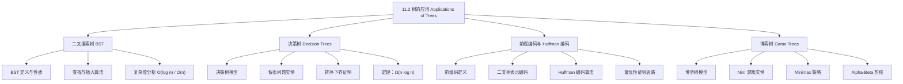

**相关笔记：** [[11.1 树的介绍|11.1 树的介绍]] | [[11.3 树的遍历]]

> [!abstract] 概览
> 本节介绍了树的若干经典应用，核心围绕"如何用树结构高效解决实际问题"展开。主要内容包括四个方面：==二叉搜索树（BST）==用于高效的元素查找与插入；==决策树==用于建模决策过程并推导排序算法的==比较下界 $\Omega(n \log n)$==；==前缀编码==与==Huffman 编码==用于数据压缩中的最优编码；以及==博弈树==用于分析双人博弈中的最优策略（minimax 策略）。
>
> - ==二叉搜索树==：左子树所有键 < 根键 < 右子树所有键，查找/插入复杂度 $O(\log n)$（平均）/ $O(n)$（最坏）
> - ==决策树==：每个内部顶点对应一次决策，叶子对应可能结果
> - ==比较排序下界==：基于二叉比较的排序至少需要 $\lceil \log_2(n!)\rceil$ 次比较，即 $\Omega(n \log n)$
> - ==前缀码==：任何字符的编码不是另一字符编码的前缀，可用二叉树表示
> - ==Huffman 编码==：贪心算法构造最优前缀码，每次合并频率最小的两棵子树
> - ==博弈树==：顶点表示局面，边表示合法走法，叶子表示终局
> - ==Minimax 策略==：第一玩家取子树最大值，第二玩家取子树最小值

---

## 一、知识结构总览



---

## 二、核心思想

> [!tip] 核心思想
> 本节的核心思想是==利用树结构将复杂问题层次化、结构化==。二叉搜索树将有序集合组织为层次结构以加速查找；决策树将决策过程建模为树形结构以分析算法复杂度的理论下界；Huffman 编码利用贪心策略在二叉树上构造最优前缀码以实现数据压缩；博弈树将博弈过程建模为树形结构以分析最优策略。这些应用共同体现了树作为一种基本数据结构的强大表达力。

### 1. 二叉搜索树（Binary Search Tree）

> [!def] 二叉搜索树（BST）
> ==二叉搜索树==是一种二叉树，其中：
> - 每个顶点的子节点被指定为左孩子或右孩子
> - 没有顶点有多于一个左孩子或多于一个右孩子
> - 每个顶点被赋予一个==键==（key），且满足：**该顶点的键大于其左子树中所有顶点的键，小于其右子树中所有顶点的键**
>
> 形式化地，对于 BST 中任意顶点 $v$：
> - 若 $u$ 在 $v$ 的左子树中，则 $\text{key}(u) < \text{key}(v)$
> - 若 $u$ 在 $v$ 的右子树中，则 $\text{key}(u) > \text{key}(v)$

> [!example] 构造二叉搜索树
> 对单词 `mathematics, physics, geography, zoology, meteorology, geology, psychology, chemistry`（按字母序）构造 BST：
>
> 1. `mathematics` 作为根
> 2. `physics` > `mathematics` → 右孩子
> 3. `geography` < `mathematics` → 左孩子
> 4. `zoology` > `mathematics`, > `physics` → `physics` 的右孩子
> 5. `meteorology` < `mathematics`, > `geography` → `geography` 的右孩子
> 6. `geology` < `mathematics`, < `geography` → `geography` 的左孩子
> 7. `psychology` > `mathematics`, > `physics`, < `zoology` → `zoology` 的左孩子
> 8. `chemistry` < `mathematics`, < `geography`, < `geology` → `geology` 的左孩子

> [!def] BST 的查找与插入算法（Algorithm 1）
> **procedure** insertion($T$: binary search tree, $x$: item)
>
> $v$ := $T$ 的根
>
> **while** $v \neq \text{null}$ **and** $\text{label}(v) \neq x$
> > **if** $x < \text{label}(v)$ **then**
> > > **if** $v$ 的左孩子 $\neq$ null **then** $v$ := $v$ 的左孩子
> > > **else** 将新顶点作为 $v$ 的左孩子插入，$v$ := null
> > **else**
> > > **if** $v$ 的右孩子 $\neq$ null **then** $v$ := $v$ 的右孩子
> > > **else** 将新顶点作为 $v$ 的右孩子插入，$v$ := null
>
> **if** $T$ 的根 = null **then** 添加顶点 $v$ 并标记为 $x$
> **else if** $v$ = null **or** $\text{label}(v) \neq x$ **then** 标记新顶点为 $x$
>
> **return** $v$（$x$ 的位置）

> [!thm] BST 操作的复杂度
> 设 BST $T$ 有 $n$ 个带键的顶点。通过添加无标记顶点将 $T$ 扩展为满二叉树 $U$，则 $U$ 有 $n$ 个内部顶点和 $n+1$ 个叶子。
>
> - **最坏情况**：查找或插入一个元素所需的最多比较次数等于 $U$ 中从根到叶子的最长路径长度，即 $U$ 的高度 $h$。当树退化为链时，$h = n$，复杂度为 $O(n)$
> - **平均/平衡情况**：若 BST 是平衡的，由[[11.1 树的介绍]]中推论 1，$h = \lceil \log_2(n+1) \rceil$，复杂度为 $O(\log n)$
> - **下界**：由推论 1，$h \geq \lceil \log_2(n+1) \rceil$，因此必存在至少一个元素需要 $\lceil \log_2(n+1) \rceil$ 次比较

> [!warning] BST 的退化问题
> - 当元素按有序（升序或降序）依次插入时，BST 退化为一条链，所有操作退化为 $O(n)$
> - 实际应用中需要使用自平衡 BST（如 AVL 树、红黑树）来保证 $O(\log n)$ 的最坏情况复杂度
> - 自平衡 BST 在插入元素时会自动进行旋转操作以维持树的平衡

### 2. 决策树（Decision Trees）

> [!def] 决策树
> ==决策树==是一棵有根树，其中：
> - 每个内部顶点对应一次==决策==
> - 从每个内部顶点出发的子树对应决策的每种可能结果
> - 叶子对应问题的==可能解==
> - 从根到叶子的路径对应一个完整的决策序列

> [!example] 假币问题
> 有 8 枚硬币，其中 7 枚重量相同，1 枚是较轻的假币。用天平至少需要多少次称重才能找出假币？
>
> **分析**：每次称重有 3 种可能结果（左重、右重、平衡），因此决策树是==三叉树==。因为有 8 种可能结果（每枚硬币都可能是假币），决策树至少有 8 个叶子。由[[11.1 树的介绍]]推论 1，决策树的高度至少为 $\lceil \log_3 8 \rceil = 2$。
>
> **结论**：至少需要 2 次称重，且 2 次称重确实足够。

### 3. 比较排序的下界

> [!thm] 比较排序的下界（Theorem 1）
> 基于二叉比较的排序算法至少需要 $\lceil \log_2(n!) \rceil$ 次比较。
>
> **证明思路**：
>
> 1. $n$ 个元素有 $n!$ 种可能的排列（每种排列都可能是正确的顺序）
> 2. 基于二叉比较的排序算法可以用一棵二叉决策树建模：
>    - 每个内部顶点代表一次比较（比较两个元素）
>    - 每个叶子代表一种排列（排序结果）
>    - 因此决策树至少有 $n!$ 个叶子
> 3. 排序的最坏情况比较次数 = 决策树的高度
> 4. 由[[11.1 树的介绍]]推论 1，有 $n!$ 个叶子的二叉树的高度至少为 $\lceil \log_2(n!) \rceil$
>
> 因此，任何基于二叉比较的排序算法在最坏情况下至少需要 $\lceil \log_2(n!) \rceil$ 次比较。
>
> $\blacksquare$

> [!thm] 排序下界的 $\Omega$ 表示（Corollary 1）
> 基于二叉比较的排序算法排序 $n$ 个元素所需的比较次数为 $\Omega(n \log n)$。
>
> **推导**：由第 3.2 节练习 74，$\lceil \log_2(n!) \rceil$ 是 $\Theta(n \log n)$。因此 $\lceil \log_2(n!) \rceil = \Omega(n \log n)$。
>
> 这意味着使用 $\Theta(n \log n)$ 次比较的排序算法（如归并排序）在比较次数意义上是==最优的==。

> [!thm] 比较排序的平均情况下界（Theorem 2）
> 基于二叉比较的排序算法排序 $n$ 个元素所需的平均比较次数为 $\Omega(n \log n)$。
>
> **推导**：平均比较次数 = 决策树中叶子的平均深度。由[[11.1 树的介绍]]练习 48，有 $N$ 个顶点的二叉树中叶子的平均深度为 $\Omega(\log N)$。令 $N = n!$，则平均深度为 $\Omega(\log(n!)) = \Omega(n \log n)$。

> [!info] 排序下界的意义
> - 归并排序使用 $\Theta(n \log n)$ 次比较，因此是最优的比较排序算法
> - 要突破 $\Omega(n \log n)$ 下界，必须使用非比较排序（如计数排序、基数排序），这些算法利用了元素的特殊性质
> - 这一结果是==算法分析==中的经典结论，参见[[离散数学/concepts/算法复杂度]]

### 4. 前缀编码与 Huffman 编码

> [!def] 前缀码（Prefix Code）
> ==前缀码==是一种编码方案，其中任何字符的位串编码都不是另一字符编码的==前缀==。
>
> - 前缀码保证了编码串可以被==唯一解码==，无需分隔符
> - 例如：$e \to 0$，$a \to 10$，$t \to 11$ 是前缀码；但若 $e \to 0$，$a \to 1$，$t \to 01$，则 $t$ 的编码 $01$ 以 $e$ 的编码 $0$ 为前缀，不是前缀码
> - 前缀码可以用二叉树表示：字符是叶子的标签，左边缘标 0，右边缘标 1，从根到叶子的路径上的标签序列就是该字符的编码

> [!example] 前缀码的编码与解码
> 设编码方案为：$n \to 0$，$s \to 10$，$e \to 110$，$a \to 1110$，$t \to 1111$。
>
> **编码** `sane`：$s=10$，$a=1110$，$n=0$，$e=110$ → `11111011100`
>
> **解码** `11111011100`：从根出发，按位串走路径，到达叶子即完成一个字符的解码：
> - `1111` → 到达叶子 $s$（走了 4 次右）
> - `10` → 到达叶子 $a$（右、左）
> - `1110` → 到达叶子 $n$（右、右、右、左）
> - `0` → 到达叶子 $e$（左）
> - 解码结果：`sane`

> [!def] Huffman 编码算法（Algorithm 2）
> ==Huffman 编码==是一种==贪心算法==，用于构造==最优前缀码==（在所有可能的二叉前缀码中使用最少的位数）。
>
> **procedure** Huffman($C$: 符号 $a_i$ 及其频率 $w_i$，$i = 1, \ldots, n$)
>
> $F$ := 由 $n$ 棵根树组成的森林，每棵树只有一个顶点 $a_i$，权重为 $w_i$
>
> **while** $F$ 不是一棵树
> > 从 $F$ 中选取权重最小的两棵树 $T$ 和 $T'$（其中 $w(T) \geq w(T')$）
> > 用一棵新根树替换它们：$T$ 作为左子树，$T'$ 作为右子树
> > 新树的权重为 $w(T) + w(T')$
>
> 符号 $a_i$ 的编码 = 从根到 $a_i$ 的唯一路径上各边标签的拼接

> [!example] Huffman 编码的逐步构造
> 对符号 A: 0.08, B: 0.10, C: 0.12, D: 0.15, E: 0.20, F: 0.35 进行 Huffman 编码：
>
> **Step 1**：合并最小的 A(0.08) 和 B(0.10) → 新树权重 0.18
> - 森林：C(0.12), D(0.15), **AB(0.18)**, E(0.20), F(0.35)
>
> **Step 2**：合并最小的 C(0.12) 和 D(0.15) → 新树权重 0.27
> - 森林：**AB(0.18)**, E(0.20), F(0.35), **CD(0.27)**
>
> **Step 3**：合并最小的 AB(0.18) 和 E(0.20) → 新树权重 0.38
> - 森林：**CD(0.27)**, F(0.35), **ABE(0.38)**
>
> **Step 4**：合并最小的 CD(0.27) 和 F(0.35) → 新树权重 0.62
> - 森林：**ABE(0.38)**, **CDF(0.62)**
>
> **Step 5**：合并 ABE(0.38) 和 CDF(0.62) → 最终树权重 1.00
>
> **编码结果**：A: 111, B: 110, C: 011, D: 010, E: 10, F: 00
>
> **平均编码长度**：
> $$3 \times 0.08 + 3 \times 0.10 + 3 \times 0.12 + 3 \times 0.15 + 2 \times 0.20 + 2 \times 0.35 = 2.45 \text{ bits}$$

> [!thm] Huffman 编码的最优性
> Huffman 编码在所有二叉前缀码中是最优的，即它使用最少的位数来编码给定的符号串。
>
> **关键思路**：Huffman 编码是一种==贪心算法==（参见[[离散数学/concepts/贪心算法]]），每一步选择频率最小的两棵子树进行合并。这种局部最优选择最终导致全局最优。完整证明见教材练习 32。
>
> **注意**：Huffman 编码的最优性依赖于已知各符号的频率。若频率未知，可使用自适应 Huffman 编码。

> [!info] Huffman 编码的变体
> - **分组编码**：对符号块（如两个符号一组）进行编码，可能进一步减少总位数
> - **$m$-ary Huffman 编码**：使用 $m$ 叉树（$m \geq 2$）而非二叉树进行编码
> - **自适应 Huffman 编码**：当符号频率未知时，边读取边编码

### 5. 博弈树（Game Trees）

> [!def] 博弈树
> ==博弈树==是用于分析双人博弈的树结构：
> - 顶点表示博弈中可能出现的==局面==
> - 边表示==合法走法==
> - 根表示==初始局面==
> - 叶子表示==终局==（博弈结束的局面）
> - 偶数层的顶点（方框）表示==第一玩家的回合==
> - 奇数层的顶点（圆圈）表示==第二玩家的回合==
>
> 对于胜负博弈：第一玩家获胜的终局标记为 $+1$，第二玩家获胜的终局标记为 $-1$。

> [!def] Minimax 策略
> 博弈树中每个顶点的==值==递归定义如下：
> - (i) 叶子的值 = 该终局对第一玩家的收益
> - (ii) 偶数层内部顶点的值 = 其所有孩子值的==最大值==
> - (iii) 奇数层内部顶点的值 = 其所有孩子值的==最小值==
>
> ==Minimax 策略==：第一玩家始终选择值最大的孩子，第二玩家始终选择值最小的孩子。

> [!thm] Minimax 定理（Theorem 3）
> 博弈树中一个顶点的值告诉我们：如果双方都遵循 minimax 策略，且博弈从该顶点表示的局面开始，第一玩家将获得的收益。
>
> **证明**（对博弈树的高度用数学归纳法）：
>
> **基础步**：若顶点是叶子，由定义其值就是第一玩家的收益。
>
> **归纳步**：归纳假设为——一个顶点的所有孩子的值等于从该孩子表示的局面开始、双方遵循 minimax 策略时第一玩家的收益。
>
> - **第一玩家的回合**（偶数层）：第一玩家遵循 minimax 策略，选择值最大的孩子。由归纳假设，该值就是从该局面开始、双方遵循 minimax 策略时第一玩家的收益。由定义 (ii)，该顶点的值 = 孩子值的最大值，等于从该局面开始的收益。
> - **第二玩家的回合**（奇数层）：第二玩家遵循 minimax 策略，选择值最小的孩子。由归纳假设，该值就是从该局面开始、双方遵循 minimax 策略时第一玩家的收益。由定义 (iii)，该顶点的值 = 孩子值的最小值，等于从该局面开始的收益。
>
> $\blacksquare$

> [!example] Nim 游戏
> 起始局面：三堆石子，分别有 2、2、1 颗。博弈树的根的三个子树值分别为 $1, -1, -1$，因此根的值 = $\max(1, -1, -1) = 1$。第一玩家获胜。

> [!info] 博弈树的实用技术
> - **Alpha-Beta 剪枝**：在计算过程中，若已能确定某个祖先顶点的值不会受当前子树影响，则可以剪掉该子树，大幅减少计算量
> - **评估函数**：当博弈树过大（如国际象棋约有 $10^{100}$ 个顶点）时，无法精确计算所有叶子值。此时用评估函数估计内部顶点的值，然后按 minimax 规则计算

---

## 三、补充理解与易混淆点

### 补充理解

> [!info] 补充1：BST 与二分查找的关系
> BST 的查找过程本质上就是二分查找的树形版本。二分查找在有序数组上进行，每次将搜索范围减半；BST 在树结构上进行，每次根据比较结果选择左子树或右子树。两者的平均时间复杂度都是 $O(\log n)$，但：
> - 有序数组的二分查找：查找 $O(\log n)$，插入/删除 $O(n)$（需要移动元素）
> - 平衡 BST：查找/插入/删除均为 $O(\log n)$
> - 链式 BST（不平衡）：最坏情况所有操作 $O(n)$
> 来源：Adelson-Velsky, G. & Landis, E. (1962). "An algorithm for the organization of information". *Proceedings of the USSR Academy of Sciences*, 146, 263–266.
> 来源：Bayer, R. (1972). "Symmetric binary B-trees: Data structure and maintenance algorithms". *Acta Informatica*, 1(4), 290–306.

> [!info] 补充2：排序下界 $\Omega(n \log n)$ 的直觉理解
> $n$ 个元素有 $n!$ 种排列，每次比较只有 2 种结果（是/否），因此 $k$ 次比较最多区分 $2^k$ 种情况。要区分所有 $n!$ 种排列，需要：
> $$2^k \geq n! \implies k \geq \log_2(n!)$$
> 由 Stirling 近似 $n! \approx \sqrt{2\pi n}(n/e)^n$，$\log_2(n!) \approx n \log_2 n - n \log_2 e = \Theta(n \log n)$。
> 来源：Cormen, T. H., et al. (2009). *Introduction to Algorithms* (3rd ed.), Section 8.1 (Lower Bounds for Sorting).

> [!info] 补充3：Huffman 编码与信息论的联系
> Huffman 编码与香农的信息论密切相关。对于出现频率为 $p_i$ 的符号，香农定理指出最优编码的平均长度 $L$ 满足：
> $$H \leq L < H + 1$$
> 其中 $H = -\sum p_i \log_2 p_i$ 是信源的熵（entropy）。Huffman 编码的平均长度接近但不超过 $H + 1$，是接近信息论极限的实际编码方案。
> 来源：Shannon, C. E. (1948). "A Mathematical Theory of Communication". *Bell System Technical Journal*, 27(3), 379–423.
> 来源：Huffman, D. A. (1952). "A Method for the Construction of Minimum-Redundancy Codes". *Proceedings of the IRE*, 40(9), 1098–1101.
> 来源：Cover, T. M. & Thomas, J. A. (2006). *Elements of Information Theory* (2nd ed.), Wiley, Section 5.1.

### 易混淆点

> [!warning] 误区：前缀码 vs 普通编码
> - ❌ 认为任何不等长编码都是前缀码
> - ✅ 前缀码的关键性质是"任何编码不是另一编码的前缀"。例如 $\{0, 10, 11\}$ 是前缀码，但 $\{0, 01, 11\}$ 不是（因为 $0$ 是 $01$ 的前缀）
> - ❌ 认为前缀码的解码需要分隔符
> - ✅ 前缀码的解码是唯一的，不需要分隔符。解码时从左到右扫描，一旦匹配到某个字符的编码就输出该字符

> [!warning] 误区：排序下界 $\Omega(n \log n)$ 的适用范围
> - ❌ 认为"所有排序算法都至少需要 $\Omega(n \log n)$ 时间"
> - ✅ $\Omega(n \log n)$ 下界仅适用于==基于比较的排序算法==。非比较排序（如计数排序 $O(n+k)$、基数排序 $O(d(n+k))$）可以突破此下界，但它们对输入数据有额外要求（如元素范围有限）

> [!warning] 误区：Huffman 编码的唯一性
> - ❌ 认为给定一组符号和频率，Huffman 编码是唯一的
> - ✅ 当多个符号/子树具有相同频率时，不同的合并顺序会产生不同的编码树，但==平均编码长度相同==。例如对符号 $t:0.3, u:0.3, v:0.2, w:0.2$，先合并 $v$ 和 $w$ 与先合并 $t$ 和 $u$ 会产生不同的编码，但平均长度相同

---

## 四、习题精选

> [!todo] 习题概览
> | 题号范围 | 核心考点 | 难度 |
> |---------|---------|------|
> | 1-2 | 构造二叉搜索树 | ⭐⭐ |
> | 3-4 | BST 中的查找/插入比较次数 | ⭐⭐ |
> | 5 | 句子单词构造 BST | ⭐⭐ |
> | 6-10 | 假币问题与决策树 | ⭐⭐⭐ |
> | 11-12 | 排序的最少比较次数 | ⭐⭐⭐ |
> | 19-22 | 前缀码的判定与构造 | ⭐⭐ |
> | 23-27 | Huffman 编码的构造与计算 | ⭐⭐⭐ |
> | 32 | Huffman 编码最优性证明 | ⭐⭐⭐⭐ |
> | 33-40 | 博弈树与 Nim 游戏 | ⭐⭐⭐ |

### 题1：构造二叉搜索树

> [!problem] 题目
> 为单词 `banana, peach, apple, pear, coconut, mango, papaya`（按字母序）构造二叉搜索树。

> [!faq]- 解答
> 逐步插入：
> 1. `banana` → 根
> 2. `peach` > `banana` → 右孩子
> 3. `apple` < `banana` → 左孩子
> 4. `pear` > `banana`, > `peach` → `peach` 的右孩子
> 5. `coconut` > `banana`, < `peach` → `peach` 的左孩子
> 6. `mango` > `banana`, < `peach`, > `coconut` → `coconut` 的右孩子
> 7. `papaya` > `banana`, > `peach`, < `pear` → `pear` 的左孩子
>
> 树结构：
> ```
>         banana
>        /       \
>    apple      peach
>              /      \
>         coconut    pear
>            \        /
>           mango  papaya
> ```

### 题2：BST 中的查找比较次数

> [!problem] 题目
> 在题 1 构造的 BST 中，查找或插入以下单词各需要多少次比较（每次从头开始）？
> a) pear  b) banana  c) kumquat  d) orange

> [!faq]- 解答
> a) **pear**：`pear` > `banana`(1) → `pear` > `peach`(2) → `pear` > `pear`(3) → 找到。**3 次比较**。
>
> b) **banana**：`banana` = `banana`(1) → 找到。**1 次比较**。
>
> c) **kumquat**：`kumquat` > `banana`(1) → `kumquat` < `peach`(2) → `kumquat` > `coconut`(3) → `kumquat` < `mango`(4) → `mango` 无左孩子，插入。**4 次比较**。
>
> d) **orange**：`orange` > `banana`(1) → `orange` < `peach`(2) → `orange` > `coconut`(3) → `orange` > `mango`(4) → `mango` 无右孩子，插入。**4 次比较**。

### 题3：Huffman 编码的构造

> [!problem] 题目
> 用 Huffman 编码对以下符号进行编码：a: 0.20, b: 0.10, c: 0.15, d: 0.25, e: 0.30。计算平均编码长度。

> [!faq]- 解答
> **Step 1**：合并 b(0.10) 和 c(0.15) → 0.25
> 森林：a(0.20), **bc(0.25)**, d(0.25), e(0.30)
>
> **Step 2**：合并 a(0.20) 和 bc(0.25) → 0.45
> 森林：**abc(0.45)**, d(0.25), e(0.30)
>
> **Step 3**：合并 d(0.25) 和 e(0.30) → 0.55
> 森林：**abc(0.45)**, **de(0.55)**
>
> **Step 4**：合并 abc(0.45) 和 de(0.55) → 1.00
>
> **编码结果**：a: 11, b: 100, c: 101, d: 00, e: 01
>
> **平均编码长度**：
> $$2 \times 0.20 + 3 \times 0.10 + 3 \times 0.15 + 2 \times 0.25 + 2 \times 0.30 = 0.40 + 0.30 + 0.45 + 0.50 + 0.60 = 2.25 \text{ bits}$$

### 题4：前缀码的判定

> [!problem] 题目
> 以下编码方案哪些是前缀码？
> a) a: 11, e: 00, t: 10, s: 01
> b) a: 0, e: 1, t: 01, s: 001
> c) a: 101, e: 11, t: 001, s: 011, n: 010
> d) a: 010, e: 11, t: 011, s: 1011, n: 1001, i: 10101

> [!faq]- 解答
> a) ✅ 是前缀码。$\{11, 00, 10, 01\}$ 中没有任何编码是另一编码的前缀（所有编码等长，显然满足）。
>
> b) ❌ 不是前缀码。$a$ 的编码 $0$ 是 $t$ 的编码 $01$ 的前缀，也是 $s$ 的编码 $001$ 的前缀。
>
> c) ✅ 是前缀码。逐一检查：$101$ 不是 $\{11, 001, 011, 010\}$ 中任何编码的前缀；$11$ 不是其他编码的前缀；$001$ 不是其他编码的前缀；$011$ 不是其他编码的前缀；$010$ 不是其他编码的前缀。
>
> d) ✅ 是前缀码。逐一检查各编码，没有任何编码是另一编码的前缀。

### 题5：Nim 游戏的博弈树分析

> [!problem] 题目
> 在 Nim 游戏中，初始局面为两堆石子，分别有 2 颗和 3 颗。画出博弈树（对称局面用同一顶点表示），求每个顶点的值。如果双方都遵循最优策略，谁会获胜？

> [!faq]- 解答
> 初始局面 (2,3)，第一玩家有三种选择：
> - 从 2 颗堆中取 1 颗 → (1,3)
> - 从 2 颗堆中取 2 颗 → (3)
> - 从 3 颗堆中取 1 颗 → (2,2)
> - 从 3 颗堆中取 2 颗 → (2,1)
>
> 继续展开博弈树，最终计算各顶点值：
>
> - 局面 (1,1)：第二玩家无合法走法（不能取完），第一玩家获胜 → 值为 $+1$
> - 局面 (2,2)：无论第一玩家怎么走，第二玩家都能对称模仿 → 第二玩家获胜 → 值为 $-1$
>
> 通过 minimax 逐步回溯：
> - 初始局面 (2,3) 的值为 $+1$
>
> **结论**：第一玩家获胜（遵循最优策略时）。

> [!tip] 解题思路提示
> 1. **BST 构造**：按给定顺序逐个插入，每次从根开始比较，小于走左，大于走右
> 2. **BST 查找**：从根开始，每次比较后选择左/右子树，直到找到目标或到达空位置
> 3. **决策树高度**：$h \geq \lceil \log_m L \rceil$，其中 $m$ 是每步的决策数，$L$ 是结果数
> 4. **Huffman 编码**：每次选频率最小的两棵树合并，直到只剩一棵树
> 5. **前缀码判定**：检查是否有编码是另一编码的前缀
> 6. **博弈树**：从叶子开始，奇数层取最小值，偶数层取最大值，逐步回溯到根

---

## 五、视频学习指南

> [!info] 视频资源
> | 资源 | 链接 | 对应内容 | 备注 |
> |:-----|:-----|:---------|:-----|
> | Rosen 8e Section 11.2 | [教材原文](https://www.mheducation.com/highered/product/discrete-mathematics-applications-rosen/M9781259676512.html) | 完整定义、定理与例题 | 英文教材 |
> | MIT 6.006 BST | [链接](https://www.youtube.com/watch?v=9Jry5-82I-k) | 二叉搜索树的插入与删除 | 英文，MIT开放课程 |
> | Huffman Coding | [链接](https://www.youtube.com/watch?v=JsTptu56GM8) | Huffman 编码原理与实现 | 英文，动画演示 |
> | Minimax Algorithm | [链接](https://www.youtube.com/watch?v=l-hh51ncgDI) | 博弈树与 Minimax 策略 | 英文，适合入门 |

---

## 六、教材原文

> [!quote] 教材原文
> "We will discuss three problems that can be studied using trees. The first problem is: How should items in a list be stored so that an item can be easily located? The second problem is: What series of decisions should be made to find an object with a certain property in a collection of objects of a certain type? The third problem is: How should a set of characters be efficiently coded by bit strings?"
>
> "A binary search tree is a binary tree in which each child of a vertex is designated as a right or left child, no vertex has more than one right child or left child, and each vertex is labeled with a key, which is one of the items. Furthermore, vertices are assigned keys so that the key of a vertex is both larger than the keys of all vertices in its left subtree and smaller than the keys of all vertices in its right subtree."
>
> "A sorting algorithm based on binary comparisons requires at least ⌈log₂(n!)⌉ comparisons."
>
> "Huffman coding is a greedy algorithm. Replacing the two subtrees with the smallest weight at each step leads to an optimal code in the sense that no binary prefix code for these symbols can encode these symbols using fewer bits."

---

## 参见 Wiki

- [[离散数学/concepts/二叉搜索树]] -- BST 的定义、操作与复杂度分析
- [[离散数学/concepts/贪心算法]] -- Huffman 编码作为贪心算法的典型应用
- [[离散数学/concepts/算法复杂度]] -- 排序下界 $\Omega(n \log n)$ 与复杂度分析
- [[离散数学/concepts/递归算法]] -- BST 操作与遍历的递归实现
- [[11.1 树的介绍]] -- 树的基本概念、满二叉树的高度定理

#学习/离散数学/树
