**相关笔记：** [[11.3 树的遍历]] | [[11.5 最小生成树]]

> [!abstract] 概览
> 本节介绍了==生成树（spanning tree）==的概念及其构造算法。==生成树==是包含图的所有顶点的树子图，是连通图的"最小骨架"。本节首先给出生成树的定义，证明图连通当且仅当存在生成树，然后详细介绍两种系统构造生成树的经典算法：==深度优先搜索（DFS）==和==广度优先搜索（BFS）==。DFS 通过尽可能深入地探索路径来构建生成树（又称==回溯法==），BFS 通过逐层扩展来构建生成树。最后讨论了两种算法的比较以及回溯法在求解组合问题中的应用。
>
> - ==生成树==：包含图的所有顶点的树子图
> - ==生成树存在定理==：图连通 $\Leftrightarrow$ 存在生成树
> - ==深度优先搜索（DFS）==：从根出发尽可能深入探索，遇到死路则回溯
> - ==回溯法==：DFS 的别名，适用于系统搜索解空间
> - ==广度优先搜索（BFS）==：从根出发逐层扩展，先访问所有相邻顶点
> - ==树边（tree edge）==：DFS/BFS 中被选入生成树的边
> - ==回边（back edge）==：DFS 中未被选入生成树的边，连接顶点与其祖先或后代
> - DFS/BFS 复杂度：$O(e)$ 或 $O(n^2)$

---

## 一、知识结构总览

```mermaid
graph TB
    A["11.4 生成树 Spanning Trees"] --> B["生成树的定义"]
    A --> C["生成树存在定理"]
    A --> D["深度优先搜索 DFS"]
    A --> E["广度优先搜索 BFS"]
    A --> F["DFS vs BFS 对比"]
    A --> G["回溯法应用"]

    B --> B1["包含所有顶点的树子图"]
    B --> B2["连通图的最小连通子图"]

    C --> C1["图连通 ⟺ 存在生成树"]
    C --> C2["证明：删边法"]

    D --> D1["基本思想：深入探索"]
    D --> D2["回溯机制"]
    D --> D3["树边与回边"]
    D --> D4["算法伪代码"]
    D --> D5["复杂度 O(e)"]

    E --> E1["基本思想：逐层扩展"]
    E --> E2["层次结构"]
    E --> E3["算法伪代码"]
    E --> E4["复杂度 O(e)"]

    F --> F1["探索策略差异"]
    F --> F2["适用场景差异"]
    F --> F3["稠密图 vs 稀疏图"]

    G --> G1["图的着色"]
    G --> G2["n皇后问题"]
    G --> G3["子集和问题"]
    G --> G4["有向图上的DFS"]
```



---

## 二、核心思想

> [!tip] 核心思想
> 本节的核心思想是==用系统化的算法从连通图中提取"骨架"==。生成树是连通图的极简连通子图——它保留了所有顶点和连通性，但去掉了所有多余的边（回路）。深度优先搜索和广度优先搜索是两种最基本的图遍历策略，它们不仅能够构造生成树，还是图论中大量算法的基础。DFS 的"深入探索、遇阻回溯"策略天然适合求解需要穷举搜索的问题（如回溯法），而 BFS 的"逐层扩展"策略天然适合求最短路径和层次化分析。

### 1. 生成树的定义

> [!def] 生成树（Spanning Tree）
> 设 $G$ 是简单图。$G$ 的==生成树==是 $G$ 的一个==包含 $G$ 的所有顶点的树子图==。
>
> - 生成树是 $G$ 的子图，且是树，且包含 $G$ 的全部顶点
> - 生成树恰好有 $n - 1$ 条边（$n$ 为 $G$ 的顶点数）
> - 含有生成树的图一定是连通图
> - 一个连通图可以有多个不同的生成树

> [!example] 构造生成树——删边法
> 给定连通图 $G$（顶点 $a, b, c, d, e, f, g$，含多条回路），通过逐步删除回路中的边来构造生成树：
> 1. 删除边 $\{a, e\}$（消除一个简单回路），图仍连通
> 2. 删除边 $\{e, f\}$（消除第二个简单回路），图仍连通
> 3. 删除边 $\{c, g\}$（消除第三个简单回路），图仍连通
>
> 最终得到的子图是连通的、无回路的、包含所有顶点的树，即为 $G$ 的一棵生成树。

> [!example] IP 组播中的生成树
> 在 IP 组播中，为了将数据从源计算机发送到多个接收计算机，路由器使用生成树来避免数据在网络中循环。生成树的根是组播源，包含接收站的子网络是叶子。这样数据只沿着树边传输，不会产生环路。

### 2. 生成树存在定理

> [!thm] 定理1：生成树存在定理
> 一个简单图是连通的当且仅当它有生成树。
>
> **证明**：
>
> **必要性（$\Rightarrow$）**：设简单图 $G$ 有生成树 $T$。$T$ 包含 $G$ 的所有顶点，且 $T$ 中任意两个顶点之间存在路径。因为 $T$ 是 $G$ 的子图，所以 $G$ 中任意两个顶点之间也存在路径。因此 $G$ 是连通的。
>
> **充分性（$\Leftarrow$）**：设 $G$ 是连通的。如果 $G$ 不是树，则 $G$ 含有简单回路。从某个简单回路中删除一条边。得到的子图少了一条边，但仍包含 $G$ 的所有顶点，且仍然连通（因为当两个顶点原来通过包含被删边的路径连通时，可以用该简单回路中去掉被删边后的剩余部分替代被删边，构造出不包含被删边的新路径）。如果该子图仍不是树，则继续从某个简单回路中删除一条边。重复此过程直到没有简单回路为止。由于图的边数有限，此过程一定终止。最终得到的图是连通的、无回路的，因此是一棵树。因为该树包含 $G$ 的所有顶点，所以它是 $G$ 的生成树。
>
> $\blacksquare$

### 3. 深度优先搜索（DFS）

> [!def] 深度优先搜索（Depth-First Search, DFS）
> ==深度优先搜索==是一种通过逐步添加边来构建生成树的算法：
>
> 1. 任选一个顶点作为根
> 2. 从根出发，沿着一条路径尽可能深入地添加新顶点和新边（每条新边连接路径末端的一个已访问顶点和一个未访问顶点）
> 3. 如果路径已无法继续延伸（所有相邻顶点都已访问），则==回溯==（backtrack）到路径上的前一个顶点
> 4. 从该顶点尝试构建新的尽可能长的路径
> 5. 重复回溯和构建，直到所有顶点都被访问
>
> - DFS 也称为==回溯法==（backtracking），因为算法会返回到之前访问过的顶点来添加新路径
> - DFS 选择的边称为==树边==（tree edges）
> - 未被选择的边称为==回边==（back edges），它们连接一个顶点与其在生成树中的祖先或后代

> [!example] DFS 构造生成树
> 对图 $G$（顶点 $a, b, c, d, e, f, g, h, i, j, k$）从顶点 $f$ 开始进行 DFS：
>
> 1. 从 $f$ 出发，构建路径 $f \to g \to h \to k \to j$（尽可能深入）
> 2. 在 $j$ 处无法继续，回溯到 $k$；$k$ 处也无法继续，回溯到 $h$
> 3. 从 $h$ 构建新路径 $h \to i$
> 4. $i$ 处无法继续，回溯到 $h$，再回溯到 $g$，再回溯到 $f$
> 5. 从 $f$ 构建新路径 $f \to d \to e \to c \to a$
> 6. $a$ 处无法继续，回溯到 $c$
> 7. 从 $c$ 构建新路径 $c \to b$
>
> 最终得到的生成树包含所有 11 个顶点和 10 条树边。

> [!def] DFS 算法伪代码
> ```
> procedure DFS(G: connected graph with vertices v1, v2, ..., vn)
>     T := tree consisting only of vertex v1
>     visit(v1)
>
> procedure visit(v: vertex of G)
>     for each vertex w adjacent to v and not yet in T
>         add vertex w and edge {v, w} to T
>         visit(w)
> ```

> [!info] DFS 的复杂度分析
> - 对每个顶点 $v$，过程 $\text{visit}(v)$ 在顶点首次被访问时调用一次，且不会再次调用
> - 假设邻接表可用，不需要额外计算来确定邻接顶点
> - 算法检查每条边至多两次（确定是否添加该边及其端点）
> - 因此 DFS 构造生成树使用 $O(e)$ 或 $O(n^2)$ 步（因为 $e \leq n(n-1)/2$）

### 4. 广度优先搜索（BFS）

> [!def] 广度优先搜索（Breadth-First Search, BFS）
> ==广度优先搜索==是一种通过逐层扩展来构建生成树的算法：
>
> 1. 任选一个顶点作为根（第 0 层）
> 2. 添加根的所有相邻顶点及其连边，这些新顶点构成第 1 层
> 3. 对第 1 层的每个顶点（按某种顺序），添加其所有未访问的相邻顶点及其连边，构成第 2 层
> 4. 重复此过程，逐层扩展，直到所有顶点都被访问
>
> - BFS 使用队列（先进先出）来管理待处理的顶点
> - BFS 天然地将顶点按层次组织，层次反映了顶点到根的距离

> [!example] BFS 构造生成树
> 对图 $G$（顶点 $a, b, c, d, e, f, g, h, i, j, k, l, m$）从顶点 $e$ 开始进行 BFS：
>
> 1. 根为 $e$（第 0 层）
> 2. 添加 $e$ 的所有邻居：$b, d, f, i$（第 1 层）
> 3. 处理 $b$：添加 $a, c$；处理 $d$：添加 $h$；处理 $f$：添加 $j, g$；处理 $i$：添加 $k$
>    - 新顶点 $a, c, h, j, g, k$ 构成第 2 层
> 4. 处理第 2 层顶点：从 $g$ 添加 $l$，从 $k$ 添加 $m$
>    - 新顶点 $l, m$ 构成第 3 层
>
> 最终得到的生成树包含所有 13 个顶点和 12 条边。

> [!def] BFS 算法伪代码
> ```
> procedure BFS(G: connected graph with vertices v1, v2, ..., vn)
>     T := tree consisting only of vertex v1
>     L := empty list
>     put v1 in the list L of unprocessed vertices
>     while L is not empty
>         remove the first vertex, v, from L
>         for each neighbor w of v
>             if w is not in L and not in T then
>                 add w to the end of the list L
>                 add w and edge {v, w} to T
> ```

> [!info] BFS 的复杂度分析
> - 与 DFS 类似，BFS 检查每条边至多两次
> - 因此 BFS 构造生成树也使用 $O(e)$ 或 $O(n^2)$ 步

### 5. DFS 与 BFS 的对比

> [!tip] DFS vs BFS 对比
>
> | 特性 | DFS（深度优先搜索） | BFS（广度优先搜索） |
> |:-----|:-------------------|:-------------------|
> | **探索策略** | 尽可能深入，遇阻回溯 | 逐层扩展，先近后远 |
> | **数据结构** | 栈（递归调用栈） | 队列（先进先出） |
> | **生成树形态** | 通常是一条长路径 + 分支 | 通常较"宽"，层次分明 |
> | **层次信息** | 不直接提供层次信息 | 天然提供层次（到根的距离） |
> | **最短路径** | 不能直接求最短路径 | BFS 树中根到顶点的路径是最短路径 |
> | **边分类** | 树边 + 回边（前向边、横叉边） | 树边 + 同层/相邻层边 |
> | **空间复杂度** | $O(n)$（递归栈深度） | $O(n)$（队列大小） |
> | **时间复杂度** | $O(e)$ 或 $O(n^2)$ | $O(e)$ 或 $O(n^2)$ |
> | **适用场景** | 穷举搜索、回溯、拓扑排序 | 最短路径、层次遍历、二部图判定 |
> | **稠密图** | 更高效（快速到达远处顶点） | 效率较低（大量同层顶点） |
> | **稀疏图** | 可能不够高效 | 更高效（逐层探索） |

> [!warning] DFS 与 BFS 的选择
> - 需要求最短路径或层次信息时，优先选择 BFS
> - 需要穷举搜索或回溯求解时，优先选择 DFS
> - 稠密图上 DFS 通常更快（避免大量同层顶点的处理）
> - 稀疏图上 BFS 通常更高效（逐层探索更系统）

### 6. 回溯法的应用

> [!info] 回溯法求解组合问题
> DFS（回溯法）是求解许多组合优化问题的有力工具。基本思路是：
> 1. 用一棵决策树表示所有可能的解
> 2. 从根出发，沿一条路径做出一系列决策
> 3. 如果发现当前路径不可能导向解，则回溯到上一个决策点，尝试其他选择
> 4. 重复直到找到解或确认无解

> [!example] $n$ 皇后问题
> 在 $n \times n$ 的棋盘上放置 $n$ 个皇后，使得任意两个皇后不能互相攻击（不在同一行、同一列或同一对角线上）。
>
> 使用回溯法求解 4 皇后问题：
> 1. 第 1 列放第 1 行的皇后
> 2. 第 2 列放第 3 行的皇后（第 2 行被对角线攻击）
> 3. 第 3 列无法放置（所有位置都被攻击），回溯到第 2 列
> 4. 第 2 列改放第 4 行的皇后
> 5. 第 3 列放第 2 行的皇后
> 6. 第 4 列无法放置，回溯到空棋盘
> 7. 第 1 列改放第 2 行的皇后，最终找到解

> [!example] 子集和问题
> 给定正整数集合 $\{x_1, x_2, \ldots, x_n\}$ 和目标值 $M$，求子集使其元素之和等于 $M$。
>
> 使用回溯法求解：从空集开始，依次尝试加入每个元素，如果当前和超过 $M$ 则回溯。例如，求 $\{31, 27, 15, 11, 7, 5\}$ 中和为 39 的子集，通过回溯找到 $\{27, 7, 5\}$。

---

## 三、补充理解与易混淆点

### 补充理解

> [!info] 补充1：生成树与矩阵表示
> 生成树可以用[[离散数学/concepts/矩阵|矩阵]]来表示和分析。给定图 $G$ 的邻接矩阵或关联矩阵，生成树对应于矩阵中选择的 $n - 1$ 条边的特定组合。利用矩阵的行列式理论（如 Kirchhoff 矩阵树定理），可以计算一个图的生成树总数。这在电路分析（基尔霍夫定律）中有重要应用。
> 来源：Kirchhoff, G. (1847). "Ueber die Auflösung der Gleichungen, auf welche man bei der Untersuchung der linearen Vertheilung galvanischer Ströme geführt wird". *Annalen der Physik*, 148(12), 497–508.

> [!info] 补充2：生成树与连通分量
> - 连通图恰好有生成树（定理1）
> - 不连通图没有生成树，但每个连通分量都有生成树，所有连通分量的生成树合在一起构成==生成森林==（spanning forest）
> - 含 $n$ 个顶点、$m$ 条边、$c$ 个连通分量的图，其生成森林有 $n - c$ 条边（练习33）
> 来源：Hopcroft, J. E. & Tarjan, R. E. (1973). "Algorithm 447: Efficient Algorithms for Graph Manipulation". *Communications of the ACM*, 16(6), 372–378.

> [!info] 补充3：DFS 的边分类（有向图）
> 在有向图上进行 DFS 时，未被选为树边的边分为三类：
> - ==前向边（forward edge）==：从祖先指向后代（非树边）
> - ==回边（back edge）==：从后代指向祖先
> - ==横叉边（cross edge）==：连接不同子树中的顶点
>
> 重要结论：有向图含有回路当且仅当 DFS 产生回边。
> 来源：Tarjan, R. E. (1972). "Depth-first search and linear graph algorithms". *SIAM Journal on Computing*, 1(2), 146–160.

### 易混淆点

> [!warning] 误区1：生成树的唯一性
> - ❌ 认为连通图的生成树是唯一的
> - ✅ 一个连通图通常有==多个不同的生成树==。例如，完全图 $K_n$ 有 $n^{n-2}$ 棵不同的生成树（Cayley 公式）
> - 只有==树本身==（即已经是树的图）才恰好有一个生成树——它自身

> [!warning] 误区2：DFS 和 BFS 生成树相同
> - ❌ 认为对同一个图 DFS 和 BFS 总是产生相同的生成树
> - ✅ DFS 和 BFS 通常产生==不同的生成树==。只有当图本身就是一棵树时，两种算法才产生相同的生成树（练习45）
> - 即使同一种算法（如 DFS），选择不同的起始顶点或不同的邻接顶点顺序，也可能产生不同的生成树

> [!warning] 误区3：回溯法一定能高效求解
> - ❌ 认为回溯法对所有问题都高效
> - ✅ 回溯法在最坏情况下需要==穷举所有可能==，时间复杂度可能是指数级的。例如，图的 $n$ 着色问题用回溯法求解可能非常低效
> - 回溯法是一种"系统化的穷举"，它通过剪枝（尽早发现不可行的路径）来减少搜索量，但不能保证多项式时间

> [!warning] 误区4：DFS 中回边的含义
> - ❌ 认为 DFS 中所有未选边都是"回边"
> - ✅ 在无向图的 DFS 中，未选边确实都是回边（连接顶点与其祖先或后代）。但在有向图的 DFS 中，未选边可能是前向边、回边或横叉边，需要根据顶点的访问时间戳来区分

---

## 四、习题精选

> [!todo] 习题概览
> | 题号范围 | 核心考点 | 难度 |
> |---------|---------|------|
> | 1 | 连通图生成树的边数 | ⭐ |
> | 2-6 | 删边法/DFS/BFS 构造生成树 | ⭐⭐ |
> | 7 | 特殊图的生成树（$K_n$, $W_n$, $Q_n$ 等） | ⭐⭐ |
> | 8-10 | 枚举所有生成树 | ⭐⭐⭐ |
> | 11-12 | 生成树的计数 | ⭐⭐⭐ |
> | 13-15 | DFS 构造生成树 | ⭐⭐ |
> | 16-18 | BFS 构造生成树 | ⭐⭐ |
> | 19-22 | 特殊图上 DFS/BFS 的结果 | ⭐⭐⭐ |
> | 25 | BFS 树中层次与最短路径 | ⭐⭐⭐ |
> | 26-29 | 回溯法应用 | ⭐⭐⭐ |

### 题1：生成树的边数

> [!problem] 题目
> 从一个有 $n$ 个顶点、$m$ 条边的连通图中，最少需要删除多少条边才能得到一棵生成树？

> [!faq]- 解答
> 生成树有 $n - 1$ 条边。原图有 $m$ 条边。因此需要删除 $m - (n - 1) = m - n + 1$ 条边。
>
> 这恰好等于原图中"多余"的边数，也就是需要破坏的回路数。

### 题2：DFS 构造生成树

> [!problem] 题目
> 使用深度优先搜索，从顶点 $a$ 开始（顶点按字母顺序排列），为以下图构造生成树：
> - 顶点：$a, b, c, d, e, f, g, h, i, j, k, l, m$
> - 边：$\{a,b\}, \{a,e\}, \{b,c\}, \{b,d\}, \{c,e\}, \{d,f\}, \{e,g\}, \{f,g\}, \{g,h\}, \{h,i\}, \{i,j\}, \{j,k\}, \{k,l\}, \{l,m\}$

> [!faq]- 解答
> 从 $a$ 开始，按字母顺序选择邻接顶点：
> 1. $a \to b$（$a$ 的邻居中 $b$ 最先）
> 2. $b \to c$（$b$ 的未访问邻居中 $c$ 最先）
> 3. $c \to e$（$c$ 的未访问邻居中 $e$ 最先，$a$ 已访问）
> 4. $e \to g$（$e$ 的未访问邻居中 $g$ 最先，$a, c$ 已访问）
> 5. $g \to f$（$g$ 的未访问邻居中 $f$ 最先，$e$ 已访问）
> 6. $f \to d$（$f$ 的未访问邻居中 $d$ 最先，$g$ 已访问）
> 7. $d$ 无未访问邻居，回溯到 $f$，回溯到 $g$
> 8. $g \to h$
> 9. $h \to i$
> 10. $i \to j$
> 11. $j \to k$
> 12. $k \to l$
> 13. $l \to m$
>
> DFS 生成树的边为：$\{a,b\}, \{b,c\}, \{c,e\}, \{e,g\}, \{g,f\}, \{f,d\}, \{g,h\}, \{h,i\}, \{i,j\}, \{j,k\}, \{k,l\}, \{l,m\}$

### 题3：BFS 构造生成树

> [!problem] 题目
> 使用广度优先搜索，从顶点 $e$ 开始，为以下图构造生成树：
> - 顶点：$a, b, c, d, e, f, g, h, i, j, k, l, m$
> - 边：$\{e,b\}, \{e,d\}, \{e,f\}, \{e,i\}, \{b,a\}, \{b,c\}, \{d,h\}, \{f,j\}, \{f,g\}, \{i,k\}, \{g,l\}, \{k,m\}$

> [!faq]- 解答
> 从 $e$ 开始进行 BFS：
> - **第 0 层**：$e$
> - **第 1 层**：$b, d, f, i$（$e$ 的所有邻居）
> - **第 2 层**：$a, c$（$b$ 的未访问邻居），$h$（$d$ 的未访问邻居），$j, g$（$f$ 的未访问邻居），$k$（$i$ 的未访问邻居）
> - **第 3 层**：$l$（$g$ 的未访问邻居），$m$（$k$ 的未访问邻居）
>
> BFS 生成树的边为：$\{e,b\}, \{e,d\}, \{e,f\}, \{e,i\}, \{b,a\}, \{b,c\}, \{d,h\}, \{f,j\}, \{f,g\}, \{i,k\}, \{g,l\}, \{k,m\}$

### 题4：BFS 与最短路径

> [!problem] 题目
> 证明：在连通简单图 $G$ 中，顶点 $u$ 和 $v$ 之间的最短路径长度等于 $v$ 在以 $u$ 为根的 BFS 生成树中的层次数。

> [!faq]- 解答
> 对最短路径长度 $l$ 用数学归纳法。
>
> **基础步**：$l = 0$，即 $u = v$。$v$ 在 BFS 树中的层次为 0，结论成立。
>
> **归纳步**：假设结论对最短路径长度为 $l$ 的所有顶点成立。设 $v$ 的最短路径长度为 $l + 1$，令 $u'$ 是从 $u$ 到 $v$ 的最短路径上 $v$ 的前驱。则 $u'$ 到 $v$ 的最短路径长度为 $l$。由归纳假设，$u'$ 在 BFS 树中的层次为 $l$。
>
> 在 BFS 处理层次 $l$ 的顶点时（包括 $u'$），$u'$ 的所有未访问邻居被添加到层次 $l + 1$。因为 $v$ 是 $u'$ 的邻居且 $v$ 的最短路径长度为 $l + 1$，所以 $v$ 不可能在层次 $l$ 或更早被添加（否则 $v$ 的最短路径长度不超过 $l$）。因此 $v$ 在层次 $l + 1$ 被添加。
>
> $\blacksquare$

### 题5：生成树的计数

> [!problem] 题目
> 求完全图 $K_3$ 的所有不同的生成树。

> [!faq]- 解答
> $K_3$ 有 3 个顶点（$a, b, c$）和 3 条边（$\{a,b\}, \{b,c\}, \{a,c\}$）。
>
> 生成树需要 2 条边且连通。从 3 条边中选 2 条，共有 $\binom{3}{2} = 3$ 种选择：
> 1. $\{a,b\}, \{b,c\}$：连通 ✅
> 2. $\{a,b\}, \{a,c\}$：连通 ✅
> 3. $\{b,c\}, \{a,c\}$：连通 ✅
>
> 每种选择都是连通的（2 条边 3 个顶点的图不可能不连通），因此 $K_3$ 有 **3** 棵不同的生成树。这与 Cayley 公式 $n^{n-2} = 3^{3-2} = 3$ 一致。

> [!tip] 解题思路提示
> 生成树相关问题的解题方法论：
> 1. **构造生成树**：DFS（深入探索、回溯）或 BFS（逐层扩展），注意起始顶点和邻接顺序的选择
> 2. **生成树边数**：$n$ 个顶点的连通图，生成树有 $n - 1$ 条边，需删除 $m - n + 1$ 条边
> 3. **DFS vs BFS**：DFS 产生"深而窄"的树，BFS 产生"宽而浅"的树；BFS 天然给出最短路径
> 4. **回溯法**：用决策树建模问题空间，沿路径做决策，不可行时回溯
> 5. **特殊图**：$K_n$ 有 $n^{n-2}$ 棵生成树；$C_n$ 删任一边得一生成树

---

## 五、视频学习指南

> [!info] 视频资源
> | 资源 | 链接 | 对应内容 | 备注 |
> |:-----|:-----|:---------|:-----|
> | Rosen 8e Section 11.4 | [教材原文](https://www.mheducation.com/highered/product/discrete-mathematics-applications-rosen/M9781259676512.html) | 完整定义、定理与例题 | 英文教材 |
> | MIT 6.006 Lecture 9 | [链接](https://www.youtube.com/watch?v=AfYqC3aMMos) | BFS 与 DFS 算法详解 | 英文，MIT开放课程 |
> | WilliamFiset - DFS | [链接](https://www.youtube.com/watch?v=7fujbpJ0LB4) | DFS 可视化与实现 | 英文，含代码 |
> | WilliamFiset - BFS | [链接](https://www.youtube.com/watch?v=oDqjPvD54Ss) | BFS 可视化与实现 | 英文，含代码 |

---

## 六、教材原文

> [!quote] 教材原文
> "Let G be a simple graph. A spanning tree of G is a subgraph of G that is a tree containing every vertex of G."
>
> "A simple graph is connected if and only if it has a spanning tree."
>
> "Depth-first search is also called backtracking, because the algorithm returns to vertices previously visited to add paths."
>
> "Although both BFS and DFS can be used to solve the same problems, there are theoretical and practical reasons for choosing between them."

---

## 参见 Wiki

- [[离散数学/concepts/树图]] -- 树的基本定义与性质
- [[离散数学/concepts/矩阵]] -- 生成树的矩阵表示与 Kirchhoff 定理
- [[离散数学/concepts/连通图]] -- 连通性的定义（第10章）
- [[离散数学/concepts/有向图]] -- 有向图上的 DFS（第10章）
- [[离散数学/concepts/算法复杂度]] -- DFS/BFS 的复杂度分析
- [[离散数学/concepts/递归算法]] -- DFS 的递归实现（第5章）

#学习/离散数学/树
