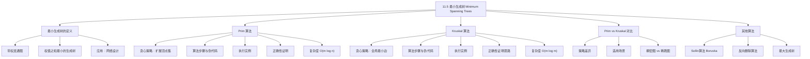

**相关笔记：** [[11.4 生成树]] | [[第12章 布尔代数 — 章节汇总|第12章汇总]]

> [!abstract] 概览
> 本节介绍了==最小生成树（Minimum Spanning Tree, MST）==的概念及其两种经典构造算法。最小生成树是==带权连通图上权值之和最小的生成树==，广泛应用于网络设计、聚类分析等领域。本节详细介绍了两种==贪心算法==：==Prim 算法==（从单个顶点出发，逐步添加与已选顶点关联的最小权边）和==Kruskal 算法==（从全局最小权边出发，逐步添加不形成回路的最小权边），并给出了 Prim 算法正确性的完整证明。两种算法虽然策略不同，但都能保证产生最优解。
>
> - ==最小生成树==：带权连通图中权值之和最小的生成树
> - ==Prim 算法==：贪心策略——每次添加与已选顶点集关联的最小权边，复杂度 $O(m \log n)$
> - ==Kruskal 算法==：贪心策略——每次添加全局最小权边（不形成回路），复杂度 $O(m \log m)$
> - ==贪心算法==：每步做出局部最优选择，但在此问题中能产生全局最优解
> - Prim 适合稠密图，Kruskal 适合稀疏图

---

## 一、知识结构总览



---

## 二、核心思想

> [!tip] 核心思想
> 本节的核心思想是==用贪心策略高效地找到最优的生成树==。最小生成树问题是在所有生成树中找到权值之和最小的那一棵。令人惊讶的是，两种看似简单的贪心策略——Prim 算法的"局部扩展"和 Kruskal 算法的"全局排序"——都能保证产生全局最优解。这体现了贪心算法在某些具有==贪心选择性质==和==最优子结构==的问题上的强大能力。理解最小生成树的关键在于把握"不形成回路"这一约束如何与"最小权值"这一目标完美结合。

### 1. 最小生成树的定义

> [!def] 最小生成树（Minimum Spanning Tree, MST）
> 设 $G$ 是连通的带权无向图。$G$ 的==最小生成树==是 $G$ 的==权值之和最小的生成树==。
>
> - 最小生成树不一定唯一（可能存在多棵权值之和相同的最小生成树）
> - 如果所有边的权值都不同，则最小生成树唯一（练习19）
> - 最小生成树有 $n - 1$ 条边（$n$ 为顶点数）

> [!example] 最小生成树的应用——通信网络设计
> 一家公司计划建设连接五个计算机中心的通信网络。任意两个中心之间可以租用电话线连接，每条线路有月租费用。问题转化为：在带权完全图（顶点为计算机中心，边权为月租费）中找一棵最小生成树，使得任意两个中心之间有路径且总费用最小。

### 2. Prim 算法

> [!def] Prim 算法
> ==Prim 算法==（Prim-Jarnik 算法）是一种构造最小生成树的贪心算法：
>
> 1. 选择一条权值最小的边，将其放入生成树 $T$
> 2. 重复以下步骤 $n - 2$ 次：
>    - 在所有连接 $T$ 中顶点与 $T$ 外顶点的边中，选择权值最小的一条
>    - 将该边及其 $T$ 外端点加入 $T$
> 3. 当 $T$ 有 $n - 1$ 条边时停止
>
> - Prim 算法从"已选顶点集"的角度出发，每次扩展一个顶点
> - 每步选择的边一定连接一个已选顶点和一个未选顶点（保证不形成回路）

> [!def] Prim 算法伪代码
> ```
> procedure Prim(G: weighted connected undirected graph with n vertices)
>     T := a minimum-weight edge
>     for i := 1 to n - 2
>         e := an edge of minimum weight incident to a vertex in T
>             and not forming a simple circuit in T if added to T
>         T := T with e added
>     return T  {T is a minimum spanning tree of G}
> ```

> [!example] Prim 算法执行实例——通信网络
> 五个城市（纽约、芝加哥、旧金山、丹佛、亚特兰大）之间的通信线路费用如下：
> - 纽约—芝加哥：\$1200，纽约—亚特兰大：\$800，纽约—丹佛：\$1600
> - 芝加哥—旧金山：\$1200，芝加哥—亚特兰大：\$700，芝加哥—丹佛：\$800
> - 旧金山—丹佛：\$900，旧金山—亚特兰大：\$2200
> - 丹佛—亚特兰大：\$1400
>
> **Prim 算法执行过程**：
>
> | 步骤 | 选择的边 | 权值 | 已选顶点 |
> |:----:|:---------|:----:|:---------|
> | 1 | {芝加哥, 亚特兰大} | \$700 | 芝加哥, 亚特兰大 |
> | 2 | {亚特兰大, 纽约} | \$800 | + 纽约 |
> | 3 | {芝加哥, 旧金山} | \$1200 | + 旧金山 |
> | 4 | {旧金山, 丹佛} | \$900 | + 丹佛 |
>
> **总费用**：$\$700 + \$800 + \$1200 + \$900 = \$3600$

> [!example] Prim 算法执行实例——一般图
> 对图 $G$（12个顶点 $a$ 到 $l$，带权边）使用 Prim 算法：
>
> | 步骤 | 选择的边 | 权值 |
> |:----:|:---------|:----:|
> | 1 | $\{b, f\}$ | 1 |
> | 2 | $\{a, b\}$ | 2 |
> | 3 | $\{f, j\}$ | 2 |
> | 4 | $\{a, e\}$ | 3 |
> | 5 | $\{i, j\}$ | 3 |
> | 6 | $\{f, g\}$ | 3 |
> | 7 | $\{c, g\}$ | 2 |
> | 8 | $\{c, d\}$ | 1 |
> | 9 | $\{g, h\}$ | 3 |
> | 10 | $\{h, l\}$ | 3 |
> | 11 | $\{k, l\}$ | 1 |
>
> **总权值**：24

> [!thm] Prim 算法的正确性
> Prim 算法对任意连通带权图都能产生最小生成树。
>
> **证明**：
>
> 设 $G$ 是连通带权图。设 Prim 算法依次选择的边为 $e_1, e_2, \ldots, e_{n-1}$。令 $S_k$ 为以 $e_1, e_2, \ldots, e_k$ 为边的树。令 $T$ 为 $G$ 的最小生成树中包含边 $e_1, e_2, \ldots, e_k$ 的树，其中 $k$ 是使得这样的最小生成树存在的最大整数。
>
> 我们要证明 $S = T$，即 $k = n - 1$。
>
> **反证**：假设 $S \neq T$，则 $k < n - 1$。因此 $T$ 包含 $e_1, e_2, \ldots, e_k$，但不包含 $e_{k+1}$。
>
> 考虑图 $T \cup \{e_{k+1}\}$（将 $e_{k+1}$ 添加到 $T$ 中）。因为 $T$ 是连通的且有 $n - 1$ 条边，添加 $e_{k+1}$ 后有 $n$ 条边，边数太多不可能是树，所以 $T \cup \{e_{k+1}\}$ 必含简单回路。
>
> 这个简单回路一定包含 $e_{k+1}$（因为 $T$ 本身无回路）。此外，回路中一定存在一条不属于 $S_{k+1}$ 的边 $e'$（因为 $S_{k+1}$ 是树，如果回路中所有边都在 $S_{k+1}$ 中，则 $S_{k+1}$ 含有回路，矛盾）。
>
> 进一步地，$e'$ 不属于 $S_k$：因为 $e'$ 的一个端点也是 $e_1, \ldots, e_k$ 中某条边的端点（否则 $e'$ 的两个端点都不在 $S_k$ 中，但 $e_{k+1}$ 的两个端点中至少一个在 $S_k$ 中，这与 $e'$ 和 $e_{k+1}$ 在同一回路中矛盾），所以 $e'$ 连接了 $S_k$ 中的一个顶点和 $S_k$ 外的一个顶点。
>
> 令 $T' = (T - \{e'\}) \cup \{e_{k+1}\}$。$T'$ 有 $n - 1$ 条边且无简单回路（因为删除 $e'$ 打破了回路），所以 $T'$ 是树。$T'$ 包含 $e_1, e_2, \ldots, e_k, e_{k+1}$。
>
> 关键观察：$e_{k+1}$ 是 Prim 算法在第 $(k+1)$ 步选择的边，而 $e'$ 在第 $(k+1)$ 步也是可用的（$e'$ 连接 $S_k$ 中的一个顶点和一个不在 $S_k$ 中的顶点，且不形成回路）。因此 $w(e_{k+1}) \leq w(e')$。
>
> 所以 $T'$ 也是最小生成树（其权值之和不大于 $T$ 的权值之和）。但 $T'$ 包含 $e_1, \ldots, e_{k+1}$，这与 $k$ 的最大性矛盾。
>
> 因此 $k = n - 1$，$S = T$，Prim 算法产生最小生成树。
>
> $\blacksquare$

### 3. Kruskal 算法

> [!def] Kruskal 算法
> ==Kruskal 算法==是另一种构造最小生成树的贪心算法：
>
> 1. 将图的所有边按权值从小到大排序
> 2. 初始化 $T$ 为空图
> 3. 依次检查排序后的每条边：
>    - 如果该边加入 $T$ 后不形成简单回路，则将其加入 $T$
>    - 否则跳过
> 4. 当 $T$ 有 $n - 1$ 条边时停止
>
> - Kruskal 算法从"全局最小边"的角度出发，每次选择当前最小的可用边
> - 判断是否形成回路可以用并查集（Union-Find）高效实现
> - Kruskal 算法不要求边连接已选顶点集，只要求不形成回路

> [!def] Kruskal 算法伪代码
> ```
> procedure Kruskal(G: weighted connected undirected graph with n vertices)
>     T := empty graph
>     for i := 1 to n - 1
>         e := any edge in G with smallest weight that does not form
>             a simple circuit when added to T
>         T := T with e added
>     return T  {T is a minimum spanning tree of G}
> ```

> [!example] Kruskal 算法执行实例
> 对与 Prim 算法实例相同的图（12个顶点 $a$ 到 $l$）使用 Kruskal 算法：
>
> | 步骤 | 选择的边 | 权值 |
> |:----:|:---------|:----:|
> | 1 | $\{c, d\}$ | 1 |
> | 2 | $\{k, l\}$ | 1 |
> | 3 | $\{b, f\}$ | 1 |
> | 4 | $\{c, g\}$ | 2 |
> | 5 | $\{a, b\}$ | 2 |
> | 6 | $\{f, j\}$ | 2 |
> | 7 | $\{b, c\}$ | 3 |
> | 8 | $\{j, k\}$ | 3 |
> | 9 | $\{g, h\}$ | 3 |
> | 10 | $\{i, j\}$ | 3 |
> | 11 | $\{a, e\}$ | 3 |
>
> **总权值**：24（与 Prim 算法结果相同）

> [!info] Kruskal 算法的正确性证明思路
> Kruskal 算法的正确性可以用与 Prim 算法类似的方法证明：
> - 设算法依次选择的边为 $e_1, e_2, \ldots, e_{n-1}$
> - 假设 $S_k$（前 $k$ 条边）不是任何最小生成树的子集，取最大的 $k$
> - 在包含 $S_{k-1}$ 的最小生成树 $T$ 中，$e_k$ 不在 $T$ 中
> - $T \cup \{e_k\}$ 含回路，回路中存在不属于 $S_k$ 的边 $e'$
> - 由于 $e_k$ 是当前最小权边且 $e'$ 也在可用边中，$w(e_k) \leq w(e')$
> - 用 $e_k$ 替换 $e'$ 得到新的最小生成树，矛盾

### 4. Prim 与 Kruskal 的对比

> [!tip] Prim vs Kruskal 对比
>
> | 特性 | Prim 算法 | Kruskal 算法 |
> |:-----|:---------|:------------|
> | **贪心策略** | 每次添加与已选顶点集关联的最小权边 | 每次添加全局最小权边（不形成回路） |
> | **扩展方式** | 从一个顶点出发逐步扩展顶点集 | 从最小边出发逐步合并连通分量 |
> | **中间状态** | 始终是一棵连通树 | 始终是一个森林（可能不连通） |
> | **回路判断** | 天然不形成回路（新边连接内外） | 需要显式判断（并查集） |
> | **适用数据结构** | 优先队列（最小堆） | 并查集 + 排序 |
> | **时间复杂度** | $O(m \log n)$ | $O(m \log m)$ |
> | **适合的图** | ==稠密图==（$m$ 接近 $n^2$） | ==稀疏图==（$m$ 远小于 $n^2$） |
> | **发现者** | Jarnik (1930), Prim (1957) | Kruskal (1956) |
> | **同权边处理** | 需要排序以确定选择顺序 | 需要排序以确定选择顺序 |

> [!warning] 选择建议
> - 当图==稠密==时（$m$ 接近 $\binom{n}{2}$），Prim 算法更优
> - 当图==稀疏==时（$m$ 远小于 $\binom{n}{2}$），Kruskal 算法更优
> - 两种算法都是贪心算法，但在此问题上贪心策略能保证全局最优
> - 如果只需要部分最小生成树信息（如前几条最小边），Kruskal 更灵活

### 5. 其他相关算法

> [!info] Sollin 算法（Boruvka 算法）
> ==Sollin 算法==是另一种最小生成树算法，由 Boruvka 于 1926 年提出：
> 1. 初始时每个顶点自成一棵树（森林）
> 2. 对每棵树，同时选择连接该树与另一棵树的最小权边
> 3. 将所有选出的边加入，合并树
> 4. 重复直到只剩一棵树
>
> - Sollin 算法需要 $O(\log n)$ 次迭代
> - 每次迭代至少将树的数目减半
> - 适合并行实现

> [!info] 反向删除算法
> ==反向删除算法==与 Kruskal 算法相反：
> 1. 从原图开始
> 2. 按权值从大到小依次删除边
> 3. 如果删除某条边后图仍然连通，则删除
> 4. 否则保留
> 5. 直到无法删除更多边
>
> - 反向删除算法也能产生最小生成树（练习35）

> [!info] 最大生成树
> ==最大生成树==是权值之和最大的生成树。可以通过修改 Prim 或 Kruskal 算法来构造：将"最小权值"改为"最大权值"即可。

---

## 三、补充理解与易混淆点

### 补充理解

> [!info] 补充1：贪心算法在此问题上的适用性
> [[离散数学/concepts/贪心算法|贪心算法]]通常不能保证全局最优，但最小生成树问题是一个例外。这是因为最小生成树问题同时满足：
> - ==贪心选择性质==：局部最优选择能导致全局最优
> - ==最优子结构==：问题的最优解包含子问题的最优解
>
> Prim 和 Kruskal 算法虽然贪心策略不同，但都利用了这两个性质。Prim 的贪心选择是"与已选集关联的最小边"，Kruskal 的贪心选择是"全局最小的不成回路边"。
> 来源：Cormen, T. H., et al. (2009). *Introduction to Algorithms* (3rd ed.), Section 23.1, Theorem 23.1 (Cut Property).

> [!info] 补充2：最小生成树的唯一性
> - 如果图中所有边的权值都互不相同，则最小生成树==唯一==（练习19）
> - 如果存在权值相同的边，则可能有==多棵==最小生成树
> - 最小生成树的权值之和总是唯一的（即使有多棵不同的最小生成树）
> 来源：Nešetřil, J., Milková, E. & Nešetřilová, H. (2001). "Otakar Borůvka on minimum spanning tree problem". *Discrete Mathematics*, 233(1-3), 3–36.

> [!info] 补充3：最小生成树与最短路径的区别
> - 最小生成树：找一棵树使所有边的权值之和最小（全局优化）
> - 最短路径：找一条路径使起点到终点的权值之和最小（点对优化）
> - 最小生成树中根到某顶点的路径不一定是该两点间的最短路径
> - 例如，Prim 算法实例中，芝加哥到丹佛的最短路径是 \$800（直达），但最小生成树中芝加哥到丹佛需要经过旧金山，费用为 \$1200 + \$900 = \$2100
> 来源：Cormen, T. H., et al. (2009). *Introduction to Algorithms* (3rd ed.), Section 23.2.

> [!info] 补充4：复杂度分析
> - Prim 算法使用优先队列实现时，复杂度为 $O(m \log n)$
> - Kruskal 算法需要排序 $m$ 条边，复杂度为 $O(m \log m)$
> - 当 $m$ 接近 $n^2$ 时（稠密图），$O(m \log n)$ 优于 $O(m \log m)$
> - 当 $m$ 接近 $n$ 时（稀疏图），$O(m \log m)$ 与 $O(m \log n)$ 差别不大，但 Kruskal 实现更简单
> 来源：Prim, R. C. (1957). "Shortest connection networks and some generalizations". *Bell System Technical Journal*, 36(6), 1389–1401.
> 来源：Kruskal, J. B. (1956). "On the shortest spanning subtree of a graph and the traveling salesman problem". *Proceedings of the AMS*, 7(1), 48–50.

### 易混淆点

> [!warning] 误区1：贪心算法总是最优
> - ❌ 认为所有贪心算法都能产生全局最优解
> - ✅ 贪心算法只在具有贪心选择性质的问题上才能保证最优。例如，0-1 背包问题的贪心算法不能保证最优，但分数背包问题可以
> - Prim 和 Kruskal 算法之所以正确，是因为最小生成树问题满足贪心选择性质

> [!warning] 误区2：Prim 和 Kruskal 总是产生相同的生成树
> - ❌ 认为两种算法对同一个图一定产生相同的生成树
> - ✅ 两种算法可能产生==不同的==最小生成树（当存在权值相同的边时），但权值之和一定相同
> - 即使权值都不同，两种算法选择的边顺序也不同，但最终生成树相同

> [!warning] 误区3：最小生成树中两点间路径是最短路径
> - ❌ 认为最小生成树中任意两点间的路径就是最短路径
> - ✅ 最小生成树优化的是==所有边的总权值==，不是==任意两点间的路径权值==
> - 最小生成树中根到某顶点的路径通常不是最短路径
> - 求最短路径应使用 Dijkstra 算法或 BFS

> [!warning] 误区4：最小生成树必须包含最小权边
> - ❌ 认为最小生成树一定包含图中权值最小的那条边
> - ✅ 最小生成树==一定==包含图中权值最小的边（练习18）。如果删除这条边，任何生成树都变得更重
> - 但最小生成树不一定包含第二小、第三小的边

---

## 四、习题精选

> [!todo] 习题概览
> | 题号范围 | 核心考点 | 难度 |
> |---------|---------|------|
> | 1 | 最小生成树的实际应用 | ⭐⭐ |
> | 2-4 | Prim 算法构造最小生成树 | ⭐⭐ |
> | 5-8 | Kruskal 算法构造最小生成树 | ⭐⭐ |
> | 9 | 多个最小生成树的存在性 | ⭐⭐⭐ |
> | 11-12 | 最大生成树 | ⭐⭐ |
> | 13-15 | 最大生成树的构造 | ⭐⭐ |
> | 16 | 第二小的生成树 | ⭐⭐⭐⭐ |
> | 18 | 最小权边必在最小生成树中 | ⭐⭐⭐ |
> | 19 | 权值不同时最小生成树唯一 | ⭐⭐⭐ |
> | 32 | Kruskal 算法正确性证明 | ⭐⭐⭐⭐ |
> | 33 | 回路中最大权边不在最小生成树中 | ⭐⭐⭐⭐ |

### 题1：最小生成树的实际应用

> [!problem] 题目
> 下图表示内华达州一些城镇之间的道路（边权为道路长度）。哪些道路应该铺设路面，使得任意两个城镇之间有铺好的道路相通，且铺设的总长度最小？
> - 城镇：Manhattan, Beatty, Gold Point, Lida, Deep Springs, Dyer, Goldfield, Tonopah, Warm Springs, Oasis, Tonopah
> - 道路及长度：Deep Springs-Oasis (30), Oasis-Dyer (25), Oasis-Silver Peak (70), Dyer-Goldfield (45), Lida-Gold Point (25), Gold Point-Beatty (20), Lida-Goldfield (55), Goldfield-Tonopah (12), Tonopah-Manhattan (10), Tonopah-Warm Springs (40)

> [!faq]- 解答
> 使用 Kruskal 算法，按道路长度从小到大排序：
> 1. Tonopah-Manhattan (10) ✅
> 2. Goldfield-Tonopah (12) ✅
> 3. Lida-Gold Point (25) ✅
> 4. Oasis-Dyer (25) ✅
> 5. Gold Point-Beatty (20) ✅
> 6. Deep Springs-Oasis (30) ✅
> 7. Dyer-Goldfield (45) ✅
> 8. Tonopah-Warm Springs (40) ✅
> 9. Lida-Goldfield (55) — 跳过（会形成回路：Lida-Gold Point-Beatty...-Goldfield-Lida）
> 10. Oasis-Silver Peak (70) ✅
>
> 应铺设的道路：Tonopah-Manhattan, Goldfield-Tonopah, Lida-Gold Point, Oasis-Dyer, Gold Point-Beatty, Deep Springs-Oasis, Dyer-Goldfield, Tonopah-Warm Springs, Oasis-Silver Peak。

### 题2：Prim 算法构造最小生成树

> [!problem] 题目
> 使用 Prim 算法为以下带权图构造最小生成树：
> - 顶点：$a, b, c, d, e, f$
> - 边及权值：$\{a,b\}:1, \{a,c\}:3, \{b,c\}:2, \{b,d\}:3, \{c,d\}:1, \{c,e\}:2, \{d,f\}:3, \{e,f\}:2$

> [!faq]- 解答
> 从权值最小的边开始：
>
> | 步骤 | 选择的边 | 权值 | 已选顶点 |
> |:----:|:---------|:----:|:---------|
> | 1 | $\{a, b\}$ 或 $\{c, d\}$（权值均为 1） | 1 | 假设选 $\{a, b\}$：$a, b$ |
> | 2 | $\{b, c\}$（与 $\{a,b\}$ 关联的最小边，权值 2） | 2 | $+ c$ |
> | 3 | $\{c, d\}$（权值 1） | 1 | $+ d$ |
> | 4 | $\{c, e\}$（权值 2） | 2 | $+ e$ |
> | 5 | $\{e, f\}$（权值 2） | 2 | $+ f$ |
>
> **总权值**：$1 + 2 + 1 + 2 + 2 = 8$

### 题3：Kruskal 算法构造最小生成树

> [!problem] 题目
> 使用 Kruskal 算法为上题中的图构造最小生成树。

> [!faq]- 解答
> 按权值从小到大排序所有边：
>
> | 步骤 | 考虑的边 | 权值 | 是否加入 | 原因 |
> |:----:|:---------|:----:|:--------:|:-----|
> | 1 | $\{a, b\}$ | 1 | ✅ | 不形成回路 |
> | 2 | $\{c, d\}$ | 1 | ✅ | 不形成回路 |
> | 3 | $\{b, c\}$ | 2 | ✅ | 不形成回路 |
> | 4 | $\{c, e\}$ | 2 | ✅ | 不形成回路 |
> | 5 | $\{e, f\}$ | 2 | ✅ | 不形成回路 |
>
> 已选 5 条边（$n - 1 = 5$），算法结束。
>
> **总权值**：$1 + 1 + 2 + 2 + 2 = 8$（与 Prim 算法结果一致）

### 题4：最小权边必在最小生成树中

> [!problem] 题目
> 证明：连通带权图中权值最小的边一定属于某个最小生成树。

> [!faq]- 解答
> 设 $e$ 是图 $G$ 中权值最小的边。假设 $e$ 不属于任何最小生成树。
>
> 设 $T$ 是一棵最小生成树。$T$ 不包含 $e$。将 $e$ 添加到 $T$ 中，得到 $T \cup \{e\}$。因为 $T$ 是树（$n - 1$ 条边），添加 $e$ 后有 $n$ 条边，必然产生简单回路 $C$。
>
> 回路 $C$ 中至少有一条边 $e' \neq e$。因为 $e$ 是 $G$ 中权值最小的边，$w(e) \leq w(e')$。
>
> 令 $T' = (T - \{e'\}) \cup \{e\}$。$T'$ 有 $n - 1$ 条边且无回路（删除 $e'$ 打破了回路 $C$），所以 $T'$ 是生成树。$T'$ 的权值之和为 $w(T) - w(e') + w(e) \leq w(T)$。
>
> 因为 $T$ 是最小生成树，$w(T') \geq w(T)$，所以 $w(T') = w(T)$，即 $T'$ 也是最小生成树且包含 $e$。矛盾。
>
> 因此权值最小的边一定属于某个最小生成树。
>
> $\blacksquare$

### 题5：回路中最大权边不在最小生成树中

> [!problem] 题目
> 设 $G$ 是边权互不相同的带权图。证明：对于 $G$ 的任意简单回路 $C$，$C$ 中权值最大的边不属于 $G$ 的任何最小生成树。

> [!faq]- 解答
> 设 $e$ 是简单回路 $C$ 中权值最大的边。假设 $e$ 属于某个最小生成树 $T$。
>
> 从 $T$ 中删除 $e$，得到森林 $T - \{e\}$，它有两个连通分量，分别包含 $e$ 的两个端点 $u$ 和 $v$。
>
> 考虑回路 $C$ 中从 $u$ 到 $v$ 的路径（不经过 $e$）。这条路径从 $u$ 所在的连通分量出发，在某个点跨越到 $v$ 所在的连通分量。设跨越边为 $f$。
>
> 因为 $f$ 在回路 $C$ 上且 $f \neq e$，而 $e$ 是 $C$ 中权值最大的边，所以 $w(f) < w(e)$。
>
> 注意 $f$ 不在 $T$ 中：如果 $f$ 在 $T$ 中，则 $T$ 中 $u$ 和 $v$ 之间有两条不相交的路径（一条经过 $e$，一条经过 $f$），形成回路，与 $T$ 是树矛盾。
>
> 令 $T' = (T - \{e\}) \cup \{f\}$。$T'$ 是生成树（用 $f$ 连接了两个连通分量），且 $w(T') = w(T) - w(e) + w(f) < w(T)$。
>
> 这与 $T$ 是最小生成树矛盾。因此 $e$ 不属于任何最小生成树。
>
> $\blacksquare$

> [!tip] 解题思路提示
> 最小生成树相关问题的解题方法论：
> 1. **构造最小生成树**：Prim（从顶点扩展）或 Kruskal（从最小边开始），注意同权边的处理
> 2. **正确性证明**：通常采用"交换论证"——假设算法选择的边不在最优解中，用算法的边替换最优解中的边，证明不会增加权值
> 3. **唯一性判断**：所有边权不同 $\Rightarrow$ MST 唯一；有同权边 $\Rightarrow$ 可能有多个 MST
> 4. **最大生成树**：将算法中的"最小"改为"最大"
> 5. **边的必要性**：证明某边必在 MST 中，通常用反证法+交换论证

---

## 五、视频学习指南

> [!info] 视频资源
> | 资源 | 链接 | 对应内容 | 备注 |
> |:-----|:-----|:---------|:-----|
> | Rosen 8e Section 11.5 | [教材原文](https://www.mheducation.com/highered/product/discrete-mathematics-applications-rosen/M9781259676512.html) | 完整定义、定理与例题 | 英文教材 |
> | MIT 6.006 Lecture 16 | [链接](https://www.youtube.com/watch?v=tKwnMS5iKdE) | Prim 算法详解 | 英文，MIT开放课程 |
> | WilliamFiset - MST | [链接](https://www.youtube.com/watch?v=eB61rDfgIv4) | Kruskal 算法可视化 | 英文，含代码实现 |
> | 3Blue1Brown - MST | [链接](https://www.youtube.com/watch?v=cplfcVZ5g10) | 最小生成树直觉理解 | 英文，动画演示 |

---

## 六、教材原文

> [!quote] 教材原文
> "A minimum spanning tree in a connected weighted graph is a spanning tree that has the smallest possible sum of weights of its edges."
>
> "Both are greedy algorithms. Recall from Section 3.1 that a greedy algorithm is a procedure that makes an optimal choice at each of its steps. Optimizing at each step does not guarantee that the optimal overall solution is produced. However, the two algorithms presented in this section for constructing minimum spanning trees are greedy algorithms that do produce optimal solutions."
>
> "In Prim's algorithm edges of minimum weight that are incident to a vertex already in the tree, and not forming a circuit, are chosen; whereas in Kruskal's algorithm edges of minimum weight that are not necessarily incident to a vertex already in the tree, and that do not form a circuit, are chosen."

---

## 参见 Wiki

- [[离散数学/concepts/树图]] -- 树的基本定义与性质
- [[离散数学/concepts/贪心算法]] -- 贪心算法的设计思想（第3章）
- [[离散数学/concepts/算法复杂度]] -- 算法复杂度分析（第3章）
- [[离散数学/concepts/加权图]] -- 带权图的定义（第10章）
- [[离散数学/concepts/连通图]] -- 连通性的定义（第10章）

#学习/离散数学/树
