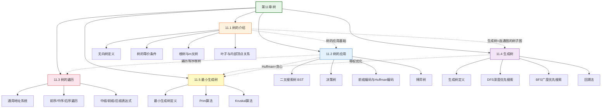

# 第11章 树 — 章节汇总

> [!abstract] 概览
> 第11章系统介绍了==树==（Tree）这一重要的离散数学结构。全章从树的基本定义与等价刻画出发（11.1），建立根树、m叉树等概念体系；然后展示树在计算机科学中的四大经典应用——==二叉搜索树==、==决策树==、==前缀编码/Huffman编码==、博弈树（11.2）；接着讨论树的==遍历算法==——前序、中序、后序遍历及其与表达式表示的对应关系（11.3）；在此基础上引入==生成树==概念及 DFS/BFS 构造算法（11.4）；最后聚焦带权图上的==最小生成树==问题，介绍 Prim 算法和 Kruskal 算法（11.5）。全章体现了从"基本定义→应用场景→遍历算法→生成树→优化问题"的递进知识链条，与第10章图论紧密衔接（树是特殊的连通无回路图），为第12章布尔代数和第13章形式语言与自动机奠定基础。

---

## 全章知识框架



---

## 各节核心知识点汇总

| 小节 | 核心概念 | 关键公式/定理 | 与前后节的关联 |
|:-----|:---------|:-------------|:---------------|
| 11.1 树的介绍 | 无向树、根树、m叉树、有序根树 | $e = v - 1$；$l = (m-1)i + 1$（满m叉树）；$l \leq m^h$；$h \geq \lceil\log_m l\rceil$ | 全章基础，定义树的形式化结构；与第10章图论衔接（树是连通无回路图） |
| 11.2 树的应用 | BST、决策树、Huffman编码、博弈树 | 排序下界 $\Omega(n\log n)$；Huffman最优性；Minimax定理 | 11.1 树结构的直接应用；BST 是 11.3 遍历的重要实例 |
| 11.3 树的遍历 | 前序/中序/后序遍历、中缀/前缀/后缀表达式 | 遍历的递归定义；表达式树与三种遍历的对应 | 11.2 BST 的中序遍历产生有序序列；遍历算法是 11.4 DFS/BFS 的树版本 |
| 11.4 生成树 | 生成树、DFS、BFS、回溯法 | 连通 $\Leftrightarrow$ 存在生成树；DFS/BFS $O(e)$ | 11.1 树定义在一般图上的应用；DFS 是 11.5 Prim 算法的基础 |
| 11.5 最小生成树 | Prim 算法、Kruskal 算法 | Prim $O(n^2)$；Kruskal $O(e\log e)$；贪心正确性 | 11.4 生成树在带权图上的优化；贪心策略与 11.2 Huffman 编码一致 |

---

## 学习脉络

```
树的基本定义与等价条件（11.1）— 掌握树的5种等价刻画，理解根树/m叉树的层次结构
  ↓
树的应用（11.2）— BST 是最重要的应用（查找/插入/删除），Huffman编码展示贪心策略的威力
  ↓
树的遍历（11.3）— 前序/中序/后序是树算法的核心操作，表达式转换是高频考点
  ↓
生成树（11.4）— DFS/BFS 是图论最重要的遍历算法，回溯法是搜索问题的通用框架
  ↓
最小生成树（11.5）— Prim/Kruskal 是贪心算法的经典应用，必须手动模拟完整实例
```

**学习建议**：11.1 节是全章的基石——务必彻底掌握树的 5 种等价刻画条件（尤其是 $e=v-1$ 的证明）；11.2 节的==Huffman 编码==需要手动模拟一个完整构造过程，==排序下界== $\Omega(n\log n)$ 的决策树证明是重要理论结果；11.3 节的==三种遍历==必须能在具体树上手动执行，并理解它们与表达式表示的对应关系；11.4 节的==DFS/BFS==是图论最重要的算法之一，需要理解树边/回边的区别；11.5 节的==Prim/Kruskal 算法==必须各手动模拟一个完整实例，理解贪心正确性证明的核心思想（交换论证）。

---

## 跨节综合复习题

> [!problem] 综合复习题 1（跨 11.1 / 11.2 / 11.3）
> **题目：** (a) 一棵满二叉树有 15 个叶子，求其高度和内部顶点数。
> (b) 将中缀表达式 $(x + y) \times (z - w) / v$ 转换为前缀和后缀表达式。
> (c) 构造一棵包含 4 个叶子（频率分别为 5, 7, 10, 20）的最优 Huffman 树，并计算加权路径长度。

> [!faq]- 解答
> **(a)** 满二叉树 $m=2$，叶子数 $l=15$。
>
> 内部顶点数：$l = (m-1)i + 1 = i + 1$，故 $i = 14$。
>
> 高度：$h \geq \lceil\log_2 l\rceil = \lceil\log_2 15\rceil = 4$。
>
> 总顶点数：$n = l + i = 15 + 14 = 29$。✅
>
> **(b)** 构建表达式树：根为 `/`，左子树为 `×`，右子树为 `v`。`×` 的左子树为 `+`（左 $x$ 右 $y$），右子树为 `-`（左 $z$ 右 $w$）。
>
> 前序遍历：`/ × + x y - z w v`
>
> 后序遍历：`x y + z w - × v /`
>
> **(c)** Huffman 算法：
>
> 步骤 1：合并 5 和 7 → 12，剩余 {10, 12, 20}
> 步骤 2：合并 10 和 12 → 22，剩余 {20, 22}
> 步骤 3：合并 20 和 22 → 42
>
> 加权路径长度 WPL = $(20+22) \times 1 + 10 \times 2 + (5+7) \times 3 = 42 + 20 + 36 = 98$。
>
> $\blacksquare$

> [!problem] 综合复习题 2（跨 11.4 / 11.5）
> **题目：** 对以下带权图求最小生成树，分别用 Prim 算法和 Kruskal 算法。
>
> 顶点集 $V = \{a, b, c, d\}$，边权：$w(a,b)=4, w(a,c)=2, w(a,d)=5, w(b,c)=1, w(b,d)=6, w(c,d)=3$。

> [!faq]- 解答
> **Prim 算法**（从 $a$ 出发）：
>
> | 步骤 | $S$ | 候选边 | 选择 | 最小权 |
> |:-----|:----|:-------|:-----|:------|
> | 1 | {a} | (a,b)=4, (a,c)=2, (a,d)=5 | (a,c) | 2 |
> | 2 | {a,c} | (a,b)=4, (c,b)=1, (c,d)=3 | (c,b) | 1 |
> | 3 | {a,b,c} | (a,d)=5, (b,d)=6, (c,d)=3 | (c,d) | 3 |
>
> MST 边集：$\{(a,c), (c,b), (c,d)\}$，总权 = $2+1+3 = 6$。
>
> **Kruskal 算法**：
>
> 按权排序：(b,c)=1, (a,c)=2, (c,d)=3, (a,b)=4, (a,d)=5, (b,d)=6
>
> | 步骤 | 考虑边 | 权 | 是否加入 | 原因 |
> |:-----|:------|:---|:--------|:-----|
> | 1 | (b,c) | 1 | ✅ | b,c 不连通 |
> | 2 | (a,c) | 2 | ✅ | a,c 不连通 |
> | 3 | (c,d) | 3 | ✅ | c,d 不连通 |
> | 4 | (a,b) | 4 | ❌ | a,b 已通过 a-c-b 连通 |
> | 5 | (a,d) | 5 | ❌ | a,d 已连通 |
> | 6 | (b,d) | 6 | ❌ | b,d 已连通 |
>
> MST 边集：$\{(b,c), (a,c), (c,d)\}$，总权 = $1+2+3 = 6$。✅
>
> $\blacksquare$

---

## 笔记索引

| 小节 | 笔记链接 | 核心主题 |
|:-----|:---------|:---------|
| 11.1 | [[11.1 树的介绍]] | 树的定义、等价条件、根树、m叉树、叶子与内部顶点关系 |
| 11.2 | [[11.2 树的应用]] | BST、决策树、排序下界、Huffman编码、博弈树 |
| 11.3 | [[11.3 树的遍历]] | 前序/中序/后序遍历、中缀/前缀/后缀表达式 |
| 11.4 | [[11.4 生成树]] | 生成树、DFS、BFS、回溯法 |
| 11.5 | [[11.5 最小生成树]] | Prim算法、Kruskal算法、贪心正确性 |

#学习/离散数学/树
