**相关笔记：** [[第11章 树 — 章节汇总|第11章汇总]] | [[12.2 布尔函数的表示]]

> [!abstract] 概览
> 本节系统介绍了==布尔代数（Boolean algebra）==的基本概念，包括布尔运算（补、布尔和、布尔积）、布尔变量、布尔表达式与布尔函数的定义。随后给出了布尔代数中最重要的==12 条恒等式==（同一律、支配律、交换律、结合律、分配律、补律、德摩根律、对合律、零元律、幺元律、幂等律、吸收律），并介绍了==对偶性（duality）==原理。最后给出了布尔代数的==公理化定义==（Huntington 公理），并展示了集合代数、命题逻辑等具体实例。
>
> - ==布尔代数==：在集合 $\{0, 1\}$ 上定义补 $\bar{\phantom{x}}$、布尔和 $+$、布尔积 $\cdot$ 三种运算的代数系统
> - ==布尔变量==：只取值 $0$ 或 $1$ 的变量
> - ==布尔表达式==：由布尔变量和布尔运算递归定义的表达式
> - ==布尔函数==：从 $\{0, 1\}^n$ 到 $\{0, 1\}$ 的函数，$n$ 为度（degree）
> - ==布尔恒等式==：布尔代数中成立的 12 条基本等式
> - ==对偶（dual）==：将布尔表达式中的 $+$ 与 $\cdot$ 互换、$0$ 与 $1$ 互换得到的表达式
> - ==对偶性原理==：若一个布尔恒等式成立，则其对偶恒等式也成立
> - ==Huntington 公理==：布尔代数的抽象公理化定义（同一律、补律、结合律、交换律、分配律）

---

## 一、知识结构总览

```mermaid
graph TB
    A["12.1 布尔函数 Boolean Functions"] --> B["布尔运算的定义"]
    A --> C["布尔变量与布尔表达式"]
    A --> D["布尔函数"]
    A --> E["布尔恒等式"]
    A --> F["对偶性原理"]
    A --> G["布尔代数的公理化定义"]

    B --> B1["补（complement）：x̄ = 1−x"]
    B --> B2["布尔和（OR）：x+y = max(x,y)"]
    B --> B3["布尔积（AND）：x·y = min(x,y)"]
    B --> B4["运算优先级：补 > 积 > 和"]

    C --> C1["递归定义"]
    C --> C2["与命题逻辑的对应关系"]

    D --> D1["度 n 的布尔函数：{0,1}ⁿ → {0,1}"]
    D --> D2["函数的相等与等价表达式"]
    D --> D3["布尔和 F+G 与布尔积 FG"]
    D --> D4["n 度布尔函数的个数：2^(2ⁿ)"]

    E --> E1["同一律 / 支配律"]
    E --> E2["交换律 / 结合律"]
    E --> E3["分配律（两条）"]
    E --> E4["德摩根律（两条）"]
    E --> E5["补律 / 对合律"]
    E --> E6["幂等律 / 吸收律"]

    F --> F1["对偶的构造方法"]
    F --> F2["对偶性原理"]
    F --> F3["利用对偶性推导新恒等式"]

    G --> G1["Huntington 公理（5 组性质）"]
    G --> G2["实例：{0,1} 上的布尔代数"]
    G --> G3["实例：集合的幂集代数"]
    G --> G4["实例：命题逻辑代数"]
    G --> G5["格论视角：有补分配格"]
```

---

## 二、核心思想

> [!tip] 核心思想
> 本节的核心思想是==在集合 $\{0, 1\}$ 上建立一套完整的代数运算体系==。布尔代数只有两个元素 $0$ 和 $1$，却通过补、和、积三种运算衍生出丰富的代数结构。它与[[离散数学/concepts/命题逻辑|命题逻辑]]和[[离散数学/concepts/集合运算|集合运算]]有着深刻的同构关系——三者本质上是同一套代数规律在不同数学对象上的体现。掌握布尔代数的关键在于理解这三套系统之间的翻译规则，以及利用==对偶性原理==从已知恒等式高效推导新恒等式。

### 1. 布尔运算的定义

> [!def] 布尔运算
> 在集合 $B = \{0, 1\}$ 上定义三种基本运算：
>
> **（1）补（complement）**：记为 $\bar{x}$（或 $x'$），定义为
> $$\bar{0} = 1, \quad \bar{1} = 0$$
>
> **（2）布尔和（Boolean sum / OR）**：记为 $x + y$，定义为
> $$1 + 1 = 1, \quad 1 + 0 = 1, \quad 0 + 1 = 1, \quad 0 + 0 = 0$$
>
> **（3）布尔积（Boolean product / AND）**：记为 $x \cdot y$（或简写为 $xy$），定义为
> $$1 \cdot 1 = 1, \quad 1 \cdot 0 = 0, \quad 0 \cdot 1 = 0, \quad 0 \cdot 0 = 0$$
>
> **运算优先级**（无括号时）：先计算所有补，再计算所有布尔积，最后计算所有布尔和。

> [!example] 计算布尔表达式的值
> 求 $1 \cdot 0 + \overline{(0 + 1)}$ 的值。
>
> **解**：
> $$1 \cdot 0 + \overline{(0 + 1)} = 0 + \bar{1} = 0 + 0 = 0$$
>
> 步骤：(1) 先算括号内 $0 + 1 = 1$；(2) 再算补 $\bar{1} = 0$；(3) 再算积 $1 \cdot 0 = 0$；(4) 最后算和 $0 + 0 = 0$。

> [!info] 布尔运算与逻辑运算的对应
> 布尔运算与第 1 章的命题逻辑运算存在精确的对应关系：
>
> | 布尔运算 | 逻辑运算 | 对应关系 |
> |:---------|:---------|:---------|
> | 补 $\bar{x}$ | 否定 $\neg p$ | $0 \leftrightarrow F$，$1 \leftrightarrow T$ |
> | 布尔和 $x + y$ | 析取 $p \vee q$ | $0 \leftrightarrow F$，$1 \leftrightarrow T$ |
> | 布尔积 $x \cdot y$ | 合取 $p \wedge q$ | $0 \leftrightarrow F$，$1 \leftrightarrow T$ |
>
> 因此，布尔代数中的恒等式可以直接翻译为[[离散数学/concepts/逻辑等价|逻辑等价式]]，反之亦然。

### 2. 布尔变量、布尔表达式与布尔函数

> [!def] 布尔变量与布尔表达式
> - ==布尔变量==（Boolean variable）：只取值 $0$ 或 $1$ 的变量
> - ==布尔表达式==（Boolean expression）：由布尔变量和布尔运算递归定义：
>   - $0, 1, x_1, x_2, \ldots, x_n$ 是布尔表达式
>   - 若 $E_1$ 和 $E_2$ 是布尔表达式，则 $\bar{E_1}$、$(E_1 \cdot E_2)$、$(E_1 + E_2)$ 也是布尔表达式

> [!def] 布尔函数
> 设 $B = \{0, 1\}$，则 $B^n = \{(x_1, x_2, \ldots, x_n) \mid x_i \in B,\ 1 \leq i \leq n\}$ 是所有 $n$ 元 $0$-$1$ 元组构成的集合。从 $B^n$ 到 $B$ 的函数称为==$n$ 度布尔函数==（Boolean function of degree $n$）。
>
> 每个布尔表达式表示一个布尔函数，其值通过将 $0$ 和 $1$ 代入变量求得。

> [!example] 布尔函数的函数表
> $F(x, y) = x\bar{y}$ 是一个 2 度布尔函数，其函数表为：
>
> | $x$ | $y$ | $F(x,y)$ |
> |:---:|:---:|:--------:|
> | 1 | 1 | 0 |
> | 1 | 0 | 1 |
> | 0 | 1 | 0 |
> | 0 | 0 | 0 |

> [!example] 三元布尔函数
> $F(x, y, z) = xy + \bar{z}$ 的函数表为：
>
> | $x$ | $y$ | $z$ | $xy$ | $\bar{z}$ | $F(x,y,z)$ |
> |:---:|:---:|:---:|:----:|:--------:|:-----------:|
> | 1 | 1 | 1 | 1 | 0 | 1 |
> | 1 | 1 | 0 | 1 | 1 | 1 |
> | 1 | 0 | 1 | 0 | 0 | 0 |
> | 1 | 0 | 0 | 0 | 1 | 1 |
> | 0 | 1 | 1 | 0 | 0 | 0 |
> | 0 | 1 | 0 | 0 | 1 | 1 |
> | 0 | 0 | 1 | 0 | 0 | 0 |
> | 0 | 0 | 0 | 0 | 1 | 1 |

> [!thm] $n$ 度布尔函数的个数
> $n$ 度布尔函数共有 $2^{2^n}$ 个。
>
> **证明**：$B^n$ 中共有 $2^n$ 个不同的 $n$ 元组。对每个 $n$ 元组，函数值可以独立地取 $0$ 或 $1$，因此由乘法原理，不同的赋值方式共有 $2^{2^n}$ 种。
>
> $\blacksquare$

> [!def] 布尔函数的运算
> 设 $F$ 和 $G$ 是 $n$ 度布尔函数，定义：
> - ==布尔和==：$(F + G)(x_1, \ldots, x_n) = F(x_1, \ldots, x_n) + G(x_1, \ldots, x_n)$
> - ==布尔积==：$(FG)(x_1, \ldots, x_n) = F(x_1, \ldots, x_n) \cdot G(x_1, \ldots, x_n)$
> - ==补==：$\bar{F}(x_1, \ldots, x_n) = \overline{F(x_1, \ldots, x_n)}$
>
> 两个布尔函数 $F$ 和 $G$ ==相等==当且仅当对所有 $(b_1, \ldots, b_n) \in B^n$，$F(b_1, \ldots, b_n) = G(b_1, \ldots, b_n)$。表示同一函数的不同布尔表达式称为==等价的==（equivalent）。

### 3. 布尔恒等式

> [!thm] 布尔代数的 12 条核心恒等式
> 以下恒等式对所有布尔变量 $x, y, z$ 成立（其中 $x \cdot y$ 简写为 $xy$）：
>
> | 恒等式名称 | 恒等式 |
> |:-----------|:-------|
> | ==对合律==（Double complement） | $\bar{\bar{x}} = x$ |
> | ==幂等律==（Idempotent laws） | $x + x = x$，$xx = x$ |
> | ==同一律==（Identity laws） | $x + 0 = x$，$x \cdot 1 = x$ |
> | ==支配律==（Domination laws） | $x + 1 = 1$，$x \cdot 0 = 0$ |
> | ==交换律==（Commutative laws） | $x + y = y + x$，$xy = yx$ |
> | ==结合律==（Associative laws） | $x + (y + z) = (x + y) + z$，$x(yz) = (xy)z$ |
> | ==分配律==（Distributive laws） | $x + yz = (x + y)(x + z)$，$x(y + z) = xy + xz$ |
> | ==德摩根律==（De Morgan's laws） | $\overline{xy} = \bar{x} + \bar{y}$，$\overline{x + y} = \bar{x}\bar{y}$ |
> | ==吸收律==（Absorption laws） | $x + xy = x$，$x(x + y) = x$ |
> | ==幺元律==（Unit property） | $x + \bar{x} = 1$ |
> | ==零元律==（Zero property） | $x\bar{x} = 0$ |
>
> 每条恒等式都可以通过穷举所有变量取值组合来验证。

> [!example] 用真值表验证分配律
> 验证 $x(y + z) = xy + xz$：
>
> | $x$ | $y$ | $z$ | $y+z$ | $x(y+z)$ | $xy$ | $xz$ | $xy+xz$ |
> |:---:|:---:|:---:|:-----:|:--------:|:----:|:----:|:--------:|
> | 1 | 1 | 1 | 1 | 1 | 1 | 1 | 1 |
> | 1 | 1 | 0 | 1 | 1 | 1 | 0 | 1 |
> | 1 | 0 | 1 | 1 | 1 | 0 | 1 | 1 |
> | 1 | 0 | 0 | 0 | 0 | 0 | 0 | 0 |
> | 0 | 1 | 1 | 1 | 0 | 0 | 0 | 0 |
> | 0 | 1 | 0 | 1 | 0 | 0 | 0 | 0 |
> | 0 | 0 | 1 | 1 | 0 | 0 | 0 | 0 |
> | 0 | 0 | 0 | 0 | 0 | 0 | 0 | 0 |
>
> 第 5 列与第 8 列完全一致，故恒等式成立。

> [!example] 利用恒等式证明吸收律
> 证明 $x(x + y) = x$（吸收律）。
>
> **证明**：
> $$x(x + y) = (x + 0)(x + y) \quad \text{（同一律：$x = x + 0$）}$$
> $$= x + 0 \cdot y \quad \text{（分配律：$x + yz = (x+y)(x+z)$ 的逆向应用）}$$
> $$= x + y \cdot 0 \quad \text{（交换律）}$$
> $$= x + 0 \quad \text{（支配律：$y \cdot 0 = 0$）}$$
> $$= x \quad \text{（同一律）}$$
>
> $\blacksquare$

> [!warning] 注意：布尔分配律有两条
> 普通代数中只有 $x(y + z) = xy + xz$（乘法对加法的分配律）。但在布尔代数中，==加法对乘法的分配律也成立==：
> $$x + yz = (x + y)(x + z)$$
> 这条分配律在普通代数中不成立（例如 $1 + 2 \times 3 = 7 \neq (1+2)(1+3) = 12$），是布尔代数区别于普通代数的重要特征之一。

### 4. 对偶性原理

> [!def] 对偶（Dual）
> 布尔表达式的==对偶==（dual）通过以下变换得到：
> - 将所有 $+$ 替换为 $\cdot$，将所有 $\cdot$ 替换为 $+$
> - 将所有 $0$ 替换为 $1$，将所有 $1$ 替换为 $0$
>
> 布尔函数 $F$ 的对偶函数记为 $F^d$，即用 $F$ 的布尔表达式的对偶所表示的函数。$F^d$ 不依赖于表示 $F$ 的具体布尔表达式的选择。

> [!example] 求布尔表达式的对偶
> - $x(y + 0)$ 的对偶为 $x + (y \cdot 1)$
> - $x \cdot 1 + (y + z)$ 的对偶为 $(x + 0)(yz)$

> [!thm] 对偶性原理（Duality Principle）
> 若一个布尔恒等式成立，则将其两边同时取对偶得到的恒等式也成立。
>
> **推论**：表中的 12 条恒等式成对出现（对合律、幺元律、零元律除外，它们是自对偶的）。例如，吸收律 $x(x+y) = x$ 的对偶 $x + xy = x$ 也成立。

> [!example] 利用对偶性推导新恒等式
> 已知吸收律 $x(x + y) = x$ 成立，由对偶性原理，两边取对偶：
> - 左边 $x(x + y)$ 的对偶为 $x + xy$
> - 右边 $x$ 的对偶为 $x$
>
> 因此 $x + xy = x$ 也成立（这是另一条吸收律）。

### 5. 布尔代数的公理化定义

> [!def] 布尔代数的抽象定义（Huntington 公理）
> ==布尔代数==是一个集合 $B$，配备两个二元运算 $\vee$ 和 $\wedge$、两个特异元素 $0$ 和 $1$、以及一个一元运算 $\bar{\phantom{x}}$（补），满足以下性质（对所有 $x, y, z \in B$）：
>
> | 性质 | 等式 |
> |:-----|:-----|
> | 同一律（Identity laws） | $x \vee 0 = x$，$x \wedge 1 = x$ |
> | 补律（Complement laws） | $x \vee \bar{x} = 1$，$x \wedge \bar{x} = 0$ |
> | 结合律（Associative laws） | $(x \vee y) \vee z = x \vee (y \vee z)$，$(x \wedge y) \wedge z = x \wedge (y \wedge z)$ |
> | 交换律（Commutative laws） | $x \vee y = y \vee x$，$x \wedge y = y \wedge x$ |
> | 分配律（Distributive laws） | $x \vee (y \wedge z) = (x \vee y) \wedge (x \vee z)$，$x \wedge (y \vee z) = (x \wedge y) \vee (x \wedge z)$ |
>
> 从这 5 组公理出发，可以推导出幂等律、支配律、德摩根律、对合律、吸收律等其他所有布尔恒等式。

> [!example] 布尔代数的三个经典实例
>
> **实例 1：二值布尔代数 $\langle \{0, 1\}, +, \cdot, \bar{\phantom{x}}, 0, 1 \rangle$**
> - 这是本章主要讨论的对象，$\vee$ 对应 $+$（OR），$\wedge$ 对应 $\cdot$（AND）
>
> **实例 2：集合的幂集代数 $\langle \mathcal{P}(U), \cup, \cap, \bar{\phantom{A}}, \emptyset, U \rangle$**
> - $\vee$ 对应 $\cup$（并集），$\wedge$ 对应 $\cap$（交集），补对应集合补
> - $0$ 对应 $\emptyset$，$1$ 对应 $U$
>
> **实例 3：命题逻辑代数 $\langle \text{命题集合}, \vee, \wedge, \neg, F, T \rangle$**
> - $\vee$ 对应 $\vee$（析取），$\wedge$ 对应 $\wedge$（合取），补对应 $\neg$（否定）
> - $0$ 对应 $F$（假），$1$ 对应 $T$（真）

> [!info] 格论视角下的布尔代数
> 布尔代数也可以通过格论来定义。一个==格==（lattice）是偏序集，其中每对元素都有最小上界（lub）和最大下界（glb）。若格 $L$ 满足以下两个条件，则 $L$ 是布尔代数：
> 1. ==有补性==（complemented）：$L$ 有最小元 $0$ 和最大元 $1$，且每个元素 $x$ 都有补元 $\bar{x}$，使得 $x \vee \bar{x} = 1$ 且 $x \wedge \bar{x} = 0$
> 2. ==分配性==（distributive）：对所有 $x, y, z \in L$，两条分配律成立
>
> 即：布尔代数 == 有补分配格（complemented distributive lattice）。

---

## 三、补充理解与易混淆点

### 补充理解

> [!info] 补充1：布尔代数的历史渊源
> 布尔代数由英国数学家==George Boole== 于 1854 年在《思维的规律研究》（*An Investigation of the Laws of Thought*）中首次系统提出。Boole 的原始目标是建立一套代数系统来形式化人类的逻辑推理过程。他将逻辑命题的真假映射为 $1$ 和 $0$，将"且""或""非"映射为代数运算，从而将逻辑推理转化为代数运算。这一思想在 1938 年被==Claude Shannon== 在其硕士论文中应用于继电器电路的设计，开创了数字电路设计的理论基础，也使布尔代数成为计算机科学的核心数学工具。
>
> > 来源：Boole, G. (1854). An Investigation of the Laws of Thought. Walton and Maberly.

> [!info] 补充2：对偶性原理的深层意义
> 对偶性原理是布尔代数中最优美的结构性质之一。它意味着布尔代数具有一种"镜像对称"——$+$ 与 $\cdot$、$0$ 与 $1$ 在代数结构中扮演着完全对称的角色。这种对称性的根源在于布尔代数的公理化定义中，$\vee$ 和 $\wedge$ 的地位是完全平等的（两条分配律同时成立、两条补律同时成立等）。对偶性原理的实用价值在于：==每证明一条恒等式，就自动获得一条新的恒等式==，将证明工作量减半。在电路设计中，这意味着每个"与-或"电路都有一个对应的"或-与"电路。
>
> > 来源：Rosen, K. H. (2019). Discrete Mathematics and Its Applications (8th ed.), McGraw-Hill, Section 12.1.

### 易混淆点

> [!warning] 误区1：布尔加法 $\neq$ 普通加法
> - ❌ 认为 $1 + 1 = 2$（普通算术）
> - ✅ 在布尔代数中 $1 + 1 = 1$（布尔和是逻辑"或"，不是数值加法）
> - 布尔和 $x + y$ 实际上是 $\max(x, y)$，布尔积 $xy$ 实际上是 $\min(x, y)$

> [!warning] 误区2：布尔分配律的两条都要记住
> - ❌ 只记住 $x(y + z) = xy + xz$，忘记 $x + yz = (x + y)(x + z)$
> - ✅ 布尔代数中两条分配律都成立，这是布尔代数区别于普通代数的关键特征
> - 第二条分配律可以通过对偶性原理从第一条自动得到

> [!warning] 误区3：对偶 $\neq$ 取补
> - ❌ 将对偶（dual）与补（complement）混淆
> - ✅ 对偶是结构性变换（$+ \leftrightarrow \cdot$，$0 \leftrightarrow 1$），补是逻辑取反（$\bar{0} = 1$，$\bar{1} = 0$）
> - 例如，$x + y$ 的对偶是 $xy$，而 $\overline{x + y} = \bar{x}\bar{y}$（德摩根律），两者完全不同

---

## 四、习题精选

> [!todo] 习题概览
> | 题号范围 | 核心考点 | 难度 |
> |---------|---------|------|
> | 1 | 布尔表达式求值 | ⭐ |
> | 2 | 求解布尔方程 | ⭐ |
> | 5-6 | 构造布尔函数的函数表 | ⭐⭐ |
> | 7-8 | 用 3-立方体表示布尔函数 | ⭐⭐ |
> | 10 | 布尔函数的计数 | ⭐ |
> | 11 | 利用恒等式证明吸收律 | ⭐⭐⭐ |
> | 14-23 | 用真值表验证布尔恒等式 | ⭐⭐ |
> | 28 | 求布尔表达式的对偶 | ⭐⭐ |
> | 35-42 | 从 Huntington 公理推导其他性质 | ⭐⭐⭐ |

### 题1：布尔表达式求值

> [!problem] 题目
> 求以下布尔表达式的值：(a) $1 \cdot 0$；(b) $1 + 1$；(c) $0 \cdot 0$；(d) $\overline{(1 + 0)}$。

> [!faq]- 解答
> - (a) $1 \cdot 0 = 0$（布尔积：有 $0$ 则为 $0$）
> - (b) $1 + 1 = 1$（布尔和：有 $1$ 则为 $1$）
> - (c) $0 \cdot 0 = 0$
> - (d) $\overline{(1 + 0)} = \bar{1} = 0$

### 题2：布尔方程求解

> [!problem] 题目
> 求满足以下方程的布尔变量 $x$ 的值（若存在）：(a) $x \cdot 1 = 0$；(b) $x + \bar{x} = 0$；(c) $x \cdot 1 = x$；(d) $x \cdot \bar{x} = 1$。

> [!faq]- 解答
> - (a) $x \cdot 1 = x = 0$，所以 $x = 0$
> - (b) 由幺元律，$x + \bar{x} = 1$ 对所有 $x$ 成立，不可能等于 $0$。**无解**
> - (c) 由同一律，$x \cdot 1 = x$ 对所有 $x$ 成立。**$x$ 可以是 $0$ 或 $1$**
> - (d) 由零元律，$x \cdot \bar{x} = 0$ 对所有 $x$ 成立，不可能等于 $1$。**无解**

### 题3：布尔函数的计数

> [!problem] 题目
> 7 度布尔函数共有多少个？

> [!faq]- 解答
> 由定理，$n$ 度布尔函数共有 $2^{2^n}$ 个。
>
> 当 $n = 7$ 时：$2^{2^7} = 2^{128}$ 个。
>
> 这是一个天文数字，远超可观测宇宙中的原子数量（约 $10^{80}$）。

### 题4：利用恒等式证明吸收律

> [!problem] 题目
> 仅使用表 5 中的其他恒等式，证明吸收律 $x + xy = x$。

> [!faq]- 解答
> **证明**：
> $$x + xy = x \cdot 1 + xy \quad \text{（同一律：$x = x \cdot 1$）}$$
> $$= x(1 + y) \quad \text{（分配律：提取公因子 $x$）}$$
> $$= x \cdot 1 \quad \text{（支配律：$1 + y = 1$）}$$
> $$= x \quad \text{（同一律）}$$
>
> $\blacksquare$

### 题5：求对偶并验证

> [!problem] 题目
> (a) 求布尔表达式 $x\bar{y} + \bar{x}y$ 的对偶。(b) 求布尔表达式 $x(yz + \bar{x})$ 的对偶。

> [!faq]- 解答
> (a) 将 $+ \leftrightarrow \cdot$ 互换（此式中无 $0$ 和 $1$）：
> $$\text{dual}(x\bar{y} + \bar{x}y) = (x + \bar{y})(\bar{x} + y)$$
>
> (b) 将 $+ \leftrightarrow \cdot$ 互换：
> $$\text{dual}(x(yz + \bar{x})) = x + (y + z)\bar{x}$$

> [!tip] 解题思路提示
> 布尔代数基础问题的解题方法论：
> 1. **布尔表达式求值**：严格按照优先级（补 > 积 > 和）逐步计算
> 2. **验证恒等式**：穷举所有变量取值组合，比较两边是否一致
> 3. **利用恒等式证明**：从目标出发逆向分析，选择合适的恒等式逐步化简
> 4. **求对偶**：系统地执行 $+ \leftrightarrow \cdot$ 和 $0 \leftrightarrow 1$ 的替换
> 5. **布尔函数计数**：直接使用公式 $2^{2^n}$

---

## 五、视频学习指南

> [!info] 视频资源
> | 资源 | 链接 | 对应内容 | 备注 |
> |:-----|:-----|:---------|:-----|
> | Rosen 8e Section 12.1 | [教材原文](https://www.mheducation.com/highered/product/discrete-mathematics-applications-rosen/M9781259676512.html) | 完整定义、定理与例题 | 英文教材 |
> | Neso Academy - Boolean Algebra | [链接](https://www.youtube.com/watch?v=gj8QmRQtVao) | 布尔代数基础概念 | 英文，适合入门 |
> | 3Blue1Brown - Binary | [链接](https://www.youtube.com/watch?v=wTJI_WuZSwE) | 二进制与布尔运算的直觉 | 英文，可视化讲解 |

---

## 六、教材原文

> [!quote] 教材原文
> "Boolean algebra provides the operations and the rules for working with the set {0, 1}."
>
> "The complement of an element, denoted with a bar, is defined by $\bar{0} = 1$ and $\bar{1} = 0$. The Boolean sum, denoted by $+$ or by OR... The Boolean product, denoted by $\cdot$ or by AND..."
>
> "A function from $B^n$ to $B$ is called a Boolean function of degree $n$."
>
> "The dual of a Boolean expression is obtained by interchanging Boolean sums and Boolean products and interchanging 0s and 1s."
>
> "A Boolean algebra is a set $B$ with two binary operations $\vee$ and $\wedge$, elements 0 and 1, and a unary operation such that [the identity, complement, associative, commutative, and distributive laws] hold for all $x$, $y$, and $z$ in $B$."
>
> —— Rosen, Section 12.1, pp. 847–854

---

## 参见 Wiki

- [[离散数学/concepts/命题逻辑]] -- 布尔代数与命题逻辑的对应关系（第1章）
- [[离散数学/concepts/逻辑等价]] -- 布尔恒等式与逻辑等价式的翻译（第1章）
- [[离散数学/concepts/零一矩阵]] -- 布尔矩阵运算（第2章）
- [[离散数学/concepts/集合运算]] -- 集合代数作为布尔代数的实例（第2章）

#学习/离散数学/布尔代数
