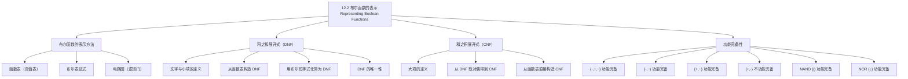

**相关笔记：** [[12.1 布尔函数]] | [[12.3 逻辑门]]

> [!abstract] 概览
> 本节讨论布尔函数的==表示方法==与==功能完备性==两个核心问题。首先介绍了布尔函数的三种等价表示方式（函数表、布尔表达式、电路图），然后详细讲解了如何将任意布尔函数表示为==积之和展开式==（sum-of-products expansion），也称==析取范式==（disjunctive normal form, DNF）。接着介绍了对应的==和之积展开式==（product-of-sums expansion），即==合取范式==（conjunctive normal form, CNF）。最后证明了运算集合 $\{\cdot, +, \bar{\phantom{x}}\}$ 是==功能完备的==（functionally complete），并进一步展示了 $\{\cdot, \bar{\phantom{x}}\}$、$\{+, \bar{\phantom{x}}\}$ 甚至单个运算符 $\{\mid\}$（NAND）和 $\{\downarrow\}$（NOR）也都是功能完备的。
>
> - ==函数表==：列出所有输入组合及其对应输出值的表格
> - ==文字（literal）==：布尔变量或其补
> - ==小项（minterm）==：每个变量恰好出现一次（原变量或补变量）的布尔积
> - ==积之和展开式（DNF）==：小项的布尔和，表示布尔函数
> - ==和之积展开式（CNF）==：大项的布尔积，表示布尔函数
> - ==功能完备性==：一组运算符能表示所有布尔函数的性质
> - ==NAND（$\mid$）==：$1 \mid 1 = 0$，其余为 $1$；$\{\mid\}$ 功能完备
> - ==NOR（$\downarrow$）==：$0 \downarrow 0 = 1$，其余为 $0$；$\{\downarrow\}$ 功能完备

---

## 一、知识结构总览

---

## 二、核心思想

> [!tip] 核心思想
> 本节的核心思想是==每个布尔函数都可以被"标准化"为一种统一的代数形式==。积之和展开式（DNF）提供了一种系统化的方法，将任意布尔函数从函数表翻译为布尔表达式——只需找到所有使函数值为 $1$ 的输入组合，为每个组合构造一个小项，然后将所有小项用布尔和连接。这一方法不仅保证了表示的存在性，还引出了功能完备性的概念：什么样的运算集合足以表示所有布尔函数？答案令人惊讶——==仅用一个运算符（NAND 或 NOR）就足够了==，这对数字电路的设计具有深远意义。

### 1. 布尔函数的表示方法

> [!info] 三种等价表示
> 布尔函数可以通过以下三种方式等价地表示：
>
> 1. **函数表（真值表）**：列出所有 $2^n$ 种输入组合及其对应的输出值
> 2. **布尔表达式**：用布尔变量和 $\cdot, +, \bar{\phantom{x}}$ 运算构成的代数表达式
> 3. **电路图**：用逻辑门（AND、OR、NOT）连接而成的组合电路（将在 12.3 节详细讨论）
>
> 本节的核心任务之一是：==给定函数表，如何构造对应的布尔表达式==。

### 2. 积之和展开式（DNF）

> [!def] 文字（Literal）与小项（Minterm）
> - ==文字==（literal）：一个布尔变量或其补。例如 $x$、$\bar{x}$、$y$、$\bar{y}$ 都是文字
> - ==小项==（minterm）：$n$ 个变量的==布尔积== $y_1 y_2 \cdots y_n$，其中每个 $y_i$ 是第 $i$ 个变量或其补
>
> 关键性质：每个小项恰好在==一种==输入组合下取值为 $1$。具体地，小项 $y_1 y_2 \cdots y_n$ 取值为 $1$ 当且仅当每个 $y_i = 1$，即当 $y_i = x_i$ 时需要 $x_i = 1$，当 $y_i = \bar{x}_i$ 时需要 $x_i = 0$。

> [!example] 构造小项
> 构造一个小项，使其在 $x_1 = x_3 = 0$ 且 $x_2 = x_4 = x_5 = 1$ 时取值为 $1$，其余情况取值为 $0$。
>
> **解**：当变量应取 $0$ 时使用补变量，应取 $1$ 时使用原变量：
> $$\bar{x}_1 \cdot x_2 \cdot \bar{x}_3 \cdot x_4 \cdot x_5$$
>
> 验证：代入 $x_1 = 0, x_2 = 1, x_3 = 0, x_4 = 1, x_5 = 1$，得 $\bar{0} \cdot 1 \cdot \bar{0} \cdot 1 \cdot 1 = 1 \cdot 1 \cdot 1 \cdot 1 \cdot 1 = 1$。✅

> [!def] 积之和展开式 / 析取范式（DNF）
> 给定布尔函数 $F$，其==积之和展开式==（sum-of-products expansion）或==析取范式==（disjunctive normal form, DNF）是所有使 $F$ 取值为 $1$ 的输入组合对应的小项的布尔和。
>
> 构造方法：
> 1. 在函数表中找到所有使 $F = 1$ 的行
> 2. 为每一行构造对应的小项（$1$ 取原变量，$0$ 取补变量）
> 3. 将所有小项用 $+$ 连接

> [!example] 从函数表构造 DNF
> 给定函数 $F(x, y, z)$ 和 $G(x, y, z)$ 的函数表：
>
> | $x$ | $y$ | $z$ | $F$ | $G$ |
> |:---:|:---:|:---:|:---:|:---:|
> | 1 | 1 | 1 | 0 | 0 |
> | 1 | 1 | 0 | 0 | 1 |
> | 1 | 0 | 1 | 1 | 0 |
> | 1 | 0 | 0 | 0 | 0 |
> | 0 | 1 | 1 | 0 | 0 |
> | 0 | 1 | 0 | 0 | 1 |
> | 0 | 0 | 1 | 0 | 0 |
> | 0 | 0 | 0 | 0 | 0 |
>
> **$F$ 的 DNF**：$F = 1$ 仅在 $(1, 0, 1)$ 行，对应小项 $x\bar{y}z$。
> $$F(x, y, z) = x\bar{y}z$$
>
> **$G$ 的 DNF**：$G = 1$ 在 $(1, 1, 0)$ 和 $(0, 1, 0)$ 两行，对应小项分别为 $xy\bar{z}$ 和 $\bar{x}y\bar{z}$。
> $$G(x, y, z) = xy\bar{z} + \bar{x}y\bar{z}$$

> [!example] 用布尔恒等式将表达式化为 DNF
> 将 $F(x, y, z) = (x + y)\bar{z}$ 化为积之和展开式。
>
> **方法一：利用布尔恒等式展开**
> $$F(x, y, z) = (x + y)\bar{z}$$
> $$= x\bar{z} + y\bar{z} \quad \text{（分配律）}$$
> $$= x \cdot 1 \cdot \bar{z} + 1 \cdot y \cdot \bar{z} \quad \text{（同一律）}$$
> $$= x(y + \bar{y})\bar{z} + (x + \bar{x})y\bar{z} \quad \text{（幺元律：$1 = y + \bar{y} = x + \bar{x}$）}$$
> $$= xy\bar{z} + x\bar{y}\bar{z} + xy\bar{z} + \bar{x}y\bar{z} \quad \text{（分配律）}$$
> $$= xy\bar{z} + x\bar{y}\bar{z} + \bar{x}y\bar{z} \quad \text{（幂等律：$xy\bar{z} + xy\bar{z} = xy\bar{z}$）}$$
>
> **方法二：构造函数表**
>
> | $x$ | $y$ | $z$ | $x+y$ | $\bar{z}$ | $F = (x+y)\bar{z}$ |
> |:---:|:---:|:---:|:-----:|:--------:|:------------------:|
> | 1 | 1 | 1 | 1 | 0 | 0 |
> | 1 | 1 | 0 | 1 | 1 | 1 |
> | 1 | 0 | 1 | 1 | 0 | 0 |
> | 1 | 0 | 0 | 1 | 1 | 1 |
> | 0 | 1 | 1 | 1 | 0 | 0 |
> | 0 | 1 | 0 | 1 | 1 | 1 |
> | 0 | 0 | 1 | 0 | 0 | 0 |
> | 0 | 0 | 0 | 0 | 1 | 0 |
>
> $F = 1$ 的行：$(1,1,0), (1,0,0), (0,1,0)$，对应小项为 $xy\bar{z}, x\bar{y}\bar{z}, \bar{x}y\bar{z}$。
> $$F(x, y, z) = xy\bar{z} + x\bar{y}\bar{z} + \bar{x}y\bar{z}$$
>
> 两种方法结果一致。✅

> [!thm] 每个布尔函数都有积之和展开式
> 每个布尔函数都可以表示为小项的布尔和（即 DNF）。
>
> **证明思路**：给定 $n$ 度布尔函数 $F$ 的函数表，对每个使 $F = 1$ 的输入组合 $(b_1, \ldots, b_n)$，构造小项 $m = y_1 y_2 \cdots y_n$，其中 $y_i = x_i$（若 $b_i = 1$）或 $y_i = \bar{x}_i$（若 $b_i = 0$）。这个小项恰好在 $(b_1, \ldots, b_n)$ 处取值为 $1$，在其他所有输入组合处取值为 $0$。将这些小项用 $+$ 连接，得到的布尔和在 $F = 1$ 的所有输入处取值为 $1$，在 $F = 0$ 的所有输入处取值为 $0$，因此精确地表示了 $F$。
>
> $\blacksquare$

### 3. 和之积展开式（CNF）

> [!def] 和之积展开式 / 合取范式（CNF）
> 与积之和展开式对偶的概念是==和之积展开式==（product-of-sums expansion）或==合取范式==（conjunctive normal form, CNF）。
>
> - ==大项（maxterm）==：$n$ 个变量的布尔和 $\bar{y}_1 + \bar{y}_2 + \cdots + \bar{y}_n$（或等价地，$y_1 + y_2 + \cdots + y_n$，其中 $y_i$ 的取法与小项相反），每个大项恰好在一种输入组合下取值为 $0$
> - CNF 是所有使 $F = 0$ 的输入组合对应的大项的布尔积
>
> CNF 可以通过取 DNF 的对偶来得到，也可以直接从函数表中构造（找到所有 $F = 0$ 的行，为每行构造大项，用 $\cdot$ 连接）。

> [!example] 构造 CNF
> 对上例中的 $F(x, y, z) = (x + y)\bar{z}$，$F = 0$ 的行有 $(1,1,1), (1,0,1), (0,0,1), (0,0,0)$。
>
> 对应的大项分别为：
> - $(1,1,1)$：$\bar{x} + \bar{y} + \bar{z}$
> - $(1,0,1)$：$\bar{x} + y + \bar{z}$
> - $(0,0,1)$：$x + y + \bar{z}$
> - $(0,0,0)$：$x + y + z$
>
> $$F(x, y, z) = (\bar{x} + \bar{y} + \bar{z})(\bar{x} + y + \bar{z})(x + y + \bar{z})(x + y + z)$$

### 4. 功能完备性

> [!def] 功能完备性（Functional Completeness）
> 一组布尔运算符称为==功能完备的==（functionally complete），如果每个布尔函数都能用这些运算符表示的表达式来表示。

> [!thm] $\{\cdot, +, \bar{\phantom{x}}\}$ 是功能完备的
> 每个布尔函数都可以表示为积之和展开式（DNF），而 DNF 仅使用 $\cdot$、$+$ 和 $\bar{\phantom{x}}$ 三种运算。因此 $\{\cdot, +, \bar{\phantom{x}}\}$ 是功能完备的。

> [!thm] 更小的功能完备集合
>
> **（1）$\{\cdot, \bar{\phantom{x}}\}$ 是功能完备的**
>
> 利用德摩根律和对合律，可以消去所有布尔和：
> $$x + y = \overline{\overline{x + y}} = \overline{\bar{x} \cdot \bar{y}}$$
>
> 因此任何使用 $\{\cdot, +, \bar{\phantom{x}}\}$ 的表达式都可以改写为仅使用 $\{\cdot, \bar{\phantom{x}}\}$ 的表达式。
>
> **（2）$\{+, \bar{\phantom{x}}\}$ 是功能完备的**
>
> 利用另一条德摩根律和对合律，可以消去所有布尔积：
> $$xy = \overline{\overline{xy}} = \overline{\bar{x} + \bar{y}}$$
>
> 因此 $\{+, \bar{\phantom{x}}\}$ 也是功能完备的。
>
> **（3）$\{+, \cdot\}$ 不是功能完备的**
>
> 仅使用 $+$ 和 $\cdot$ 无法表示补函数 $F(x) = \bar{x}$。因为对任何仅含 $+$ 和 $\cdot$ 的表达式，当所有变量取值为 $0$ 时，表达式的值为 $0$；当所有变量取值为 $1$ 时，表达式的值为 $1$。但 $\bar{x}$ 在 $x = 0$ 时为 $1$，在 $x = 1$ 时为 $0$，不可能用 $+$ 和 $\cdot$ 表示。

> [!def] NAND 运算符与 NOR 运算符
> - ==NAND==（Not AND，记为 $\mid$）：$1 \mid 1 = 0$，$1 \mid 0 = 0 \mid 1 = 0 \mid 0 = 1$
> - ==NOR==（Not OR，记为 $\downarrow$）：$1 \downarrow 1 = 1 \downarrow 0 = 0 \downarrow 1 = 0$，$0 \downarrow 0 = 1$

> [!thm] NAND 和 NOR 各自功能完备
>
> **$\{\mid\}$（NAND）是功能完备的**：
>
> 因为 $\{\cdot, \bar{\phantom{x}}\}$ 功能完备，只需证明 $\cdot$ 和 $\bar{\phantom{x}}$ 都可以用 $\mid$ 表示：
> $$\bar{x} = x \mid x$$
> $$xy = \overline{\overline{xy}} = \overline{(x \mid y)} = (x \mid y) \mid (x \mid y)$$
>
> **$\{\downarrow\}$（NOR）是功能完备的**：
>
> 类似地，$\bar{x} = x \downarrow x$，$x + y = (x \downarrow y) \downarrow (x \downarrow y)$，再利用 $xy = \overline{\bar{x} + \bar{y}}$ 即可表示所有运算。
>
> 这意味着==仅用一种逻辑门（NAND 门或 NOR 门）就可以构建任意布尔函数的电路==，这对简化电路设计具有重要意义。

> [!warning] 注意：功能完备性的实用意义
> 虽然 $\{\mid\}$ 和 $\{\downarrow\}$ 在理论上功能完备，但在实际电路设计中，使用单一 NAND/NOR 门构建的电路通常比使用 AND/OR/NOT 门组合的电路需要更多的门。功能完备性主要的理论价值在于：(1) 证明了布尔运算的冗余性；(2) 为集成电路的标准化设计提供了基础（许多 IC 芯片只提供 NAND 门）。

---

## 三、补充理解与易混淆点

### 补充理解

> [!info] 补充1：DNF/CNF 与命题逻辑的联系
> 析取范式（DNF）和合取范式（CNF）与第 1 章命题逻辑中的概念直接对应。在命题逻辑中，DNF 是==主析取范式==（由若干小项的析取构成），CNF 是==主合取范式==（由若干大项的合取构成）。两者的翻译规则完全一致：布尔和 $\leftrightarrow$ 析取 $\vee$，布尔积 $\leftrightarrow$ 合取 $\wedge$，补 $\leftrightarrow$ 否定 $\neg$，$0 \leftrightarrow F$，$1 \leftrightarrow T$。DNF 和 CNF 在命题逻辑中用于判断命题公式的类型（重言式、矛盾式、可满足式），在布尔代数中用于标准化布尔函数的表示，在数字电路中用于系统化地设计组合逻辑电路。
>
> > 来源：Rosen, K. H. (2019). Discrete Mathematics and Its Applications (8th ed.), McGraw-Hill, Section 12.2.

> [!info] 补充2：功能完备性的理论背景
> 功能完备性的概念由波兰裔美国数学家==Emil Post== 于 1921 年在其经典论文中首次系统研究。Post 证明了：要判断一组布尔运算是否功能完备，只需验证该运算集合能否表示以下五个"封闭类"之外的函数：(1) 保持 $0$ 的函数类 $T_0$；(2) 保持 $1$ 的函数类 $T_1$；(3) 单调函数类 $M$；(4) 自对偶函数类 $D$；(5) 线性函数类 $L$。这就是著名的==Post 完备性定理==（Post's completeness theorem）。NAND 和 NOR 之所以各自功能完备，正是因为它们不属于上述任何一个封闭类。
>
> > 来源：Post, E. L. (1921). "Introduction to a General Theory of Elementary Propositions." American Journal of Mathematics, 43(3), 163–185.

### 易混淆点

> [!warning] 误区1：DNF 中的小项必须包含所有变量
> - ❌ 认为 $xy + \bar{x}z$ 已经是 DNF
> - ✅ 严格意义上的 DNF（即积之和展开式）中，每个乘积项（小项）必须==包含所有变量==（以原变量或补变量的形式各出现恰好一次）。$xy + \bar{x}z$ 缺少变量 $z$（第一项）和 $y$（第二项），不是标准 DNF
> - 但在实际应用中，"DNF"一词有时也泛指"乘积项之和"的形式（不一定每个项都包含所有变量），需要注意上下文区分

> [!warning] 误区2：$\{+, \cdot\}$ 不功能完备
> - ❌ 认为 $\{+, \cdot\}$ 能表示所有布尔函数（因为它们是两种基本运算）
> - ✅ $\{+, \cdot\}$ 无法表示补运算 $\bar{x}$。关键观察：仅用 $+$ 和 $\cdot$ 构造的表达式具有"单调性"——将某个变量从 $0$ 改为 $1$ 不会使表达式的值从 $1$ 变为 $0$。但 $\bar{x}$ 不满足单调性（$x = 0 \Rightarrow \bar{x} = 1$，$x = 1 \Rightarrow \bar{x} = 0$），因此无法用 $+$ 和 $\cdot$ 表示

> [!warning] 误区3：NAND 不是 NOR
> - ❌ 混淆 NAND（$\mid$）和 NOR（$\downarrow$）的运算规则
> - ✅ NAND = "Not AND"：只有当两个输入都为 $1$ 时输出 $0$，否则输出 $1$
> - ✅ NOR = "Not OR"：只有当两个输入都为 $0$ 时输出 $1$，否则输出 $0$
> - 记忆口诀：NAND 是 AND 的否定（全 $1$ 才 $0$），NOR 是 OR 的否定（全 $0$ 才 $1$）

---

## 四、习题精选

> [!todo] 习题概览
> | 题号范围 | 核心考点 | 难度 |
> |---------|---------|------|
> | 1-2 | 从函数表构造 DNF | ⭐⭐ |
> | 3-4 | 用布尔恒等式展开为 DNF | ⭐⭐⭐ |
> | 5-6 | 求布尔函数的 CNF | ⭐⭐ |
> | 7-8 | DNF 与 CNF 的互化 | ⭐⭐⭐ |
> | 10 | 直接构造 CNF | ⭐⭐ |
> | 14-16 | NAND/NOR 的功能完备性验证 | ⭐⭐ |
> | 19 | 证明 $\{+, \cdot\}$ 不功能完备 | ⭐⭐⭐ |

### 题1：从函数表构造 DNF

> [!problem] 题目
> 给定布尔函数 $F(x, y, z)$ 的函数表如下，求其积之和展开式（DNF）。
>
> | $x$ | $y$ | $z$ | $F$ |
> |:---:|:---:|:---:|:---:|
> | 1 | 1 | 1 | 1 |
> | 1 | 1 | 0 | 0 |
> | 1 | 0 | 1 | 1 |
> | 1 | 0 | 0 | 0 |
> | 0 | 1 | 1 | 0 |
> | 0 | 1 | 0 | 1 |
> | 0 | 0 | 1 | 0 |
> | 0 | 0 | 0 | 1 |

> [!faq]- 解答
> $F = 1$ 的行有 4 行：$(1,1,1), (1,0,1), (0,1,0), (0,0,0)$。
>
> 对应的小项：
> - $(1,1,1) \to xyz$
> - $(1,0,1) \to x\bar{y}z$
> - $(0,1,0) \to \bar{x}y\bar{z}$
> - $(0,0,0) \to \bar{x}\bar{y}\bar{z}$
>
> $$F(x, y, z) = xyz + x\bar{y}z + \bar{x}y\bar{z} + \bar{x}\bar{y}\bar{z}$$

### 题2：用布尔恒等式展开为 DNF

> [!problem] 题目
> 将 $F(x, y, z) = x(y + \bar{z})$ 展开为积之和展开式。

> [!faq]- 解答
> $$F(x, y, z) = x(y + \bar{z})$$
> $$= xy + x\bar{z} \quad \text{（分配律）}$$
> $$= xy(z + \bar{z}) + x(y + \bar{y})\bar{z} \quad \text{（幺元律）}$$
> $$= xyz + xy\bar{z} + xy\bar{z} + x\bar{y}\bar{z} \quad \text{（分配律）}$$
> $$= xyz + xy\bar{z} + x\bar{y}\bar{z} \quad \text{（幂等律）}$$

### 题3：构造 CNF

> [!problem] 题目
> 求题 1 中函数 $F(x, y, z)$ 的和之积展开式（CNF）。

> [!faq]- 解答
> $F = 0$ 的行有 4 行：$(1,1,0), (1,0,0), (0,1,1), (0,0,1)$。
>
> 对应的大项（$0$ 取原变量，$1$ 取补变量）：
> - $(1,1,0) \to \bar{x} + \bar{y} + z$
> - $(1,0,0) \to \bar{x} + y + z$
> - $(0,1,1) \to x + \bar{y} + \bar{z}$
> - $(0,0,1) \to x + y + \bar{z}$
>
> $$F(x, y, z) = (\bar{x} + \bar{y} + z)(\bar{x} + y + z)(x + \bar{y} + \bar{z})(x + y + \bar{z})$$

### 题4：NAND 功能完备性验证

> [!problem] 题目
> 仅使用 NAND 运算符 $\mid$，表示以下布尔函数：(a) $\bar{x}$；(b) $xy$；(c) $x + y$。

> [!faq]- 解答
> (a) $\bar{x} = x \mid x$
>
> 验证：$0 \mid 0 = 1 = \bar{0}$，$1 \mid 1 = 0 = \bar{1}$。✅
>
> (b) $xy = \overline{\overline{xy}} = (x \mid y) \mid (x \mid y)$
>
> 验证：以 $x = 1, y = 1$ 为例：$1 \mid 1 = 0$，$0 \mid 0 = 1 = 1 \cdot 1$。✅
>
> (c) $x + y = \overline{\bar{x} \cdot \bar{y}} = \overline{\bar{x}} \mid \overline{\bar{y}} = (x \mid x) \mid (y \mid y)$
>
> 验证：以 $x = 1, y = 0$ 为例：$1 \mid 1 = 0$，$0 \mid 0 = 1$，$0 \mid 1 = 1 = 1 + 0$。✅

### 题5：证明 $\{+, \cdot\}$ 不功能完备

> [!problem] 题目
> 证明仅使用 $+$ 和 $\cdot$ 运算无法表示布尔函数 $F(x) = \bar{x}$。

> [!faq]- 解答
> **证明**：对仅含 $+$ 和 $\cdot$ 的布尔表达式 $E(x_1, x_2, \ldots, x_n)$，可以证明以下性质：
>
> 若 $E(a_1, a_2, \ldots, a_n) = 1$ 且对所有 $i$ 有 $a_i \leq b_i$（即 $a_i = 0 \Rightarrow b_i$ 可为 $0$ 或 $1$，$a_i = 1 \Rightarrow b_i = 1$），则 $E(b_1, b_2, \ldots, b_n) = 1$。
>
> 这是因为：
> - $0 + 0 = 0$，$0 + 1 = 1$，$1 + 0 = 1$，$1 + 1 = 1$（$+$ 是单调不减的）
> - $0 \cdot 0 = 0$，$0 \cdot 1 = 0$，$1 \cdot 0 = 0$，$1 \cdot 1 = 1$（$\cdot$ 是单调不减的）
> - 单调不减函数的复合仍然是单调不减的
>
> 但 $\bar{x}$ 不满足单调性：$\bar{0} = 1 > 0 = \bar{1}$，即 $0 < 1$ 但 $\bar{0} > \bar{1}$。
>
> 因此 $\bar{x}$ 不可能用 $+$ 和 $\cdot$ 表示，$\{+, \cdot\}$ 不是功能完备的。
>
> $\blacksquare$

> [!tip] 解题思路提示
> 布尔函数表示问题的解题方法论：
> 1. **从函数表构造 DNF**：找到所有 $F = 1$ 的行，每行构造一个小项，用 $+$ 连接
> 2. **从函数表构造 CNF**：找到所有 $F = 0$ 的行，每行构造一个大项，用 $\cdot$ 连接
> 3. **用恒等式展开为 DNF**：反复使用分配律展开乘积，用幺元律（$x + \bar{x} = 1$）补全缺失变量，用幂等律合并重复项
> 4. **验证功能完备性**：证明目标运算集合能表示 $\{\cdot, \bar{\phantom{x}}\}$ 或 $\{+, \bar{\phantom{x}}\}$（因为它们已知功能完备）
> 5. **证明不功能完备**：找到一个不能用目标集合表示的布尔函数（如 $\bar{x}$ 对 $\{+, \cdot\}$）

---

## 五、视频学习指南

> [!info] 视频资源
> | 资源 | 链接 | 对应内容 | 备注 |
> |:-----|:-----|:---------|:-----|
> | Rosen 8e Section 12.2 | [教材原文](https://www.mheducation.com/highered/product/discrete-mathematics-applications-rosen/M9781259676512.html) | 完整定义、定理与例题 | 英文教材 |
> | Neso Academy - DNF & CNF | [链接](https://www.youtube.com/watch?v=ak8Pp9R3K1U) | 标准形的构造方法 | 英文，适合入门 |
> | Ben Eater - NAND Logic | [链接](https://www.youtube.com/watch?v=FnZg0ERnFug) | 用 NAND 门构建计算机 | 英文，实践导向 |

---

## 六、教材原文

> [!quote] 教材原文
> "Two important problems of Boolean algebra will be studied in this section. The first problem is: Given the values of a Boolean function, how can a Boolean expression that represents this function be found? ... The second problem is: Is there a smaller set of operators that can be used to represent all Boolean functions?"
>
> "A literal is a Boolean variable or its complement. A minterm of the Boolean variables $x_1, x_2, \ldots, x_n$ is a Boolean product $y_1 y_2 \cdots y_n$, where $y_i = x_i$ or $y_i = \bar{x}_i$."
>
> "The sum of minterms that represents the function is called the sum-of-products expansion or the disjunctive normal form of the Boolean function."
>
> "Because every Boolean function can be represented using these operators we say that the set $\{\cdot, +, \bar{\phantom{x}}\}$ is functionally complete."
>
> "Both of the sets $\{\mid\}$ and $\{\downarrow\}$ are functionally complete."
>
> —— Rosen, Section 12.2, pp. 855–857

---

## 参见 Wiki

- [[离散数学/concepts/命题逻辑]] -- DNF/CNF 与主析取/合取范式的对应（第1章）
- [[离散数学/concepts/逻辑等价]] -- 布尔恒等式与逻辑等价式的翻译（第1章）

#学习/离散数学/布尔代数
